# Evaluation

## 1. How do you evaluate an LLM's output beyond "it looks correct"

Mechanism intermediate

**TL;DR.** Combine automatic metrics (exact match, F1, tests), an LLM-as-judge with a rubric for open-ended quality, and human review on a held-out set; track regressions.

**Key points.**

- Automatic metrics where deterministic (EM, F1, tests).
- LLM-as-judge with a rubric for open-ended quality.
- Human review on a sample.
- Held-out set + regression tracking.

**Concept.** Combine automatic metrics (exact match, F1, ROUGE/BLEU where applicable, functional/tests for code), an LLM-as-judge with a rubric for open-ended quality, and human review for a sample. Build a held-out eval set with representative and adversarial cases, score consistently, and track regressions across changes. The judge itself must be validated against human agreement; a single metric rarely captures "quality".

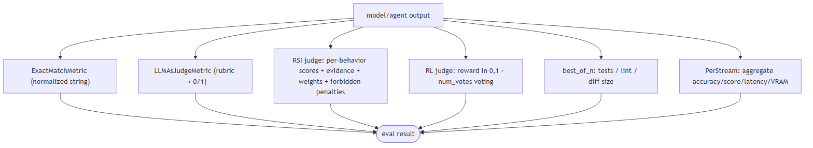

**In Jiuwen.** Jiuwen has several eval layers: the agent-evolution evaluator provides a base evaluator plus exact-match and LLM-judge metrics; the RSI judge uses a structured rubric with per-behavior scores, evidence, and penalties; the online RL judge scores turns with voting; and an example harness scores with a judge. There is no retrieval metric, no golden set, and the judges do not see retrieved context.

<b>Under the hood</b>

**Implementation**

Several independent eval layers exist. `agent_evolving/evaluator/` provides `BaseEvaluator`/`DefaultEvaluator` plus `Metric`s: `ExactMatchMetric` (normalized string match) and `LLMAsJudgeMetric` (model judge returns 0/1 with a template). The RSI subsystem has a rigorous LLM-as-judge contract requiring a structured JSON verdict with per-behavior scores, evidence, weights, and forbidden-behavior penalties. The online RL judge scores single turns as reward with `num_votes` voting. PerStream uses GPT-3.5 as a judge and aggregates accuracy/score/latency/VRAM, and `rsi best_of_n` scores workspaces by test pass counts, diff size, and lint errors. `EvolutionPipeline` runs an agent against a benchmark for N iterations and reports pass rate/convergence.

**Code anchors**

| Code anchor | What it points to |
|---|---|
| `agent-core/openjiuwen/agent_evolving/evaluator/metrics/llm_as_judge.py:17-66` | LLMAsJudgeMetric; agent-core/openjiuwen/agent_evolving/evaluator/metrics/exact_match.py:12-45 — ExactMatchMetric; agent-core/openjiuwen/agent_evolving/evaluator/metrics/__init__.py:7-11 registry |
| `agent-core/openjiuwen/agent_evolving/evaluator/evaluator.py:1-9` | DefaultEvaluator / MetricEvaluator |
| `agent-core/openjiuwen/rsi/harness_rsi/evaluator/judger/scoring.py:57-88` | rubric/required/forbidden contract; :167-214 weighted scoring + evidence |
| `agent-core/openjiuwen/agent_evolving/agent_rl/online/judge/judge_scorer.py:28-104` | judge reward, num_votes |
| `agent-core/examples/PerStream/src/eval/score_passive_judge.py:28-124` | GPT-3.5 judge; :247-366 aggregate metrics |
| `agent-core/openjiuwen/rsi/auto_harness/pipelines/best_of_n/attempt_scorer.py:17-119` | tests/lint/diff scoring |
| `agent-core/openjiuwen/symphony/evaluation/evaluators.py:1-16` | static/trace evaluators incl. LLMJudgeEvaluator |

---

## 2. Why evaluate retrieval and generation as two separate stages instead of one end-to-end score

Mechanism intermediate

**TL;DR.** An end-to-end score says 'wrong' but not why: if retrieval missed the doc, no generator can fix it; if the doc was retrieved, it's a generation/grounding failure.

**Key points.**

- Separate stages → attribution.
- A retrieval miss can't be fixed by the generator.
- Retrieved-but-wrong = generation/grounding.

**Concept.** An end-to-end score tells you "the answer was wrong" but not why. If retrieval missed the document, no generator can fix it; if the document was retrieved but the answer is wrong, the generator (or grounding) is at fault. Stage-level metrics — Recall@k / precision@k / NDCG for retrieval, faithfulness / correctness for generation — let you attribute the failure and fix the right component. End-to-end stays as the final acceptance check.

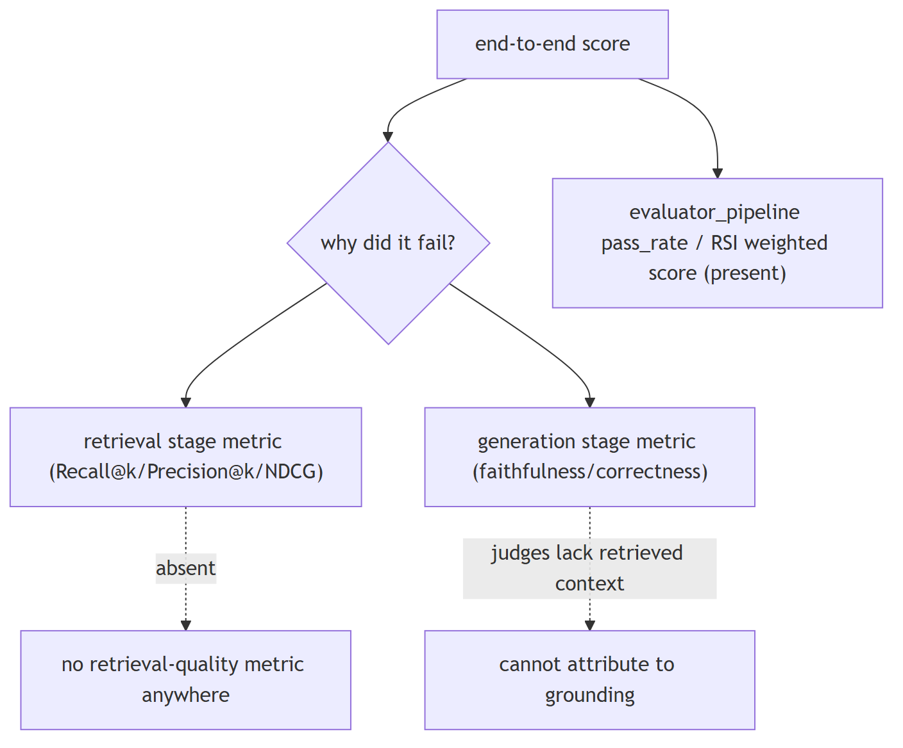

**In Jiuwen.** In Jiuwen the two stages are structurally separate but also separately un-instrumented: retrieval has no quality metric (no recall, precision, MRR, or NDCG), and the answer-level judges never receive the retrieved context. So it can produce an end-to-end score but cannot attribute a failure to retrieval versus generation.

<b>Under the hood</b>

**Implementation**

The stages are structurally separate but also separately un-instrumented. Retrieval (`core/retrieval`) has no quality metric of any kind (no Recall@k/Precision@k/MRR/NDCG). Generation has answer-level judges that do not receive the retrieved context. So the codebase can produce end-to-end grader scores (`evaluator_pipeline` `pass_rate`, RSI weighted score) but cannot say whether a failure was retrieval or generation.

**Code anchors**

| Code anchor | What it points to |
|---|---|
| `agent-core/openjiuwen/agent_evolving/evaluator/metrics/base.py:42` | Metric.compute(prediction, label), no ranked-list/k signature |
| `agent-core/openjiuwen/agent_evolving/evaluator/metrics/__init__.py:11` | exports only Metric, ExactMatchMetric, LLMAsJudgeMetric |
| `agent-core/openjiuwen/agent_evolving/evaluator/metrics/llm_as_judge.py:47` | judge gets question/expected/answer, not retrieved context |
| `agent-core/openjiuwen/agent_evolving/evaluator/evaluator_pipeline/pipeline.py:311` | end-to-end pass_rate |
| `agent-core/openjiuwen/rsi/harness_rsi/evaluator/judger/scoring.py:193` | end-to-end weighted score |

---

## 3. Why exact-match scoring fails when a correct answer can be phrased multiple valid ways

Mechanism intermediate

**TL;DR.** Exact match needs the output to equal the reference, so 'Paris' and 'The capital is Paris' both fail despite being correct; it's brittle to wording and format.

**Key points.**

- Requires full-string equality.
- Brittle to wording, articles, ordering.
- Use only on constrained answers; judge for paraphrase.

**Concept.** Exact match requires the output string to equal the reference, so "Paris" vs "The capital is Paris" both fail even when correct. It is brittle to wording, formatting, articles, and ordering. Use it only for tasks with a canonical form (classification labels, IDs, single tokens); otherwise use semantic/normalized metrics (LLM judge, embedding similarity, or task-specific parsers).

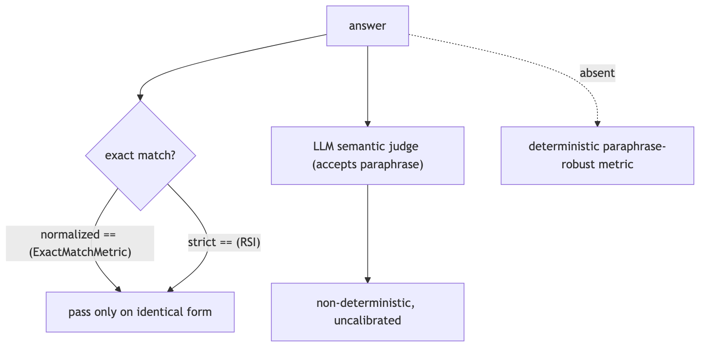

**In Jiuwen.** There are two exact-match implementations: one normalizes case and whitespace but still requires full-string equality, and the RSI judge is strict equality with no normalization. Paraphrase is covered only by the LLM judges, so exact match should be reserved for constrained answers.

<b>Under the hood</b>

**Implementation**

Two exact-match implementations exist. `ExactMatchMetric` normalizes lowercase/strip/whitespace but still requires full-string equality; RSI's `ExactMatchJudger` is strict `==` with no normalization. The LLM judges cover paraphrase — the `LLMAsJudgeMetric` prompt judges semantic consistency, and PerStream's GPT judge explicitly accepts synonyms/paraphrases — but they are non-deterministic and uncalibrated, and there is no deterministic paraphrase-robust metric (e.g. normalized/embedding similarity).

**Code anchors**

| Code anchor | What it points to |
|---|---|
| `agent-core/openjiuwen/agent_evolving/evaluator/metrics/exact_match.py:36` | normalized equality; :40 _normalize (lower/strip/collapse) |
| `agent-core/openjiuwen/rsi/harness_rsi/evaluator/judger/exact_match.py:50` | strict == expected; :30 rejects rubric/files |
| `agent-core/openjiuwen/agent_evolving/evaluator/metrics/llm_as_judge.py:4` | semantic consistency judge |
| `agent-core/openjiuwen/symphony/evaluation/evaluators.py:520` | exact-match shortcut then LLM fallback |
| `agent-core/examples/PerStream/src/eval/score_passive_judge.py:57` | "Consider synonyms or paraphrases as valid matches" |

---

## 4. Recall@k, and what a low score tells you about your retrieval setup

Mechanism advanced

**TL;DR.** Fraction of a query's relevant documents retrieved in the top-k, averaged over queries (hit-rate when one relevant doc). A low score means retrieval is missing content.

**Key points.**

- Recall@k = relevant-in-top-k / total relevant.
- Low → retrieval (embedding/chunking/query) is failing.
- Distinguishes missing content from ranking issues.

**Concept.** Recall@k is the fraction of a query's relevant documents that are retrieved in the top-k, averaged over queries (when each query has exactly one relevant document this reduces to hit-rate/success@k). A low score means retrieval (not generation) is the failure: relevant content is missing from the candidate set, so no reranker or prompt can recover it. Diagnose by checking chunking (answer split/lost), embedding fit, whether the query and index use the same model, and whether exact-match terms need a sparse leg.

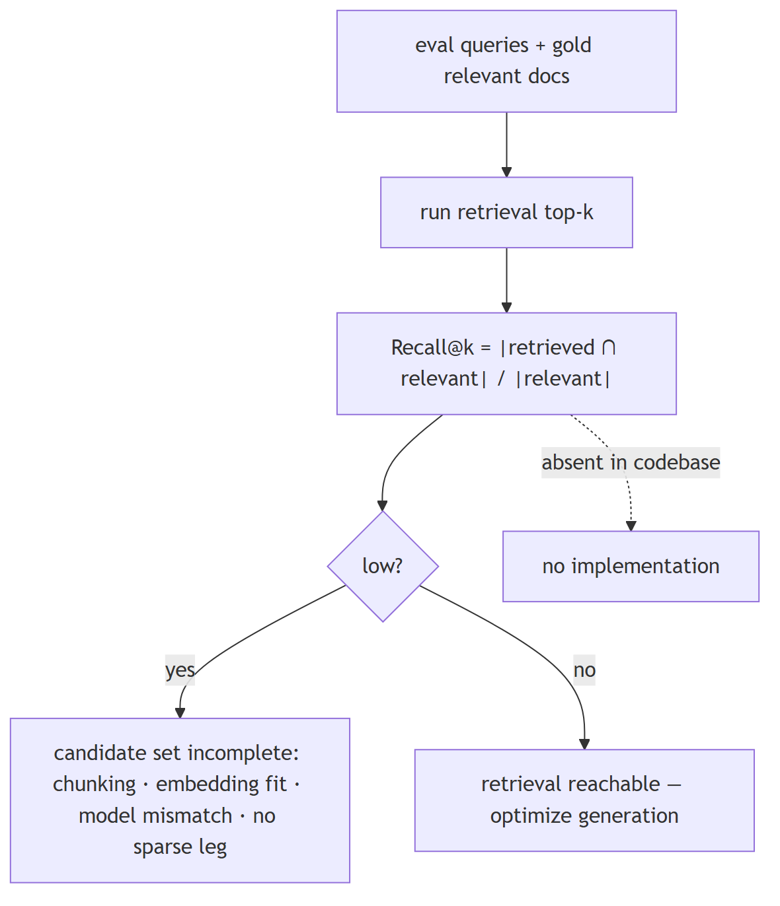

**In Jiuwen.** Jiuwen has no Recall@k implementation. The only recall-looking code is a classification evaluator for the proactive-memory gate in an example, which is not ranked retrieval against gold documents. Recall must be computed externally with your own labeled set.

<b>Under the hood</b>

**Implementation**

There is no `Recall@k` implementation. The only recall-looking code is a **classification** evaluator for the proactive-memory gate in `examples/PerStream/src/eval/` ("TA (Recall)" = TP/(TP+FN) over proactive-memory moments), which is not ranking retrieval against gold documents. `recall_compressed_context` is named "recall" but is a BM25 lookup returning chunks, not a metric. Nothing computes retrieved-vs-relevant overlap at rank k.

**Code anchors**

| Code anchor | What it points to |
|---|---|
| `agent-core/examples/PerStream/src/eval/score_proactive_judge.py:355` | get_ta_recall = TP/(TP+FN) (classification, not retrieval@k) |
| `agent-core/examples/PerStream/src/eval/test_remember_gate.py:180` | sklearn recall_score (gate classifier) |
| `agent-core/examples/PerStream/src/eval/eval_proactive_reduction.py:92` | LLM-judged memory metrics |
| `agent-core/openjiuwen/core/context_engine/processor/forked/compressor/recall/retriever.py:27` | recall_compressed_context (name only) |

---

## 5. How does Precision@k differ from Recall@k?

Mechanism intermediate

**TL;DR.** Fraction of the top-k that are relevant; trades off with recall — raising k raises recall and usually lowers precision.

**Key points.**

- Precision@k = relevant-in-top-k / k.
- Higher k → recall up, precision usually down.
- Both can look fine while real quality is poor.

**Concept.** Precision@k is the fraction of the top-k that are relevant; recall@k is the fraction of all relevant documents that were retrieved. They trade off: raising k raises recall but usually lowers precision.

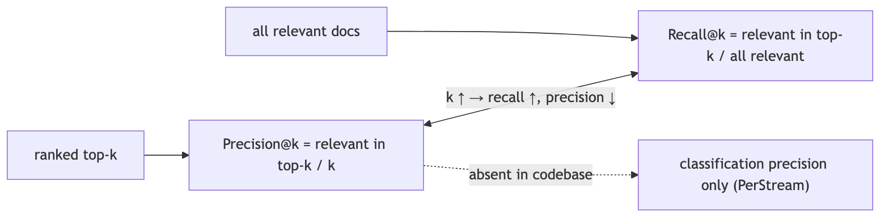

**In Jiuwen.** Precision@k is absent; the only precision present is classification/answer precision in an example and a gate test. The retrieval stack returns an ordered candidate list but never scores how many of the top-k were relevant, so retrieval precision must be measured externally.

<b>Under the hood</b>

**Implementation**

Precision@k is **absent**. The only precision present is classification/answer precision: PerStream's “TV (Precision)” = TP/(TP+FP) and sklearn `precision_score` in a gate test. The retrieval stack returns an ordered candidate list and a cross-encoder can re-sort it, but never compares the ordering to graded relevance.

**Code anchors**

| Code anchor | What it points to |
|---|---|
| `agent-core/examples/PerStream/src/eval/score_proactive_judge.py:362` | `get_tv_precision()` = `tp / total_pred_not_nil` |
| `agent-core/examples/PerStream/src/eval/eval_proactive_reduction.py:188` | `tv_precision` |
| `agent-core/examples/PerStream/src/eval/test_remember_gate.py:22` | sklearn `precision_score` |
| `agent-core/openjiuwen/core/foundation/store/graph/milvus/milvus_support.py:87` | `rerank(...)` re-sorts, no precision measurement |

---

## 6. Why can precision and recall both look fine while the pipeline is broken?

Mechanism intermediate

**TL;DR.** Both can be low when embedding/chunking is wrong or the corpus lacks the answer — a plausible top-3 can be mostly irrelevant.

**Key points.**

- Wrong embedding/chunking → nothing relevant ranked.
- Corpus lacks the answer → nothing to retrieve.
- Plausible output is not quality; measure it.

**Concept.** Both can be low even when the outputs look plausible: if the embedding or chunking is wrong, nothing relevant is ranked highly; and if the corpus simply lacks the answer, no retriever can find it. A plausible top-3 can still be mostly irrelevant — which is exactly why you need numbers, not vibes.

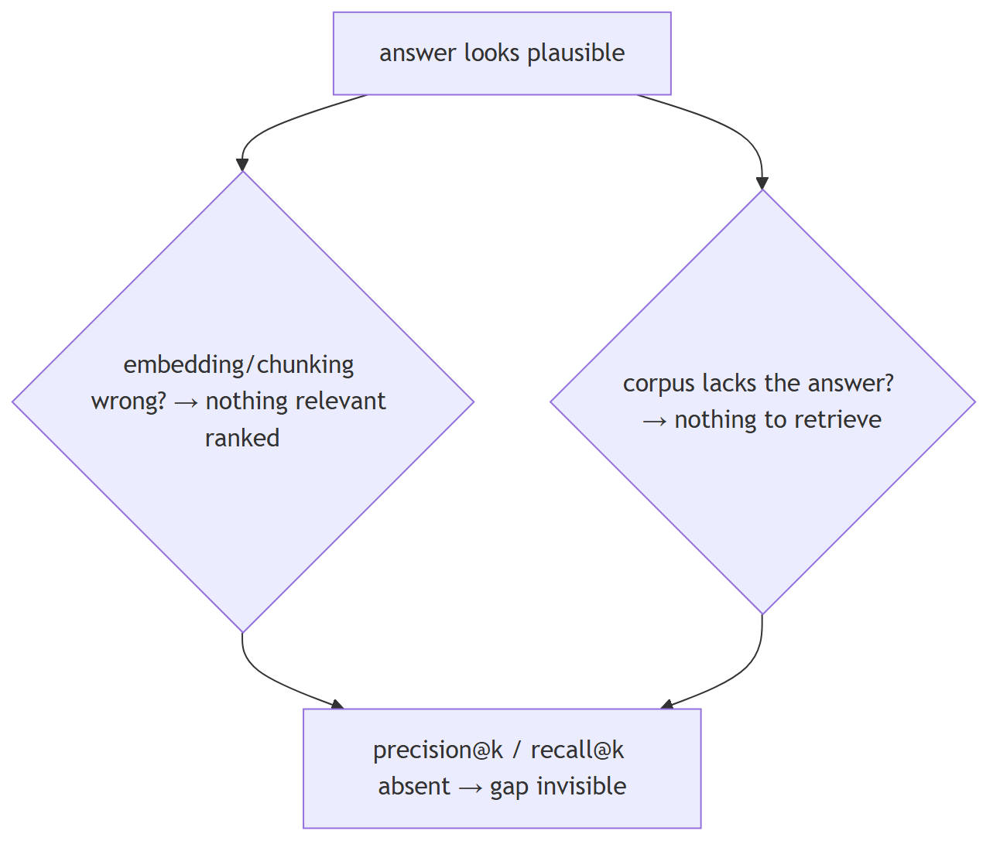

**In Jiuwen.** The retrieval stack ranks and can re-sort candidates, but never compares the ordering to graded relevance, and the evaluator zips predictions/labels without a relevance-per-rank notion — so the gap stays invisible.

<b>Under the hood</b>

**Implementation**

The retrieval stack produces an ordered candidate list — and a cross-encoder can re-sort it — but never compares that ordering against graded relevance, so there is no precision@k/recall@k to reveal the gap. Evaluation metrics zip predictions/labels without any relevance-per-rank notion.

**Code anchors**

| Code anchor | What it points to |
|---|---|
| `agent-core/openjiuwen/core/foundation/store/graph/milvus/milvus_support.py:87` | `rerank(...)` re-sorts, no precision measurement |
| `agent-core/openjiuwen/agent_evolving/evaluator/metrics/base.py:60` | `compute_batch` zips predictions/labels, no relevance-per-rank |

---

## 7. MRR, and when it matters more than Recall@k

Mechanism intermediate

**TL;DR.** Mean of 1/rank of the first relevant result; matters when the single best hit and its position are what count.

**Key points.**

- MRR = mean of 1/rank of first relevant hit.
- Best when one strong hit is needed (lookup/FAQ).
- Complements recall/NDCG.

**Concept.** MRR is the mean of `1/rank` of the first relevant result. It matters when the user/system mostly needs the single best hit and the position of the first correct answer is what counts (FAQ lookup, "open the right doc", navigation). Recall@k matters when a set of results is consumed together (context stuffing). MRR ignores everything after the first relevant hit, so it is blind to recall.

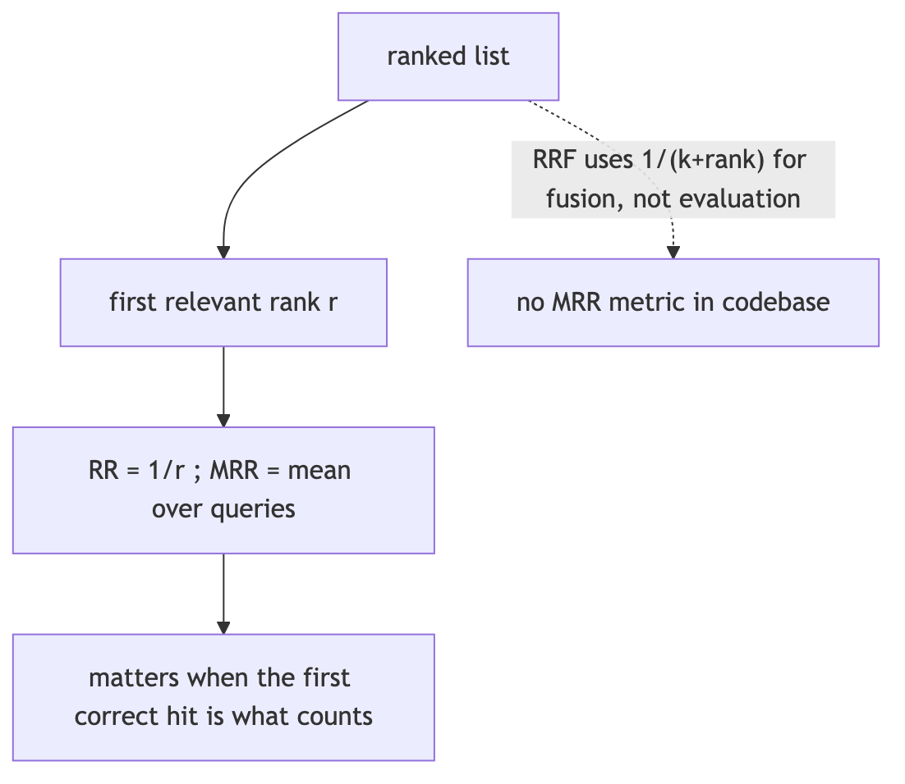

**In Jiuwen.** MRR is not implemented. The retrieval stack uses reciprocal rank fusion to merge candidate lists and a weighted score combination in the graph store — those are rank-fusion algorithms, not an evaluation metric — so MRR must be computed externally.

<b>Under the hood</b>

**Implementation**

MRR is not implemented anywhere; there is no reciprocal-rank or first-relevant-rank helper. The retrieval stack uses Reciprocal **Rank Fusion** (`rrf_fusion`, `1/(k+rank)`) and a separate weighted score combination (`WeightedRankConfig`) in the graph store — rank-fusion algorithms, not an evaluation metric. The product's `bm25_rank_to_score` converts an FTS5 rank to a similarity score, also not MRR.

**Code anchors**

| Code anchor | What it points to |
|---|---|
| `agent-core/openjiuwen/core/retrieval/utils/fusion.py:15` | rrf_fusion (rank fusion, not MRR) |
| `agent-core/openjiuwen/core/foundation/store/graph/result_ranking.py:85` | RRFRankConfig (k=40 fusion config); :61 WeightedRankConfig |
| `jiuwenswarm/jiuwenswarm/agents/harness/common/memory/internal.py:165` | bm25_rank_to_score (rank→score) |
| `agent-core/openjiuwen/core/foundation/store/index/simple_memory_index.py:348` | sorts by score only |

---

## 8. NDCG: weights relevant results by position against an ideal ranking — why position matters beyond "was it retrieved"

Mechanism intermediate

**TL;DR.** Discounts each relevant result by log2(rank+1) and normalizes by the ideal ordering, rewarding good positions and supporting graded relevance.

**Key points.**

- Discount by position (log2 rank+1).
- Normalize by the ideal ranking.
- Supports graded relevance.

**Concept.** NDCG discounts each relevant result by `log2(rank+1)` and normalizes by the ideal (best-possible) ordering, so it rewards putting the most relevant documents at the top and supports graded relevance (not just binary). It matters when ranking quality — not just presence — drives the user experience, and is the standard metric for reranker comparisons. Recall@k treats all positions within k equally; NDCG does not.

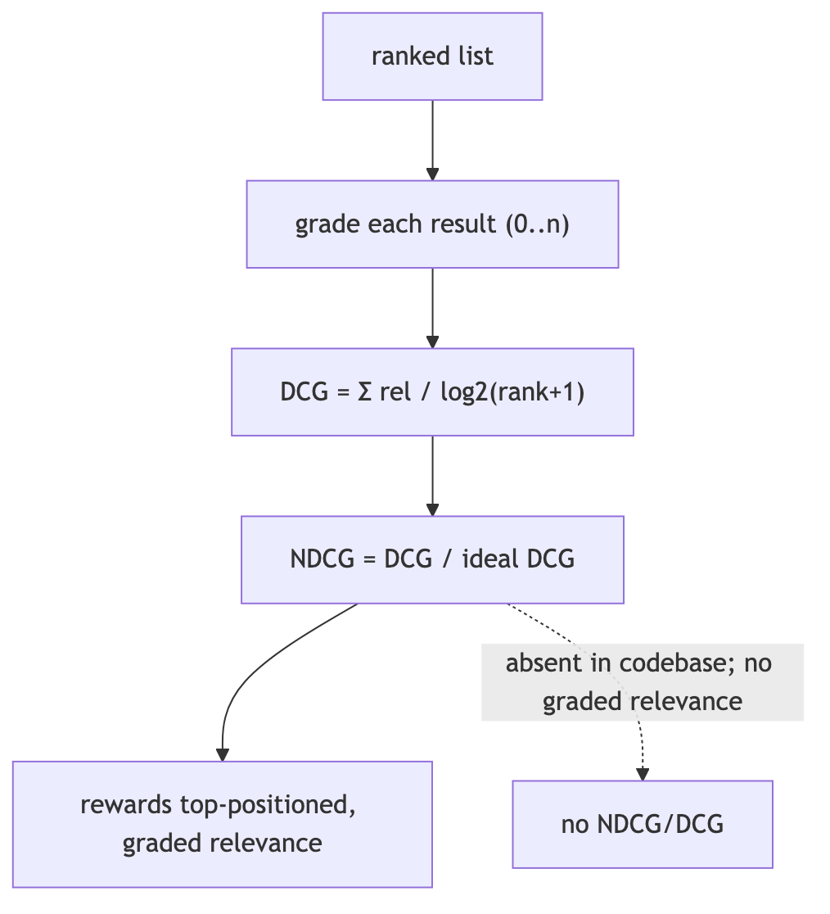

**In Jiuwen.** NDCG is absent: there is no discounted cumulative gain, no gain/discount term, and no graded relevance. Ranking code produces cross-encoder and fusion scores used to sort, but never evaluates an ordering against relevance grades.

<b>Under the hood</b>

**Implementation**

NDCG is **absent** — no discounted cumulative gain, no gain/discount term, and no graded relevance anywhere. Ranking code produces cross-encoder scores and RRF fusion scores used to sort, but never evaluates an ordering against relevance grades.

**Code anchors**

| Code anchor | What it points to |
|---|---|
| `agent-core/openjiuwen/core/foundation/store/graph/milvus/milvus_support.py:87` | cross-encoder re-rank produces scores, no DCG |
| `agent-core/openjiuwen/core/foundation/store/graph/result_ranking.py:85` | RRF/WeightedRank configs; no gain/discount |
| `agent-core/openjiuwen/core/retrieval/utils/fusion.py:20` | RRF only |
| `agent-core/openjiuwen/agent_evolving/evaluator/metrics/__init__.py:11` | only three metrics exported |

---

## 9. Faithfulness vs. relevance in RAG evaluation

Mechanism intermediate

**TL;DR.** Relevance = are the retrieved passages on-topic for the query. Faithfulness/groundedness = is the answer actually supported by the retrieved context.

**Key points.**

- Relevance: context vs query.
- Faithfulness: answer vs context.
- Both are needed; they fail differently.

**Concept.** Relevance asks whether retrieved passages are on-topic for the query (context precision/recall). Faithfulness/groundedness asks whether the answer's claims are actually supported by the retrieved context (does it hallucinate beyond the evidence). A system can retrieve relevant context and still be unfaithful, or be faithful to irrelevant context. Measuring faithfulness requires giving the judge the context and checking claim support/citations, not just answer-vs-reference correctness.

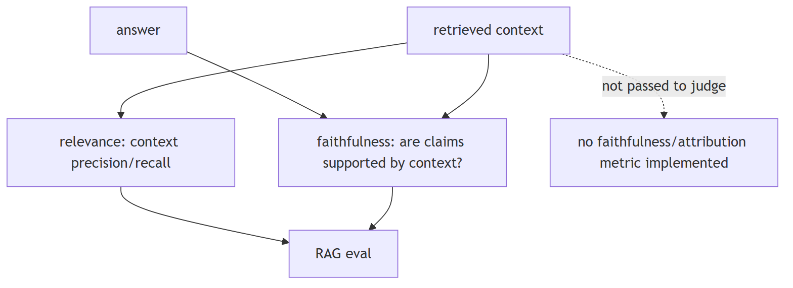

**In Jiuwen.** There is no retrieval-groundedness, faithfulness, attribution, or context-relevance metric. The closest is an accuracy evaluator that judges factual correctness with a rubric but never receives the retrieved context, so it cannot detect unsupported claims; faithfulness must be measured externally.

<b>Under the hood</b>

**Implementation**

There is no retrieval-groundedness, faithfulness, attribution, or context-relevance metric. The closest concepts: symphony's `AccuracyEvaluator` judges factual correctness with a rubric about hallucination but does not receive the retrieved context, so it cannot detect unsupported-but-plausible claims; the reviewer rubric lists a `Correctness` dimension ("no hallucination") at weight 0.3; and the RSI judge accepts arbitrary `rubric`/`required_behaviors`, so a user *could* encode a groundedness rule, but none is defined.

**Code anchors**

| Code anchor | What it points to |
|---|---|
| `agent-core/openjiuwen/symphony/evaluation/evaluators.py:438` | AccuracyEvaluator (correctness, no context input); :560 Completeness; :621 CapabilitySelection |
| `agent-core/openjiuwen/agent_evolving/evaluator/metrics/llm_as_judge.py:58` | parses only result: true/false, no context/attribution input |
| `agent-core/openjiuwen/rsi/harness_rsi/evaluator/judger/scoring.py:68` | generic rubric contract (no built-in faithfulness dimension) |
| `agent-core/openjiuwen/harness/tools/web/free_search.py:299` | "simple relevance checks" (lexical, not RAG relevance) |

---

## 10. Computing faithfulness: decomposing an answer into atomic claims, scoring each against the source with an NLI model or LLM-as-judge

Mechanism intermediate

**TL;DR.** Faithfulness = supported claims / total claims: decompose the answer into atomic claims, check each against the retrieved source (NLI or LLM judge), and average.

**Key points.**

- Decompose the answer into atomic claims.
- Verify each against the retrieved source.
- Average → faithfulness score.

**Concept.** Faithfulness = supported claims / total claims. Decompose the answer into atomic, verifiable claims; for each, ask an NLI model or LLM judge whether the retrieved source entails it; average. It needs the source context and is claim-level, not answer-level. Low faithfulness with high relevance points at the generator skipping or distorting retrieved evidence.

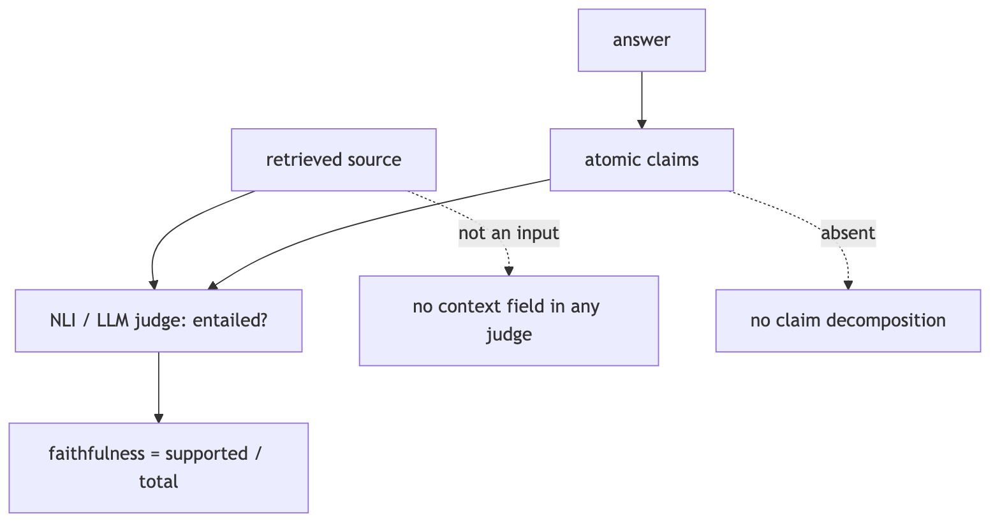

**In Jiuwen.** Absent. No judge receives a retrieved source context for faithfulness: the agent-evolution judge template has question, expected answer, and model response but no context slot; the RSI judge carries task, reference, rubric, and evidence artifacts but no retrieved context. Faithfulness is not computable in-repo.

<b>Under the hood</b>

**Implementation**

**Absent.** No judge receives a retrieved source context for faithfulness. `agent_evolving`'s judge template has fields `[Question]`, `[Expected Answer]`, `[Model Response]` with no context/evidence slot; RSI's judge receives task/reference/rubric/evidence artifacts but no retrieval context and does no claim decomposition. Symphony's judge payload can incidentally include the message trace, but it is not a faithfulness pipeline.

**Code anchors**

| Code anchor | What it points to |
|---|---|
| `agent-core/openjiuwen/agent_evolving/evaluator/templates.py:32` | template fields [Question]/[Expected Answer]/[Model Response]; no context |
| `agent-core/openjiuwen/agent_evolving/evaluator/metrics/llm_as_judge.py:47` | prompt formatted with three fields only |
| `agent-core/openjiuwen/agent_evolving/evaluator/evaluator.py:116` | same three fields |
| `agent-core/openjiuwen/symphony/evaluation/base.py:336` | redacted fingerprint+case (incidental context) |
| `agent-core/openjiuwen/symphony/evaluation/evaluators.py:546` | payload filters trace |

---

## 11. Measuring hallucination rate: claim extraction from the output, then verification against retrieved context

Mechanism intermediate

**TL;DR.** Extract atomic claims, verify each against the retrieved context (LLM judge or NLI), and compute unsupported claims / total claims (or fraction of answers with any unsupported claim).

**Key points.**

- Extract claims from the answer.
- Verify each against retrieved context.
- Rate = unsupported / total claims.

**Concept.** Extract atomic claims from the answer, then verify each against the retrieved context (LLM-judge or NLI). Hallucination rate = unsupported claims / total claims (or fraction of answers with any unsupported claim). This is stricter than "is the answer correct": it catches answers that are plausible but not grounded, and it requires passing the retrieved context to the checker.

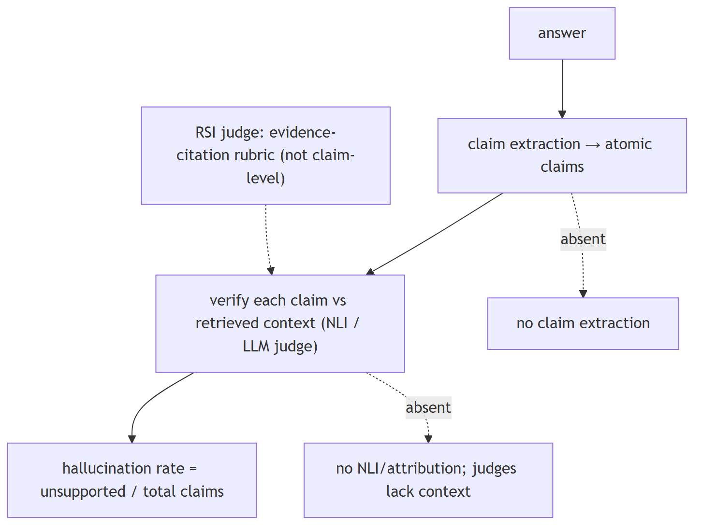

**In Jiuwen.** Claim extraction and verification are absent: there is no atomic-claim decomposition, entailment model, or groundedness/attribution scorer. The closest is the RSI judge, which is told to cite concrete evidence and not invent observations, but it grades a supplied rubric rather than retrieved context.

<b>Under the hood</b>

**Implementation**

Claim extraction and verification are **absent**. There is no atomic-claim decomposition, NLI/entailment model, or groundedness/attribution scorer. The closest is the RSI judge, which is instructed to cite concrete evidence and not invent observations, but grades supplied rubric behaviors rather than extracted claims; Symphony's `AccuracyEvaluator` asks an LLM to find factual errors but produces a single score with no claim-level decomposition.

**Code anchors**

| Code anchor | What it points to |
|---|---|
| `agent-core/openjiuwen/rsi/harness_rsi/evaluator/judger/judge_prompt.md:61` | "Cite concrete evidence for every verdict… Do not invent observations" |
| `agent-core/openjiuwen/rsi/harness_rsi/evaluator/judger/judge_evidence.py:90` | prepare_judge_workspace (evidence snapshot, no claim checker) |
| `agent-core/openjiuwen/symphony/evaluation/evaluators.py:438` | AccuracyEvaluator; :447 factual-error rubric |
| `agent-core/openjiuwen/agent_evolving/evaluator/templates.py:7` | judge compares response vs expected answer (no context) |

---

## 12. What is perplexity, and what does a lower score actually tell you

Mechanism basic

**TL;DR.** Perplexity = exp(-(1/N) sum log p(token_i)); lower means the text is more predictable. It compares LMs on the same text, not a task metric.

**Key points.**

- Exponential of average negative log-likelihood.
- Lower = more predictable; compare on the same text.
- Not a task/quality metric.

**Concept.** Perplexity is the exponentiated average negative log-likelihood the model assigns to a token sequence: `exp(-(1/N)·Σ log p(token_i))`. Lower means the model finds the text more predictable — useful for comparing language models on the same data or detecting distribution shift/overfitting. It does not measure factuality, reasoning, instruction-following, or usefulness, and it is only comparable across models that share a tokenizer and data.

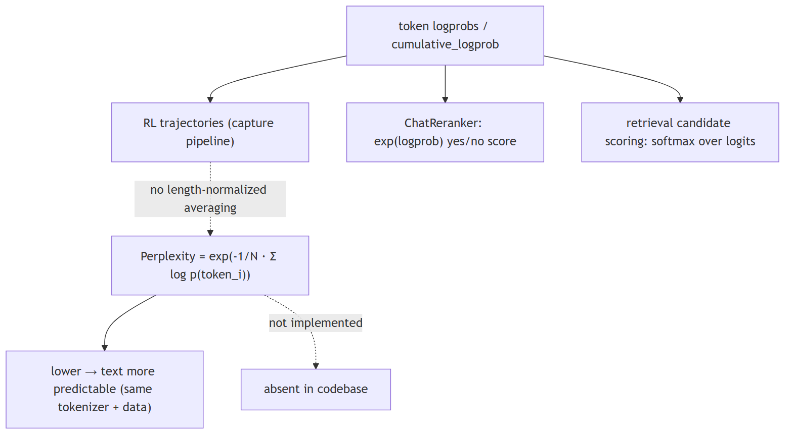

**In Jiuwen.** Perplexity is absent: no perplexity or loss-based language-modeling metric is computed. The nearest primitives are token log-probabilities and a softmax over candidate logits used for retrieval or trie selection, not a perplexity score.

<b>Under the hood</b>

**Implementation**

Perplexity is absent as a concept or metric — no `perplexity`/`ppl`/loss-based language-modeling metric is computed anywhere. The nearest primitives are token log-probabilities and a softmax over candidate logits: candidate logits are normalized to probabilities for retrieval selection, per-completion `cumulative_logprob` is captured (used for generation summaries/RL) but not converted to perplexity, and `ChatReranker` exponentiates token logprobs for a yes/no rerank score. The only literal "perplexity" strings are the Perplexity web-search vendor, not the metric.

**Code anchors**

| Code anchor | What it points to |
|---|---|
| `agent-core/openjiuwen/symphony/retrieval/llm/base/scoring.py:98-115` | softmax over candidate logits → probability (retrieval) |
| `agent-core/openjiuwen/symphony/retrieval/llm/vllm/client.py:847` | cumulative_logprob per completion (not perplexity) |
| `agent-core/openjiuwen/core/retrieval/reranker/chat_reranker.py:94-107` | exp(logprob) yes/no |
| `agent-core/openjiuwen/agent_evolving/agent_rl/online/capture_pipeline.py:408-418` | stores token logprobs for RL |
| `agent-core/openjiuwen/harness/tools/web/paid_search.py:44` | "Perplexity" is the search vendor, not the metric |

---

## 13. Known limitations of using an LLM as a judge

Mechanism intermediate

**TL;DR.** Judges are biased (position/order, verbosity, self-preference), noisy, non-deterministic, and gameable/injectable; mitigate with position-swapping, voting, agreement reporting, and human calibration.

**Key points.**

- Biases: position, verbosity, self-preference.
- Noisy, non-deterministic, gameable.
- Mitigate: swap positions, vote, calibrate with humans.

**Concept.** LLM judges are biased (position/order, verbosity, self-preference), noisy, non-deterministic, and can be gamed or prompt-injected. They need position-swapping, multiple votes, agreement reporting, human calibration on a golden set, and must distinguish "judge failed" from "answer wrong". A single unvalidated judge score is a weak signal.

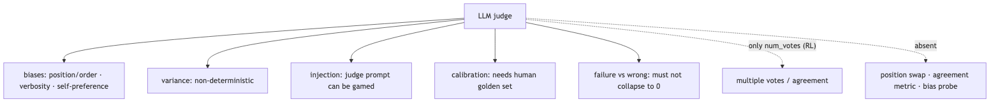

**In Jiuwen.** Jiuwen has four judge implementations. One is a single call that parses to true/false and converts exceptions to zero (conflating judge failure with a wrong answer); the RSI judge does one format retry on frozen evidence and guards against injecting prior output; the online judge uses voting. Bias mitigations are partial.

<b>Under the hood</b>

**Implementation**

Four judge implementations exist. `agent_evolving`'s `LLMAsJudgeMetric` is a single call, parses to `true/false`, and converts exceptions to `0.0` (conflating "judge failed" with "answer wrong"). RSI's judge does one format retry on frozen evidence and guards against injecting "prior output" as trusted data, but is still single-judgment. Symphony's `LLMJudgeEvaluator` is `temperature=0.0` with one repair retry. Only the online RL `JudgeScorer` uses `num_votes` parallel votes averaged together. None handles position bias or reports agreement.

**Code anchors**

| Code anchor | What it points to |
|---|---|
| `agent-core/openjiuwen/agent_evolving/evaluator/metrics/llm_as_judge.py:53` | single invoke, exception → 0.0; agent-core/openjiuwen/agent_evolving/evaluator/evaluator.py:123 — same failure pattern |
| `agent-core/openjiuwen/rsi/harness_rsi/evaluator/judger/llm_as_judge.py:121` | two-attempt loop; :152 untrusted prior-output guard |
| `agent-core/openjiuwen/symphony/evaluation/base.py:262` | single judge call + one repair retry; :401 temperature=0.0 |
| `agent-core/openjiuwen/agent_evolving/agent_rl/online/judge/evaluator.py:66` | num_votes averaged; :92 raw votes retained |
| `agent-core/openjiuwen/agent_evolving/agent_rl/online/judge/judge_scorer.py:38` | num_votes |
| `agent-core/openjiuwen/rsi/harness_rsi/evaluator/judger/scoring.py:127` | strict single-verdict parsing |

---

## 14. How do you evaluate when there's no ground truth answer, only a query and a corpus

Mechanism intermediate

**TL;DR.** Without gold labels: generate synthetic queries from known documents (doc = gold) for retrieval, use an LLM judge with a rubric, or pairwise/few-shot judging.

**Key points.**

- Synthetic queries from known docs (doc = gold).
- LLM judge with a rubric.
- Pairwise / few-shot judging.

**Concept.** Bootstraps without gold labels: (a) generate synthetic queries from known documents and treat the source document as the gold retrieval target (cheap, works well for retrieval metrics); (b) use an LLM to answer and treat cited passages as relevant (RAGAS-style); (c) judge faithfulness against the retrieved context rather than a reference answer; (d) sample and label by hand a small set to calibrate. The key is that retrieval can be graded with synthetic (query, source-doc) pairs even when answers are unlabeled.

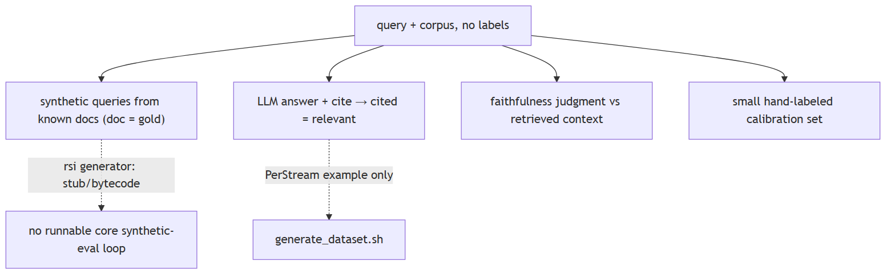

**In Jiuwen.** Synthetic dataset generation is largely not runnable: the advertised dataset generator exists only as compiled bytecode, and its components are stubs that raise NotImplementedError. The one runnable label-free path is an example harness that generates and judges proactive-memory data.

<b>Under the hood</b>

**Implementation**

Synthetic dataset generation is largely not runnable. The advertised `rsi/dataset_generator` (`DatasetGenerator`, "model-driven synthetic evaluation dataset generation") exists only as compiled bytecode; its `case_generator`/`task_analyzer`/`coverage_validator` sources are stubs raising `NotImplementedError`, and the harness explicitly "never generates a dataset". The one runnable label-free builder is the PerStream example, which generates QA/memory pairs from source datasets using GPT-4o-mini. There is no query-generation loop tied to the core evaluator.

**Code anchors**

| Code anchor | What it points to |
|---|---|
| `agent-core/openjiuwen/rsi/harness_rsi/single_harness/iterative.py:134` | "never generates a dataset" |
| `agent-core/examples/PerStream/scripts/generate_dataset.sh:31` | LLM-driven QA/memory generation (example only) |
| `agent-core/openjiuwen/agent_evolving/evaluator/metrics/llm_as_judge.py:47` | LLM judge usable on unlabeled answers but no context |
| `agent-core/openjiuwen/rsi/dataset_generator/__pycache__/case_generator.cpython-311.pyc` | NotImplementedError stubs (no .py source) |

---

## 15. How would you build an eval dataset from scratch if you don't have one yet

Mechanism advanced

**TL;DR.** Mine real queries, then label by synthetic queries from known documents, by an LLM answering with cited chunks as gold, or by human labeling.

**Key points.**

- Mine real queries from logs.
- Synthetic queries (doc = gold).
- Or LLM answers with citations as gold.

**Concept.** Mine queries from real logs or user questions, then label relevance by (a) synthetic queries generated from known documents (the document is the gold target), (b) LLM answering and treating cited chunks as relevant, or (c) a small hand-labeled calibration set. Start small (50–200 queries), cover query types including exact-match and multi-hop, and iterate. For retrieval you can bootstrap (query, source-doc) pairs with no answer labels at all.

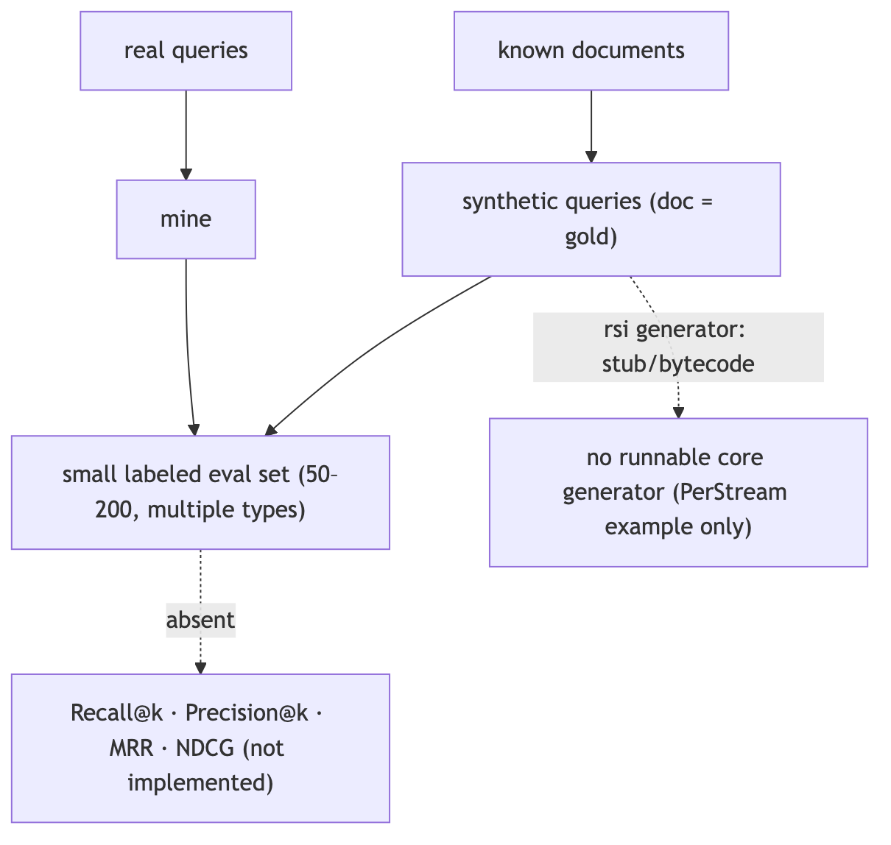

**In Jiuwen.** The advertised dataset generator is not runnable source: the class exists only as bytecode and its helpers are stubs, and the harness never generates a dataset. The only runnable label-free approach is an example that generates and scores proactive-memory moments, so you must build the dataset yourself.

<b>Under the hood</b>

**Implementation**

The advertised `rsi/dataset_generator` is not runnable source: `DatasetGenerator` exists only as compiled bytecode, and `case_generator`/`task_analyzer`/`coverage_validator` are stubs raising `NotImplementedError`; the harness "never generates a dataset". The one runnable label-free builder is the PerStream example (`generate_dataset.sh` → GPT-4o-mini QA/memory generation). There is no query-generation loop integrated with the core evaluator.

**Code anchors**

| Code anchor | What it points to |
|---|---|
| `agent-core/openjiuwen/rsi/harness_rsi/single_harness/iterative.py:134` | "never generates a dataset" |
| `agent-core/examples/PerStream/scripts/generate_dataset.sh:31` | LLM-driven QA/memory generation (example) |
| `agent-core/openjiuwen/rsi/dataset_generator/__pycache__/case_generator.cpython-311.pyc` | NotImplementedError stubs (no source) |
| `agent-core/openjiuwen/agent_evolving/evaluator/metrics/base.py:42` | metric interface lacks ranked-list eval |

---

## 16. How many examples before eval results are statistically meaningful, not just noise

Mechanism intermediate

**TL;DR.** Depends on effect size and variance; ~100–200 gives a usable signal for one metric, and comparing two systems needs enough to detect the difference. Report variance/confidence, not just a mean.

**Key points.**

- ~100–200 for a usable single-metric signal.
- Comparing systems needs power for the effect size.
- Report confidence/variance, not a bare mean.

**Concept.** It depends on the effect size and metric variance. As a rule of thumb, ~100–200 examples give a usable signal for a common metric, but if you are comparing two systems you need enough to detect the delta above noise — report confidence intervals (bootstrap) and use paired significance tests on the same examples. For rare events (e.g. hallucination) you need far more, and minority-slice analysis needs hundreds per slice. Never quote a bare average without an error bound.

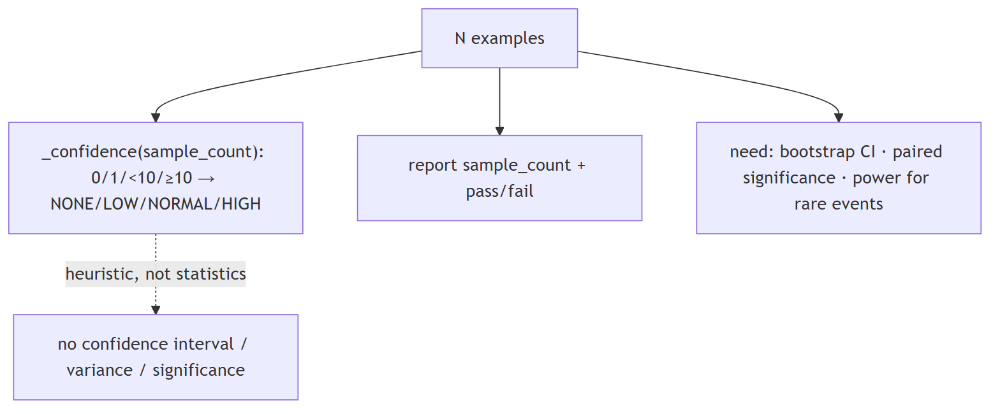

**In Jiuwen.** There is no statistical reasoning. The closest is a confidence helper that buckets sample counts into qualitative labels (none, low, normal, high), a hard-coded heuristic rather than a confidence interval; aggregation reports sample counts and pass rates with no significance testing.

<b>Under the hood</b>

**Implementation**

There is no statistical reasoning. The closest construct is Symphony's `_confidence(sample_count)`, which buckets counts into qualitative labels (0→NONE, 1→LOW, <10→NORMAL, ≥10→HIGH) — a hard-coded heuristic, not a confidence interval. Aggregation reports `sample_count` and pass/fail counts but computes no standard error, bootstrap, or significance test.

**Code anchors**

| Code anchor | What it points to |
|---|---|
| `agent-core/openjiuwen/symphony/evaluation/suite.py:560` | _confidence(sample_count) heuristic; :362 sample_count attached |
| `agent-core/openjiuwen/rsi/harness_rsi/evaluator/metrics_collector.py:34` | total_cases/passed_cases/average_score (no variance/CI) |
| `agent-core/openjiuwen/symphony/orchestration/config.py:50` | min_successes_verified (threshold, not statistics) |
| `agent-core/openjiuwen/symphony/retrieval/build/tree/schema.py:232` | structure_sample_size (sampling config) |

---

## 17. How would you compare two models for a specific task, not just a general leaderboard score

Mechanism advanced

**TL;DR.** Run both on the same held-out set with identical prompts/decoding, score with task metrics, and compare accuracy plus latency and cost.

**Key points.**

- Same held-out set, same prompts/decoding.
- Task-appropriate metrics.
- Compare accuracy + latency + cost.

**Concept.** Run both models on the same held-out task set with the same prompts/decoding, score with task-appropriate metrics (exact match, tests, rubric judge), and compare accuracy plus latency and cost; check statistical significance and inspect failure cases. A leaderboard is a prior, not a decision — task fit, cost, latency, and controllability often matter more than a few points of general score.

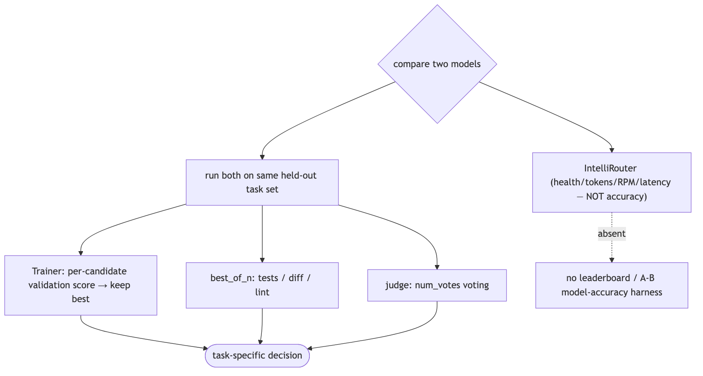

**In Jiuwen.** Model selection here is infrastructure routing, not benchmark comparison: the models config defines a router across endpoints and model names with allocation strategies chosen by name, and routing scores health, rate, and latency — not task accuracy. So A/B model comparison must be done externally.

<b>Under the hood</b>

**Implementation**

Model selection here is infrastructure routing, not benchmark comparison. `agent_teams/models/pool.py` defines `ModelRouterConfig` (one endpoint, many model names) and `IntelliRouterConfig` (many deployments behind a reliable client router), with allocator strategies chosen by `build_model_allocator`. IntelliRouter routes by adaptive multi-factor scoring (health, tokens, RPM, latency) and fails over — it does **not** choose by task accuracy. For comparing configs/attempts there is real per-task evaluation: `Trainer` evaluates each candidate on a validation set and keeps the highest score; `rsi best_of_n` ranks attempts by tests/diff/lint; the online judge uses `num_votes` voting. Comparing two models for a task therefore means running your own eval, not a leaderboard feature.

**Code anchors**

| Code anchor | What it points to |
|---|---|
| `agent-core/openjiuwen/agent_teams/models/pool.py:133-235` | ModelRouterConfig; :314-392 — IntelliRouterConfig / deployments |
| `agent-core/openjiuwen/agent_teams/models/allocator.py:176/240/357/452/559` | allocator strategies + build_model_allocator |
| `agent-core/examples/intelli_router/intelliRouter_demo.py:142-160` | adaptive routing weights; :249-264 route within a pinned model pool |
| `agent-core/openjiuwen/agent_evolving/trainer/trainer.py:241-272` | per-candidate validation scoring, commits best |
| `agent-core/openjiuwen/rsi/auto_harness/pipelines/best_of_n/attempt_scorer.py:17-119` | rank by tests/lint/diff |
| `agent-core/openjiuwen/agent_evolving/agent_rl/online/judge/judge_scorer.py:38/58` | num_votes judge voting |

---

## 18. Building a regression test suite to catch a quality drop before it ships

Mechanism intermediate

**TL;DR.** Fast deterministic unit tests on pipeline components plus a quality eval on a fixed dataset scored the same way each time; store a baseline and fail the build on a drop.

**Key points.**

- Fast unit tests for components.
- Quality eval on a fixed dataset.
- Baseline + fail on regression.

**Concept.** Combine fast deterministic unit tests on the pipeline components with a quality eval suite on a fixed dataset scored by the same metrics each time; store a baseline and fail the build when the score drops beyond a threshold. Add golden/snapshot tests for prompts and outputs, and gate merges on the suite.

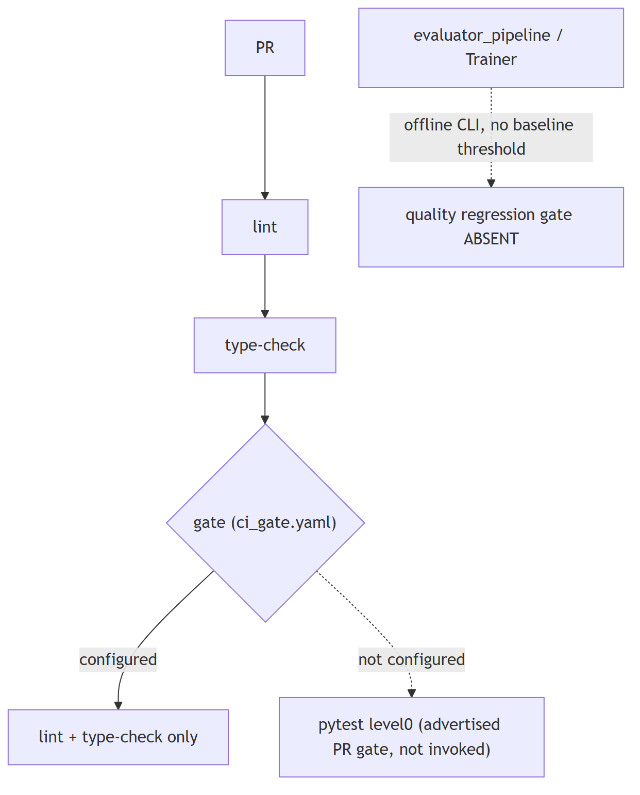

**In Jiuwen.** Tests split into fast deterministic unit tests (CI) and end-to-end system tests (usually skipped), with markers for smoke/happy-path versus deeper tests — there is no quality-regression gate in CI. Quality evaluation exists but offline and separate, without a baseline threshold.

<b>Under the hood</b>

**Implementation**

Tests split into `tests/unit_tests/` (fast, deterministic, CI) and `tests/system_tests/` (E2E, usually skipped). `pytest` defines markers `level0` ("smoke / happy-path; PR gate must stay green") and `level1`, with `testpaths=["tests"]`. Quality evaluation exists separately: `evaluator_pipeline` emits `pass_rate`/`improvement`/`converged`, and `Trainer` compares a candidate's validation score against `best_score` and commits only improvements. But the CI gate that blocks merges (`ci_gate.yaml`) declares only `lint` and `type-check` — no pytest gate and no eval threshold.

**Code anchors**

| Code anchor | What it points to |
|---|---|
| `agent-core/pyproject.toml:230` | pytest config + level0/level1 markers |
| `agent-core/openjiuwen/auto_harness/resources/ci_gate.yaml:21` | gates are only lint and type-check |
| `agent-core/openjiuwen/auto_harness/infra/ci_gate_runner.py:1098` | gate dispatch; agent-core/openjiuwen/auto_harness/stages/verify.py:451 ci_gate.run("all"); :509 revert on exhaustion |
| `agent-core/openjiuwen/agent_evolving/trainer/trainer.py:217` | improved = val_score > progress.best_score |
| `agent-core/openjiuwen/agent_evolving/evaluator/evaluator_pipeline/pipeline.py:664` | _compute_evolution_metrics |

---

## 19. Evaluating continuously in production, not just once before launch

Mechanism intermediate

**TL;DR.** Sample live traffic, score on a schedule or from feedback, and alert on quality drops — separate from error/latency monitoring; watch query drift and retrieval hit rates.

**Key points.**

- Sample live traffic; score on a schedule.
- Alert on quality drops, not just errors.
- Watch drift in queries and hit rates.

**Concept.** Sample live traffic, score it on a schedule or on feedback, and alert on quality drops — separate from error/latency monitoring. Look for drift in query distribution and retrieval hit rates, track online metrics (thumbs, task success, escalation), and periodically re-run the offline suite on fresh data. The goal is to detect degradation before users report it.

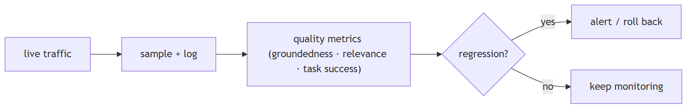

**In Jiuwen.** There is a live capture-and-score path, but it feeds online RL training, not quality monitoring: it stages each production completion and a judge attaches a score or user reward persisted to a trajectory store. Observability is span, error, and latency based, so there is no production quality monitoring or drift detection.

<b>Under the hood</b>

**Implementation**

There is a live capture-and-score path, but it serves **online RL training, not quality monitoring**: `CapturePipeline` stages each production completion and a judge later attaches an LLM score or user reward, persisting to a trajectory sample store. The product writes all spans into a per-session SQLite trajectory store (diagnostic, 7-day retention) for replay. There is no drift detection, no eval traffic-sampling policy, no dashboard, and no quality alert.

**Implementation diagram**

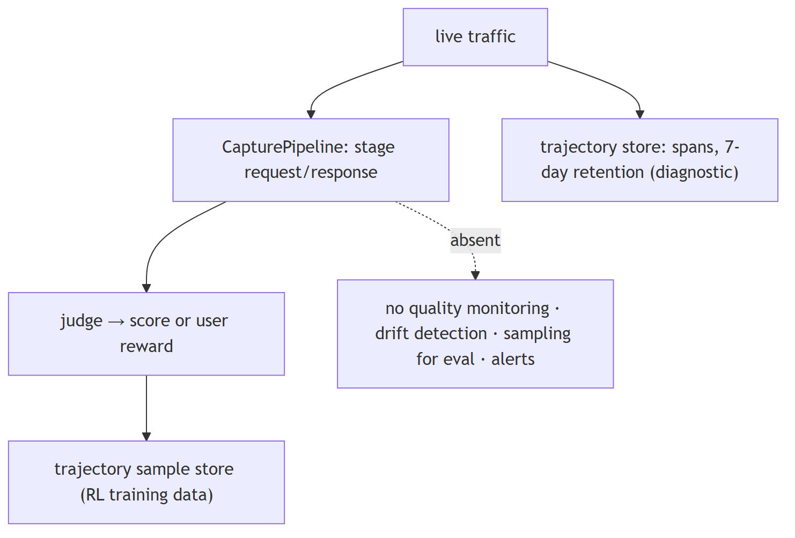

**Code anchors**

| Code anchor | What it points to |
|---|---|
| `agent-core/openjiuwen/agent_evolving/agent_rl/online/capture_pipeline.py:59` | CapturePipeline; :73 before; :110 after; :170 submit_reward |
| `agent-core/openjiuwen/agent_evolving/agent_rl/online/gateway/trajectory/judge_dispatcher.py:30` | flush + judge on follow-up/session end |
| `agent-core/openjiuwen/agent_evolving/agent_rl/online/judge/judge_scorer.py:28` | live LLM judge score |
| `jiuwenswarm/jiuwenswarm/observability/store.py:304` | TrajectoryStore; :307 7-day retention (diagnostic) |
| `jiuwenswarm/jiuwenswarm/observability/sink.py:578` | TrajectorySessionSinkRouter; jiuwenswarm/jiuwenswarm/observability/runtime.py:69 — runtime |
| `agent-core/openjiuwen/harness/observability/rail.py:355` | span emission |

---

## 20. How do you detect when your retrieval quality has degraded over time

Mechanism intermediate

**TL;DR.** Monitor retrieval signals over time — zero-result rate, top-score distributions, click rate, and a periodic re-run of a frozen set — and alert on shifts, sliced per query type.

**Key points.**

- Zero-result rate + score distributions.
- Periodic re-run of a frozen set.
- Slice per query type/language.

**Concept.** Monitor retrieval-specific signals over time — zero-result rate, top-score distributions, click/select rate, and a periodic re-run of a frozen labeled set (Recall@k/NDCG) — and alert on shifts. Slice by query type/tenant/language, since degradation is often localized (a new format, a corpus change, an embedding-model update). Pair it with generation-side faithfulness/relevance tracking so you can tell a retrieval regression from a generation one.

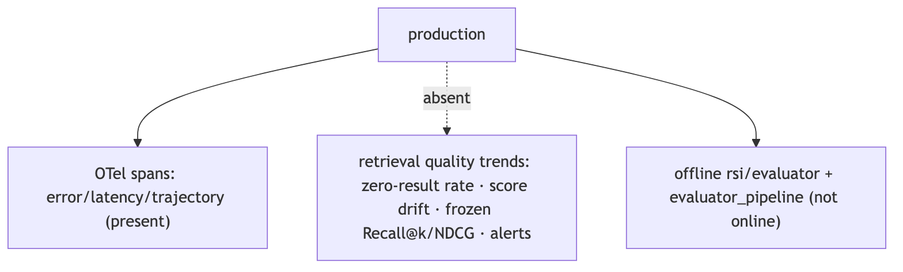

**In Jiuwen.** There is no retrieval-quality monitoring and no drift detection: production observability is span-based (error flag, per-session trajectory, cost and usage), i.e., error, latency, and trajectory rather than quality. Offline evaluation exists but does not track retrieval over time, so you would build this monitoring yourself.

<b>Under the hood</b>

**Implementation**

There is no retrieval-quality monitoring and no drift detection. Production observability is span-based: OTel spans with an error flag, a per-session trajectory store, and cost/usage facts — error/latency/trajectory, not quality. Offline evaluation exists (`rsi/evaluator`, `evaluator_pipeline`) but is not an online quality monitor, and there is no frozen retrieval metric to trend.

**Code anchors**

| Code anchor | What it points to |
|---|---|
| `agent-core/openjiuwen/harness/observability/run_span.py:289` | error status recorded; agent-core/openjiuwen/harness/observability/setup.py:54 — OTel lifecycle |
| `jiuwenswarm/jiuwenswarm/observability/store.py:102` | has_error; :137 trajectory_current_records |
| `agent-core/openjiuwen/agent_evolving/evaluator/evaluator_pipeline/pipeline.py:167` | offline bench.evaluate; :668 _compute_evolution_metrics |
| `agent-core/openjiuwen/agent_evolving/trainer/trainer.py:217` | validation-score gate (offline) |

---

## 21. High eval scores but users still complaining — what does that gap tell you about your eval set

Mechanism advanced

**TL;DR.** The eval set doesn't represent real usage: too-easy or synthetic queries, no adversarial/long-tail cases, missing slices, or a metric that rewards style over task success.

**Key points.**

- Eval set not representative of real usage.
- Missing adversarial/long-tail/slices.
- Metric rewards the wrong thing.

**Concept.** The gap means the eval set does not represent real usage: too-easy or synthetic queries, no adversarial or long-tail cases, missing slices (language, domain, intent), a metric that rewards style over usefulness, or unmeasured dimensions (latency, verbosity, tone, refusals). The fix is to mine real complaints/failed sessions for queries, add them to the set, and re-baseline — the eval set is a moving target aligned to production.

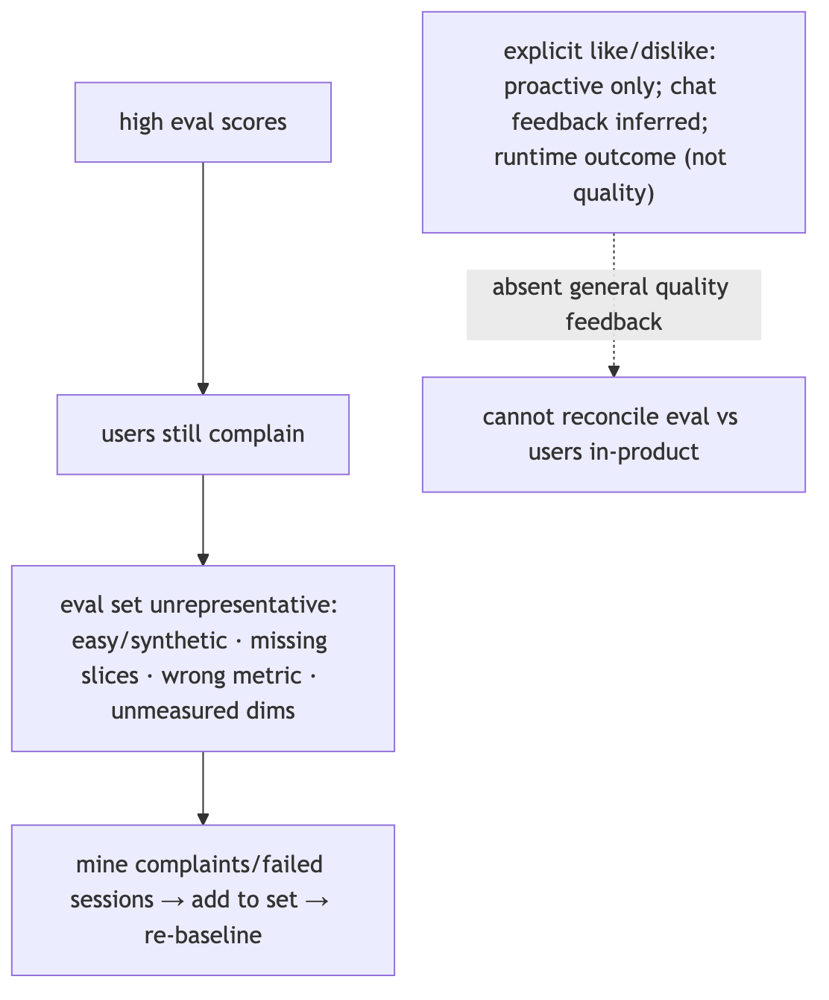

**In Jiuwen.** Feedback capture is partial, so the gap is not detectable in-product: explicit like/dislike exists only for proactive recommendations, and for normal chat feedback is inferred (a classifier judging whether a message is corrective and whether tasks succeeded). There is no in-product signal tying eval scores to user satisfaction.

<b>Under the hood</b>

**Implementation**

Feedback capture is partial, so the gap is not detectable in-product. Explicit like/dislike exists only for **proactive recommendations** (`feedback_collector.record_feedback`); for normal chat, feedback is inferred (an LLM classifying whether a user message is corrective, and the online-RL judge consuming the next user turn as feedback). Session tracking records runtime outcome (`succeeded/failed/waiting_user`), which is execution success, not answer quality. There is no general thumbs-up/down or satisfaction signal to reconcile against eval scores.

**Code anchors**

| Code anchor | What it points to |
|---|---|
| `jiuwenswarm/jiuwenswarm/agents/harness/common/recommendation/feedback_collector.py:47` | record_feedback (explicit, proactive only); jiuwenswarm/jiuwenswarm/common/schema/message.py:141 — PROACTIVE_FEEDBACK |
| `agent-core/openjiuwen/agent_evolving/signal/from_conv.py:327` | detect_user_intent infers corrective feedback |
| `agent-core/openjiuwen/agent_evolving/agent_rl/online/judge/evaluator.py:39` | judge takes followup_user_feedback; agent-core/openjiuwen/agent_evolving/agent_rl/online/gateway/trajectory/judge_dispatcher.py:30 |
| `jiuwenswarm/jiuwenswarm/server/agent_ws_server.py:544` | _TurnOutcomeTracker (runtime outcome) |
| `agent-core/openjiuwen/agent_evolving/signal/review_feedback.py:117` | ReviewFeedbackAttributor |

---

## 22. Tying an eval metric back to a business outcome a stakeholder actually cares about

Mechanism intermediate

**TL;DR.** Translate quality into the business proxy it moves (task success, deflection, time-to-resolution, cost per resolution), and build a labeled bridge from the offline metric to that outcome.

**Key points.**

- Pick the business proxy (success, deflection, cost).
- Correlate the offline metric to the proxy.
- Use the offline metric as the fast proxy.

**Concept.** Translate model quality into the business proxy it moves: task success rate, deflection/containment, time-to-resolution, conversion, retention, or cost-per-resolution. Build a labeled bridge — correlate your offline metric with the business KPI on a sample — and report both. A metric no stakeholder can act on will not survive budget season; pick one that maps to money or time saved.

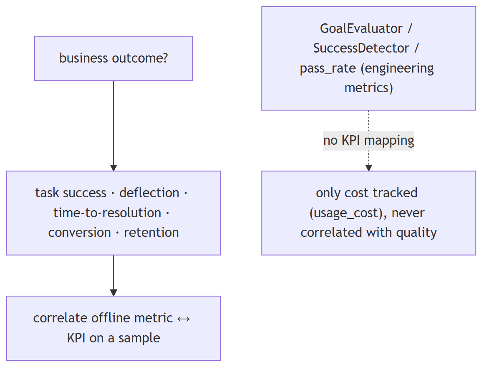

**In Jiuwen.** Metrics here are engineering and task-completion, not business KPIs: a goal evaluator scores whether an objective is complete or blocked, a success detector maps a task to success, partial, or fail, and the pipeline aggregates pass rate and average score. The only business-adjacent tracking is infrastructure cost and usage, not outcomes.

<b>Under the hood</b>

**Implementation**

Metrics here are engineering/task-completion, not business KPIs. `GoalEvaluator` scores whether an agent objective is `complete`/`blocked`; `SuccessDetector` maps a task to `success/partial/fail`; `evaluator_pipeline`/team verification aggregate `pass_rate`/`avg_score`. The only stakeholder-adjacent signal is **cost**: per-session tracking with an optional limit (`CostLimitExceededError`). There is no conversion, retention, engagement, or user-satisfaction mapping.

**Code anchors**

| Code anchor | What it points to |
|---|---|
| `agent-core/openjiuwen/harness/goal/evaluation.py:74` | GoalEvaluator (goal completion) |
| `agent-core/openjiuwen/agent_evolving/ttse/success.py:267` | SignalBasedSuccessDetector (success/partial/fail); :92 classify_explicit_score |
| `agent-core/openjiuwen/agent_evolving/evaluator/evaluator_pipeline/base.py:232` | aggregate() |
| `agent-core/openjiuwen/agent_teams/verification/memory.py:160` | aggregates pass_rate/avg_score |
| `jiuwenswarm/jiuwenswarm/server/runtime/usage_cost.py:32` | cost settings; :65 CostLimitExceededError |

---

## 23. "How do you know it's working" tests evaluation depth, not confidence

Mechanism intermediate

**TL;DR.** 'How do you know it's working' tests evaluation depth, not confidence.

**Key points.**

- Offline answer-level eval exists.
- No retrieval metric layer.
- No faithfulness/claim scoring.
- No CI quality gate.

**Concept.** "It looked good to me" ends the conversation. They want a fixed eval set, faithfulness scoring on generated claims, and how you'd catch silent degradation after an unflagged prompt change. The real trap is "how would you know if it got *worse*", not "how do you know it works now". A strong answer includes: a frozen labeled eval set scored on every change, stage-level metrics (retrieval recall/NDCG; generation faithfulness), a regression gate in CI, and production sampling with drift alerts. Name the baseline and the threshold.

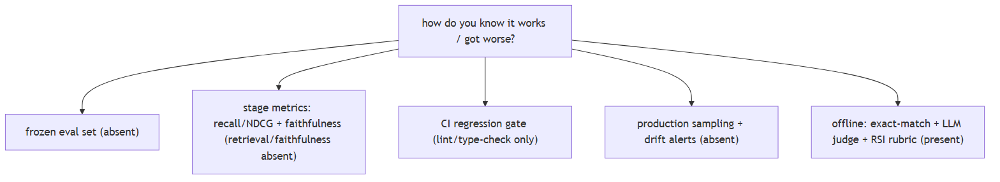

**In Jiuwen.** Offline answer-level evaluation exists (exact match, LLM judge, weighted rubric, pipeline pass rate), but there is no retrieval metric layer, no faithfulness or claim-level scoring, and no quality regression gate in CI (the gate config is lint and type-check).

<b>Under the hood</b>

**Implementation**

Offline answer-level evaluation exists (`ExactMatchMetric`, `LLMAsJudgeMetric`, RSI weighted rubric, `evaluator_pipeline` pass-rate), but there is no retrieval metric layer, no faithfulness/claim-level scoring, no quality regression gate in CI (`ci_gate.yaml` is lint/type-check only), and no production quality monitoring or drift detection — so the "how would you know it got worse" question exposes real gaps.

**Code anchors**

| Code anchor | What it points to |
|---|---|
| `agent-core/openjiuwen/agent_evolving/evaluator/metrics/llm_as_judge.py:47` | LLM judge; agent-core/openjiuwen/agent_evolving/evaluator/metrics/exact_match.py:12 — exact match |
| `agent-core/openjiuwen/rsi/harness_rsi/evaluator/judger/scoring.py:193` | weighted rubric |
| `agent-core/openjiuwen/agent_evolving/evaluator/evaluator_pipeline/pipeline.py:167` | benchmark eval |
| `agent-core/openjiuwen/auto_harness/resources/ci_gate.yaml:21` | gates are only lint/type-check; agent-core/pyproject.toml:236 — level0/level1 markers (not invoked) |
| `jiuwenswarm/jiuwenswarm/observability/store.py:102` | has_error (operations, not quality) |

---

## 24. "How do you know it's working" is testing evaluation depth

Mechanism intermediate

**TL;DR.** 'How do you know it's working' is testing evaluation depth.

**Key points.**

- Offline answer-level eval exists.
- No faithfulness/relevance metric.
- No retrieval metric layer.
- No CI quality gate.

**Concept.** faithfulness scoring (does output match retrieved context), relevance scoring (does it answer the query), human eval on a rotating sample, and regression testing before every deploy — not just at launch. A strong answer includes: a frozen labeled set, stage-level metrics (retrieval recall/NDCG; generation faithfulness/relevance), a CI regression gate with a baseline threshold, periodic human sampling, and production monitoring with drift alerts.

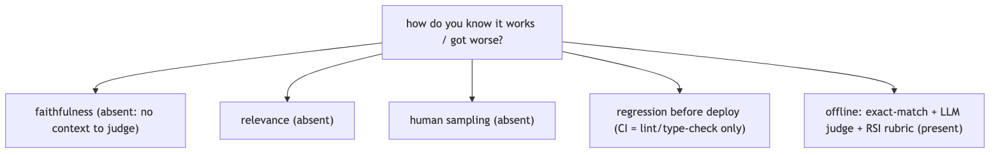

**In Jiuwen.** Offline answer-level evaluation exists (exact match, LLM judge, rubric, pipeline pass rate), but there is no faithfulness or relevance metric (the judges lack the retrieved context), no retrieval metric layer, and no CI quality gate (the gate is lint and type-check).

<b>Under the hood</b>

**Implementation**

Offline answer-level evaluation exists (`ExactMatchMetric`, `LLMAsJudgeMetric`, RSI rubric, `evaluator_pipeline`), but there is no faithfulness/relevance metric (judges lack the retrieved context), no retrieval metric layer, no CI quality gate (lint/type-check only), no human-sampling pipeline, and no production quality monitoring. The "how would you know it got worse" follow-up exposes real gaps.

**Code anchors**

| Code anchor | What it points to |
|---|---|
| `agent-core/openjiuwen/agent_evolving/evaluator/metrics/llm_as_judge.py:40` | no context input; agent-core/openjiuwen/agent_evolving/evaluator/metrics/exact_match.py:12 — exact match |
| `agent-core/openjiuwen/rsi/harness_rsi/evaluator/judger/scoring.py:193` | weighted rubric |
| `agent-core/openjiuwen/agent_evolving/evaluator/evaluator_pipeline/pipeline.py:167` | benchmark eval |
| `agent-core/openjiuwen/auto_harness/resources/ci_gate.yaml:21` | lint/type-check only; agent-core/pyproject.toml:236 — markers not invoked |
| `jiuwenswarm/jiuwenswarm/observability/store.py:102` | has_error (operations, not quality) |

---

## 25. Building a retrieval eval set without labeled relevant documents yet

Mechanism advanced

**TL;DR.** Bootstrap with real queries from logs, then label relevance with an LLM judge, RAGAS-style (a strong model's cited chunks as gold), or synthetic queries built from known documents.

**Key points.**

- Mine real queries from logs.
- Label via LLM judge or a strong model's citations.
- Or synthesize queries from known documents (doc = gold).

**Concept.** Common bootstraps: mine queries from real logs or user questions, then label relevance by (a) LLM judging candidate chunks, (b) using a strong model to answer and treating cited chunks as relevant (RAGAS-style), or (c) creating synthetic queries from known documents (the document is the gold answer). Start small (50–200 queries), cover query types including exact-match and multi-hop, and iterate; a tiny labeled set beats none.

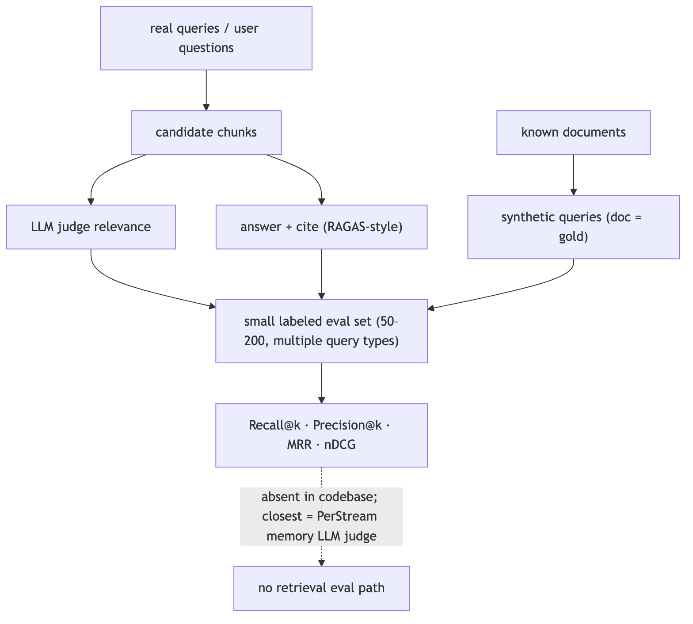

**In Jiuwen.** There is no synthetic-query generator, no retrieval eval harness, and no retrieval-relevance judge. The only generate-and-judge code is the proactive-memory evaluation example, which runs inference and uses an LLM to judge memory moments — unrelated to retrieval. So you must build the retrieval eval set and tooling yourself.

<b>Under the hood</b>

**Implementation**

There is no synthetic-query generation, no retrieval eval harness, and no LLM judge for retrieval relevance. The only "generate data + judge" code is the PerStream proactive-memory eval (`eval_proactive_dataset.py` runs inference; `score_proactive_judge.py:annotate` uses an LLM to judge memory moments). `tests/unit_tests/core/retrieval/` contains unit fixtures with mocked retrievers/embeddings asserting shapes, not gold relevance labels. So there is no established path to bootstrap a retrieval eval set here.

**Code anchors**

| Code anchor | What it points to |
|---|---|
| `agent-core/examples/PerStream/src/eval/score_proactive_judge.py:35` | annotate(...) LLM judge (memory, not retrieval) |
| `agent-core/examples/PerStream/src/eval/eval_proactive_dataset.py:121` | run_inference, dataset build for memory task |
| `agent-core/tests/unit_tests/core/retrieval/query_rewriter/test_query_rewriter.py` | mock-based unit fixtures |
| `agent-core/tests/unit_tests/core/retrieval/retriever/test_agentic_retriever.py` | mock-based agentic test |
| `agent-core/openjiuwen/core/retrieval/query_rewriter/query_rewriter.py:412` | rewrite (query generation from user input, not eval-set synthesis) |

---
