# Production, cost and scale

## 1. Where cost concentrates: embedding is cheap and one-time, generation scales with traffic

Mechanism advanced

**TL;DR.** Embedding is a one-time, change-only indexing cost; the recurring traffic-scaling cost is generation, especially input tokens from long context. Optimize generation.

**Key points.**

- Embedding = one-time indexing cost.
- Generation scales with traffic.
- Input tokens dominate with long context.

**Concept.** Embedding is a one-time (or change-only) indexing cost and is cheap per token; the recurring, traffic-scaling cost is generation — especially input tokens when you stuff long context. So optimization effort should go to the generation loop (fewer iterations, smaller context, cheaper model) more than to embeddings. Measure input vs output tokens separately.

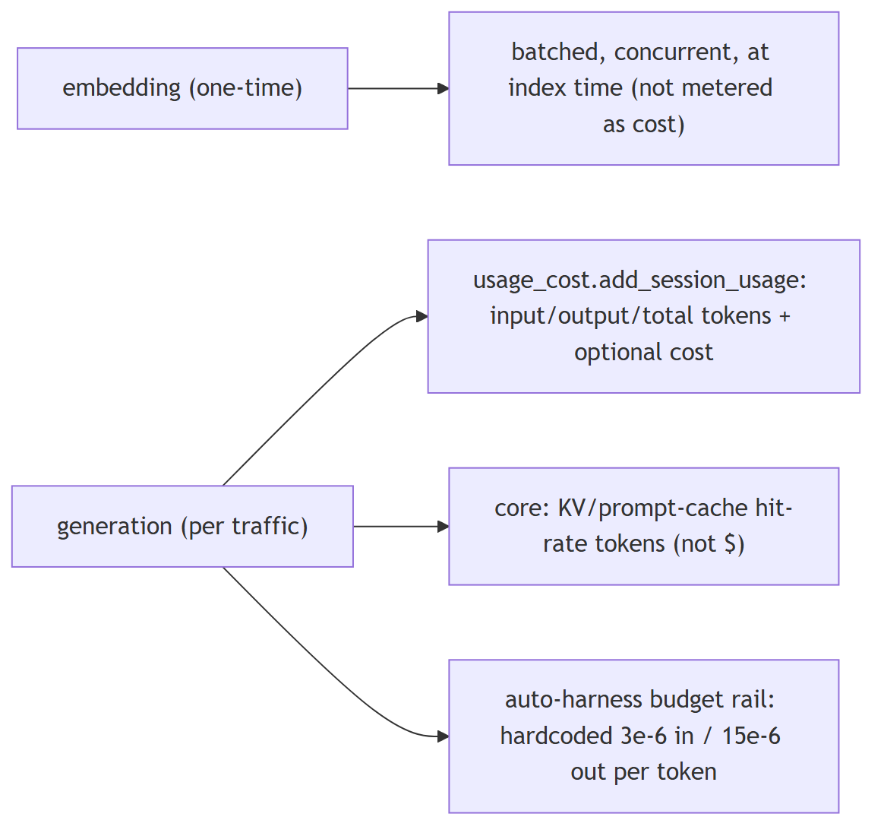

**In Jiuwen.** Embedding is batched and effectively one-time (chunked with batch size 8 and concurrency 50, run at index or update time). Generation is what is metered: usage accumulates provider-reported input, output, and total tokens, and cost tracking focuses on session generation cost. Optimization effort belongs on generation.

<b>Under the hood</b>

**Implementation**

Embedding is batched and effectively one-time: `APIEmbedding` chunks texts (`max_batch_size=8`, `max_concurrent=50`) and `compute_chunk_embeddings` runs at index/update time. Generation is what is metered: `usage_cost.add_session_usage` accumulates provider-reported `input_tokens`/`output_tokens`/`total_tokens` (and optional costs) per session, fed by every `chat.usage_metadata` event. Core tracks KV/prompt-cache hit rates (tokens, not dollars). The only per-token dollar rates are hardcoded estimates in the auto-harness budget rail.

**Code anchors**

| Code anchor | What it points to |
|---|---|
| `agent-core/openjiuwen/core/retrieval/embedding/api_embedding.py:45` | max_batch_size: int = 8; :46 max_concurrent: int = 50; :194 batch + gather |
| `agent-core/openjiuwen/core/retrieval/indexing/indexer/embed_chunks.py:21` | compute_chunk_embeddings at index/update time |
| `agent-core/openjiuwen/core/context_engine/usage/provider_usage.py:14` | normalizes input/cache tokens; agent-core/openjiuwen/core/context_engine/usage/session_aggregator.py:45 — cache hit-rate aggregation |
| `jiuwenswarm/jiuwenswarm/server/runtime/usage_cost.py:101` | add_session_usage; jiuwenswarm/jiuwenswarm/server/runtime/agent_adapter/interface_deep.py:17212 — usage events |
| `agent-core/openjiuwen/auto_harness/rails/budget_rail.py:24` | input 3e-6 / output 15e-6 USD per token; :85 cost computed |

---

## 2. How would you reduce cost for a high-volume RAG system without degrading answer quality

Mechanism advanced

**TL;DR.** Cut the dominant input-token/generation cost: rerank a larger candidate set down to a smaller k, cache (exact and semantic), route easy queries to smaller models, shorten prompts/context, and summarize history.

**Key points.**

- Rerank down to a smaller k.
- Cache exact and semantic.
- Route easy queries to smaller models.
- Shorten prompts/context; summarize history.

**Concept.** Cut the dominant (input-token/generation) cost: rerank a larger candidate set down to a smaller k, cache (exact and semantic), route easy queries to smaller models, shorten prompts (fewer examples, tighter context), summarize long chunks, and cap the agent's iterations. Prefer quality-preserving levers (rerank+tighten, cache, route) over blind k reduction.

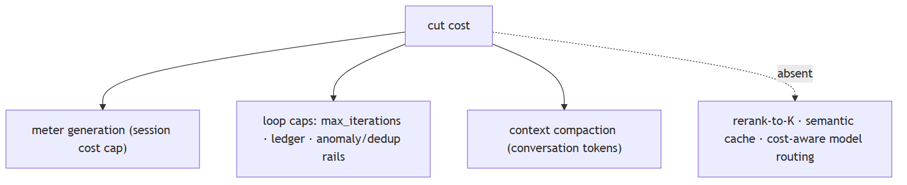

**In Jiuwen.** The product tracks provider session cost and enforces a cap; core caps repetition via max iterations, a team budget ledger, and anomaly and dedup rails; conversation compaction reduces context tokens. But embedding cost is not tracked, there is no semantic or response cache, no reranker, and routing is by availability — so several standard levers are absent.

<b>Under the hood</b>

**Implementation**

The product tracks provider-reported session cost and enforces a per-session cap; core caps repetition via `max_iterations`, team `BudgetLedger`, and anomaly/dedup rails; conversation compaction reduces context tokens. But embedding cost is never tracked, there is no semantic/response cache, no rerank-to-K lever in the KB, and no query-difficulty/cost-aware model routing.

**Code anchors**

| Code anchor | What it points to |
|---|---|
| `jiuwenswarm/jiuwenswarm/server/runtime/usage_cost.py:171/196` | session cost cap |
| `agent-core/openjiuwen/core/single_agent/agents/react_agent.py:288` | max_iterations; agent-core/openjiuwen/harness/schema/config.py:252 — harness default |
| `agent-core/openjiuwen/agent_teams/workflow/engine/budget.py:23` | BudgetLedger |
| `agent-core/openjiuwen/core/context_engine/processor/compressor/full_compact_processor.py:184` | 180k compaction |
| `agent-core/openjiuwen/agent_teams/models/allocator.py:559` | availability routing (not cost/quality) |

---

## 3. How do you control cost in a system where usage scales unpredictably

Mechanism advanced

**TL;DR.** Bound the loop (iterations/rounds/time), cap tokens per request and session, let cheap models do cheap work, cache, offload/summarize context, and surface per-run cost to budget and alert.

**Key points.**

- Bound iterations/time.
- Cap tokens per request/session.
- Cheap models for cheap work.
- Surface per-run cost.

**Concept.** Bound the loop (max iterations/rounds/time), cap tokens per request and per session, make cheap models do cheap work, cache, offload/summarize context, and surface per-run cost so it can be budgeted and alerted. Retries and huge tool outputs are common hidden cost sources.

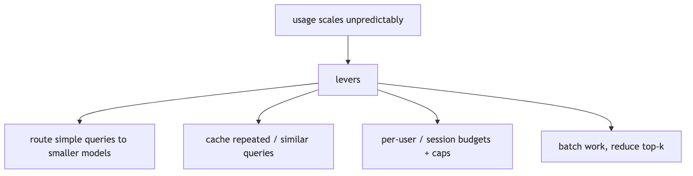

**In Jiuwen.** The product tracks provider-reported session cost and enforces a per-session cap: totals accumulate under a lock, the limit is set only when provider cost metadata is available, and a check raises when over. Core limits repetition via max iterations and anomaly rails. There is no per-request token cap or time budget.

<b>Under the hood</b>

**Implementation**

Repeated tool calls are bounded at several levels: the ReAct loop's `max_iterations` (default 5, harness 15); `ModelAnomalyDetectionRail`, which detects consecutive identical tool-call rounds and either compacts or bails out; `ToolCallDeduplicationRail`, which suppresses repeated read-only calls; and `ToolCallResilienceRail`, which bounds retries (non-idempotent tools are never retried). Team runs add a `BudgetLedger` token ceiling, and the product tracks provider-reported session cost with a per-session cap (`raise_if_session_cost_limit_exceeded`).

**Implementation diagram**

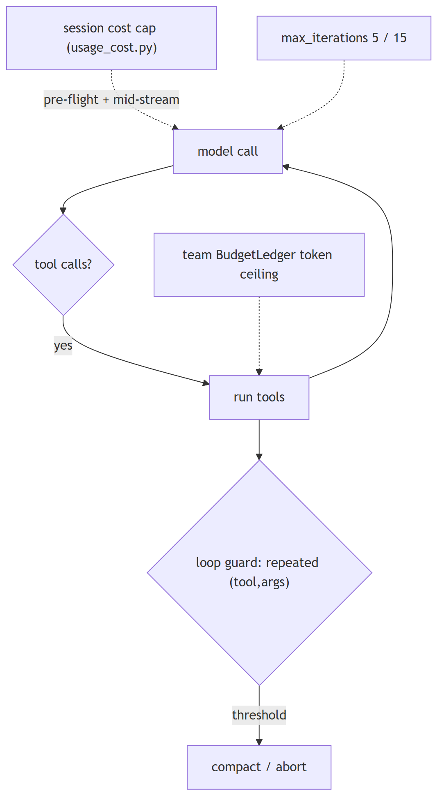

**Code anchors**

| Code anchor | What it points to |
|---|---|
| `jiuwenswarm/jiuwenswarm/server/runtime/usage_cost.py:171` | raise_if_session_cost_limit_exceeded; :196 set_session_cost_limit (requires provider cost) |
| `agent-core/openjiuwen/core/single_agent/agents/react_agent.py:288` | max_iterations; agent-core/openjiuwen/harness/schema/config.py:252 — harness default 15 |
| `agent-core/openjiuwen/agent_teams/workflow/engine/budget.py:23` | BudgetLedger |
| `agent-core/openjiuwen/harness/rails/model_anomaly_detection_rail.py:81/90` | tool-loop threshold + bailout |
| `jiuwenswarm/jiuwenswarm/agents/harness/common/rails/tool_dedup_rail.py:157` | cross-turn repeat counter; agent-core/openjiuwen/harness/goal/evaluation.py:298 — max_attempts |

---

## 4. First cut at 50% cost reduction: route simple queries to a smaller model, reduce top-k

Mechanism intermediate

**TL;DR.** Cheapest high-impact cuts: route easy queries to a smaller model, lower top-k, cache, shorten the prompt, and reduce the agent's iteration cap.

**Key points.**

- Route easy queries to a smaller model.
- Lower top-k.
- Cache.
- Shorten prompt; lower iteration cap.

**Concept.** The cheapest high-impact cuts: route easy queries to a smaller/cheaper model (classify query difficulty first), lower `top_k`, cache, shorten the prompt (fewer examples, tighter context), and reduce the agent's iteration cap. Start with model routing and top-k because they cut the dominant (generation/input-token) cost directly.

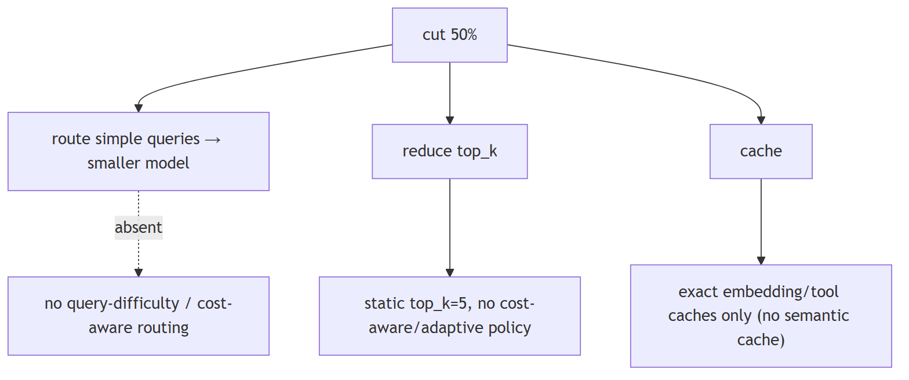

**In Jiuwen.** Model selection here is about availability and endpoint distribution, not cost or query difficulty: the allocator dispatches strategies (round robin, by model name, router, intelli router), and allocation happens at member construction from a model-name hint and is immutable afterward. Difficulty-based routing to a cheaper model must be added.

<b>Under the hood</b>

**Implementation**

Model selection is about availability and endpoint distribution, not cost or query difficulty. `build_model_allocator` dispatches four availability strategies (`round_robin`, `by_model_name`, `router`, `intelli_router`); allocation happens at member construction from a `model_name` hint and is immutable per member. `IntelliRouter` is rate-aware only through `tpm`/`rpm`. The only retrieval-size knob is the static `top_k` (default 5). There is no query-classification-to-model routing and no cost-aware top-k policy.

**Code anchors**

| Code anchor | What it points to |
|---|---|
| `agent-core/openjiuwen/agent_teams/models/allocator.py:559` | build_model_allocator (4 availability strategies); :240 ByModelNameAllocator; :520 resolve_member_model (no query awareness) |
| `agent-core/openjiuwen/agent_teams/models/pool.py:38` | ModelPoolEntry; :278 tpm/rpm rate-aware only |
| `agent-core/openjiuwen/core/retrieval/common/config.py:46` | top_k: int = 5 (only retrieval-size config) |
| `jiuwenswarm/jiuwenswarm/agents/harness/common/memory/manager.py:773` | exact embedding cache (no semantic cache) |

---

## 5. Designing caching for repeated or semantically similar queries

Mechanism intermediate

**TL;DR.** Layer caches: exact-match response/prompt cache, provider prefix/prompt caching, an embedding cache, and a semantic cache that embeds the query and returns a prior answer above a similarity threshold.

**Key points.**

- Exact-match response cache.
- Provider prefix/prompt cache.
- Embedding cache.
- Semantic cache with a similarity threshold.

**Concept.** Layer caches: exact-match response/prompt cache, provider prefix/prompt caching, embedding cache, and — harder — a semantic cache that embeds the query and returns a prior answer for similar queries above a similarity threshold. The semantic cache needs a threshold and invalidation strategy, and exact-match caches need a stable key including model and parameters.

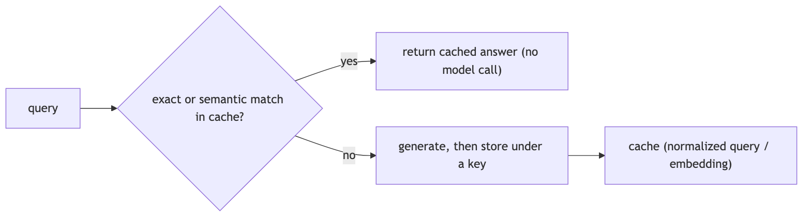

**In Jiuwen.** Caching is exact-match, not semantic. Core has a session KV-cache runtime with affinity and lineage identities to reuse inference KV state; the product memory index keeps a SQLite embedding cache keyed by text hash; agent evolution has its own cache. There is no semantic response cache or general provider prefix caching.

<b>Under the hood</b>

**Implementation**

Caching is exact-match, not semantic. Core has a session KV-cache runtime with affinity/lineage identities (parent/child sessions, team members, compressors) to reuse inference KV state. The product memory index keeps a SQLite `embedding_cache` keyed by text hash, and `agent_evolving` has its own embedding cache. `ToolCallDeduplicationRail` is an exact `(tool_name, args-hash)` per-turn result cache for read-only tools. Local vLLM/transformers use prefix/prompt caches.

**Implementation diagram**

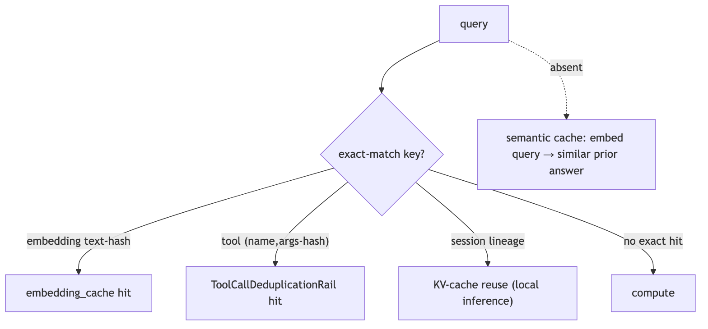

**Code anchors**

| Code anchor | What it points to |
|---|---|
| `agent-core/openjiuwen/core/kv_cache/kv_cache_runtime.py:32` | KVCacheRuntime; agent-core/openjiuwen/core/kv_cache/__init__.py:10 — KVCacheAffinityConfig |
| `jiuwenswarm/jiuwenswarm/agents/harness/common/memory/manager.py:31` | EMBEDDING_CACHE_TABLE; :773 text-hash lookup before embedding |
| `jiuwenswarm/jiuwenswarm/agents/harness/common/rails/tool_dedup_rail.py:47` | exact per-turn tool result cache |
| `agent-core/openjiuwen/core/retrieval/lazy_load.py:25` | lazy import cache; agent-core/openjiuwen/core/context_engine/token/tiktoken_counter.py:221 — reusable encodings |
| `agent-core/openjiuwen/agent_evolving/ttse/stores.py:522` | embedding cache limit; agent-core/openjiuwen/symphony/retrieval/llm/vllm/client.py:176 — prefix cache |

---

## 6. Reducing latency in a multi-step LLM pipeline

Mechanism intermediate

**TL;DR.** Stream tokens so time-to-first-token matters more than total; parallelize independent steps; cache prompts/embeddings; route easy steps to faster models; don't block the event loop.

**Key points.**

- Stream (optimize TTFT).
- Parallelize independent steps.
- Cache prompts/embeddings.
- Route easy steps to faster models.

**Concept.** Stream tokens so time-to-first-token matters more than total; run independent steps in parallel; cache prompts/prefixes and embeddings; route easy steps to faster/smaller models; and avoid blocking the event loop. Measure TTFT and per-stage latency to find the bottleneck.

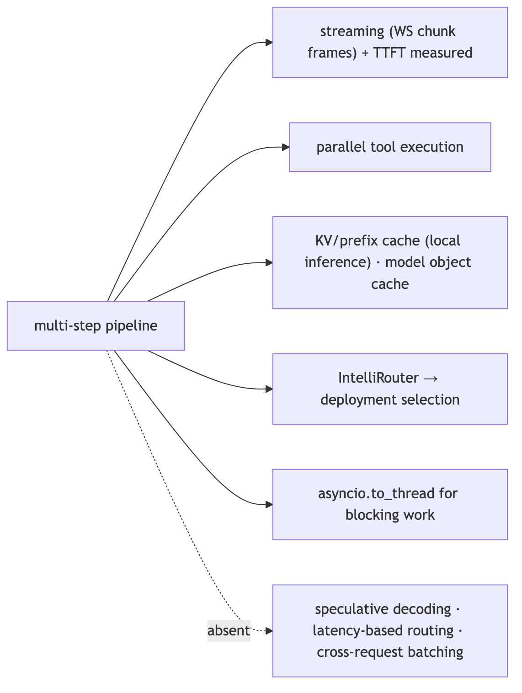

**In Jiuwen.** End-to-end streaming is supported and TTFT is measured per model call. Shared persistent HTTP clients avoid per-call TLS setup, parallel tool execution shortens multi-tool turns, and local inference uses prompt and prefix KV caching. Streaming, connection reuse, and TTFT measurement are in place.

<b>Under the hood</b>

**Implementation**

End-to-end streaming is supported (ReAct `stream` → session stream iterator → WebSocket chunk frames), and TTFT is measured per model call (`ttft_ms`). Shared persistent HTTP clients avoid per-call TLS setup, parallel tool execution shortens multi-tool turns, and local inference uses prompt/prefix KV-cache reuse. `IntelliRouter` provides a reliable router across deployments, and the product caches built model objects by name.

**Code anchors**

| Code anchor | What it points to |
|---|---|
| `agent-core/openjiuwen/core/single_agent/agents/react_agent.py:2938` | stream entry; :1758 ttft_ms |
| `agent-core/openjiuwen/core/foundation/llm/model.py:197` | stream first-chunk/idle timeouts |
| `agent-core/openjiuwen/core/kv_cache/kv_cache_runtime.py:32` | session KV-cache runtime |
| `agent-core/openjiuwen/symphony/retrieval/llm/vllm/client.py:176` | prepare_prefix_cache |
| `agent-core/openjiuwen/core/foundation/llm/model_clients/intelli_router_model_client.py:32` | ReliableRouter |
| `jiuwenswarm/jiuwenswarm/server/runtime/agent_adapter/interface_deep.py:6353` | model object cache by name |

---

## 7. Multithreading vs. multiprocessing, which matters more for I/O-bound LLM API calls

Mechanism intermediate

**TL;DR.** For I/O-bound calls, async or threads beat multiprocessing: the CPU is idle while waiting, so you want concurrency, not extra processes. Async is the most efficient.

**Key points.**

- I/O-bound → concurrency, not processes.
- Async is most efficient.
- Multiprocessing only for CPU-bound work.

**Concept.** For I/O-bound work (network calls to LLM APIs, vector DBs), async I/O or threads beat multiprocessing: the CPU is idle while waiting, so you want concurrency, not extra processes. Async is the most efficient (no thread-per-request overhead) when your stack is async end to end; threads are the fallback for blocking SDKs. Multiprocessing only pays off for CPU-bound work (local inference, heavy parsing) because it escapes the GIL.

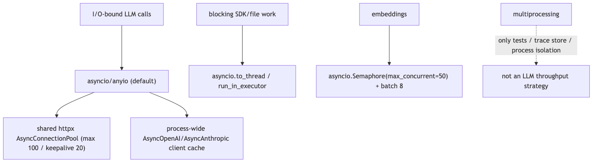

**In Jiuwen.** The LLM path is single-process asyncio/anyio: async HTTP clients share a process-global connection pool, and async model clients are cached process-wide with bounded limits. Blocking work is offloaded to threads. It is async-first with a shared connection pool, matching I/O-bound guidance.

<b>Under the hood</b>

**Implementation**

The LLM path is single-process asyncio/anyio. `httpx.AsyncClient` instances share a process-global `AsyncConnectionPool` via `HttpXConnectorPool`, and `AsyncOpenAI`/`AsyncAnthropic` clients are cached process-wide with `httpx.Limits(max_connections=100, max_keepalive_connections=20)`. Blocking work is offloaded with `asyncio.to_thread`/`run_in_executor`, never `multiprocessing`. Embeddings use an `asyncio.Semaphore(max_concurrent)` (default 50), with a `ThreadPoolExecutor` only for the sync facade. `multiprocessing` appears in tests, the observability trace store, process isolation, and `agent_rl`'s offline `parallel_executor` — not as an LLM throughput strategy.

**Code anchors**

| Code anchor | What it points to |
|---|---|
| `agent-core/openjiuwen/core/common/clients/llm_client.py:52` | HttpXConnectorPool (AsyncConnectionPool) |
| `agent-core/openjiuwen/core/foundation/llm/model_clients/openai_model_client.py:383` | process-wide _client_cache; :1118 httpx.Limits(max_connections=100, max_keepalive_connections=20) |
| `agent-core/openjiuwen/core/foundation/llm/model_clients/anthropic_model_client.py:719` | same pooling for AsyncAnthropic |
| `agent-core/openjiuwen/core/retrieval/embedding/api_embedding.py:55` | asyncio.Semaphore(max_concurrent); :120 ThreadPoolExecutor for sync path |
| `jiuwenswarm/jiuwenswarm/server/agent_ws_server.py:5326` | asyncio.to_thread(...) offload; jiuwenswarm/jiuwenswarm/server/runtime/agent_warm_pool.py:154 — semaphore-bounded warm pool |

---

## 8. What happens to your architecture at 10x current traffic

Design advanced

**TL;DR.** You hit dependencies and queues before arithmetic: provider rate limits and 429s, serialized tool/DB access, memory pressure from context, and connection pools. Cost scales with tokens.

**Key points.**

- Provider rate limits/429s first.
- Serialized tool/DB access.
- Memory pressure from context.
- Connection pools.

**Concept.** You hit dependencies and queues before arithmetic: provider rate limits and 429s, serialized tool/DB access, memory pressure from context, and connection pools. Costs scale roughly linearly with tokens but can super-linearly if retries or coordination rise. Fixes are caching, concurrency limits, queues/shards, backpressure, and cheaper routing — plus autoscaling at the process boundary.

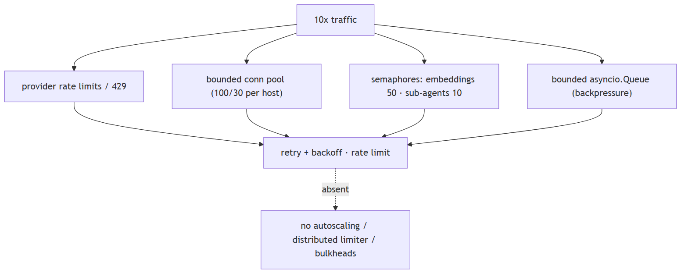

**In Jiuwen.** The system has per-process bounded resources rather than elastic scaling: LLM HTTP concurrency is capped by a shared pool (100 connections, 20 keepalive), embeddings by a semaphore (default 50, batch 8), team sub-agent fan-out by a semaphore (default 10), and the warm pool and messaging have their own bounds. At 10x the first limits are these per-process caps.

<b>Under the hood</b>

**Implementation**

The system has per-process bounded resources rather than elastic scaling. LLM HTTP concurrency is capped by a shared httpx pool (`max_connections=100`, keepalive 20); embeddings by a semaphore (default 50) with batch size 8; team sub-agent fan-out by a semaphore (default 10); the warm pool and message queues have their own bounds. Internal channels use bounded `asyncio.Queue(maxsize=...)`; workflow HTTP supports token-bucket rate limiting; retries/backoff exist at model and tool layers. There is no autoscaling.

**Code anchors**

| Code anchor | What it points to |
|---|---|
| `agent-core/openjiuwen/core/common/clients/connector_pool.py:21` | limit: 100, limit_per_host: 30; agent-core/openjiuwen/core/foundation/llm/model_clients/openai_model_client.py:1118 — pool limits |
| `agent-core/openjiuwen/core/retrieval/embedding/api_embedding.py:55` | concurrency semaphore |
| `agent-core/openjiuwen/core/multi_agent/teams/hierarchical_msgbus/p2p_ability_manager.py:34` | max parallel sub-agents |
| `agent-core/openjiuwen/core/workflow/components/tool/http/http_request_component.py:110` | HttpRateLimitConfig |
| `agent-core/openjiuwen/core/runner/message_queue_inmemory.py:34` | bounded queue; agent-core/openjiuwen/harness/subagent_runtime/activity_events.py:53 — bounded activity queue |
| `agent-core/openjiuwen/harness/rails/model_anomaly_detection_rail.py:35` | backoff schedule; jiuwenswarm/jiuwenswarm/server/runtime/agent_warm_pool.py:154 — warm-pool semaphore split |

---

## 9. Scaling questions test whether you've thought past the demo

Mechanism intermediate

**TL;DR.** Scaling questions test whether you've thought past the demo.

**Key points.**

- Per-process bounded resources.
- Shared HTTP pool + embedding/sub-agent semaphores.
- Missing: autoscaling, distributed queues.

**Concept.** Most architectures do not survive 10x traffic. Name one lever *with where it fits*: caching repeated queries, batching concurrent requests, parallelizing independent tool calls. Identify the first bottleneck (provider rate limits, serialized tools, connection pools, context memory), then name the lever and where it sits. Mention backpressure and bounded concurrency, not just "add more servers".

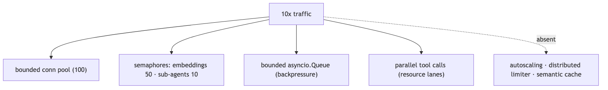

**In Jiuwen.** Bounded resources exist per process: a shared HTTP pool (100 connections), embedding semaphore (50), sub-agent fan-out semaphore (10), bounded async queues, and parallel tool execution with resource lanes. What is missing is autoscaling and a distributed queue.

<b>Under the hood</b>

**Implementation**

Bounded resources exist per process: shared httpx pool (`max_connections=100`), embedding semaphore (50), sub-agent fan-out semaphore (10), bounded `asyncio.Queue`s, and parallel tool execution with resource lanes. What is missing is autoscaling, a distributed rate limiter, and any semantic response cache — so the design change at 10x is mostly "add replicas + a global limiter", which the repo does not provide.

**Code anchors**

| Code anchor | What it points to |
|---|---|
| `agent-core/openjiuwen/core/common/clients/connector_pool.py:21` | limit: 100, limit_per_host: 30 |
| `agent-core/openjiuwen/core/retrieval/embedding/api_embedding.py:55` | concurrency semaphore |
| `agent-core/openjiuwen/core/runner/message_queue_inmemory.py:34` | bounded queue; agent-core/openjiuwen/harness/subagent_runtime/activity_events.py:53 — bounded activity queue |
| `agent-core/openjiuwen/core/single_agent/ability_manager.py:431` | _execute_parallel_tool_tasks; :467 parallel_safe lanes |
| `jiuwenswarm/jiuwenswarm/agents/harness/common/memory/manager.py:773` | exact embedding cache (no semantic cache) |

---

## 10. What's your rollback plan if a prompt or model update degrades output quality?

Mechanism advanced

**TL;DR.** Make every change reversible and observable: version the prompt/model, ship behind a flag or canary, define a one-command rollback, gate rollout on a fixed eval, and monitor quality (not just errors).

**Key points.**

- Version prompts/models.
- Ship behind flag/canary.
- One-command rollback.
- Gate on eval; monitor quality.

**Concept.** Make every change reversible and observable: version the prompt/model, ship behind a flag or canary, define a one-command rollback, and gate broad rollout on a fixed eval. Monitor quality (not just errors) so you detect the degradation, and keep the previous version warm.

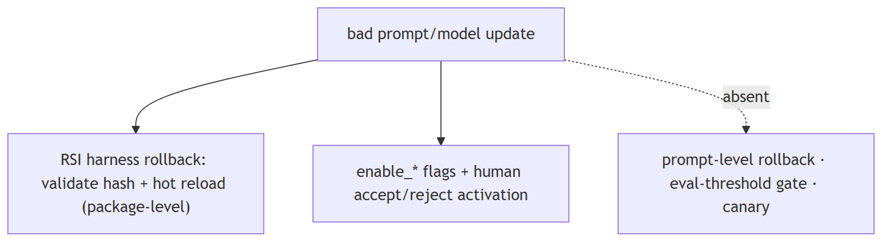

**In Jiuwen.** Rollback exists for whole RSI harness packages: a rollback call refuses while tasks are active, validates the target hash, hot-reloads the prior version, and compensates if the pointer write fails, exposed over the WebSocket protocol. Behavior changes are gated by enable flags and a human accept/reject. Prompt-level versioning is weaker.

<b>Under the hood</b>

**Implementation**

Rollback exists for whole RSI **harness packages**: `rollback(installation_id)` refuses while tasks are active, validates the target hash, hot-reloads the prior version, and compensates if the pointer write fails — exposed over the WebSocket protocol. Behavior is gated by `enable_*` flags and a human `accept`/`reject` activation step. But there is **no prompt-level rollback** and no eval-threshold release gate, so a bad prompt change is only reversible if it was packaged as a harness version.

**Code anchors**

| Code anchor | What it points to |
|---|---|
| `jiuwenswarm/jiuwenswarm/agents/harness/common/rsi/harness_activation.py:617` | rollback; :682 _assert_rollback_allowed; :694 validate target hash |
| `jiuwenswarm/jiuwenswarm/server/rsi/rsi_handlers.py:218/224` | versions list + rollback RPC |
| `agent-core/openjiuwen/harness/schema/deep_agent_spec.py:448` | enable_* flags |
| `agent-core/openjiuwen/auto_harness/stages/activate.py:118` | explicit accept/reject |
| `agent-core/openjiuwen/auto_harness/resources/ci_gate.yaml:21` | no eval gate |

---

## 11. A stakeholder wants to ship before your eval scores are ready, how do you handle it

Mechanism intermediate

**TL;DR.** Mostly process: de-risk instead of refusing — ship behind a flag or canary, define a rollback path, cap the blast radius, agree on a minimal offline eval, and add monitoring so a quality drop is visible.

**Key points.**

- Ship behind flag/canary.
- Define rollback and cap blast radius.
- Minimal offline eval gate.
- Monitoring to detect drops.

**Concept.** This is mostly process. De-risk instead of refusing: ship behind a flag or to a small canary, define a rollback path, cap the blast radius, agree on a minimal offline eval before broad rollout, and add monitoring so a quality drop is caught quickly. Make the tradeoff explicit (what's unmeasured, what the fallback is) and put a date on the missing eval.

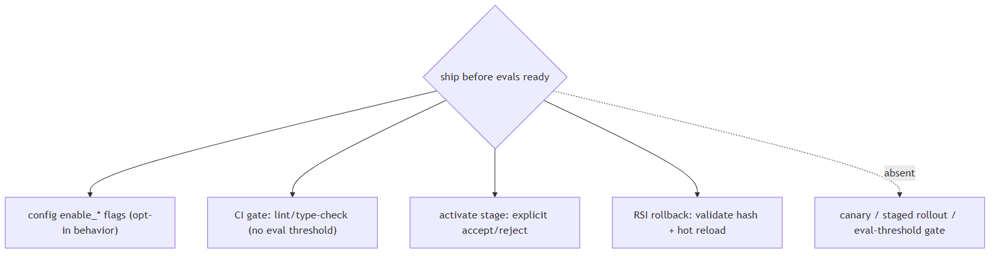

**In Jiuwen.** The closest code mechanisms are CI gates and explicit human activation, not an eval-score gate. The auto-harness gate runner loads gates from a config and returns pass/fail; the activate stage requires an explicit user accept/reject before an extension is hot-loaded; and product harness activation is similar. Gating is human and CI based rather than eval-score based.

<b>Under the hood</b>

**Implementation**

The closest code mechanisms are CI gates and explicit human activation, not an eval-score gate. The auto-harness `CIGateRunner` loads gates from `ci_gate.yaml` and returns pass/fail; the activate stage requires an explicit user `accept`/`reject` before an extension is hot-loaded; and the product's RSI harness activation supports rollback (refuses while tasks are active, validates the target hash, hot-loads the old version). Behavior gating is done with `enable_*` config flags. There is no release gate tied to eval thresholds and no canary/percentage rollout.

**Code anchors**

| Code anchor | What it points to |
|---|---|
| `agent-core/openjiuwen/auto_harness/infra/ci_gate_runner.py:173` | load gates; :1153 run + aggregate passed |
| `agent-core/openjiuwen/auto_harness/stages/activate.py:118` | explicit accept/reject interaction before hot-load |
| `agent-core/openjiuwen/auto_harness/stages/merge.py:95` | static-check retry (max 3) then fail-fast |
| `jiuwenswarm/jiuwenswarm/agents/harness/common/rsi/harness_activation.py:617` | rollback; :682 _assert_rollback_allowed; :694 validate target hash |
| `agent-core/openjiuwen/harness/schema/deep_agent_spec.py:448` | enable_* config flags |

---

## 12. Controlling cost when an agent can call tools repeatedly

Mechanism intermediate

**TL;DR.** Bound the loop (iterations/rounds/time), cap tokens, use cheaper models for cheap work, cache, and surface per-run cost; retries and huge tool outputs are hidden cost sources.

**Key points.**

- Bound loop: iterations/rounds/time.
- Cap tokens; route cheap work to small models.
- Cache; watch retries and large tool outputs.

**Concept.** Bound the loop (max iterations/rounds/time), cap tokens, make cheap models do cheap work, cache, and surface per-run cost so it can be budgeted. Retries and huge tool outputs are common hidden cost sources.

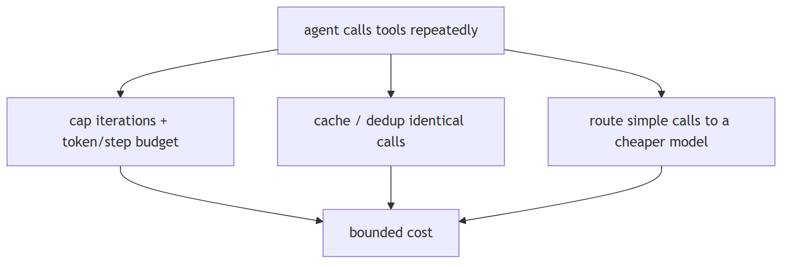

**In Jiuwen.** The product tracks provider-reported session cost and enforces a per-session cap: totals accumulate under a lock, the limit is set only when provider cost metadata is available, and a check raises when exceeded. Core limits repeated calls (iteration caps and anomaly/dedup rails), and tool outputs are offloaded or compacted to control token cost.

<b>Under the hood</b>

**Implementation**

Repeated tool calls are bounded at several levels: the ReAct loop's `max_iterations` (default 5, harness 15); `ModelAnomalyDetectionRail`, which detects consecutive identical tool-call rounds and either compacts or bails out; `ToolCallDeduplicationRail`, which suppresses repeated read-only calls; and `ToolCallResilienceRail`, which bounds retries (non-idempotent tools are never retried). Team runs add a `BudgetLedger` token ceiling, and the product tracks provider-reported session cost with a per-session cap (`raise_if_session_cost_limit_exceeded`).

**Implementation diagram**

**Code anchors**

| Code anchor | What it points to |
|---|---|
| `jiuwenswarm/jiuwenswarm/server/runtime/usage_cost.py:171` | raise_if_session_cost_limit_exceeded; :196 set_session_cost_limit (requires provider cost) |
| `agent-core/openjiuwen/core/single_agent/agents/react_agent.py:288` | max_iterations; agent-core/openjiuwen/harness/schema/config.py:252 — harness default 15 |
| `agent-core/openjiuwen/agent_teams/workflow/engine/budget.py:23` | BudgetLedger |
| `agent-core/openjiuwen/harness/rails/model_anomaly_detection_rail.py:81/90` | tool-loop threshold + bailout |
| `jiuwenswarm/jiuwenswarm/agents/harness/common/rails/tool_dedup_rail.py:157` | cross-turn repeat counter; agent-core/openjiuwen/harness/goal/evaluation.py:298 — max_attempts |

---

## 13. Cutting tokens without losing quality: tighter reranking, summarizing long chunks

Mechanism intermediate

**TL;DR.** Retrieve fewer but better chunks (rerank a larger candidate set down to small k), summarize long chunks, and trim history.

**Key points.**

- Retrieve many, rerank to few (needs a reranker).
- Summarize long chunks before insertion.
- Trim conversation history.

**Concept.** Reduce prompt tokens by retrieving fewer but better chunks (rerank a larger candidate set down to a small k), summarizing long chunks/passages before insertion, and trimming conversation history. Reranking preserves quality while cutting k; summarization trades fidelity for tokens. Both beat blindly lowering k.

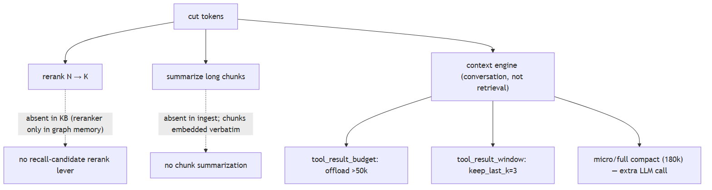

**In Jiuwen.** The retrieval path exposes only top_k (default 5) and an optional score threshold, and because the default knowledge-base path never invokes a reranker, 'retrieve N, rerank to K' is absent. Token reduction instead comes from offloading and compressing context in the context engine, not from the retrieval stage.

<b>Under the hood</b>

**Implementation**

The retrieval path exposes only `top_k` (default 5) and `score_threshold`, and threshold filtering is honored only in `mode="vector"`. Crucially, the KB path never invokes a reranker (the `Reranker` classes are wired only into graph-memory search), so "retrieve N, rerank to K" is absent. Token reduction instead happens in the context engine on the *conversation*: tool results over 50k tokens are offloaded, stale tool results beyond `keep_last_k=3` are windowed, micro-compaction clears old tool results, and full compaction LLM-summarizes at 180k. Chunk text is embedded verbatim — no chunk-level summarization.

**Code anchors**

| Code anchor | What it points to |
|---|---|
| `agent-core/openjiuwen/core/retrieval/common/config.py:46` | top_k: int = 5; :47 score_threshold |
| `agent-core/openjiuwen/core/retrieval/retriever/hybrid_retriever.py:64` | threshold rejected unless mode="vector"; :41 retrieve path has no reranker |
| `agent-core/openjiuwen/core/memory/graph/graph_memory/base.py:645` | reranker only in graph-memory search |
| `agent-core/openjiuwen/core/context_engine/processor/offloader/tool_result_budget_processor.py:34` | tokens_threshold=50000; agent-core/openjiuwen/core/context_engine/processor/offloader/tool_result_window_processor.py:44 — keep_last_k=3 |
| `agent-core/openjiuwen/core/context_engine/processor/compressor/micro_compact_processor.py:24` | threshold 5; agent-core/openjiuwen/core/context_engine/processor/compressor/full_compact_processor.py:184 — 180k |
| `agent-core/openjiuwen/core/retrieval/query_rewriter/query_rewriter.py:227/349` | compress_range=20 + history compression |

---

## 14. What does structured agent tracing look like, and why does print-debugging fail at scale?

Mechanism intermediate

**TL;DR.** Emit typed events (model call, tool call, retrieval, decision) with shared trace/span IDs; print-debugging can't be queried, aggregated, or correlated at scale.

**Key points.**

- Minimum event: trace_id, span_id, event_type, payload, duration_ms.
- Enables: offline replay, production latency monitoring, attached eval scoring.
- Jiuwen: ObservabilityEvent + TraceManager cover model/tool calls; retrieval events are not structured spans.

**Concept.** Print/log statements produce unstructured text: you can't query "all tool calls in session X", can't aggregate latency by tool, and can't correlate a wrong answer back to which retrieval chunk was in context. Structured tracing means emitting a typed event for every meaningful action — model call started/completed, tool called/returned, retrieval executed, decision made — with a shared trace/span ID so events from the same agent run can be grouped. Each event carries: timestamp, latency, token counts, tool name + arguments, retrieval score, model response. This enables offline debugging (replay a trace), production monitoring (alert on p99 latency), and eval (attach ground truth to a trace for scoring). The minimum viable schema: `trace_id`, `span_id`, `event_type`, `payload`, `duration_ms`.

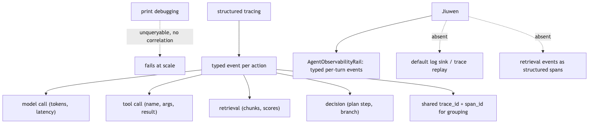

**In Jiuwen.** ObservabilityEvent (agent-core/openjiuwen/harness/observability/event.py) is the framework's structured event type; ObservabilityHandler forwards events to a backend. ReactAgent emits events at model call, tool call, and final answer points. TraceManager/TraceHandler (agent-core/openjiuwen/harness/trace/trace_manager.py) provide span-level tracing with parent-child linking. Retrieval events (chunk ids, scores) are not emitted as structured spans — they appear only in tool result text.

<b>Under the hood</b>

**Implementation**

`AgentObservabilityRail` (`harness/observability/rail.py`) emits typed observability events at the major points of each turn — model call, tool call, final answer — and is always the last rail in the profile. Token and cost figures come from the model response's usage metadata. Events are delivered to a subscribing consumer: there is no default log sink, and retrieval details (which chunks, their scores) are not emitted as structured spans — they appear only in tool-result text, so cross-run retrieval analytics need manual instrumentation.

**Code anchors**

| Code anchor | What it points to |
|---|---|
| `agent-core/openjiuwen/harness/observability/rail.py:355` | AgentObservabilityRail (typed events) |
| `agent-core/openjiuwen/core/single_agent/agents/react_agent.py:1328` | _emit_context_usage (token/usage emission) |
| `agent-core/openjiuwen/core/foundation/llm/schema/generation_response.py:9` | GenerationResponse usage/token counts |

---

## 15. How do you route between multiple model providers — and when do you switch dynamically?

Mechanism advanced

**TL;DR.** Route between providers statically (config) or dynamically (primary/fallback, capability, cost); ensure response-format compatibility and observable routing decisions.

**Key points.**

- Static: provider set at agent construction in ModelConfig.
- Dynamic patterns: primary/fallback, capability router, cost router.
- Jiuwen: no built-in runtime router; CircuitBreakerRail trips but doesn't reroute.

**Concept.** Multi-provider routing has two modes: static (choose provider at config time based on cost, capability, or data residency) and dynamic (route at request time based on load, availability, or task type). Dynamic routing patterns: (1) primary/fallback — always try provider A, fall back to B on error or timeout; (2) capability routing — send code tasks to a coding-optimized model, chat tasks to a general model; (3) cost routing — send cheap queries to a small cheap model, expensive reasoning to a large model (classifier decides). Key considerations: response format compatibility across providers (different tool-call schemas), token counting per-provider, and observable routing decisions (which provider was actually used).

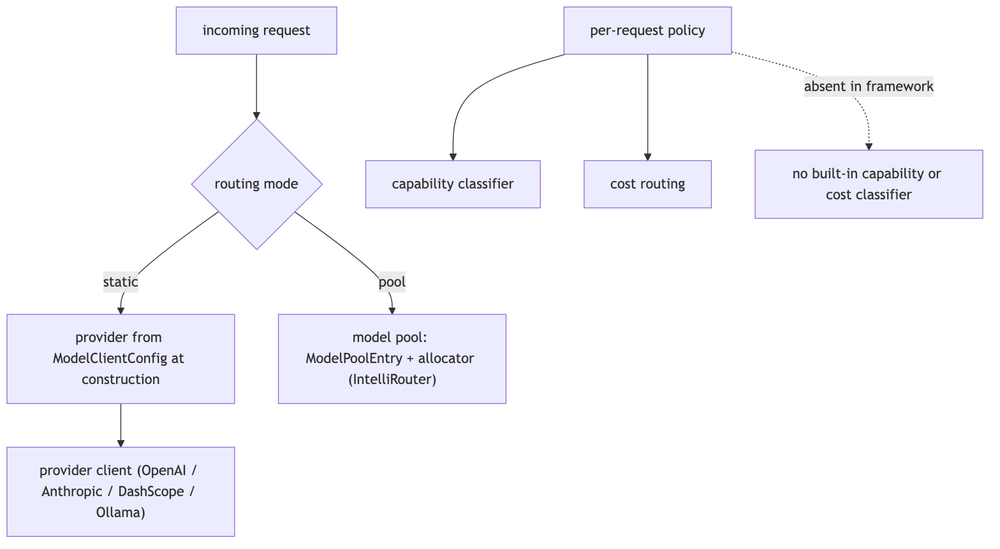

**In Jiuwen.** ModelClientFactory (agent-core/openjiuwen/core/model/client/factory.py) selects a provider at agent construction time. ModelConfig references a named provider + model ID. No built-in runtime routing layer exists — no primary/fallback chain, no capability classifier, no cost-based dispatch. Multi-provider setups require application-layer orchestration (configuring different agents with different ModelConfigs). CircuitBreakerRail trips on consecutive failures and opens the circuit, but does not reroute to an alternate provider.

<b>Under the hood</b>

**Implementation**

Routing is configured per agent through `ModelClientConfig` and `ProviderType`, and `create_model_client` resolves the provider client. At the team layer there is a real model pool: `ModelPoolEntry` plus allocators (including `IntelliRouterAllocator`) select a model by name, rotation, and health. What is not built in is a per-request capability classifier or cost-based dispatcher that picks a model for each call; those policies live in the application or in the pool configuration. `CircuitBreakerRail` trips on consecutive failures and cools down, which is the closest analogue to provider failover.

**Code anchors**

| Code anchor | What it points to |
|---|---|
| `agent-core/openjiuwen/core/foundation/llm/model_clients/__init__.py:58` | create_model_client provider dispatch |
| `agent-core/openjiuwen/core/foundation/llm/schema/config.py:13` | ProviderType / ModelClientConfig |
| `agent-core/openjiuwen/agent_teams/models/pool.py:38` | ModelPoolEntry; agent-core/openjiuwen/agent_teams/models/allocator.py:452 — IntelliRouterAllocator |
| `jiuwenswarm/jiuwenswarm/agents/harness/common/rails/execution_guard/circuit_breaker_rail.py:303` | CircuitBreakerRail failure trip + cooldown |

---

## 16. What is the correct fallback sequence when a model call fails?

Mechanism intermediate

**TL;DR.** Transient errors → retry with backoff; still failing → fallback provider; permanent errors → skip retry; quality failures → modified prompt or abstain. Always return a graceful degraded response.

**Key points.**

- Transient (timeout, 5xx, rate limit): retry ×3 with exponential backoff.
- Permanent (auth, unsupported): fail immediately.
- Quality (bad output): retry with modified prompt or abstain.
- Jiuwen: CircuitBreakerRail trips on consecutive errors but raises — no graceful degraded response, no auto fallback provider.

**Concept.** Model call failures fall into three categories: transient (timeout, rate limit, 5xx), permanent (auth error, unsupported model, input too long), and quality (response parsed but content invalid/refused). The correct fallback sequence: (1) retry with exponential backoff + jitter for transient errors (max 3 attempts); (2) if still failing, route to a fallback provider/model if one is configured; (3) if the fallback also fails or no fallback exists, return a graceful degraded response — "I was unable to complete this request, please try again" — rather than surfacing a raw exception. Do not retry permanent errors (they will not recover). Do not retry quality failures as-is (retry with a modified prompt or abstain).

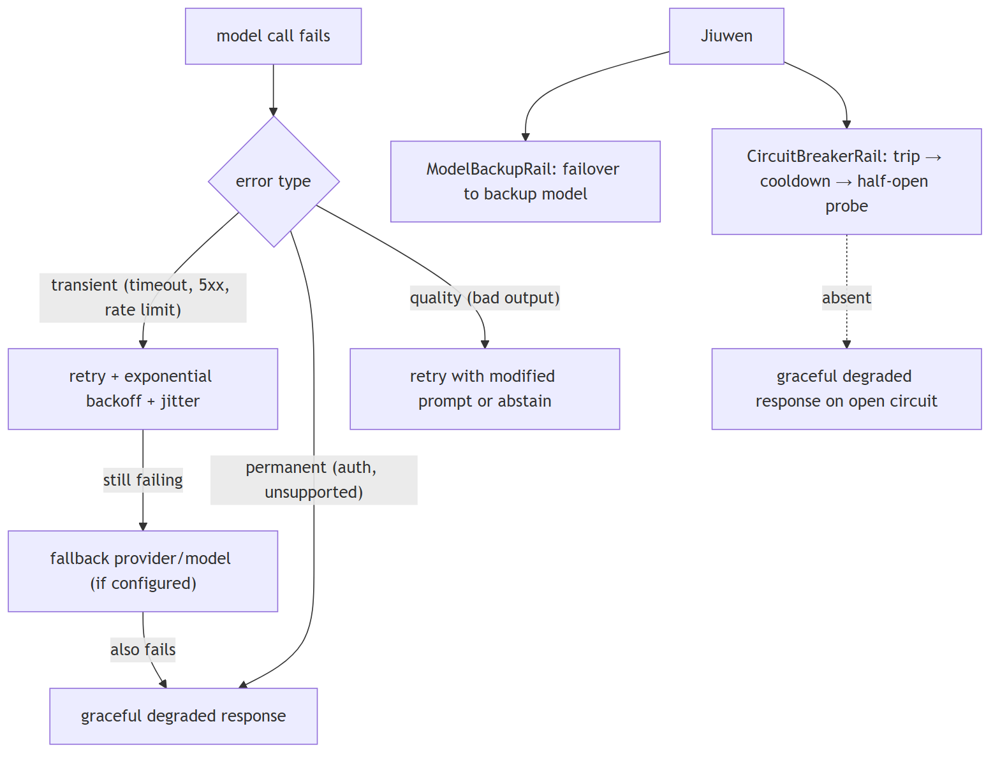

**In Jiuwen.** CircuitBreakerRail (agent-core/openjiuwen/harness/rails/circuit_breaker_rail.py) tracks consecutive failures, opens after a threshold, then half-opens to probe recovery. ModelRequestConfig.timeout is forwarded to the provider client. No automatic fallback-provider routing exists — an open circuit raises an exception. No retry-with-modified-prompt path for quality failures. Graceful degraded responses are not emitted by any rail.

<b>Under the hood</b>

**Implementation**

`ModelBackupRail` provides failover to a backup model on failure, and `CircuitBreakerRail` tracks consecutive failures, opens the circuit during cooldown, and half-opens to probe recovery. `ModelClientConfig.timeout` is forwarded to the provider client. There is no structured degraded response emitted by a rail, and no retry-with-modified-prompt path for quality failures.

**Code anchors**

| Code anchor | What it points to |
|---|---|
| `jiuwenswarm/jiuwenswarm/agents/harness/common/rails/execution_guard/circuit_breaker_rail.py:303` | CircuitBreakerRail open/closed/half-open states |
| `agent-core/openjiuwen/core/single_agent/rail/model_backup.py:9` | ModelBackupRail failover |
| `agent-core/openjiuwen/core/foundation/llm/schema/config.py:102` | ModelClientConfig.timeout |

---
