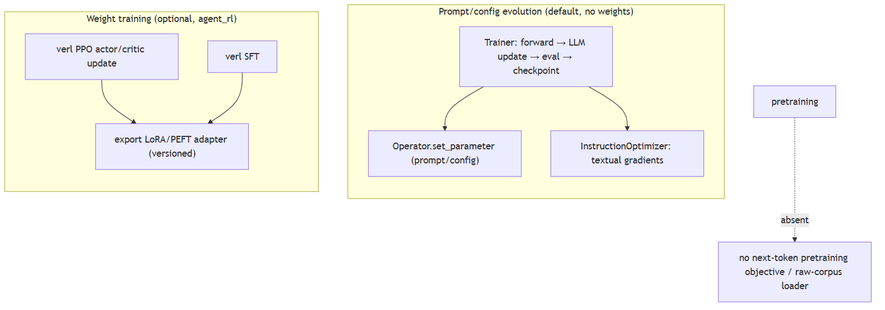
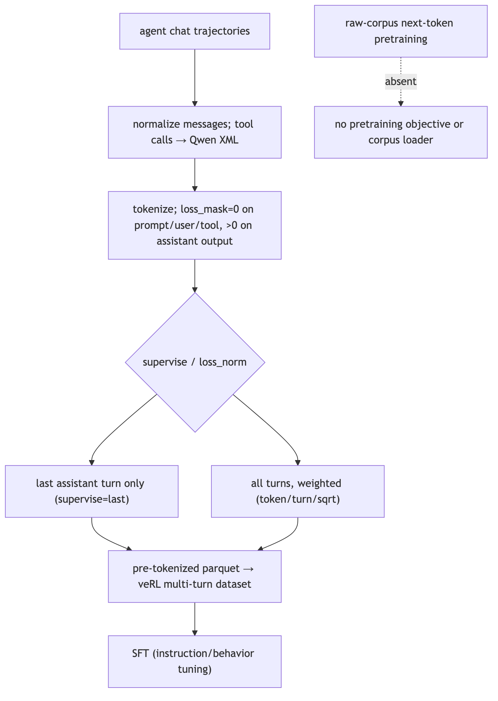
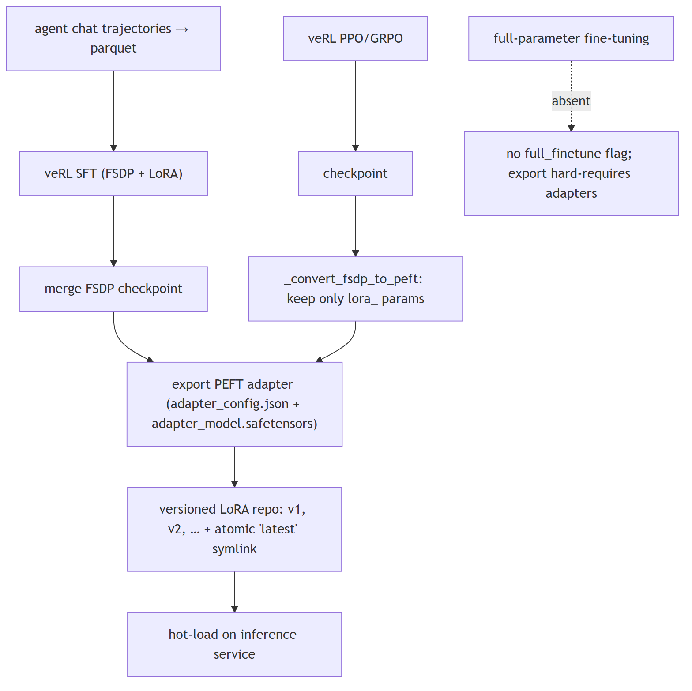
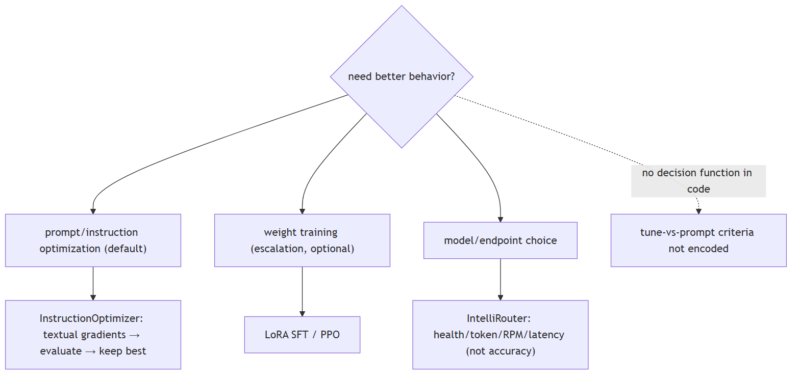
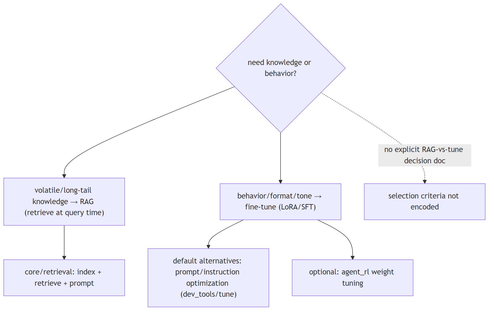
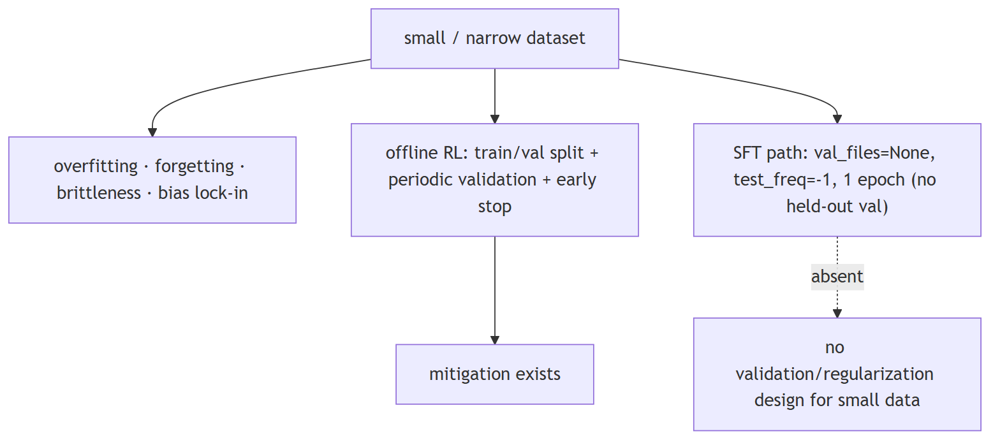

# Fine-tuning and customization

## 1. What's the difference between pretraining and fine-tuning

basic

**Title.** Pretraining vs fine-tuning

**Summary.** Pretraining learns general language structure from a huge unlabeled corpus (self-supervised); fine-tuning adapts a pretrained model to a task with labeled data. Here 'evolution' optimizes prompts, not weights.

**Key points.**

- Pretraining: self-supervised, general, expensive.
- Fine-tuning: task adaptation with labels.
- Jiuwen's default evolution tunes prompts, not weights.

**General.** Pretraining learns general language structure from a huge unlabeled corpus with a self-supervised objective (next-token or masked-token); it is expensive and done once per base model. Fine-tuning adapts a pretrained model to a task/domain/behavior on a much smaller labeled or demonstration dataset, updating some or all weights. Instruction tuning is a specific kind of fine-tuning on instruction→response pairs.

**Jiuwen.** Two distinct things live here. The default evolution path does not train weights: the evolving trainer runs evaluate, LLM-generated update, validate, and checkpoint, then writes back operators and parameters (prompts, configs) using textual gradients — prompt optimization. Weight training happens only in separate SFT/RL trainers via LoRA adapters.

<b>Jiuwen technical detail (classes &amp; functions)</b>

**Implementation**

Two distinct things live here. The default "evolution" path does **not** train weights: `agent_evolving.Trainer` runs evaluate → LLM-generated update → validate → checkpoint and writes back **operators/parameters** (system/user prompts, configs) via `Operator.set_parameter` using "textual gradients" — prompt optimization, not gradient descent. `rsi/` and `auto_harness` evolve harness code/prompt sections. Separately, the optional `agent_evolving/agent_rl/` subsystem genuinely trains weights with veRL (PPO actor/critic updates, SFT) and exports **LoRA/PEFT adapters**. There is no from-scratch pretraining.

**Code anchors**

| Code anchor | What it points to |
|---|---|
| `agent-core/openjiuwen/agent_evolving/trainer/trainer.py:145` | train() loop; :356 op.set_parameter(target, value) |
| `agent-core/openjiuwen/agent_evolving/optimizer/llm_call/instruction_optimizer.py:30` | prompt rewrite via textual gradients |
| `agent-core/openjiuwen/rsi/__init__.py:2` | recursive self-improvement over harness/prompt/code |
| `agent-core/openjiuwen/agent_evolving/agent_rl/rl_trainer/ppo_step.py:146` | update_actor / :145 update_critic (real PPO) |
| `agent-core/openjiuwen/agent_evolving/agent_rl/online/backends/sft/trainer.py:211` | async SFT producing a LoRA |
| `agent-core/openjiuwen/agent_evolving/agent_rl/optimizer/task_runner.py:438` | export_lora(...); :489 _convert_fsdp_to_peft(...) |
| `agent-core/openjiuwen/agent_evolving/agent_rl/storage/lora_repo.py:51` | versioned adapter store |

**Canonical source**

`source/llm-fundamentals-interview-questions_for_engineers.md`

---

## 2. What is instruction tuning, and how is it different from base model pretraining

basic

**Title.** Instruction tuning

**Summary.** Pretraining is self-supervised and yields a base model that completes text; instruction tuning is supervised fine-tuning on (instruction, response) pairs so the model follows instructions.

**Key points.**

- Pretraining: next/masked token, not instruction-following.
- Instruction tuning: supervised on instruction/response pairs.
- Produces an assistant that follows instructions.

**General.** Pretraining is self-supervised on raw text (predict the next/masked token) and produces a base model that completes text but does not follow instructions. Instruction tuning is supervised fine-tuning on (instruction, response) pairs that teaches the base model to follow commands, formats, and safety behavior. It is a small, high-quality stage relative to pretraining.

**Jiuwen.** Instruction tuning is implemented as SFT over agent chat trajectories: messages are normalized, tool calls are rendered into Qwen XML, and each assistant turn is tokenized with a loss mask that is zero for prompt, user, and tool tokens and nonzero only on assistant output tokens. A supervise option can train only the final turn.

<b>Jiuwen technical detail (classes &amp; functions)</b>

**Implementation**

Instruction tuning is implemented as **SFT over agent chat trajectories**: messages are normalized, tool calls are rendered into Qwen XML, and each assistant turn is tokenized with a `loss_mask` that is 0 for prompt/user/tool tokens and non-zero only on assistant output tokens. `supervise="last"` trains only the final assistant turn; `loss_norm` (`token`/`turn`/`sqrt`) controls per-turn weighting. The output is a pre-tokenized parquet consumed by a custom multi-turn dataset in veRL. This is behavior tuning on demonstrations, not continued pretraining.

**Code anchors**

| Code anchor | What it points to |
|---|---|
| `agent-core/openjiuwen/agent_evolving/agent_rl/online/backends/sft/sft_data_formatter.py:201-249` | build_sft_tokenized_sample, loss mask on assistant only; :270-345 write_sft_parquet; :101-133 convert_message_openai; :50-60 Qwen <tool_call> XML; :77-84 <think> → reasoning_content |
| `agent-core/openjiuwen/agent_evolving/agent_rl/online/backends/sft/trainer.py:136-176` | train_batch; :395-398 QwenMultiTurnSFTDataset; :270-276 parquet write |

**Canonical source**

`source/llm-fundamentals-interview-questions_for_engineers.md`

---

## 3. What's the difference between full fine-tuning and parameter-efficient fine-tuning like LoRA

basic

**Title.** Full fine-tuning vs LoRA

**Summary.** Full fine-tuning updates every weight (most capacity, but the full model in memory and easy to overfit/drift). LoRA freezes the base and trains small low-rank adapters (cheap, portable).

**Key points.**

- Full: updates all weights, high cost/capacity.
- LoRA: freezes base, trains low-rank adapters.
- LoRA is cheaper and portable.

**General.** Full fine-tuning updates every weight in the model — highest capacity to adapt but needs the full model in memory per training run, large checkpoints, and is easy to overfit/drift. LoRA freezes the base weights and trains small low-rank adapter matrices injected into the attention/MLP projections, so you store and serve only the adapters, need far less memory, and can keep many task adapters over one base model. Quality is often close to full FT for style/format/domain adaptation; full FT is preferred when the task needs deep capability change.

**Jiuwen.** The repo trains weights but only via LoRA/PEFT adapters — there is no full-parameter mode. Two backends exist: an online SFT backend and an online/offline RL/PPO backend. The SFT trainer writes a parquet dataset, invokes the RL framework's SFT trainer (FSDP plus LoRA), then merges the FSDP checkpoint and exports it.

<b>Jiuwen technical detail (classes &amp; functions)</b>

**Implementation**

The repo trains weights, but only via **LoRA/PEFT adapters** — there is no full-parameter fine-tuning mode. Two backends exist: an online SFT backend and an online/offline RL/PPO backend (veRL). The SFT trainer writes a parquet dataset, invokes veRL's SFT trainer (FSDP + LoRA), then merges the FSDP checkpoint and exports a PEFT adapter directory (`adapter_config.json` + `adapter_model.safetensors`). The RL path saves a checkpoint and `_convert_fsdp_to_peft` filters only `lora_` params and writes a PEFT `adapter_config.json` (`peft_type: LORA`, `r`, and an explicit `target_modules` list — the q/k/v/o and gate/up/down projections). Published adapters are versioned (`v1`, `v2`, …) with an atomic `latest` symlink, then hot-loaded on the inference service.

**Code anchors**

| Code anchor | What it points to |
|---|---|
| `agent-core/openjiuwen/agent_evolving/agent_rl/online/backends/sft/trainer.py:44` | SFTTrainingExecutor (owns SFT + LoRA publish); :328-345 lora_rank/alpha/target_modules; :455-482 _export_sft_lora_adapter; :577-586 _is_publishable_lora_dir |
| `agent-core/openjiuwen/agent_evolving/agent_rl/optimizer/task_runner.py:438-470` | export_lora; :543-579 PEFT adapter_config.json; :550-552 warn+fallback if no LoRA params |
| `agent-core/openjiuwen/agent_evolving/agent_rl/storage/lora_repo.py:56-131` | versioned publish + atomic latest |
| `agent-core/openjiuwen/agent_evolving/agent_rl/config/online_config.py:42-45` | PPO overlay lora_rank: 16, lora_alpha: 32, target_modules: all-linear |
| `agent-core/openjiuwen/agent_evolving/agent_rl/rl_trainer/ppo_step.py:146` | update_actor (PPO) |

**Canonical source**

`source/llm-fundamentals-interview-questions_for_engineers.md`

---

## 4. When would you fine-tune instead of using a longer, more detailed prompt

intermediate

**Title.** Fine-tune vs a longer prompt

**Summary.** Fine-tune when the behavior is hard to specify in words (style, jargon, strict schema), when you want to compress a long few-shot prompt into weights for latency/cost, or when you have many labeled examples of the target behavior.

**Key points.**

- Hard-to-specify behavior (style/schema).
- Compress a long few-shot prompt into weights.
- Many labeled examples exist.

**General.** Fine-tune when the behavior is hard to specify in words (style, tone, domain jargon, strict output schema), when you need to compress a long few-shot prompt into the weights for latency/cost, when you have many labeled examples of the desired behavior, or when the task is high-volume and a smaller tuned model is cheaper. Prefer prompting when the task is general, examples are few, the requirement changes often, or you need to iterate quickly — prompt changes ship in seconds, fine-tunes in hours/days.

**Jiuwen.** The repo contains conceptual guidance plus two separate mechanisms, not a decision function. A design doc states the rationale: fine-tuning on bad cases is expensive and its fix cycle is tied to model release versions, so openJiuwen instead does automatic prompt, instruction, and example optimization. The practical path is evolution, with weight training available separately.

<b>Jiuwen technical detail (classes &amp; functions)</b>

**Implementation**

The repo contains conceptual guidance plus two separate mechanisms, not a decision function. A design doc states the rationale directly: fine-tuning on bad cases is expensive and its fix cycle is tied to model release versions, so openJiuwen instead does automatic prompt/instruction-and-example optimization. The practical default is `Trainer` + `InstructionOptimizer`/`JointOptimizer` (rewrite prompts via textual gradients, evaluate candidates, keep the best). For choosing *which model/endpoint* serves a task, IntelliRouter routes among deployments by adaptive health/token/RPM/latency scoring — availability/cost routing, not "tune vs prompt" reasoning. Weight-level SFT/LoRA exists as a heavier escalation path, but no selection criteria are encoded in code.

**Code anchors**

| Code anchor | What it points to |
|---|---|
| `agent-core/openjiuwen/agent_evolving/optimizer/llm_call/instruction_optimizer.py:30-38` | prompt rewriting via textual gradients |
| `agent-core/openjiuwen/agent_evolving/trainer/trainer.py:241-272` | evaluates candidate prompt-config updates, keeps best |
| `agent-core/openjiuwen/agent_evolving/agent_rl/online/backends/sft/trainer.py:44-45` | alternate weight-training (SFT/LoRA) path |
| `agent-core/openjiuwen/agent_teams/models/pool.py:133-235` | ModelRouterConfig; agent-core/openjiuwen/agent_teams/models/allocator.py:176/240/357/452/559 — allocator strategies / build_model_allocator |
| `agent-core/examples/intelli_router/intelliRouter_demo.py:142-160` | adaptive routing weights (w_health, w_token, w_rpm, w_latency) |

**Canonical source**

`source/llm-fundamentals-interview-questions_for_engineers.md`

---

## 5. What's the difference between RAG and fine-tuning, and when would you use each

basic

**Title.** RAG vs fine-tuning

**Summary.** RAG supplies knowledge at query time (cheap to update, auditable, handles fresh facts, costs tokens, can't change behavior). Fine-tuning changes behavior/style (bakes it in, needs data and a retrain to update).

**Key points.**

- RAG: knowledge at query time, fresh/auditable.
- Fine-tuning: behavior/style baked into weights.
- Often combine them.

**General.** RAG supplies knowledge at query time by retrieving relevant passages and putting them in the prompt — it is cheap to update, auditable, and handles fresh or long-tail facts, but it costs tokens per call and cannot change the model's behavior/style. Fine-tuning changes the weights to teach behavior, format, tone, or a reasoning pattern, and can compress a long prompt into the model, but it is expensive, slow to iterate, can't cite, and won't reliably store volatile facts. Use RAG for knowledge, fine-tuning for behavior; often both. Reaching for fine-tuning to "add knowledge" is usually the wrong tool because updating the weights to change a fact is costly and unverifiable.

**Jiuwen.** The repo does not implement a decision rule but encodes the rationale. The self-optimizing-agent design argues against fine-tuning on bad cases because implementation cost is high and the fix cycle is tied to the model's fine-tuning version, so the default is automatic prompt, instruction, and example optimization, with weight training as a separate option.

<b>Jiuwen technical detail (classes &amp; functions)</b>

**Implementation**

The repo does not implement a decision rule, but it does encode the rationale. The self-optimizing-agent design argues against fine-tuning on bad cases because implementation cost is high and the fix cycle is tied to the model's fine-tuning version (slow intervention), so the default is automatic prompt/instruction-and-example optimization (`InstructionOptimizer`/`JointOptimizer`). Retrieval (`core/retrieval`) and self-evolution (`agent_evolving`) are separate, composable capabilities, and `dev_tools` positions prompt tuning as offline/dev-time iteration with "solidified" configs in production. Weight tuning exists as an optional heavier path (`agent_rl`, LoRA/SFT).

**Code anchors**

| Code anchor | What it points to |
|---|---|
| `agent-core/openjiuwen/dev_tools/tune/optimizer/instruction_optimizer.py:173` | prompt rewrite via textual gradients |
| `agent-core/openjiuwen/agent_evolving/trainer/trainer.py:241` | candidate prompt updates, keep best |
| `agent-core/openjiuwen/agent_evolving/agent_rl/online/backends/sft/trainer.py:44` | alternate weight-training (SFT/LoRA) path |
| `agent-core/openjiuwen/core/retrieval/retriever/vector_retriever.py:78` | retrieval path (knowledge at query time) |
| `agent-core/openjiuwen/dev_tools/tune/optimizer/example_optimizer.py:109` | few-shot/example optimization |

**Canonical source**

`source/genai-interview-questions_for_engineers.md`

---

## 6. What's the risk of fine-tuning on a small, narrow dataset

basic

**Title.** Risk of fine-tuning on a narrow dataset

**Summary.** Small/narrow data risks overfitting (memorizing rather than generalizing), catastrophic forgetting of general ability, brittleness, and amplified bias or format lock-in.

**Key points.**

- Overfitting to the sample.
- Catastrophic forgetting.
- Brittleness to new inputs.
- Amplified bias / format lock-in.

**General.** Small/narrow data risks overfitting (memorizing the sample rather than generalizing), catastrophic forgetting of general ability, brittleness to slightly different inputs, and amplified bias/format lock-in from the narrow distribution. Mitigations: held-out validation with early stopping, regularization (weight decay, LoRA's low rank), data augmentation/diversity, and evaluating on a broader set than you trained on. The smaller the data, the more you should prefer PEFT and prompt engineering over full fine-tuning.

**Jiuwen.** The offline RL trainer has a train/val pipeline with periodic validation and metric persistence, and a tuning trainer has an early-stop score gate. But the SFT path has no held-out validation at all: the SFT config sets no validation file, so overfitting on small data is not guarded against there.

<b>Jiuwen technical detail (classes &amp; functions)</b>

**Implementation**

The offline RL trainer has a real train/val pipeline (`train_data_path`/`val_data_path`, `val_before_train`, periodic `test_freq` validation with metric persistence), and the `dev_tools.tune.Trainer` has an `early_stop_score` gate. But the SFT path has **no held-out validation** at all: `_build_sft_config` sets `val_files: None` and `test_freq: -1`, and `total_epochs` defaults to 1. The SFT formatter applies only internal structural filters (dropping multimodal and non-assistant-ending rows); there is no external sample-quality gate. `weight_decay`/`clip_grad`/warmup are exposed only as raw veRL knobs, not framed as overfitting controls.

**Code anchors**

| Code anchor | What it points to |
|---|---|
| `agent-core/openjiuwen/agent_evolving/agent_rl/config/offline_config.py:32` | train_data_path/val_data_path; :53/69 test_freq=20, val_before_train=True |
| `agent-core/openjiuwen/agent_evolving/agent_rl/offline/main_trainer.py:160` | validate() full pass + metric persistence; :232 validate before train |
| `agent-core/openjiuwen/agent_evolving/agent_rl/offline/coordinator/processors.py:55` | rollout validate gating |
| `agent-core/openjiuwen/dev_tools/tune/trainer/trainer.py:38` | early_stop_score; :99 val gate |
| `agent-core/openjiuwen/agent_evolving/agent_rl/online/backends/sft/trainer.py:377` | val_files: None; :420 test_freq: -1; :359 weight_decay/clip_grad knobs |
| `agent-core/examples/agent_evolving/react_agent_evolving.py:156` | split(ratio=0.6) train/val; :202 early_stop_score=0.95 |

**Canonical source**

`source/genai-interview-questions_for_engineers.md`

---
