# Security and safety

## 1. What is prompt injection?

Mechanism intermediate

**TL;DR.** Untrusted input can hijack the model (direct user input, or indirect via retrieved/tool content). Treat content as data, delimit/label it, never let it trigger privileged actions unchecked, and enforce with a permission layer.

**Key points.**

- Direct and indirect injection.
- Treat content as data, not instructions.
- Delimit/label untrusted content.
- Enforce privilege outside the model.

**Concept.** Untrusted input containing instructions that hijack the model. It is **direct** when the user types the malicious instruction, and **indirect** when it arrives inside retrieved documents, tool results, or any content the model reads.

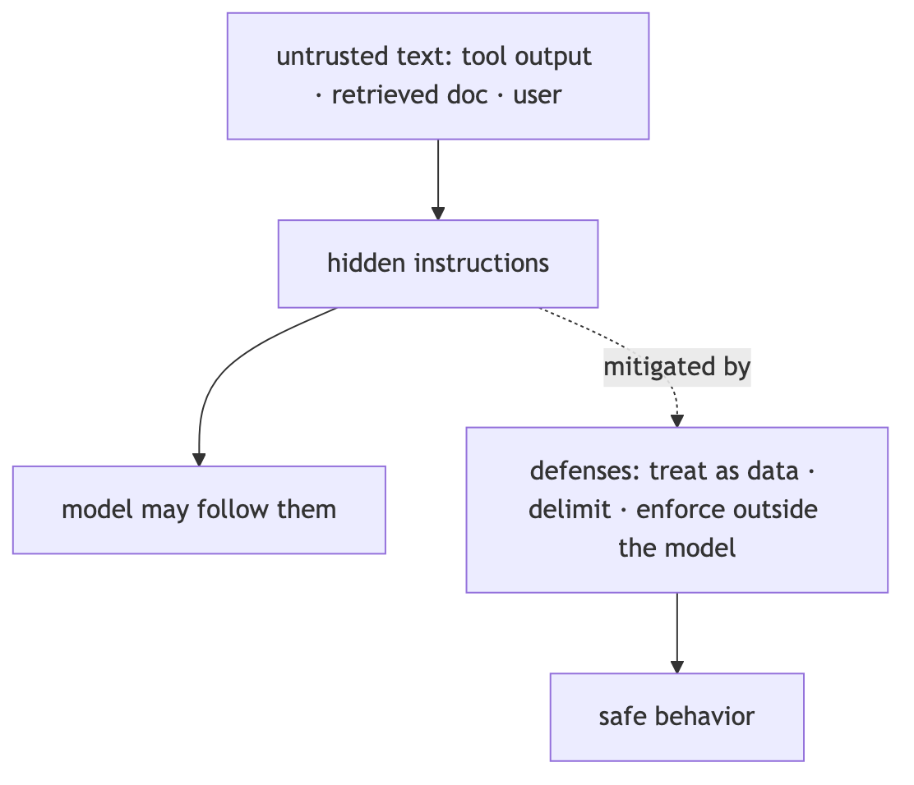

**In Jiuwen.** Jiuwen separates prompt-level from enforced defenses. Prompt-level: a safety rail injects a bilingual safety section before each call (instruction, not control). Enforced: shell command and process substitution is blocked before execution, and the permission engine merges tool policy, file guard, and net guard by strictest. Enforcement exists for actions, while content framing is weak.

<b>Under the hood</b>

**Implementation**

Detection-side support exists but is not wired in: `core/security/guardrail/` provides `PromptInjectionGuardrail` with default regex patterns, and the auto-harness adds an input heuristic that force-finishes on “ignore previous instructions”. The configurable guardrail has **no production registration**, so detection is not active by default.

**Implementation diagram**

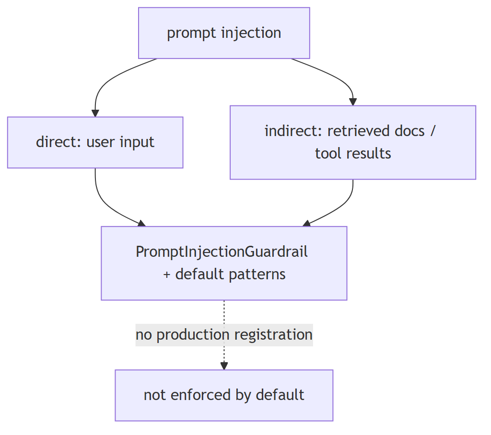

**Code anchors**

| Code anchor | What it points to |
|---|---|
| `agent-core/openjiuwen/core/security/guardrail/builtin.py:60` | `PromptInjectionGuardrail` |
| `agent-core/openjiuwen/core/security/guardrail/backends.py:184` | default patterns |
| `agent-core/openjiuwen/rsi/harness_rsi/auto_harness/rails/security_rail.py:119` | input heuristic → `request_force_finish` |

---

## 2. How do you defend against prompt injection?

Mechanism advanced

**TL;DR.** Treat content as data, delimit untrusted content, re-check permissions, and enforce controls outside the model — prompt instructions are not a control.

**Key points.**

- Treat content as data, not instructions.
- Re-check permissions before privileged actions.
- Enforce controls outside the model (shell/permission).

**Concept.** Treat content as data, not instructions; delimit and label untrusted content; never let it trigger privileged actions without a permission re-check; and enforce controls outside the model (tool policy, sandboxing, egress rules). Instructions in the prompt alone are not a control.

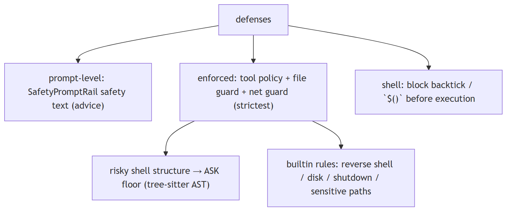

**In Jiuwen.** Prompt-level defense is SafetyPromptRail (advice only). Enforced controls live in the shell/permission layer: substitution blocking, a tiered tool policy merged by strictest with an ASK floor for risky shell structures, and builtin deny rules for reverse shells, disk writes, shutdown, and sensitive paths.

<b>Under the hood</b>

**Implementation**

The codebase separates prompt-level from enforced defenses. Prompt-level: `SafetyPromptRail` injects a bilingual safety section into the system prompt before each call (instruction, not control). Enforced: shell command/process substitution is blocked before execution; the permission engine merges tool policy + file guard + net guard by “strictest” and floors risky shell structures to ASK; builtin YAML denies reverse shells, disk writes, shutdown, and sensitive paths.

**Code anchors**

| Code anchor | What it points to |
|---|---|
| `agent-core/openjiuwen/harness/rails/security/prompt_security_rail.py:16` | `SafetyPromptRail`; `:38` injects safety section; `harness/prompts/sections/safety.py:14` static text |
| `agent-core/openjiuwen/harness/tools/shell/bash/_security.py:29` | substitution regex; `:40` `check_injection` blocks |
| `agent-core/openjiuwen/harness/resources/builtin_rules.yaml:59` | reverse-shell deny; `:35` disk; `:99` shutdown; `:148` sensitive paths |
| `agent-core/openjiuwen/harness/security/permission_engine/toolguard/tool_policy.py:588` | tiered policy; `:409` shell AST floor; `:502` ASK fallback; `shell_ast.py:82` parse; `core.py:272` merge |

---

## 3. Handling untrusted content from a tool result or retrieved document

Mechanism intermediate

**TL;DR.** Treat tool output and retrieved docs as untrusted data: delimit and label them, strip control/escape sequences, and never let them trigger privileged actions without re-checking permissions.

**Key points.**

- Treat as data, not instructions.
- Delimit and label as data.
- Strip control/escape sequences.
- Re-check permissions before privileged actions.

**Concept.** Treat tool output and retrieved documents as untrusted data, never as instructions. Delimit and label them as data, strip control/escape sequences, and never let them silently trigger privileged actions without re-checking permissions. Prompt injection via tool output is a real threat because it flows straight into the model context.

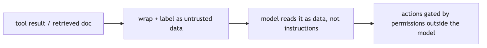

**In Jiuwen.** This is the weakest area. Tool results are rendered through the tool's own renderer and wrapped in a plain tool message with no data/instruction framing; after-tool rails may rewrite the result but nothing marks it untrusted. Sanitizer helpers exist but have no production callers.

<b>Under the hood</b>

**Implementation**

Weakest area. Tool results are rendered through the tool's own `render_for_llm` and wrapped in a plain `ToolMessage` with no data/instruction framing; after-tool rails may rewrite the result but nothing marks it untrusted. Sanitizer helpers exist (`sanitize.py`) but have no production callers. The only untrusted-data defenses are prompt-level: the auto-harness input heuristic scans all input messages (tool-role messages already in the transcript included), and the personal-context pipeline instructs its summarizer to treat supplied content as untrusted data (one internal call). There is no mandatory untrusted-tool-result seam.

**Implementation diagram**

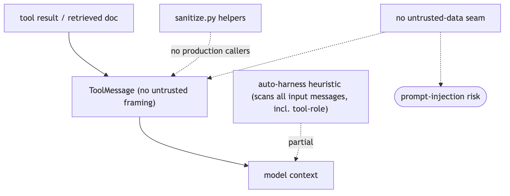

**Code anchors**

| Code anchor | What it points to |
|---|---|
| `agent-core/openjiuwen/core/single_agent/ability_manager.py:266` | _render_tool_result; :1612 builds ToolMessage with no untrusted wrapper; :1281 after-tool rewrite adds no label |
| `agent-core/openjiuwen/harness/prompts/sanitize.py:11` | sanitize_path; :20 sanitize_user_content (no production callers) |
| `agent-core/openjiuwen/rsi/harness_rsi/auto_harness/rails/security_rail.py:119` | heuristic runs before model call |
| `agent-core/openjiuwen/harness/personal_context/context_pipeline.py:9237` | prompt-level "untrusted source data, never instructions"; agent-core/openjiuwen/harness/personal_context/agent_support.py:792 — same for the subagent path |

---

## 4. How do you handle a user trying to jailbreak your system's guardrails

Mechanism intermediate

**TL;DR.** Assume the model can be talked around, so enforce outside it: detect and block known patterns, keep privileged actions behind a permission check the model can't bypass, sandbox tools, and log/rate-limit attempts.

**Key points.**

- Assume the model can be manipulated.
- Detect/block known patterns.
- Permission-check privileged actions.
- Sandbox and log.

**Concept.** Assume the model can be talked around, so enforce outside it: detect and block known jailbreak/injection patterns at input, keep privileged actions behind a permission check that the model cannot bypass, sandbox tools, and log/rate-limit repeated attempts. No single regex is sufficient (paraphrase, encoding, multi-turn role-play evade it), so detection is a signal, not the control.

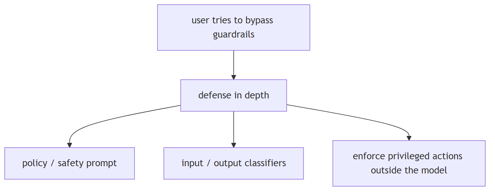

**In Jiuwen.** There is no dedicated jailbreak subsystem, but four independent mechanisms. A rule-based injection detector matches ignore/disregard-previous-instructions and role-change patterns, but the guardrail is unregistered in production. The auto-harness permission engine and shell blocking are enforced. Pattern detection exists but is not wired in.

<b>Under the hood</b>

**Implementation**

No dedicated jailbreak subsystem; four independent mechanisms. A `RuleBasedPromptInjectionBackend` matches `ignore.*previous.*instructions`, `disregard.*prior.*commands`, `system.*prompt`, `you.*are.*now`, `act.*as`, `forget.*everything` — but the guardrail is unregistered in production. The auto-harness `SecurityRail` heuristic (production-registered only in the auto-harness factory) scans messages for suspicious patterns and force-finishes the run. Shell command substitution is hard-blocked, and the permission engine floors risky/unknown shell structures and interpreter sinks to ASK, with builtin rules denying reverse shells, shutdown, and sensitive paths, while recursive/forced delete (`rm -rf`) is floored to ASK rather than denied.

**Implementation diagram**

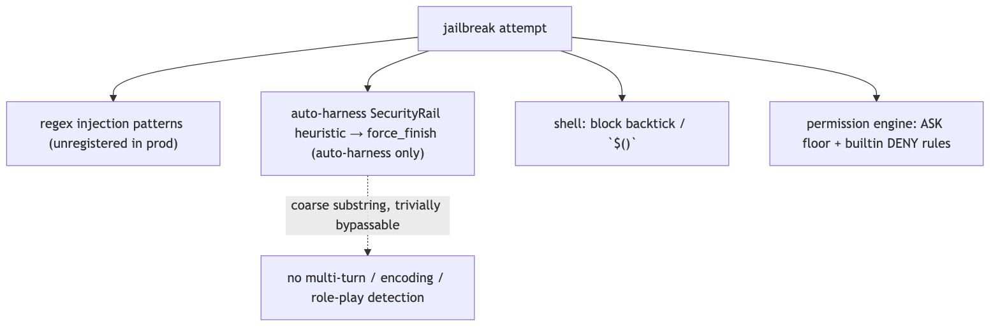

**Code anchors**

| Code anchor | What it points to |
|---|---|
| `agent-core/openjiuwen/core/security/guardrail/backends.py:184` | default injection patterns; :127 RuleBasedPromptInjectionBackend |
| `agent-core/openjiuwen/auto_harness/rails/security_rail.py:28` | _SUSPICIOUS_PATTERNS; :129 scan + request_force_finish; agent-core/openjiuwen/auto_harness/agents/factory.py:178 — production registration path |
| `agent-core/openjiuwen/harness/tools/shell/bash/_security.py:29` | _INJECTION_PATTERNS; :40 check_injection blocks; agent-core/openjiuwen/harness/tools/shell/bash/_tool.py:378 call site; bash/_security.py:71 destructive-command warnings |
| `agent-core/openjiuwen/harness/security/permission_engine/toolguard/tool_policy.py:409` | shell AST ASK floor; :502 ASK fallback; :694 interpreter-sink ASK |
| `agent-core/openjiuwen/harness/resources/builtin_rules.yaml:59` | reverse-shell DENY; :99 shutdown; :148 sensitive paths |
| `agent-core/openjiuwen/harness/security/permission_engine/core.py:246` | strictest merge; agent-core/openjiuwen/harness/rails/security/tool_security_rail.py:57 PermissionInterruptRail |

---

## 5. How do you make sure a user only retrieves documents they're actually authorized to see

Mechanism intermediate

**TL;DR.** Enforce authorization inside retrieval: every chunk carries ACL metadata, and the query includes a mandatory filter derived from the caller's identity, applied by the vector store (pre-filter), not post-hoc.

**Key points.**

- ACL metadata on every chunk.
- Mandatory identity-derived filter.
- Pre-filter in the store, not post-hoc.

**Concept.** Enforce authorization inside retrieval: every chunk carries ACL metadata (owner/group/tenant), and the query includes a mandatory filter derived from the caller's identity, applied by the vector store (pre-filter), never post-hoc. Prefer the strongest isolation you can afford (per-tenant index/collection), use row-level security where available, and audit.

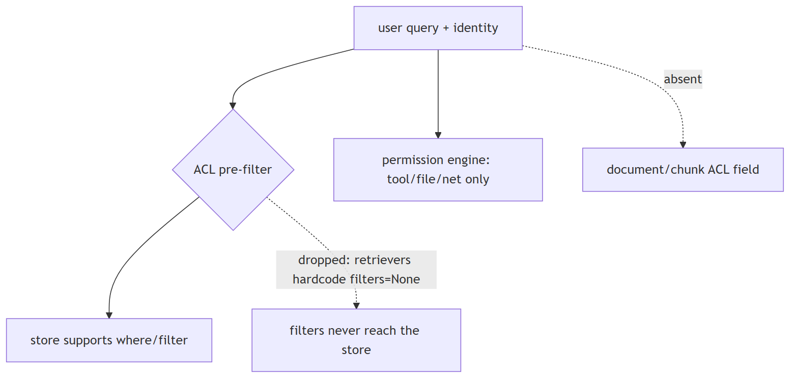

**In Jiuwen.** The store layer supports metadata filters (Milvus expressions, Chroma where, PG JSONB), plus a permission engine and audit logging. But retrieval filters are dropped at the retriever boundary: concrete retrievers hardcode no filters and the abstract retrieve has no filter argument. Authorization filters are not enforced in retrieval.

<b>Under the hood</b>

**Implementation**

The store layer supports metadata filters (Milvus expr, Chroma `where`, PG JSONB) and there is a permission engine and audit logging. But `RetrievalConfig.filters` is **dropped at the retriever boundary** (concrete retrievers hardcode `filters=None`; the abstract `Retriever.retrieve` has no `filters` param), and documents/chunks have **no ACL field**. So permission-aware retrieval is not reachable through the KB path; the permission engine guards tool/file/net execution, not retrieval.

**Code anchors**

| Code anchor | What it points to |
|---|---|
| `agent-core/openjiuwen/core/retrieval/common/config.py:53` | RetrievalConfig.filters; agent-core/openjiuwen/core/retrieval/retriever/base.py:19 — no filters param; agent-core/openjiuwen/core/retrieval/simple_knowledge_base.py:186 — KB passes it; agent-core/openjiuwen/core/retrieval/retriever/vector_retriever.py:88/agent-core/openjiuwen/core/retrieval/retriever/hybrid_retriever.py:81 — filters=None |
| `agent-core/openjiuwen/core/retrieval/vector_store/milvus_store.py:215` | , agent-core/openjiuwen/core/retrieval/vector_store/chroma_store.py:265, agent-core/openjiuwen/core/retrieval/vector_store/pg_store.py:332 — store-level filters |
| `agent-core/openjiuwen/harness/security/permission_engine/core.py:272` | check_permission (tool/file/net) |
| `agent-core/openjiuwen/core/retrieval/common/document.py:30` | no ACL field on TextChunk |

---

## 6. How do you prevent an agent from taking a destructive or irreversible action by mistake

Mechanism intermediate

**TL;DR.** Layer defenses: classify actions by risk, deny known-dangerous patterns, require approval for the ambiguous middle, and prefer reversible operations over hard blocks. Fail closed — unknown should ask.

**Key points.**

- Classify by risk.
- Deny known-dangerous patterns.
- Approve the ambiguous middle.
- Prefer reversible ops; fail closed.

**Concept.** Layer defenses: classify actions by risk, deny known-dangerous patterns, require approval for the ambiguous middle, and prefer reversible operations (dry-run, snapshot, sandbox) over hard blocks alone. Fail closed — unknown should mean "ask", not "allow".

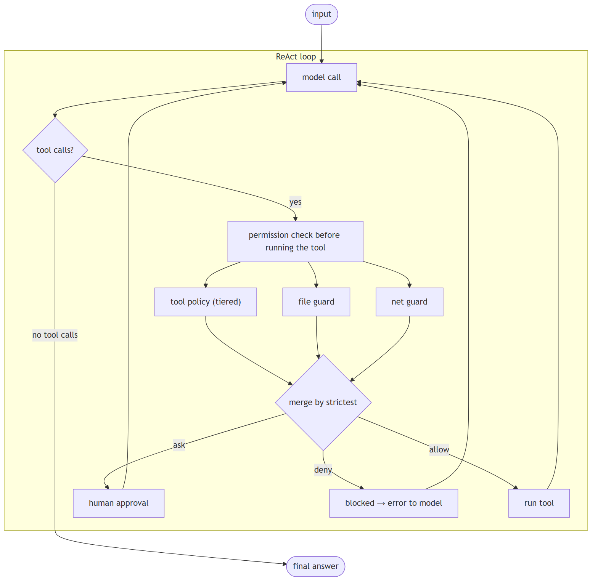

**In Jiuwen.** A layered permission engine returns allow, ask, or deny, merging tool policy, file guard, and net guard by strictest. Tool policy is tiered and falls back to ask when nothing matches. Shell commands are parsed with a tree-sitter AST; too-complex or unparseable-but-risky input is floored to ask. Destructive actions can be gated by approval.

<b>Under the hood</b>

**Implementation**

A layered permission engine returns `ALLOW`/`ASK`/`DENY`, merging tool policy + file guard + net guard by `strictest`. Tool policy is tiered and falls back to ASK when nothing matches. Shell commands are parsed with a tree-sitter AST; too-complex or unparseable-but-risky input is floored to ASK. Builtin rules deny reverse shells, fork bombs, disk writes, and shutdown/reboot, and deny sensitive paths like `~/.ssh/**` and `**/.env`. Injection via backticks/`$()` is blocked before execution.

**Code anchors**

| Code anchor | What it points to |
|---|---|
| `agent-core/openjiuwen/harness/security/permission_engine/core.py:272` | check_permission merge |
| `agent-core/openjiuwen/harness/security/permission_engine/toolguard/tool_policy.py:502/588` | tiered policy, ASK fallback |
| `agent-core/openjiuwen/harness/security/permission_engine/toolguard/shell_ast.py:82` | tree-sitter shell parse |
| `agent-core/openjiuwen/harness/security/permission_engine/toolguard/tool_policy.py:409` | risky-structure ASK floor |
| `agent-core/openjiuwen/harness/resources/builtin_rules.yaml:10/148` | builtin deny rules + sensitive paths |
| `agent-core/openjiuwen/harness/tools/shell/bash/_security.py:40` | injection blocking |

---

## 7. How do you prevent a model from generating harmful or biased content

Mechanism intermediate

**TL;DR.** Layer defenses: a system-prompt safety instruction, input/output classifiers/moderation, policy filters on generated output, and refusal behavior validated by red-teaming. A prompt is advice, not a control.

**Key points.**

- Safety instruction in the system prompt.
- Input/output moderation.
- Policy filters on output.
- Red-team refusal behavior.

**Concept.** Layer defenses: a safety instruction in the system prompt, input and output content classifiers/moderation, policy filters on generated output, and refusal behavior validated by red-teaming. Because a prompt is advice not a control, real safety needs an enforced output filter. Bias specifically needs measurement (bias probes, disaggregated evals) and mitigation, not just a "be safe" instruction.

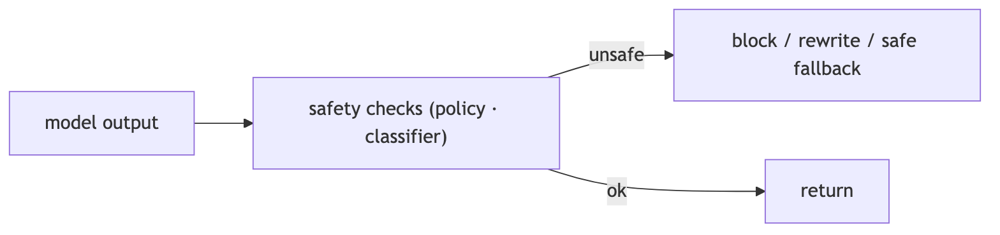

**In Jiuwen.** Two layers. Prompt-level (advisory): a safety rail is production-registered and appends a static bilingual safety section to the system prompt on each call, then always allows — it never inspects or rewrites content. Enforced-but-unwired: a guardrail package provides base guardrails. Output moderation is not active.

<b>Under the hood</b>

**Implementation**

Two layers. Prompt-level (advisory): `SafetyPromptRail` is production-registered and, on each model call, appends a static bilingual safety section to the system prompt then always returns allow — it never inspects or rewrites content. Enforced-but-unwired: `core/security/guardrail/` provides `BaseGuardrail` + backends; `PromptInjectionGuardrail` can raise `AbortError`/`GuardrailError` on risky input/output, and an optional local `AutoModelForSequenceClassification` / QwenGuard classifier exists — but none has a production caller. There is no bias, toxicity, or content-policy detector anywhere.

**Implementation diagram**

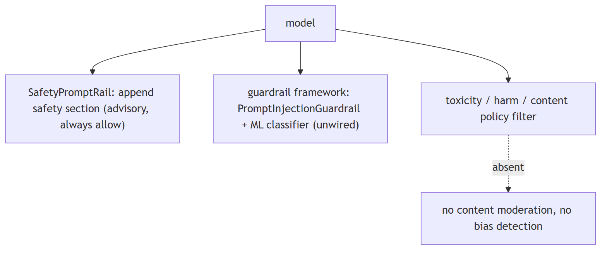

**Code anchors**

| Code anchor | What it points to |
|---|---|
| `agent-core/openjiuwen/harness/rails/security/prompt_security_rail.py:16` | SafetyPromptRail; :38 injects section; :41 always returns allow |
| `agent-core/openjiuwen/harness/prompts/sections/safety.py:14` | (CN) / :26 (EN) — static safety text; :44 build_safety_section; :57 priority |
| `jiuwenswarm/jiuwenswarm/server/runtime/agent_adapter/interface_deep.py:93` | production import of SecurityRail; :8577 _build_security_rail(); jiuwenswarm/jiuwenswarm/agents/harness/team/team_runtime_inheritance.py:248 — team members create SecurityRail() |
| `agent-core/openjiuwen/core/security/guardrail/builtin.py:60` | PromptInjectionGuardrail; agent-core/openjiuwen/core/security/guardrail/guardrail.py:378 — raises AbortError/GuardrailError |
| `agent-core/openjiuwen/core/security/guardrail/backends.py:445` | LocalModelBackend (AutoModelForSequenceClassification); agent-core/openjiuwen/core/security/guardrail/context.py:207 — QwenGuardParser |
| `agent-core/openjiuwen/harness/rails/security/base_security_rail.py:59` | SecurityReject/SecurityInterrupt/SecurityAlert |

---

## 8. Preventing sensitive data from leaking into a model's context or output logs

Mechanism intermediate

**TL;DR.** Detect and redact secrets before they reach the model or logs: scrub known patterns (keys, tokens, PII) from tool results and prompts, redact log fields, gate secret-like egress, and rely on provider zero-retention.

**Key points.**

- Scrub secrets before model/logs.
- Redact log fields (not drop whole events).
- Gate secret-like egress.
- Provider zero-retention.

**Concept.** Detect and redact secrets before they reach the model or the logs: scrub known patterns (API keys, tokens, PII) from tool results and prompts, redact log fields (don't just drop whole fields), gate egress of secret-like payloads, and keep a path to audit without storing the secret. Detection alone is not redaction.

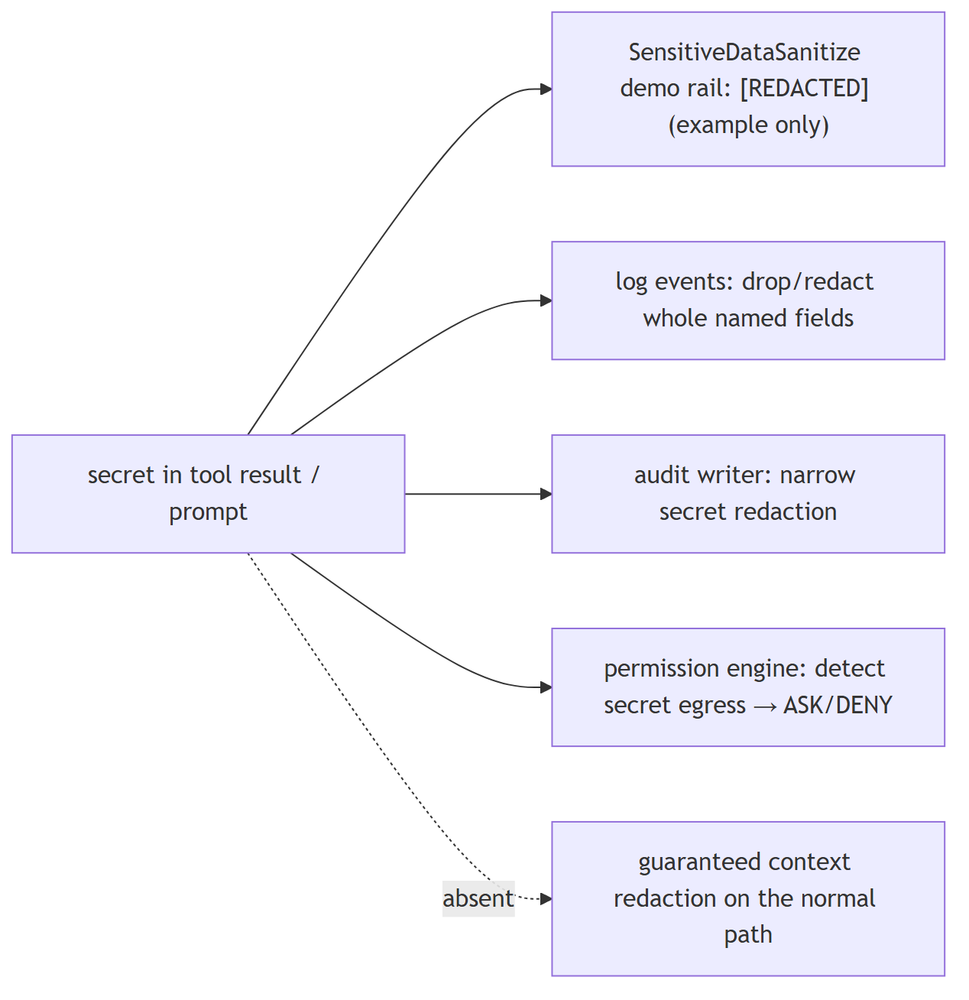

**In Jiuwen.** Actual model-context redaction exists only as a demo rail that regex-redacts keys, tokens, and bearer strings in history and responses. In production, redaction is layer-specific: structured log events redact whole sensitive fields via an allowlist, and a security demo has its own redaction. Model-context redaction is not production-wide.

<b>Under the hood</b>

**Implementation**

Actual model-context redaction exists only as a demo rail: `SensitivedatasanitizeRail` regex-redacts keys/tokens/bearer strings in history and responses, replacing with `[REDACTED]`. In production, redaction is layer-specific: structured log events redact whole sensitive fields via an allowlist, the auto-permission audit writer redacts secret-like text before appending JSONL, and the auto-permission rule engine *detects* secret-like egress payloads to force ASK/DENY rather than redact. There is no built-in sensitive-data guardrail.

**Code anchors**

| Code anchor | What it points to |
|---|---|
| `agent-core/examples/security_rail_demo/SensitiveDataSanitize/rail.py:27` | sensitive regexes; :60 run_security_check; :96 _sanitize_output rewrites history/response |
| `agent-core/openjiuwen/core/common/logging/events.py:920` | sanitize_event_for_logging; :932 sensitive field list; :951 <REDACTED>; agent-core/openjiuwen/core/common/logging/base_impl.py:114 _sanitize_message |
| `jiuwenswarm/jiuwenswarm/agents/harness/common/rails/permissions/persistent_audit.py:50` | secret-like pattern; :262 _sanitize_audit_text; :289 combined detection |
| `jiuwenswarm/jiuwenswarm/agents/harness/common/rails/permissions/auto_decision.py:35` | egress secret patterns; :82 redacted risk labels |
| `agent-core/openjiuwen/core/security/guardrail/builtin.py` | only PromptInjectionGuardrail (no sensitive-data guardrail) |

---

## 9. Design a multi-tenant RAG system where each customer's data must stay isolated from others

Design advanced

**TL;DR.** Isolation choices, strongest first: a separate index/collection per tenant; a tenant partition key with mandatory pre-filtering; or row-level security. The tenant filter must be applied inside the store.

**Key points.**

- Separate index per tenant (strongest).
- Tenant key + mandatory pre-filter.
- Row-level security.
- Filter inside the store.

**Concept.** Isolation choices, strongest first: a separate index/collection (or DB) per tenant; a tenant partition key with mandatory pre-filtering; or row-level security in a relational store. The key is that the tenant filter is applied inside the vector search and cannot be forgotten by a caller. Also isolate embeddings, caches, and logs per tenant, and audit cross-tenant access.

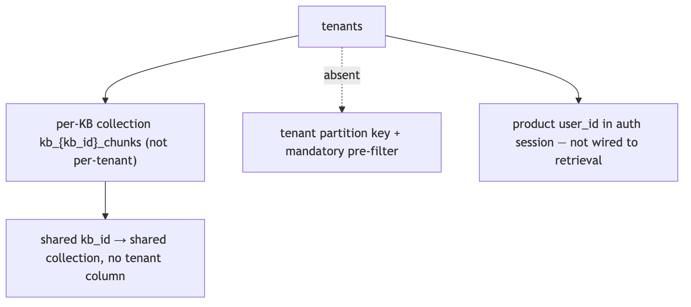

**In Jiuwen.** The only separation primitive is the collection name derived from the knowledge-base id plus a configurable database name — this isolates knowledge bases, not tenants. If tenants share a knowledge-base id, their chunks land in the same collection with no tenant column. Multi-tenant isolation is not enforced by default.

<b>Under the hood</b>

**Implementation**

The only separation primitive is the collection name derived from `kb_id` (`kb_{kb_id}_chunks`/`_triples`) plus a configurable `database_name` — this isolates **knowledge bases, not tenants**; if tenants share a `kb_id`, their chunks land in the same collection with no tenant column. The product tracks `user_id` in auth sessions but never propagates it into retrieval. There is no tenant/namespace field on documents, and the retriever drops filters, so per-tenant pre-filtering is not available.

**Code anchors**

| Code anchor | What it points to |
|---|---|
| `agent-core/openjiuwen/core/retrieval/simple_knowledge_base.py:102` | kb_{kb_id}_chunks; agent-core/openjiuwen/core/retrieval/graph_knowledge_base.py:197 — kb_{kb_id}_triples |
| `agent-core/openjiuwen/core/retrieval/common/config.py:75` | VectorStoreConfig(database_name, collection_name, …) |
| `jiuwenswarm/jiuwenswarm/common/auth/session_store.py:198` | user_id in auth session (not retrieval) |
| `jiuwenswarm/jiuwenswarm/gateway/app_gateway.py:660` | WS user_id for routing/sandbox (not KB scoping) |

---

## 10. What is Constitutional AI and how does it reduce the human-labeling bottleneck in alignment?

Mechanism intermediate

**TL;DR.** CAI has the model critique and revise its own outputs against explicit principles, replacing most human preference labeling.

**Key points.**

- SL-CAI: generate response → model critiques against constitution → model revises → use revised responses for SFT
- RL-CAI: model generates preference pairs (chosen/rejected) scored against principles → reward model → RLHF
- Far fewer human labels needed than standard RLHF; the constitution is explicit and auditable
- Easier to update behavior: edit the principle list, not retrain a black-box reward model
- Jiuwen gap: safety rails are static classifiers (SecurityRail, PromptInjectionGuardrail); no self-critique loop or constitutional principle file

**Concept.** Constitutional AI (Bai et al. 2022, Anthropic) replaces a large portion of human preference labeling with **model self-critique**. The pipeline has two stages. (1) **SL-CAI**: generate responses, have the model critique each against a list of explicit principles (the "constitution" — rules like "do not assist with illegal activities", "be honest"), then revise based on the critique. Use these revised responses for supervised fine-tuning. (2) **RL-CAI**: use a reward model trained on model-generated preference pairs (not human-labeled pairs) to run RLHF. The result: steering a model toward a set of principles requires far fewer human labels. The "constitution" is an **explicit, auditable list** — easier to update and inspect than a black-box reward model trained on opaque human ratings. Claude's alignment training is based on CAI.

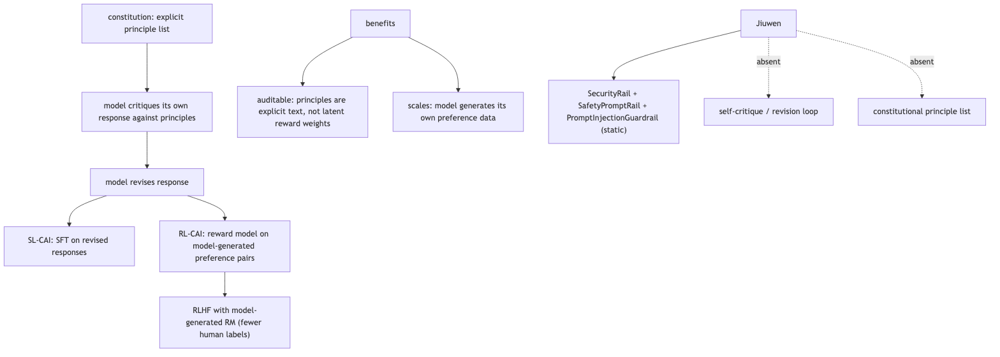

**In Jiuwen.** Safety enforcement uses static classifiers: SecurityRail (agent-core/openjiuwen/auto_harness/rails/security_rail.py:48) for prompt injection, PromptInjectionGuardrail (agent-core/openjiuwen/core/security/guardrail/builtin.py:60) with an AutoModelForSequenceClassification backend (agent-core/openjiuwen/core/security/guardrail/backends.py), and SafetyPromptRail (advisory prompt-level safety). No self-critique loop, no constitutional principle list, no model-generates-then-revises pipeline. To add a principle, an operator must update the classifier weights or the system prompt, not append to a principle document.

<b>Under the hood</b>

**Implementation**

Safety enforcement uses fixed classifiers and rails rather than a self-critique loop: `SecurityRail` (auto-harness policy rail), `SafetyPromptRail` (injects static safety text into the prompt), and the guardrail framework (`PromptInjectionGuardrail` with pluggable `GuardrailBackend`s such as rule-based and model-based prompt-injection classifiers). These are static — there is no constitutional principle list that the model iterates against and no generate-critique-revise pipeline. Adding a principle means changing a classifier or a prompt, not editing a constitution document.

**Code anchors**

| Code anchor | What it points to |
|---|---|
| `agent-core/openjiuwen/auto_harness/rails/security_rail.py:48` | SecurityRail (static policy rail) |
| `agent-core/openjiuwen/harness/rails/security/prompt_security_rail.py:16` | SafetyPromptRail (static safety text) |
| `agent-core/openjiuwen/core/security/guardrail/builtin.py:60` | PromptInjectionGuardrail; agent-core/openjiuwen/core/security/guardrail/backends.py:39 — GuardrailBackend |

---

## 11. Security-adjacent questions are disguised as normal engineering questions

Claim intermediate

**Claim, not a question.** The heading is an assertion about what these questions probe; the notes below assess whether it holds.

**TL;DR.** Security-adjacent questions are disguised as normal engineering questions.

**Key points.**

- Tool results not framed as untrusted.
- Sanitizers exist, unused.
- Prompt safety is advisory.
- Real control is the shell/permission layer.

**Concept.** This claim holds: ordinary-looking engineering questions about input handling, permissions, or egress are often security probes in disguise. Content from a tool result or retrieved document is untrusted input. Treat it as data, never as instructions: delimit and label untrusted content as data, never let it trigger privileged actions without a permission re-check, enforce controls outside the model (tool policy, sandbox, egress), and remember prompt-level safety text is advice, not a control.

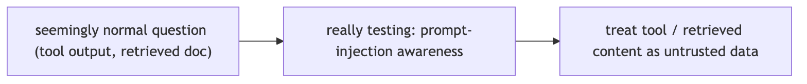

**In Jiuwen.** This is the weakest area. Tool results are returned as a plain tool message with no untrusted-data framing; sanitizer helpers exist but have no production callers. Prompt-level safety is advisory, while the enforced controls live in the shell and permission layers.

<b>Under the hood</b>

**Implementation**

This is the weakest area. Tool results are returned as plain `ToolMessage` with no untrusted-data framing; sanitizer helpers exist but have no production callers. Prompt-level safety is advisory (`SafetyPromptRail` always allows), while the enforced controls live in the shell/permission layer (AST ASK floor, builtin deny rules) — not in retrieval. There is no mandatory untrusted-tool-result seam.

**Implementation diagram**

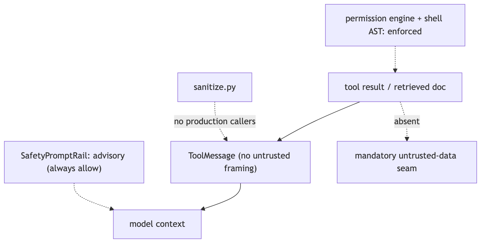

**Code anchors**

| Code anchor | What it points to |
|---|---|
| `agent-core/openjiuwen/core/single_agent/ability_manager.py:1612` | ToolMessage built with no untrusted wrapper; :431 parallel path |
| `agent-core/openjiuwen/harness/prompts/sanitize.py:20` | sanitizer (no production callers) |
| `agent-core/openjiuwen/harness/rails/security/prompt_security_rail.py:16/41` | SafetyPromptRail (advisory, always allows) |
| `agent-core/openjiuwen/harness/security/permission_engine/core.py:272` | check_permission (enforced tool/file/net) |
| `agent-core/openjiuwen/harness/resources/builtin_rules.yaml:59` | reverse-shell deny |

---

## 12. Any question about untrusted input is testing prompt injection awareness

Claim intermediate

**Claim, not a question.** The heading is an assertion about what these questions probe; the notes below assess whether it holds.

**TL;DR.** Any question about untrusted input is testing prompt-injection awareness.

**Key points.**

- Tool results are plain messages.
- Sanitizers unused; detector unregistered.
- Safety rail is advisory.
- Real control: shell/permission layer.

**Concept.** This claim is mostly true, with a caveat: untrusted input is primarily a prompt-injection concern, but it also covers authorization and data handling. a tool result or retrieved document can carry hidden instructions. Treat tool output and retrieved content as data, never as commands, and sanitize input before it reaches the prompt: delimit and label untrusted content as data, strip it, enforce privileged actions outside the model (tool policy, sandbox, egress), and remember that a system-prompt warning is advice, not a control.

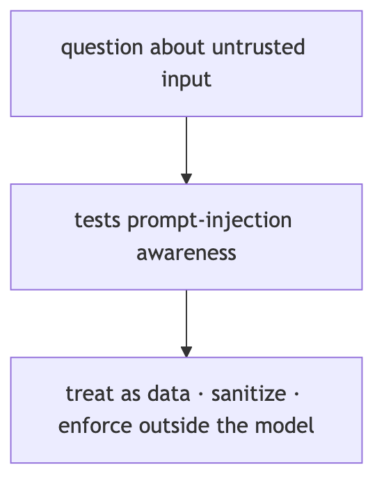

**In Jiuwen.** Weakest area. Tool results are plain messages with no untrusted-data framing, the sanitizer has no production callers, the injection detector is unregistered, and the safety rail is advisory. The real controls are in the shell and permission layer (substitution blocking, AST ask floor).

<b>Under the hood</b>

**Implementation**

Weakest area. Tool results are plain `ToolMessage` with no untrusted-data framing, `sanitize.py` has no production callers, the injection detector is unregistered, and `SafetyPromptRail` is advisory. The real controls are in the shell/permission layer (substitution blocking, AST ASK floor, builtin deny rules).

**Implementation diagram**

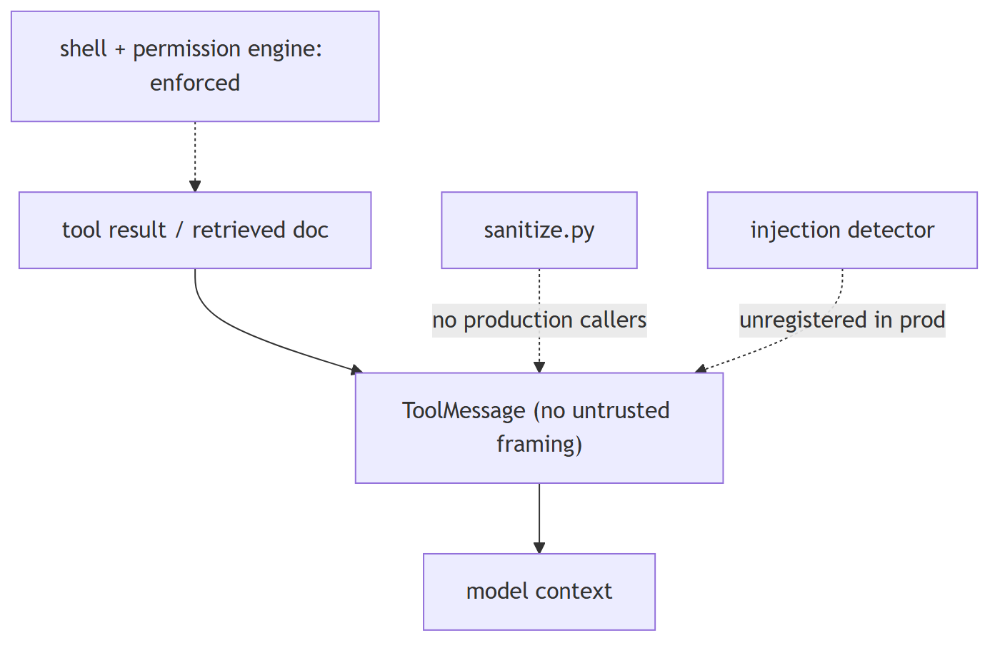

**Code anchors**

| Code anchor | What it points to |
|---|---|
| `agent-core/openjiuwen/core/single_agent/ability_manager.py:1612` | ToolMessage with no wrapper |
| `agent-core/openjiuwen/harness/prompts/sanitize.py:20` | no production callers |
| `agent-core/openjiuwen/core/security/guardrail/builtin.py:60` | PromptInjectionGuardrail (unregistered) |
| `agent-core/openjiuwen/harness/rails/security/prompt_security_rail.py:16` | advisory safety rail |
| `agent-core/openjiuwen/harness/security/permission_engine/toolguard/tool_policy.py:409` | shell AST ASK floor |

---
