

<a class="topic-nav__link topic-nav__prev" href="05-agent-fundamentals-and-the-loop.html">← PreviousAgent fundamentals and the loop</a>
<a class="topic-nav__link topic-nav__next" href="08-agent-frameworks.html">Next →Agent frameworks</a>

# Agent harness and lifecycle hooks

## 1. What is an agent harness and what does it add over a raw agent loop?

Mechanism basic

**TL;DR.** A harness wraps a raw agent loop with every production concern the reasoning loop cannot own: outer task loop, safety and injection filtering, permission and sensitive-data enforcement, resilience, memory, observability, and config-driven capability composition.

**Key points.**

- Raw loop: one ReAct episode — model → tools → repeat → final answer.
- Outer task loop: drives the inner agent across multiple episodes toward a long-horizon goal.
- Safety layer: injects guardrails before every model call; checks permissions and detects injection before every tool call.
- Resilience layer: detects LLM stream stalls, loop-detects repeated tool calls, retries transient failures.
- Memory layer: registers memory tools and injects a memory-usage prompt section.
- Observability layer: structured spans for every model call and tool call; cost metering and budget enforcement.
- Inner loop owns reasoning; harness owns everything else. Inner default 5 iterations per episode; the outer loop is capped at 50 rounds.

**Concept.** A raw agent loop (ReAct) handles one reasoning episode: call model → execute tool calls → feed results back → return final answer. A harness wraps this with every production concern that cannot live inside the reasoning loop:

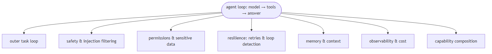

**In Jiuwen.** In Jiuwen, `DeepAgent` wraps a `ReActAgent` and owns every production concern around the reasoning loop, each as a separate `DeepAgentRail`: `SafetyPromptRail` injects bilingual safety guardrails before every model call; `PermissionInterruptRail` checks tool calls against a permission engine and pauses for human confirmation on sensitive or destructive operations; `ToolCallResilienceRail` retries transport/timeout failures with a per-invoke budget of 3 attempts and skips non-idempotent tools; `ModelAnomalyDetectionRail` detects repeated tool-call loops and stream stalls and uses the (0.5, 1.0, 2.0) backoff; `MemoryRail` registers memory tools and hooks `before_invoke`/`before_model_call`; `AgentObservabilityRail` (a `core.observability` element at priority 10) emits a typed span for every event. The inner `ReActAgent` defaults to 5 iterations; `DeepAgentConfig.max_iterations = 15` is the per-invoke inner limit when the task loop is off, and the outer loop is capped at `max_outer_rounds = 50`.

<b>Under the hood</b>

**Implementation**

`DeepAgent` wraps `ReActAgent`. Each production concern is a separate `DeepAgentRail` class registered in the pipeline. Core rails: `SafetyPromptRail` — injects bilingual safety guidelines before every model call. `PermissionInterruptRail` — checks tool calls against a `PermissionEngine`; triggers a HITL interrupt for ASK/ASK_USER decisions; parses shell commands for dangerous patterns. `ToolCallResilienceRail` — retries transport/timeout failures with a per-invoke budget of 3 attempts (`DEFAULT_MAX_ATTEMPTS = 3`) and skips retry for non-idempotent operations (write/shell/subagent-spawn). `ModelAnomalyDetectionRail` — detects consecutive identical tool-call rounds and stream-stall patterns; its backoff schedule is `_DEFAULT_BACKOFF_SECONDS = (0.5, 1.0, 2.0)`. `MemoryRail` — registers memory tools and injects a memory-usage prompt section; it hooks `before_invoke` and `before_model_call`. `AgentObservabilityRail` — a `core.observability` element at priority 10 that emits a typed span for every lifecycle event. The inner ReAct loop defaults to `max_iterations = 5` (`react_agent.py:288`); the harness `DeepAgentConfig.max_iterations = 15` is the per-invoke inner limit when the task loop is off, and the outer loop is capped at `max_outer_rounds = 50`.

**Implementation diagram**

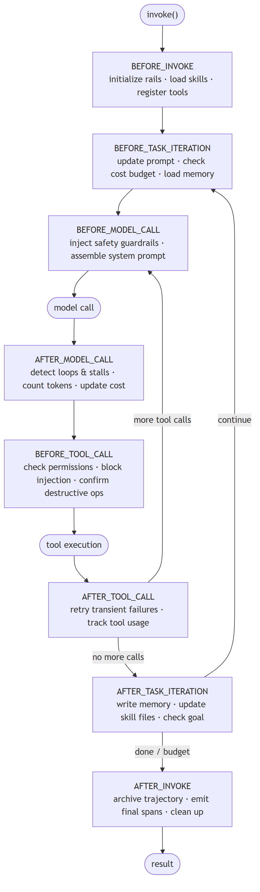

**Code anchors**

| Code anchor | What it points to |
|---|---|
| `agent-core/openjiuwen/harness/deep_agent.py:2692` | _run_task_loop: outer task loop in DeepAgent; :2723 max_outer_rounds = 50 |
| `agent-core/openjiuwen/core/single_agent/agents/react_agent.py:288` | max_iterations: int = Field(default=5) |
| `agent-core/openjiuwen/harness/schema/config.py:252` | DeepAgentConfig.max_iterations = 15 (per-invoke inner limit) |
| `agent-core/openjiuwen/harness/schema/deep_agent_spec.py:433` | DeepAgentSpec; :248 RailSpec |
| `agent-core/openjiuwen/harness/rails/security/prompt_security_rail.py:16` | SafetyPromptRail: bilingual safety injection |
| `agent-core/openjiuwen/harness/rails/security/tool_security_rail.py:57` | PermissionInterruptRail: permission engine + HITL |
| `agent-core/openjiuwen/harness/rails/tool_call_resilience_rail.py:24` | ToolCallResilienceRail; budget :92 |
| `agent-core/openjiuwen/harness/rails/model_anomaly_detection_rail.py:110` | ModelAnomalyDetectionRail; backoff :35 |
| `agent-core/openjiuwen/harness/rails/memory/memory_rail.py:25` | MemoryRail |
| `agent-core/openjiuwen/harness/observability/rail.py:355` | AgentObservabilityRail (priority 10) |

---

## 2. What are lifecycle hooks in an agent harness, and at which points can they fire?

Mechanism basic

**TL;DR.** Lifecycle hooks are callbacks registered at specific execution points; a complete hook set covers the invocation boundary, the task loop boundary, and the inner model/tool call boundary — each at a different granularity.

**Key points.**

- 10 event points total: BEFORE/AFTER_INVOKE, BEFORE/AFTER_TASK_ITERATION, BEFORE/AFTER_MODEL_CALL, BEFORE/AFTER_TOOL_CALL, ON_MODEL_EXCEPTION, ON_TOOL_EXCEPTION.
- Hooks at invocation level fire once per outer task; hooks at model-call level fire multiple times per outer pass.
- Hooks are priority-ordered — higher priority fires first within each event.
- Hooks can read state, inject context, block an action, or emit observability events without the agent knowing.

**Concept.** Lifecycle hooks are callbacks registered by lifecycle hooks at specific points in the agent's execution. They can read state, inject content into the context, block or modify an action, or emit observability events — without the agent code knowing. A well-designed hook set covers: the full invocation boundary (before/after the entire task), the task loop iteration boundary (before/after each outer pass), and the inner reasoning steps (before/after each model call and each tool call, plus exception paths). Hooks that fire only at the invocation level cannot intercept a specific tool call; hooks that fire at the model-call level fire many times per outer pass.

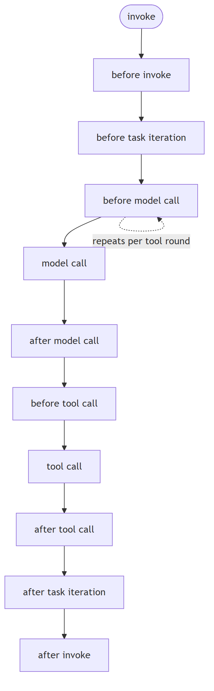

**In Jiuwen.** In Jiuwen, `DeepAgentRail` declares the hook points: six bridge into the inner `ReActAgent` callback manager (before/after model call, before/after tool call, on model exception, on tool exception) and four stay on the outer `DeepAgent` (before/after invoke, before/after task iteration). Rails declare a priority, and the callback manager fires higher priority first. A rail registered on the wrong event point still fires — just at the wrong granularity.

<b>Under the hood</b>

**Implementation**

`DeepAgentRail` base class (`harness/rails/base.py`) declares the hook points — inner events bridged to `ReActAgent` (before/after model call, before/after tool call, on model exception, on tool exception) and outer events on `DeepAgent` (before/after invoke, before/after task iteration). Rails are priority-ordered and **higher priority fires first** (`AgentCallbackManager.register_callback` documents “higher = runs first”). `get_callbacks()` returns the hooks a rail registers, and the callback manager invokes them in priority order per event.

**Implementation diagram**

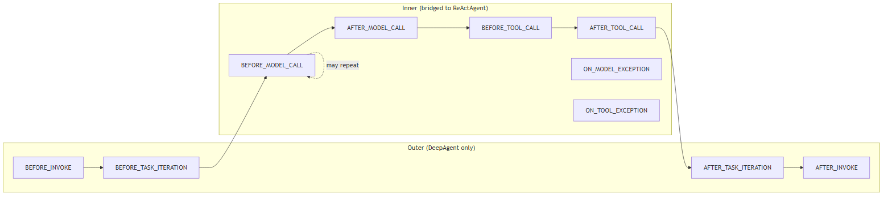

**Code anchors**

| Code anchor | What it points to |
|---|---|
| `agent-core/openjiuwen/harness/rails/base.py:28` | DeepAgentRail: hook declarations |
| `agent-core/openjiuwen/core/single_agent/rail/base.py:824` | AgentRail base; :465 AgentCallbackEvent |
| `agent-core/openjiuwen/core/single_agent/agent_callback_manager.py:11` | AgentCallbackManager; :29 priority (“higher runs first”) |
| `agent-core/openjiuwen/harness/deep_agent.py:158` | _BRIDGE_EVENTS; :180 _OUTER_ONLY_EVENTS; :188 _DEEP_EVENTS |

---

## 3. What concerns belong in a lifecycle hook versus in the agent prompt versus in a tool?

Compare intermediate

**TL;DR.** Prompts advise reasoning but cannot enforce it; tools execute a domain action but carry no policy; lifecycle hooks intercept at runtime and are the only layer that can block execution — use them for safety filtering, prompt injection detection, permission gating, sensitive-data enforcement, cost metering, and observability.

**Key points.**

- Prompt: advises reasoning — 'do not return passwords' can be ignored by the model.
- Tool: executes on demand with a defined I/O contract — carries no policy itself.
- Hook: the only layer that can block: BEFORE_TOOL_CALL hooks can veto a harmful action before it executes; AFTER_MODEL_CALL hooks can detect a response that contains a secret before it reaches the user.
- Safety / injection: a hook inspects the full context and vetoes; a prompt cannot intercept user input at call time.
- Permission gating: a hook checks the tool's permission tier before execution, regardless of which task requested it.
- Cost and observability: must intercept after every model call — impractical to encode in every prompt or tool.

**Concept.** Three distinct layers, each with its own job. **Prompt:** reasoning guidance — what the task is, how to think about it, what format to return. Prompts advise but cannot enforce. A prompt that says "do not return passwords" can be ignored by the model. **Tool:** domain capability with a defined I/O contract — fetch a URL, run a query, call an API. Tools execute when the model calls them and carry no policy. **Lifecycle hook:** cross-cutting policy that fires unconditionally, regardless of task or tool selection. Use a hook when the concern must *intercept or block* execution, not merely advise it:

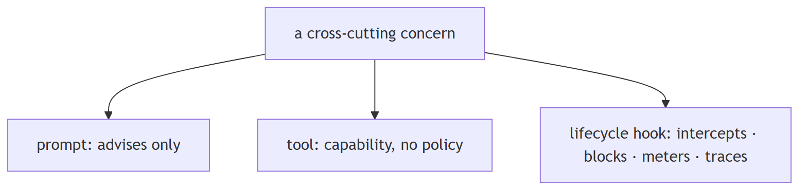

**In Jiuwen.** In Jiuwen the three layers are explicit. `SystemPromptBuilder` assembles system-prompt sections contributed by active rails — `SafetyPromptRail` (a bilingual safety section), `TaskPlanningRail` (planning instructions), `SkillUseRail` (available skills). Tools are `ToolCard` objects with a schema and a permission tier; they execute only when the model calls them and carry no policy. Rails enforce policy: `PermissionInterruptRail` runs `PermissionEngine.check_permission()` and approves, blocks, or raises a confirmation interrupt; `ModelAnomalyDetectionRail` detects loops/stalls after the model call; `TokenTrackingRail` meters usage; `AgentObservabilityRail` emits typed spans. Removing a rail removes its policy for all agents.

<b>Under the hood</b>

**Implementation**

Prompt layer: `SystemPromptBuilder` assembles sections contributed by active rails — `SafetyPromptRail` adds a bilingual safety section, `TaskPlanningRail` adds planning instructions, `SkillUseRail` adds available-skills guidance. Tool layer: `ToolCard` defines schema, callable, and permission tier. Hook layer: `SafetyPromptRail` fires on BEFORE_MODEL_CALL (advises, cannot block); `PermissionInterruptRail` fires on BEFORE_TOOL_CALL — it reads the permission tier from `ToolCard`, runs `PermissionEngine.check_permission()`, and approves, blocks, or raises a human-confirmation interrupt (the only layer that can prevent a destructive shell command from running); `ModelAnomalyDetectionRail` fires on AFTER_MODEL_CALL to detect repeated tool-call sequences and stream stalls; `TokenTrackingRail` meters usage at AFTER_MODEL_CALL; `AgentObservabilityRail` (priority 10) emits typed spans at each event.

**Implementation diagram**

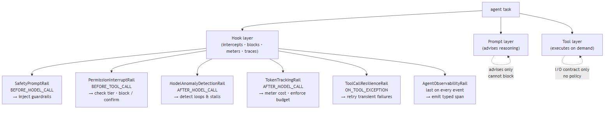

**Code anchors**

| Code anchor | What it points to |
|---|---|
| `agent-core/openjiuwen/harness/prompts/builder.py:28` | SystemPromptBuilder; rail prompt-section injection |
| `agent-core/openjiuwen/core/foundation/tool/base.py:78` | ToolCard schema and permission tier |
| `agent-core/openjiuwen/harness/rails/security/prompt_security_rail.py:16` | SafetyPromptRail (BEFORE_MODEL_CALL, advisory) |
| `agent-core/openjiuwen/harness/rails/security/tool_security_rail.py:57` | PermissionInterruptRail; PermissionEngine.check_permission() at agent-core/openjiuwen/harness/security/permission_engine/core.py:272 |
| `agent-core/openjiuwen/harness/rails/model_anomaly_detection_rail.py:110` | ModelAnomalyDetectionRail (AFTER_MODEL_CALL) |
| `agent-core/openjiuwen/harness/cli/rails/token_tracker.py:15` | TokenTrackingRail: usage metering |

---

## 4. How are lifecycle hooks registered and assembled for a specific agent type?

Mechanism intermediate

**TL;DR.** Registration (declare a class in a manifest catalog) and assembly (resolve a spec to instances) are separate steps — capability authoring is decoupled from capability composition per agent type.

**Key points.**

- Registration: each lifecycle-hook class is declared with a name in the manifest at import time.
- Spec: a declarative ordered list of named lifecycle-hook types plus per-instance parameters.
- Assembly: spec entries are looked up in the registry, instantiated with their params, appended in order.
- Different agent types use different specs built from the same registry.

**Concept.** Registration and assembly are separate steps. Registration happens at import time: each lifecycle-hook class is declared with a name in a manifest catalog. At agent construction, a spec — a declarative list of named lifecycle-hook types plus per-instance parameters — is resolved against the registry: each entry is looked up, instantiated with its params, and appended to the pipeline in declaration order. Different agent types use different specs built from the same registry. This separates capability authoring (write the class, register it once) from capability composition (declare which classes to activate, per agent type).

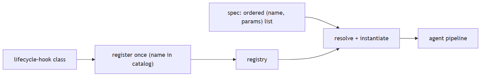

**In Jiuwen.** In Jiuwen, every built-in rail is declared once in `builtin_elements.py` with `harness_element(kind=ElementKind.RAIL, name=…, builder=…)`. At startup `registration.py` syncs this catalog into a provider registry. An agent type uses `DeepAgentSpec`, whose `rails` list holds `RailSpec` items (type + params); `DeepAgentSpec.build()` resolves each type against the registry, instantiates it with its params, and appends it. The `create_deep_agent` factory itself takes already-built rail instances. A base spec activates task-planning, security, sys-operation, and (optionally) observability; the product code agent adds `swarm.code_task_planning` and `swarm.team_plan_approval`.

<b>Under the hood</b>

**Implementation**

`builtin_elements.py` declares every built-in rail with `harness_element(kind=ElementKind.RAIL, name=..., description=..., builder=SecurityRail)`. `registration.py` syncs the catalog to a provider registry at startup. `DeepAgentSpec.rails` is a list of `RailSpec`; `DeepAgentSpec.build()` looks each `RailSpec.type` up in the registry, instantiates it with `RailSpec.params`, and appends it — the `create_deep_agent` factory itself takes already-built `AgentRail` instances. A base agent spec has `[core.task_planning, core.security, core.sys_operation, …]`; the product code agent adds `[swarm.code_task_planning, swarm.team_plan_approval, …]`.

**Implementation diagram**

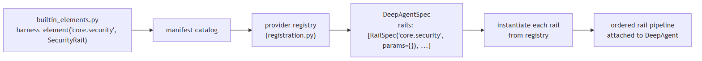

**Code anchors**

| Code anchor | What it points to |
|---|---|
| `agent-core/openjiuwen/harness/manifest/builtin_elements.py:450` | harness_element(kind=…, name=…, builder=SecurityRail) |
| `agent-core/openjiuwen/harness/manifest/registration.py:31` | catalog → provider registry sync (register_from_catalog) |
| `agent-core/openjiuwen/harness/schema/deep_agent_spec.py:248` | RailSpec; :433 DeepAgentSpec; :581 build() |
| `agent-core/openjiuwen/harness/factory.py:460` | create_deep_agent: takes rail instances |

---

## 5. How does the harness task loop differ from a single agent invocation?

Mechanism intermediate

**TL;DR.** A single agent invocation runs one ReAct episode; the harness task loop calls it repeatedly, evaluating completion after each pass and giving hooks time to update working memory and check budgets between passes.

**Key points.**

- Single invocation: one ReAct episode, inner iteration limit.
- Task loop: BEFORE_TASK_ITERATION → inner agent → AFTER_TASK_ITERATION, repeated until done or budget exhausted.
- Between passes: hooks update memory, check cost quota, inject new context.
- Outer budget is separate from the inner max_iterations.

**Concept.** A single agent invocation runs one ReAct episode — the model and tools interact until the agent returns a final answer, hits its iteration limit, or encounters an error. The harness task loop calls this invocation repeatedly, evaluating whether the overall goal is complete after each pass. Between passes, task-iteration hooks fire, giving hooks time to update working memory, flush completed sub-tasks, check whether the budget allows another pass, and inject new context or instructions. This enables long-horizon tasks that require more reasoning steps than a single episode's iteration limit allows, without losing state between episodes.

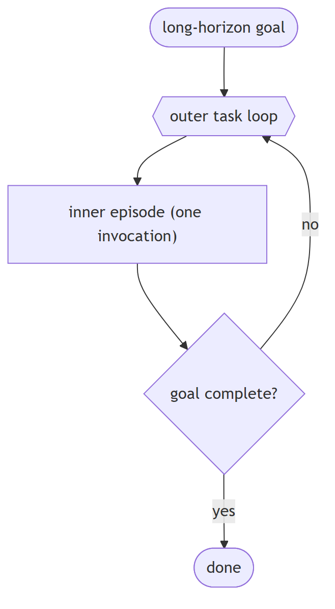

**In Jiuwen.** In Jiuwen, the outer task loop is `DeepAgent._run_task_loop()`. Before each pass, rails update prompt sections, check token/cost quotas, and load memories; the inner `ReActAgent` runs its episode (with `max_iterations` raised to `sys.maxsize` while the task loop is on); after each pass, rails write memory and `TaskCompletionRail` decides whether the goal is satisfied. The outer loop is capped at `max_outer_rounds = 50`, independent of the inner per-episode limit.

<b>Under the hood</b>

**Implementation**

`DeepAgent._run_task_loop()` is the outer loop. Each iteration: BEFORE_TASK_ITERATION fires (rails update prompt sections, check token/cost quotas, load memories); the inner `ReActAgent` runs (with `max_iterations` raised to `sys.maxsize` when `enable_task_loop`); AFTER_TASK_ITERATION fires (rails write memory; `TaskCompletionRail` decides whether the goal is satisfied). The outer loop is capped at `max_outer_rounds = 50`.

**Implementation diagram**

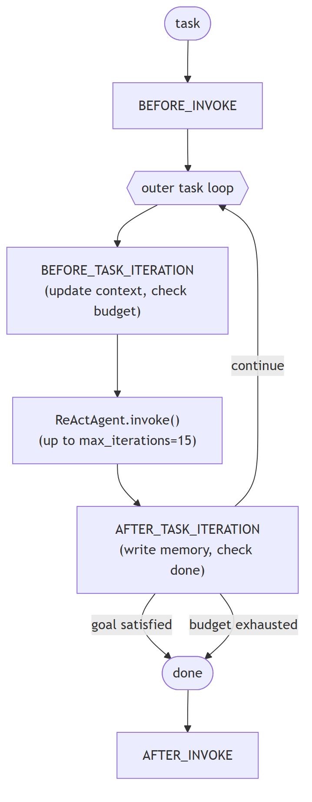

**Code anchors**

| Code anchor | What it points to |
|---|---|
| `agent-core/openjiuwen/harness/deep_agent.py:2692` | _run_task_loop: outer task loop; :2723 max_outer_rounds = 50 |
| `agent-core/openjiuwen/harness/schema/config.py:252` | DeepAgentConfig.max_iterations = 15 |
| `agent-core/openjiuwen/harness/rails/task_completion_rail.py:74` | completion signal |
| `agent-core/openjiuwen/harness/rails/memory/memory_rail.py:25` | memory rail |

---

## 6. How do you test a lifecycle hook in isolation from the LLM?

Mechanism intermediate

**TL;DR.** Structure hook tests around three concerns: which invariant to assert (blocked call, counter, emitted event), which paths to exercise (happy path and exception paths), and composition (state written by hook A at one priority is visible to hook B at the next).

**Key points.**

- Mock the model client boundary — raise controlled exceptions on specific invocations to exercise ON_TOOL_EXCEPTION and ON_MODEL_EXCEPTION paths; a retry hook never tested on failure is functionally untested.
- Assert hook invariants, not output strings: whether a blocked call was prevented, retry/token counters, and the emitted span log — output varies when any hook modifies context.
- Composition test: register two hooks at known priorities and assert that state written by the higher-priority hook is visible to the lower-priority hook at the same event point.
- No framework test harness exists — each test constructs the agent manually with only the hooks under test.

**Concept.** Inject a deterministic model client at the agent's model boundary and structure tests around three concerns:

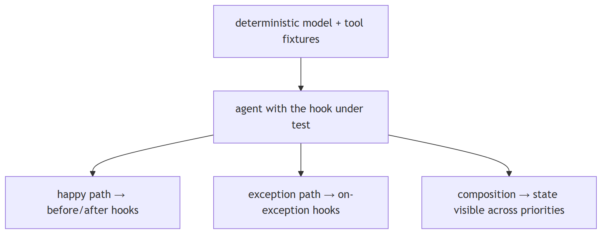

**In Jiuwen.** In Jiuwen, the testable boundary is `BaseModelClient`. Subclass it to return deterministic responses on the happy path and raise `ModelException` on demand for exception-path tests. Wrap a `ToolCard`'s callable to raise on a specific invocation to exercise the ON_TOOL_EXCEPTION hooks. Construct `DeepAgent` with only the rails under test and the mock client, then assert on observable effects: that a blocked tool was never invoked, `TokenTrackingRail` token counters, retry counts, and the `AgentObservabilityRail` typed span list. For composition, register two rails at known priorities, write a context field in the higher-priority rail's `before_tool_call`, and assert it is visible in the lower-priority rail's `before_tool_call`.

<b>Under the hood</b>

**Implementation**

`BaseModelClient` (`core/foundation/llm/model_clients/base_model_client.py`) is the injectable boundary. Subclass it: the normal path returns a fixed tool-call sequence or a final answer; the exception path raises `ModelException`. For tool exception paths, wrap the tool callable in the `ToolCard` to raise on demand. Assert on observable effects — that a blocked tool was never invoked, cumulative token counts (`TokenTrackingRail`), retry counts, and the `AgentObservabilityRail` typed span log. For composition, register two rails with a known priority order and assert the lower-priority rail's `before_tool_call` sees the context field written by the higher-priority rail. No framework test harness exists — each test constructs `DeepAgent` via `create_deep_agent(…)` manually.

**Implementation diagram**

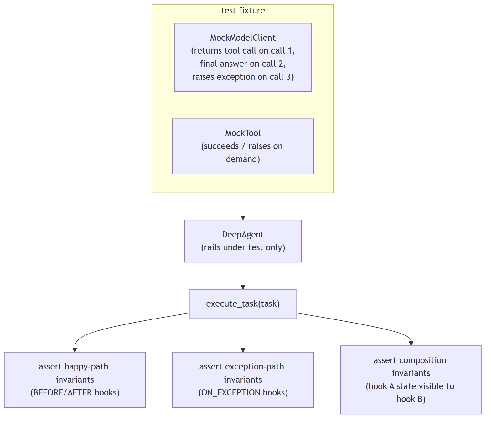

**Code anchors**

| Code anchor | What it points to |
|---|---|
| `agent-core/openjiuwen/core/foundation/llm/model_clients/base_model_client.py:45` | BaseModelClient: injectable mock boundary |
| `agent-core/openjiuwen/harness/factory.py:460` | create_deep_agent: model client override |
| `agent-core/openjiuwen/core/foundation/tool/base.py:78` | ToolCard callable wrapper: injectable error fixture |
| `agent-core/openjiuwen/harness/observability/rail.py:355` | AgentObservabilityRail: typed span log to assert on |

---

## 7. What is the event bridge model — which events propagate to the inner agent and which stay on the outer harness?

Mechanism advanced

**TL;DR.** Inner-agent events (model call, tool call, exceptions) bridge into the inner loop's callback manager so hooks fire at execution time; outer events (invocation boundary, task loop boundary) stay on the outer harness because the inner loop does not know it is being called repeatedly.

**Key points.**

- 9 bridged events: BEFORE/AFTER_MODEL_CALL, ON_MODEL_EXCEPTION, BEFORE/AFTER_TOOL_CALL, ON_TOOL_EXCEPTION, AFTER_REACT_ITERATION, ON_USER_MESSAGE, BEFORE_STEERING_DRAIN — routed to the inner callback manager.
- 2 outer-only: BEFORE/AFTER_INVOKE — on the harness only.
- 2 deep-only: BEFORE/AFTER_TASK_ITERATION — fired by the outer task loop, no inner equivalent.
- Registering a per-model-call hook as a per-invocation hook is a silent design error — it fires, just at the wrong rate.

**Concept.** The outer harness and the inner agent loop are separate event domains. Inner-agent events (model call, tool call, exceptions at those call sites) must bridge into the inner loop's callback manager because they occur during active reasoning — a security hook that blocks a specific tool call must fire at the point of execution, inside the inner loop, not before the loop starts. Outer events (full invocation boundary, task loop iteration boundary) stay on the outer harness because the inner loop does not know it is being called multiple times toward a long-horizon goal. Incorrectly wiring a hook to the wrong domain causes it to fire at the wrong granularity — a per-model-call cost meter registered as a per-invocation hook only fires once per outer pass and misses all intermediate calls.

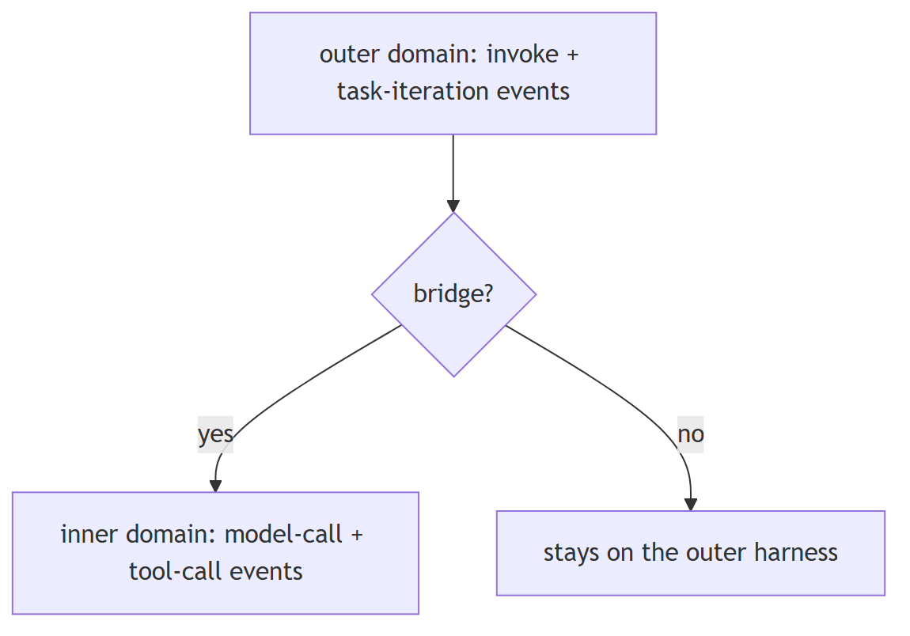

**In Jiuwen.** In Jiuwen, `DeepAgent` defines three event sets. `_BRIDGE_EVENTS` (9) are routed to the inner agent's callback manager (`_register_rail_selective`), so a security rail on BEFORE_TOOL_CALL intercepts at the actual tool execution inside the reasoning loop. `_OUTER_ONLY_EVENTS` (2) and `_DEEP_EVENTS` (2) stay on the outer harness, which the inner loop does not know about. The mismatch is silent: a cost meter registered on BEFORE_INVOKE fires once per outer pass and misses intermediate model calls.

<b>Under the hood</b>

**Implementation**

Three event sets are defined in `deep_agent.py`: `_BRIDGE_EVENTS` (9) — BEFORE/AFTER_MODEL_CALL, ON_MODEL_EXCEPTION, BEFORE/AFTER_TOOL_CALL, ON_TOOL_EXCEPTION, AFTER_REACT_ITERATION, ON_USER_MESSAGE, BEFORE_STEERING_DRAIN — are routed to the inner agent's callback manager (`_register_rail_selective`) so rails intercept at execution time. `_OUTER_ONLY_EVENTS` (2) — BEFORE_INVOKE, AFTER_INVOKE — stay on `DeepAgent`. `_DEEP_EVENTS` (2) — BEFORE_TASK_ITERATION, AFTER_TASK_ITERATION — are fired by the outer task-loop controller. Priority ordering within each event point determines which rail fires first (higher priority first).

**Implementation diagram**

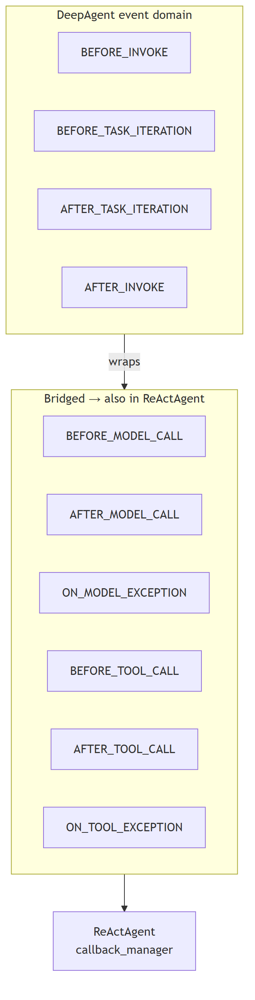

**Code anchors**

| Code anchor | What it points to |
|---|---|
| `agent-core/openjiuwen/harness/deep_agent.py:158` | _BRIDGE_EVENTS (9); :180 _OUTER_ONLY_EVENTS; :188 _DEEP_EVENTS; :2283 _register_rail_selective routes bridged events to the inner agent |
| `agent-core/openjiuwen/core/single_agent/agent_callback_manager.py:11` | inner callback manager |
| `agent-core/openjiuwen/core/single_agent/base.py:160` | BaseAgent.agent_callback_manager |

---

## 8. How does hot-loading lifecycle hooks into a running agent work and when would you need it?

Mechanism advanced

**TL;DR.** Hot-loading binds new lifecycle hooks to a live agent without restarting it; needed when capabilities are discovered at runtime (skill libraries, mid-session permission grants, external plugins).

**Key points.**

- Standard lifecycle hooks are bound at construction and fixed; hot-loading binds new hooks into the live pipeline.
- New hook joins the priority order without disrupting hooks that are mid-execution.
- Race risk: binding a callback during an active model call needs lock protection — the hot-bind itself is not lock-protected.
- The surrounding hot-load routine rolls back on failure, so no manual cleanup is required.

**Concept.** Standard lifecycle hooks are bound at construction — the spec is resolved, instances are created, and the pipeline is fixed. Hot-loading binds new lifecycle hooks to a live agent without stopping and restarting it. This is needed when the full capability set is not known at construction time: an agent discovers a skill library during a task and must load the tools and hooks declared in it; a user grants a new permission mid-session; an external plugin is installed while the agent is running. Hot-loading must preserve the existing pipeline state — the new hook joins the priority order without disrupting hooks that are mid-execution. Because agent invocations are async, binding a new callback during an active model call creates a race; the implementation must guard against partial registration.

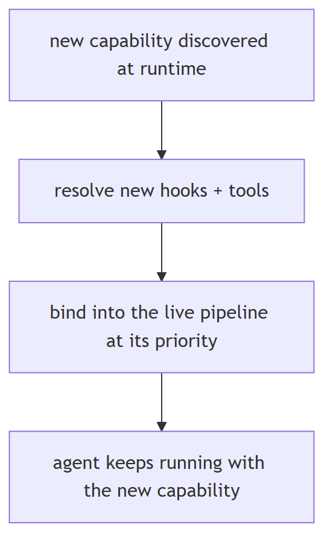

**In Jiuwen.** In Jiuwen, hot-loading is `apply_expert_harness_hot()`: it reads an `ExpertHarnessSpec`, resolves new rails and tools, and binds each with `_hot_bind_rail(agent, rail)` — which calls `await agent.register_rail(rail)` — plus `_hot_bind_prompt_section()` for the prompt section. It wraps the binds in try/except and rolls back with `unapply_expert_harness_hot()` on failure. `_hot_bind_rail` itself is not lock-protected, so loading a skill while the agent is mid-model-call carries a race risk.

<b>Under the hood</b>

**Implementation**

Hot-loading is implemented by `apply_expert_harness_hot()` (`harness/expert_harness_runtime.py`), which reads an `ExpertHarnessSpec`, resolves new rails and tools, and calls `_hot_bind_rail(agent, rail)` for each — which calls `await agent.register_rail(rail)` — plus `_hot_bind_prompt_section()` to inject the prompt section. `apply_expert_harness_hot()` wraps the binds in try/except and rolls back via `unapply_expert_harness_hot()` on failure. `_hot_bind_rail` itself is not lock-protected, so a rail loaded during a concurrent model call may register incompletely.

**Implementation diagram**

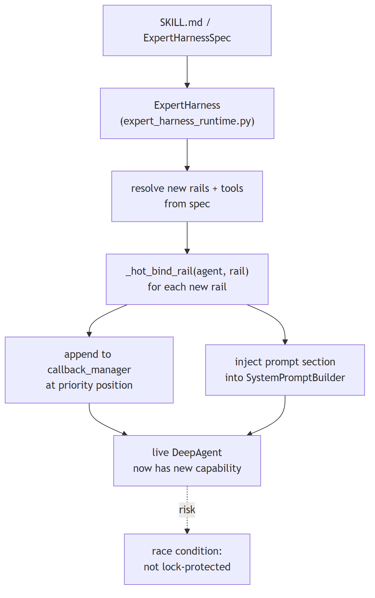

**Code anchors**

| Code anchor | What it points to |
|---|---|
| `agent-core/openjiuwen/harness/expert_harness_runtime.py:33` | apply_expert_harness_hot(); :190 _hot_bind_rail(); :198 _hot_bind_prompt_section() |
| `agent-core/openjiuwen/harness/schema/expert_harness_spec.py:119` | ExpertHarnessSpec |
| `agent-core/openjiuwen/harness/prompts/builder.py:28` | SystemPromptBuilder |
| `agent-core/openjiuwen/core/single_agent/agent_callback_manager.py:11` | live callback registration target |

---

## 9. How does a harness accumulate experience — what is the skill evolution pipeline?

Mechanism advanced

**TL;DR.** The harness observes every execution and can extract reusable patterns from those trajectories, stage them as skill experience records, and — with a configurable approval gate — persist them so future agents start with accumulated knowledge rather than from zero.

**Key points.**

- Capture: the evolution base hook collects execution spans into clean windows and applies quality gates before staging.
- Single-agent: the skill-evolution hook detects reusable tool/reasoning patterns and persists them via the experience store.
- Multi-agent: the team skill-evolution hook waits for team completion, aggregates member trajectories, and detects collaboration patterns.
- Approval gate: a hook routes staged records to user confirmation before persistence (auto_save=True bypasses this).
- Trajectory archive: a low-priority hook (priority 10) writes one canonical trajectory per invoke for offline analysis, independent of evolution.
- Trigger paths: passive signal scanning, periodic self-check follow-up, or explicit /evolve command — both flags opt-in.

**Concept.** A harness that intercepts every model call and tool call already has the data needed to improve itself: which tool sequences solved the problem, which reasoning patterns were reused, which sub-task plans worked. Skill evolution captures this data, extracts reusable patterns from it, and persists them as skill experience records that future agents load at task start. Without an evolution pipeline, every agent run starts from zero; with it, the agent population improves across sessions without retraining the underlying model. Three design decisions shape any evolution pipeline: (1) **what to capture** — the full execution trajectory or only successful final passes; (2) **what quality gate** prevents low-quality or noisy patterns from being persisted; (3) **whether human approval** is required before a pattern becomes a permanent skill (human-in-the-loop evolution) or whether the system auto-saves (fully autonomous evolution). The approval gate is the main lever for controlling how much the agent is trusted to modify its own future behaviour.

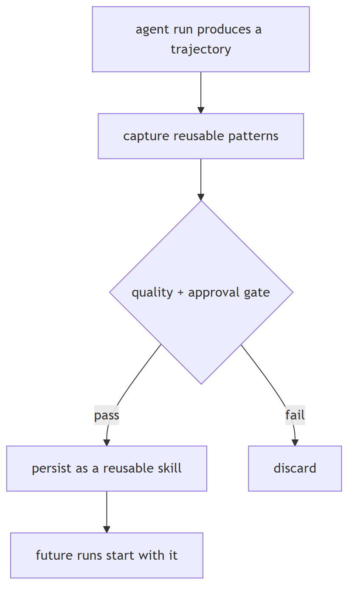

**In Jiuwen.** In Jiuwen, `EvolutionRail` is the base class: it subscribes to a trajectory processor, collects spans into clean windows, applies quality gates, and suppresses capture while evolution work runs. `SkillEvolutionRail` extends it for single-agent experience: after each invoke it detects reusable patterns, stages candidate records, and routes them through `EvolutionInterruptRail` for user approval before `EvolutionStore` persistence — or auto-saves if `auto_save=True`. `TeamSkillEvolutionRail` aggregates member trajectories after a team completion event and generates a team skill record. `TrajectoryRail` (priority 10) archives one canonical trajectory per invoke to `FileTrajectoryStore`. Trigger flags `signal_trigger`/`review_trigger` are `Optional[bool] = None` (off by default); an explicit `/evolve` command also dispatches evolution.

<b>Under the hood</b>

**Implementation**

`EvolutionRail` is the base class: it subscribes to a trajectory processor, collects execution spans into scope-local clean windows, applies quality gates, and suppresses capture during evolution work itself (to prevent skills about writing skills). `SkillEvolutionRail` extends it for single-agent experience: after each invoke it scans the trajectory for reusable patterns, stages candidate experience records, and routes them through `EvolutionInterruptRail` for user approval before `EvolutionStore` persistence — or auto-saves if `auto_save=True`. `TeamSkillEvolutionRail` extends it for multi-agent collaboration: it waits for a team completion event, aggregates trajectories from all member agents, detects the collaboration pattern, and generates a team skill record. `TrajectoryRail` (priority 10, shared tier with `TaskCompletionRail` and `AgentObservabilityRail`) archives one canonical trajectory per invoke to a `FileTrajectoryStore` for offline analysis. Trigger flags (`signal_trigger`, `review_trigger`) are declared `Optional[bool] = None` and coerced with `bool()`, i.e. off by default; an explicit `/evolve` command also dispatches evolution.

**Implementation diagram**

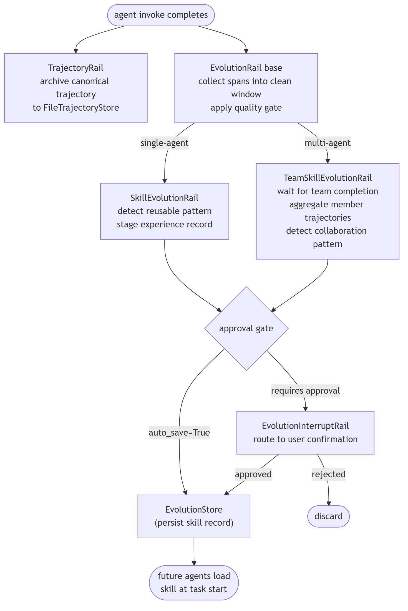

**Code anchors**

| Code anchor | What it points to |
|---|---|
| `agent-core/openjiuwen/harness/rails/evolution/evolution_rail.py:241` | EvolutionRail base |
| `agent-core/openjiuwen/harness/rails/evolution/skill_evolution_rail.py:141` | SkillEvolutionRail |
| `agent-core/openjiuwen/harness/rails/evolution/team_skill_evolution_rail.py:137` | TeamSkillEvolutionRail |
| `agent-core/openjiuwen/harness/rails/evolution/evolution_interrupt_rail.py:37` | EvolutionInterruptRail |
| `agent-core/openjiuwen/harness/rails/evolution/trajectory_rail.py:23` | TrajectoryRail (priority 10, :32) |

---
