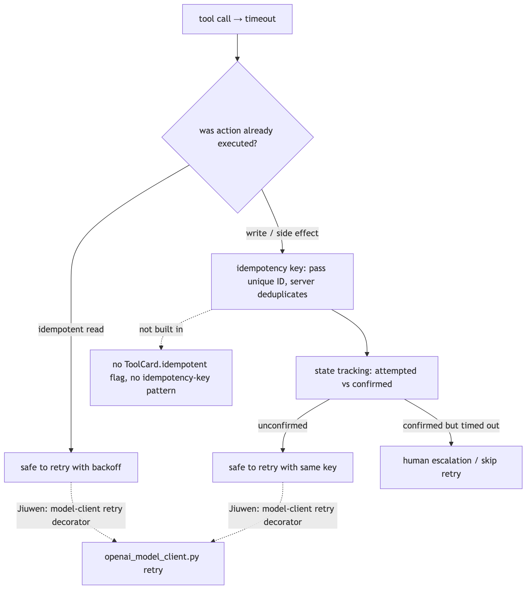
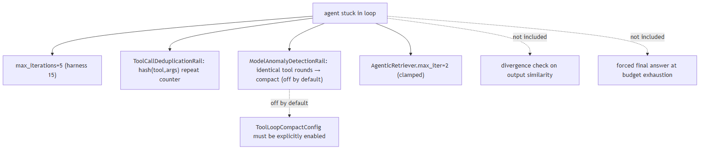
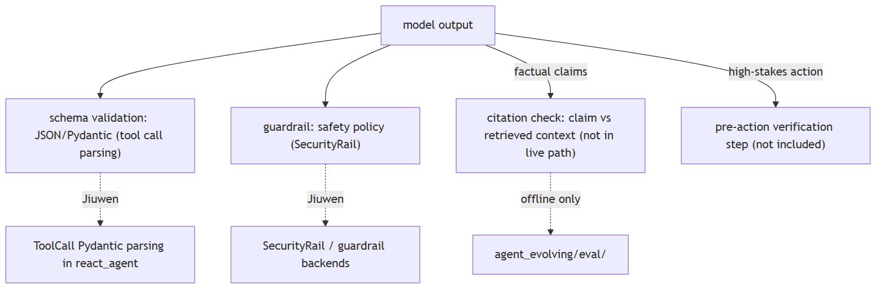
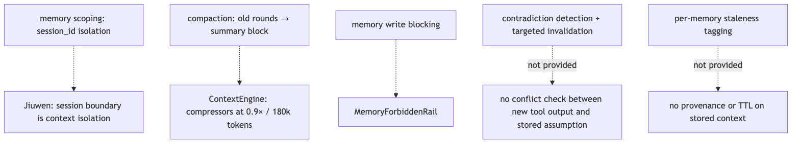
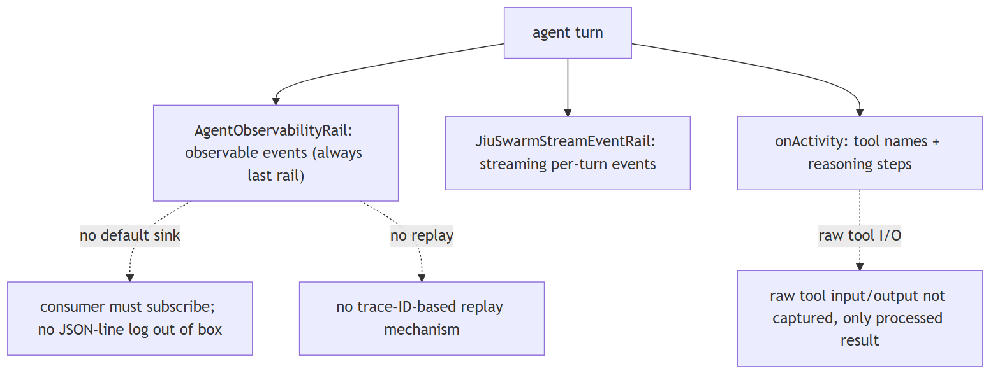
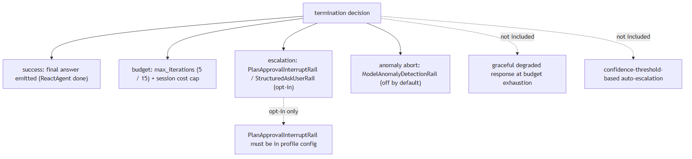

# Agent failure modes

## 1. Tool call failures and idempotency

Mechanism intermediate

**TL;DR.** "What happens if a tool times out after the action already executed?" Retrying blindly on a non-idempotent call — a payment, a database write, an email send — can cause duplicate side effects.

**Key points.**

- Separate the call type — reads are idempotent and safe to retry with backoff; writes must track whether they were confirmed or merely attempted.
- Idempotency keys (a unique request ID passed with every write; the server deduplicates) are the standard fix.
- State must persist across retries: the agent needs to know that `payment_id=abc123` was *attempted* before deciding to retry, not just that the last call failed.
- Add a human-escalation path for any irreversible action.

**Concept.** A tool call can time out after its action has already executed. Reads are idempotent and safe to retry with backoff; writes must track whether they were confirmed or only attempted. The standard fix is an **idempotency key** — a unique request ID passed with every write, which the server uses to deduplicate. State must persist across retries so the agent knows that `payment_id=abc123` was *attempted*, not merely that the last call failed. Any irreversible action needs a human-escalation path.

**In Jiuwen.** Jiuwen retries at the model-client layer and deduplicates repeated (tool, args) calls. It has no idempotency-key pattern and no attempted-vs-confirmed tracking, so keeping writes safe across retries is left to the developer.

<b>Under the hood</b>

**Implementation**

Retry logic lives in the model-client layer (a per-provider retry decorator in `openai_model_client.py`). Tool calls are deduplicated at the argument level by `ToolCallDeduplicationRail`, which detects repeated `(tool, args)` hashes and warns or compacts. Idempotency keys, attempted-vs-confirmed state tracking, and a read/write tool taxonomy are not built in; `ToolCard` has no `idempotent` field, so retry safety is a design decision the developer encodes.

**Code anchors**

| Code anchor | What it points to |
|---|---|
| `agent-core/openjiuwen/core/foundation/llm/model_clients/openai_model_client.py` | per-provider retry decorator on API errors |
| `jiuwenswarm/jiuwenswarm/agents/harness/common/rails/tool_dedup_rail.py:157` | ToolCallDeduplicationRail: repeated (tool, args) → warn/compact |
| `agent-core/openjiuwen/core/foundation/tool/base.py` | ToolCard schema; no idempotent field |
| `agent-core/openjiuwen/core/single_agent/agents/react_agent.py` | tool execution path; no confirmed-vs-attempted state |

---

## 2. Stuck loops and loop invariants

Mechanism advanced

**TL;DR.** Agents rarely crash visibly.

**Key points.**

- Hard step cap (`max_iterations`).
- Divergence detection: if the last N tool calls are identical or the model output is structurally the same, abort rather than continue.
- State deduplication: canonicalise `(tool, input_hash)` and reject re-execution of a confirmed call.
- Context compaction on loop: if the agent is stuck, the context likely contains noise that is reinforcing the wrong path — compact it before continuing.
- A final-answer forced output at budget exhaustion.

**Concept.** Agents rarely crash visibly — they loop. A wrong conclusion is written back into context and reinforces itself; a bad tool call is retried unchanged. The mechanisms that prevent this are: a hard step cap (`max_iterations`); **divergence detection** that aborts when the last N tool calls or the output are structurally identical; **state deduplication** that canonicalises `(tool, input_hash)` and rejects re-execution of a confirmed call; **context compaction** to clear the noise that is reinforcing the wrong path; and a forced final answer at budget exhaustion.

**In Jiuwen.** Jiuwen caps the loop and detects repeated tool rounds. The compaction guard that would break a loop is off by default, and there is no check for repeated model output.

<b>Under the hood</b>

**Implementation**

Concrete mechanisms exist: `ReactAgent.max_iterations` defaults to 5 (the harness raises it to 15); `ModelAnomalyDetectionRail` detects consecutive identical tool-call rounds via `ToolLoopCompactConfig` (off by default; it compacts then aborts); `ToolCallDeduplicationRail` counts repeated `(tool, args)`; `AgenticRetriever.max_iter` defaults to 2. Output-similarity divergence checks and a forced final answer at budget are not included, and `ToolLoopCompactConfig` must be enabled explicitly.

**Code anchors**

| Code anchor | What it points to |
|---|---|
| `agent-core/openjiuwen/core/single_agent/agents/react_agent.py:288` | max_iterations: int = Field(default=5) |
| `agent-core/openjiuwen/harness/schema/config.py:252` | harness default iterations 15 |
| `agent-core/openjiuwen/harness/rails/model_anomaly_detection_rail.py:74` | ToolLoopCompactConfig (default off); :90 loop → compact → abort |
| `jiuwenswarm/jiuwenswarm/agents/harness/common/rails/tool_dedup_rail.py:157` | repeat counter/warning |
| `agent-core/openjiuwen/core/retrieval/retriever/agentic_retriever.py` | max_iter=2 clamped |

---

## 3. Output validation and ungrounded confidence

Mechanism advanced

**TL;DR.** A fluent answer is not a correct one, so validation is an architectural stage rather than a review step.

**Key points.**

- For factual claims: extract each claim from the output, verify it against the retrieved source documents (NLI model or LLM-as-judge).
- For structured output: validate against the expected schema before acting (JSON schema, Pydantic model).
- For high-stakes actions: a separate verification step before the result is trusted or acted upon.
- Treat "the model said X" as a hypothesis, not a fact.

**Concept.** A fluent answer is not a correct one, so validation is an architectural stage rather than a review step. For factual claims, extract each claim and verify it against the retrieved sources (an NLI model or LLM-as-judge). For structured output, validate against the expected schema (JSON Schema, Pydantic) before acting. For high-stakes actions, insert a separate verification step before the result is trusted. Treat "the model said X" as a hypothesis, not a fact.

**In Jiuwen.** Jiuwen validates tool-call structure and applies guardrails, but it does not check answer claims against retrieved context in the live path; that faithfulness check runs only offline.

<b>Under the hood</b>

**Implementation**

Structured output validation is present through `StructuredAskUserRail` and Pydantic parsing of `ToolCall` responses in the tool-call path; the `SecurityRail` guardrail layer validates inputs and outputs for safety policy. Claim-level citation verification against retrieved context is not in the live path — the faithfulness evaluator in `agent_evolving/eval/` runs offline — and there is no general pre-action verification step; schema-guided generation constrains format but not content accuracy.

**Code anchors**

| Code anchor | What it points to |
|---|---|
| `agent-core/openjiuwen/core/single_agent/agents/react_agent.py` | ToolCall Pydantic parsing; schema-validated tool calls |
| `agent-core/openjiuwen/core/security/guardrail/builtin.py` | SecurityRail content classification |
| `jiuwenswarm/jiuwenswarm/agents/harness/common/rails/ask_user_rail.py` | structured output rail |
| `agent-core/openjiuwen/agent_evolving/eval/` | faithfulness evaluation (offline) |

---

## 4. Memory as a source of compounding error

Mechanism advanced

**TL;DR.** Memory is a liability as well as a feature: a wrong assumption stored early can shape every later decision.

**Key points.**

- Scope memory by task/session boundary — assumptions from session A should not contaminate session B.
- Invalidation: when a tool returns contradictory evidence, the previous related memory should be flagged or discarded, not silently co-exist.
- Immutability checkpoints: tag memories with the context that generated them; when that context is superseded, the memory is stale.
- Know when to compact the context window rather than accumulate it.

**Concept.** Memory is a liability as well as a feature: a wrong assumption stored early can quietly shape every later decision. Mitigations: scope memory by task or session so assumptions do not leak across sessions; when a tool returns contradictory evidence, flag or discard the related memory instead of letting both coexist; tag memories with the context that produced them so superseded ones can be identified as stale; and compact the context window rather than accumulate it.

**In Jiuwen.** Jiuwen keeps memory scoped to a session and compacts long histories. It does not detect contradictions or mark memories as stale.

<b>Under the hood</b>

**Implementation**

Memory is session-scoped: `session_id` is the isolation unit and contexts do not cross sessions. The context engine compresses history (compressors at a 0.9× token budget and a full compaction at 180k tokens), and `MemoryForbiddenRail` blocks specific write patterns. Contradiction detection, per-memory staleness tags, and targeted invalidation are not provided — compaction is all-or-nothing.

**Code anchors**

| Code anchor | What it points to |
|---|---|
| `agent-core/openjiuwen/core/context_engine/context_engine.py` | session-scoped context; recover_from_model_exception for overflow |
| `agent-core/openjiuwen/core/context_engine/processor/compressor/round_level_compressor.py:104` | trigger_context_ratio=0.9 |
| `agent-core/openjiuwen/core/context_engine/processor/compressor/full_compact_processor.py` | full compaction at 180k tokens |
| `jiuwenswarm/jiuwenswarm/agents/harness/common/rails/memory_forbidden_rail.py` | MemoryForbiddenRail |

---

## 5. Observability and auditing agent decisions

Mechanism intermediate

**TL;DR.** If the only artifact is the final transcript, no one can audit why the agent chose one tool or path over another.

**Key points.**

- Structured trace per turn: the model's reasoning text, which tools were called with what inputs, the raw tool outputs, and the rail/guard decisions that shaped the response.
- Each step should have a timestamp and a session/turn identifier so you can reconstruct the exact execution path.
- Sampling strategy for production (full trace on errors, sampled on success).
- A way to replay a specific trace to reproduce a failure.

**Concept.** If the only artifact is the final transcript, no one can audit why the agent chose one tool or path over another. Structured tracing records, per turn: the model's reasoning text, which tools were called with what inputs, the raw tool outputs, and the rail/guard decisions that shaped the response, each stamped with a time and a session/turn identifier. Production uses a sampling strategy (full trace on errors, sampled on success) and supports replaying a specific trace to reproduce a failure.

**In Jiuwen.** Jiuwen emits per-turn observable events and streaming events that a consumer can subscribe to. It ships no default log sink, does not capture raw tool input/output, and has no trace replay.

<b>Under the hood</b>

**Implementation**

`AgentObservabilityRail` is always the last rail in the profile and captures per-turn observable events; the `harness/observability` module structures them, `JiuSwarmStreamEventRail` emits streaming per-turn events, and tool names and reasoning steps surface as `onActivity` events. A structured JSON-line sink, capture of raw tool input/output (only the processed result surfaces), and trace-ID-based replay are not included out of the box — events require a subscribing consumer.

**Code anchors**

| Code anchor | What it points to |
|---|---|
| `agent-core/openjiuwen/harness/observability/__init__.py` | AgentObservabilityRail; always last in profile |
| `jiuwenswarm/jiuwenswarm/agents/harness/common/rails/stream_event_rail.py` | JiuSwarmStreamEventRail |
| `agent-core/openjiuwen/harness/rails/` | rail pipeline; AgentObservabilityRail appended last |
| `agent-core/openjiuwen/core/single_agent/agents/react_agent.py` | tool call execution; raw I/O not persisted separately |

---

## 6. Termination conditions

Mechanism advanced

**TL;DR.** "Stop when done" is not a termination condition; an agent needs explicit success, budget, and escalation paths.

**Key points.**

- At least three termination paths: (1) success — the agent emits a final answer meeting a defined success condition (e.g., all required fields populated, retrieved context cited); (2) budget exhaustion — hard cap on iterations and tokens, with a graceful degraded response rather than silence; (3) human escalation — when the agent has exhausted its budget or detected irresolvable ambiguity, it hands off explicitly rather than looping or hallucinating.
- Confidence threshold as an optional fourth: if the model's own uncertainty estimate is above a threshold, escalate before acting.

**Concept.** "Stop when done" is not a termination condition. An agent needs at least three explicit paths: **success** (a final answer meeting a defined condition, such as required fields populated or context cited); **budget exhaustion** (a hard cap on iterations and tokens, with a graceful degraded response rather than silence); and **human escalation** (handing off when budget is exhausted or ambiguity is unresolvable). A confidence threshold can add a fourth: escalate before acting when the model's uncertainty is high.

**In Jiuwen.** Jiuwen stops on no tool call, on iteration caps, and through optional human-approval rails. It does not return a degraded answer at budget exhaustion or escalate automatically on low confidence.

<b>Under the hood</b>

**Implementation**

Several termination paths exist: `ReactAgent.max_iterations` is the hard iteration cap (5, or 15 in the harness); `PlanApprovalInterruptRail` and `StructuredAskUserRail` provide human-in-the-loop escalation; `ModelAnomalyDetectionRail` can abort on anomaly detection; and `AgentObservabilityRail` logs every turn. A graceful degraded response at budget exhaustion and confidence-threshold auto-escalation are not included, and the approval rails are opt-in per agent config.

**Code anchors**

| Code anchor | What it points to |
|---|---|
| `agent-core/openjiuwen/core/single_agent/agents/react_agent.py:288` | max_iterations: int = Field(default=5) |
| `agent-core/openjiuwen/harness/schema/config.py:252` | harness default iterations 15 |
| `agent-core/openjiuwen/harness/rails/model_anomaly_detection_rail.py:74` | anomaly abort (off by default) |
| `jiuwenswarm/jiuwenswarm/server/runtime/usage_cost.py:171` | session cost cap |
| `jiuwenswarm/jiuwenswarm/agents/harness/common/rails/ask_user_rail.py` | structured human escalation |
| `jiuwenswarm/jiuwenswarm/agents/harness/code/rails/code_plan_approval_interrupt_rail.py` | PlanApprovalInterruptRail (opt-in) |

---
