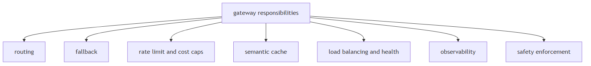

# Model routing & gateways

## 1. What is an AI gateway and when do you need one?

Mechanism intermediate

**TL;DR.** An AI gateway centralises routing, rate-limiting, key isolation, semantic caching, safety enforcement, and observability for all LLM calls across multiple services. Needed when multiple services call LLMs independently, per-tenant budgets are required, or a single audit log is needed.

**Key points.**

- Routing: send requests to different providers based on cost, latency, availability, or model capability.
- Rate limiting and cost enforcement: per-tenant token budgets and hard spend caps without touching application code.
- Key isolation: API keys stay in the gateway; application services hold only internal tokens.
- Semantic caching: embed queries, return cached responses for near-duplicates — reduces redundant model calls.
- Safety enforcement: content filtering and PII redaction applied uniformly before the request reaches the model.
- Observability: every call logged with provider, model, tokens, latency, and cost in one place.
- When needed: multiple services calling LLMs (key sprawl), strict budgets, multi-provider fallback, unified audit log.

**Concept.** An AI gateway is an infrastructure layer that sits between your application and one or more LLM provider APIs. It centralises concerns that would otherwise be duplicated in every service that calls a model.

**In Jiuwen.** No standalone AI gateway component. Equivalent functions are distributed: provider routing via ModelClientFactory; cost tracking via usage_cost.py:101; circuit breaking via CircuitBreakerRail (circuit_breaker_rail.py:1); content safety via GuardrailRail (guardrail_rail.py:1); observability via ObservabilityHandler (observability/event.py:1). These are per-agent, not cross-service. A separate gateway upstream of Jiuwen would handle cross-service key isolation and semantic caching.

<b>Under the hood</b>

**Implementation**

No standalone gateway component. Its functions are distributed: provider routing through the model pool (`ModelPoolEntry`), cost tracking in `usage_cost.py`, circuit breaking via `CircuitBreakerRail`, content safety via the guardrail layer, and observability events through the harness observability rail. A separate AI gateway upstream of Jiuwen would handle cross-service key isolation and semantic caching.

**Code anchors**

| Code anchor | What it points to |
|---|---|
| `jiuwenswarm/jiuwenswarm/server/runtime/usage_cost.py:101` | cost meter |
| `jiuwenswarm/jiuwenswarm/agents/harness/common/rails/execution_guard/circuit_breaker_rail.py:1` | CircuitBreakerRail |
| `agent-core/openjiuwen/core/security/guardrail/builtin.py:1` | guardrail |
| `agent-core/openjiuwen/harness/observability/rail.py:1` | observability events |

---

## 2. How a gateway's responsibilities map onto a production LLM stack

Concept intermediate

**TL;DR.** A gateway composes six concerns that appear throughout a production LLM stack.

**Key points.**

- Routing chooses among providers by cost, latency, or availability
- Fallback defines what happens when a model call fails
- Rate limiting and cost caps bound spend per tenant or user
- Semantic caching removes redundant calls for repeated or similar questions
- Load balancing and endpoint health keep healthy endpoints in rotation
- Observability attaches span, trace, and cost metadata to every call
- Safety enforcement rejects or sanitizes requests before they reach the model

**Concept.** Each of the gateway's six responsibilities addresses a distinct production concern. **Routing** chooses among providers by cost, latency, or availability. **Fallback** defines what happens when a call fails, so the user does not see an error. **Rate limiting and cost caps** bound spend per tenant or user and prevent a single client from exhausting the budget. **Semantic caching** removes redundant calls when the same or a similar question recurs. **Load balancing and endpoint health** keep healthy endpoints in rotation and drop failing ones. **Observability** attaches span, trace, and cost metadata to every call so behaviour can be audited. **Safety enforcement** rejects or sanitizes requests before they reach the model. Together these are the concerns to name when designing the layer between an application and its model providers.

**In Jiuwen.** Given Jiuwen, routing is the model-pool router with health, rate, and latency scoring; the other gateway concerns are configured separately rather than composed into one component.

<b>Under the hood</b>

**Implementation**

Routing lives in the `ModelPoolEntry` router with health, rate, and latency scoring; the remaining concerns are configured separately rather than composed by a single component, so a dedicated AI gateway would sit upstream of Jiuwen's model clients.

---

## 3. How do you route between multiple model providers — and when do you switch dynamically?

Mechanism advanced

**TL;DR.** Route between providers statically (config) or dynamically (primary/fallback, capability, cost); ensure response-format compatibility and observable routing decisions.

**Key points.**

- Static: provider set at agent construction in ModelConfig.
- Dynamic patterns: primary/fallback, capability router, cost router.
- Jiuwen: no built-in runtime router; CircuitBreakerRail trips but doesn't reroute.

**Concept.** Multi-provider routing has two modes: static (choose provider at config time based on cost, capability, or data residency) and dynamic (route at request time based on load, availability, or task type). Dynamic routing patterns: (1) primary/fallback — always try provider A, fall back to B on error or timeout; (2) capability routing — send code tasks to a coding-optimized model, chat tasks to a general model; (3) cost routing — send cheap queries to a small cheap model, expensive reasoning to a large model (classifier decides). Key considerations: response format compatibility across providers (different tool-call schemas), token counting per-provider, and observable routing decisions (which provider was actually used).

**In Jiuwen.** ModelClientFactory (agent-core/openjiuwen/core/model/client/factory.py) selects a provider at agent construction time. ModelConfig references a named provider + model ID. No built-in runtime routing layer exists — no primary/fallback chain, no capability classifier, no cost-based dispatch. Multi-provider setups require application-layer orchestration (configuring different agents with different ModelConfigs). CircuitBreakerRail trips on consecutive failures and opens the circuit, but does not reroute to an alternate provider.

<b>Under the hood</b>

**Implementation**

Routing is configured per agent through `ModelClientConfig` and `ProviderType`, and `create_model_client` resolves the provider client. At the team layer there is a real model pool: `ModelPoolEntry` plus allocators (including `IntelliRouterAllocator`) select a model by name, rotation, and health. What is not built in is a per-request capability classifier or cost-based dispatcher that picks a model for each call; those policies live in the application or in the pool configuration. `CircuitBreakerRail` trips on consecutive failures and cools down, which is the closest analogue to provider failover.

**Code anchors**

| Code anchor | What it points to |
|---|---|
| `agent-core/openjiuwen/core/foundation/llm/model_clients/__init__.py:58` | create_model_client provider dispatch |
| `agent-core/openjiuwen/core/foundation/llm/schema/config.py:13` | ProviderType / ModelClientConfig |
| `agent-core/openjiuwen/agent_teams/models/pool.py:38` | ModelPoolEntry; agent-core/openjiuwen/agent_teams/models/allocator.py:452 — IntelliRouterAllocator |
| `jiuwenswarm/jiuwenswarm/agents/harness/common/rails/execution_guard/circuit_breaker_rail.py:303` | CircuitBreakerRail failure trip + cooldown |

---

## 4. What is the correct fallback sequence when a model call fails?

Mechanism intermediate

**TL;DR.** Transient errors → retry with backoff; still failing → fallback provider; permanent errors → skip retry; quality failures → modified prompt or abstain. Always return a graceful degraded response.

**Key points.**

- Transient (timeout, 5xx, rate limit): retry ×3 with exponential backoff.
- Permanent (auth, unsupported): fail immediately.
- Quality (bad output): retry with modified prompt or abstain.
- Jiuwen: CircuitBreakerRail trips on consecutive errors but raises — no graceful degraded response, no auto fallback provider.

**Concept.** Model call failures fall into three categories: transient (timeout, rate limit, 5xx), permanent (auth error, unsupported model, input too long), and quality (response parsed but content invalid/refused). The correct fallback sequence: (1) retry with exponential backoff + jitter for transient errors (max 3 attempts); (2) if still failing, route to a fallback provider/model if one is configured; (3) if the fallback also fails or no fallback exists, return a graceful degraded response — "I was unable to complete this request, please try again" — rather than surfacing a raw exception. Do not retry permanent errors (they will not recover). Do not retry quality failures as-is (retry with a modified prompt or abstain).

**In Jiuwen.** CircuitBreakerRail (agent-core/openjiuwen/harness/rails/circuit_breaker_rail.py) tracks consecutive failures, opens after a threshold, then half-opens to probe recovery. ModelRequestConfig.timeout is forwarded to the provider client. No automatic fallback-provider routing exists — an open circuit raises an exception. No retry-with-modified-prompt path for quality failures. Graceful degraded responses are not emitted by any rail.

<b>Under the hood</b>

**Implementation**

`ModelBackupRail` provides failover to a backup model on failure, and `CircuitBreakerRail` tracks consecutive failures, opens the circuit during cooldown, and half-opens to probe recovery. `ModelClientConfig.timeout` is forwarded to the provider client. There is no structured degraded response emitted by a rail, and no retry-with-modified-prompt path for quality failures.

**Code anchors**

| Code anchor | What it points to |
|---|---|
| `jiuwenswarm/jiuwenswarm/agents/harness/common/rails/execution_guard/circuit_breaker_rail.py:303` | CircuitBreakerRail open/closed/half-open states |
| `agent-core/openjiuwen/core/single_agent/rail/model_backup.py:9` | ModelBackupRail failover |
| `agent-core/openjiuwen/core/foundation/llm/schema/config.py:102` | ModelClientConfig.timeout |

---
