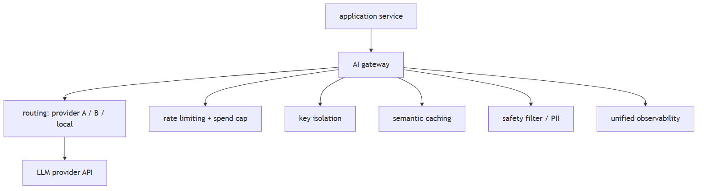

# Model routing & gateways

## 1. What is an AI gateway and when do you need one?

Concept intermediate

**TL;DR.** An AI gateway centralises routing, rate-limiting, key isolation, semantic caching, safety enforcement, and observability for all LLM calls across multiple services. Needed when multiple services call LLMs independently, per-tenant budgets are required, or a single audit log is needed.

**Key points.**

- Routing: send requests to different providers based on cost, latency, availability, or model capability.
- Rate limiting and cost enforcement: per-tenant token budgets and hard spend caps without touching application code.
- Key isolation: API keys stay in the gateway; application services hold only internal tokens.
- Semantic caching: embed queries, return cached responses for near-duplicates — reduces redundant model calls.
- Safety enforcement: content filtering and PII redaction applied uniformly before the request reaches the model.
- Observability: every call logged with provider, model, tokens, latency, and cost in one place.
- When needed: multiple services calling LLMs (key sprawl), strict budgets, multi-provider fallback, unified audit log.

**Concept.** An AI gateway is an infrastructure layer that sits between your application and one or more LLM provider APIs. It centralises concerns that would otherwise be duplicated in every service that calls a model.

**In Jiuwen.** No standalone AI gateway component. Equivalent functions are distributed: provider routing via ModelClientFactory; cost tracking via usage_cost.py:101; circuit breaking via CircuitBreakerRail (circuit_breaker_rail.py:1); content safety via GuardrailRail (guardrail_rail.py:1); observability via ObservabilityHandler (observability/event.py:1). These are per-agent, not cross-service. A separate gateway upstream of Jiuwen would handle cross-service key isolation and semantic caching.

<b>Under the hood</b>

**Implementation**

No standalone gateway component. Equivalent functions are distributed across the framework: provider routing via `ModelClientFactory`; cost tracking via `usage_cost.py`; circuit breaking via `CircuitBreakerRail`; content safety via `GuardrailRail`; observability via `ObservabilityHandler`. A separate AI gateway upstream of Jiuwen would handle cross-service key isolation and semantic caching.

---

## 2. How a gateway's responsibilities map onto a production LLM stack

Concept intermediate

**TL;DR.** A gateway composes six concerns that appear throughout a production LLM stack.

**Key points.**

- Routing chooses among providers by cost, latency, or availability
- Fallback defines what happens when a model call fails
- Rate limiting and cost caps bound spend per tenant or user
- Semantic caching removes redundant calls for repeated or similar questions
- Load balancing and endpoint health keep healthy endpoints in rotation
- Observability attaches span, trace, and cost metadata to every call
- Safety enforcement rejects or sanitizes requests before they reach the model

**Concept.** Each of the gateway's six responsibilities addresses a distinct production concern. **Routing** chooses among providers by cost, latency, or availability. **Fallback** defines what happens when a call fails, so the user does not see an error. **Rate limiting and cost caps** bound spend per tenant or user and prevent a single client from exhausting the budget. **Semantic caching** removes redundant calls when the same or a similar question recurs. **Load balancing and endpoint health** keep healthy endpoints in rotation and drop failing ones. **Observability** attaches span, trace, and cost metadata to every call so behaviour can be audited. **Safety enforcement** rejects or sanitizes requests before they reach the model. Together these are the concerns to name when designing the layer between an application and its model providers.

<b>Under the hood</b>

**Implementation**

Routing lives in the `ModelPoolEntry` router with health, rate, and latency scoring; the remaining concerns are configured separately rather than composed by a single component, so a dedicated AI gateway would sit upstream of Jiuwen's model clients.

---
