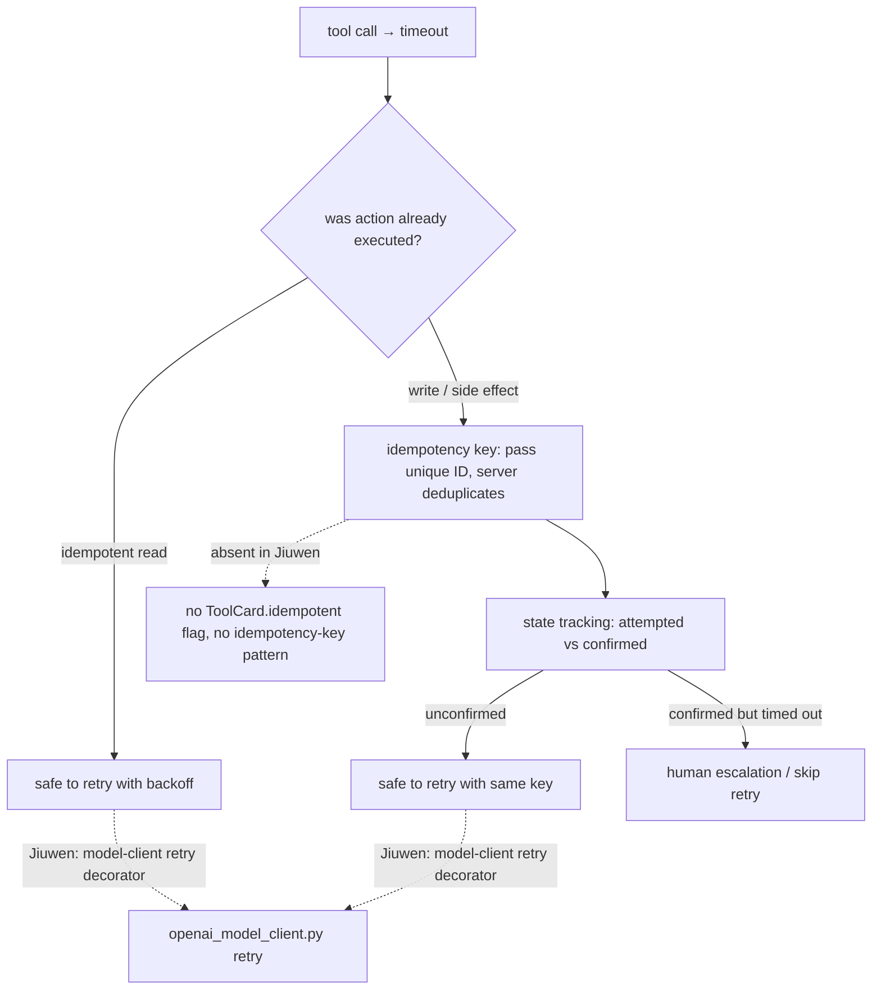
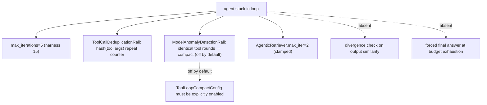
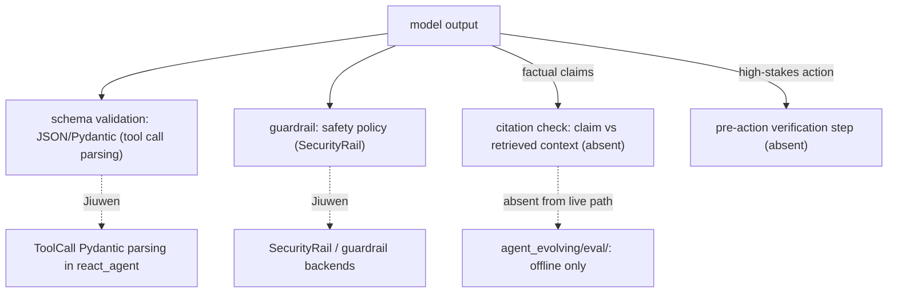
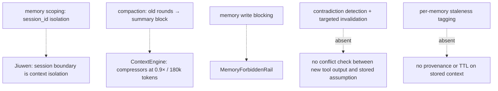
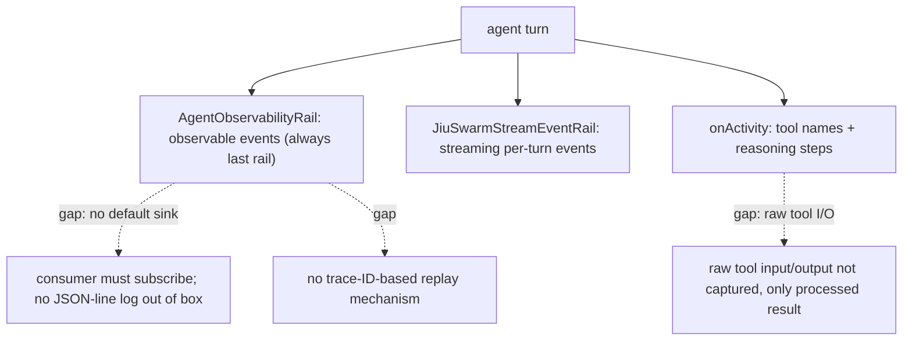
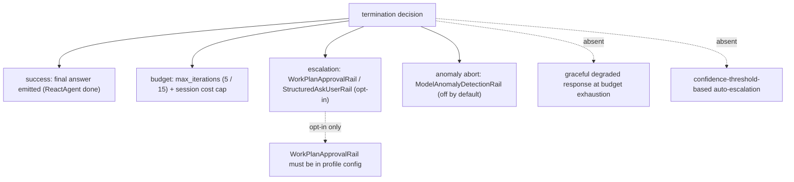

# Agent failure patterns — what interviews are actually testing + how Jiuwen maps

Based on the observation *Patterns I've noticed while preparing for AI engineering interviews*. This is not a question list; each entry is a failure mode that interviewers use as a depth probe — what they are actually testing behind the polite "what happens if your agent fails halfway through a workflow?", what a strong answer includes, and the concrete mechanism (or gap) in this codebase.

The through-line, stated directly in the source: "interviewers are not testing whether you know the concepts. They are testing whether you have thought about failure as a first class design problem, not an afterthought." The framework gap pattern is therefore the most useful thing to have ready: know what Jiuwen handles, and name what it does not. See [README](README.md) for the shared conventions (answer shape, anchor format, repo layers).

---

## 1. Tool call failures test whether you understand idempotency, not just retry logic

**What they're testing:** "What happens if a tool times out after the action already executed?" Retrying blindly on a non-idempotent call — a payment, a database write, an email send — can cause duplicate side effects. The question is not "did you add a retry?"; it is "do you know which calls you can safely retry and which require idempotency keys and explicit state tracking?"

**What a strong answer includes:** Separate the call type — reads are idempotent and safe to retry with backoff; writes must track whether they were confirmed or merely attempted. Idempotency keys (a unique request ID passed with every write; the server deduplicates) are the standard fix. State must persist across retries: the agent needs to know that `payment_id=abc123` was *attempted* before deciding to retry, not just that the last call failed. Add a human-escalation path for any irreversible action.

**Jiuwen:** Retry logic lives in the model-client layer (per-provider retry decorator in `openai_model_client.py` and equivalents). Tool call deduplication exists at the argument level via `ToolCallDeduplicationRail`, which detects repeated `(tool, args)` hashes and warns or compacts. What is **absent**: no idempotency-key pattern, no per-call "attempted vs confirmed" state tracker, and no automatic separation of read vs write tool semantics. The `ToolCard` schema has no `idempotent: bool` field. Whether a tool can be safely retried is a design decision the developer must encode outside the framework.

**Anchors:** &bull; `agent-core/openjiuwen/core/foundation/llm/model_clients/openai_model_client.py` — per-provider retry decorator on API errors &bull; `jiuwenswarm/jiuwenswarm/agents/harness/common/rails/tool_dedup_rail.py:157` — `ToolCallDeduplicationRail`: repeated `(tool, args)` → warn/compact &bull; `agent-core/openjiuwen/core/foundation/tool/tool_card.py` — `ToolCard` schema; no `idempotent` field &bull; `agent-core/openjiuwen/core/single_agent/agents/react_agent.py` — tool execution path; no confirmed-vs-attempted state

**Gap.** No idempotency-key pattern. No read-vs-write tool taxonomy. Deduplication exists at the `(tool, args)` level, not at the "was this write confirmed" level.

---

## 2. Stuck loops test whether you have designed explicit loop invariants, not just added more retries

**What they're testing:** Agents rarely crash visibly. They loop. A wrong conclusion gets written back into context and reinforces itself on the next step. A bad tool call gets retried identically because nothing changed the reasoning. The interviewer wants to hear specific mechanisms — step budgets, divergence checks, state deduplication — not "I'd add a retry limit."

**What a strong answer includes:** Hard step cap (`max_iterations`). Divergence detection: if the last N tool calls are identical or the model output is structurally the same, abort rather than continue. State deduplication: canonicalise `(tool, input_hash)` and reject re-execution of a confirmed call. Context compaction on loop: if the agent is stuck, the context likely contains noise that is reinforcing the wrong path — compact it before continuing. A final-answer forced output at budget exhaustion.

**Jiuwen:** Multiple concrete mechanisms exist. `ReactAgent.max_iterations` defaults to 5; the harness config raises this to 15. `ModelAnomalyDetectionRail` detects consecutive identical tool-call rounds (`ToolLoopCompactConfig`, default off; triggers compact then bailout). `ToolCallDeduplicationRail` hashes `(tool, args)` and counts repeats with warnings. `AgenticRetriever.max_iter` defaults to 2 (clamped). What is **absent**: no divergence check on model *output* similarity (identical reasoning text), no forced final-answer generation at budget, and `ToolLoopCompactConfig` is off by default — which means loops produce warnings but no abort unless manually configured.

**Anchors:** &bull; `agent-core/openjiuwen/core/single_agent/agents/react_agent.py:288` — `max_iterations: int = Field(default=5)` &bull; `agent-core/openjiuwen/harness/schema/config.py:252` — harness default iterations 15 &bull; `agent-core/openjiuwen/harness/rails/model_anomaly_detection_rail.py:74` — `ToolLoopCompactConfig` (default off); `:90` loop → compact → abort &bull; `jiuwenswarm/jiuwenswarm/agents/harness/common/rails/tool_dedup_rail.py:157` — repeat counter/warning &bull; `agent-core/openjiuwen/symphony/retrieval/retrievers/agentic_retriever.py` — `max_iter=2` clamped

**Gap.** `ToolLoopCompactConfig` is off by default — loops warn but do not abort without explicit config. No output-similarity divergence check. No forced final-answer generation at budget.

---

## 3. Ungrounded confidence tests whether you treat validation as a pipeline stage, not a review step

**What they're testing:** "A fluent answer is not the same as a correct one." The interviewer wants to hear that you treat output validation as an architectural concern, not a quality check after the fact. Naming specific validation types — citation grounding against retrieved context, schema validation on structured outputs, a separate verification step before the answer is trusted — signals that you have thought about failure at design time.

**What a strong answer includes:** For factual claims: extract each claim from the output, verify it against the retrieved source documents (NLI model or LLM-as-judge). For structured output: validate against the expected schema before acting (JSON schema, Pydantic model). For high-stakes actions: a separate verification step before the result is trusted or acted upon. Treat "the model said X" as a hypothesis, not a fact.

**Jiuwen:** Structured output validation is present via `StructuredAskUserRail` and output parsing in the tool-call path (Pydantic model parsing of `ToolCall` responses). The `SecurityRail` / guardrail layer validates inputs and outputs for safety policy. What is **absent**: no claim-level citation verification (no NLI or LLM-as-judge cross-check of output claims against retrieved context), no faithfulness scorer in the live inference path (faithfulness evaluation exists in `agent_evolving/eval/` but only offline), and no general pre-action verification step. Structured output uses `response_format` / schema-guided generation, which reduces hallucination of format but does not validate content accuracy.

**Anchors:** &bull; `agent-core/openjiuwen/core/single_agent/agents/react_agent.py` — `ToolCall` Pydantic parsing; schema-validated tool calls &bull; `agent-core/openjiuwen/core/security/guardrail/builtin.py` — `SecurityRail` content classification &bull; `jiuwenswarm/jiuwenswarm/agents/harness/common/rails/structured_ask_user_rail.py` — structured output rail &bull; `agent-core/openjiuwen/agent_evolving/eval/` — faithfulness evaluation (offline only; not wired into inference)

**Gap.** No claim-level citation verification in the live inference path. Faithfulness evaluation exists but is offline-only. No general pre-action verification step.

---

## 4. Memory carrying forward errors tests whether you understand memory as a liability, not just a feature

**What they're testing:** "If an agent stores a wrong assumption early in a session, it can quietly shape every decision after that." The interviewer wants to hear that you have thought about memory as a potential source of compounding error, not just as a helpful context window. Memory scoping, invalidation, and the decision of when to discard vs persist are the real concerns.

**What a strong answer includes:** Scope memory by task/session boundary — assumptions from session A should not contaminate session B. Invalidation: when a tool returns contradictory evidence, the previous related memory should be flagged or discarded, not silently co-exist. Immutability checkpoints: tag memories with the context that generated them; when that context is superseded, the memory is stale. Know when to compact the context window rather than accumulate it.

**Jiuwen:** Memory is session-scoped by default — `session_id` is the isolation unit and contexts do not cross sessions. The context engine's compression pipeline (compressors at 0.9× token budget and 180k tokens) rewrites accumulated history into compact summaries, which reduces the accumulation problem but also loses fine-grained history. `MemoryForbiddenRail` blocks specific memory write patterns. What is **absent**: no contradiction detection (if a tool returns evidence contradicting an earlier stored assumption, nothing flags the conflict), no per-memory staleness tagging, no targeted memory invalidation (it is all-or-nothing: keep everything or compact).

**Anchors:** &bull; `agent-core/openjiuwen/core/context_engine/context_engine.py` — session-scoped context; `recover_from_model_exception` for overflow &bull; `agent-core/openjiuwen/core/context_engine/processor/compressor/round_level_compressor.py:104` — `trigger_context_ratio=0.9` &bull; `agent-core/openjiuwen/core/context_engine/processor/compressor/full_compact_processor.py` — full compaction at 180k tokens &bull; `jiuwenswarm/jiuwenswarm/agents/harness/common/rails/memory_forbidden_rail.py` — `MemoryForbiddenRail`

**Gap.** No contradiction detection between new tool outputs and stored assumptions. No per-memory staleness tagging or targeted invalidation. Compaction is a blunt instrument — it reduces accumulation but discards specifics.

---

## 5. Missing observability tests whether you can make agent decisions auditable, not just inspectable

**What they're testing:** "If the only artifact is the final transcript, no one can audit why the agent chose one tool or path over another." The interviewer wants structured tracing of intermediate steps — tool inputs and outputs, reasoning checkpoints, decision branches — not just a log of what the agent said. They are testing whether you think of observability as a first-class architectural requirement, not a debugging afterthought.

**What a strong answer includes:** Structured trace per turn: the model's reasoning text, which tools were called with what inputs, the raw tool outputs, and the rail/guard decisions that shaped the response. Each step should have a timestamp and a session/turn identifier so you can reconstruct the exact execution path. Sampling strategy for production (full trace on errors, sampled on success). A way to replay a specific trace to reproduce a failure.

**Jiuwen:** `AgentObservabilityRail` is the primary tracing layer — it is always the last rail in the profile and captures per-turn observable events. The `openjiuwen.harness.observability` module structures these events. `JiuSwarmStreamEventRail` emits streaming events for each turn. Agent activity (tool names, reasoning steps) is surfaced as `onActivity` events. What is **absent from the open-source layer**: no structured JSON-line log sink by default (traces are events that consumers must subscribe to), no per-step input/output capture of raw tool responses (only the processed result surfaces), and no replay mechanism for reproducing a specific execution trace from a stored trace ID.

**Anchors:** &bull; `agent-core/openjiuwen/harness/observability/__init__.py` — `AgentObservabilityRail`; always last in profile &bull; `jiuwenswarm/jiuwenswarm/agents/harness/common/rails/stream_event_rail.py` — `JiuSwarmStreamEventRail` &bull; `agent-core/openjiuwen/harness/rails/` — rail pipeline; `AgentObservabilityRail` appended last &bull; `agent-core/openjiuwen/core/single_agent/agents/react_agent.py` — tool call execution; raw I/O not persisted separately

**Gap.** No default structured log sink. Raw tool input/output not captured beyond the processed result. No trace-ID replay. Observable events exist but require a consumer to structure and persist them.

---

## 6. Undefined termination tests whether you treat stopping as a design decision, not a hope

**What they're testing:** "'Stop when done' is not a termination condition." The interviewer wants to hear explicit stopping criteria: success conditions (what constitutes a satisfactory answer), maximum iteration count, confidence thresholds, and a defined human-escalation path when the agent cannot resolve the task within budget. An agent without explicit termination is an agent with an undefined cost surface.

**What a strong answer includes:** At least three termination paths: (1) success — the agent emits a final answer meeting a defined success condition (e.g., all required fields populated, retrieved context cited); (2) budget exhaustion — hard cap on iterations and tokens, with a graceful degraded response rather than silence; (3) human escalation — when the agent has exhausted its budget or detected irresolvable ambiguity, it hands off explicitly rather than looping or hallucinating. Confidence threshold as an optional fourth: if the model's own uncertainty estimate is above a threshold, escalate before acting.

**Jiuwen:** Multiple termination paths are implemented. `ReactAgent.max_iterations` is the hard iteration cap (default 5, harness 15). `WorkPlanApprovalRail` and `StructuredAskUserRail` provide the human-in-the-loop escalation path. `ModelAnomalyDetectionRail` can abort on anomaly detection. `AgentObservabilityRail` always runs last, ensuring every turn is logged even at termination. What is **absent**: no graceful degraded response on budget exhaustion (the agent aborts rather than returning a partial answer with a "budget exceeded" notice), no confidence-threshold-based escalation (the agent does not self-assess and escalate on uncertainty), and `WorkPlanApprovalRail` is opt-in per agent config.

**Anchors:** &bull; `agent-core/openjiuwen/core/single_agent/agents/react_agent.py:288` — `max_iterations: int = Field(default=5)` &bull; `agent-core/openjiuwen/harness/schema/config.py:252` — harness default iterations 15 &bull; `agent-core/openjiuwen/harness/rails/model_anomaly_detection_rail.py:74` — anomaly abort (off by default) &bull; `jiuwenswarm/jiuwenswarm/server/runtime/usage_cost.py:171` — session cost cap &bull; `jiuwenswarm/jiuwenswarm/agents/harness/common/rails/structured_ask_user_rail.py` — structured human escalation &bull; `jiuwenswarm/jiuwenswarm/agents/harness/code/rails/code_plan_approval_interrupt_rail.py` — `WorkPlanApprovalRail` (opt-in)

**Gap.** Budget exhaustion produces abort, not a graceful degraded response. Confidence-based escalation is absent. Human-in-the-loop rails are opt-in and not in the default profile.

---

## Coverage map — relationship to existing KB entries

| Pattern | Existing KB coverage | New angle |
|---|---|---|
| Tool call failures + idempotency | Topic 06 (tool use) covers retries | **Idempotency keys, confirmed-vs-attempted state** — not as a standalone entry |
| Stuck loops + divergence | Topic 05 (agent loop), 06 (tools) cover budgets | **Divergence detection on output similarity, ToolLoopCompactConfig off-by-default gap** — new |
| Ungrounded confidence + validation | Topic 13 (RAG failure modes) covers hallucination | **Schema validation + citation check as pipeline stages in live inference** — not combined |
| Memory carrying forward errors | Topic 07 (memory/state) covers memory | **Contradiction detection, per-memory staleness, targeted invalidation** — not in KB |
| Missing observability + structured tracing | Topic 16 (production) covers monitoring | **Per-step tool I/O capture, no-default-sink gap, replay mechanism** — not in KB |
| Undefined termination criteria | Topic 05 (loop) covers max_iterations | **Graceful degraded response at budget, confidence-threshold escalation, opt-in human path** — not combined |
