# AI agent framework interview questions — general answers + how Jiuwen does it

Based on the list *The Most Repeated Agent Framework Questions in AI Engineer Interviews* (Core Framework Concepts; State and Execution; Tool Integration; Multi-Agent Orchestration; Reliability and Control; Framework Selection). Each section heading is the original question.

Where a question is a *selection* question (LangGraph / CrewAI / Anthropic Agent SDK), no such code exists in this repo, so the answer maps those archetypes onto Jiuwen's own subsystems and states that it is architectural reading, not an empirical comparison. See [README](README.md) for the shared conventions (answer shape, anchor format, repo layers).

> **The pattern worth noticing:** almost every framework question is really asking one thing — do you understand what's happening underneath the abstraction, or are you just calling functions you don't fully control.

---

# Core framework concepts

## 1. What does an agent framework actually give you that raw API calls don't

**General:** A raw API call is request → response. A framework adds the machinery around it: a session/state object that survives across turns, a context manager that trims and compresses history, a tool registry that turns functions into model-facing schemas and dispatches calls, a provider-agnostic model client, a loop with stop conditions, error handling, and observability. You do not re-implement conversation state, schema extraction, provider quirks, and tracing for every app.

**Jiuwen:** The reusable pieces are concrete classes, not a monolith. `Session` owns state, streaming, tracer, and interaction lifecycle; `Model` + `BaseModelClient` wrap providers behind one `invoke`/`stream` surface; `ContextEngine` owns windowing and compression; `AbilityManager` owns tool registration and execution; `AgentRail` is the class-based lifecycle hook bus; `Tracer` plus `extensions/observability` own telemetry; `Workflow`/`Pregel` own deterministic graph execution; and `Runner` is the process-global facade binding sessions, resource registry, checkpointer, and callbacks.

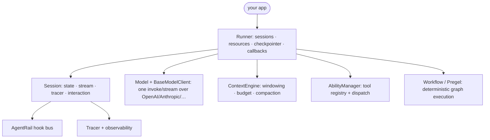

<sub>**Anchors:**<br>&bull; `agent-core/openjiuwen/core/session/agent.py:33` — `Session` (state, stream, tracer, interaction)<br>&bull; `agent-core/openjiuwen/core/runner/runner.py:696` — `Runner` facade class; `:408` `run_agent` binds session + lifecycle<br>&bull; `agent-core/openjiuwen/core/context_engine/context_engine.py:28` — `ContextEngine` (processors, token limits, compression)<br>&bull; `agent-core/openjiuwen/core/foundation/llm/model.py:27` — `Model`, unified LLM entry; `:94` `invoke`<br>&bull; `agent-core/openjiuwen/core/foundation/llm/model_clients/__init__.py:58` — `create_model_client` provider dispatch<br>&bull; `agent-core/openjiuwen/core/single_agent/ability_manager.py:142` — `AbilityManager` (tool registry + execution)<br>&bull; `agent-core/openjiuwen/core/single_agent/rail/base.py:824` — `AgentRail` base (lifecycle hooks)<br>&bull; `agent-core/openjiuwen/core/session/tracer/tracer.py:98` — `Tracer`; `agent-core/openjiuwen/extensions/observability/runtime.py:103` — `ObservabilityRuntime`</sub>

## 2. What's the difference between a graph-based framework like LangGraph and a role-based framework like CrewAI

**General:** Graph-based frameworks make control flow an explicit graph of nodes and edges over shared state; routing is deterministic, inspectable, and easy to persist. Role-based frameworks make the unit an agent with a role/persona and let agents collaborate through messages and a task board; control flow is emergent and driven by the model plus a manager. Graph = you author the topology; role = you author the team.

**Jiuwen:** It contains both archetypes as separate subsystems. The graph side is a genuine Pregel engine: `Workflow` compiles components into a `PregelGraph`, edges become channels, and `PregelLoop.run_step()` drives super-steps with static routers, conditional routers, barriers, and CNF OR-groups for exclusive merges. The role side is `TeamAgent`, a single class that switches between `TeamRole.LEADER` and `TEAMMATE`; leadership is expressed through tools (`create_team_tools`), an event-driven `CoordinationKernel`, and an optional `TeamScheduler` that dispatches tasks from a shared board. There is no declarative bridge that compiles a team into a Pregel graph.

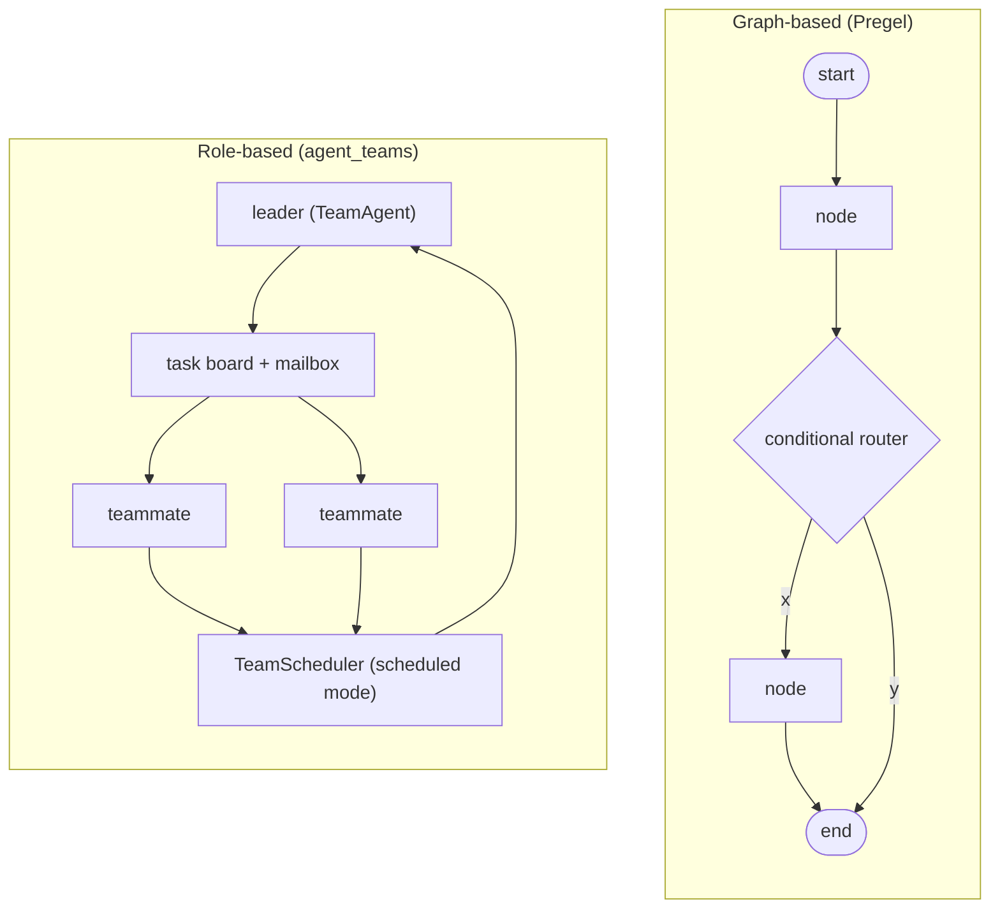

<sub>**Anchors:**<br>&bull; `agent-core/openjiuwen/core/workflow/workflow.py:98` — `Workflow` graph facade<br>&bull; `agent-core/openjiuwen/core/graph/pregel/engine.py:209` — `Pregel`; `:231` `run`; `:255` `while await loop.run_step()` driver<br>&bull; `agent-core/openjiuwen/core/graph/pregel/builder.py:13` — `PregelBuilder` (`add_node`/`add_edge`/`add_branch`)<br>&bull; `agent-core/openjiuwen/core/graph/pregel/router.py:11/26` — `StaticRouter` / `ConditionalRouter`<br>&bull; `agent-core/openjiuwen/core/workflow/_workflow.py:221` — `add_connection` (src/target edges)<br>&bull; `agent-core/openjiuwen/agent_teams/agent/team_agent.py:76` — `TeamAgent` one impl for leader/teammate<br>&bull; `agent-core/openjiuwen/agent_teams/schema/team.py:81` — `TeamRole`; `agent-core/openjiuwen/agent_teams/agent/scheduling/scheduler.py:92` — `TeamScheduler`; `agent-core/openjiuwen/agent_teams/agent/coordination/kernel.py:33` — `CoordinationKernel`<br>&bull; `agent-core/openjiuwen/agent_teams/runtime/manager.py:104` — `TeamRuntimeManager` pool/dispatch; `agent-core/openjiuwen/agent_teams/tools/tool_factory.py:97` — `create_team_tools`</sub>

## 3. When does a framework add unnecessary abstraction instead of solving a real problem

**General:** When the app is a single model call, when the framework's node/agent/state model forces you to reshape business logic to fit, or when the graph is actually a straight line. Warning signs: you fight the state schema, wrap everything in adapters, or need an escape hatch on the happy path. The abstraction pays for itself only when you actually need the loop, state, tools, and observability.

**Jiuwen:** The base layer is deliberately thin and elective. `ReActAgent.invoke` auto-creates a session when none is passed, so a minimal loop runs without `Runner`; the legacy `BaseAgent` still offers `add_tools` + `invoke`; `Workflow` is just a graph of `Executable`s with optional schema validation. Heavier behavior lives in `harness/` and is opt-in: `factory.create_deep_agent` adds default rails only when their config flag is on, and `DeepAgentConfig` defaults `enable_task_loop`, `enable_skill_discovery`, and `enable_subagent_runtime` to `False`.

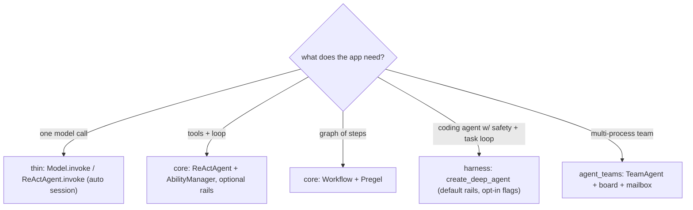

<sub>**Anchors:**<br>&bull; `agent-core/openjiuwen/core/single_agent/agents/react_agent.py:2492` — `invoke` auto-creates session when `session is None` (`:2523`)<br>&bull; `agent-core/openjiuwen/core/application/llm_agent/llm_agent.py:96` — `LLMAgent` thin controller-based agent; `agent-core/openjiuwen/core/application/workflow_agent/workflow_agent.py:11` — `WorkflowAgent`<br>&bull; `agent-core/openjiuwen/core/single_agent/legacy/agent.py:116` — legacy `BaseAgent`; `:222` `add_tools`<br>&bull; `agent-core/openjiuwen/harness/factory.py:394` — `default_rails`, each guarded by `should_add`<br>&bull; `agent-core/openjiuwen/harness/schema/deep_agent_spec.py:448/452/469` — `enable_task_loop`/`enable_security_rail`/`enable_skill_discovery` defaults<br>&bull; `agent-core/openjiuwen/harness/deep_agent.py:1873` — `add_rail` optional, queue-based<br>&bull; `agent-core/openjiuwen/core/workflow/workflow.py:328` — `Workflow.invoke` requires an explicit session</sub>

**Gap.** Config gating is inconsistent: `DeepAgentConfig` (`agent-core/openjiuwen/harness/schema/config.py:248`, `enable_task_loop=False`) and `DeepAgentSpec` (`agent-core/openjiuwen/harness/schema/deep_agent_spec.py:448`, `enable_task_loop=True`) disagree, so "default heaviness" depends on which constructor you use. `Workflow.invoke` is not self-sufficient — it requires a session, which is friction next to `ReActAgent.invoke`.

## 4. Would you build a custom orchestration layer instead of using an existing framework, and when

**General:** Build custom when the flow is genuinely unusual, latency-critical, or you need only a sliver of the machinery; use the framework when you need the standard loop + state + tools + observability. The better practice is to extend the framework rather than fork it — implement its node/executable interface, register tools, and subclass hooks.

**Jiuwen:** The framework is built for composition. A custom graph node implements the `Executable` protocol (`on_invoke`/`on_stream`/`on_collect`/`on_transform`) or subclasses `ComponentExecutable`/`WorkflowComponent`, then attaches via `add_workflow_comp` and is wired with `add_connection`/`add_conditional_connection`. A custom tool is a plain function wrapped by `@tool`/`LocalFunction`, not a subclass. A custom rail subclasses `AgentRail`; a custom model client subclasses `BaseModelClient` and auto-registers into the global `ClientRegistry`. `DeepAgent.add_rail`, `load_plugin*`, and config `rails=[...]` are the assembly seams; `Runner.run_agent` is the orchestration entry.

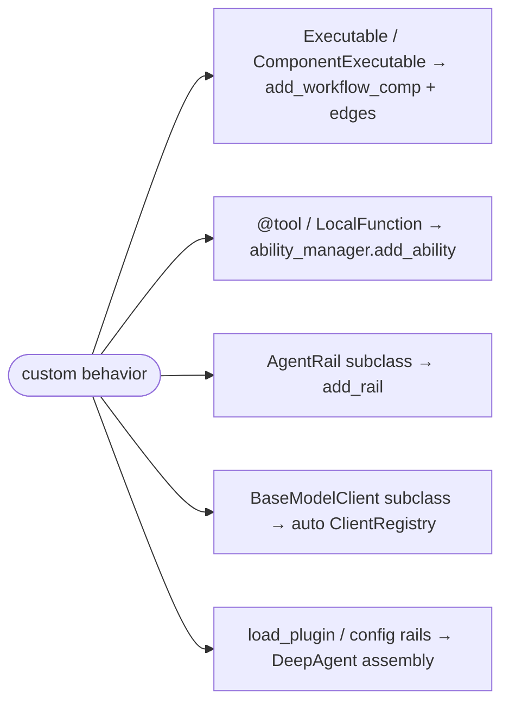

<sub>**Anchors:**<br>&bull; `agent-core/openjiuwen/core/graph/executable.py:13` — `Executable` protocol; `:14` `on_invoke`<br>&bull; `agent-core/openjiuwen/core/workflow/workflow.py:169` — `add_workflow_comp`; `:279` `add_connection`; `:311` `add_conditional_connection`<br>&bull; `agent-core/openjiuwen/core/workflow/components/component.py:77` — `ComponentExecutable`; `:272` `WorkflowComponent`<br>&bull; `agent-core/openjiuwen/core/foundation/tool/function/function.py:48` — `LocalFunction(card, func)`; `agent-core/openjiuwen/core/foundation/tool/tool.py:14` — `@tool` decorator<br>&bull; `agent-core/openjiuwen/core/single_agent/rail/base.py:824` — subclass `AgentRail`; `agent-core/openjiuwen/harness/deep_agent.py:1873` — `add_rail`<br>&bull; `agent-core/openjiuwen/core/foundation/llm/model_clients/base_model_client.py:53` — `__init_subclass__` auto-registration; `agent-core/openjiuwen/core/common/clients/client_registry.py:50/94` — `register_class`/`get_client`<br>&bull; `agent-core/openjiuwen/core/runner/runner.py:408` — `Runner.run_agent`; `agent-core/openjiuwen/harness/manifest/catalog.py:67` — `@harness_element`</sub>

**Gap.** Some seams are constrained: `DeepAgent.add_rail` only *queues* a rail (`_pending_rails`), effective only before the first `invoke`; rail callbacks silently no-op if their `AgentCallbackEvent` is not in the routing allow-set, so "customize vs fork" is not always symmetric.

---

# State and execution

## 5. How does a framework track state across multiple steps in an agent's execution

**General:** A state object (dict or dataclass) is threaded through the steps or held per session; each node reads and writes it. Conversation history is usually separate from working state. Frameworks persist state via checkpoints so a run can be resumed or audited.

**Jiuwen:** State lives in three layers that are checkpointed independently. The agent layer uses `StateCollection` (a `global_state` + `agent_state`) inside `AgentSession`. The workflow layer uses a different `StateCollection` split into `io_state`, `global_state`, `comp_state`, and `workflow_state`. Conversation history is a separate `ContextMessageBuffer` inside `SessionModelContext`, flushed to session global state by `ContextEngine.save_contexts`. Graph execution adds a third layer — `GraphState` (step, channel snapshot, pending buffer/nodes, node versions) persisted through a `Store`/checkpointer keyed by `(session_id, ns)` and restored in `PregelLoop.init`.

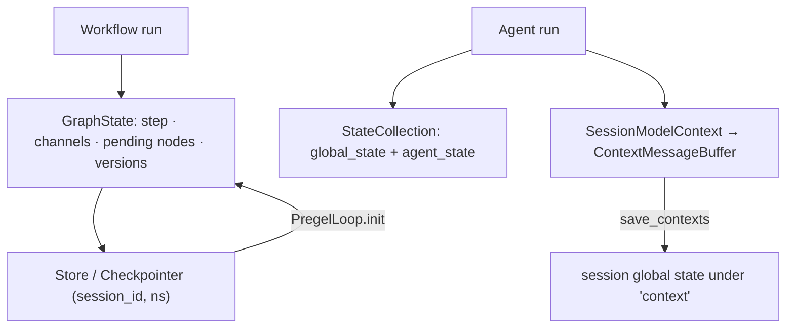

<sub>**Anchors:**<br>&bull; `agent-core/openjiuwen/core/session/internal/agent.py:36` — `AgentSession.__init__` creates `StateCollection`; `:74` `create_workflow_session` passes global state into `InMemoryState`<br>&bull; `agent-core/openjiuwen/core/session/state/agent_state.py:9` — agent `StateCollection`; `:34` `get_state`<br>&bull; `agent-core/openjiuwen/core/session/state/workflow_state.py:12` — workflow `StateCollection` (io/global/comp/workflow); `:100` `get_workflow_state`; `:151` `get_state`<br>&bull; `agent-core/openjiuwen/core/context_engine/context/context.py:64` — `SessionModelContext`; `:1519` `save_state()`; `:1526` `load_state`<br>&bull; `agent-core/openjiuwen/core/graph/store/base.py:31` — `GraphState` dataclass; `:41` `Store` ABC<br>&bull; `agent-core/openjiuwen/core/graph/pregel/engine.py:39` — `PregelLoop.init` reads saved state; `:44` restore path<br>&bull; `agent-core/openjiuwen/core/session/checkpointer/persistence.py:299` — `_get_state_to_save`; `:352` `WorkflowStorage.save`<br>&bull; `agent-core/openjiuwen/core/context_engine/context_engine.py:589` — `save_contexts`</sub>

**Gap.** Two different classes are both named `StateCollection` (agent vs workflow) with different shapes. Context messages are persisted only on explicit `save_contexts`/compression, not every step, so a crash between saves loses in-memory turns. `InMemoryState.set_state` silently ignores empty state, which can mask empty restores.

## 6. What's the difference between a linear chain and a graph with conditional branches

**General:** A linear chain is a fixed sequence where each step always activates the next. A graph adds branching and merging: a router selects successors based on state at runtime, and a join/barrier decides when a merge node is ready (all predecessors, or any of an exclusive group).

**Jiuwen:** Both are built on the same `PregelGraph`. `add_connection` registers a static edge; at compile time `PregelGraph._compile` turns static edges into `StaticRouter` (1→N) or `BarrierChannel` (N→1, with CNF OR-groups for mutually exclusive predecessors). `add_conditional_connection` registers a branch router compiled to `ConditionalRouter`, whose `dispatch` calls the user selector and emits `TriggerMessage`s only for the chosen targets. A linear chain always activates its single successor; a conditional graph activates only the selector's targets, and `BranchRouter` raises `COMPONENT_BRANCH_EXECUTION_ERROR` if none match.

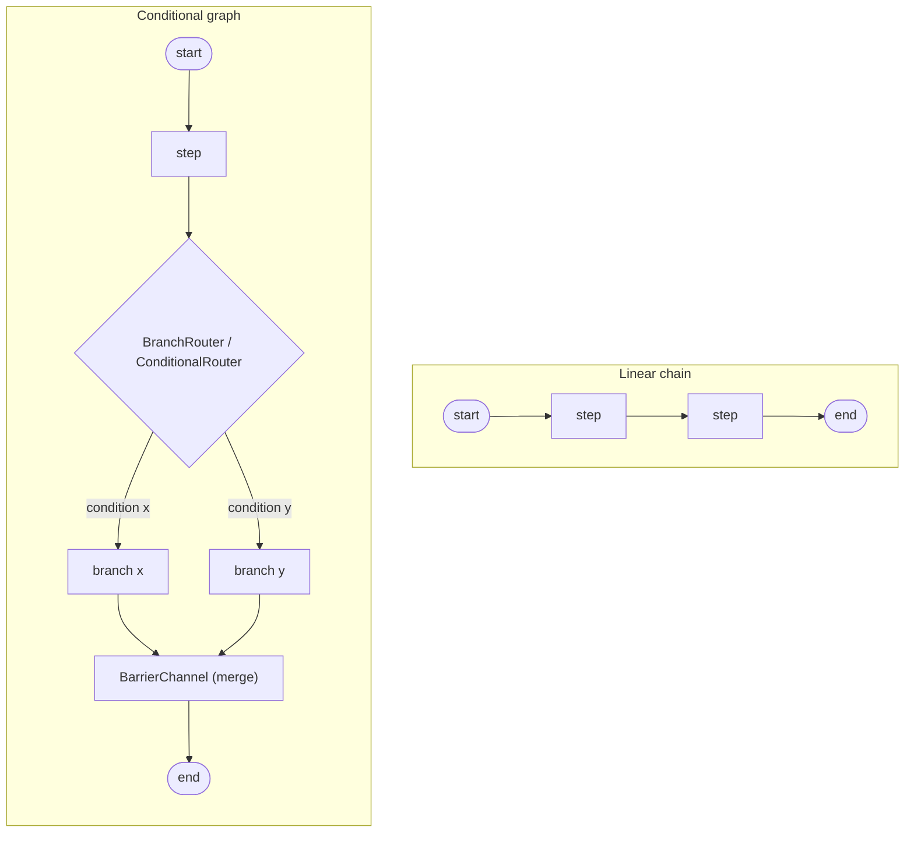

<sub>**Anchors:**<br>&bull; `agent-core/openjiuwen/core/workflow/workflow.py:279` — `add_connection` (static); `:311` — `add_conditional_connection`<br>&bull; `agent-core/openjiuwen/core/workflow/_workflow.py:221` — `BaseWorkflow.add_connection` → `self._graph.add_edge`; `:255` — `add_conditional_connection` wraps `BranchRouter` + `register_branch_targets`<br>&bull; `agent-core/openjiuwen/core/graph/graph.py:103` — `add_edge`; `:122` — `add_conditional_edges`; `:267` `_compile`; `:300` adds branches to the Pregel builder<br>&bull; `agent-core/openjiuwen/core/graph/pregel/builder.py:28` — `add_edge` (N→1 `BarrierChannel`, 1→N `StaticRouter`); `:67` `add_branch`<br>&bull; `agent-core/openjiuwen/core/graph/pregel/router.py:11` — `StaticRouter.dispatch`; `:26` `ConditionalRouter.dispatch`<br>&bull; `agent-core/openjiuwen/core/graph/pregel/channels.py:104` — `TriggerChannel`; `:129` `BarrierChannel`; `:166` `is_ready` (CNF OR-groups)<br>&bull; `agent-core/openjiuwen/core/workflow/components/flow/branch_router.py:92` — `BranchRouter.__call__`</sub>

**Gap.** `branch_targets` (used for CNF OR-group resolution) is only populated for `BranchRouter`; arbitrary callable routers go through a `new_router` wrapper and never register target sets, so exclusive-branch merging degrades to plain AND barriers. There is no static validation that a conditional router's targets are declared nodes, and `ConditionalRouter.dispatch` passes `state=None` to selectors, so selectors cannot read graph state directly.

## 7. How does the framework decide which node or agent runs next

**General:** In a graph framework, a scheduler activates every node whose input channels are ready, runs them (often concurrently), then routes their outputs to successors; the loop repeats until no node is active. In an agent framework, the model decides the next action by emitting tool calls. Frameworks that have both use each at its level.

**Jiuwen:** Workflow next-node selection is Pregel super-step scheduling: each step `ChannelManager.get_ready_nodes()` yields nodes whose trigger/barrier channels are satisfied, they are submitted to a `TaskExecutorPool`, their routers emit messages, messages are flushed into channels, and the loop repeats until the active set and buffer are empty. Agent-level dispatch is separate and LLM-driven: the ReAct loop calls the model, and if the assistant message carries `tool_calls` it hands them to `AbilityManager.execute`; if there are none it terminates with an answer. Team-level, `TeamScheduler` scans the task board and starts each idle member's earliest assigned pending task.

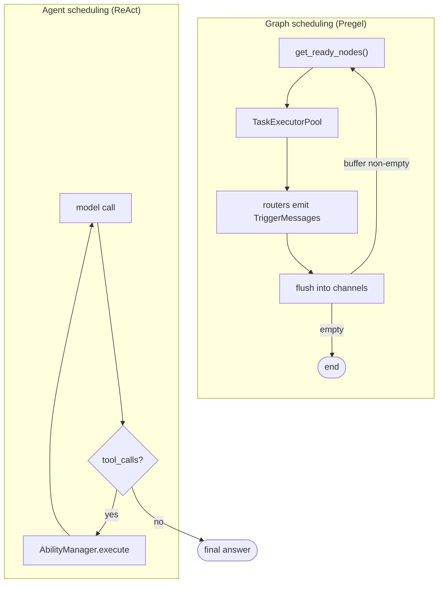

<sub>**Anchors:**<br>&bull; `agent-core/openjiuwen/core/graph/pregel/engine.py:122` — `ready_nodes = manager.get_ready_nodes()`; `:130` end condition; `:144-150` consume + `executor.submit`; `:255` `while await loop.run_step()`<br>&bull; `agent-core/openjiuwen/core/graph/pregel/channels.py:39` — `flush()` marks updated nodes ready; `:60` `get_ready_nodes`<br>&bull; `agent-core/openjiuwen/core/graph/pregel/task.py:27` — `submit` creates a `NodeTask`; `:47` `asyncio.wait(..., FIRST_EXCEPTION)`; `:158` node routers produce next targets<br>&bull; `agent-core/openjiuwen/core/single_agent/agents/react_agent.py:2740` — iteration loop; `:2793` no `tool_calls` → answer; `:2813` `_execute_tool_call`<br>&bull; `agent-core/openjiuwen/core/single_agent/ability_manager.py:1078` — `execute`; `:2113` ReAct delegates here<br>&bull; `agent-core/openjiuwen/agent_teams/agent/scheduling/scheduler.py:197` — `_scan`; `:208` `_reconcile_starts`</sub>

**Gap.** The ready set is a Python `set`, so when several nodes are simultaneously ready their execution/iteration order is nondeterministic (only the *set* of concurrent nodes is deterministic). `asyncio.wait(FIRST_EXCEPTION)` cancels sibling nodes on first failure, so "next" is partly failure-driven. `AbilityManager` decides nothing itself — tool choice is entirely model output. `TeamScheduler` is constructed only when `dispatch_mode == "scheduled"`.

## 8. How would you pause an agent mid-execution and resume it later with the same state

**General:** Pause requires either a durable checkpoint at a safe boundary or a first-class interrupt/suspend signal that unwinds the run while preserving state. Resume reloads the checkpoint (or replays the suspended step) and continues. The hard part is non-idempotent side effects: replay must be safe.

**Jiuwen:** Two mechanisms. *Interrupt rails* abort the current tool call by raising `AbortError(cause=ToolInterruptException(...))`; the callback framework re-raises the cause, the ReAct loop catches it, and `ToolInterruptHandler.commit_interrupt` saves conversation context plus a `ToolInterruptionState` into session state, returning an `INTERACTION` result. On resume, `handle_resume` replays the interrupted tool calls with the user's `InteractiveInput`. *Workflow/graph* pause uses checkpointing: `CompiledGraph._invoke` calls `checkpointer.pre_workflow_execute` (recover or require input) and `post_workflow_execute` (save on interrupt, clear on completion); `PregelLoop` snapshots channels/pending nodes on error and restores them in `init`; provider harnesses expose explicit `pause()`/`resume()` gated on `HarnessCapability.PAUSE_RESUME`.

```mermaid
sequenceDiagram
    participant Loop as ReAct loop
    participant Rail as Interrupt rail
    participant Store as Session state
    participant User
    Loop->>Rail: before_tool_call
    Rail-->>Loop: AbortError(cause=ToolInterruptException)
    Loop->>Store: commit_interrupt (context + ToolInterruptionState)
    Note over Loop: return INTERACTION (paused)
    User->>Loop: handle_resume(InteractiveInput)
    Loop->>Store: load preserved iteration + tools
    Loop->>Loop: replay interrupted tool calls, continue
```

<sub>**Anchors:**<br>&bull; `agent-core/openjiuwen/harness/rails/interrupt/interrupt_base.py:237` — `_raise_interrupt`; `:243` raises `AbortError(cause=ToolInterruptException)`; re-raised at `agent-core/openjiuwen/core/runner/callback/framework.py:1172`<br>&bull; `agent-core/openjiuwen/core/single_agent/interrupt/handler.py:279` — `commit_interrupt`; `:310` `handle_resume`; `:326` uses preserved `state.iteration`<br>&bull; `agent-core/openjiuwen/core/single_agent/interrupt/state.py:32` — `ToolInterruptionState`<br>&bull; `agent-core/openjiuwen/core/session/checkpointer/persistence.py:803` — `pre_workflow_execute`; `:824` recover on `InteractiveInput`; `:860` `post_workflow_execute`; `:876` save on `TASK_STATUS_INTERRUPT`<br>&bull; `agent-core/openjiuwen/core/graph/graph.py:315` — `CompiledGraph._invoke`; `:326` pre; `:334` `pregel.run`; `:346` post<br>&bull; `agent-core/openjiuwen/core/graph/pregel/engine.py:45` — `_is_resume`; `:174` `_save_state_on_error`; `:39` restore in `init`<br>&bull; `agent-core/openjiuwen/core/context_engine/context/context.py:1519/1526` — `save_state`/`load_state`<br>&bull; `agent-core/openjiuwen/harness/deep_agent.py:2491/2516` — `load_state`/`save_state`; `agent-core/openjiuwen/harness_providers/io_adapter.py:299/308` — `pause()`/`resume()`</sub>

**Gap.** Graph state is checkpointed only on error/interrupt, not after every successful super-step, so a hard crash mid-step loses that step. `CompiledGraph.interrupt()` is a no-op stub. The DeepAgent outer task loop explicitly does not support pause (`can_pause` returns `False`); only "resume continuation" re-entry exists. No in-flight asyncio task/stack is serialized — resume replays from channel/message snapshots and re-executes nodes, so non-idempotent side effects must be tolerated.

---

# Tool integration

## 9. How does a framework register and expose tools to the underlying model

**General:** You register a tool with a name, description, and parameter schema; the framework collects registered tools into the model request in the provider's tool format; the model returns tool calls that the framework dispatches. Auto-deriving the schema from a function signature is the convenience that makes this usable.

**Jiuwen:** Abilities are stored as metadata cards (`ToolCard`/`WorkflowCard`/`AgentCard`/`McpServerConfig`) in `AbilityManager`'s per-type dicts via `add()`; executable instances live separately in `Runner.resource_mgr`, bound by `add_ability()`. On each ReAct iteration, `list_tool_info()` flattens cards into `ToolInfo(name, description, parameters)`, and MCP servers are resolved lazily with an `mcp_<server>_` prefix. The list is placed on `ctx.inputs.tools` (after rails may filter it) and converted by the model client — OpenAI-style `_convert_tools_to_dict` emits `{"type":"function","function":{...}}`, Anthropic `_convert_tool_schemas` renames `parameters` → `input_schema`. Function/`@tool` backends auto-derive the schema via `CallableSchemaExtractor`.

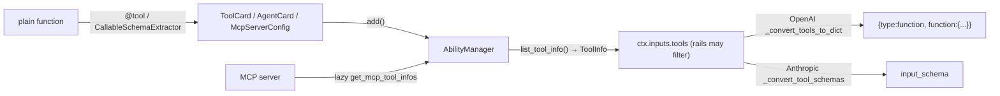

<sub>**Anchors:**<br>&bull; `agent-core/openjiuwen/core/single_agent/ability_manager.py:616` — `add()` registers any ability card; ToolCard branch stores at `:669`<br>&bull; `agent-core/openjiuwen/core/single_agent/ability_manager.py:772` — `add_ability()` card + concrete `Tool`<br>&bull; `agent-core/openjiuwen/core/single_agent/ability_manager.py:984` — `list_tool_info()` cards → `ToolInfo`<br>&bull; `agent-core/openjiuwen/core/single_agent/ability_manager.py:1047` — MCP path (`get_mcp_tool_infos`, `mcp_model_tool_name`); `:1067` lazy `ToolCard`<br>&bull; `agent-core/openjiuwen/core/foundation/tool/base.py:120` — `ToolCard.tool_info()`<br>&bull; `agent-core/openjiuwen/core/foundation/tool/utils/callable_schema_extractor.py:20` — `generate_schema()` from a callable signature<br>&bull; `agent-core/openjiuwen/core/foundation/llm/model_clients/base_model_client.py:483` — `_convert_tools_to_dict()`; attached at `:576`<br>&bull; `agent-core/openjiuwen/core/foundation/llm/model_clients/anthropic_model_client.py:494` — `_convert_tool_schemas()` → `input_schema`<br>&bull; `agent-core/openjiuwen/core/single_agent/agents/react_agent.py:2683` — per-invoke `list_tool_info()`; set at `:1538`<br>&bull; `agent-core/openjiuwen/harness/factory.py:443` — registers tool instances (`add_ability`); `:453` pure cards (`add`)</sub>

**Gap.** Exposure policy (`ToolExposure`) is registration-time only; `_apply_tool_exposure_policy` does not rewrite already-registered cards. `list_tool_info()` silently drops MCP `ToolInfo` when a server name collides. `ToolInfo.parameters` may be a `dict` or a `BaseModel`; only OpenAI's converter handles both.

## 10. How do you handle a tool that a framework doesn't natively support

**General:** The framework should let you wrap an arbitrary function as a tool, define a custom tool class for custom transport/auth, or connect an external tool server through a protocol such as MCP. If none of those is possible, that is a real limitation.

**Jiuwen:** The primary path is the `@tool` decorator, which wraps any plain function into a `LocalFunction` (a `Tool` subclass) with an auto-extracted or explicit `input_params`, then registers it via `ability_manager.add_ability(card, resource)`. The decorator builds a fresh `ToolCard` (`_create_new_tool_card`) or derives one from a prebuilt card (`_handle_prebuilt_card`), so callers can override `name`/`description`/`input_params`/`stateless`. Unsupported tools can also be declared as a `ToolCard` plus a concrete `Tool` subclass, or exposed through MCP: a `McpServerConfig` is added to the ability manager, and the runner materializes each discovered `McpToolCard` into an `MCPTool`. `build_tool_card` is the harness-standard card factory.

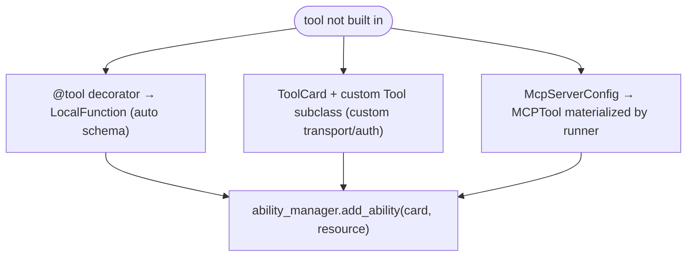

<sub>**Anchors:**<br>&bull; `agent-core/openjiuwen/core/foundation/tool/tool.py:31` — `tool()` universal decorator; `:95/115` returns decorated `LocalFunction`<br>&bull; `agent-core/openjiuwen/core/foundation/tool/tool.py:120` — `_handle_prebuilt_card()`; `:160` `_create_new_tool_card()`<br>&bull; `agent-core/openjiuwen/core/foundation/tool/function/function.py:48` — `LocalFunction.__init__`; `:76` `invoke`<br>&bull; `agent-core/openjiuwen/core/foundation/tool/__init__.py:19` — `tool`; `:29` `LocalFunction`<br>&bull; `agent-core/openjiuwen/core/foundation/tool/mcp/base.py:137` — `McpServerConfig`; `:178` `MCPTool`; `:198` `invoke`<br>&bull; `agent-core/openjiuwen/core/runner/resources_manager/tool_manager.py:281` — discovered MCP cards materialized into `MCPTool`<br>&bull; `agent-core/openjiuwen/extensions/context_evolver/tool/wikipedia_tool.py:86` — minimal `ToolCard` + `LocalFunction` example<br>&bull; `agent-core/openjiuwen/harness/prompts/tools/__init__.py:250` — `build_tool_card()`</sub>

**Gap.** `@tool` exposes no `idempotent`/`parallel_safe`/`properties` arguments, so a decorator-created tool cannot directly declare retry/timeout policy — pass a prebuilt `card=` or mutate `card` afterward. `LocalFunction` accepts only a `func` (and optional `render`); tools needing custom transport/auth must subclass `Tool` or use `RestfulApi`/`MCPTool`. `AbilityManager._execute_single_tool_call` treats a bare `McpServerConfig` name as unimplemented, so MCP must be registered/materialized before execution.

## 11. How does the framework validate a tool call's structured output before executing it

**General:** Parse the model's arguments against the tool's JSON Schema; repair obviously damaged JSON (unbalanced brackets) when possible; reject with a readable error so the model can retry. Never run a function on unvalidated arguments.

**Jiuwen:** Before executing, `AbilityManager._execute_single_tool_call` parses the model's raw argument string with `_parse_tool_arguments_with_repair`, which first tries `json.loads`, then `_repair_tool_arguments_json` to balance brackets/braces; unrecoverable JSON raises an `AbilityExecutionError` fed back to the model. The parsed dict is passed to `tool.invoke`, where `LocalFunction`/`MCPTool` call `SchemaUtils.format_with_schema`, which runs `validate_with_schema` (jsonschema, falling back to a dynamically created Pydantic model) and then fills defaults. The `structured_output` tool uses the caller's JSON Schema as its own `input_params`, so the same validation path constrains captured results.

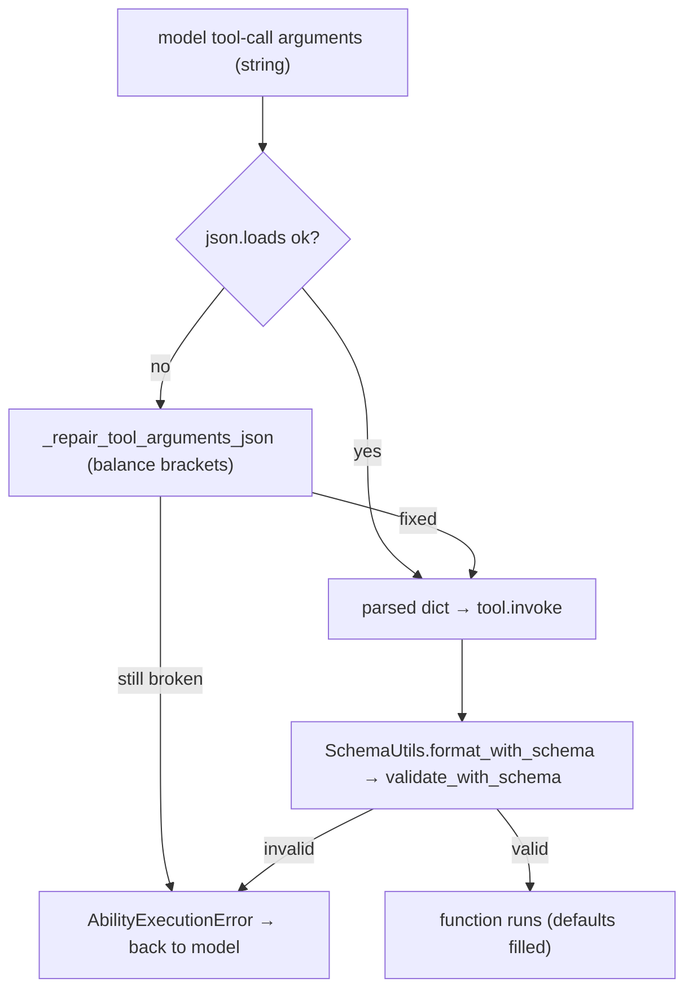

<sub>**Anchors:**<br>&bull; `agent-core/openjiuwen/core/single_agent/ability_manager.py:482` — `_repair_tool_arguments_json()`; `:537` `_parse_tool_arguments_with_repair()`; `:1419` execution path rewrites `tool_call.arguments`<br>&bull; `agent-core/openjiuwen/core/foundation/tool/function/function.py:76` — `LocalFunction.invoke`; `:82` validation via `SchemaUtils.format_with_schema`<br>&bull; `agent-core/openjiuwen/core/common/utils/schema_utils.py:115` — `validate_with_schema()` (jsonschema → Pydantic fallback); `:23` `format_with_schema()`; `:49` calls validate then fills defaults<br>&bull; `agent-core/openjiuwen/core/foundation/tool/mcp/base.py:208` — `MCPTool.invoke` validates MCP args via the same path<br>&bull; `agent-core/openjiuwen/agent_teams/tools/structured_output_tool.py:82` — `input_params = schema_json`; `:86` `invoke`<br>&bull; `agent-core/openjiuwen/core/foundation/tool/base.py:90` — `ToolCard.input_params` is the schema source</sub>

**Gap.** Validation is skipped when `input_params` is falsy. The JSON repair only balances brackets/quotes — it does not fix unquoted barewords or trailing commas, which raise and round-trip an error to the model. Schema validation lives inside the tool (`LocalFunction`/`MCPTool`), so a raw `Tool` subclass that does not call `SchemaUtils` gets no automatic argument validation.

## 12. How would you add a custom retry policy for a specific tool without breaking the framework's default behavior

**General:** Retry policy should be per-tool and overridable: an idempotency flag, max attempts, backoff, and timeout. A single global retry that ignores non-idempotency is dangerous, but so is a per-tool override that silently disables the framework's safety defaults.

**Jiuwen:** Retry decisions are centralized in `ToolCallResilienceRail` (priority 70, auto-mounted unless `enable_tool_resilience_rail=False`). It hooks `before_tool_call` to reset a per-invoke counter and `on_tool_exception`, where it applies layers: non-idempotent tools (`ToolCard.idempotent is False`, the default) are never retried; retryable exception types/markers (timeouts, connection resets, MCP transport) are; otherwise it calls `ctx.request_retry()`, consumed by the `@rail` decorator wrapping the tool execution. The per-invoke timeout is read separately from `ToolCard.properties["resilience"]["timeout_s"]` by `AbilityManager._resolve_call_timeout`. Customization without breaking defaults is done by setting `idempotent=True`/`properties={"resilience": {...}}` on the card, or by supplying your own rail (the auto-mount checks `_already_provided`).

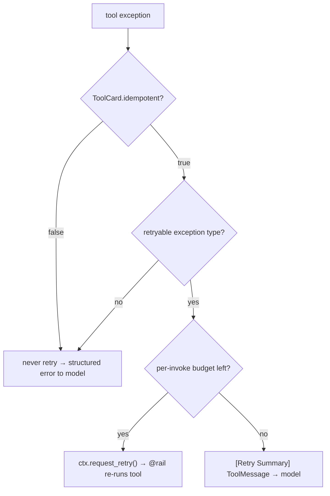

<sub>**Anchors:**<br>&bull; `agent-core/openjiuwen/harness/rails/tool_call_resilience_rail.py:24` — `ToolCallResilienceRail`; `:102` counter reset; `:106` `on_tool_exception`; `:145` budget check; `:196` retry request<br>&bull; `agent-core/openjiuwen/harness/rails/tool_call_resilience_rail.py:223` — `_is_non_idempotent()`; `:244` `_resolve_max_attempts()`<br>&bull; `agent-core/openjiuwen/core/foundation/tool/base.py:109` — `ToolCard.idempotent` (default `False`); `:90/92` `properties`/`parallel_safe`<br>&bull; `agent-core/openjiuwen/core/single_agent/ability_manager.py:571` — `_resolve_call_timeout()` reads `properties["resilience"]["timeout_s"]`; `:137` hard limit<br>&bull; `agent-core/openjiuwen/harness/schema/config.py:294` — `enable_tool_resilience_rail: bool = True`; `agent-core/openjiuwen/harness/schema/deep_agent_spec.py:453` mirror<br>&bull; `agent-core/openjiuwen/harness/factory.py:408` — auto-mount; `:411` `_already_provided` guard<br>&bull; `agent-core/openjiuwen/harness/tools/subagent/subagent_tools.py:45` — `_attach_call_timeout()` sets `properties["resilience"]["timeout_s"]`<br>&bull; `agent-core/openjiuwen/core/single_agent/rail/base.py:612` — `ctx.request_retry()`; `agent-core/openjiuwen/harness/prompts/tools/__init__.py:284` — `build_tool_card` honors `ToolCardBuildOptions(idempotent=…)`</sub>

**Gap.** **Per-tool retry budget is not actually implemented**: `_resolve_max_attempts` ignores `properties["resilience"]["max_attempts"]`; only the rail-wide `max_attempts` (default 3) applies. There is no per-tool backoff (`request_retry()` supports `delay_seconds`, but the rail always passes 0). The rail is not exported from `rails/__init__.py`, and "opt out" is only the boolean `idempotent`, so you cannot express "retry twice for tool A, never for B" without replacing the rail globally.

---

# Multi-agent orchestration

## 13. How does a framework handle communication between multiple agents

**General:** Either a shared blackboard (task board/state) plus a message bus, or direct message passing. Messages should be persistent and ordered for auditability, with routing (direct, broadcast, mentions). Direct handoffs must carry enough context and be bounded.

**Jiuwen:** The `agent_teams` stack uses a persisted mailbox plus an event bus. `TeamMessageManager.send_message()` writes a `TeamMessage` row through `MessageDao` and then publishes a `MessageEvent`/`BroadcastEvent` on the team's messager topic; recipients are woken by coordination handlers, which poll their unread mailbox (`MessageHandler._process_unread_messages`) and feed rendered `<team-inbound>` text into the harness via `deliver_input`. External input enters through `interaction/router.py` (`parse_interact_str` → `resolve_targets`, strict `@member` routing) and `TeamRuntimeManager._dispatch_payload`. The lower-level `core/multi_agent` stack has a separate `TeamRuntime`/`MessageBus` with `send` (P2P, waits for response) and `publish` (pub/sub). Subagents are a third, synchronous channel: `TaskTool` builds a child session and returns the terminal output directly.

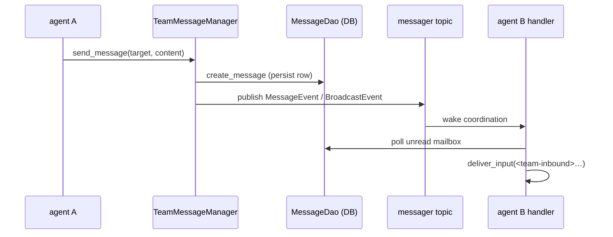

<sub>**Anchors:**<br>&bull; `agent-core/openjiuwen/agent_teams/tools/message_manager.py:27` — `TeamMessageManager`; `:60` `send_message()` persist-then-publish<br>&bull; `agent-core/openjiuwen/agent_teams/tools/database/message_dao.py:153` — `MessageDao.create_message()`<br>&bull; `agent-core/openjiuwen/agent_teams/agent/coordination/handlers/message.py:181` — `_process_unread_messages()` → `deliver_input`<br>&bull; `agent-core/openjiuwen/agent_teams/interaction/router.py:273` — `resolve_targets()` `@member` routing<br>&bull; `agent-core/openjiuwen/agent_teams/runtime/manager.py:573` — `_dispatch_payload()`<br>&bull; `agent-core/openjiuwen/core/multi_agent/team_runtime/communicable_agent.py:105` — `send()` (P2P); `:131` `publish()`<br>&bull; `agent-core/openjiuwen/core/multi_agent/teams/handoff/handoff_tool.py:17` — `HandoffTool`<br>&bull; `agent-core/openjiuwen/harness/tools/subagent/task_tool.py:154` — `TaskTool` (synchronous child session, not a mailbox peer)</sub>

**Gap.** Two disjoint communication stacks (`core/multi_agent` TeamRuntime/MessageBus and `agent_teams` DB mailbox/messager) share no bridge. Delivery is pull-based (poll/drain + event wakeup), so a busy member's messages are deferred or steered, never pushed mid-token. Broadcast read state is a per-member watermark with multiple special-case paths. Subagent `TaskTool` calls do not touch the mailbox and are invisible to other agents.

## 14. What's the difference between a supervisor pattern and a peer-to-peer pattern in these frameworks

**General:** A supervisor is one controller that plans and dispatches to workers (often workers-as-tools); control is top-down and data returns synchronously up the call stack. Peer-to-peer has agents share a board/bus and claim/communicate directly; control is distributed, needs arbitration (atomic claims, one-active-task invariants), but scales autonomy.

**Jiuwen:** Supervisor teams are built on `core/multi_agent`'s `HierarchicalTeam`, in two implementations: **Agents-as-Tools** (`hierarchical_tools`) registers each child `AgentCard` into the parent's `ability_manager`, so the LLM invokes a child like any tool; **MessageBus** (`hierarchical_msgbus`) uses `SupervisorAgent` (a `ReActAgent` + `CommunicableAgent`) whose `P2PAbilityManager` intercepts AgentCard tool calls and routes them in parallel. Peer-to-peer is the `agent_teams` leader/teammate design: `TeamAgent` is one class for both roles, all members share a persistent DB task board and mailbox, and work is claimed via a single CAS (`claim_task`) with an optional `TeamScheduler` acting only as a leader-side dispatcher in `scheduled` mode.

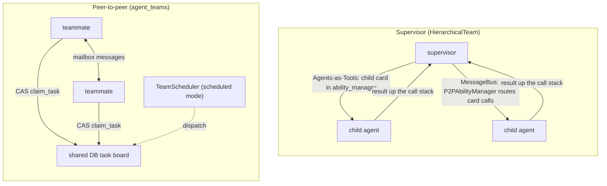

<sub>**Anchors:**<br>&bull; `agent-core/openjiuwen/core/multi_agent/teams/hierarchical_tools/hierarchical_team.py:101` — `_setup_hierarchy()`; `:108` `parent_agent.ability_manager.add(child_card)`<br>&bull; `agent-core/openjiuwen/core/multi_agent/teams/hierarchical_msgbus/supervisor_agent.py:20` — `SupervisorAgent`<br>&bull; `agent-core/openjiuwen/core/multi_agent/teams/hierarchical_msgbus/p2p_ability_manager.py:52` — `execute()` partitions AgentCard calls; `:199` parallel P2P dispatch<br>&bull; `agent-core/openjiuwen/core/multi_agent/teams/hierarchical_msgbus/hierarchical_team.py:87` — team `invoke()` → supervisor<br>&bull; `agent-core/openjiuwen/agent_teams/tools/database/task_dao.py:634` — `claim_task()` single-CAS self-claim<br>&bull; `agent-core/openjiuwen/agent_teams/tools/task_manager.py:1581` — one-active-task invariant<br>&bull; `agent-core/openjiuwen/agent_teams/agent/scheduling/scheduler.py:208` — `_reconcile_starts()` leader mailbox dispatch</sub>

**Gap.** There is no single API that switches between the two families. Both `hierarchical_*` teams are supervisor-shaped; the only sequential-ish `core/multi_agent` team is `HandoffTeam`, still orchestrator-controlled. `HierarchicalTeam` supervisors have no task board or autonomous claim and do not persist intermediate work; the peer model has no hierarchical parent-child tool relationship. `P2PAbilityManager` only supports `parallel_tool_calls=True` and raises otherwise.

## 15. How do you debug a failure when it's unclear which agent in the chain caused it

**General:** You need per-agent attribution: a trace/span tree where every agent, model call, and tool call is a span carrying agent identity, plus durable conversation and task history to reconstruct ordering. Root-cause is then manual or LLM-assisted, not automatic.

**Jiuwen:** The framework emits an OpenTelemetry span tree attributing each LLM/tool/agent action to a member: `AgentObservabilityRail` opens `agent.{member}.task_iteration.N` / `agent.{member}.invoke` spans, and `TeamObservabilityRail` stamps `agentteam.agent_id`, `member_name`, `role`, `team_id`, and `gen_ai.conversation.id` via an `AgentSpanDecoration`. `OtelTeamMonitorHandler` adds `task.{id}` and `member.*`/`msg.*` event spans under the team span, so task-state and message-routing timelines are visible. Dispatched subagents get their own span (`harness/observability/subagent.py`), and each span carries an `ExecutionSubject` for trajectory-lane attribution. On the product side, TraceHound replays session history and groups records per agent with token/cost attribution; the task board and per-member message history remain ground truth when spans are absent.

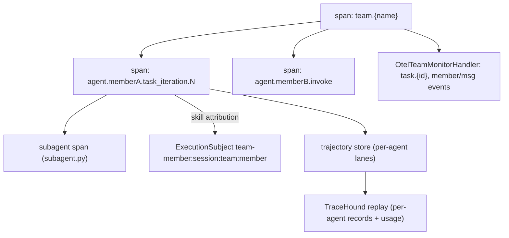

<sub>**Anchors:**<br>&bull; `agent-core/openjiuwen/agent_teams/observability/rail.py:56` — `TeamObservabilityRail`; `:136` `_build_decoration()` sets agent_id/member_name/role/team/session<br>&bull; `agent-core/openjiuwen/harness/observability/rail.py:355` — `AgentObservabilityRail`; `:623` `before_invoke()`<br>&bull; `agent-core/openjiuwen/harness/observability/subagent.py:60` — `install_subagent_observability_hook()`<br>&bull; `agent-core/openjiuwen/agent_teams/observability/monitor_handler.py:370` — `_open_task_span()`<br>&bull; `agent-core/openjiuwen/agent_teams/agent/team_agent.py:734` — `observability_execution_subject()`<br>&bull; `agent-core/openjiuwen/agent_evolving/trajectory/store.py:23` — `TrajectoryStore` protocol; `:135` `FileTrajectoryStore`<br>&bull; `jiuwenswarm/jiuwenswarm/server/agent_ws_server.py:12840` — `_replay_agent_of()`<br>&bull; `jiuwenswarm/jiuwenswarm/server/runtime/session/session_history.py:863` — `_is_member_relevant()`</sub>

**Gap.** There is no automated causal/root-cause analysis — spans provide attribution, and TraceHound's `tracehound.analyze` is an LLM overlay, not deterministic blame. Leader events carry no `member_name`, so leader-vs-single-agent attribution relies on role heuristics. Subagents are excluded from team identity and inherit attribution only by span nesting. Trajectory capture is opt-in, and logs carry no trace/span id by default.

## 16. How does the framework handle one agent's output becoming another agent's input

**General:** Either a call returns the value (subagent/tool), or a handoff transfers control and context, or a shared board/bus carries the artifact. The framework must define how results and context propagate, and whether propagation is automatic or requires the consumer to re-read.

**Jiuwen:** Four paths. **Subagent delegation:** `TaskTool` builds isolated child inputs (`_build_subagent_inputs`), runs the subagent, wraps the terminal `output` into a `ToolOutput` (`_build_task_output`), and `render_for_llm` returns the answer as the tool result the parent reads. **Handoff:** `HandoffTool` emits a `HandoffSignal`; `ContainerAgent` appends `{"agent": ..., "output": result}` to a history, forwards `signal.message or inputs.input_message` as the next input, and seeds the next session from team history. **Mailbox flow (peer):** `send_message` persists a row; the recipient renders `<team-inbound>` and calls `deliver_input`. **Shared task board:** completion/dependency events wake assignees, but the work product is re-read via `view_task` rather than auto-injected. Swarmflow's `pipeline()` passes each stage's return value as the next stage's `prev`.

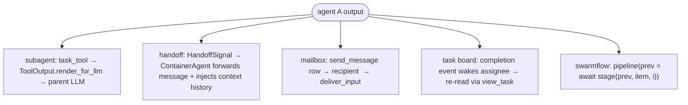

<sub>**Anchors:**<br>&bull; `agent-core/openjiuwen/harness/tools/subagent/task_tool.py:657` — `_build_subagent_inputs()`; `:726` `_build_task_output()`; `:1005` `render_for_llm()`<br>&bull; `agent-core/openjiuwen/core/multi_agent/teams/handoff/handoff_signal.py:47` — `extract_handoff_signal()`<br>&bull; `agent-core/openjiuwen/core/multi_agent/teams/handoff/container_agent.py:56` — `_build_agent_input()`; `:112` `_inject_context_history()`; `:249` `coordinator.complete(result)`<br>&bull; `agent-core/openjiuwen/agent_teams/agent/scheduling/scheduler.py:208` — scheduled handoff as a rendered leader message<br>&bull; `agent-core/openjiuwen/agent_teams/tools/database/task_dao.py:634` — peer task handoff via CAS claim<br>&bull; `agent-core/openjiuwen/agent_teams/workflow/engine/primitives.py:1495` — `pipeline()` passes `prev` between stages</sub>

**Gap.** Peer teammates do not automatically receive a producer's output — completion unblocks and wakes them, but the result text must be re-read from the task/message store. Subagent return values are collapsed to text plus a fixed envelope; structured outputs are not generically propagated between agents. Handoff context transfer relies on private session keys and a crude message-key dedupe. Swarmflow's dataflow is ordinary Python with no durable edge model and is invisible to the team mailbox/task board.

---

# Reliability and control

## 17. How do you set a hard limit on iterations or steps within a framework

**General:** Cap the loop with a max-iteration/max-round counter, plus optional token and wall-clock budgets, and *enforce* them rather than only reporting. Nested loops need a cap at each level, and the caps should be configurable.

**Jiuwen:** The inner ReAct loop is bounded by `ReActAgentConfig.max_iterations` (default 5) and exits with `{"result_type": "error", "output": "Max iterations reached without completion"}`. When `enable_task_loop=True`, DeepAgent raises the inner ReAct ceiling to `sys.maxsize` and moves the real bound to the outer task loop, where `LoopCoordinator.should_continue()` OR-evaluates a chain of `StopConditionEvaluator`s (`MaxRounds`/`TokenBudget`/`Timeout`/`NoProgressAnswer`/`CompletionPromise`) built by `TaskCompletionRail.build_evaluators()`. Independently, `_run_task_loop` hard-codes `max_outer_rounds = 50` and force-stops with `stop_reason: "MaxOuterRounds"`. Team members reuse the wiring via `TaskCompletionRail(max_rounds=...)`, and cooperative stops exist via `ctx.request_force_finish()` and `DeepAgent.abort()`.

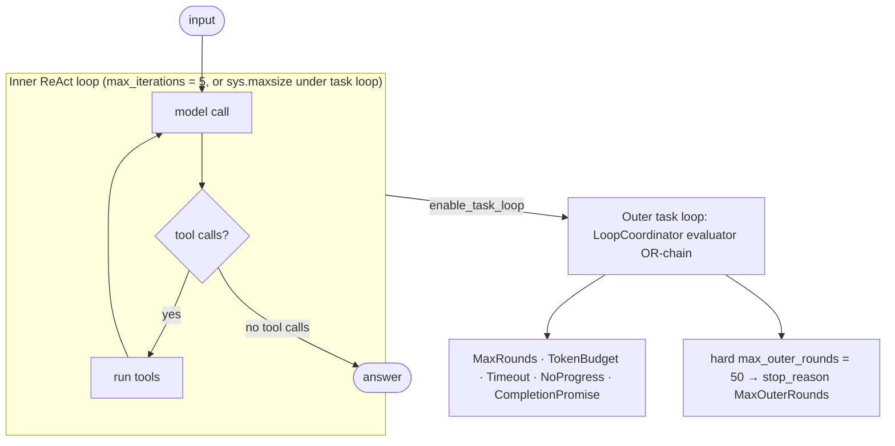

<sub>**Anchors:**<br>&bull; `agent-core/openjiuwen/core/single_agent/agents/react_agent.py:288` — `max_iterations: int = Field(default=5)`; `:2740` the bounded loop; `:2852` exhaustion result<br>&bull; `agent-core/openjiuwen/harness/schema/stop_condition.py:124` — `MaxRoundsEvaluator.should_stop`; `:143` TokenBudget; `:162` Timeout<br>&bull; `agent-core/openjiuwen/harness/task_loop/loop_coordinator.py:139` — `should_continue()` OR-chain; `:110` `increment_iteration`; `:133` `request_abort`<br>&bull; `agent-core/openjiuwen/harness/rails/task_completion_rail.py:168` — `build_evaluators()`; `:178-185` build MaxRounds/Timeout/TokenBudget<br>&bull; `agent-core/openjiuwen/harness/deep_agent.py:2723` — `max_outer_rounds = 50`; `:2725` `while coordinator.should_continue()`; `:2727-2739` force-stop; `:1116` inner cap swap; `:2338` `_build_task_loop_evaluators`; `:3380` `abort()`<br>&bull; `agent-core/openjiuwen/agent_teams/agent/agent_configurator.py:436` — member `TaskCompletionRail(max_rounds=agent_spec.max_iterations)`<br>&bull; `agent-core/openjiuwen/agent_teams/workflow/backends/budget_rail.py:88` — token-ceiling `ctx.request_force_finish`; `agent-core/openjiuwen/agent_teams/agent/scheduling/scheduler.py:300` — review-round cap</sub>

**Gap.** The 50-round ceiling is a literal local, not configurable. `TaskCompletionRail`'s `max_rounds`/`timeout_seconds`/`max_tokens` all default to `None`, so with the default auto-injected rail the LoopCoordinator chain is empty and only the 50-round literal and abort bound the outer loop. `NoProgressAnswerEvaluator` is gated by a default-`False` flag. Agent-teams review-round caps and swarmflow budget caps apply only in `scheduled` mode / when a budget is configured.

## 18. How does the framework handle a step that times out or throws an error

**General:** Bound each step with a timeout; classify errors (retryable vs not); convert failures into data (a tool/observation result) so the loop can adapt; propagate fatal errors with cleanup. Distinguish control-flow exceptions (cancellation, interrupt) from real failures.

**Jiuwen:** Tool calls are wrapped in `anyio.fail_after(call_timeout)`, where the timeout resolves from `ToolCard.properties["resilience"]["timeout_s"]` (or a default), and an exempt tool is still bounded by a hard limit. A `TimeoutError` becomes an `AbilityExecutionError` carrying a pre-built `ToolMessage`; `asyncio.CancelledError` and `ToolInterruptException` are re-raised as control flow. `ToolCallResilienceRail.on_tool_exception` decides retryability in layers and calls `ctx.request_retry()`, which the `@rail` decorator consumes to re-run the tool; on budget exhaustion it fabricates a `[Retry Summary]` `ToolMessage` so the model sees the failure as a result. Model-call failures route to `ON_MODEL_EXCEPTION` rails (`ModelAnomalyDetectionRail` retries repeated/stream-timeout errors with backoff; `_call_model` has a one-shot recovery hook). Workflow failures wrap timeout as `WORKFLOW_EXECUTION_TIMEOUT`.

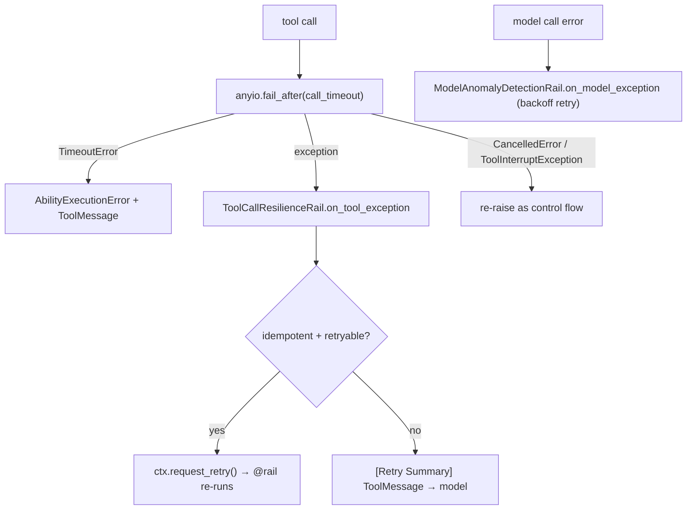

<sub>**Anchors:**<br>&bull; `agent-core/openjiuwen/core/single_agent/ability_manager.py:1455` — `with anyio.fail_after(call_timeout)`; `:1457-1463` `TimeoutError` → `_build_execution_error`; `:556` `_build_execution_error`; `:1186-1238` parallel-batch handling; `:1492` workflow error wrapping<br>&bull; `agent-core/openjiuwen/harness/rails/tool_call_resilience_rail.py:106` — `on_tool_exception`; `:128-138` non-idempotent layer; `:145` budget; `:169-186` retry-summary; `:196` `request_retry`; `:198` `_is_retryable_exception`<br>&bull; `agent-core/openjiuwen/core/single_agent/rail/base.py:1016` — `@rail` retry loop; `:1036` catch; `:1049` fire `on_exception`; `:1065` consume retry; `:633` `request_force_finish`<br>&bull; `agent-core/openjiuwen/harness/rails/model_anomaly_detection_rail.py:236` — `on_model_exception`; `:336` `ctx.request_retry(delay_seconds=...)`<br>&bull; `agent-core/openjiuwen/core/single_agent/agents/react_agent.py:1016` — model exception + one recovery attempt; `:2857/2868` persist safe prefix then re-raise<br>&bull; `agent-core/openjiuwen/harness/schema/stop_condition.py:162` — `TimeoutEvaluator`; `agent-core/openjiuwen/harness/deep_agent.py:2712` — `completion_timeout` (600s)<br>&bull; `agent-core/openjiuwen/core/workflow/workflow.py:671` — `WORKFLOW_EXECUTION_TIMEOUT`; `agent-core/openjiuwen/harness/rails/interrupt/interrupt_base.py:243` — interrupt as `AbortError`</sub>

**Gap.** `_resolve_max_attempts` ignores per-tool overrides and always returns the rail default. `ToolCallResilienceRail` is not exported from `rails/__init__.py` and only acts if registered. `TimeoutEvaluator` exists only when a non-`None` `timeout_seconds` is passed. Workflow `ExceptionConfig` is threaded through constructors but has no in-tree consumer implementing component error recovery. `ModelAnomalyDetectionRail` covers repetition and stream-timeout only.

## 19. How would you add human-in-the-loop approval before a specific step executes

**General:** Route sensitive steps through a permission check that returns allow/ask/deny, pause on ask, surface a confirm payload, resume with the decision, and optionally remember or persist allow rules. Fail closed: unknown should mean "ask", not "allow".

**Jiuwen:** Tool execution passes through `PermissionInterruptRail` (subclass of `ConfirmInterruptRail` ← `BaseInterruptRail`), which overrides `before_tool_call` and intercepts **every** tool. On first entry it calls `PermissionEngine.check_permission`, which merges the tiered tool policy, file guard, and net guard with "strictest wins" and returns `ALLOW`/`ASK`/`DENY`. `ALLOW` approves; `DENY` returns a synthetic `[PERMISSION_DENIED]` tool result; `ASK` either hits a session auto-confirm key, delegates to a hosted confirmation callback, or raises `AbortError(cause=ToolInterruptException(ConfirmPayload.to_schema()))` to pause. Resume parses a `ConfirmPayload` (`approved`, `feedback`, `auto_confirm`, `persist_allow`); the rail can remember session-scoped or persist an allow rule. Plan-mode exit uses a separate `PlanApprovalRail`, and `AskUserRail` reuses the same mechanism for `ask_user`.

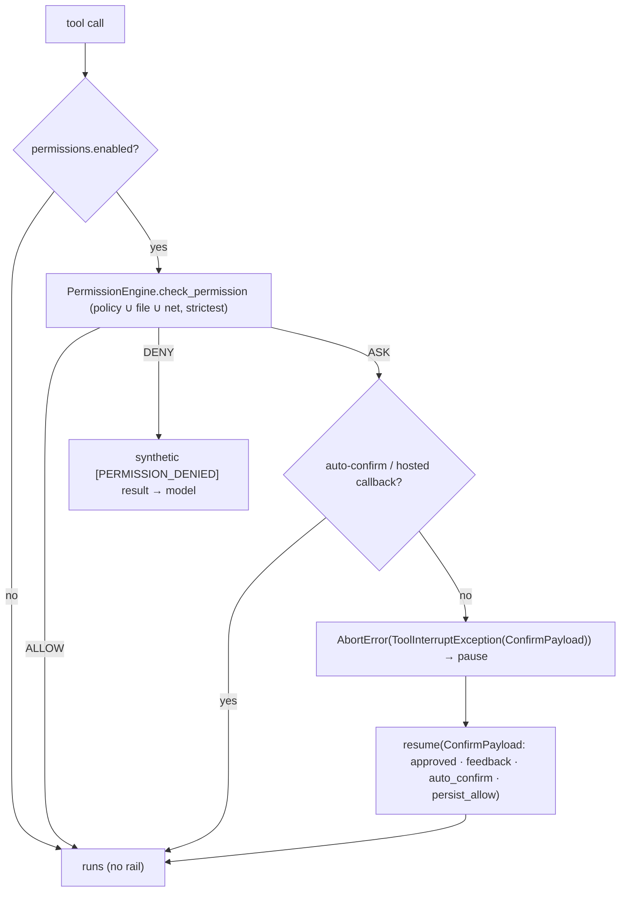

<sub>**Anchors:**<br>&bull; `agent-core/openjiuwen/harness/rails/security/tool_security_rail.py:57` — `PermissionInterruptRail`; `:186` `before_tool_call`; `:404` `resolve_interrupt`; `:486` ALLOW; `:494` DENY; `:510-563` hosted confirm + persist; `:594-598` ASK → interrupt; `:729` `_store_auto_confirm`<br>&bull; `agent-core/openjiuwen/harness/security/permission_engine/core.py:272` — `check_permission`; `:414` `build_permission_interrupt_rail`; `:426` `permissions.enabled` gate<br>&bull; `agent-core/openjiuwen/harness/security/permission_engine/toolguard/tool_policy.py:588` — `evaluate_tiered_policy`; `:502` ASK fallback; `:385` DENY precedence<br>&bull; `agent-core/openjiuwen/harness/security/permission_engine/models.py:19` — `PermissionLevel`; `:52` `PermissionConfirmResponse`<br>&bull; `agent-core/openjiuwen/harness/rails/interrupt/interrupt_base.py:243` — `_raise_interrupt`; `:248` `_skip_tool`; `:269` `_get_user_input`<br>&bull; `agent-core/openjiuwen/harness/rails/interrupt/confirm_rail.py:16` — `ConfirmPayload`; `:57` `resolve_interrupt`<br>&bull; `agent-core/openjiuwen/core/single_agent/interrupt/handler.py:310` — `handle_resume`; `:358` re-commit; `:384` restore auto-confirm<br>&bull; `agent-core/openjiuwen/harness/deep_agent.py:767-782` — auto-mount when `permissions["enabled"]`; `jiuwenswarm/jiuwenswarm/agents/harness/code/rails/code_plan_approval_rail.py:74` — `PlanApprovalRail`; `agent-core/openjiuwen/harness/rails/interrupt/ask_user_rail.py:29` — `AskUserRail`</sub>

**Gap.** The whole permission path is opt-in: `build_permission_interrupt_rail` returns `None` unless `permissions.enabled` is truthy, and `check_permission` short-circuits to ALLOW when the engine is disabled. There is no class literally named `ToolSecurityRail` — the file is `tool_security_rail.py` but the class is `PermissionInterruptRail`. Permanent persist falls back to writing YAML only when no host hook is supplied. `PlanApprovalRail` is not an interrupt — it stores pending state and appends a marker; enforcement lives in the product server layer.

## 20. How do you version and roll back an agent's workflow definition, not just its prompts

**General:** Treat the agent/workflow definition as a versioned artifact: store immutable versions with a content hash, activate one, list history, and roll back atomically. Prompts are only a subset — the topology and config change too. Most frameworks do not do this for you.

**Jiuwen:** In the core framework this is **essentially absent**: `WorkflowCard` has a free-form `version: str = ''` and a `generate_workflow_key(id, version)` helper, but there is no registry, no version history, no graph serializer, and no rollback API — `version` is only part of a composite key. The real, working versioning is at the product layer in the RSI (recursive self-improvement) harness subsystem: `RsiHarnessActivationStore` persists an `activation.json` with `schema_version`, an `active` record, and an immutable `history` of installed versions, each carrying `installation_id`, `sha256`, `runtime_path`, and a monotonic `version_sequence`; `install(task_id)` copies a published engine package into a content-addressed `versions/baseline-<sha16>` directory and `rollback(installation_id)` re-activates any retained version (validating path, sha256, and manifest, hot-reloading, with compensation if the pointer write fails), exposed over the WebSocket protocol as `rsi.harness.rollback`.

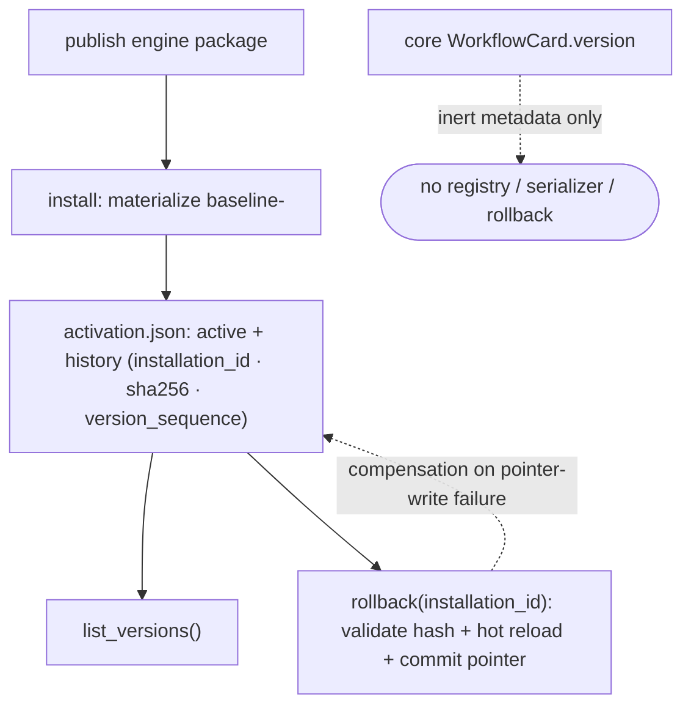

<sub>**Anchors:**<br>&bull; `agent-core/openjiuwen/core/workflow/base.py:21` — `WorkflowCard.version: str = ''`; `:68` `generate_workflow_key(workflow_id, workflow_version)`<br>&bull; `jiuwenswarm/jiuwenswarm/agents/harness/common/rsi/harness_activation.py:296` — `RsiHarnessActivationStore`; `:350` `list_versions()`; `:386` `snapshot()`; `:391` `restore()`; `:416` `commit()` assigns `version_sequence`; `:466` atomic write<br>&bull; `jiuwenswarm/jiuwenswarm/agents/harness/common/rsi/harness_activation.py:617` — `rollback(installation_id)`; `:623` `_rollback_unlocked`; `:682` `_assert_rollback_allowed`; `:694` `_validate_rollback_target`<br>&bull; `jiuwenswarm/jiuwenswarm/agents/harness/common/rsi/materializer.py:222` — content-addressed `version_id = baseline-<sha16>`; `:231-246` writes `harness_refs.yaml`<br>&bull; `jiuwenswarm/jiuwenswarm/server/rsi/rsi_handlers.py:224` — `_do_harness_rollback`; `:218` `_do_harness_versions_list`; `:209` install<br>&bull; `jiuwenswarm/jiuwenswarm/gateway/channel_manager/web/app_web_handlers.py:7634` — `rsi.harness.rollback` dispatch<br>&bull; `agent-core/openjiuwen/auto_harness/infra/runtime_manifest.py:121` — `schema_version`; `agent-core/openjiuwen/harness/schema/expert_harness_spec.py:122` — `schema_version`<br>&bull; `agent-core/openjiuwen/agent_evolving/checkpointing/manager.py:121` — restores operator state/best score (training only)</sub>

**Gap.** Core `openjiuwen` has no agent/workflow definition versioning or rollback; `WorkflowCard.version` is inert metadata. Versioning/rollback is real only in the product-layer RSI harness installer and only for engine-published harness packages. `agent_evolving` checkpointing rolls back training operator state, not a workflow definition. The config-migration path only migrates YAML keys forward and retains no old versions. Retained versions can be listed but there is no automatic pruning/retention policy.

---

# Framework selection

## 21. How do you decide between LangGraph, CrewAI, and the Anthropic Agent SDK for a given project

**General:** Pick by the shape of control and the state model you need. Explicit graph/routing with durable state → LangGraph. Role/team collaboration with fast multi-agent setup → CrewAI. A managed coding/agent harness with strong tool and sandbox defaults, and you accept the vendor → the Anthropic Agent SDK (or an equivalent). Weigh state model, persistence, provider lock-in, tool ecosystem, and team familiarity.

**Jiuwen:** There is no in-repo LangGraph or CrewAI code, so this is architectural reading. Jiuwen's design center is *deterministic graph when the flow is known* (`Workflow`/`Pregel`, with persistence via `GraphStore`/checkpointer) and *role-based teams when work assignment is emergent* (`TeamAgent` + `TeamScheduler` + task board). Over both sits a provider-agnostic model client: `ProviderType` enumerates OpenAI/Anthropic/DashScope/DeepSeek/… and `create_model_client` resolves the implementation, with `IntelliRouterModelClient` for routing. For the third archetype ("bring your own agent SDK"), it ships a `harness_protocol` SPI plus `harness_providers` (`native`, `claudecode`, `codex`, `dsh`) and `create_harness(manifest, provider=...)`.

```mermaid
flowchart TD
    Q{"shape of control?"} -->|"known topology, need durable state"| G["Workflow / Pregel (LangGraph archetype)"]
    Q -->|"emergent team assignment / roles"| R["agent_teams TeamAgent + TeamScheduler + board (CrewAI archetype)"]
    Q -->|"drive a third-party agent harness"| H["harness_protocol SPI + harness_providers (bring-your-own-SDK archetype)"]
    G --> MC["provider-agnostic Model: ProviderType → create_model_client"]
    R --> MC
    H --> MC
```

<sub>**Anchors:**<br>&bull; `agent-core/openjiuwen/core/graph/pregel/engine.py:255` — graph driver<br>&bull; `agent-core/openjiuwen/agent_teams/agent/scheduling/scheduler.py:92` — `TeamScheduler`; `agent-core/openjiuwen/agent_teams/runtime/manager.py:104` — pool/dispatch<br>&bull; `agent-core/openjiuwen/core/foundation/llm/schema/config.py:13` — `ProviderType` enum<br>&bull; `agent-core/openjiuwen/core/foundation/llm/model_clients/__init__.py:58` — provider→client dispatch + registry fallback<br>&bull; `agent-core/openjiuwen/harness_providers/factory.py:160` — `create_harness(manifest, provider=...)`<br>&bull; `agent-core/openjiuwen/core/workflow/workflow.py:98` — graph and teams coexist in one SDK<br>&bull; `agent-core/openjiuwen/harness/manifest/catalog.py:67` — declarative element catalog</sub>

**Gap.** There are no comparative benchmarks, migration guides, or explicit decision docs versus LangGraph/CrewAI — the mapping is by architectural reading only. Model-client parity across providers is deep for OpenAI/Anthropic, but non-OpenAI providers are largely endpoint/`extra_body` profiles rather than first-class native SDKs.

## 22. What tradeoffs come with choosing a heavier framework versus writing a lighter custom orchestration layer

**General:** Heavy frameworks give you batteries — tools, memory, permissions, teams, observability — at the cost of startup time, learning curve, config surface, and update churn. Light custom code is transparent and fast but you rebuild context management, retries, tracing, and safety. Choose by how much of the battery you would otherwise write yourself.

**Jiuwen:** The light path is `core`: `BaseAgent`/`ReActAgent` with `AbilityManager`, optional rails, and `Workflow` graphs — no workspace, no permission engine, no task loop, no teams. The heavy path is `harness`: `factory.create_deep_agent` assembles `DeepAgent` with default rails (security, tool resilience, task planning, skills, subagents), a task loop, a workspace, and a tiered permission engine; `agent_teams` adds multi-process teams, DB/messager transport, worktrees, and reliability monitoring. Heaviness is partly config-gated (`enable_task_loop`, `enable_subagent_runtime`, `enable_security_rail`), but the default DeepAgent assembly is substantial.

```mermaid
flowchart LR
    subgraph LIGHT["core (light)"]
    direction TB
    BA["BaseAgent / ReActAgent"] --> AM["AbilityManager + optional rails"]
    BA --> WF["Workflow graphs"]
    end
    subgraph HEAVY["harness / agent_teams (heavy)"]
    direction TB
    DA["DeepAgent"] --> DR["default rails: security · resilience · planning · skills · subagents"]
    DA --> TL["task loop + workspace + permission engine"]
    TL --> TM["agent_teams: multi-process · DB/messager · worktrees · reliability"]
    end
```

<sub>**Anchors:**<br>&bull; `agent-core/openjiuwen/core/single_agent/base.py:85` — `BaseAgent`; `agent-core/openjiuwen/core/single_agent/agents/react_agent.py:2492` — `invoke` (light path)<br>&bull; `agent-core/openjiuwen/core/application/llm_agent/llm_agent.py:96`; `agent-core/openjiuwen/core/application/workflow_agent/workflow_agent.py:11` — thin application agents<br>&bull; `agent-core/openjiuwen/harness/deep_agent.py:298` — `DeepAgent`; `agent-core/openjiuwen/harness/factory.py:460` `create_deep_agent`; `:394-409` default rail set<br>&bull; `agent-core/openjiuwen/harness/schema/config.py:248-260` — `enable_task_loop`/`enable_subagent_runtime`/`enable_skill_discovery` defaults `False`<br>&bull; `agent-core/openjiuwen/harness/schema/deep_agent_spec.py:448/452` — spec defaults `enable_task_loop=True`, `enable_security_rail=True`<br>&bull; `agent-core/openjiuwen/agent_teams/agent/team_agent.py:76` — team heaviness; `agent-core/openjiuwen/extensions/context_evolver/` + `agent-core/openjiuwen/rsi/` + `agent-core/openjiuwen/auto_harness/` — optional layers</sub>

**Gap.** The two paths are not cleanly layered: `Workflow` lives in `core` but is fully integrated with runner callbacks/tracing, and `harness` imports many core internals. There is no single "minimal install" flag; optional layers (`agent_evolving`, `symphony`, `dev_tools`) ship in the same distribution.

## 23. How do you evaluate whether a framework will scale with your team, not just your first prototype

**General:** Look for declarative registration and plugins, stable extension contracts, provider and config abstraction, schema'd configuration, and real documentation. Be wary of frameworks where every change means patching internals. Prototype speed is not the same as team-scale maintainability.

**Jiuwen:** Extension is registry/manifest based rather than patch based. Provider modules declare `@harness_element(kind, name, ...)` descriptors; `register_from_catalog()` converts the catalog into class registrations, and `DeepAgent.load_plugin` / `load_agent_template` / `load_harness_config` hot-load packages through one `BuildContext` apply path. Model providers auto-register via `BaseModelClient.__init_subclass__` into `ClientRegistry`, and team infrastructure uses `register_transport`/`register_storage` name→config registries. `Runner.resource_mgr` centralizes tool/workflow/agent/team/model/prompt managers, and the product demonstrates the pattern: `jiuwenswarm/agents/swarm/registry.py` imports provider modules and drives registration from the manifest catalog.

```mermaid
flowchart TD
    DEV(["new extension"]) --> E["@harness_element descriptor"]
    E --> CAT["catalog: register_from_catalog()"]
    CAT --> BC["BuildContext apply path"]
    BC --> PL["DeepAgent.load_plugin / load_agent_template / load_harness_config"]
    MC["BaseModelClient subclass"] --> CR["ClientRegistry (__init_subclass__)"]
    TEAM["team transport/storage"] --> RR["register_transport / register_storage"]
    PL --> RM["Runner.resource_mgr (tool/workflow/agent/team/model/prompt managers)"]
    CR --> RM
    RR --> RM
```

<sub>**Anchors:**<br>&bull; `agent-core/openjiuwen/harness/manifest/catalog.py:67` — `@harness_element`; `:55` `list_elements()`; `agent-core/openjiuwen/harness/manifest/registration.py:31` — `register_from_catalog`<br>&bull; `agent-core/openjiuwen/harness/deep_agent.py:2027` — `load_plugin`; `:2076` `load_agent_template`; `:2190` `load_harness_config`<br>&bull; `agent-core/openjiuwen/core/foundation/llm/model_clients/base_model_client.py:53` — `__init_subclass__` auto-registration; `agent-core/openjiuwen/core/common/clients/client_registry.py:19/50/94`<br>&bull; `agent-core/openjiuwen/core/runner/resources_manager/resource_registry.py:13` — `ResourceRegistry`<br>&bull; `agent-core/openjiuwen/harness/schema/config.py:248`; `agent-core/openjiuwen/harness/schema/deep_agent_spec.py:354` — config schema (Pydantic)<br>&bull; `agent-core/openjiuwen/agent_teams/schema/team.py:81` — `TransportSpec`/`StorageSpec` registry pattern<br>&bull; `jiuwenswarm/jiuwenswarm/agents/swarm/registry.py:8-12` — product-side provider registration via the catalog</sub>

**Gap.** There is no visible semantic-versioning or deprecation policy for `@harness_element` names or config fields — the descriptor stores a factory ref and an input JSON schema but no version. Adding a new tool/rail also requires touching prompt/description contracts (a documentation discipline, not enforced by types). The legacy `single_agent/legacy/` surface shows the cost of past API drift.

## 24. What happens when the framework's abstractions don't match how your actual business logic needs to work

**General:** Prefer escape hatches: implement the base interface directly, call the primitive (model/tool) without the high-level wrapper, override hooks, or replace a component. If the framework has no seam, you fork it or drop it. Good frameworks make the low-level primitive reachable from the high-level API.

**Jiuwen:** The framework exposes multiple escape hatches. At graph level, implement `Executable`/`ComponentExecutable` with full control over I/O and bypass schemas. At LLM level, call `Model.invoke` directly (no agent/runner required). At tool level, wrap any function with `LocalFunction`/`@tool`, including a custom `render`. At behavior level, intercept with `AgentRail` hooks or replace a rail via `strip_rails_by_type`; at assembly level, override config fields or subclass (`ReActAgentEvolve` is a shipped example). `_apply_extension_parts` hot-swaps rails/tools/prompts, and custom clients plug into the registry.

```mermaid
flowchart TD
    MIS{"abstraction mismatch"} --> G["implement Executable / ComponentExecutable (bypass schemas)"]
    MIS --> L["call Model.invoke directly"]
    MIS --> T["wrap any function with @tool / LocalFunction"]
    MIS --> R["AgentRail hooks or strip_rails_by_type / subclass ReActAgent"]
    MIS --> E["_apply_extension_parts hot-swap"]
    MIS --> C["custom model client → ClientRegistry"]
```

<sub>**Anchors:**<br>&bull; `agent-core/openjiuwen/core/graph/executable.py:14` — `on_invoke` override<br>&bull; `agent-core/openjiuwen/core/workflow/components/component.py:124/148` — `invoke`/`stream` overrides with raw `Session`+`ModelContext`<br>&bull; `agent-core/openjiuwen/core/foundation/llm/model.py:94` — direct `Model.invoke`<br>&bull; `agent-core/openjiuwen/core/foundation/tool/function/function.py:48` — `LocalFunction`; `agent-core/openjiuwen/core/foundation/tool/tool.py:14` — `@tool`<br>&bull; `agent-core/openjiuwen/core/single_agent/rail/base.py:824` — `AgentRail`; `agent-core/openjiuwen/harness/deep_agent.py:1936` — `strip_rails_by_type`<br>&bull; `agent-core/openjiuwen/core/single_agent/agents/react_agent_evolve.py:16` — subclassing `ReActAgent`<br>&bull; `agent-core/openjiuwen/core/foundation/llm/model_clients/base_model_client.py:53` + `agent-core/openjiuwen/core/common/clients/client_registry.py:50` — custom model backend<br>&bull; `agent-core/openjiuwen/harness/deep_agent.py:2015` — `_apply_extension_parts` hot-swap</sub>

**Gap.** Escape hatches are unevenly documented and some are "advanced / for tests". Rail routing requires the event to be in the correct allow-set or the callback silently does not run. There is no formal "override this method" contract for the ReAct loop beyond subclassing a large class, and no public config-level override hook for the `agent_teams` prompt/dispatch policy beyond editing specs and YAML.

---

## Summary: strong vs weak in Jiuwen

| Area | Strength | Notes |
|---|---|---|
| Framework value over raw calls | Strong | session, context engine, model-client abstraction, tool manager, tracer, graph engine |
| Graph execution (Pregel) | Strong | static + conditional routing, barriers, CNF OR-groups, channel-based state |
| Role-based teams | Strong | one `TeamAgent` for leader/teammate, task board CAS, mailbox |
| Thin vs heavy layering | Mixed | thin `core` path exists, but defaults differ between `DeepAgentConfig` and `DeepAgentSpec` |
| State tracking | Strong | agent/workflow `StateCollection`, message buffer, `GraphState` checkpoints |
| Pause / resume | Mixed | interrupt rails work; graph checkpoints only on error; DeepAgent task loop cannot pause |
| Tool registration / exposure | Strong | cards → `ToolInfo` → provider formats, MCP, auto schema extraction |
| Tool argument validation | Strong | JSON repair + jsonschema/Pydantic at the tool boundary |
| Per-tool retry policy | Weak | rail is all-or-nothing; per-tool `max_attempts`/backoff not implemented |
| Multi-agent communication | Strong | DB mailbox + event bus, mention routing, bounded handoff |
| Supervisor vs peer clarity | Mixed | both exist but in disjoint stacks with no switch |
| Failure attribution | Mixed | span tree attributes per agent, but no automated root cause; logs lack trace id |
| Iteration / step limits | Mixed | inner cap enforced; outer budget evaluators default to `None`; 50-round literal |
| Timeout / error handling | Strong | `fail_after`, retry classification, failures as `ToolMessage` |
| Human-in-the-loop approval | Strong | permission engine ALLOW/ASK/DENY, interrupt + resume, persisted allow rules |
| Workflow versioning / rollback | Weak | absent in core; real only in product-layer RSI harness installer |
| Framework selection model | Mixed | no LangGraph/CrewAI comparison; provider-agnostic clients are the strength |
| Team-scale extensibility | Mixed | registry/manifest is good, but no versioning of element contracts |
| Escape hatches | Strong | executable override, direct `Model.invoke`, custom rails/clients, hot-swap |
