# AI agent interview questions — general answers + how Jiuwen does it

Based on the list *The Most Repeated AI Agent Questions in AI Engineer Interviews* (Core Concepts; Planning and Reasoning; Tool Use and Reliability; Memory; Multi-Agent Systems; Cost and Production; Safety). Each section heading is the original question.

See [README](README.md) for the shared conventions (answer shape, anchor format, repo layers).

> **The pattern worth noticing:** almost every agent question is really asking one thing — can this system be trusted to act on its own, and what stops it when something goes wrong.

---

# Core concepts

## 1. What's the difference between a chatbot and an agent

**General:** A chatbot maps one input to one model reply. An agent runs a loop: it calls the model, may call tools, feeds results back, and repeats until a stopping condition is met. The defining trait is the tool/reason loop and a termination rule, not the size of the model.

**Jiuwen:** There is no separate `Chatbot` class; the distinction is structural. A single model turn is the workflow LLM component, which calls `llm.invoke` once and has no tool branch. An agent is the loop in `ReActAgent.invoke`: it calls the model, and if the returned message has no tool calls it returns the answer; otherwise it executes the tools and iterates. `DeepAgent` wraps this with an outer task loop.

**Chatbot:**

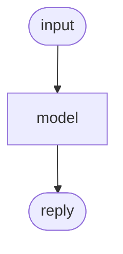
```mermaid
flowchart TD
    I1(["input"]) --> M1["model"] --> O1(["reply"])
```

**Agent:**

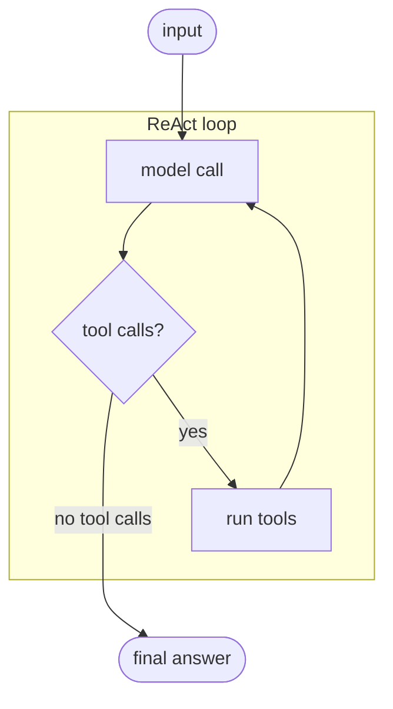
```mermaid
flowchart TD
    I(["input"]) --> M
    subgraph LOOP["ReAct loop"]
    direction TB
        M["model call"] --> D{"tool calls?"}
        D -->|yes| T["run tools"] --> M
    end
    D -->|"no tool calls "| A(["final answer"])
    T ~~~ A
```

**Anchors:** &bull; `agent-core/openjiuwen/core/workflow/components/llm/llm_comp.py:524` — single model call, no tool branch &bull; `agent-core/openjiuwen/core/single_agent/agents/react_agent.py:2740` — the ReAct loop &bull; `agent-core/openjiuwen/core/single_agent/agents/react_agent.py:2793` — no tool calls → final answer &bull; `agent-core/openjiuwen/core/single_agent/agents/react_agent.py:2813` — execute tools and iterate &bull; `agent-core/openjiuwen/harness/deep_agent.py:2694` — outer task loop

## 2. What's the difference between a workflow and an agent

**General:** A workflow is a pre-declared graph: you author the steps, edges, and branches, and execution follows that topology. An agent decides its next step at runtime from model output. Workflows are predictable and cheap; agents are flexible and variable. They compose: a workflow can contain an agent node.

**Jiuwen:** The workflow engine is a Pregel-style graph machine. Topology is declared up front via the start component, connections, and conditional connections, and execution terminates when the end component produces output. An agent loop instead branches on live `tool_calls`. A workflow can embed an agent as one node, where a single executable just calls the agent's `invoke`.

**Workflow (fixed topology):**

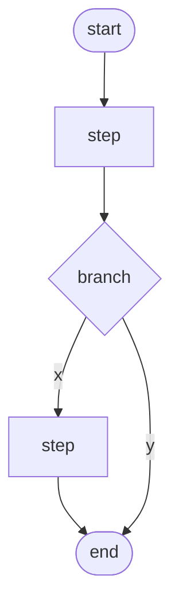
```mermaid
flowchart TD
    A1(["start"]) --> B1["step"] --> C1{"branch"}
    C1 -->|x| D1["step"] --> E1(["end"])
    C1 -->|y| E1
```

**Agent (decided at runtime):**

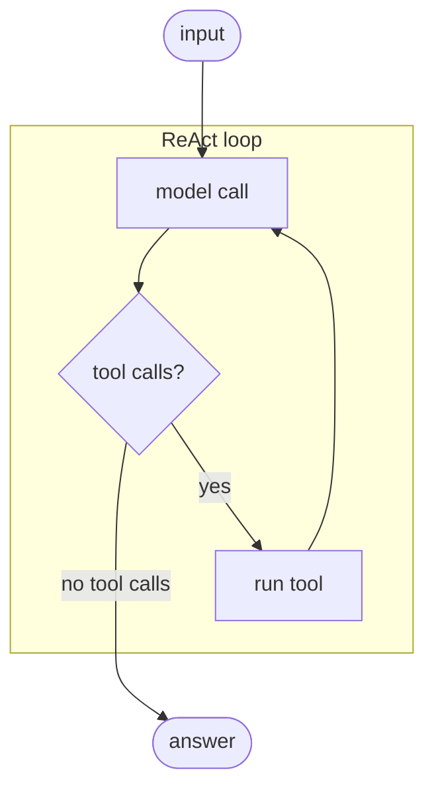
```mermaid
flowchart TD
    A2(["input"]) --> M
    subgraph LOOP["ReAct loop"]
    direction TB
        M["model call"] --> Q{"tool calls?"}
        Q -->|yes| X["run tool"] --> M
    end
    Q -->|"no tool calls"| Z(["answer"])
    X ~~~ Z
```

**Anchors:** &bull; `agent-core/openjiuwen/core/workflow/workflow.py:98` — `Workflow` class &bull; `agent-core/openjiuwen/core/graph/pregel/engine.py:255` — graph execution driver &bull; `agent-core/openjiuwen/core/workflow/workflow.py:136/279/311` — `set_start_comp` / `add_connection` / `add_conditional_connection` &bull; `agent-core/openjiuwen/core/workflow/workflow.py:551` — terminates when the end component produces output &bull; `agent-core/openjiuwen/core/workflow/components/llm/react/react_executable.py:41` — workflow node embedding an agent

## 3. How does function calling actually work under the hood

**General:** Tool definitions (name, description, JSON-Schema parameters) are sent to the model in the request. The model returns a structured `tool_calls` list instead of prose; the host parses it, validates arguments against the schema, invokes the function, and appends the result as a tool message for the next model turn. The model never runs code — it only emits a request to.

**Jiuwen:** Cards become JSON Schema through the callable schema extractor, the ability manager builds the model-facing tool list, and the model client converts it to OpenAI/Anthropic tool format. The model's `tool_calls` are parsed (non-streaming, streaming, and Anthropic), validated, and dispatched by the ability manager, with schema validation inside `LocalFunction.invoke`.

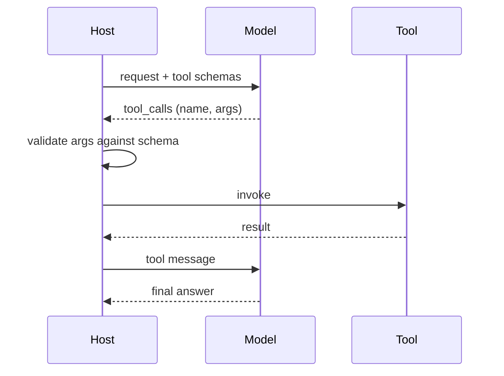
```mermaid
sequenceDiagram
    participant Host
    participant Model
    participant Tool
    Host->>Model: request + tool schemas
    Model-->>Host: tool_calls (name, args)
    Host->>Host: validate args against schema
    Host->>Tool: invoke
    Tool-->>Host: result
    Host->>Model: tool message
    Model-->>Host: final answer
```

**Anchors:** &bull; `agent-core/openjiuwen/core/foundation/tool/utils/callable_schema_extractor.py:20` — card → JSON Schema &bull; `agent-core/openjiuwen/core/single_agent/ability_manager.py:938` — builds the model-facing tool list &bull; `agent-core/openjiuwen/core/foundation/llm/model_clients/base_model_client.py:483` — OpenAI tool format &bull; `agent-core/openjiuwen/core/foundation/llm/model_clients/anthropic_model_client.py:494` — Anthropic tool format &bull; `agent-core/openjiuwen/core/foundation/llm/model_clients/openai_model_client.py:2388` — parse non-streaming tool calls &bull; `agent-core/openjiuwen/core/foundation/llm/model_clients/openai_model_client.py:313` — parse streaming tool-call deltas &bull; `agent-core/openjiuwen/core/foundation/llm/model_clients/anthropic_model_client.py:1229` — parse Anthropic `tool_use` &bull; `agent-core/openjiuwen/core/single_agent/ability_manager.py:1032` — dispatch &bull; `agent-core/openjiuwen/core/foundation/tool/function/function.py:65` — argument schema validation

## 4. What decides when an agent stops and returns a final answer instead of calling another tool

**General:** Usually the model itself: when it emits no tool calls, the answer is final. Around that sit hard limits — max iterations, token/time budgets, and explicit stop conditions — so a confused agent does not loop forever.

**Jiuwen:** Two levels. Inner: in `ReActAgent`, no tool calls means a final answer, bounded by `max_iterations` (default 5). Outer (`DeepAgent` task loop): the `LoopCoordinator` OR-evaluates a chain of stop evaluators — max rounds, timeout, token budget, completion promise, and no-progress answer. Completion can also arrive as a `<promise>…</promise>` marker extracted by `TaskCompletionRail`. A hardcoded ceiling of 50 outer rounds backstops everything.

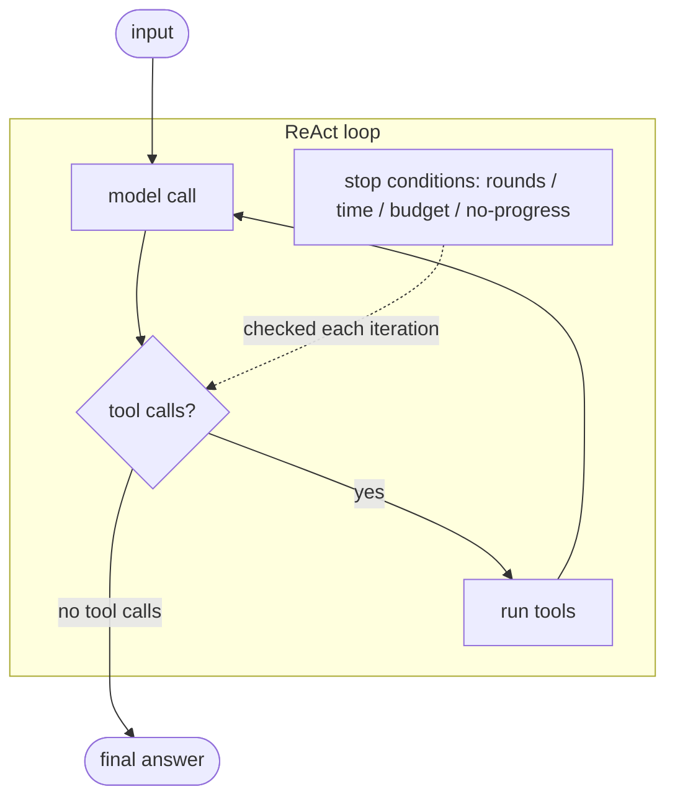
```mermaid
flowchart TD
    I(["input"]) --> M
    subgraph LOOP["ReAct loop"]
    direction TB
        M["model call"] --> T{"tool calls?"}
        T -->|yes| R["run tools"] --> M
        G["stop conditions: rounds / time / budget / no-progress"] -.->|"checked each iteration"| T
    end
    T -->|"no tool calls"| F(["final answer"])
    R ~~~ F
```

**Anchors:** &bull; `agent-core/openjiuwen/core/single_agent/agents/react_agent.py:2793` — no tool calls → final answer &bull; `agent-core/openjiuwen/core/single_agent/agents/react_agent.py:288` — `max_iterations` default 5 &bull; `agent-core/openjiuwen/core/single_agent/agents/react_agent.py:2740` — inner loop &bull; `agent-core/openjiuwen/harness/task_loop/loop_coordinator.py:139` — outer `should_continue` &bull; `agent-core/openjiuwen/harness/schema/stop_condition.py:124-331` — evaluator chain &bull; `agent-core/openjiuwen/harness/rails/task_completion_rail.py:403` — completion-promise extraction &bull; `agent-core/openjiuwen/harness/deep_agent.py:2692` — hard 50-round ceiling

---

# Planning and reasoning

## 5. What's the difference between a single-step agent and a multi-step planning agent

> **Note on the wording:** the question conflates two independent axes. **Number of steps** (single vs multi) is separate from **whether an explicit plan exists** (reactive vs planning). A multi-step agent does not have to plan — a plain ReAct loop takes many steps reactively, with no plan artifact.

**General:** Two axes, not one. *Single-step vs multi-step* is how many model↔tool cycles run. *Reactive vs planning* is whether the agent keeps an explicit plan (a todo list / task plan) that it creates up front and updates as it goes. Planning normally implies multi-step, but multi-step does not imply planning.

| | No explicit plan (reactive) | Explicit plan (planning) |
|---|---|---|
| Single-step | one model call (+ maybe one tool) | not meaningful — a plan implies multiple steps |
| Multi-step | ReAct loop; next action chosen each turn | plan/todo maintained and progress tracked |

**What "reactive" means here:** a *reactive* agent chooses its next action **only from the last observation** — it looks one step ahead, not N steps ahead, and commits to nothing up front. This is the default ReAct behavior, and it is relevant because most tasks never need an up-front plan: the tool results themselves drive the next move. Planning becomes relevant when the task has many dependent steps, needs global coherence, or the user must see/approve the plan before work starts.

| Reactive fits | Planning fits |
|---|---|
| Short or exploratory tasks | Long, many-step tasks with dependencies |
| The next step depends on live results | The overall shape must be fixed up front |
| No need to show a plan to the user | The user must review/approve the plan |
| Cheap, little coordination | Needs progress tracking and drift resistance |

**Jiuwen:** Jiuwen keeps the two axes as separate layers. `ReActAgent` is multi-step **reactive**: it loops (bounded by `max_iterations`) with no explicit plan. Planning is an *additive* rail: `TaskPlanningRail` registers the todo tools and `TaskPlan` persists an ordered plan. `DeepAgent`'s outer task loop is multi-step **with** planning: each outer round runs a full inner `react_agent.invoke`, while the persistent `TaskPlan`/todos carry state between rounds and `TaskCompletionRail` bounds the loop. So "multi-step" and "planning" are orthogonal.

**Single-step (no loop):**

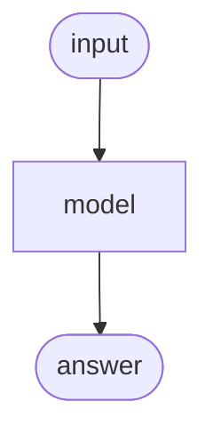
```mermaid
flowchart TD
    A(["input"]) --> B["model"] --> C(["answer"])
```

**Multi-step, reactive (no explicit plan):** each turn's tool result is the only input to the next decision; no plan is carried across turns.

```mermaid
flowchart TD
    I(["input"]) --> M
    subgraph LOOP["ReAct loop"]
    direction TB
        M["model call"] --> D{"tool calls?"}
        D -->|yes| T["run tools"] --> M
    end
    D -->|"no tool calls"| A(["final answer"])
    T ~~~ A
```

**Multi-step, planning (explicit plan):** the model's answer may *request* a `todo_create` tool call, which the ReAct loop then executes to create a persistent plan; the plan is worked task by task. *How it knows to plan:* `TaskPlanningRail` registers the todo tools and injects a planning prompt before each model call, so the model sees both the tools and the instruction — and its answer requests the tool call.

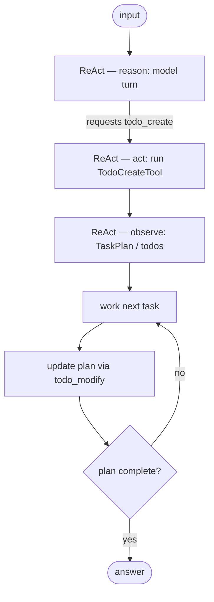
```mermaid
flowchart TD
    I(["input"]) --> M["ReAct — reason: model turn"]
    M -->|"requests todo_create"| TC["ReAct — act: run TodoCreateTool"]
    TC --> P["ReAct — observe: TaskPlan / todos"]
    P --> W["work next task"]
    W --> U["update plan via todo_modify"]
    U --> Q{"plan complete?"}
    Q -->|no| W
    Q -->|yes| A(["answer"])
```

**Anchors:** &bull; `agent-core/openjiuwen/core/single_agent/agents/react_agent.py:2740` — multi-step reactive loop &bull; `agent-core/openjiuwen/core/single_agent/agents/react_agent.py:288` — iteration bound &bull; `agent-core/openjiuwen/harness/rails/task_planning_rail.py:31` — planning layer (additive) &bull; `agent-core/openjiuwen/harness/rails/task_planning_rail.py:108/152` — registers todo tools, injects planning prompt &bull; `agent-core/openjiuwen/harness/tools/todo.py:184` — `TodoCreateTool` writes `todo.json` &bull; `agent-core/openjiuwen/harness/schema/task.py:97` — `TaskPlan` &bull; `agent-core/openjiuwen/harness/deep_agent.py:2694` — multi-step + planning (outer loop) &bull; `agent-core/openjiuwen/harness/task_loop/task_loop_event_executor.py:222` — one outer round = one inner invoke &bull; `agent-core/openjiuwen/harness/rails/task_completion_rail.py:74` — completion rail bounds the loop

## 6. How does an agent break a complex task into smaller subtasks

**General:** Either the model is asked to emit a plan/todo list up front, or the agent decomposes lazily and revises. Often the decomposition is stored as structured tasks the agent can mark in-progress/completed.

**Jiuwen:** Model-driven todo tools, not an algorithmic planner. The model's answer *requests* a `todo_create` tool call (prompted by the rail's guidance to plan when the task warrants it); the ReAct loop then executes it, and the tool validates and persists the list. `TodoCreateTool` takes a JSON array of `{id, content, activeForm, description}` and persists a `todo.json` per session; `TaskPlan` stores the goal plus ordered `TodoItem`s with `depends_on` and resolves the next task. `TaskPlanningRail` registers the todo tools and injects planning guidance, and the `Plan` agent mode adds a `task_tool` to delegate subtasks to subagents.

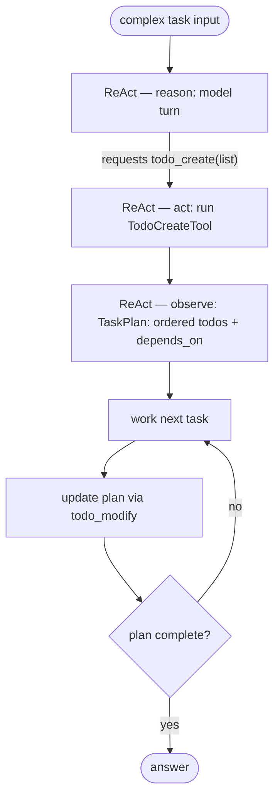
```mermaid
flowchart TD
    I(["complex task input"]) --> M["ReAct — reason: model turn"]
    M -->|"requests todo_create(list)"| TC["ReAct — act: run TodoCreateTool"]
    TC --> P["ReAct — observe: TaskPlan: ordered todos + depends_on"]
    P --> W["work next task"]
    W --> U["update plan via todo_modify"]
    U --> Q{"plan complete?"}
    Q -->|no| W
    Q -->|yes| A(["answer"])
```

**Anchors:** &bull; `agent-core/openjiuwen/harness/tools/todo.py:184` — `TodoCreateTool` &bull; `agent-core/openjiuwen/harness/tools/todo.py:97` — per-session `todo.json` &bull; `agent-core/openjiuwen/harness/schema/task.py:97` — `TaskPlan` &bull; `agent-core/openjiuwen/harness/rails/task_planning_rail.py:31/108/152` — rail, tool registration, guidance &bull; `agent-core/openjiuwen/harness/rails/agent_mode_rail.py:645` — plan-mode `task_tool`

## 7. What's the ReAct pattern, and why interleave reasoning with actions instead of planning everything upfront

**General:** ReAct alternates thought → action → observation. Interleaving lets each action's real result inform the next thought, which corrects drift and grounds reasoning in observed state. A fully upfront plan cannot react to what the tools actually return.

**Jiuwen:** The loop is exactly reason/act/observe: model call, branch on `tool_calls`, execute, feed `ToolMessage`s back as the next observation, repeat. The reasoning trace is retained by copying `reasoning_content` into the assistant message, and the iteration number is exposed to rails.

**Why interleave:** a fully upfront plan executes with no feedback; ReAct feeds each observation back into the next reasoning step, so it can adapt when reality differs from the plan.

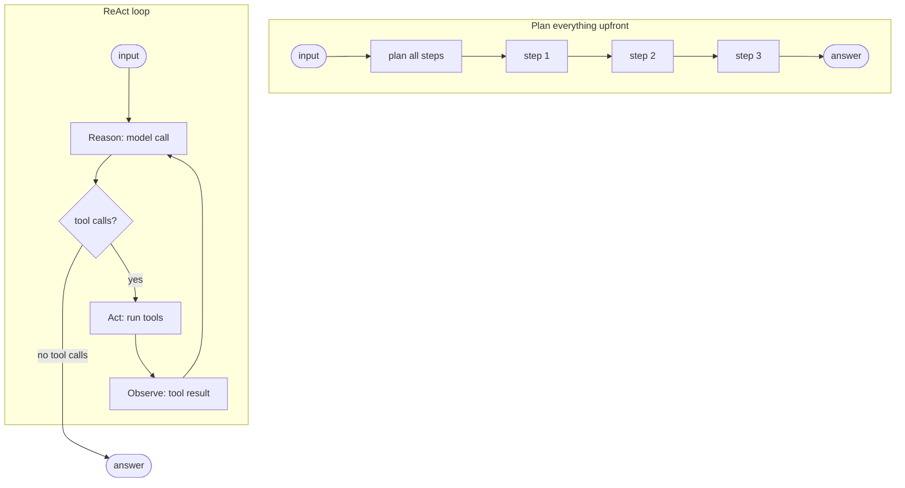
```mermaid
flowchart TD
    subgraph PLAN["Plan everything upfront"]
    I1(["input"]) --> P["plan all steps"] --> S1["step 1"] --> S2["step 2"] --> S3["step 3"] --> O1(["answer"])
    end
    subgraph LOOP["ReAct loop"]
    direction TB
        I2(["input"]) --> R["Reason: model call"]
        R --> D{"tool calls?"}
        D -->|yes| TA["Act: run tools"] --> OB["Observe: tool result"] --> R
    end
    D -->|"no tool calls"| O2(["answer"])
    OB ~~~ O2
```

**Anchors:** &bull; `agent-core/openjiuwen/core/single_agent/agents/react_agent.py:2766` — model call (reason) &bull; `agent-core/openjiuwen/core/single_agent/agents/react_agent.py:2793` — branch on tool calls &bull; `agent-core/openjiuwen/core/single_agent/agents/react_agent.py:2813` — execute (act) &bull; `agent-core/openjiuwen/core/single_agent/agents/react_agent.py:2787` — retain `reasoning_content` &bull; `agent-core/openjiuwen/core/single_agent/agents/react_agent.py:2742` — iteration exposed to rails &bull; `agent-core/openjiuwen/core/single_agent/agents/react_agent.py:568` — `ReActAgent` documents the pattern

## 8. How do you handle a task where the plan needs to change mid-execution based on a tool's result

**General:** Allow plan mutation during the run: the agent can add, reorder, cancel, or replace tasks, and can be steered by new instructions. Track the authoritative plan separately from the live state so they can be reconciled.

**Jiuwen:** Several mechanisms. `TodoModifyTool` supports update/delete/cancel/append/insert operations with a single-in-progress invariant. `TaskPlanningRail._sync_todos_from_plan` reconciles todos against the authoritative `TaskPlan` each outer round. Steering messages inject new instructions and are drained before each model call. Mode transitions enter/exit plan with an approval gate.

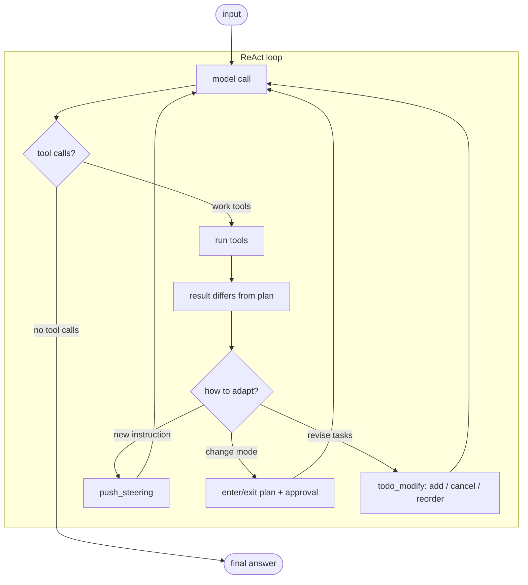
```mermaid
flowchart TD
    I(["input"]) --> M
    subgraph LOOP["ReAct loop"]
    direction TB
        M["model call"] --> D{"tool calls?"}
        D -->|"work tools"| W["run tools"] --> RC["result differs from plan"] --> AD{"how to adapt?"}
        AD -->|"revise tasks"| T["todo_modify: add / cancel / reorder"] --> M
        AD -->|"new instruction"| S["push_steering"] --> M
        AD -->|"change mode"| P["enter/exit plan + approval"] --> M
    end
    D -->|"no tool calls"| A(["final answer"])
    T ~~~ A
```

**Anchors:** &bull; `agent-core/openjiuwen/harness/tools/todo.py:452` — `TodoModifyTool` operations &bull; `agent-core/openjiuwen/harness/tools/todo.py:600` — single-in-progress invariant &bull; `agent-core/openjiuwen/harness/rails/task_planning_rail.py:320` — reconcile todos from plan &bull; `agent-core/openjiuwen/core/single_agent/agents/react_agent.py:2756` — drain steering before model call &bull; `agent-core/openjiuwen/core/single_agent/rail/base.py:687` — `ctx.push_steering` &bull; `agent-core/openjiuwen/harness/rails/agent_mode_rail.py:460` — enter/exit plan gate &bull; `jiuwenswarm/jiuwenswarm/agents/harness/code/rails/code_plan_approval_rail.py:74` — product plan-approval rail

---

# Tool use and reliability

## 9. How do you handle a tool call that fails or returns malformed output

**General:** Treat failures as data, not crashes: catch the exception, classify whether it is retryable, return a structured error the model can read and react to, and repair obviously broken payloads (e.g., unbalanced JSON) when possible.

**Jiuwen:** `ToolCallResilienceRail` is auto-mounted. It classifies retryable vs not, never retries non-idempotent tools, and returns a `[Retry Summary]` when the budget is exhausted. Broken tool arguments are repaired by bracket balancing; if unrepairable, the raw JSON is surfaced to the model. The general-purpose `JsonOutputParser`, by contrast, does not repair — it returns `None` on failure.

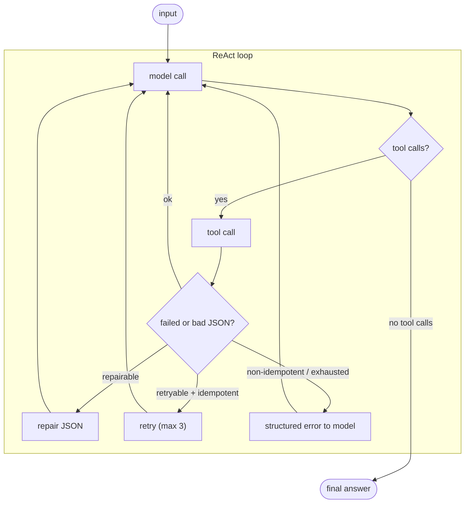
```mermaid
flowchart TD
    I(["input"]) --> M
    subgraph LOOP["ReAct loop"]
    direction TB
        M["model call"] --> D{"tool calls?"}
        D -->|yes| C["tool call"]
        C --> E{"failed or bad JSON?"}
        E -->|repairable| FIX["repair JSON"] --> M
        E -->|"retryable + idempotent"| RETRY["retry (max 3)"] --> M
        E -->|"non-idempotent / exhausted"| ERR["structured error to model"] --> M
        E -->|ok| M
    end
    D -->|"no tool calls"| A(["final answer"])
    ERR ~~~ A
```

**Anchors:** &bull; `agent-core/openjiuwen/harness/schema/config.py:294` — resilience rail enabled by default &bull; `agent-core/openjiuwen/harness/factory.py:408` — auto-mount &bull; `agent-core/openjiuwen/harness/rails/tool_call_resilience_rail.py:198` — retryability classification &bull; `agent-core/openjiuwen/harness/rails/tool_call_resilience_rail.py:222` — never retry non-idempotent tools &bull; `agent-core/openjiuwen/harness/rails/tool_call_resilience_rail.py:169` — retry-summary on exhaustion &bull; `agent-core/openjiuwen/core/single_agent/ability_manager.py:435` — JSON bracket-repair &bull; `agent-core/openjiuwen/core/single_agent/ability_manager.py:1378` — surface raw JSON to the model &bull; `agent-core/openjiuwen/core/foundation/llm/output_parsers/json_output_parser.py:56` — no repair (returns `None`)

## 10. How do you validate structured output from a model before acting on it

**General:** Never trust the model's structuring. Validate against a schema (Pydantic/JSON Schema), coerce or reject, and only act on validated data. Prefer constraining the model with a schema at generation time, then validate the result anyway.

**Jiuwen:** The model's structured output is validated before it is acted on. When that output is a tool call, `LocalFunction.invoke` validates the arguments via `SchemaUtils.validate_with_schema` before the function runs; `StructuredOutputTool` constrains the model to emit schema-shaped arguments and only force-finishes on success, so failures reach the model. Workflow and agent-team schemas validate their JSON output before use.

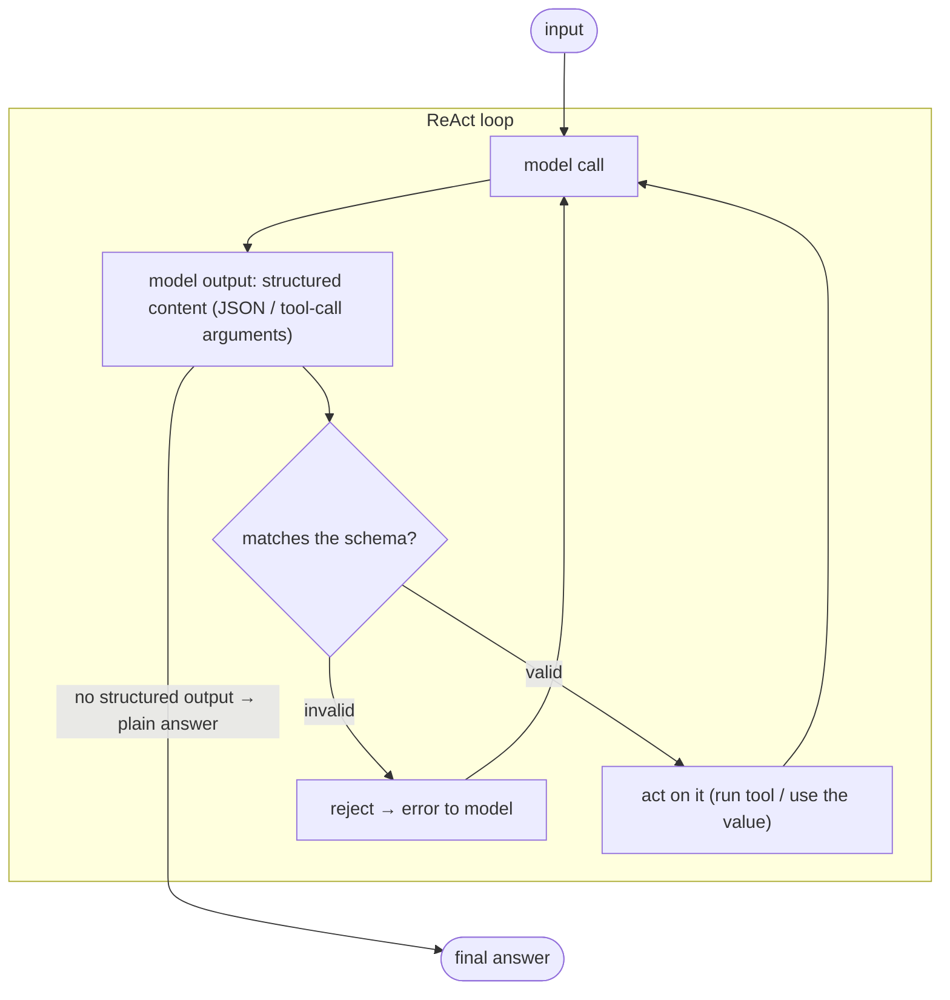
```mermaid
flowchart TD
    I(["input"]) --> M
    subgraph LOOP["ReAct loop"]
    direction TB
        M["model call"] --> O["model output: structured content (JSON / tool-call arguments)"]
        O --> V{"matches the schema?"}
        V -->|valid| ACT["act on it (run tool / use the value)"] --> M
        V -->|invalid| R["reject → error to model"] --> M
    end
    O -->|"no structured output → plain answer"| A(["final answer"])
    ACT ~~~ A
```

**Anchors:** &bull; `agent-core/openjiuwen/core/foundation/tool/function/function.py:65` — validate before invoking &bull; `agent-core/openjiuwen/core/common/utils/schema_utils.py:115` — `validate_with_schema` &bull; `agent-core/openjiuwen/agent_teams/tools/structured_output_tool.py:46` — schema-constrained structured output &bull; `agent-core/openjiuwen/agent_teams/workflow/engine/schema.py:74` — workflow/team schema coercion

## 11. How do you prevent an agent from getting stuck in an infinite tool-calling loop

**General:** Cap iterations, detect repetition (same tool and arguments repeatedly), and nudge or abort when no progress is made. Also cap rounds, tokens, and wall time.

**Jiuwen:** Inner cap `max_iterations`. Repetition detection: `ModelAnomalyDetectionRail` finds consecutive identical `(tool_name, canonical_args)` rounds and either folds them into a warning or aborts (its `ToolLoopCompactConfig` is disabled by default). Outer guards: `NoProgressAnswerEvaluator` for repeated short no-tool answers, `MaxRoundsEvaluator`, and the hard 50-round ceiling. Agent teams add dedicated detectors for repeated tools and ping-pong messaging.

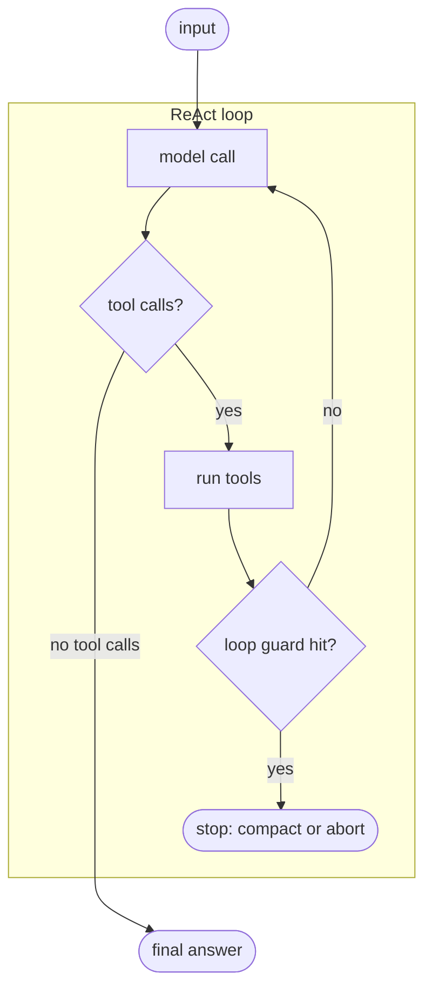
```mermaid
flowchart TD
    I(["input"]) --> M
    subgraph LOOP["ReAct loop"]
    direction TB
        M["model call"] --> D{"tool calls?"}
        D -->|yes| T["run tools"]
        T --> G{"loop guard hit?"}
        G -->|no| M
        G -->|yes| X(["stop: compact or abort"])
    end
    D -->|"no tool calls"| A(["final answer"])
    X ~~~ A
```

**Anchors:** &bull; `agent-core/openjiuwen/core/single_agent/agents/react_agent.py:288` — `max_iterations` &bull; `agent-core/openjiuwen/harness/rails/model_anomaly_detection_rail.py:386/466` — loop detection &bull; `agent-core/openjiuwen/harness/rails/model_anomaly_detection_rail.py:74` — `ToolLoopCompactConfig` (default off) &bull; `agent-core/openjiuwen/harness/schema/stop_condition.py:181` — `NoProgressAnswerEvaluator` &bull; `agent-core/openjiuwen/harness/deep_agent.py:2692` — hard 50-round ceiling &bull; `agent-core/openjiuwen/agent_teams/reliability/detectors/repeat_tool.py:15` — repeat-tool detector &bull; `agent-core/openjiuwen/agent_teams/reliability/detectors/pingpong.py:12` — ping-pong detector

## 12. How do you design retry logic that doesn't cause duplicate side effects, like sending an email twice

**General:** Never auto-retry non-idempotent actions blindly. Mark side-effecting operations, use idempotency keys so a repeated call is recognized, and prefer retry only for reads or for operations that are safe to repeat. On ambiguity, surface to a human rather than guess.

**Jiuwen:** `ToolCard.idempotent` defaults to `False` (secure-by-default), and `ToolCallResilienceRail._is_non_idempotent` is the guard that blocks retrying such tools. This is the only duplicate-side-effect protection: there is no idempotency-key store and no per-call dedup, so two identical *successful* side-effecting calls in one turn are not blocked — only heuristically nudged by repetition/loop detectors.

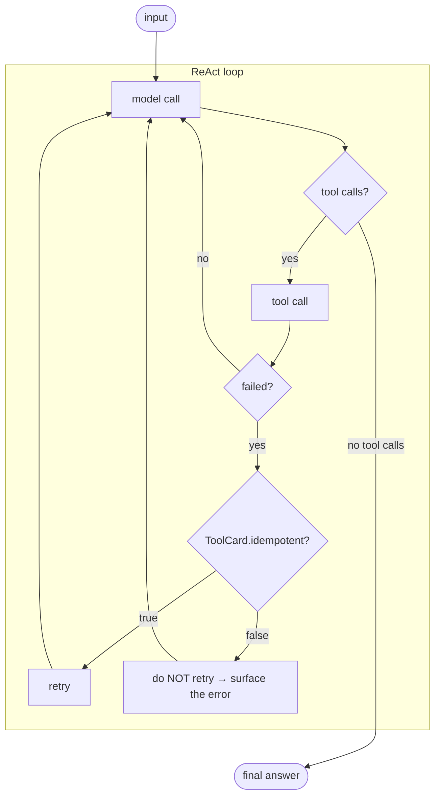
```mermaid
flowchart TD
    I(["input"]) --> M
    subgraph LOOP["ReAct loop"]
    direction TB
        M["model call"] --> D{"tool calls?"}
        D -->|yes| C["tool call"] --> F{"failed?"}
        F -->|no| M
        F -->|yes| ID{"ToolCard.idempotent?"}
        ID -->|true| RETRY["retry"] --> M
        ID -->|false| ERR["do NOT retry → surface the error"] --> M
    end
    D -->|"no tool calls"| A(["final answer"])
    ERR ~~~ A
```

**Anchors:** &bull; `agent-core/openjiuwen/core/foundation/tool/base.py:53` — `ToolCard.idempotent` defaults `False` &bull; `agent-core/openjiuwen/harness/rails/tool_call_resilience_rail.py:222` — `_is_non_idempotent` blocks retries

---

# Memory

## 13. What's the difference between short-term and long-term memory in an agent

**General:** Short-term is the live working context (recent turns, current task state) needed for the next model call. Long-term is durable knowledge distilled across sessions — facts, preferences, summaries — retrieved on demand.

**Jiuwen:** Short-term is `SessionModelContext` with a bounded message buffer. Long-term is `LongTermMemory`, with a typed taxonomy (`VARIABLE`, `USER_PROFILE`, `SEMANTIC_MEMORY`, `EPISODIC_MEMORY`, `SUMMARY`). The product adds a SQLite/FTS5 hybrid index over markdown memory files.

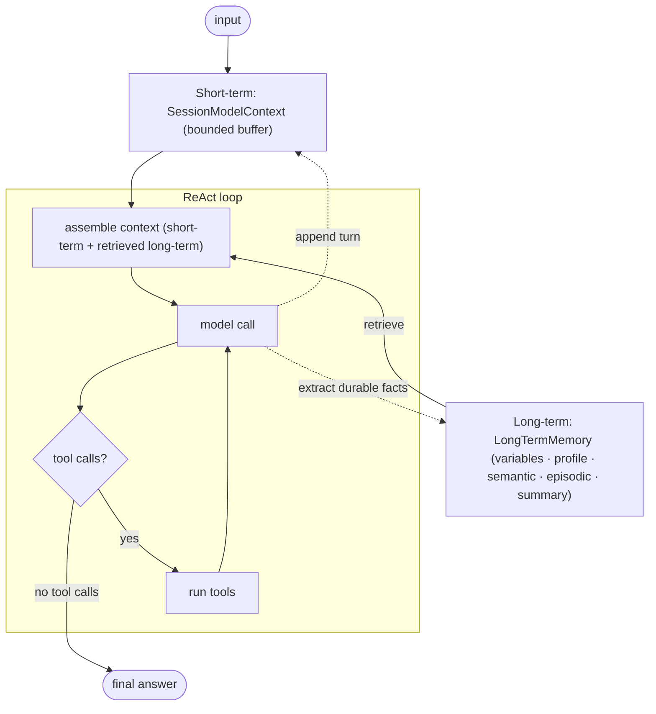
```mermaid
flowchart TD
    I(["input"]) --> ST
    subgraph LOOP["ReAct loop"]
    direction TB
        PRE["assemble context (short-term + retrieved long-term)"] --> M["model call"]
        M --> D{"tool calls?"}
        D -->|yes| T["run tools"] --> M
    end
    D -->|"no tool calls"| A(["final answer"])
    T ~~~ A
    ST["Short-term: SessionModelContext (bounded buffer)"] --> PRE
    LT["Long-term: LongTermMemory (variables · profile · semantic · episodic · summary)"] -->|retrieve| PRE
    M -.->|"extract durable facts"| LT
    M -.->|"append turn"| ST
```

**Anchors:** &bull; `agent-core/openjiuwen/core/context_engine/context/context.py:44` — `SessionModelContext` &bull; `agent-core/openjiuwen/core/context_engine/context/message_buffer.py:11` — `ContextMessageBuffer` &bull; `agent-core/openjiuwen/core/memory/long_term_memory.py:69` — `LongTermMemory` &bull; `../../../agent-core/openjiuwen/core/memory/manage/mem_model/memory_unit.py` — memory type taxonomy &bull; `jiuwenswarm/jiuwenswarm/agents/harness/common/memory/manager.py:56` — product hybrid memory index

## 14. How do you decide what to store in memory versus what to discard

**General:** Keep durable, reused, preference-like, and decision-relevant facts; discard transient chatter, redundant restatements, and stale/contradicted entries. Most systems extract candidates with an LLM, then dedupe and resolve conflicts against existing memory.

**Jiuwen:** An LLM classifier decides whether a turn has key information, and extraction runs only if flagged. Writes dedupe and resolve conflicts: `FragmentMemoryManager.add_memories` searches related old memories, invokes `MemUpdateChecker` (REDUNDANT/CONFLICTING/NONE), deletes redundant/conflicting IDs, and adds survivors. The product's sweeper prompt explicitly treats "output [] as the norm" and forbids generic/static facts.

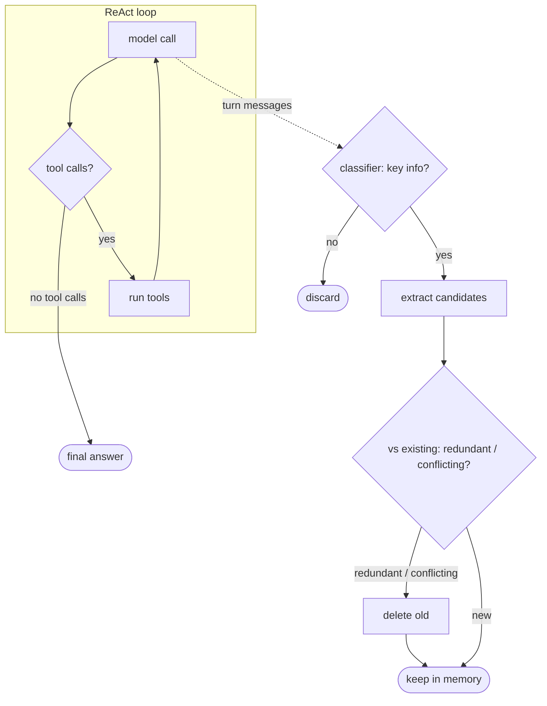
```mermaid
flowchart TD
    subgraph LOOP["ReAct loop"]
    direction TB
        M["model call"] --> D{"tool calls?"}
        D -->|yes| T["run tools"] --> M
    end
    D -->|"no tool calls"| A(["final answer"])
    T ~~~ A
    M -.->|"turn messages"| CL{"classifier: key info?"}
    CL -->|no| DISC(["discard"])
    CL -->|yes| EX["extract candidates"] --> CO{"vs existing: redundant / conflicting?"}
    CO -->|"redundant / conflicting"| DEL["delete old"] --> KEEP
    CO -->|new| KEEP(["keep in memory"])
```

**Anchors:** &bull; `agent-core/openjiuwen/core/memory/process/extract/memory_analyzer.py:26` — key-information classifier &bull; `agent-core/openjiuwen/core/memory/process/extract/generation.py:102` — extraction gated on the classifier &bull; `agent-core/openjiuwen/core/memory/manage/index/fragment_memory_manager.py:125` — dedupe + conflict resolution &bull; `agent-core/openjiuwen/core/memory/manage/update/mem_update_checker.py:22` — `CheckResult` &bull; `jiuwenswarm/jiuwenswarm/agents/harness/common/memory/dreaming/sweeper.py:617` — discard rules

## 15. How do you prevent memory from growing unbounded across a long session

**General:** Bound it on multiple axes: hard-drop or truncate the oldest context, offload large blobs, compact old tool results, summarize and archive, and cap the number of stored long-term entries.

**Jiuwen:** A bounded FIFO buffer drops the oldest messages beyond twice the limit. Budget guarding truncates oversized content with head/tail previews. Offloaders move large messages and tool results out of context. Compactors run at token thresholds. Long-term promotion is capped per session.

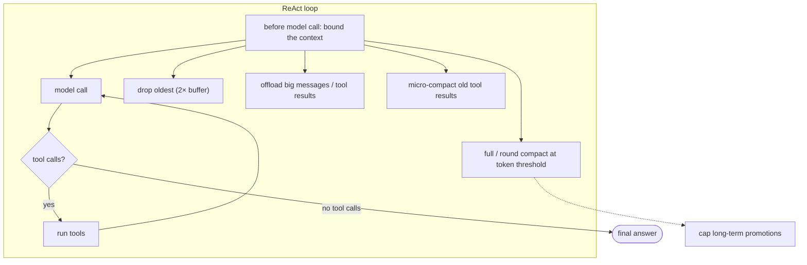
```mermaid
flowchart TD
    subgraph LOOP["ReAct loop"]
    direction TB
        PRE["before model call: bound the context"] --> M["model call"]
        M --> D{"tool calls?"}
        D -->|yes| T["run tools"] --> M
        PRE --> P1["drop oldest (2× buffer)"]
        PRE --> P2["offload big messages / tool results"]
        PRE --> P3["micro-compact old tool results"]
        PRE --> P4["full / round compact at token threshold"]
    end
    D -->|"no tool calls"| A(["final answer"])
    P4 ~~~ A
    P4 -.-> CAP["cap long-term promotions"]
```

**Anchors:** &bull; `agent-core/openjiuwen/core/context_engine/context/message_buffer.py:71` — drop oldest beyond 2× &bull; `agent-core/openjiuwen/core/context_engine/processor/budget_guard.py:88` — head/tail truncation &bull; `agent-core/openjiuwen/core/context_engine/processor/offloader/message_offloader.py:71` — offload large messages &bull; `agent-core/openjiuwen/core/context_engine/processor/offloader/tool_result_budget_processor.py:81` — tool-result budget &bull; `agent-core/openjiuwen/core/context_engine/processor/compressor/micro_compact_processor.py:47` — micro compaction &bull; `agent-core/openjiuwen/core/context_engine/processor/compressor/full_compact_processor.py:183` — full compaction &bull; `agent-core/openjiuwen/core/context_engine/processor/compressor/round_level_compressor.py:96` — round compaction &bull; `jiuwenswarm/jiuwenswarm/agents/harness/common/memory/dreaming/sweeper.py:36` — per-session promotion caps

## 16. When would you summarize past context instead of storing it in full

**General:** Summarize when old content is mostly used for gist, when raw tokens would crowd out the working context, or when detail can be re-fetched on demand. Keep verbatim what must be exact (recent turns, active file contents, decisions); summarize the rest and keep a way to recall it.

**Jiuwen:** `FullCompactProcessor` triggers at a token threshold, keeps the last N messages verbatim, and replaces the rest with a summary plus a boundary marker. `RoundLevelCompressor` does progressively aggressive summary passes at a context ratio and falls back to head/tail truncation. Replaced messages are archived and BM25-recalled, and state (plan, task, skills) is reinjected after compaction. A `SessionMemoryManager` writes structured background notes.

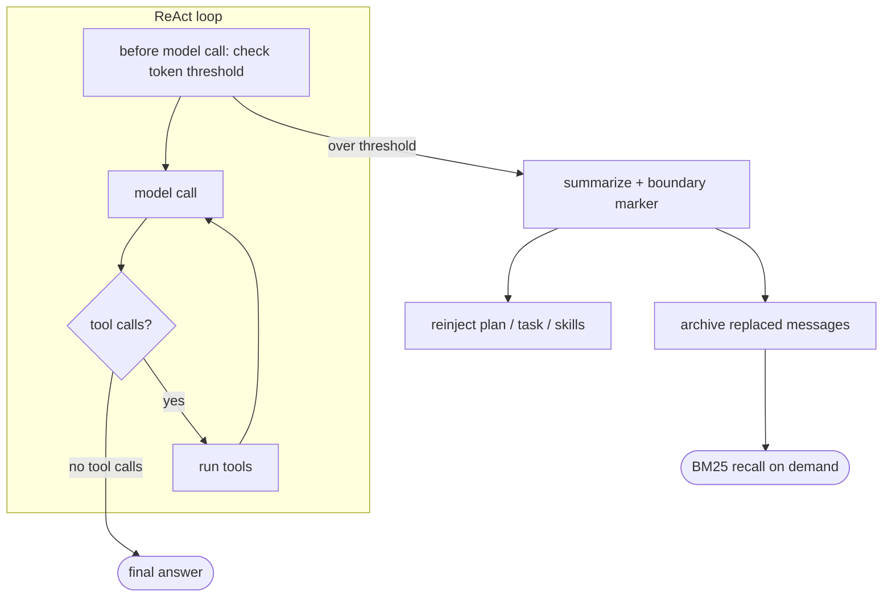
```mermaid
flowchart TD
    subgraph LOOP["ReAct loop"]
    direction TB
        PRE["before model call: check token threshold"] --> M["model call"]
        M --> D{"tool calls?"}
        D -->|yes| T["run tools"] --> M
    end
    D -->|"no tool calls"| A(["final answer"])
    T ~~~ A
    PRE -->|"over threshold"| SUM["summarize + boundary marker"]
    SUM --> ARCH["archive replaced messages"] --> REC(["BM25 recall on demand"])
    SUM --> REINJ["reinject plan / task / skills"]
```

**Anchors:** &bull; `agent-core/openjiuwen/core/context_engine/processor/compressor/full_compact_processor.py:407` — summary + boundary marker &bull; `agent-core/openjiuwen/core/context_engine/processor/compressor/full_compact_processor.py:183` — full-compact config &bull; `agent-core/openjiuwen/core/context_engine/processor/compressor/round_level_compressor.py:192` — progressive summary passes &bull; `../../../agent-core/openjiuwen/core/context_engine/processor/forked/compressor/recall/bm25.py` — recall of archived chunks &bull; `agent-core/openjiuwen/core/context_engine/processor/forked/reinjection/builders.py` — reinject state after compaction &bull; `agent-core/openjiuwen/core/context_engine/context/session_memory_manager.py:637` — structured background notes

---

# Multi-agent systems

## 17. When is a multi-agent system actually justified over a single well-designed agent

**General:** Justified when you genuinely need separated context/ownership — parallel independent workstreams, distinct tool/permission scopes, or specialization that would otherwise fight for one context window. Not justified merely for "more intelligence"; a single agent with good tools and memory often wins, and multi-agent adds coordination cost and failure modes.

**Jiuwen:** Supported but not the default: `agent_teams` provides a leader/teammate model with a DB task board and mailbox, and subagents provide intra-agent delegation. Subagents deliberately get isolated sessions/workspaces to avoid context pollution. The product's swarm is an assembly layer that composes team specs from config, not a case for multi-agent by itself.

```mermaid
flowchart TD
    N{"need separate context / ownership?"} -->|no| S(["single well-designed agent"])
    N -->|yes| Q{"parallel work or distinct tool/permission scopes?"}
    Q -->|no| S
    Q -->|yes| M(["multi-agent justified"])
```

**Anchors:** &bull; `../../../agent-core/openjiuwen/agent_teams` — leader/teammate team stack &bull; `agent-core/openjiuwen/harness/subagent_runtime/` — intra-agent delegation &bull; `agent-core/openjiuwen/harness/tools/subagent/task_tool.py:194` — isolated subagent session &bull; `jiuwenswarm/jiuwenswarm/agents/swarm/assembly.py:260` — product swarm assembly

## 18. What's the planner-executor pattern, and when do you need it

**General:** A planner produces the plan/steps; one or more executors carry them out, often with a supervisor re-planning. Useful when planning needs a global view while execution is parallelizable or specialized, and when separating "decide" from "do" improves reliability.

**Jiuwen:** Three patterns exist. (a) Scheduled-dispatch leader: `TeamScheduler` scans the task board and dispatches assigned pending tasks to idle members, then reviews. (b) Supervisor routing: `HierarchicalTeam` sends to a `SupervisorAgent` that calls sub-agents-as-tools via `P2PAbilityManager`. (c) A dedicated plan subagent invoked via `task_tool`.

```mermaid
flowchart TB
    L["leader / supervisor"] --> B["task board / plan"]
    B --> W1["member A"]
    B --> W2["member B"]
    B --> W3["member C"]
    W1 --> R["reviews"]
    W2 --> R
    W3 --> R
    R --> L
```

**Anchors:** &bull; `agent-core/openjiuwen/agent_teams/agent/scheduling/scheduler.py:92/208/239` — `TeamScheduler` scan/dispatch/review &bull; `../../../agent-core/openjiuwen/core/multi_agent/teams/hierarchical_msgbus` — supervisor routing &bull; `agent-core/openjiuwen/harness/subagents/plan_agent.py:88` — dedicated plan subagent

## 19. How do multiple agents communicate and hand off work to each other

**General:** Either a shared blackboard (task board/state) with a message bus, or direct handoffs where one agent transfers control and context to another. Handoffs must carry enough context and be bounded (max hops, allowed routes) to avoid ping-pong.

**Jiuwen:** A DB-backed mailbox plus event bus: `TeamMessageManager` persists messages and publishes events, and mention routing parses `@member`/`@all`. Direct handoff uses a signal tool (`HandoffTool`) with a `HandoffOrchestrator` enforcing max handoffs and allowed routes. Subagents are invoked synchronously by `task_tool` and return only the terminal result.

```mermaid
flowchart LR
    A["agent A"] --> MB["mailbox (DB) + event bus"] --> B["agent B"]
    A -->|HandoffTool| HO["HandoffOrchestrator: max hops, allowed routes"] --> B
    P["parent"] -->|task_tool| SUB["subagent: isolated session, terminal result only"]
```

**Anchors:** &bull; `agent-core/openjiuwen/agent_teams/tools/message_manager.py:27/60` — `TeamMessageManager` &bull; `agent-core/openjiuwen/agent_teams/interaction/router.py:120` — mention routing &bull; `agent-core/openjiuwen/core/multi_agent/teams/handoff/handoff_tool.py:17` — `HandoffTool` &bull; `agent-core/openjiuwen/core/multi_agent/teams/handoff/handoff_orchestrator.py:14` — bounded handoff &bull; `agent-core/openjiuwen/harness/tools/subagent/task_tool.py:889` — synchronous subagent invocation

## 20. How do you prevent multiple agents from producing conflicting or redundant results

**General:** Give each unit of work a single owner, enforce one-active-task-per-worker, arbitrate claims atomically, reassign rather than release (to avoid race windows), dedupe dispatch, and isolate workspaces so edits don't collide.

**Jiuwen:** One-active-task-per-member invariant, atomic compare-and-swap claim, reassign instead of release, spawn idempotency for teammates and subagents, and per-member worktree/workspace isolation. Reliability detectors catch ping-pong and repeated tools.

```mermaid
flowchart TD
    T["member claims a task"] --> CAS{"CAS: assignee NULL and pending?"}
    CAS -->|yes| OWN["owns the task"]
    CAS -->|no| LOSE(["claim fails"])
    OWN --> RE["reassign (not release) on handoff"]
    OWN --> WT["isolated worktree"]
```

**Anchors:** &bull; `agent-core/openjiuwen/agent_teams/tools/task_manager.py:1581` — one-active-task-per-member &bull; `agent-core/openjiuwen/agent_teams/tools/database/task_dao.py:634` — atomic CAS claim &bull; `agent-core/openjiuwen/agent_teams/tools/task_manager.py:1673` — reassign instead of release &bull; `agent-core/openjiuwen/agent_teams/agent/spawn_manager.py:73` — teammate spawn idempotency &bull; `agent-core/openjiuwen/harness/subagent_runtime/control.py:169` — reject live subagent re-spawn &bull; `../../../agent-core/openjiuwen/agent_teams/worktree` — per-member worktree isolation &bull; `agent-core/openjiuwen/agent_teams/reliability/` — conflict detectors

---

# Cost and production

## 21. How do you control cost when an agent can call tools repeatedly

**General:** Bound the loop (max iterations/rounds/time), cap tokens, cache aggressively (prompt/prefix cache), make cheap models do cheap work, and surface per-run cost so it can be budgeted. Retries and huge tool outputs are common hidden cost sources.

**Jiuwen:** Iteration and round caps plus wall-clock timeout. `BudgetNoticeRail` injects "wind down" prompts near a limit. The product enforces a real session cost cap, checked pre-flight and mid-stream. Team workflows bill real token usage and force-finish on exhaustion.

```mermaid
flowchart TD
    I(["input"]) --> M
    subgraph LOOP["ReAct loop"]
    direction TB
        M["model call"] --> D{"tool calls?"}
        D -->|yes| T["run tools"] --> M
        BN["BudgetNoticeRail: wind-down prompt"] -.-> M
        SC["session cost cap (pre-flight + mid-stream)"] -.-> M
        TL["team token ledger: force-finish on exhaustion"] -.-> T
        CAP["iteration / round / time caps"] -.-> M
    end
    D -->|"no tool calls"| A(["final answer"])
    T ~~~ A
```

**Anchors:** &bull; `agent-core/openjiuwen/core/single_agent/agents/react_agent.py:288` — iteration cap &bull; `agent-core/openjiuwen/harness/deep_agent.py:2692` — round cap &bull; `agent-core/openjiuwen/harness/schema/stop_condition.py:162` — `TimeoutEvaluator` &bull; `agent-core/openjiuwen/harness/rails/budget_notice_rail.py:83` — near-limit prompting &bull; `jiuwenswarm/jiuwenswarm/server/runtime/usage_cost.py:101/171` — session usage + cost-limit check &bull; `jiuwenswarm/jiuwenswarm/server/runtime/agent_adapter/interface_deep.py:16043/17191` — pre-flight and mid-stream enforcement &bull; `agent-core/openjiuwen/agent_teams/workflow/backends/budget_rail.py:59/73` — team token billing + force-finish

## 22. How do you set limits so an agent doesn't run away with token spend

**General:** Configure hard token and cost ceilings per request/session/task, enforce them in the loop (not just report them), warn near the limit, and fail closed. Distinct from round/time caps, which bound behavior but not spend.

**Jiuwen:** Two mechanisms, with a caveat. The obvious path — `TokenBudgetEvaluator` driven by `LoopCoordinator.add_token_usage` — is wired but not enforced in production: `add_token_usage` has no production caller, so the task-loop token cap stays inert. The real, enforced limit is the product session cost cap, plus team/swarmflow token ledgers and the auto-harness `SessionBudgetController`. Rounds and wall-clock limits are enforced normally.

```mermaid
flowchart TD
    I(["input"]) --> M
    subgraph LOOP["ReAct loop"]
    direction TB
        M["model call"] --> D{"tool calls?"}
        D -->|yes| T["run tools"] --> M
        EV["TokenBudgetEvaluator + add_token_usage"] -.->|"no production caller → inert"| M
        SC["session cost cap"] -.->|"actually enforced"| M
    end
    D -->|"no tool calls"| A(["final answer"])
    T ~~~ A
```

**Anchors:** &bull; `agent-core/openjiuwen/harness/task_loop/loop_coordinator.py:114` — `add_token_usage` (no production caller) &bull; `agent-core/openjiuwen/harness/schema/stop_condition.py:143` — `TokenBudgetEvaluator` &bull; `jiuwenswarm/jiuwenswarm/server/runtime/usage_cost.py:171` — enforced session cost cap &bull; `agent-core/openjiuwen/agent_teams/workflow/engine/budget.py:23` — `BudgetLedger` &bull; `agent-core/openjiuwen/auto_harness/infra/session_budget.py:15` — `SessionBudgetController`

## 23. How would you monitor an agent in production to catch failures before users do

**General:** Trace every run (spans for model/tool/subagent), emit token/cost/latency metrics, persist session history, alert on error rates and limit hits, and offer a replay/analysis path. You need per-run attribution to tell a tool failure from a model failure.

**Jiuwen:** Structured span tracing from the agent tier: `AgentObservabilityRail` opens task/model/tool spans, and the shared OTel runtime exports to OTLP/Langfuse/console/local JSONL. Token/cost and TTFT/TPOT attributes are recorded per call. The product persists a lossless trajectory store in SQLite and JSONL session history, with a TraceHound replay/analysis path.

```mermaid
flowchart TB
    AG["agent"] --> SP["spans: task / model / tool"]
    SP --> EXP["exporters: OTLP / Langfuse / local JSONL"]
    SP --> TS["trajectory store (SQLite)"]
    TS --> RH["TraceHound replay / analysis"]
    SP --> ATTR["token/cost + TTFT/TPOT attributes"]
```

**Anchors:** &bull; `agent-core/openjiuwen/harness/observability/rail.py:354/777/886` — task/model/tool spans &bull; `agent-core/openjiuwen/extensions/observability/runtime.py:104/397` — OTel runtime + exporter selection &bull; `agent-core/openjiuwen/extensions/observability/file_exporter.py:52` — local JSONL exporter &bull; `agent-core/openjiuwen/extensions/observability/callback_handler.py:1189/512/1253` — usage, TTFT, TPOT &bull; `jiuwenswarm/jiuwenswarm/observability/store.py:350` — trajectory store &bull; `jiuwenswarm/jiuwenswarm/server/runtime/session/session_history.py:33` — JSONL session history &bull; `jiuwenswarm/jiuwenswarm/server/agent_ws_server.py:12629` — TraceHound analysis

## 24. What happens to your agent's cost and latency at 10x current usage

**General:** You hit dependencies and queues before arithmetic: provider rate limits and 429s, serialized tool/DB access, memory pressure from context, and connection pools. Costs scale roughly linearly with tokens but can super-linearly if retries, cache misses, or coordination overhead rise. The fixes are caching, concurrency limits, sharding/queues, and cheaper routing.

**Jiuwen:** No specific 10x scaling test or autoscaling code exists in these trees; the relevant pressure points are traceable: tool execution already serializes file-path tools and barriers, session cost/token accumulation is per-session, and observability uses bounded-queue single-writer sinks with drop counters and backpressure stats. The inference router in the separate `agent-tools` repo is where cache-aware load balancing for scale lives, not here.

```mermaid
flowchart LR
    U["10x traffic"] --> RL["provider rate limits / 429"]
    U --> SER["serialized tools / DB"]
    U --> MEM["context memory pressure"]
    U --> POOL["connection pools"]
    RL --> FIX(["caching · concurrency limits · queues · cheaper routing"])
    SER --> FIX
    MEM --> FIX
    POOL --> FIX
```

**Anchors:** &bull; `agent-core/openjiuwen/core/single_agent/ability_manager.py:385` — serialized tool lanes/barriers &bull; `jiuwenswarm/jiuwenswarm/observability/sink.py:67/321` — bounded-queue sink + backpressure stats

---

# Safety

## 25. How do you prevent an agent from taking a destructive or irreversible action by mistake

**General:** Layer defenses: classify actions by risk, deny known-dangerous patterns, require approval for the ambiguous middle, and prefer reversible operations (dry-run, snapshot, sandbox) over hard blocks alone. Fail closed — unknown should mean "ask", not "allow".

**Jiuwen:** A layered permission engine returns `ALLOW`/`ASK`/`DENY`, merging tool policy + file guard + net guard by `strictest`. Tool policy is tiered and falls back to ASK when nothing matches. Shell commands are parsed with a tree-sitter AST; too-complex or unparseable-but-risky input is floored to ASK. Builtin rules deny reverse shells, fork bombs, disk writes, and shutdown/reboot, and deny sensitive paths like `~/.ssh/**` and `**/.env`. Injection via backticks/`$()` is blocked before execution.

```mermaid
flowchart TD
    I(["input"]) --> M
    subgraph LOOP["ReAct loop"]
    direction TB
        M["model call"] --> D{"tool calls?"}
        D -->|yes| P["permission check before running the tool"]
        P --> TP["tool policy (tiered)"]
        P --> FG["file guard"]
        P --> NG["net guard"]
        TP --> MG{"merge by strictest"}
        FG --> MG
        NG --> MG
        MG -->|allow| T["run tool"] --> M
        MG -->|ask| H["human approval"] --> M
        MG -->|deny| B["blocked → error to model"] --> M
    end
    D -->|"no tool calls"| A(["final answer"])
    T ~~~ A
```

**Anchors:** &bull; `agent-core/openjiuwen/harness/security/permission_engine/core.py:272` — `check_permission` merge &bull; `agent-core/openjiuwen/harness/security/permission_engine/toolguard/tool_policy.py:502/588` — tiered policy, ASK fallback &bull; `agent-core/openjiuwen/harness/security/permission_engine/toolguard/shell_ast.py:82` — tree-sitter shell parse &bull; `agent-core/openjiuwen/harness/security/permission_engine/toolguard/tool_policy.py:409` — risky-structure ASK floor &bull; `agent-core/openjiuwen/harness/resources/builtin_rules.yaml:10/148` — builtin deny rules + sensitive paths &bull; `agent-core/openjiuwen/harness/tools/shell/bash/_security.py:40` — injection blocking

## 26. How do you handle untrusted content an agent encounters through a tool result

**General:** Treat tool output as untrusted data, never as instructions. Delimit and label it as data, strip control/escape sequences, and never let it silently trigger privileged actions without re-checking permissions. Prompt injection is a real threat because tool output flows straight into the model context.

**Jiuwen:** Weakest area. Tool results are returned directly as `ToolMessage` with no untrusted-data framing or sanitization. Sanitizer helpers exist but have no production callers. The only code-level defense is an opt-in heuristic that scans model input for phrases like "ignore all previous instructions" and force-finishes; everything else is prompt-level instruction to the model. There is no mandatory untrusted-tool-result seam.

```mermaid
flowchart TD
    I(["input"]) --> M
    subgraph LOOP["ReAct loop"]
    direction TB
        M["model call"] --> D{"tool calls?"}
        D -->|yes| T["run tool"] --> RES["tool result → ToolMessage"]
        RES --> GAP["no untrusted-data framing or sanitization"] --> M
        H["opt-in heuristic scan"] -.->|only partial guard| M
        SAN["sanitize.py helpers"] -.->|no production callers| RES
    end
    D -->|"no tool calls"| A(["final answer"])
    GAP ~~~ A
    GAP -.-> RISK(["prompt-injection risk"])
```

**Anchors:** &bull; `agent-core/openjiuwen/core/single_agent/ability_manager.py:1275` — tool result returned directly &bull; `agent-core/openjiuwen/harness/prompts/sanitize.py:20` — sanitizer (no production callers) &bull; `agent-core/openjiuwen/auto_harness/rails/security_rail.py:116` — opt-in input heuristic &bull; `agent-core/openjiuwen/harness/personal_context/context_pipeline.py:8441` — prompt-level untrusted-data instruction

## 27. Would you let an agent execute code automatically, or require a human approval step, and when

**General:** Default to sandboxing for automatic execution, and require approval for actions that are irreversible, touch production, or exceed the sandbox. In practice: read-only and sandboxed writes auto-allow; destructive or out-of-scope operations ask; never rely on the prompt alone.

**Jiuwen:** Human approval is fully implemented: `PermissionInterruptRail` intercepts every tool, and on ASK raises an interrupt carrying a `ConfirmPayload`; the agent pauses via `AbortError` and resumes with the user's decision, supporting session "remember" and persisted allow rules. Team ASK routes to the leader. Code execution isolation is opt-in: local mode is policy-limited but not OS-isolated; real isolation requires the external `jiuwenbox` sandbox, which uses Linux bwrap/Landlock/namespaces and is skipped off-Linux. Enforcement is config-gated: no `permissions.enabled` means no permission rail.

```mermaid
flowchart TD
    I(["input"]) --> M
    subgraph LOOP["ReAct loop"]
    direction TB
        M["model call"] --> D{"tool calls?"}
        D -->|"code action"| P{"permissions.enabled?"}
        P -->|no| RUN["runs (no rail)"]
        P -->|yes| DEC{"ALLOW / ASK / DENY"}
        DEC -->|allow| RUN
        DEC -->|ask| HUM["pause: human approval → resume"] --> RUN
        DEC -->|deny| BLK["blocked"]
        RUN --> SB{"sandbox mode?"}
        SB -->|local| LOC["policy-only, not OS-isolated"]
        SB -->|jiuwenbox| ISO["Linux bwrap / Landlock / namespaces"]
        RUN --> M
        BLK --> M
    end
    D -->|"no tool calls"| A(["final answer"])
    LOC ~~~ A
```

**Anchors:** &bull; `agent-core/openjiuwen/harness/rails/security/tool_security_rail.py:57/404/594` — intercept every tool; ask; raise interrupt &bull; `agent-core/openjiuwen/harness/rails/interrupt/interrupt_base.py:237` — pause via `AbortError` &bull; `agent-core/openjiuwen/harness/rails/security/tool_security_rail.py:729/298` — session remember, persisted allow rules &bull; `agent-core/openjiuwen/agent_teams/rails/team_permission_rail.py:43` — team ASK to leader &bull; `agent-core/openjiuwen/core/sys_operation/local/code_operation.py:155` — local exec (policy-limited, not isolated) &bull; `jiuwenswarm/jiuwenswarm/server/sandbox/jiuwenbox_runner.py:258` — external sandbox launcher &bull; `jiuwenswarm/jiuwenswarm/server/agent_ws_server.py:924` — Linux-only isolation (bwrap/Landlock/namespaces) &bull; `agent-core/openjiuwen/harness/deep_agent.py:765` — permission rail only when `permissions.enabled`

---

## Summary: strong vs weak in Jiuwen

| Area | Strength | Notes |
|---|---|---|
| Agent loop, stop conditions | Strong | nested loop + evaluator chain + hard ceilings |
| Tool schema/dispatch | Strong | schema-driven, validated, multi-provider |
| Tool failure + retries | Strong | resilience rail, JSON repair, idempotency-aware retry |
| Duplicate side effects | Weak | no idempotency key / call dedup; only blocks retries |
| Structured output validation | Strong | Pydantic/JSON-Schema at tool and workflow boundaries |
| Loop prevention | Strong | iteration/round/time/no-progress + dedicated detectors |
| Memory + compaction | Strong | extraction, conflict resolution, multi-stage compaction, recall |
| Multi-agent coordination | Strong | task board CAS, mailbox, handoff limits, reliability detectors |
| Cost control | Mixed | session cost cap enforced; task-loop token cap wired but inert |
| Observability | Strong | span tree, OTel exporters, trajectory store, replay |
| Destructive-action prevention | Strong | layered permission engine, AST guard, fail-closed ASK |
| Untrusted tool output / injection | Weak | no enforced untrusted-data seam; sanitizer unused |
| Code-exec sandboxing | Mixed | full isolation exists but opt-in (Linux-only external sandbox) |
