# AI Engineer interview questions — levelled (Beginner / Intermediate / Advanced / LLM+RAG / Agents)

Curated set of the most frequently recurring AI Engineer interview questions, organised by difficulty tier. The structure — foundations first, then system-level judgment — mirrors how well-calibrated AI engineering interviews actually progress. Beginner and Intermediate questions test that you know what is happening beneath the frameworks; Advanced and above test that you can reason about tradeoffs in real systems.

> **The pattern worth noticing:** the boundary between tiers is not about difficulty in the abstract — it is about proximity to the hardware/math layer. Beginner = terminology and concepts. Intermediate = mechanisms and failure modes. Advanced = architectural judgment and production tradeoffs. Interviewers who ask a Beginner question and get a rote answer will immediately follow up with an Intermediate version of the same concept; knowing both layers of every answer is what separates a pass from a strong hire.

---

# Beginner Level

## 1. What is the difference between AI, Machine Learning, and Deep Learning?

**General:** Nested definitions. Artificial Intelligence is the broadest umbrella: any technique that makes a machine exhibit behaviour associated with human intelligence (search, logic, ML, etc.). Machine Learning is the subset where the machine learns from data rather than following hand-coded rules — the program improves with experience. Deep Learning is the sub-subset of ML that uses neural networks with many layers (depth), enabling end-to-end learning of representations from raw inputs like images, text, or audio without manual feature engineering.

Concretely: a rule-based spam filter is AI but not ML. A logistic regression spam classifier is AI and ML but not deep learning. A transformer-based spam classifier is AI, ML, and deep learning.

**Jiuwen:** The framework sits at the Deep Learning layer and above. It calls LLMs (the output of deep learning research), builds agentic loops on top of them, and provides retrieval and evaluation tooling. There is no hand-coded rule system (not just AI), no classical ML (no logistic regression, decision trees), and no custom DL training — it calls hosted or locally loaded models that are themselves the output of deep learning.

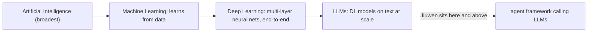

**Anchors:** &bull; `agent-core/openjiuwen/core/foundation/llm/model_clients/` — API clients calling hosted LLMs (deep learning output) &bull; `agent-core/openjiuwen/agent_evolving/agent_rl/` — SFT/PPO/GRPO training subsystem; the only place the framework interacts with DL training

---

## 2. What is supervised vs unsupervised vs reinforcement learning?

**General:**
- **Supervised:** Training data has labelled input-output pairs `(x, y)`. The model learns a mapping `f(x) → y` by minimising a loss between its predictions and the labels. Examples: image classification, sentiment analysis, named-entity recognition.
- **Unsupervised:** Training data has no labels. The model discovers structure — clusters, embeddings, density — directly from the inputs. Examples: k-means clustering, PCA, autoencoders, embedding models trained with contrastive loss.
- **Reinforcement learning:** An agent takes actions in an environment, receives scalar reward signals, and learns a policy that maximises expected cumulative reward. No labelled correct action; the signal is the reward. Examples: game-playing agents, RLHF for LLM alignment.

Most LLM training is a combination: pre-training is self-supervised (predicting next token — structurally supervised but labels come from the data itself), fine-tuning is supervised, RLHF is reinforcement learning on top.

**Jiuwen:** All three appear. The model clients call LLMs pre-trained with self-supervised next-token prediction. The `agent_rl/` subsystem runs SFT (supervised) and PPO/GRPO (reinforcement learning). Embedding models used in the retrieval layer are trained with contrastive loss (unsupervised/self-supervised). Retrieval evaluation uses supervised signals (relevance labels).

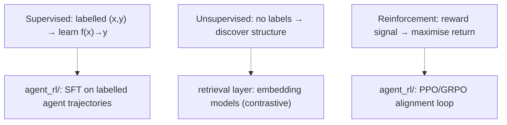

**Anchors:** &bull; `agent-core/openjiuwen/agent_evolving/agent_rl/` — SFT + PPO/GRPO training &bull; `agent-core/openjiuwen/extensions/knowledge_base/retrieval/vector_retriever.py` — embedding-based retrieval (unsupervised representation)

---

## 3. What is overfitting, and how do you prevent it?

*Also covered in `source/real-interview-ai-engineer-4rounds_for_engineers.md` (Round 2, entry 12). Full General + Jiuwen answer there. See topic 00-6 once compiled.*

**General (summary):** A model overfits when it memorises training data including noise, so training loss falls but validation loss rises. Prevention: more data, regularisation (L2 weight decay, dropout), early stopping, reducing model capacity, or LoRA/PEFT for LLM fine-tuning.

---

## 4. What is the bias-variance tradeoff?

**General:** Every model's generalisation error decomposes into three terms: bias (error from wrong assumptions — underfitting), variance (error from sensitivity to training set fluctuations — overfitting), and irreducible noise. High bias → model too simple, misses patterns. High variance → model too complex, fits noise. The tradeoff: reducing bias (adding complexity) tends to increase variance and vice versa. The goal is to find the sweet spot that minimises total expected error on unseen data.

In modern large models, the "double descent" phenomenon complicates the classic picture: very high-capacity models can re-enter a low-variance regime after the classical overfitting peak if trained with enough data and regularisation. This is why LLMs with billions of parameters can still generalise.

**Jiuwen:** Not directly implemented as a concept in the inference framework. In the training subsystem (`agent_rl/`), the tradeoff manifests as a hyperparameter concern: learning rate, regularisation strength (weight decay), and SFT epoch count all control where on the bias-variance curve the fine-tuned model lands. The evaluation harness in `agent_evolving/eval/` tracks the signal (train vs validation metric divergence).

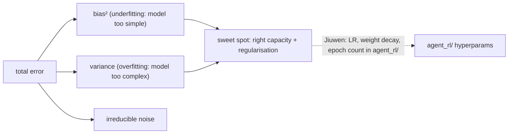

**Anchors:** &bull; `agent-core/openjiuwen/agent_evolving/agent_rl/` — training hyperparams controlling the bias-variance balance &bull; `agent-core/openjiuwen/agent_evolving/eval/` — validation metrics to detect divergence

---

## 5. What is gradient descent, and how does it work?

*Also covered in `source/real-interview-ai-engineer-4rounds_for_engineers.md` (Round 1, entry 1). Full General + Jiuwen answer there. See topic 00-2 once compiled.*

**General (summary):** An iterative optimisation algorithm that moves model parameters in the direction of steepest descent of the loss function by subtracting `learning_rate × gradient` at each step. SGD uses a single sample or mini-batch; full-batch GD uses the entire dataset.

---

## 6. What is the difference between a parameter and a hyperparameter?

**General:** Parameters are the learned weights of the model — the numbers that change during training through gradient descent (`W`, `b` in a linear layer; the attention projection matrices in a transformer). The training data determines their values.

Hyperparameters are the configuration choices made before or during training that are not learned from data: learning rate, batch size, number of layers, dropout rate, regularisation coefficient, number of training epochs, LoRA rank. You set them; the training process does not change them automatically.

A common source of confusion: context window size, temperature, and top-p are inference-time hyperparameters — they do not affect the weights, only how the model generates at prediction time.

**Jiuwen:** Model weights are managed by PyTorch/veRL in the `agent_rl/` training subsystem. Inference-time hyperparameters (temperature, top-p, max tokens, context window) are `ModelRequestConfig` fields. Training hyperparameters are `agent_rl/` config. The framework makes no distinction in its config schema — both kinds of hyperparameters are plain config fields.

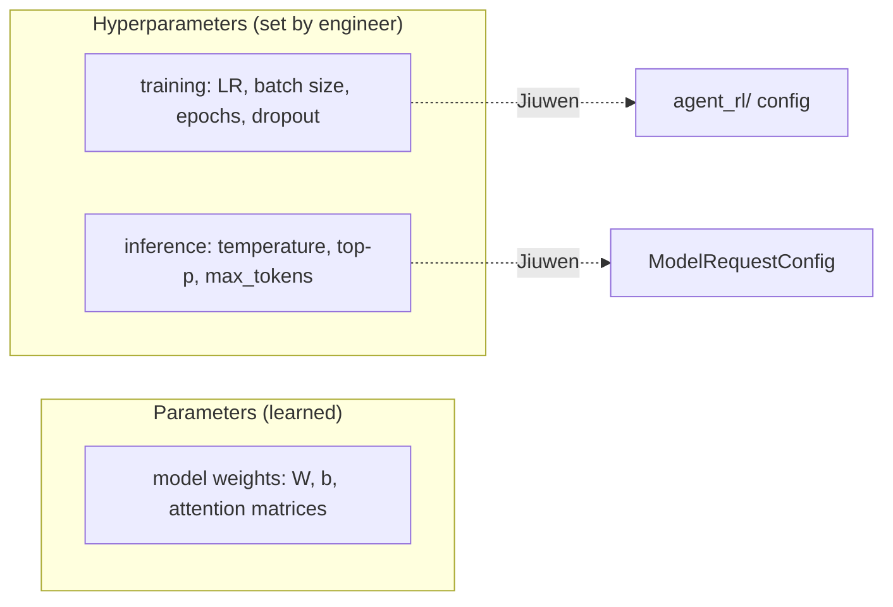

**Anchors:** &bull; `agent-core/openjiuwen/core/foundation/llm/schema/config.py` — `ModelRequestConfig`: temperature, top-p, max_tokens (inference hyperparams) &bull; `agent-core/openjiuwen/agent_evolving/agent_rl/` — training hyperparams (learning rate, epochs, etc.)

---

# Intermediate Level

## 7. What is backpropagation, and how does it update weights?

*Also covered in `source/real-interview-ai-engineer-4rounds_for_engineers.md` (Round 2, entry 5). Full General + Jiuwen answer there. See topic 00-1 once compiled.*

**General (summary):** The chain rule applied backwards through the computation graph to compute `∂L/∂w` for every weight. PyTorch's autograd records the graph during the forward pass and traverses it in reverse during `.backward()`. The optimiser then applies `w -= lr × w.grad`.

---

## 8. What is the vanishing/exploding gradient problem, and how do you fix it?

*Also covered in `source/real-interview-ai-engineer-4rounds_for_engineers.md` (Round 2, entry 6). Full General + Jiuwen answer there. See topic 00-3 once compiled.*

---

## 9. What is the difference between batch normalization and layer normalization?

*Also covered in `source/real-interview-ai-engineer-4rounds_for_engineers.md` (Round 2, entry 7). Full General + Jiuwen answer there. See topic 00-4 once compiled.*

---

## 10. What is dropout, and why does it help generalization?

**General:** Dropout is a regularisation technique applied during training: each neuron's activation is independently zeroed out with probability `p` (typically 0.1–0.5) on each forward pass. At inference time, dropout is disabled and activations are scaled by `1/(1-p)` (or equivalently, weights are scaled during training — "inverted dropout").

Why it works: by randomly removing neurons, the network cannot rely on any single activation — it is forced to learn redundant, distributed representations. This prevents co-adaptation (where neurons learn to fix each other's mistakes in a memorisation-specific way). The effect is similar to training an ensemble of `2^n` different thinned networks and averaging them at inference.

In transformers, dropout is applied to attention weights, FFN layers, and embedding layers. In LLM fine-tuning (including LoRA), dropout on the low-rank matrices is a key regularisation knob.

**Jiuwen:** Not implemented in the inference layer. In the training subsystem `agent_rl/`, dropout rates are hyperparameters forwarded to veRL/PyTorch. For LoRA fine-tuning, LoRA dropout is a config parameter on the PEFT adapter.

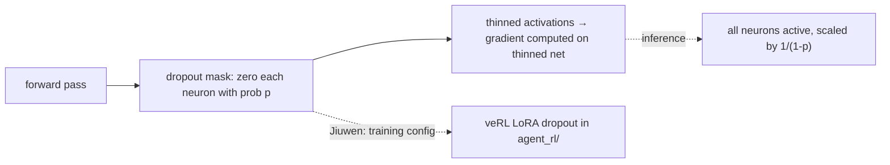

**Anchors:** &bull; `agent-core/openjiuwen/agent_evolving/agent_rl/` — dropout rate as a training hyperparameter forwarded to veRL

**Gap.** Absent from inference layer. A training hyperparameter in `agent_rl/`.

---

## 11. What is the difference between CNNs and RNNs, and when would you use each?

**General:** Convolutional Neural Networks (CNNs) apply learned filters spatially across the input using shared weights — the same filter scans every position. This makes them translation-invariant and efficient for structured grid data (images, audio spectrograms, 1D signals). They are not designed for variable-length sequential dependencies.

Recurrent Neural Networks (RNNs, LSTMs, GRUs) process sequences step by step, maintaining a hidden state that carries information from previous steps. They are designed for sequential data where order matters and length varies: time series, text (pre-transformer), audio frames. The main weakness: the hidden state is a bottleneck for long sequences, and vanishing gradients make very long-range dependencies hard to learn.

Transformers have largely replaced RNNs for text because attention can look at any position directly. CNNs remain dominant for image tasks and appear in hybrid architectures (e.g., convolutions in early vision layers feeding into attention).

**Jiuwen:** Neither CNNs nor RNNs are implemented in the framework. The framework calls hosted transformer-based LLMs for text. Image inputs go through a vision encoder (typically a ViT — a transformer applied to image patches, not a CNN) in multimodal models. There is no RNN or CNN code in the codebase.

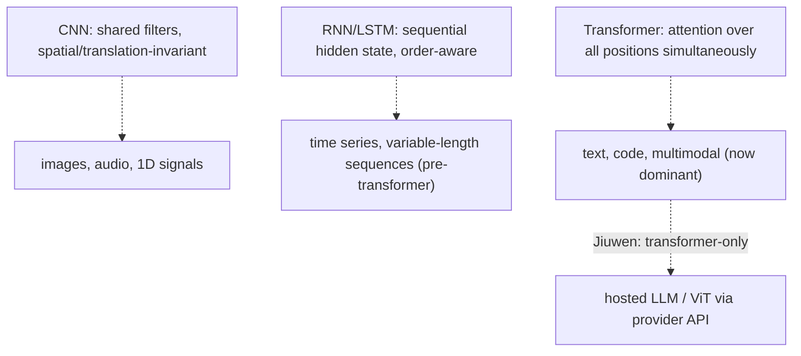

**Anchors:** &bull; `agent-core/openjiuwen/core/foundation/llm/model_clients/` — calls transformer-based LLMs; no CNN/RNN code

**Gap.** Neither CNNs nor RNNs are present. The framework is transformer-only at the model layer.

---

## 12. What is transfer learning, and when is it useful?

**General:** Transfer learning is using a model trained on one task or dataset as the starting point for a different (but related) task, rather than training from scratch. The pre-trained model has already learned general representations (edges in CNNs, grammar and semantics in LLMs) that transfer across tasks.

Two common forms:
- **Feature extraction:** freeze the pre-trained weights, only train a new task-specific head on top.
- **Fine-tuning:** continue training all or some of the pre-trained weights on the new task's data (often with a lower learning rate).

When is it useful: almost always when labelled data for your specific task is limited, when compute budget is constrained, or when the source and target domains are related. The alternative — training from scratch — requires orders of magnitude more data and compute.

In the LLM context: every use of a foundation model (GPT-4, LLaMA, Claude) is transfer learning. Fine-tuning (SFT, LoRA/PEFT) is explicit transfer learning where the base model's weights are adapted to a narrower task.

**Jiuwen:** The framework is built entirely on transfer learning: it calls pre-trained LLMs for all reasoning, and the `agent_rl/` subsystem performs fine-tuning (SFT + PPO/GRPO via veRL) — which is transfer learning from the base LLM to an agent-specific policy. LoRA adapters in `agent_rl/` are the parameter-efficient fine-tuning variant.

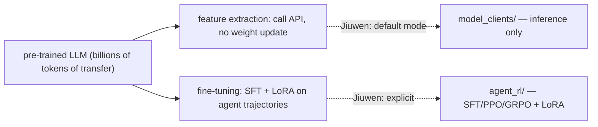

**Anchors:** &bull; `agent-core/openjiuwen/core/foundation/llm/model_clients/` — feature extraction (calling pre-trained LLMs) &bull; `agent-core/openjiuwen/agent_evolving/agent_rl/` — SFT + PPO/GRPO; explicit fine-tuning / transfer learning

---

## 13. How do you evaluate a classification model beyond accuracy?

**General:** Accuracy is misleading on imbalanced datasets (a classifier that always predicts the majority class can achieve 95% accuracy on a 95/5 split). Richer metrics:

- **Precision / Recall / F1** — precision = TP/(TP+FP), recall = TP/(TP+FN), F1 = harmonic mean. Precision matters when false positives are costly (spam filters); recall matters when false negatives are costly (cancer screening).
- **Confusion matrix** — reveals per-class patterns: which classes are being confused with each other.
- **ROC-AUC** — area under the Receiver Operating Characteristic curve; measures ranking quality across all thresholds. Threshold-independent.
- **PR-AUC** — area under the Precision-Recall curve; better than ROC-AUC for severely imbalanced data.
- **Log loss (cross-entropy)** — penalises confident wrong predictions; measures calibration.
- **Calibration curve** — do predicted probabilities reflect actual event rates? A model with 70% predicted probability should be right ~70% of the time.

For multi-class: macro-averaged (equal weight per class) vs micro-averaged (proportional to class frequency) vs weighted-average metrics each tell different stories.

**Jiuwen:** The evaluation harness in `agent_evolving/eval/` computes retrieval-level P/R/F1. Generation evaluation uses `FaithfulnessEvaluator`, `AnswerRelevanceEvaluator`, and similar — these are LLM-judge or NLI-model scores rather than classification metrics. There is no ROC-AUC or calibration code; the framework's classification concern is guardrail classification (content safety), which uses `AutoModelForSequenceClassification` and is evaluated externally.

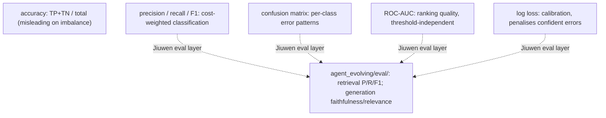

**Anchors:** &bull; `agent-core/openjiuwen/agent_evolving/eval/` — P/R/F1 at retrieval level &bull; `agent-core/openjiuwen/core/security/guardrail/backends.py` — `AutoModelForSequenceClassification`: the one true classifier in the framework

---

## 14. What is cross-validation, and why does it matter?

**General:** Cross-validation is a technique to estimate how well a model will generalise to unseen data when you have limited data to work with. In k-fold CV: split the data into k equal folds; train on k-1 folds and evaluate on the held-out fold; repeat k times rotating the held-out fold; average the k evaluation scores. The result is a low-variance estimate of generalisation performance that uses every sample for both training and evaluation.

Why it matters: a single train/test split gives a noisy estimate (the result depends on which specific examples landed in the test set). CV reduces that variance. It is also essential for honest hyperparameter tuning — tuning on a fixed held-out set leaks information and overfits the hyperparameters to that specific split. Proper nested CV (outer loop for performance estimate, inner loop for hyperparameter search) prevents this.

In the LLM context: CV is rarely used on the full model (too expensive), but it is used when fine-tuning on small datasets and when evaluating RAG pipelines with limited labelled examples.

**Jiuwen:** Not present in the inference framework. The evaluation harness (`agent_evolving/eval/`) does not implement k-fold CV. Evaluation runs on a fixed held-out eval set. Cross-validation would be a concern for users of the framework fine-tuning on small datasets via `agent_rl/`.

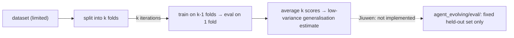

**Anchors:** &bull; `agent-core/openjiuwen/agent_evolving/eval/` — evaluation harness; fixed split, no CV

**Gap.** Not implemented. A concern for users fine-tuning on small datasets via `agent_rl/`.

---

# Advanced Level

## 15. Explain the attention mechanism in a Transformer, step by step

*Already covered as entry 01-4 in the compiled knowledge base. See `knowledge/01-llm-foundations.md`.*

---

## 16. Why does the Transformer use multi-head attention instead of a single head?

*Also covered in `source/real-interview-ai-engineer-4rounds_for_engineers.md` (Round 2, entry 9). Full General + Jiuwen answer there. See topic 00-5 once compiled.*

---

## 17. What is the difference between encoder-decoder and decoder-only architectures?

*Already covered as entry 01-6 in the compiled knowledge base. See `knowledge/01-llm-foundations.md`.*

---

## 18. What is the difference between fine-tuning, prompt engineering, and RAG? When would you use each?

**General:** Three distinct strategies for adapting or grounding an LLM's behaviour. They are not mutually exclusive — production systems often combine all three.

- **Prompt engineering:** Change what you send to the model, not the model itself. Zero cost, no data required, fully reversible, but limited by context length and the base model's capabilities. Best for: adjusting tone, adding few-shot examples, guiding output format.

- **Fine-tuning:** Update the model's weights on task-specific data (SFT, LoRA, PEFT). Changes what the model knows and how it behaves by default. Requires labelled data (hundreds to thousands of examples), compute, and careful evaluation. Best for: consistent style/persona, specialised domain vocabulary, reducing inference-time prompt length.

- **RAG:** At inference time, retrieve relevant external documents and inject them into the prompt. No weight updates. Knowledge can be updated without retraining. Best for: factual grounding, keeping knowledge current, large knowledge bases that exceed context limits.

Decision rule: prompt engineering first (cheapest, fastest). Add RAG when the answer depends on external or frequently changing knowledge. Add fine-tuning when prompt engineering and RAG cannot produce the required consistent behaviour, and you have sufficient data.

**Jiuwen:** All three are present. Prompt engineering happens at the prompt-builder level (`runtime_prompt_rail`, `skill_retrieval_prompt_rail`). RAG is the `KnowledgeRetrievalComponent` + `VectorRetriever` + `LLMComponent` pipeline. Fine-tuning is `agent_rl/` (SFT + PPO/GRPO + LoRA).

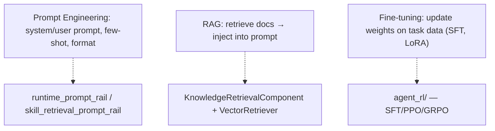

**Anchors:** &bull; `agent-core/openjiuwen/harness/rails/runtime_prompt_rail.py` — prompt engineering layer &bull; `agent-core/openjiuwen/extensions/knowledge_base/components/knowledge_retrieval_component.py` — RAG pipeline &bull; `agent-core/openjiuwen/agent_evolving/agent_rl/` — fine-tuning

---

## 19. What is LoRA, and why is it used for efficient fine-tuning?

**General:** Low-Rank Adaptation (LoRA) decomposes the weight update for each fine-tuned layer into two small matrices: `ΔW = A × B`, where `A ∈ ℝ^{d×r}` and `B ∈ ℝ^{r×k}` with rank `r << d, k`. During fine-tuning, only `A` and `B` are trained (typically 0.1–1% of parameters); the pre-trained weights are frozen. At inference, `ΔW` can be merged into the original weights with no latency cost.

Why it works: most weight updates during fine-tuning have low intrinsic rank — the actual degrees of freedom are much lower than the full matrix dimensions. LoRA exploits this to reduce trainable parameters by 100–1000×, which:
- Reduces GPU memory requirements (can fine-tune on a single GPU)
- Reduces risk of catastrophic forgetting (frozen base weights preserve general capability)
- Enables multiple task-specific adapters that swap in and out without storing full model copies

Common targets: the Q and V projection matrices of the attention layers (though all linear layers can be adapted).

**Jiuwen:** Implemented in `agent_rl/` via PEFT (HuggingFace). The training config specifies LoRA rank `r`, alpha, dropout, and target modules. The LoRA adapter is trained on top of the frozen base model and can be merged or kept separate for deployment.

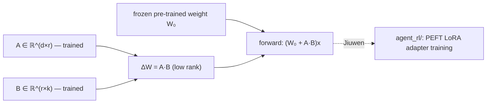

**Anchors:** &bull; `agent-core/openjiuwen/agent_evolving/agent_rl/` — LoRA/PEFT adapter config and training via veRL

---

## 20. What is the difference between RLHF and DPO for alignment?

**General:** Both techniques adjust an LLM to better match human preferences, but they differ in mechanism.

**RLHF (Reinforcement Learning from Human Feedback):** Three-stage pipeline:
1. Collect human preference data: show humans pairs of model outputs, ask which is preferred.
2. Train a reward model that predicts preference scores from outputs.
3. Fine-tune the LLM using PPO (a policy gradient RL algorithm) to maximise the reward model's score, with a KL divergence penalty against the original (reference) policy to prevent collapse.

RLHF is complex: requires a separate reward model, is sensitive to reward hacking, and PPO training is unstable and computationally expensive.

**DPO (Direct Preference Optimisation):** Eliminates the reward model entirely. DPO shows that the optimal policy implied by the RLHF objective can be expressed as a closed-form loss over preference pairs `(chosen, rejected)`. The model directly maximises the log-probability ratio of preferred over dispreferred outputs relative to a reference model. No RL loop, no separate reward model, stable supervised-style training.

DPO is simpler and often matches or exceeds RLHF quality. RLHF remains useful when you want an explicit, inspectable reward model or when online (iterative) feedback collection is available.

**Jiuwen:** The `agent_rl/` subsystem implements PPO/GRPO (RL-family algorithms) via veRL — this is the RLHF side. DPO is not explicitly documented as a separate training mode in the open-source layer; the training pipeline is configurable via veRL's algorithm choices.

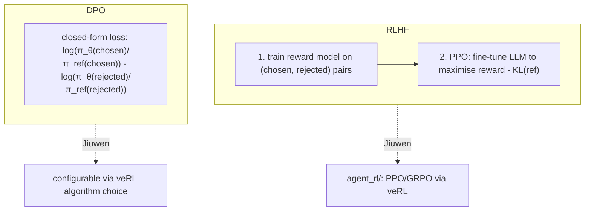

**Anchors:** &bull; `agent-core/openjiuwen/agent_evolving/agent_rl/` — PPO/GRPO training; RLHF-family alignment

---

## 21. How do you evaluate a language model's output for hallucination?

*Already covered as entries 01-14 and 13-x in the compiled knowledge base. See `knowledge/01-llm-foundations.md` and `knowledge/13-rag-failure-modes-and-evaluation.md`.*

---

## 22. What is quantization, and how does it affect model performance vs memory usage?

**General:** Quantization reduces the numerical precision of model weights (and sometimes activations) from the default float32 or bfloat16 to lower precision formats — INT8, INT4, or even INT2. This shrinks model size and speeds up computation at the cost of some precision.

- **Post-training quantization (PTQ):** quantize after training, no retraining. GPTQ, AWQ, and `bitsandbytes` INT8 are common. Minimal quality degradation at INT8 (often < 1% on benchmarks). INT4 has noticeable but often acceptable degradation.
- **Quantization-aware training (QAT):** simulate quantization noise during training so the model learns to be robust to it. Better quality at low bit widths but requires full retraining.

Effects:
- **Memory:** 4-bit quantization of a 70B parameter model reduces weight storage from ~140 GB (FP16) to ~35 GB — from 4× A100s to 1× A100.
- **Latency:** depends on hardware. INT8 matrix multiplication is faster on GPUs with INT8 tensor cores. INT4 with dedicated kernels (ExLlama, GGUF) can be faster or comparable on CPU inference.
- **Quality:** degrades with lower precision, particularly for reasoning-heavy tasks. Outlier weights (a few weights with very large magnitude) cause disproportionate quality loss; methods like GPTQ handle these with higher precision selectively.

**Jiuwen:** Used in the vLLM and local inference path. `agent-core/openjiuwen/symphony/retrieval/llm/` wraps vLLM, which supports bitsandbytes, GPTQ, and AWQ quantization via engine args. The config layer forwards `quantization` as a vLLM engine argument. There is no custom quantization code — it is delegated to vLLM/bitsandbytes.

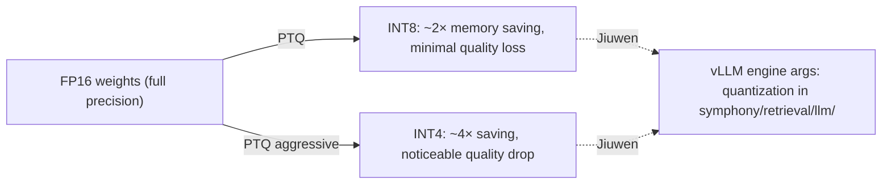

**Anchors:** &bull; `agent-core/openjiuwen/symphony/retrieval/llm/transformers_prefix_cached_generation/client.py` — local model loading; quantization delegated to vLLM engine args &bull; `agent-core/openjiuwen/symphony/retrieval/llm/` — vLLM serving path accepting quantization config

---

# LLM and RAG-Specific Questions

## 23. How does a RAG pipeline work, end to end?

*Already covered as entry 10-1 in the compiled knowledge base. See `knowledge/10-rag-pipelines-and-patterns.md`.*

---

## 24. What is the difference between a dense retriever and a sparse retriever (BM25)?

*Already covered as entry 11-3 in the compiled knowledge base. See `knowledge/11-retrieval-and-ranking.md`.*

---

## 25. How would you choose a chunking strategy for a document set?

*Also covered in `source/real-interview-ai-engineer-4rounds_for_engineers.md` (Round 3, entry 14). Full General + Jiuwen answer there.*

---

## 26. How do you evaluate a RAG system beyond "does the answer look right"?

*Already covered across entries 15-1 through 15-5. See `knowledge/15-evaluation.md`.*

---

## 27. How do you handle a knowledge base that updates frequently without re-embedding everything?

*Already covered as entry 14-x. See `knowledge/14-rag-system-design.md`.*

---

## 28. What is the tradeoff between context window size and retrieval precision?

*Also covered in `source/real-interview-ai-engineer-4rounds_for_engineers.md` (Round 3, entry 19). Full General + Jiuwen answer there.*

---

# Agents and System Design Questions

## 29. Explain the ReAct pattern — how does reasoning interleave with tool calls?

*Already covered as entry 05-7 in the compiled knowledge base. See `knowledge/05-agent-fundamentals-and-the-loop.md`.*

---

## 30. How would you design a system that routes requests across multiple LLM providers based on cost and latency?

*Also covered in `source/real-interview-ai-engineer-4rounds_for_engineers.md` (Round 4, entry 20). Full General + Jiuwen answer there.*

---

## 31. How do you implement fallback if a model call fails or times out?

*Also covered in `source/real-interview-ai-engineer-4rounds_for_engineers.md` (Round 4, entry 21). Full General + Jiuwen answer there.*

---

## 32. How do you manage context and state across a multi-turn agent conversation?

*Already covered across entries 07-1 through 07-5. See `knowledge/07-planning-memory-and-state.md`.*

---

## 33. How do you monitor an LLM-based system in production — what metrics actually matter?

*Already covered as entry 16-x. See `knowledge/16-production-cost-and-scale.md`.*

---

## 34. How would you prevent a public-facing agent from being abused (prompt injection, cost blowout)?

*Already covered across entries 18-x. See `knowledge/18-security-and-safety.md`.*

---

## Coverage map — new vs already in KB / prior source

| # | Question | Status |
|---|---|---|
| 1 | Difference between AI, ML, and Deep Learning | **New — not in KB or prior source** |
| 2 | Supervised vs unsupervised vs reinforcement learning | **New — not in KB or prior source** |
| 3 | Overfitting and how to prevent it | In prior source (4rounds entry 12); pending topic 00-6 |
| 4 | Bias-variance tradeoff | **New — not in KB or prior source** |
| 5 | Gradient descent | In prior source (4rounds entry 1); pending topic 00-2 |
| 6 | Parameter vs hyperparameter | **New — not in KB or prior source** |
| 7 | Backpropagation | In prior source (4rounds entry 5); pending topic 00-1 |
| 8 | Vanishing/exploding gradient | In prior source (4rounds entry 6); pending topic 00-3 |
| 9 | Batch norm vs layer norm | In prior source (4rounds entry 7); pending topic 00-4 |
| 10 | Dropout | **New — not in KB or prior source** |
| 11 | CNNs vs RNNs | **New — not in KB or prior source** |
| 12 | Transfer learning | **New — not in KB or prior source** |
| 13 | Evaluate classification model beyond accuracy | **New — not in KB or prior source** |
| 14 | Cross-validation | **New — not in KB or prior source** |
| 15 | Attention mechanism step by step | Covered: entry 01-4 |
| 16 | Why multi-head attention | In prior source (4rounds entry 9); pending topic 00-5 |
| 17 | Encoder-decoder vs decoder-only | Covered: entry 01-6 |
| 18 | Fine-tuning vs prompt engineering vs RAG | **New angle (3-way comparison)** — individual pairs covered |
| 19 | LoRA and efficient fine-tuning | **New dedicated entry — mentioned in 17-x but not standalone** |
| 20 | RLHF vs DPO for alignment | **New — not in KB or prior source** |
| 21 | Evaluate hallucination | Covered: entries 01-14, 13-x |
| 22 | Quantization | **New dedicated entry — in glossary 03-x but not deep** |
| 23 | RAG pipeline end to end | Covered: entry 10-1 |
| 24 | Dense vs sparse retriever (BM25) | Covered: entry 11-3 |
| 25 | Chunking strategy | In prior source (4rounds entry 14) |
| 26 | Evaluate RAG beyond "looks right" | Covered: entries 15-x |
| 27 | KB updates without re-embedding | Covered: entry 14-x |
| 28 | Context window vs retrieval precision | In prior source (4rounds entry 19) |
| 29 | ReAct pattern | Covered: entry 05-7 |
| 30 | Multi-provider routing | In prior source (4rounds entry 20) |
| 31 | Fallback on model call failure | In prior source (4rounds entry 21) |
| 32 | Context/state in multi-turn agent | Covered: entries 07-x |
| 33 | Production monitoring metrics | Covered: entry 16-x |
| 34 | Prompt injection / cost blowout | Covered: entries 18-x |
