# AI engineer technical questions — general answers + how Jiuwen does it

Based on the recurring list *AI Engineer Technical Questions* seen across HackerRank threads, Glassdoor, Blind, and LinkedIn prep posts (Python and Software Engineering; LLM Fundamentals; RAG and Retrieval; Agents and Tool Use; Evaluation; System Design and Scale; Security; Judgment and Tradeoffs). Each section heading is the original question.

Where a question overlaps the RAG, LLM, or framework companion docs, the Jiuwen answer here is shorter and reuses the same mechanisms; where it is about engineering (concurrency, error isolation, caching, security, release gating) it goes deeper into the Python and product layer. See [README](README.md) for the shared conventions (answer shape, anchor format, repo layers).

> **The pattern worth noticing:** wording changes across platforms, but the concerns repeat — can you build the pipeline, make it reliable, prove it works, and reason about cost and scale. Fluency in those four areas covers most versions of this question you'll ever get asked.

---

# Python and software engineering

## 1. Handling concurrent API calls when an agent needs to call multiple tools at once

**General:** When a turn contains several independent tool calls, run them concurrently with async tasks rather than a serial `for` loop, but bound the concurrency (semaphore/pool), respect per-resource ordering (two writes to the same file must not interleave), and mark which tools are safe to parallelize. Failures in one call should not silently cancel the others unless you want fail-fast semantics.

**Jiuwen:** The ReAct loop can emit a `List[ToolCall]` in one turn. `AbilityManager.execute` normalizes them, builds one coroutine plus an isolated `AgentCallbackContext` per call (copying `extra` to avoid racy dict mutation), and if `parallel_tool_calls=True` dispatches to `_execute_parallel_tool_tasks`. That groups consecutive calls whose `ToolCard.parallel_safe` is true into batches; each batch runs through `_execute_resource_ordered_tool_tasks`, which partitions calls into "lanes" keyed by normalized file path (unknown resources get private lanes) and `asyncio.gather`s across lanes while awaiting sequentially *within* a lane. A `parallel_safe=False` tool acts as an exclusive barrier. Team supervisors override `execute` in `P2PAbilityManager` to fan AgentCard calls out under a semaphore (default 10).

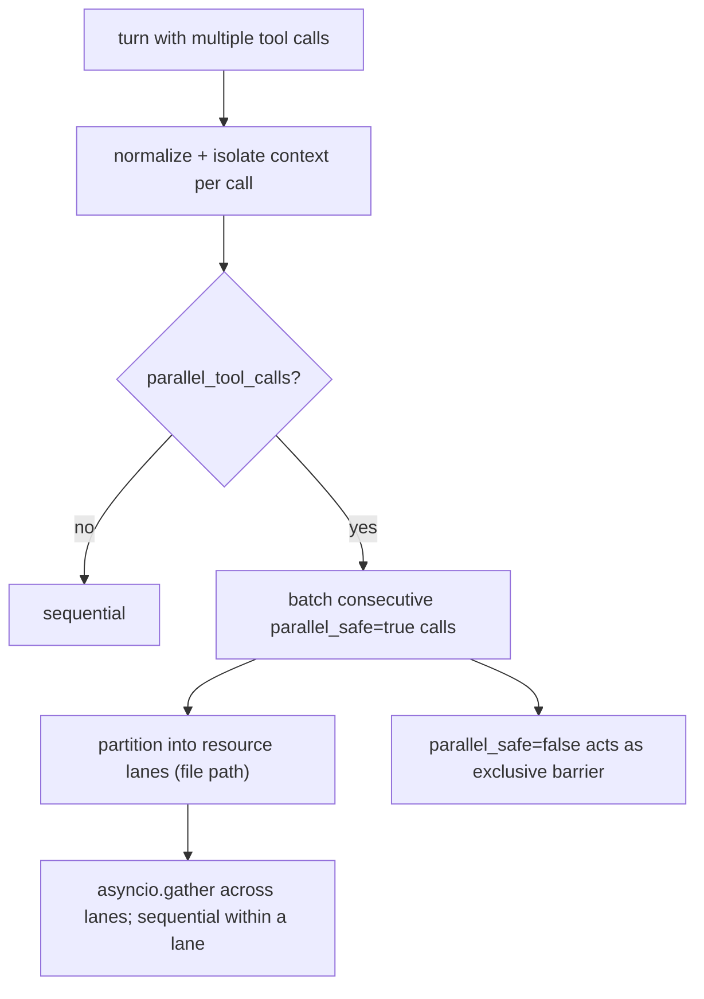

<sub>**Anchors:**<br>&bull; `agent-core/openjiuwen/core/single_agent/ability_manager.py:1083` — `parallel_tool_calls` parameter; `:1148` parallel-vs-sequential branch; `:431` `_execute_parallel_tool_tasks` (batching + barrier); `:393` `_execute_resource_ordered_tool_tasks` (lanes); `:421` `asyncio.gather` across lanes<br>&bull; `agent-core/openjiuwen/core/foundation/tool/base.py:92` — `ToolCard.parallel_safe` (default True)<br>&bull; `agent-core/openjiuwen/core/graph/pregel/task.py:27` — `submit` creates a Task; `:47` `asyncio.wait(..., FIRST_EXCEPTION)` cancels siblings<br>&bull; `agent-core/openjiuwen/core/multi_agent/teams/hierarchical_msgbus/p2p_ability_manager.py:45` — lazy semaphore for sub-agent fan-out</sub>

**Gap.** Parallelism is per-turn only, with no token-budget-aware or priority scheduling; MCP calls share the pool with no per-server backpressure.

## 2. Multithreading vs. multiprocessing, which matters more for I/O-bound LLM API calls

**General:** For I/O-bound work (network calls to LLM APIs, vector DBs), async I/O or threads beat multiprocessing: the CPU is idle while waiting, so you want concurrency, not extra processes. Async is the most efficient (no thread-per-request overhead) when your stack is async end to end; threads are the fallback for blocking SDKs. Multiprocessing only pays off for CPU-bound work (local inference, heavy parsing) because it escapes the GIL.

**Jiuwen:** The LLM path is single-process asyncio/anyio. `httpx.AsyncClient` instances share a process-global `AsyncConnectionPool` via `HttpXConnectorPool`, and `AsyncOpenAI`/`AsyncAnthropic` clients are cached process-wide with `httpx.Limits(max_connections=100, max_keepalive_connections=20)`. Blocking work is offloaded with `asyncio.to_thread`/`run_in_executor`, never `multiprocessing`. Embeddings use an `asyncio.Semaphore(max_concurrent)` (default 50), with a `ThreadPoolExecutor` only for the sync facade. `multiprocessing` appears only in tests, the observability trace store, and process isolation — not as an LLM throughput strategy.

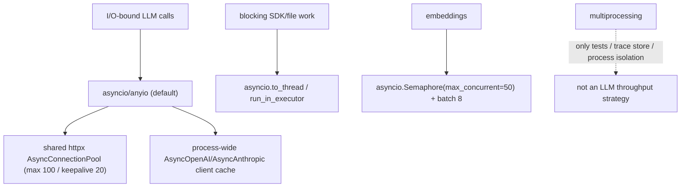

<sub>**Anchors:**<br>&bull; `agent-core/openjiuwen/core/common/clients/llm_client.py:52` — `HttpXConnectorPool` (`AsyncConnectionPool`)<br>&bull; `agent-core/openjiuwen/core/foundation/llm/model_clients/openai_model_client.py:383` — process-wide `_client_cache`; `:1118` `httpx.Limits(max_connections=100, max_keepalive_connections=20)`<br>&bull; `agent-core/openjiuwen/core/foundation/llm/model_clients/anthropic_model_client.py:719` — same pooling for `AsyncAnthropic`<br>&bull; `agent-core/openjiuwen/core/retrieval/embedding/api_embedding.py:55` — `asyncio.Semaphore(max_concurrent)`; `:120` `ThreadPoolExecutor` for sync path<br>&bull; `jiuwenswarm/jiuwenswarm/server/agent_ws_server.py:5326` — `asyncio.to_thread(...)` offload; `jiuwenswarm/jiuwenswarm/server/runtime/agent_warm_pool.py:154` — semaphore-bounded warm pool</sub>

**Gap.** No process-level parallelism to escape the GIL for tokenization/parsing at scale; sync embedding still consumes a thread per concurrent request.

## 3. Structuring error handling for a pipeline where retrieval, reranking, or generation can each fail independently

**General:** Isolate each stage so one failure degrades rather than aborts: retrieval returns an empty/flagged result, reranking falls back to the pre-rerank order, generation surfaces a structured error. Use typed errors per stage, explicit fallbacks, retries only for transient failures, and a top-level handler that converts failure into a model-readable message instead of a crash.

**Jiuwen:** Failures are mostly contained per stage. Retrievers implement stage-local fallbacks: `VectorRetriever` falls back to BM25 when vector search is empty, `HybridRetriever` falls back to vector or sparse, and `GraphRetriever` falls back to sparse. Model-call failures are handled by rails: `ModelAnomalyDetectionRail.on_model_exception` retries stream-timeout/repetition with backoff, and `ToolCallResilienceRail` retries transport/timeout tool errors. In `AbilityManager`, any tool/workflow/sub-agent exception is caught and converted to an error `ToolMessage` so the round continues. Workflow HTTP components have per-component retry (`HttpRetryConfig`, 429/5xx) and rate-limit config. Pregel node failure cancels siblings via `FIRST_EXCEPTION`.

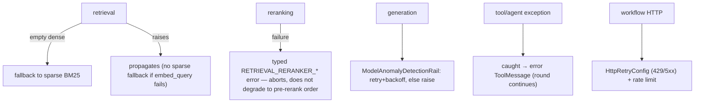

<sub>**Anchors:**<br>&bull; `agent-core/openjiuwen/core/retrieval/retriever/vector_retriever.py:83` — dense-empty → BM25 fallback; `agent-core/openjiuwen/core/retrieval/retriever/hybrid_retriever.py:97/194` — fallback branches; `agent-core/openjiuwen/core/retrieval/retriever/graph_retriever.py:462` — fallback to sparse<br>&bull; `agent-core/openjiuwen/harness/rails/model_anomaly_detection_rail.py:236` — `on_model_exception` retry classification; `agent-core/openjiuwen/harness/rails/tool_call_resilience_rail.py:106` — tool exception retry decision<br>&bull; `agent-core/openjiuwen/core/single_agent/ability_manager.py:1186` — exception rendered into a `ToolMessage`<br>&bull; `agent-core/openjiuwen/core/workflow/components/tool/http/http_request_component.py:102` — `HttpRetryConfig`; `:110` `HttpRateLimitConfig`<br>&bull; `agent-core/openjiuwen/core/graph/pregel/task.py:47` — FIRST_EXCEPTION cancels siblings</sub>

**Gap.** No circuit breaker or pipeline-level compensation. Reranker failure aborts retrieval rather than degrading to the pre-rerank order, and a failed `embed_query` has no sparse fallback. Failures are swallowed into model-visible text, so downstream cannot distinguish "empty" from "broken".

## 4. Designing retry logic that doesn't cause duplicate side effects on a tool call

**General:** Never blindly retry non-idempotent actions (payments, emails, writes). Mark side-effecting tools, use idempotency keys so a repeated call is recognized, and prefer retry only for reads or explicitly idempotent operations. Bound retries with backoff. On ambiguity, surface to a human rather than guess.

**Jiuwen:** `ToolCard.idempotent` defaults to `False` (secure-by-default), and non-idempotent tools are never retried. `ToolCallResilienceRail` decides in layers: reject retry for any card with `idempotent is False`; allow retry only for retryable exception types/markers (timeouts, connection resets, MCP transport); enforce a per-invoke budget (default 3). On a retry it calls `ctx.request_retry()` and the `@rail` decorator re-runs the call. Separately, `ToolCallDeduplicationRail` short-circuits repeated *read-only* calls via an exact `(tool_name, args-hash)` cache, setting `_skip_tool` so the real tool never runs.

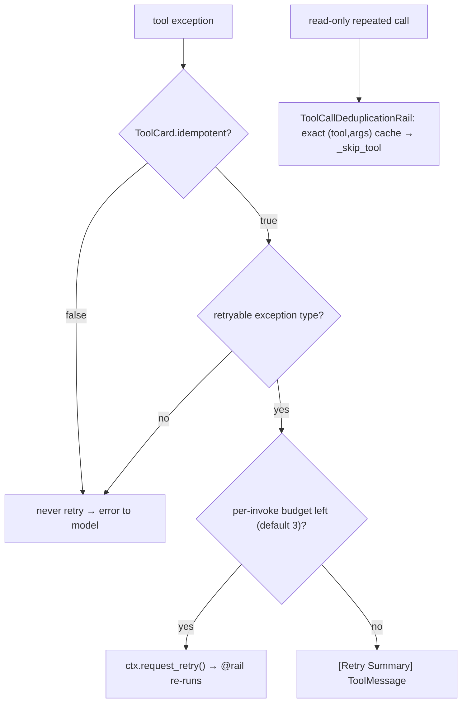

<sub>**Anchors:**<br>&bull; `agent-core/openjiuwen/core/foundation/tool/base.py:109` — `idempotent` default `False`<br>&bull; `agent-core/openjiuwen/harness/rails/tool_call_resilience_rail.py:128` — non-idempotent guard; `:141` retryable-exception filter; `:145` per-invoke budget; `:196` `ctx.request_retry()`<br>&bull; `agent-core/openjiuwen/core/single_agent/rail/base.py:612/1024` — `request_retry` + decorator retry loop<br>&bull; `jiuwenswarm/jiuwenswarm/agents/harness/common/rails/tool_dedup_rail.py:24/109` — read-only whitelist + exact cache interception<br>&bull; `agent-core/openjiuwen/core/single_agent/ability_manager.py:1324` — `_skip_tool_calls` honored<br>&bull; `agent-core/openjiuwen/harness_providers/native/harness.py:226` — native harness rejects protocol checkpoints (no replay)</sub>

**Gap.** No durable idempotency keys / exactly-once semantics — a crash after a side effect but before result persistence can re-execute on replay. Per-tool `max_attempts` overrides are documented as future work; the rail is all-or-nothing.

---

# LLM fundamentals

## 5. Tokens vs. words, and why that matters for cost and context limits

**General:** A token is a sub-word unit from a BPE/unigram vocabulary, so one word can be several tokens (and code/rare words fragment heavily). Cost and context limits are measured in tokens, not words, so a language or domain that fragments more costs more per word and fills the window faster.

**Jiuwen:** Counts tokens, never words, via a pluggable `TokenCounter`. `TiktokenCounter` maps known model names to encodings with `cl100k_base` and `len(text)//3` fallbacks; `TiktokenModelCounter` loads a model-native BPE vocabulary; `TokenizerManager` downloads HuggingFace/tiktoken artifacts per model. Counts drive per-model context limits (default 200,000), compression/offload thresholds, and cost via provider-reported `usage_metadata`.

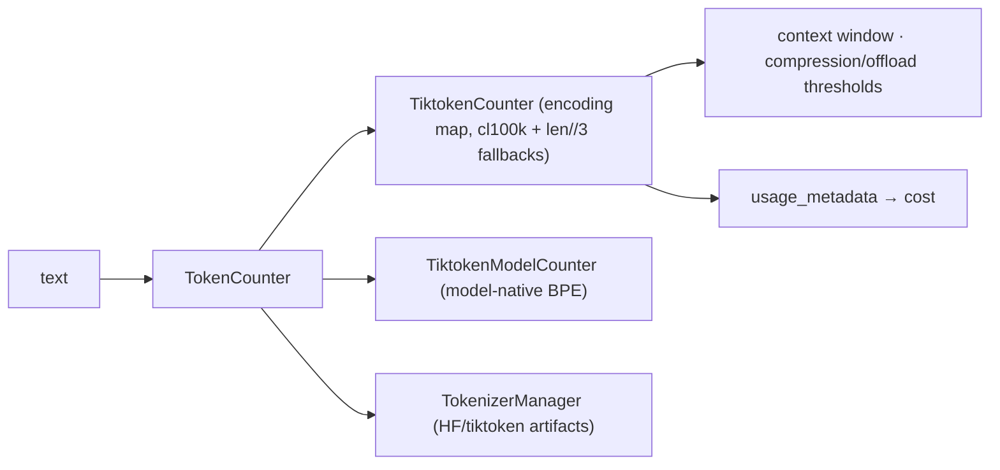

<sub>**Anchors:**<br>&bull; `agent-core/openjiuwen/core/context_engine/token/tiktoken_counter.py:212` — `TiktokenCounter`; `:225` encoding map; `:287` `len//3` fallback<br>&bull; `agent-core/openjiuwen/core/context_engine/token/tiktoken_model_counter.py:86` — model-native BPE<br>&bull; `agent-core/openjiuwen/core/context_engine/token/tokenizer_spec.py:34/50` — `TokenizerSpec` + fallback policy<br>&bull; `agent-core/openjiuwen/core/context_engine/token/tokenizer_manager.py:60/124` — resolves/downloads artifacts<br>&bull; `agent-core/openjiuwen/core/context_engine/context/context_utils.py:20` — `DEFAULT_CONTEXT_MAX_TOKENS = 200000`<br>&bull; `agent-core/openjiuwen/core/foundation/llm/schema/message.py:28` — `total_tokens` usage metadata</sub>

## 6. Why temperature affects output, and what happens at 0 versus 1

**General:** Temperature rescales next-token logits before softmax: `softmax(z/T)`. At `T → 0` the distribution collapses to the argmax (greedy, deterministic); at `T = 1` the model's raw distribution is used; above 1 it flattens (more diverse, more errors). It changes relative probabilities, not which tokens are possible.

**Jiuwen:** Temperature is a passthrough parameter; the local HuggingFace/vLLM path implements the math (`scores = logits / max(ε, T)`, and `T <= 0` returns argmax). Both `temperature` and `top_p` default to `None` at the request-config layer and are added only when set; OpenAI-compatible calls targeting `openai.com` keep only one of them (temperature wins), and Anthropic routes sampling through `extra_body`. The local `GenerationConfig` default is `temperature=0.0`.

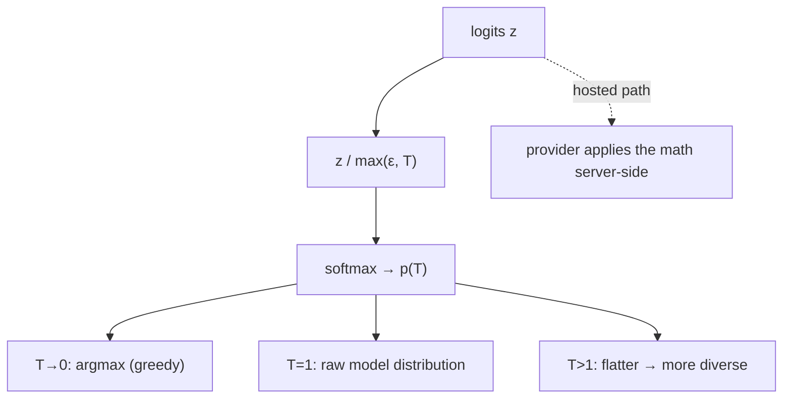

<sub>**Anchors:**<br>&bull; `agent-core/openjiuwen/core/foundation/llm/schema/config.py:210` — `temperature: Optional[float] = None`<br>&bull; `agent-core/openjiuwen/core/foundation/llm/model_clients/base_model_client.py:556` — resolved, added only when not `None`<br>&bull; `agent-core/openjiuwen/core/foundation/llm/model_clients/openai_model_client.py:944` — drops `top_p` when temperature present (openai.com)<br>&bull; `agent-core/openjiuwen/core/foundation/llm/model_clients/anthropic_model_client.py:929` — temperature via `extra_body`<br>&bull; `agent-core/openjiuwen/symphony/retrieval/llm/transformers_prefix_cached_generation/generation.py:516` — `scores = next_token_logits / max(1e-6, temperature)`; `:514` argmax branch<br>&bull; `agent-core/openjiuwen/symphony/retrieval/llm/base/types.py:60` — `GenerationConfig.temperature: float = 0.0`</sub>

## 7. Encoder-only vs. decoder-only vs. encoder-decoder models

**General:** Encoder-only (BERT) reads bidirectional context and produces representations — classification, embedding, extraction. Decoder-only (GPT) is autoregressive, attending leftward — generation. Encoder-decoder (T5) encodes an input and generates an output — translation, summarization. GPT is decoder-only.

**Jiuwen:** No architecture-type config exists; behavior is selected by provider type and model-name string. The two HuggingFace classes named in the repo imply intent: causal generation uses `AutoModelForCausalLM` (decoder-only) and guardrail classification uses `AutoModelForSequenceClassification` (encoder-style classifier). GPT is handled purely as a provider/model name.

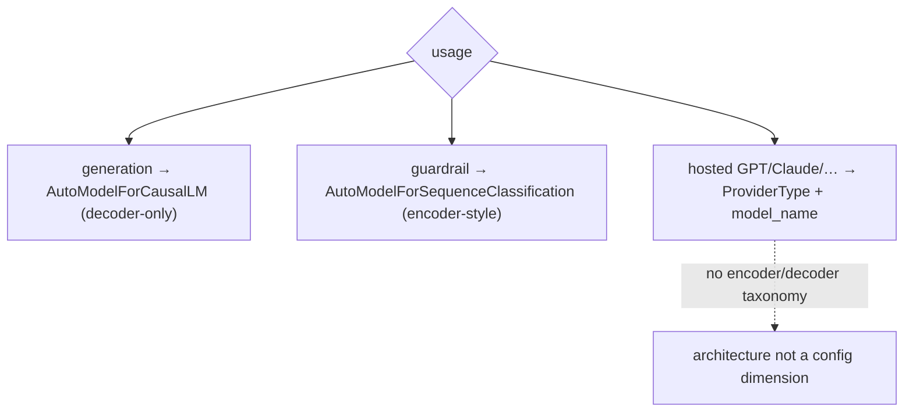

<sub>**Anchors:**<br>&bull; `agent-core/openjiuwen/core/foundation/llm/schema/config.py:13` — `ProviderType`<br>&bull; `agent-core/openjiuwen/core/security/guardrail/backends.py:445` — `AutoModelForSequenceClassification`<br>&bull; `agent-core/openjiuwen/core/security/guardrail/builtin.py:174` — `model_type` limited to `None | "bert" | "qwen"`<br>&bull; `agent-core/openjiuwen/symphony/retrieval/llm/transformers_prefix_cached_generation/client.py:175` — `AutoModelForCausalLM`<br>&bull; `agent-core/openjiuwen/symphony/retrieval/search/service/serving.py:35` — vLLM `architectures` string<br>&bull; `agent-core/openjiuwen/core/foundation/llm/reasoning_profiles.py:100` — family patterns classify reasoning protocol only</sub>

## 8. How self-attention lets a transformer weigh relevance across a sequence

**General:** Each token is projected to query, key, and value vectors. The query of a token is dot-producted with every token's key (scaled by `1/√d_k`), softmaxed into attention weights, and used to take a weighted sum of the values. Multiple heads and stacked layers let each token aggregate context-dependent information from the whole sequence, weighted by content.

**Jiuwen:** Not implemented — attention is delegated to provider APIs or to HuggingFace models loaded by name. There is no Q/K/V or scaled-dot-product code; the only `torch.softmax` in the framework is token sampling. The boundary is the model-client/config layer.

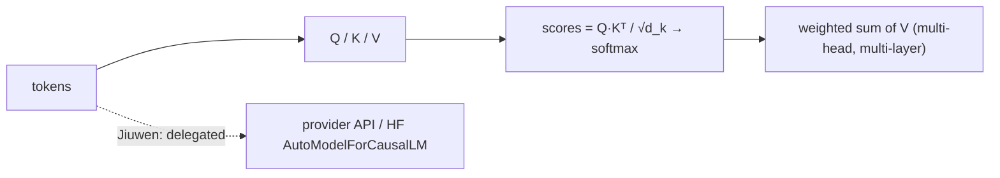

<sub>**Anchors:**<br>&bull; `agent-core/openjiuwen/core/foundation/llm/schema/config.py:13` — provider boundary<br>&bull; `agent-core/openjiuwen/core/foundation/llm/model_clients/openai_model_client.py:865` — delegates computation to the API<br>&bull; `agent-core/openjiuwen/symphony/retrieval/llm/transformers_logit_selection/client.py:227` — forward + logit extraction only<br>&bull; `agent-core/openjiuwen/symphony/retrieval/llm/transformers_prefix_cached_generation/client.py:175` — `AutoModelForCausalLM`<br>&bull; `agent-core/openjiuwen/symphony/retrieval/llm/transformers_prefix_cached_generation/generation.py:527` — `torch.softmax` is sampling, not attention</sub>

---

# RAG and retrieval

## 9. Walking through a RAG pipeline end to end, query to final answer

**General:** Ingest: parse → chunk → embed → index. Query: embed the query → retrieve top-k (dense and/or sparse) → rerank → assemble the retrieved context into the prompt → generate → optionally cite. Each stage is separable; failures and quality drops can occur at any of them.

**Jiuwen:** Ingestion: `KnowledgeBase.parse_files` (parser), then `SimpleKnowledgeBase.add_documents` calls `chunker.chunk_documents`, builds an `IndexConfig`, and `Indexer.build_index` computes embeddings via `compute_chunk_embeddings` and writes them to the vector store. Query: `SimpleKnowledgeBase.retrieve` lazily instantiates `VectorRetriever`/`SparseRetriever`/`HybridRetriever` by `index_type`, embeds the query, and calls `vector_store.search`. The production end-to-end wiring is the workflow `KnowledgeRetrievalComponent`, which returns `results`/`context` (texts joined by `\n\n`); a downstream `LLMComponent` formats them (e.g. `Context:\n{{context}}\n\nQuestion: {{query}}`).

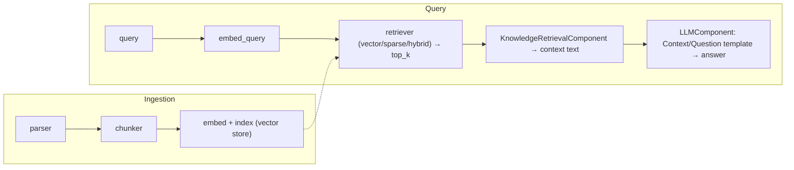

<sub>**Anchors:**<br>&bull; `agent-core/openjiuwen/core/retrieval/simple_knowledge_base.py:96` — `chunk_documents`; `:110` `build_index(chunks=..., embed_model=...)`; `:182` delegate to retriever<br>&bull; `agent-core/openjiuwen/core/retrieval/indexing/indexer/embed_chunks.py:46/73` — `embed_documents` / `embed_multimodal` set `chunk.embedding`<br>&bull; `agent-core/openjiuwen/core/retrieval/retriever/vector_retriever.py:78` — `embed_query` → `vector_store.search`<br>&bull; `agent-core/openjiuwen/core/workflow/components/resource/knowledge_retrieval_comp.py:109` — `retrieve_multi_kb_with_source(...)`; `:243` joins texts into `context`<br>&bull; `agent-core/openjiuwen/core/workflow/components/llm/llm_comp.py:654` — template format feeding `{{context}}`/`{{query}}`</sub>

**Gap.** No packaged end-to-end RAG agent or retrieval tool in `harness`/`agent_teams`; `KnowledgeRetrievalComponent` only emits a string. Retrieved context is concatenated with no token-budget trimming and no citation synthesis.

## 10. Choosing chunk size, and what breaks at each extreme

**General:** Too small and each chunk lacks context (and the answer may split across chunks); too large and a chunk covers many topics, diluting its embedding and wasting prompt budget. Defaults are a few hundred tokens with modest overlap, tuned on a retrieval eval. Size is measured in tokens the model sees.

**Jiuwen:** `Chunker.__init__` validates `chunk_size > 0`, `0 <= chunk_overlap`, and `chunk_overlap < chunk_size`, raising typed errors otherwise. `CharSplitter` (character units) clamps overlap and size so `step` cannot be zero/negative; `IndexSentenceSplitter`/`TextChunker` (token units) clamp `chunk_size` to the tokenizer's `model_max_length` (with a 65536 fallback). At storage, Milvus declares the text field `VARCHAR max_length=65535`, so an oversized chunk fails at insert. Defaults: `chunk_size=512`, `chunk_overlap=50`.

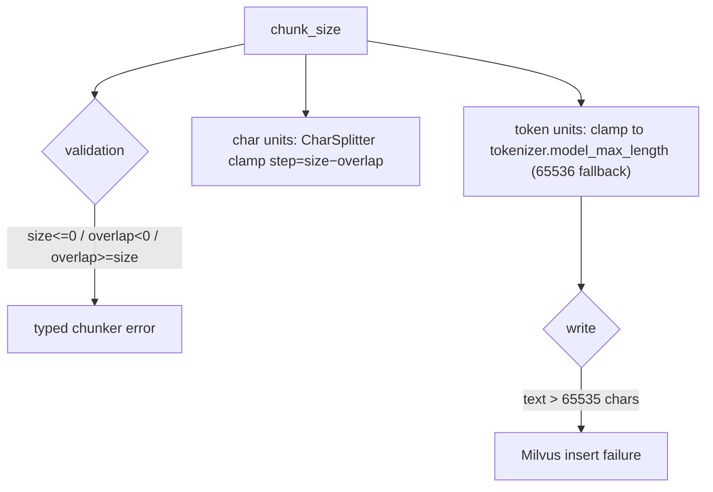

<sub>**Anchors:**<br>&bull; `agent-core/openjiuwen/core/retrieval/indexing/processor/chunker/base.py:59` — validation; `agent-core/openjiuwen/core/retrieval/indexing/processor/chunker/text_splitter.py:43` — overlap clamp; `:44` size clamp; `:207` `_resolve_chunk_size` (65536 fallback at `:23`)<br>&bull; `agent-core/openjiuwen/core/retrieval/indexing/processor/chunker/chunking.py:82` — tokenizer-limit auto-adjust<br>&bull; `agent-core/openjiuwen/core/retrieval/indexing/indexer/milvus_indexer.py:378` — text `max_length=65535`<br>&bull; `agent-core/openjiuwen/core/retrieval/common/config.py:34` — `chunk_size=512`, `chunk_overlap=50`<br>&bull; `agent-core/openjiuwen/core/retrieval/indexing/processor/splitter/splitter.py:186` — sentence window step</sub>

**Gap.** No token-budget validation of the *assembled* context, no per-chunk truncation before insert, and chunk-size choice has no retrieval-quality feedback loop.

## 11. Why cosine similarity alone doesn't guarantee the right document ranks first

**General:** Cosine measures vector closeness, not answer relevance. It is symmetric, ignores term importance, is not calibrated across queries/documents, and a generic chunk can sit near the query while the exact answer ranks lower. Top-k by cosine is a recall-oriented candidate step; ranking quality comes from models, hybrid exact-match signals, metadata filters, and reranking.

**Jiuwen:** The KB ranks purely by the vector store's returned score: `VectorRetriever` searches and only applies a post-hoc `score_threshold`, preserving store order. Stores normalize heterogeneous raw distances into `[0,1]` per backend (Milvus cosine `(s+1)/2`, Chroma `(2-d)/2`), so scores are rescaled distances, not calibrated probabilities, and are not comparable across stores/collections. There is no MMR, diversity, or cross-encoder step in the KB path.

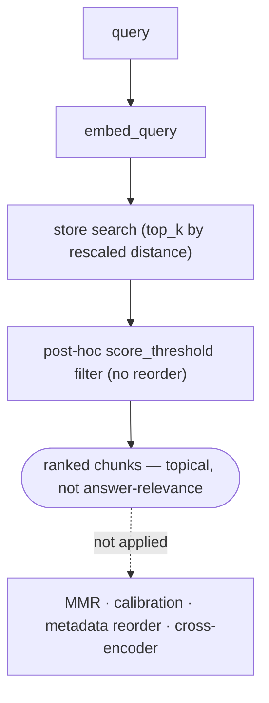

<sub>**Anchors:**<br>&bull; `agent-core/openjiuwen/core/retrieval/retriever/vector_retriever.py:79` — raw store search; `:94` threshold filter only<br>&bull; `agent-core/openjiuwen/core/retrieval/simple_knowledge_base.py:182` — results returned as-is<br>&bull; `agent-core/openjiuwen/core/retrieval/common/config.py:81` — `distance_metric` default `cosine`<br>&bull; `agent-core/openjiuwen/core/foundation/store/vector/utils.py:35/49/63` — similarity normalizers<br>&bull; `agent-core/openjiuwen/core/retrieval/vector_store/milvus_store.py:457` — metric-dependent conversion; `agent-core/openjiuwen/core/retrieval/vector_store/pg_store.py:512` — different per-metric math</sub>

## 12. What reranking adds that initial retrieval doesn't already do

**General:** First-stage retrieval optimizes recall with cheap approximate similarity over the whole corpus. A reranker scores each candidate *jointly with the query* using an expensive cross-encoder, reordering the top-k for precision. It cannot recover documents retrieval never returned.

**Jiuwen:** `Reranker` is an abstract cross-encoder client (`rerank`/`rerank_sync` returning `{doc: score}`), implemented by `StandardReranker`, `DashscopeReranker`, and experimental `ChatReranker`. It is integrated only in the graph store: `milvus_support.py` accepts an optional `reranker` and calls it in `_rank_results`/`_combined_rerank`, and even there it is a no-op unless the caller passes `reranker=...`. Neither `SimpleKnowledgeBase.retrieve` nor `GraphKnowledgeBase.retrieve` constructs or forwards one, so RAG retrieval is first-stage-only.

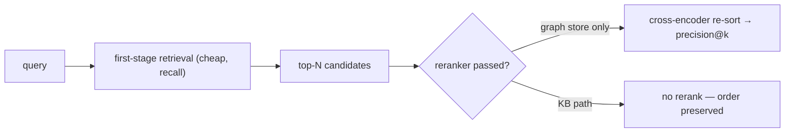

<sub>**Anchors:**<br>&bull; `agent-core/openjiuwen/core/foundation/store/base_reranker.py:16` — `RerankerConfig`; `:37/41` `Reranker` + abstract `rerank`<br>&bull; `agent-core/openjiuwen/core/retrieval/reranker/standard_reranker.py:23` — `StandardReranker` (`/rerank`); `agent-core/openjiuwen/core/retrieval/reranker/chat_reranker.py:22` — `ChatReranker` (experimental)<br>&bull; `agent-core/openjiuwen/core/foundation/store/graph/milvus/milvus_support.py:458` — reranker applied only when truthy; `:87` `async def rerank`<br>&bull; `agent-core/openjiuwen/core/retrieval/simple_knowledge_base.py:125` — no reranker in `retrieve`; `agent-core/openjiuwen/core/retrieval/graph_knowledge_base.py:251` — passes `**kwargs` only<br>&bull; `agent-core/openjiuwen/core/retrieval/common/result_ranking.py:11` — fusion rankers, distinct from cross-encoder</sub>

**Gap.** Reranking is effectively dead for RAG: no KB/component/retriever instantiates a reranker, and `KnowledgeRetrievalCompConfig` has no reranker field.

---

# Agents and tool use

## 13. How function calling works structurally

**General:** Tool definitions (name, description, JSON-Schema parameters) are sent with the request. The model returns structured `tool_calls` instead of prose; the host validates arguments against the schema, invokes the function, and appends the result as a tool message for the next turn. The model never executes code — it only requests.

**Jiuwen:** Cards become JSON Schema via the callable schema extractor, the ability manager builds the model-facing tool list, and the model client converts it to OpenAI/Anthropic tool format. The model's `tool_calls` are parsed (non-streaming, streaming, Anthropic), validated, and dispatched by the ability manager, with schema validation inside `LocalFunction.invoke`.

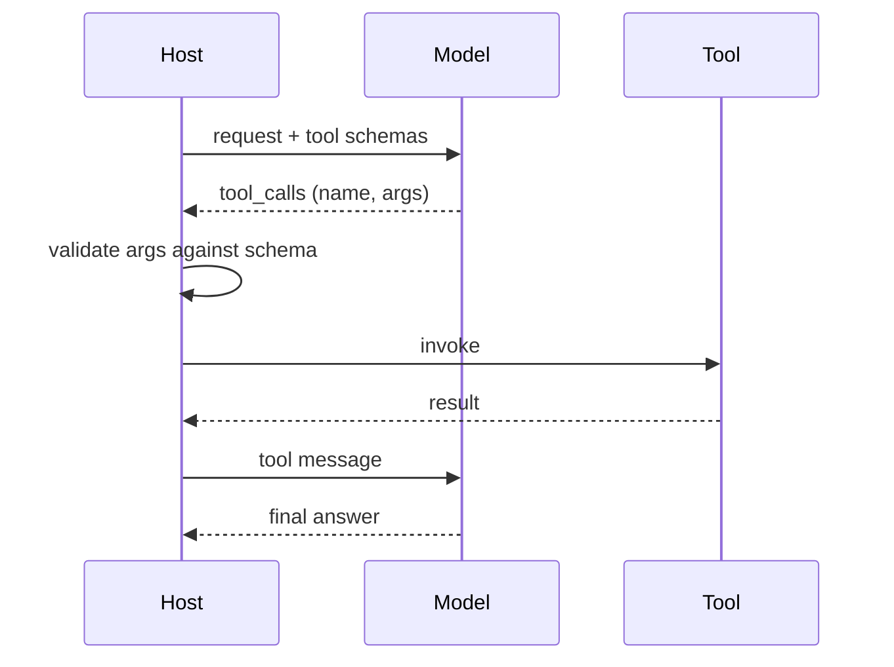

<sub>**Anchors:**<br>&bull; `agent-core/openjiuwen/core/foundation/tool/utils/callable_schema_extractor.py:20` — card → JSON Schema<br>&bull; `agent-core/openjiuwen/core/single_agent/ability_manager.py:938` — builds the model-facing tool list; `:1032` dispatch<br>&bull; `agent-core/openjiuwen/core/foundation/llm/model_clients/base_model_client.py:483` — OpenAI tool format; `agent-core/openjiuwen/core/foundation/llm/model_clients/anthropic_model_client.py:494` — Anthropic `input_schema`<br>&bull; `agent-core/openjiuwen/core/foundation/llm/model_clients/openai_model_client.py:2388` — parse non-streaming tool calls; `:313` streaming deltas; `agent-core/openjiuwen/core/foundation/llm/model_clients/anthropic_model_client.py:1229` — parse `tool_use`<br>&bull; `agent-core/openjiuwen/core/foundation/tool/function/function.py:65` — argument schema validation</sub>

## 14. Preventing an agent from getting stuck in an infinite tool-calling loop

**General:** Cap iterations, detect repetition (same tool and arguments repeatedly), nudge or abort when no progress is made, and also cap rounds, tokens, and wall time. Detection should compare canonicalized arguments, not raw strings.

**Jiuwen:** Inner cap `max_iterations` (ReAct default 5, harness default 15). Repetition detection: `ModelAnomalyDetectionRail` finds consecutive identical `(tool_name, canonical_args)` rounds and either folds them into a warning or aborts; `ToolCallDeduplicationRail` counts repeated read-only calls and warns. Outer guards: `NoProgressAnswerEvaluator`, `MaxRoundsEvaluator`, and the hard 50-round ceiling. Agent teams add repeat-tool and ping-pong detectors.

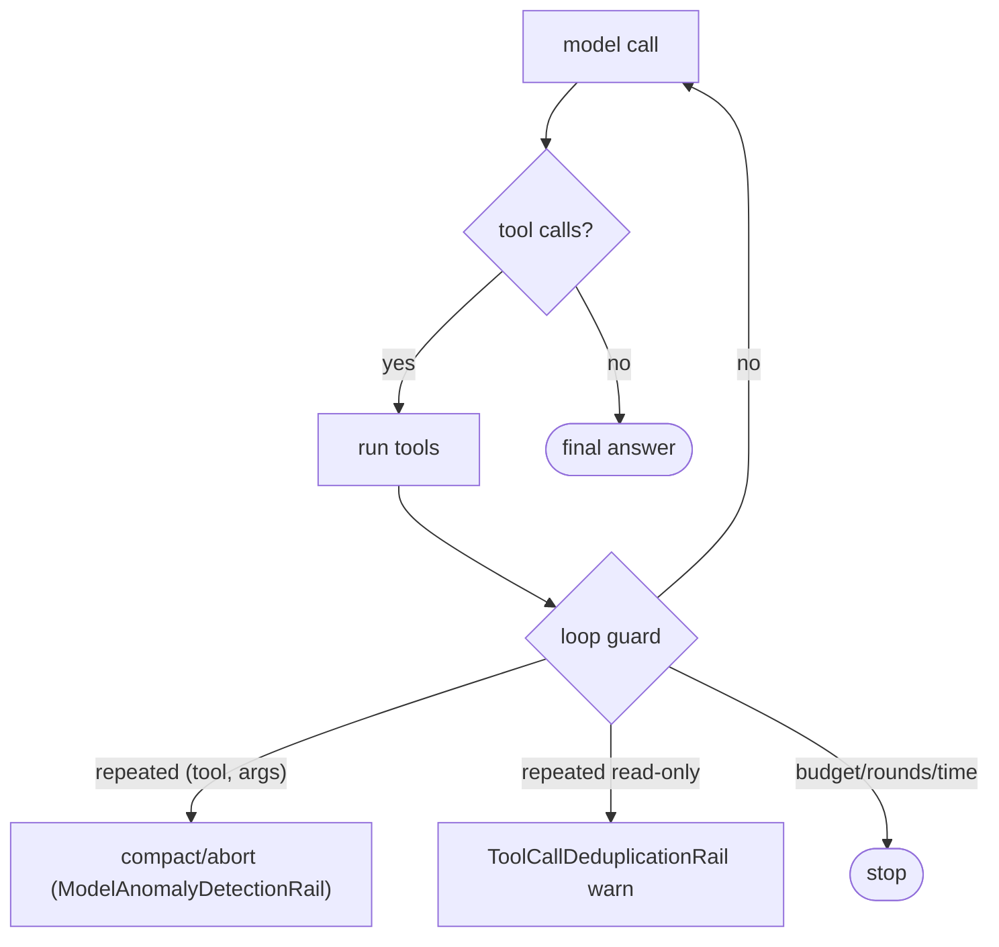

<sub>**Anchors:**<br>&bull; `agent-core/openjiuwen/core/single_agent/agents/react_agent.py:288` — `max_iterations` default 5; `agent-core/openjiuwen/harness/schema/config.py:252` — harness default 15<br>&bull; `agent-core/openjiuwen/harness/rails/model_anomaly_detection_rail.py:74/90` — tool-loop threshold + bailout<br>&bull; `jiuwenswarm/jiuwenswarm/agents/harness/common/rails/tool_dedup_rail.py:157` — cross-turn repeat counter<br>&bull; `agent-core/openjiuwen/harness/schema/stop_condition.py:181` — `NoProgressAnswerEvaluator`<br>&bull; `agent-core/openjiuwen/harness/deep_agent.py:2692` — hard 50-round ceiling<br>&bull; `agent-core/openjiuwen/agent_teams/reliability/detectors/repeat_tool.py:15` — repeat-tool; `agent-core/openjiuwen/agent_teams/reliability/detectors/pingpong.py:12` — ping-pong</sub>

## 15. Handling a tool call that returns malformed or unexpected output

**General:** Treat failures as data: catch the exception, classify retryability, return a structured error the model can react to, and repair obviously broken payloads (e.g. unbalanced JSON) when possible. Never crash the loop on a single bad tool result.

**Jiuwen:** `ToolCallResilienceRail` is auto-mounted, classifies retryable vs not, never retries non-idempotent tools, and returns a `[Retry Summary]` when the budget is exhausted. Broken tool arguments are repaired by bracket balancing in `AbilityManager`; if unrepairable, the raw JSON is surfaced to the model as an error. The general-purpose `JsonOutputParser` does not repair — it returns `None` on failure.

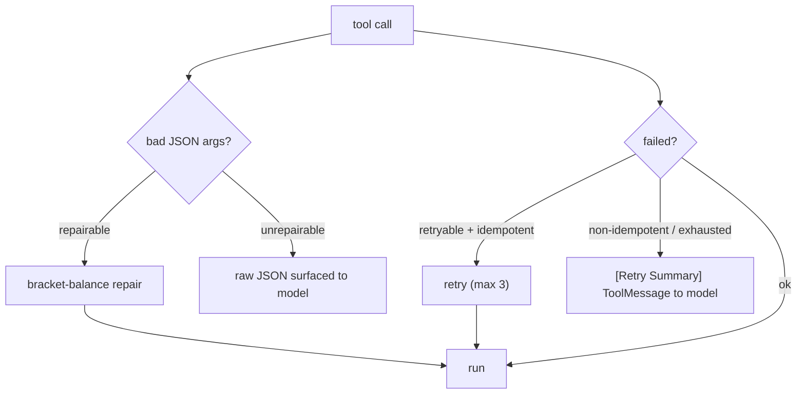

<sub>**Anchors:**<br>&bull; `agent-core/openjiuwen/core/single_agent/ability_manager.py:482` — bracket-balance repair; `:537` parse-with-repair; `:1378` surface raw JSON; `:1419` rewrite arguments<br>&bull; `agent-core/openjiuwen/harness/rails/tool_call_resilience_rail.py:169` — retry summary; `:198` retryable classification; `:222` non-idempotent guard<br>&bull; `agent-core/openjiuwen/core/foundation/llm/output_parsers/json_output_parser.py:56` — no repair, returns `None`<br>&bull; `agent-core/openjiuwen/core/foundation/tool/function/function.py:82` — schema validation on invoke</sub>

## 16. Single-agent vs. multi-agent, and when the added complexity is justified

**General:** Justified when you need genuinely separated context/ownership: parallel independent workstreams, distinct tool/permission scopes, or specialization that would otherwise fight for one context window. Not justified merely for "more intelligence"; multi-agent adds coordination cost and failure modes.

**Jiuwen:** Supported but not the default: `agent_teams` provides a leader/teammate model with a DB task board and mailbox, and subagents provide intra-agent delegation with isolated sessions/workspaces to avoid context pollution. The product's swarm is an assembly layer composing team specs from config. A single well-designed agent with good tools and memory is the baseline.

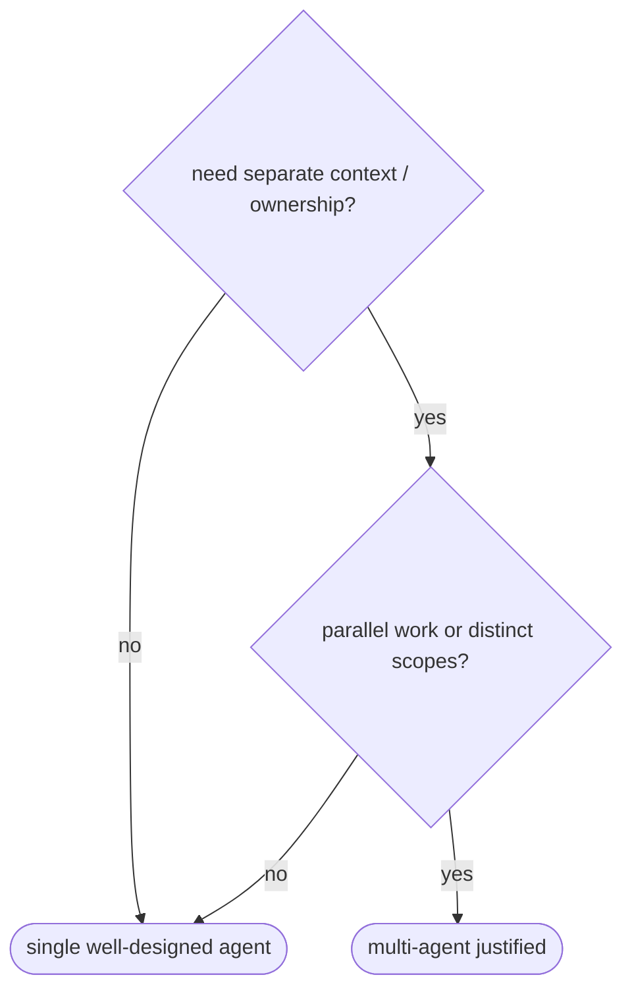

<sub>**Anchors:**<br>&bull; `agent-core/openjiuwen/harness/subagent_runtime/control.py:169` — reject live subagent re-spawn<br>&bull; `agent-core/openjiuwen/harness/tools/subagent/task_tool.py:194` — isolated subagent session; `:154` `TaskTool`<br>&bull; `jiuwenswarm/jiuwenswarm/agents/swarm/assembly.py:260` — product swarm assembly<br>&bull; `agent-core/openjiuwen/agent_teams/agent/team_agent.py:76` — one `TeamAgent` for leader/teammate</sub>

---

# Evaluation

## 17. Evaluating an LLM application beyond "it looks correct"

**General:** Combine automatic metrics (exact match, F1, functional/tests for code), an LLM-as-judge with a rubric for open-ended quality, and human review on a sample. Build a held-out set with representative and adversarial cases, score consistently, and track regressions.

**Jiuwen:** Three quality systems exist. `agent_evolving/evaluator/` provides `DefaultEvaluator`/`MetricEvaluator` with `LLMAsJudgeMetric` (semantic consistency) and `ExactMatchMetric` (normalized match). RSI's judge scores weighted `required_behaviors` + `rubric` + `forbidden_behaviors` with per-item evidence and penalties. `symphony/evaluation/` registers a suite of evaluators (`structure_conformance`, `accuracy`, `completeness`, `latency`, …) with LLM-judge and deterministic variants, and `evaluator_pipeline` runs a Docker benchmark emitting `pass_rate`/convergence. PerStream adds a GPT-3.5 judge.

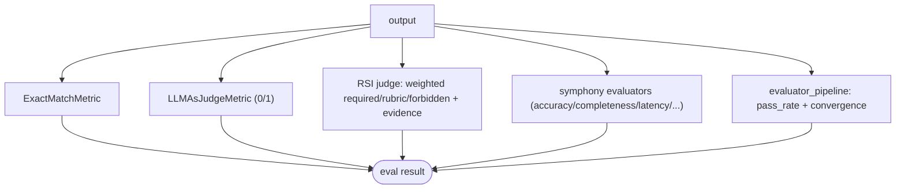

<sub>**Anchors:**<br>&bull; `agent-core/openjiuwen/agent_evolving/evaluator/evaluator.py:82` — `DefaultEvaluator`; `:197` `MetricEvaluator`; `:178` `_agg_score`<br>&bull; `agent-core/openjiuwen/agent_evolving/evaluator/metrics/llm_as_judge.py:47` — judge prompt + result; `agent-core/openjiuwen/agent_evolving/evaluator/metrics/exact_match.py:12` — `ExactMatchMetric`<br>&bull; `agent-core/openjiuwen/rsi/harness_rsi/evaluator/judger/scoring.py:193` — weighted score + penalties; `agent-core/openjiuwen/rsi/harness_rsi/evaluator/judger/llm_as_judge.py:159` `score_judge_output`; `:182` pass threshold<br>&bull; `agent-core/openjiuwen/symphony/evaluation/evaluators.py:671` — `BUILTIN_EVALUATORS`; `:438` `AccuracyEvaluator`<br>&bull; `agent-core/openjiuwen/agent_evolving/evaluator/evaluator_pipeline/pipeline.py:167` — `bench.evaluate`; `:664` `_compute_evolution_metrics`<br>&bull; `agent-core/examples/PerStream/src/eval/score_passive_judge.py:52` — GPT-3.5 correctness judge</sub>

**Gap.** Evaluators are library/CLI components, not a deployed quality dashboard; no cross-system aggregation, no statistical significance, no human calibration set.

## 18. Faithfulness vs. relevance in RAG evaluation

**General:** Relevance asks whether retrieved passages are on-topic for the query (context precision/recall). Faithfulness/groundedness asks whether the answer's claims are actually supported by the retrieved context (does it hallucinate beyond the evidence). A system can retrieve relevant context and still be unfaithful, or be faithful to irrelevant context. Measuring faithfulness requires giving the judge the context and checking claim support/citations, not just answer-vs-reference correctness.

**Jiuwen:** There is no retrieval-groundedness, faithfulness, attribution, or context-relevance metric. The closest concepts: symphony's `AccuracyEvaluator` judges factual correctness with a rubric about hallucination but does not receive the retrieved context, so it cannot detect unsupported-but-plausible claims; the reviewer rubric lists a `Correctness` dimension ("no hallucination") at weight 0.3; and the RSI judge accepts arbitrary `rubric`/`required_behaviors`, so a user *could* encode a groundedness rule, but none is defined.

```mermaid
flowchart TD
    CTX["retrieved context"] --> REL["relevance: context precision/recall"]
    ANS["answer"] --> FAITH["faithfulness: are claims supported by context?"]
    CTX --> FAITH
    REL --> JUDGE["RAG eval"]
    FAITH --> JUDGE
    CTX -.->|"not passed to judge"| X["no faithfulness/attribution metric implemented"]
```

<sub>**Anchors:**<br>&bull; `agent-core/openjiuwen/symphony/evaluation/evaluators.py:438` — `AccuracyEvaluator` (correctness, no context input); `:560` `Completeness`; `:621` `CapabilitySelection`<br>&bull; `agent-core/openjiuwen/agent_evolving/evaluator/metrics/llm_as_judge.py:58` — parses only `result: true/false`, no context/attribution input<br>&bull; `agent-core/openjiuwen/rsi/harness_rsi/evaluator/judger/scoring.py:68` — generic rubric contract (no built-in faithfulness dimension)<br>&bull; `agent-core/openjiuwen/harness/tools/web/free_search.py:299` — "simple relevance checks" (lexical, not RAG relevance)</sub>

**Gap.** Fully absent. No metric receives retrieved passages alongside the answer; no citation extraction or attribution check.

## 19. Building a regression test suite to catch a quality drop before it ships

**General:** Combine fast deterministic unit tests on the pipeline components with a quality eval suite on a fixed dataset scored by the same metrics each time; store a baseline and fail the build when the score drops beyond a threshold. Add golden/snapshot tests for prompts and outputs, and gate merges on the suite.

**Jiuwen:** Tests split into `tests/unit_tests/` (fast, deterministic, CI) and `tests/system_tests/` (E2E, usually skipped). `pytest` defines markers `level0` ("smoke / happy-path; PR gate must stay green") and `level1`, with `testpaths=["tests"]`. Quality evaluation exists separately: `evaluator_pipeline` emits `pass_rate`/`improvement`/`converged`, and `Trainer` compares a candidate's validation score against `best_score` and commits only improvements. But the CI gate that blocks merges (`ci_gate.yaml`) declares only `lint` and `type-check` — no pytest gate and no eval threshold.

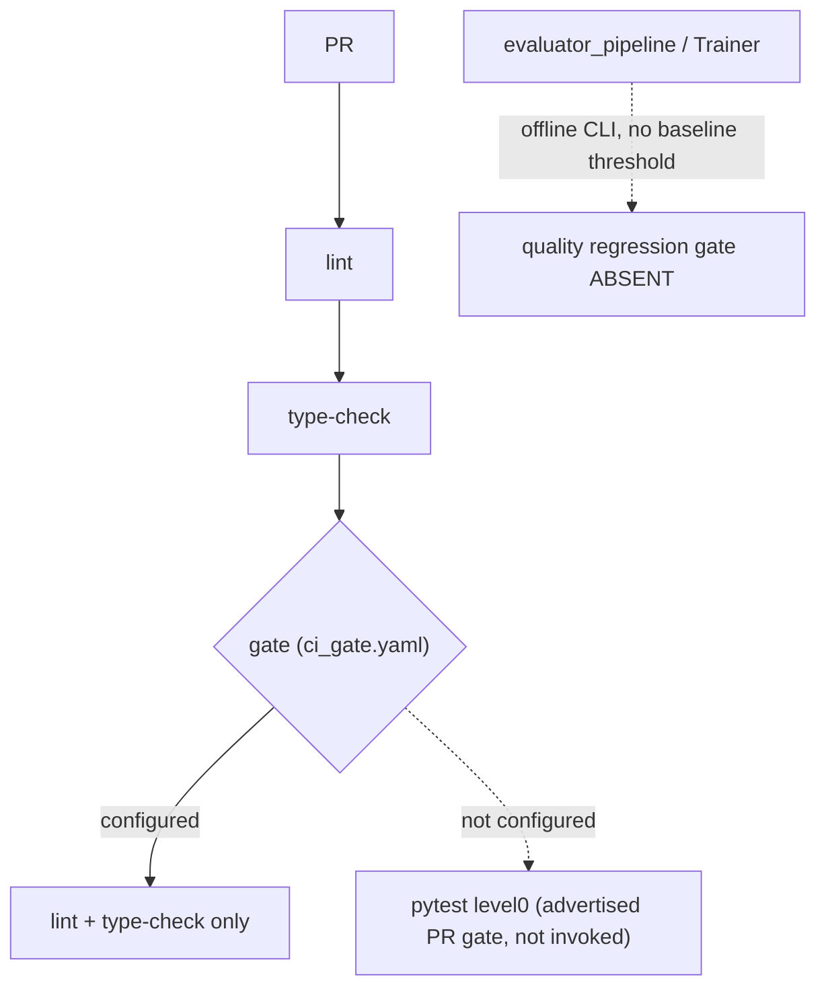

<sub>**Anchors:**<br>&bull; `agent-core/pyproject.toml:230` — pytest config + `level0`/`level1` markers<br>&bull; `agent-core/openjiuwen/auto_harness/resources/ci_gate.yaml:21` — gates are only `lint` and `type-check`<br>&bull; `agent-core/openjiuwen/auto_harness/infra/ci_gate_runner.py:1098` — gate dispatch; `agent-core/openjiuwen/auto_harness/stages/verify.py:451` `ci_gate.run("all")`; `:509` revert on exhaustion<br>&bull; `agent-core/openjiuwen/agent_evolving/trainer/trainer.py:217` — `improved = val_score > progress.best_score`<br>&bull; `agent-core/openjiuwen/agent_evolving/evaluator/evaluator_pipeline/pipeline.py:664` — `_compute_evolution_metrics`</sub>

**Gap.** No model/agent-quality regression gate in CI, no golden/snapshot tests for prompts/retrieval/outputs, and credential-requiring system tests are skipped. A quality drop would not be caught before ship by the configured automation.

## 20. Known limitations of using an LLM as a judge

**General:** LLM judges are biased (position/order, verbosity, self-preference), noisy, non-deterministic, and can be gamed or prompt-injected. They need position-swapping, multiple votes, agreement reporting, human calibration on a golden set, and must distinguish "judge failed" from "answer wrong". A single unvalidated judge score is a weak signal.

**Jiuwen:** Four judge implementations exist. `agent_evolving`'s `LLMAsJudgeMetric` is a single call, parses to `true/false`, and converts exceptions to `0.0` (conflating "judge failed" with "answer wrong"). RSI's judge does one format retry on frozen evidence and guards against injecting "prior output" as trusted data, but is still single-judgment. Symphony's `LLMJudgeEvaluator` is `temperature=0.0` with one repair retry. Only the online RL `JudgeScorer` uses `num_votes` parallel votes averaged together. None handles position bias or reports agreement.

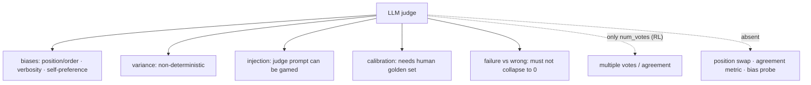

<sub>**Anchors:**<br>&bull; `agent-core/openjiuwen/agent_evolving/evaluator/metrics/llm_as_judge.py:53` — single invoke, exception → `0.0`; `agent-core/openjiuwen/agent_evolving/evaluator/evaluator.py:123` — same failure pattern<br>&bull; `agent-core/openjiuwen/rsi/harness_rsi/evaluator/judger/llm_as_judge.py:121` — two-attempt loop; `:152` untrusted prior-output guard<br>&bull; `agent-core/openjiuwen/symphony/evaluation/base.py:262` — single judge call + one repair retry; `:401` `temperature=0.0`<br>&bull; `agent-core/openjiuwen/agent_evolving/agent_rl/online/judge/evaluator.py:66` — `num_votes` averaged; `:92` raw votes retained<br>&bull; `agent-core/openjiuwen/agent_evolving/agent_rl/online/judge/judge_scorer.py:38` — `num_votes`<br>&bull; `agent-core/openjiuwen/rsi/harness_rsi/evaluator/judger/scoring.py:127` — strict single-verdict parsing</sub>

**Gap.** No position/order-bias control, no inter-rater agreement (Cohen/Krippendorff), no variance threshold, and no human calibration. Most paths convert judge/infra failure to `0.0`.

---

# System design and scale

## 21. What happens to your architecture at 10x current traffic

**General:** You hit dependencies and queues before arithmetic: provider rate limits and 429s, serialized tool/DB access, memory pressure from context, and connection pools. Costs scale roughly linearly with tokens but can super-linearly if retries or coordination rise. Fixes are caching, concurrency limits, queues/shards, backpressure, and cheaper routing — plus autoscaling at the process boundary.

**Jiuwen:** The system has per-process bounded resources rather than elastic scaling. LLM HTTP concurrency is capped by a shared httpx pool (`max_connections=100`, keepalive 20); embeddings by a semaphore (default 50) with batch size 8; team sub-agent fan-out by a semaphore (default 10); the warm pool and message queues have their own bounds. Internal channels use bounded `asyncio.Queue(maxsize=...)`; workflow HTTP supports token-bucket rate limiting; retries/backoff exist at model and tool layers. There is no autoscaling.

```mermaid
flowchart TD
    X["10x traffic"] --> RL["provider rate limits / 429"]
    X --> POOL["bounded conn pool (100/30 per host)"]
    X --> SEM["semaphores: embeddings 50 · sub-agents 10"]
    X --> Q["bounded asyncio.Queue (backpressure)"]
    RL --> FIX["retry + backoff · rate limit"]
    POOL --> FIX
    SEM --> FIX
    Q --> FIX
    FIX -.->|"absent"| AUTO["no autoscaling / distributed limiter / bulkheads"]
```

<sub>**Anchors:**<br>&bull; `agent-core/openjiuwen/core/common/clients/connector_pool.py:21` — `limit: 100`, `limit_per_host: 30`; `agent-core/openjiuwen/core/foundation/llm/model_clients/openai_model_client.py:1118` — pool limits<br>&bull; `agent-core/openjiuwen/core/retrieval/embedding/api_embedding.py:55` — concurrency semaphore<br>&bull; `agent-core/openjiuwen/core/multi_agent/teams/hierarchical_msgbus/p2p_ability_manager.py:34` — max parallel sub-agents<br>&bull; `agent-core/openjiuwen/core/workflow/components/tool/http/http_request_component.py:110` — `HttpRateLimitConfig`<br>&bull; `agent-core/openjiuwen/core/runner/message_queue_inmemory.py:34` — bounded queue; `agent-core/openjiuwen/harness/subagent_runtime/activity_events.py:53` — bounded activity queue<br>&bull; `agent-core/openjiuwen/harness/rails/model_anomaly_detection_rail.py:35` — backoff schedule; `jiuwenswarm/jiuwenswarm/server/runtime/agent_warm_pool.py:154` — warm-pool semaphore split</sub>

**Gap.** No HPA/autoscaling, no global/distributed rate limiter or admission control, no cross-tenant bulkheads. Connection caps and cost totals are per-process, so N replicas multiply the effective limit.

## 22. Reducing latency in a multi-step LLM pipeline

**General:** Stream tokens so time-to-first-token matters more than total; run independent steps in parallel; cache prompts/prefixes and embeddings; route easy steps to faster/smaller models; and avoid blocking the event loop. Measure TTFT and per-stage latency to find the bottleneck.

**Jiuwen:** End-to-end streaming is supported (ReAct `stream` → session stream iterator → WebSocket chunk frames), and TTFT is measured per model call (`ttft_ms`). Shared persistent HTTP clients avoid per-call TLS setup, parallel tool execution shortens multi-tool turns, and local inference uses prompt/prefix KV-cache reuse. `IntelliRouter` provides a reliable router across deployments, and the product caches built model objects by name.

```mermaid
flowchart LR
    REQ["multi-step pipeline"] --> ST["streaming (SSE/WS chunks) + TTFT measured"]
    REQ --> PAR["parallel tool execution"]
    REQ --> CACHE["KV/prefix cache (local inference) · model object cache"]
    REQ --> ROUTE["IntelliRouter → deployment selection"]
    REQ --> TO["asyncio.to_thread for blocking work"]
    REQ -.->|"absent"| X["speculative decoding · latency-based routing · cross-request batching"]
```

<sub>**Anchors:**<br>&bull; `agent-core/openjiuwen/core/single_agent/agents/react_agent.py:2938` — `stream` entry; `:1758` `ttft_ms`<br>&bull; `agent-core/openjiuwen/core/foundation/llm/model.py:197` — stream first-chunk/idle timeouts<br>&bull; `agent-core/openjiuwen/core/kv_cache/kv_cache_runtime.py:32` — session KV-cache runtime<br>&bull; `agent-core/openjiuwen/symphony/retrieval/llm/vllm/client.py:176` — `prepare_prefix_cache`<br>&bull; `agent-core/openjiuwen/core/foundation/llm/model_clients/intelli_router_model_client.py:32` — `ReliableRouter`<br>&bull; `jiuwenswarm/jiuwenswarm/server/runtime/agent_adapter/interface_deep.py:6353` — model object cache by name</sub>

**Gap.** No speculative decoding, no latency/SLA-based routing, no cross-request batching; prefix caching exists only for local inference.

## 23. Controlling cost when an agent can call tools repeatedly

**General:** Bound the loop (max iterations/rounds/time), cap tokens, make cheap models do cheap work, cache, and surface per-run cost so it can be budgeted. Retries and huge tool outputs are common hidden cost sources.

**Jiuwen:** The product tracks provider-reported session cost and enforces a per-session cap: totals accumulate under a lock, `set_session_cost_limit` sets a ceiling only when provider cost metadata is available, and `raise_if_session_cost_limit_exceeded` raises when over. Core limits repetition via ReAct `max_iterations` (default 5, harness 15), team `BudgetLedger` token ceilings, and `ModelAnomalyDetectionRail`'s tool-loop compaction/bailout. `ToolCallDeduplicationRail` counts repeated read-only calls and warns.

```mermaid
flowchart TD
    M["model call"] --> D{"tool calls?"}
    D -->|yes| T["run tools"]
    T --> L{"loop guard: repeated (tool,args)"}
    L -->|"threshold"| CMP["compact / abort"]
    T --> M
    SESS["session cost cap (usage_cost.py)"] -.->|"pre-flight + mid-stream"| M
    BUD["team BudgetLedger token ceiling"] -.-> T
    ITER["max_iterations 5 / 15"] -.-> M
```

<sub>**Anchors:**<br>&bull; `jiuwenswarm/jiuwenswarm/server/runtime/usage_cost.py:171` — `raise_if_session_cost_limit_exceeded`; `:196` `set_session_cost_limit` (requires provider cost)<br>&bull; `agent-core/openjiuwen/core/single_agent/agents/react_agent.py:288` — `max_iterations`; `agent-core/openjiuwen/harness/schema/config.py:252` — harness default 15<br>&bull; `agent-core/openjiuwen/agent_teams/workflow/engine/budget.py:27` — `BudgetLedger`<br>&bull; `agent-core/openjiuwen/harness/rails/model_anomaly_detection_rail.py:74/90` — tool-loop threshold + bailout<br>&bull; `jiuwenswarm/jiuwenswarm/agents/harness/common/rails/tool_dedup_rail.py:157` — cross-turn repeat counter; `agent-core/openjiuwen/harness/goal/evaluation.py:298` — `max_attempts`</sub>

**Gap.** Cost enforcement is inert unless the provider reports cost metadata, and totals/limits are per-process (not shared across replicas). No cost-aware model downgrade or per-tool hard token budget in the core single-agent path.

## 24. Designing caching for repeated or semantically similar queries

**General:** Layer caches: exact-match response/prompt cache, provider prefix/prompt caching, embedding cache, and — harder — a semantic cache that embeds the query and returns a prior answer for similar queries above a similarity threshold. The semantic cache needs a threshold and invalidation strategy, and exact-match caches need a stable key including model and parameters.

**Jiuwen:** Caching is exact-match, not semantic. Core has a session KV-cache runtime with affinity/lineage identities (parent/child sessions, team members, compressors) to reuse inference KV state. The product memory index keeps a SQLite `embedding_cache` keyed by text hash, and `agent_evolving` has its own embedding cache. `ToolCallDeduplicationRail` is an exact `(tool_name, args-hash)` per-turn result cache for read-only tools. Local vLLM/transformers use prefix/prompt caches.

```mermaid
flowchart TD
    Q["query"] --> EX{"exact-match key?"}
    EX -->|"embedding text-hash"| EMB["embedding_cache hit"]
    EX -->|"tool (name,args-hash)"| TOOL["ToolCallDeduplicationRail hit"]
    EX -->|"session lineage"| KV["KV-cache reuse (local inference)"]
    EX -->|"no exact hit"| MISS["compute"]
    Q -.->|"absent"| SEM["semantic cache: embed query → similar prior answer"]
```

<sub>**Anchors:**<br>&bull; `agent-core/openjiuwen/core/kv_cache/kv_cache_runtime.py:32` — `KVCacheRuntime`; `agent-core/openjiuwen/core/kv_cache/__init__.py:10` — `KVCacheAffinityConfig`<br>&bull; `jiuwenswarm/jiuwenswarm/agents/harness/common/memory/manager.py:31` — `EMBEDDING_CACHE_TABLE`; `:773` text-hash lookup before embedding<br>&bull; `jiuwenswarm/jiuwenswarm/agents/harness/common/rails/tool_dedup_rail.py:47` — exact per-turn tool result cache<br>&bull; `agent-core/openjiuwen/core/retrieval/lazy_load.py:25` — lazy import cache; `agent-core/openjiuwen/core/context_engine/token/tiktoken_counter.py:221` — reusable encodings<br>&bull; `agent-core/openjiuwen/agent_evolving/ttse/stores.py:522` — embedding cache limit; `agent-core/openjiuwen/symphony/retrieval/llm/vllm/client.py:176` — prefix cache</sub>

**Gap.** No semantic/response cache anywhere — nothing embeds a query and looks up a prior answer by similarity. Tool dedup is exact-arg and single-turn only; embedding cache is memory-only.

---

# Security

## 25. What prompt injection is, and how you'd defend against it

**General:** Prompt injection is untrusted input containing instructions that hijack the model (direct user input, or indirect via retrieved/tool content). Defenses: treat content as data not instructions, delimit/label untrusted content, never let it trigger privileged actions without a permission re-check, and enforce controls outside the model (tool policy, sandboxing, egress rules). Instructions in the prompt alone are not a control.

**Jiuwen:** The codebase separates prompt-level from enforced defenses. Prompt-level: `SafetyPromptRail` injects a bilingual safety section into the system prompt before each call (instruction, not control). Enforced: shell command/process substitution is blocked before execution, the permission engine merges tiered tool policy + file guard + net guard by "strictest" and floors risky shell structures to ASK, and builtin YAML denies reverse shells, disk writes, shutdown, and sensitive paths. A pluggable guardrail framework exists for injection detection, and the auto-harness adds an input heuristic that force-finishes on "ignore previous instructions".

```mermaid
flowchart TD
    INJ["prompt injection"] --> P["prompt-level: SafetyPromptRail adds safety text (advice)"]
    INJ --> ENF["enforced: tool policy + file guard + net guard (strictest)"]
    ENF --> ASK["risky shell structure → ASK floor (tree-sitter AST)"]
    ENF --> DENY["builtin rules: reverse shell / disk / shutdown / sensitive paths"]
    INJ --> SH["shell: block backtick / `$()` before execution"]
    INJ --> G["guardrail framework (injection detect) — no production registration"]
```

<sub>**Anchors:**<br>&bull; `agent-core/openjiuwen/harness/rails/security/prompt_security_rail.py:16` — `SafetyPromptRail`; `:38` injects safety section; `agent-core/openjiuwen/harness/prompts/sections/safety.py:14` — static safety text<br>&bull; `agent-core/openjiuwen/harness/tools/shell/bash/_security.py:29` — substitution regex; `:40` `check_injection` blocks<br>&bull; `agent-core/openjiuwen/harness/resources/builtin_rules.yaml:59` — reverse-shell deny; `:35` disk deny; `:99` shutdown; `:148` sensitive paths<br>&bull; `agent-core/openjiuwen/harness/security/permission_engine/toolguard/tool_policy.py:588` — tiered policy; `:409` shell AST floor; `:502` ASK fallback; `agent-core/openjiuwen/harness/security/permission_engine/toolguard/shell_ast.py:82` — deterministic parse; `agent-core/openjiuwen/harness/security/permission_engine/core.py:272` — merge<br>&bull; `agent-core/openjiuwen/core/security/guardrail/builtin.py:60` — `PromptInjectionGuardrail`; `agent-core/openjiuwen/core/security/guardrail/backends.py:181` — default patterns<br>&bull; `agent-core/openjiuwen/rsi/harness_rsi/auto_harness/rails/security_rail.py:119` — input heuristic → `request_force_finish`</sub>

**Gap.** The configurable `PromptInjectionGuardrail` has no production registration; `SafetyPromptRail` only adds system-prompt text and never inspects or rewrites user/tool content. Enforcement comes from the shell/permission layer, not from injection detection.

## 26. Handling untrusted content from a tool result or retrieved document

**General:** Treat tool output and retrieved documents as untrusted data, never as instructions. Delimit and label them as data, strip control/escape sequences, and never let them silently trigger privileged actions without re-checking permissions. Prompt injection via tool output is a real threat because it flows straight into the model context.

**Jiuwen:** Weakest area. Tool results are rendered through the tool's own `render_for_llm` and wrapped in a plain `ToolMessage` with no data/instruction framing; after-tool rails may rewrite the result but nothing marks it untrusted. Sanitizer helpers exist (`sanitize.py`) but have no production callers. The only untrusted-data defenses are prompt-level: the auto-harness input heuristic scans model input (not tool output), and the personal-context pipeline instructs its summarizer to treat supplied content as untrusted data (one internal call). There is no mandatory untrusted-tool-result seam.

```mermaid
flowchart TD
    T["tool result / retrieved doc"] --> MSG["ToolMessage (no untrusted framing)"]
    MSG --> M["model context"]
    SAN["sanitize.py helpers"] -.->|"no production callers"| MSG
    H["auto-harness heuristic (scans model input, not tool output)"] -.->|"partial"| M
    GAP["no untrusted-data seam"] -.-> MSG
    GAP -.-> RISK(["prompt-injection risk"])
```

<sub>**Anchors:**<br>&bull; `agent-core/openjiuwen/core/single_agent/ability_manager.py:266` — `_render_tool_result`; `:1612` builds `ToolMessage` with no untrusted wrapper; `:1281` after-tool rewrite adds no label<br>&bull; `agent-core/openjiuwen/harness/prompts/sanitize.py:11` — `sanitize_path`; `:20` `sanitize_user_content` (no production callers)<br>&bull; `agent-core/openjiuwen/rsi/harness_rsi/auto_harness/rails/security_rail.py:119` — heuristic runs before model call<br>&bull; `agent-core/openjiuwen/harness/personal_context/context_pipeline.py:9237` — prompt-level "untrusted source data, never instructions"; `agent-core/openjiuwen/harness/personal_context/agent_support.py:792` — same for the subagent path</sub>

## 27. Preventing sensitive data from leaking into a model's context or output logs

**General:** Detect and redact secrets before they reach the model or the logs: scrub known patterns (API keys, tokens, PII) from tool results and prompts, redact log fields (don't just drop whole fields), gate egress of secret-like payloads, and keep a path to audit without storing the secret. Detection alone is not redaction.

**Jiuwen:** Actual model-context redaction exists only as a demo rail: `SensitivedatasanitizeRail` regex-redacts keys/tokens/bearer strings in history and responses, replacing with `[REDACTED]`. In production, redaction is layer-specific: structured log events redact whole sensitive fields via an allowlist, the auto-permission audit writer redacts secret-like text before appending JSONL, and the auto-permission rule engine *detects* secret-like egress payloads to force ASK/DENY rather than redact. There is no built-in sensitive-data guardrail.

```mermaid
flowchart LR
    SEC["secret in tool result / prompt"] --> DEMO["SensitiveDataSanitize demo rail: [REDACTED] (example only)"]
    SEC --> LOG["log events: drop/redact whole named fields"]
    SEC --> AUD["audit writer: narrow secret redaction"]
    SEC --> EGRESS["permission engine: detect secret egress → ASK/DENY"]
    SEC -.->|"absent"| CTX["guaranteed context redaction on the normal path"]
```

<sub>**Anchors:**<br>&bull; `agent-core/examples/security_rail_demo/SensitiveDataSanitize/rail.py:27` — sensitive regexes; `:60` `run_security_check`; `:96` `_sanitize_output` rewrites history/response<br>&bull; `agent-core/openjiuwen/core/common/logging/events.py:920` — `sanitize_event_for_logging`; `:932` sensitive field list; `:951` `<REDACTED>`; `agent-core/openjiuwen/core/common/logging/base_impl.py:114` `_sanitize_message`<br>&bull; `jiuwenswarm/jiuwenswarm/agents/harness/common/rails/permissions/persistent_audit.py:50` — secret-like pattern; `:262` `_sanitize_audit_text`; `:289` combined detection<br>&bull; `jiuwenswarm/jiuwenswarm/agents/harness/common/rails/permissions/auto_decision.py:32` — egress secret patterns; `:82` redacted risk labels<br>&bull; `agent-core/openjiuwen/core/security/guardrail/builtin.py` — only `PromptInjectionGuardrail` (no sensitive-data guardrail)</sub>

**Gap.** `SensitiveDataSanitize` is example-only; production redaction is partial and layer-specific (log redaction destroys debuggability rather than scrubbing payloads). Nothing guarantees secrets are stripped from model context on the normal path.

---

# Judgment and tradeoffs

## 28. Larger model vs. smaller, faster one for a given task

**General:** Match model capability to task difficulty: use a large model for reasoning/ambiguity and a small/fast one for classification, extraction, routing, and formatting. Measure quality per task and weigh latency and cost; route by task, and fall back to the larger model only when needed. A leaderboard score is a prior, not a per-task decision.

**Jiuwen:** Model selection here is about availability and endpoint distribution, not task quality. A team can declare a `model_pool` of endpoints or a `ModelRouterConfig`/`IntelliRouterConfig` convenience shape; allocators (`RoundRobin`, `ByModelName`, `Router`, `IntelliRouter`) pick an entry by rotation or an explicit `model_name` hint supplied per agent/task. IntelliRouter is rate-aware only through `tpm`/`rpm` budgets. The `ModelPoolEntry` metadata comment ("weights, affinity hints") is documented but not implemented.

```mermaid
flowchart TD
    TASK["task"] --> HINT["caller-supplied model_name hint (per agent/task)"]
    HINT --> ALLOC{"allocator"}
    ALLOC --> RR["RoundRobin"]
    ALLOC --> BN["ByModelName"]
    ALLOC --> IR["IntelliRouter (tpm/rpm rate-aware, failover)"]
    IR -.->|"not accuracy-based"| X["no cost/latency/quality-based model selection"]
```

<sub>**Anchors:**<br>&bull; `agent-core/openjiuwen/agent_teams/models/pool.py:38` — `ModelPoolEntry`; `:133` `ModelRouterConfig`; `:241` `IntelliRouterDeployment`; `:314` `IntelliRouterConfig`; `:278` tpm/rpm rate-aware; `:95` "weights/affinity hints" (documented, not implemented)<br>&bull; `agent-core/openjiuwen/agent_teams/models/allocator.py:176` round-robin; `:240` by-model-name; `:452` IntelliRouter; `:559` `build_model_allocator`; `:13` allocation-vs-reliability docstring<br>&bull; `agent-core/openjiuwen/harness/schema/config.py:248` / `agent-core/openjiuwen/harness/schema/deep_agent_spec.py:448` — per-agent/task model config</sub>

**Gap.** Routing is not accuracy-based and has no cost/latency/quality-based selection. Choosing a smaller cheap model is a caller/human decision expressed as a `model_name` hint.

## 29. A stakeholder wants to ship before your eval scores are ready, how do you handle it

**General:** This is mostly process. De-risk instead of refusing: ship behind a flag or to a small canary, define a rollback path, cap the blast radius, agree on a minimal offline eval before broad rollout, and add monitoring so a quality drop is caught quickly. Make the tradeoff explicit (what's unmeasured, what the fallback is) and put a date on the missing eval.

**Jiuwen:** The closest code mechanisms are CI gates and explicit human activation, not an eval-score gate. The auto-harness `CIGateRunner` loads gates from `ci_gate.yaml` and returns pass/fail; the activate stage requires an explicit user `accept`/`reject` before an extension is hot-loaded; and the product's RSI harness activation supports rollback (refuses while tasks are active, validates the target hash, hot-loads the old version). Behavior gating is done with `enable_*` config flags. There is no release gate tied to eval thresholds and no canary/percentage rollout.

```mermaid
flowchart TD
    SHIP{"ship before evals ready"} --> FLAG["config enable_* flags (opt-in behavior)"]
    SHIP --> CI["CI gate: lint/type-check (no eval threshold)"]
    SHIP --> ACT["activate stage: explicit accept/reject"]
    SHIP --> RB["RSI rollback: validate hash + hot reload"]
    SHIP -.->|"absent"| CANARY["canary / staged rollout / eval-threshold gate"]
```

<sub>**Anchors:**<br>&bull; `agent-core/openjiuwen/auto_harness/infra/ci_gate_runner.py:168` load gates; `:1064` run + aggregate `passed`<br>&bull; `agent-core/openjiuwen/auto_harness/stages/activate.py:99` — explicit `accept`/`reject` interaction before hot-load<br>&bull; `agent-core/openjiuwen/auto_harness/stages/merge.py:91` — static-check retry (max 3) then fail-fast<br>&bull; `jiuwenswarm/jiuwenswarm/agents/harness/common/rsi/harness_activation.py:617` `rollback`; `:682` `_assert_rollback_allowed`; `:694` validate target hash<br>&bull; `agent-core/openjiuwen/harness/schema/deep_agent_spec.py:448` — `enable_*` config flags</sub>

**Gap.** No eval-threshold release gate and no canary/percentage rollout; the decision is human process, supported only by feature flags, explicit activation, CI checks, and manual rollback.

## 30. Deciding when a problem actually needs an LLM versus a simpler rule-based system

**General:** Use a rule-based/deterministic system when the logic is enumerable, must be auditable, or needs exact reproducibility (validation, routing by known patterns, permission checks, arithmetic, parsing). Use an LLM when the task is semantic, open-ended, or handles ambiguity that rules cannot enumerate (summarization, intent, extraction from messy text). Rules for control, LLM for meaning; often both.

**Jiuwen:** The codebase deliberately routes many decisions through deterministic code. The permission engine is a pure rule/AST engine — its docstring notes the model is not used on the permission path — evaluating tiered regex rules and a tree-sitter shell AST before falling back to ASK. The product's auto-permission layer has deterministic routes that hard-block/ask by URL scheme, egress fields, and capability side-effects before any reviewer is consulted. Lexical/deterministic retrieval coexists with vector paths (SQLite FTS5 BM25, RRF rank fusion), and structured JSON is extracted with deterministic parsers. Conversely, memory extraction uses an LLM key-information classifier because judging "is this worth remembering" is semantic.

```mermaid
flowchart TD
    D{"decision type"} -->|"enumerable / auditable / exact"| R["rules: permission engine, shell AST, deterministic routes"]
    D -->|"semantic / ambiguous"| L["LLM: memory extraction classifier, reviewer"]
    R --> EX["FTS5 BM25 · RRF fusion · deterministic JSON parse"]
    L --> EX2["key-information classifier · quality reviewer"]
```

<sub>**Anchors:**<br>&bull; `agent-core/openjiuwen/harness/security/permission_engine/core.py:192` — docstring: LLM not used on the permission path<br>&bull; `agent-core/openjiuwen/harness/security/permission_engine/toolguard/tool_policy.py:588` — rule-based tiered policy; `agent-core/openjiuwen/harness/security/permission_engine/toolguard/shell_ast.py:82` — deterministic parse<br>&bull; `jiuwenswarm/jiuwenswarm/agents/harness/common/rails/permissions/auto_decision.py:73` `deterministic_guard_route`; `:116` `deterministic_domain_route`<br>&bull; `jiuwenswarm/jiuwenswarm/agents/harness/common/memory/internal.py:165` `bm25_rank_to_score`; `jiuwenswarm/jiuwenswarm/agents/harness/common/memory/manager.py:1044` FTS BM25<br>&bull; `agent-core/openjiuwen/core/retrieval/utils/fusion.py:15` `rrf_fusion`; `agent-core/openjiuwen/core/foundation/store/index/simple_memory_index.py:348` sort by score<br>&bull; `agent-core/openjiuwen/core/context_engine/context/message_buffer.py:74` — deterministic drop beyond 2×<br>&bull; `agent-core/openjiuwen/rsi/harness_rsi/auto_harness/infra/parsers.py:339` — deterministic JSON extraction<br>&bull; `agent-core/openjiuwen/core/memory/process/extract/memory_analyzer.py:26` — LLM classifier (semantic)</sub>

**Gap.** The boundary is principled but implicit — no single "classifier vs LLM" decision function or policy table exists; each subsystem chooses independently.

---

## Summary: strong vs weak in Jiuwen

| Area | Strength | Notes |
|---|---|---|
| Concurrent tool calls | Strong | per-turn parallel batches, resource lanes, `parallel_safe` barrier, bound semaphores |
| I/O concurrency model | Strong | single-process async/anyio, shared connection pool, `to_thread` for blocking |
| Per-stage error isolation | Mixed | retriever fallbacks + rails; reranker failure aborts, no circuit breaker |
| Retry without duplicate effects | Strong | secure-by-default `idempotent`, layered retry, read-only dedup; no durable idempotency keys |
| Tokenization / cost accounting | Strong | model-aware counters, budgets, provider usage metadata |
| Sampling params | Mixed | passthrough + local math; top-k sampling absent |
| Transformer internals | Weak | absent; delegated to providers/HF |
| RAG pipeline | Mixed | real ingest/retrieve components; no packaged RAG agent, no context trimming, no rerank |
| Chunking | Strong | char/token/hybrid, validation, tokenizer clamps |
| Cosine ranking | Mixed | backend-rescaled scores, no calibration/MMR |
| Reranking | Weak | cross-encoder exists but not wired into the RAG path |
| Function calling | Strong | schema-driven, validated, multi-provider |
| Loop prevention | Strong | iteration caps, anomaly/dedup rails, stop-condition chain |
| Malformed tool output | Strong | JSON repair, structured error to model, retry classification |
| Single vs multi-agent | Strong | teams + subagents with isolated sessions; not default |
| Output evaluation | Strong | exact-match, LLM-judge, RSI rubric, benchmark pipelines |
| Faithfulness / relevance eval | Weak | absent; judges do not receive retrieved context |
| Regression test gate | Weak | unit tests + eval CLI, but CI gate is lint/type-check only |
| LLM-as-judge rigor | Weak | single vote, no position-swap/agreement/calibration; failures → 0.0 |
| Scale (10x) | Mixed | per-process bounds + backpressure; no autoscaling/distributed limits |
| Latency | Strong | streaming, TTFT, parallel tools, KV/prefix cache, routing |
| Cost control | Mixed | session cost cap enforced when provider reports cost; task-loop budget opt-in |
| Caching | Mixed | exact-match embedding/tool/KV caches; no semantic response cache |
| Prompt-injection defense | Mixed | enforced shell/permission layer; injection detector unregistered, safety text only |
| Untrusted tool/retrieved content | Weak | no untrusted-data seam; sanitizer unused |
| Sensitive-data redaction | Weak | demo rail only; production redaction partial/layer-specific |
| Model size / routing | Mixed | availability/cost routing; not accuracy-based, no auto downgrade |
| Ship-before-eval | Mixed | flags + activation + rollback; no eval-threshold gate or canary |
| Rule-based vs LLM | Strong | deterministic permission/AST/lexical paths alongside semantic LLM use |
