# GenAI interview questions — general answers + how Jiuwen does it

Based on the recurring list *GenAI Interview Questions That Repeat Across Every Platform* (Foundational Concepts; Prompting; RAG and Retrieval; Fine-Tuning and Customization; Agents and Tool Use; Evaluation; Production and Scale; Safety and Ethics). Each section heading is the original question.

This set deliberately overlaps the other docs — many questions here are the same as in the LLM, RAG, framework, and engineering sets, so their **General** and **Jiuwen** answers are reused verbatim (with the same anchors). The questions unique to this set are RAG vs. fine-tuning, grounding when retrieved context does not answer, when fine-tuning is worth it, small-dataset risk, prompt versioning, harmful/biased content, and jailbreak defense. See [README](README.md) for the shared conventions (answer shape, anchor format, repo layers).

---

# Foundational concepts

## 1. What's the difference between a token and a word, and why does that distinction matter for cost and context limits

**General:** A token is a sub-word unit from a BPE/unigram vocabulary, so one word can be several tokens (and code/rare words fragment heavily). Cost and context limits are measured in tokens, not words, so a language or domain that fragments more costs more per word and fills the window faster.

**Jiuwen:** Counts tokens, never words, via a pluggable `TokenCounter`. `TiktokenCounter` maps known model names to encodings with `cl100k_base` and `len(text)//3` fallbacks; `TiktokenModelCounter` loads a model-native BPE vocabulary; `TokenizerManager` downloads HuggingFace/tiktoken artifacts per model. Counts drive per-model context limits (default 200,000), compression/offload thresholds, and cost via provider-reported `usage_metadata`.

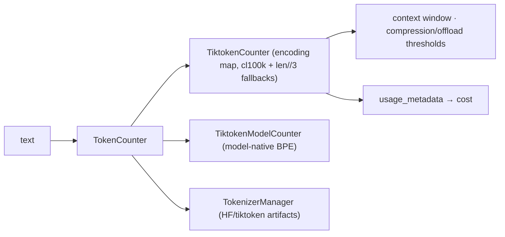
```mermaid
flowchart LR
    TEXT["text"] --> TC["TokenCounter"]
    TC --> TK["TiktokenCounter (encoding map, cl100k + len//3 fallbacks)"]
    TC --> TM["TiktokenModelCounter (model-native BPE)"]
    TC --> TOK["TokenizerManager (HF/tiktoken artifacts)"]
    TK --> BUD["context window · compression/offload thresholds"]
    TK --> COST["usage_metadata → cost"]
```

**Anchors:** &bull; `agent-core/openjiuwen/core/context_engine/token/tiktoken_counter.py:212` — `TiktokenCounter`; `:225` encoding map; `:287` `len//3` fallback &bull; `agent-core/openjiuwen/core/context_engine/token/tiktoken_model_counter.py:86` — model-native BPE &bull; `agent-core/openjiuwen/core/context_engine/token/tokenizer_spec.py:34/50` — `TokenizerSpec` + fallback policy &bull; `agent-core/openjiuwen/core/context_engine/token/tokenizer_manager.py:60/124` — resolves/downloads artifacts &bull; `agent-core/openjiuwen/core/context_engine/context/context_utils.py:20` — `DEFAULT_CONTEXT_MAX_TOKENS = 200000` &bull; `agent-core/openjiuwen/core/foundation/llm/schema/message.py:28` — `total_tokens` usage metadata

## 2. Explain how transformers use self-attention to process a sequence

**General:** Each token is projected to query, key, and value vectors. The query is dot-producted with every token's key (scaled by `1/√d_k`), softmaxed into attention weights, and used to take a weighted sum of the values. Multiple heads and stacked layers let each token aggregate context-dependent information from the whole sequence, weighted by content.

**Jiuwen:** Not implemented — attention is delegated to provider APIs or to HuggingFace models loaded by name. There is no Q/K/V or scaled-dot-product code; the only `torch.softmax` in the framework is token sampling. The boundary is the model-client/config layer.

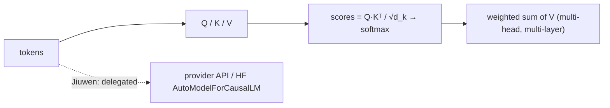
```mermaid
flowchart LR
    TOK["tokens"] --> QKV["Q / K / V"]
    QKV --> S["scores = Q·Kᵀ / √d_k → softmax"]
    S --> OUT["weighted sum of V (multi-head, multi-layer)"]
    TOK -.->|"Jiuwen: delegated"| API["provider API / HF AutoModelForCausalLM"]
```

**Anchors:** &bull; `agent-core/openjiuwen/core/foundation/llm/schema/config.py:13` — provider boundary &bull; `agent-core/openjiuwen/core/foundation/llm/model_clients/openai_model_client.py:865` — delegates computation to the API &bull; `agent-core/openjiuwen/symphony/retrieval/llm/transformers_logit_selection/client.py:227` — forward + logit extraction only &bull; `agent-core/openjiuwen/symphony/retrieval/llm/transformers_prefix_cached_generation/client.py:175` — `AutoModelForCausalLM` &bull; `agent-core/openjiuwen/symphony/retrieval/llm/transformers_prefix_cached_generation/generation.py:527` — `torch.softmax` is sampling, not attention

## 3. What's the difference between an encoder-only, decoder-only, and encoder-decoder architecture

**General:** Encoder-only (BERT) reads bidirectional context and produces representations — classification, embedding, extraction. Decoder-only (GPT) is autoregressive, attending leftward — generation. Encoder-decoder (T5) encodes an input and generates an output — translation, summarization. GPT is decoder-only.

**Jiuwen:** No architecture-type config exists; behavior is selected by provider type and model-name string. The two HuggingFace classes named in the repo imply intent: causal generation uses `AutoModelForCausalLM` (decoder-only) and guardrail classification uses `AutoModelForSequenceClassification` (encoder-style classifier). GPT is handled purely as a provider/model name.

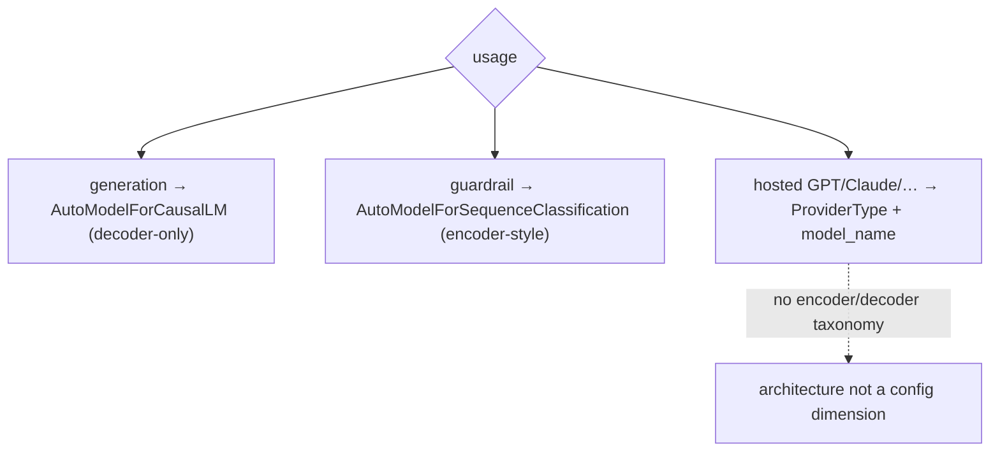
```mermaid
flowchart TD
    M{"usage"} --> GEN["generation → AutoModelForCausalLM (decoder-only)"]
    M --> CLS["guardrail → AutoModelForSequenceClassification (encoder-style)"]
    M --> API["hosted GPT/Claude/… → ProviderType + model_name"]
    API -.->|"no encoder/decoder taxonomy"| X["architecture not a config dimension"]
```

**Anchors:** &bull; `agent-core/openjiuwen/core/foundation/llm/schema/config.py:13` — `ProviderType` &bull; `agent-core/openjiuwen/core/security/guardrail/backends.py:445` — `AutoModelForSequenceClassification` &bull; `agent-core/openjiuwen/core/security/guardrail/builtin.py:174` — `model_type` limited to `None | "bert" | "qwen"` &bull; `agent-core/openjiuwen/symphony/retrieval/llm/transformers_prefix_cached_generation/client.py:175` — `AutoModelForCausalLM` &bull; `agent-core/openjiuwen/symphony/retrieval/search/service/serving.py:35` — vLLM `architectures` string &bull; `agent-core/openjiuwen/core/foundation/llm/reasoning_profiles.py:100` — family patterns classify reasoning protocol only

## 4. Why does temperature affect output, and what happens at temperature 0 versus temperature 1

**General:** Temperature rescales next-token logits before softmax: `softmax(z/T)`. At `T → 0` the distribution collapses to the argmax (greedy, deterministic); at `T = 1` the model's raw distribution is used; above 1 it flattens (more diverse, more errors). It changes relative probabilities, not which tokens are possible.

**Jiuwen:** Temperature is a passthrough parameter; the local HuggingFace/vLLM path implements the math (`scores = logits / max(ε, T)`, and `T <= 0` returns argmax). Both `temperature` and `top_p` default to `None` at the request-config layer and are added only when set; OpenAI-compatible calls targeting `openai.com` keep only one of them (temperature wins), and Anthropic routes sampling through `extra_body`. The local `GenerationConfig` default is `temperature=0.0`.

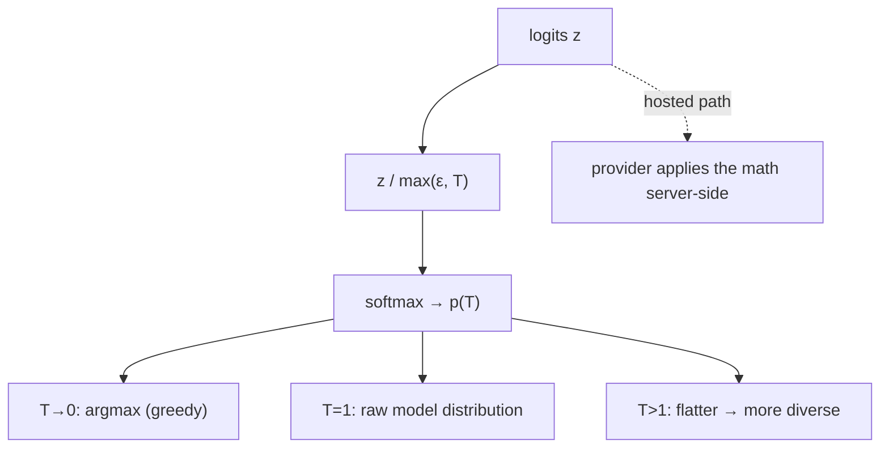
```mermaid
flowchart TD
    LOGITS["logits z"] --> DIV["z / max(ε, T)"]
    DIV --> SM["softmax → p(T)"]
    SM --> Z["T→0: argmax (greedy)"]
    SM --> ONE["T=1: raw model distribution"]
    SM --> HI["T>1: flatter → more diverse"]
    LOGITS -.->|"hosted path"| API["provider applies the math server-side"]
```

**Anchors:** &bull; `agent-core/openjiuwen/core/foundation/llm/schema/config.py:210` — `temperature: Optional[float] = None` &bull; `agent-core/openjiuwen/core/foundation/llm/model_clients/base_model_client.py:556` — resolved, added only when not `None` &bull; `agent-core/openjiuwen/core/foundation/llm/model_clients/openai_model_client.py:944` — drops `top_p` when temperature present (openai.com) &bull; `agent-core/openjiuwen/core/foundation/llm/model_clients/anthropic_model_client.py:929` — temperature via `extra_body` &bull; `agent-core/openjiuwen/symphony/retrieval/llm/transformers_prefix_cached_generation/generation.py:516` — `scores = next_token_logits / max(1e-6, temperature)`; `:514` argmax branch &bull; `agent-core/openjiuwen/symphony/retrieval/llm/base/types.py:60` — `GenerationConfig.temperature: float = 0.0`

---

# Prompting

## 5. Zero-shot vs. few-shot vs. chain-of-thought, when does each one actually improve output

**General:** Zero-shot (instruction only) works for tasks the model saw in instruction tuning. Few-shot (worked examples) helps when the task has a specific format, label set, or edge-case convention the instruction can't fully specify. Chain-of-thought (ask for intermediate reasoning) helps multi-step reasoning/arithmetic, especially for smaller models, and is largely subsumed by native reasoning models. All three cost prompt tokens; examples and CoT are not free wins on simple tasks.

**Jiuwen:** The runtime agent is fundamentally zero-shot: the system prompt is assembled from instruction-only `PromptSection`s and the model is steered through the ReAct tool-calling loop, not worked examples. Few-shot machinery exists only in the evolution/tuning tooling (`agent_evolving`, `dev_tools/tune`), which formats cases into example blocks and injects them as prompt gradients. Chain-of-thought appears in auxiliary prompts (workflow `questioner_comp` has an explicit "Let's think step by step") and implicitly in the compaction prompt's `<analysis>`-then-`
` structure. Reasoning-model output is preserved via `reasoning_content`.

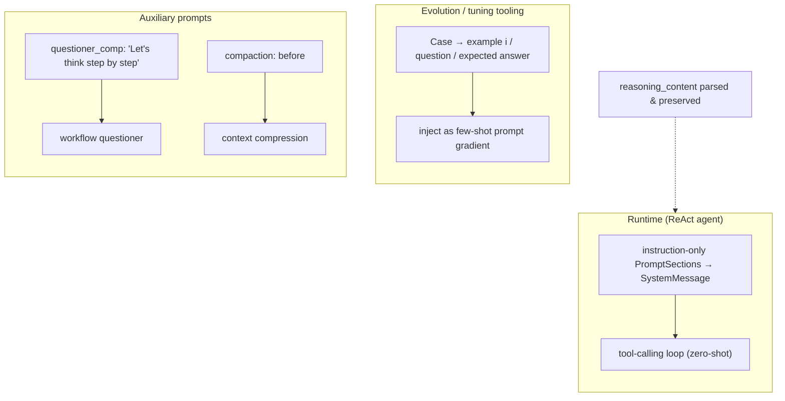
```mermaid
flowchart TD
    subgraph RT["Runtime (ReAct agent)"]
    direction TB
    SYS["instruction-only PromptSections → SystemMessage"] --> LOOP["tool-calling loop (zero-shot)"]
    end
    subgraph TUNE["Evolution / tuning tooling"]
    direction TB
    CASES["Case → example i / question / expected answer"] --> GRAD["inject as few-shot prompt gradient"]
    end
    subgraph AUX["Auxiliary prompts"]
    direction TB
    COT["questioner_comp: 'Let's think step by step'"] --> A1["workflow questioner"]
    AN["compaction: <analysis> before <summary>"] --> A2["context compression"]
    end
    REASON["reasoning_content parsed & preserved"] -.-> RT
```

**Anchors:** &bull; `agent-core/openjiuwen/core/single_agent/agents/react_agent.py:842` — renders `role=="system"` template messages; `:1504` `SystemMessage(content=prompt_builder.build())` &bull; `agent-core/openjiuwen/core/single_agent/prompts/builder.py:219` — `build()` joins priority-ordered sections &bull; `agent-core/openjiuwen/harness/prompts/sections/identity.py:11` — default identity prompt (zero-shot) &bull; `agent-core/openjiuwen/agent_evolving/utils.py:238` — `convert_cases_to_examples()` &bull; `agent-core/openjiuwen/dev_tools/tune/optimizer/example_optimizer.py:109` — `init_examples()` few-shot injection &bull; `agent-core/openjiuwen/core/foundation/llm/model_clients/openai_model_client.py:347` — parses `reasoning_content`; `agent-core/openjiuwen/core/foundation/llm/utils/endpoint_profiles.py:33` — DeepSeek empty `reasoning_content` &bull; `agent-core/openjiuwen/core/workflow/components/llm/questioner_comp.py:68` — explicit CoT instruction

**Gap.** No task-level few-shot examples are injected by `harness/` or `core/single_agent`; no global CoT instruction in the DeepAgent system prompt.

## 6. What's the difference between a system prompt and a user prompt, and why does that separation matter

**General:** The system prompt sets persistent role, rules, persona, and constraints for the whole conversation; the user prompt is the per-turn request. Providers give the system message higher priority and apply it consistently, while user turns are the changing input. Some APIs (Anthropic) pass system content as a separate top-level field.

**Jiuwen:** The system prompt is a single assembled string from priority-ordered, host-injectable sections; rails mutate the `SystemPromptBuilder` before the model call, and `ReActAgent` renders it once as a `SystemMessage` passed as `system_messages`. User turns are admitted separately as `UserMessage` history; the context engine windows `system_messages` and `context_messages` independently. Provider mapping differs: OpenAI keeps `role:"system"`, Anthropic lifts it to a top-level `system` parameter, and the Responses API folds system/developer into `instructions`.

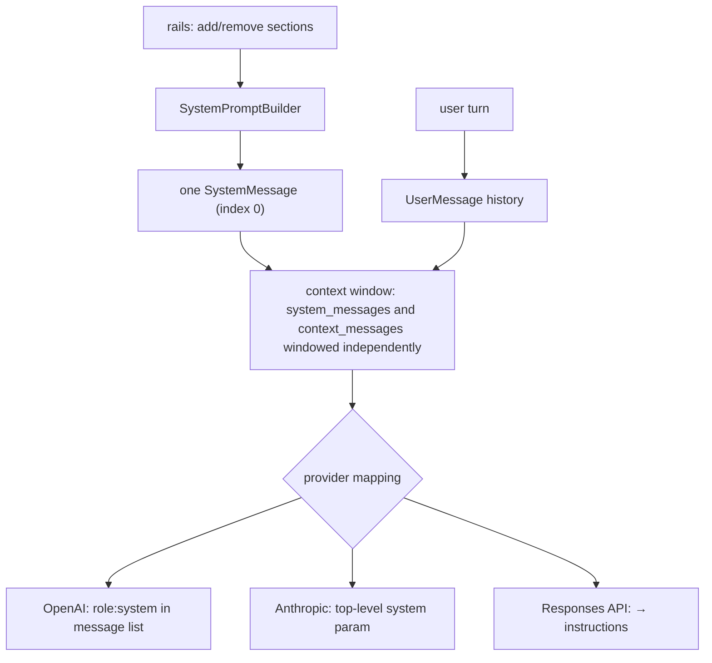
```mermaid
flowchart TD
    RAILS["rails: add/remove sections"] --> SPB["SystemPromptBuilder"]
    SPB --> SM["one SystemMessage (index 0)"]
    USER["user turn"] --> UM["UserMessage history"]
    SM --> CTX["context window: system_messages and context_messages windowed independently"]
    UM --> CTX
    CTX --> MAP{"provider mapping"}
    MAP --> OAI["OpenAI: role:system in message list"]
    MAP --> ANT["Anthropic: top-level system param"]
    MAP --> RESP["Responses API: → instructions"]
```

**Anchors:** &bull; `agent-core/openjiuwen/core/single_agent/agents/react_agent.py:1504` — builds one `SystemMessage`; `:883` `_admit_user_message()` &bull; `agent-core/openjiuwen/core/context_engine/context/context.py:574` — `get_context_window(system_messages, ...)`; `:718` `_get_window_messages()` &bull; `agent-core/openjiuwen/harness/rails/task_planning_rail.py:154` — rail adds/removes a system-prompt section &bull; `agent-core/openjiuwen/harness/rails/security/prompt_security_rail.py:17` — security section injection &bull; `agent-core/openjiuwen/harness/prompts/prompt_attachment_manager.py:591` — user→system re-role per provider &bull; `agent-core/openjiuwen/core/foundation/llm/model_clients/anthropic_model_client.py:379` — lifts system into top-level blocks; `:858` `params["system"]` &bull; `agent-core/openjiuwen/core/foundation/llm/utils/responses_utils.py:142` — system/developer → `instructions`

## 7. How do you structure a prompt to get consistent, parseable output like JSON

**General:** Layer the guarantees: prefer a provider JSON/schema mode or tool/function calling with a JSON Schema so the model is constrained at generation time; validate against the schema; on failure return the validation error to the model for a retry; only then parse. Fenced or free-text JSON should be a last resort with tolerant extraction and repair.

**Jiuwen:** The core harness has no native `response_format`/JSON mode; structured output is enforced by giving the model a single-use `structured_output` tool whose `ToolCard.input_params` is the caller's JSON Schema, so the provider's tool-use layer constrains arguments. On success the arguments are captured and a finish rail ends the round; on failure the error is returned for self-correction and the workflow engine retries then validates with pydantic/jsonschema. For text-based JSON, `JsonOutputParser` strips code fences and `json.loads`, returning `None` on failure.

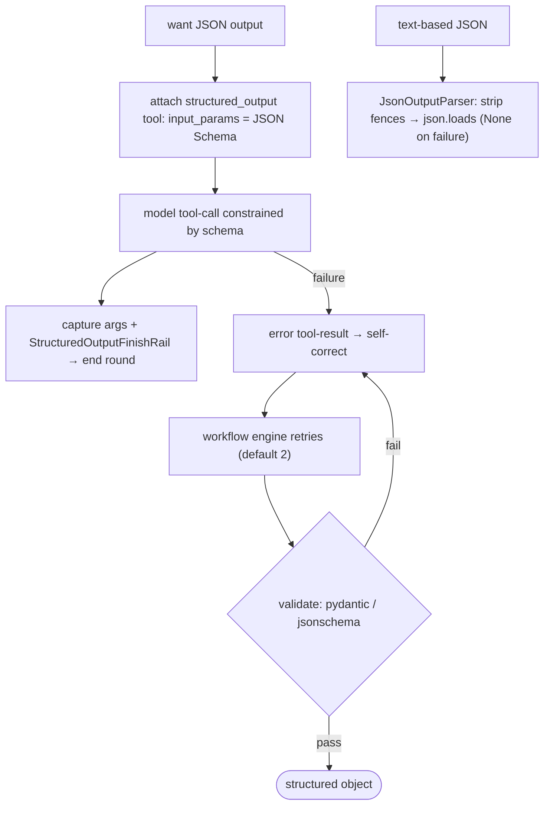
```mermaid
flowchart TD
    REQ["want JSON output"] --> TOOL["attach structured_output tool: input_params = JSON Schema"]
    TOOL --> MODEL["model tool-call constrained by schema"]
    MODEL --> CAP["capture args + StructuredOutputFinishRail → end round"]
    MODEL -->|failure| ERR["error tool-result → self-correct"]
    ERR --> RETRY["workflow engine retries (default 2)"]
    RETRY --> VAL{"validate: pydantic / jsonschema"}
    VAL -->|pass| OK(["structured object"])
    VAL -->|fail| ERR
    TXT["text-based JSON"] --> JP["JsonOutputParser: strip fences → json.loads (None on failure)"]
```

**Anchors:** &bull; `agent-core/openjiuwen/agent_teams/tools/structured_output_tool.py:46` — `StructuredOutputTool`; `:82` `input_params = schema_json`; `:97` `StructuredOutputFinishRail.after_tool_call` &bull; `agent-core/openjiuwen/agent_teams/workflow/backends/team_worker_backend.py:230` — attaches one tool per schema; `:484` finish rail; `:498` reminder &bull; `agent-core/openjiuwen/agent_teams/workflow/engine/schema.py:55` — `resolve_schema()`; `:74` `coerce()` &bull; `agent-core/openjiuwen/agent_teams/workflow/engine/primitives.py:693` — retries; `:763` `coerce(res.structured, ...)`; `agent-core/openjiuwen/agent_teams/workflow/engine/runtime.py:62` `retries: int = 2` &bull; `agent-core/openjiuwen/core/foundation/llm/output_parsers/json_output_parser.py:15/92` — extraction + `stream_parse()`

## 8. What's prompt injection, and how would you defend a system against it

**General:** Prompt injection is untrusted input containing instructions that hijack the model (direct user input, or indirect via retrieved/tool content). Defenses: treat content as data not instructions, delimit/label untrusted content, never let it trigger privileged actions without a permission re-check, and enforce controls outside the model (tool policy, sandboxing, egress rules). Instructions in the prompt alone are not a control.

**Jiuwen:** The codebase separates prompt-level from enforced defenses. Prompt-level: `SafetyPromptRail` injects a bilingual safety section into the system prompt before each call (instruction, not control). Enforced: shell command/process substitution is blocked before execution, the permission engine merges tiered tool policy + file guard + net guard by "strictest" and floors risky shell structures to ASK, and builtin YAML denies reverse shells, disk writes, shutdown, and sensitive paths. A pluggable guardrail framework exists for injection detection, and the auto-harness adds an input heuristic that force-finishes on "ignore previous instructions".

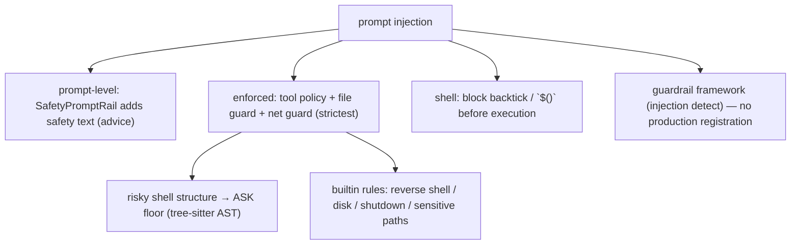
```mermaid
flowchart TD
    INJ["prompt injection"] --> P["prompt-level: SafetyPromptRail adds safety text (advice)"]
    INJ --> ENF["enforced: tool policy + file guard + net guard (strictest)"]
    ENF --> ASK["risky shell structure → ASK floor (tree-sitter AST)"]
    ENF --> DENY["builtin rules: reverse shell / disk / shutdown / sensitive paths"]
    INJ --> SH["shell: block backtick / `$()` before execution"]
    INJ --> G["guardrail framework (injection detect) — no production registration"]
```

**Anchors:** &bull; `agent-core/openjiuwen/harness/rails/security/prompt_security_rail.py:16` — `SafetyPromptRail`; `:38` injects safety section; `agent-core/openjiuwen/harness/prompts/sections/safety.py:14` — static safety text &bull; `agent-core/openjiuwen/harness/tools/shell/bash/_security.py:29` — substitution regex; `:40` `check_injection` blocks &bull; `agent-core/openjiuwen/harness/resources/builtin_rules.yaml:59` — reverse-shell deny; `:35` disk deny; `:99` shutdown; `:148` sensitive paths &bull; `agent-core/openjiuwen/harness/security/permission_engine/toolguard/tool_policy.py:588` — tiered policy; `:409` shell AST floor; `:502` ASK fallback; `agent-core/openjiuwen/harness/security/permission_engine/toolguard/shell_ast.py:82` — deterministic parse; `agent-core/openjiuwen/harness/security/permission_engine/core.py:272` — merge &bull; `agent-core/openjiuwen/core/security/guardrail/builtin.py:60` — `PromptInjectionGuardrail`; `agent-core/openjiuwen/core/security/guardrail/backends.py:181` — default patterns &bull; `agent-core/openjiuwen/rsi/harness_rsi/auto_harness/rails/security_rail.py:119` — input heuristic → `request_force_finish`

---

# RAG and retrieval

## 9. Walk through a RAG pipeline end to end

**General:** Ingest: parse → chunk → embed → index. Query: embed the query → retrieve top-k (dense and/or sparse) → rerank → assemble the retrieved context into the prompt → generate → optionally cite. Each stage is separable; failures and quality drops can occur at any of them.

**Jiuwen:** Ingestion: `KnowledgeBase.parse_files` (parser), then `SimpleKnowledgeBase.add_documents` calls `chunker.chunk_documents`, builds an `IndexConfig`, and `Indexer.build_index` computes embeddings via `compute_chunk_embeddings` and writes them to the vector store. Query: `SimpleKnowledgeBase.retrieve` lazily instantiates `VectorRetriever`/`SparseRetriever`/`HybridRetriever` by `index_type`, embeds the query, and calls `vector_store.search`. The production end-to-end wiring is the workflow `KnowledgeRetrievalComponent`, which returns `results`/`context`; a downstream `LLMComponent` formats them into the prompt.

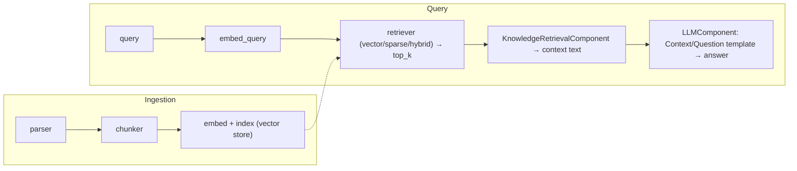
```mermaid
flowchart LR
    subgraph ING["Ingestion"]
    P["parser"] --> C["chunker"] --> E["embed + index (vector store)"]
    end
    subgraph QRY["Query"]
    Q["query"] --> QE["embed_query"]
    QE --> RET["retriever (vector/sparse/hybrid) → top_k"]
    RET --> CTX["KnowledgeRetrievalComponent → context text"]
    CTX --> LLM["LLMComponent: Context/Question template → answer"]
    end
    E -.-> RET
```

**Anchors:** &bull; `agent-core/openjiuwen/core/retrieval/simple_knowledge_base.py:96` — `chunk_documents`; `:110` `build_index(...)`; `:182` delegate to retriever &bull; `agent-core/openjiuwen/core/retrieval/indexing/indexer/embed_chunks.py:46/73` — `embed_documents` / `embed_multimodal` &bull; `agent-core/openjiuwen/core/retrieval/retriever/vector_retriever.py:78` — `embed_query` → `vector_store.search` &bull; `agent-core/openjiuwen/core/workflow/components/resource/knowledge_retrieval_comp.py:109` — `retrieve_multi_kb_with_source(...)`; `:243` joins texts into `context` &bull; `agent-core/openjiuwen/core/workflow/components/llm/llm_comp.py:654` — template format feeding `{{context}}`/`{{query}}`

**Gap.** No packaged end-to-end RAG agent or retrieval tool in `harness`/`agent_teams`; retrieved context is concatenated with no token-budget trimming and no citation synthesis.

## 10. What's the difference between RAG and fine-tuning, and when would you use each

**General:** RAG supplies knowledge at query time by retrieving relevant passages and putting them in the prompt — it is cheap to update, auditable, and handles fresh or long-tail facts, but it costs tokens per call and cannot change the model's behavior/style. Fine-tuning changes the weights to teach behavior, format, tone, or a reasoning pattern, and can compress a long prompt into the model, but it is expensive, slow to iterate, can't cite, and won't reliably store volatile facts. Use RAG for knowledge, fine-tuning for behavior; often both. Reaching for fine-tuning to "add knowledge" is usually the wrong tool because updating the weights to change a fact is costly and unverifiable.

**Jiuwen:** The repo does not implement a decision rule, but it does encode the rationale. The self-optimizing-agent design argues against fine-tuning on bad cases because implementation cost is high and the fix cycle is tied to the model's fine-tuning version (slow intervention), so the default is automatic prompt/instruction-and-example optimization (`InstructionOptimizer`/`JointOptimizer`). Retrieval (`core/retrieval`) and self-evolution (`agent_evolving`) are separate, composable capabilities, and `dev_tools` positions prompt tuning as offline/dev-time iteration with "solidified" configs in production. Weight tuning exists as an optional heavier path (`agent_rl`, LoRA/SFT).

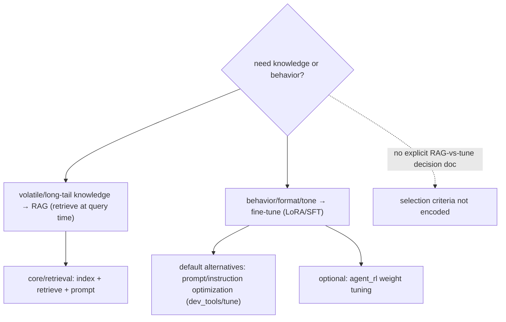
```mermaid
flowchart TD
    Q{"need knowledge or behavior?"} --> K["volatile/long-tail knowledge → RAG (retrieve at query time)"]
    Q --> B["behavior/format/tone → fine-tune (LoRA/SFT)"]
    K --> R["core/retrieval: index + retrieve + prompt"]
    B --> P["default alternatives: prompt/instruction optimization (dev_tools/tune)"]
    B --> W["optional: agent_rl weight tuning"]
    Q -.->|"no explicit RAG-vs-tune decision doc"| X["selection criteria not encoded"]
```

**Anchors:** &bull; `agent-core/openjiuwen/dev_tools/tune/optimizer/instruction_optimizer.py:30` — prompt rewrite via textual gradients &bull; `agent-core/openjiuwen/agent_evolving/trainer/trainer.py:241` — candidate prompt updates, keep best &bull; `agent-core/openjiuwen/agent_evolving/agent_rl/online/backends/sft/trainer.py:44` — alternate weight-training (SFT/LoRA) path &bull; `agent-core/openjiuwen/core/retrieval/retriever/vector_retriever.py:78` — retrieval path (knowledge at query time) &bull; `agent-core/openjiuwen/dev_tools/tune/optimizer/example_optimizer.py:109` — few-shot/example optimization

**Gap.** No document or comment compares RAG vs. fine-tuning or gives selection criteria; the only stated contrast is fine-tuning vs. *prompt* tuning (one paragraph).

## 11. How do you handle hallucinations when retrieved context doesn't actually answer the question

**General:** First detect that the context is insufficient, then answer only from what is supported: gate on retrieval score/answerability, allow an explicit "I don't know" abstention, and verify claims against the context (citations/groundedness). Without an answerability gate, a model will still produce a fluent answer from irrelevant context. The failure mode is under-specified retrieval, not just a bad generator.

**Jiuwen:** There is a retrieval score filter (`score_threshold`) but its default is `None`, so out-of-scope chunks are normally returned. The closest "answerable?" logic is in `AgenticRetriever`, which asks an LLM whether current facts are `sufficient` — but `sufficient=False` only generates a follow-up query, never a user-facing abstention. A true abstention path exists only inside `symphony/retrieval` internal selection (`is_abstain` → empty candidates). Grounding is provided by separate higher layers: the `VerificationReviewer` scores a `Correctness` dimension and downgrades status, the RSI judge forbids treating claims as proof, and the harness verification agent requires command evidence with a PASS/FAIL/PARTIAL verdict — none of which is a RAG answerability gate.

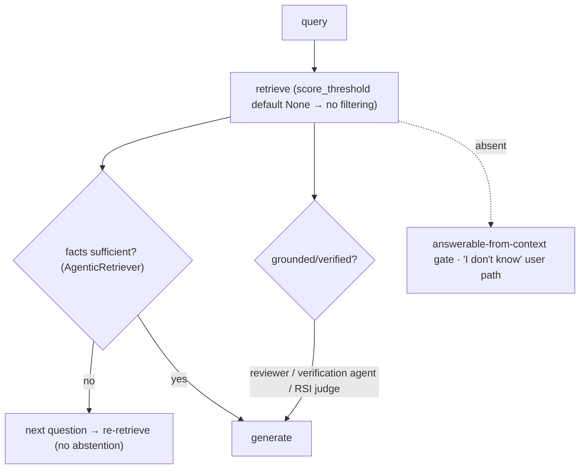
```mermaid
flowchart TD
    Q["query"] --> R["retrieve (score_threshold default None → no filtering)"]
    R --> S{"facts sufficient? (AgenticRetriever)"}
    S -->|no| NQ["next question → re-retrieve (no abstention)"]
    S -->|yes| GEN["generate"]
    R --> G{"grounded/verified?"}
    G -->|"reviewer / verification agent / RSI judge"| GEN
    R -.->|"absent"| X["answerable-from-context gate · 'I don't know' user path"]
```

**Anchors:** &bull; `agent-core/openjiuwen/core/retrieval/common/config.py:47` — `score_threshold` defaults `None`; `agent-core/openjiuwen/core/retrieval/retriever/vector_retriever.py:94` / `agent-core/openjiuwen/core/retrieval/retriever/hybrid_retriever.py:117` — applied only when supplied &bull; `agent-core/openjiuwen/core/retrieval/retriever/agentic_retriever.py:326` — `_rewrite` sufficiency check (rewrite, not abstain) &bull; `agent-core/openjiuwen/symphony/retrieval/search/runtime/engine.py:94` — `is_abstain` → empty candidates; `agent-core/openjiuwen/symphony/retrieval/search/runtime/selector.py:305` — `is_abstain` &bull; `agent-core/openjiuwen/agent_teams/verification/reviewer.py:43` — `Correctness` dimension; `:279` threshold re-normalization &bull; `agent-core/openjiuwen/harness/subagents/verification_agent.py:51` — PASS/FAIL/PARTIAL verdict

**Gap.** No RAG-side answerable-from-context gate and no "I don't know" path; `score_threshold` has no default and verification is a separate, non-blocking review layer.

## 12. Why isn't vector similarity search alone enough

**General:** Cosine similarity measures vector closeness, not answer relevance. It is symmetric, ignores term importance, is not calibrated across queries/documents, and a generic chunk can sit near the query while the exact answer ranks lower. Top-k by cosine is a recall-oriented candidate step; ranking quality comes from better models, hybrid exact-match signals, metadata filters, and reranking.

**Jiuwen:** The KB ranks purely by the vector store's returned score: `VectorRetriever` searches and only applies a post-hoc `score_threshold`, preserving store order. Stores normalize heterogeneous raw distances into `[0,1]` per backend (Milvus cosine `(s+1)/2`, Chroma `(2-d)/2`), so scores are rescaled distances, not calibrated probabilities, and are not comparable across stores/collections. There is no MMR, diversity, or cross-encoder step in the KB path.

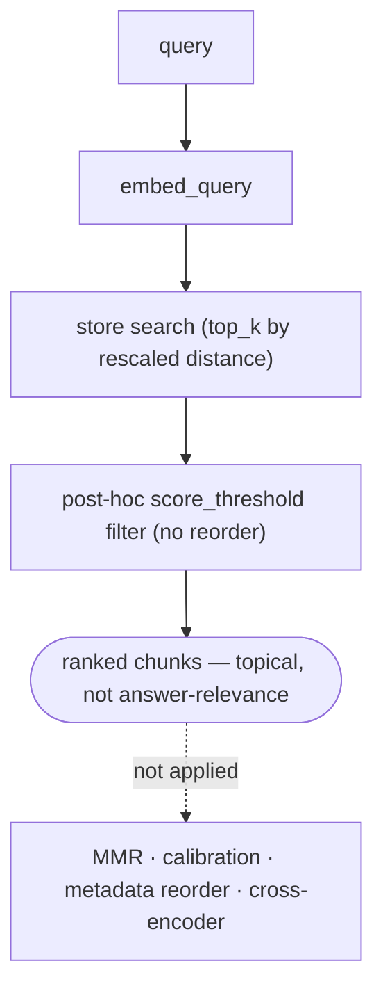
```mermaid
flowchart TD
    Q["query"] --> QE["embed_query"]
    QE --> SR["store search (top_k by rescaled distance)"]
    SR --> TH["post-hoc score_threshold filter (no reorder)"]
    TH --> R(["ranked chunks — topical, not answer-relevance"])
    R -.->|"not applied"| X["MMR · calibration · metadata reorder · cross-encoder"]
```

**Anchors:** &bull; `agent-core/openjiuwen/core/retrieval/retriever/vector_retriever.py:79` — raw store search; `:94` threshold filter only &bull; `agent-core/openjiuwen/core/retrieval/simple_knowledge_base.py:182` — results returned as-is &bull; `agent-core/openjiuwen/core/retrieval/common/config.py:81` — `distance_metric` default `cosine` &bull; `agent-core/openjiuwen/core/foundation/store/vector/utils.py:35/49/63` — similarity normalizers &bull; `agent-core/openjiuwen/core/retrieval/vector_store/milvus_store.py:457` — metric-dependent conversion; `agent-core/openjiuwen/core/retrieval/vector_store/pg_store.py:512` — different per-metric math

---

# Fine-tuning and customization

## 13. What's the difference between full fine-tuning and parameter-efficient fine-tuning like LoRA

**General:** Full fine-tuning updates every weight — highest capacity to adapt but needs the full model in memory per run, large checkpoints, and is easy to overfit/drift. LoRA freezes the base weights and trains small low-rank adapter matrices in the attention/MLP projections, so you store and serve only the adapters, need far less memory, and can keep many task adapters over one base model. Quality is often close to full FT for style/format/domain adaptation.

**Jiuwen:** The repo trains weights, but only via LoRA/PEFT adapters — there is no full-parameter fine-tuning mode. Two backends exist: online SFT and online/offline RL/PPO (veRL). The SFT trainer writes a parquet dataset, invokes veRL's SFT trainer (FSDP + LoRA), merges the checkpoint, and exports a PEFT adapter directory. The RL path saves a checkpoint and `_convert_fsdp_to_peft` filters only `lora_` params and writes a PEFT `adapter_config.json`. Published adapters are versioned with an atomic `latest` symlink and hot-loaded on the inference service.

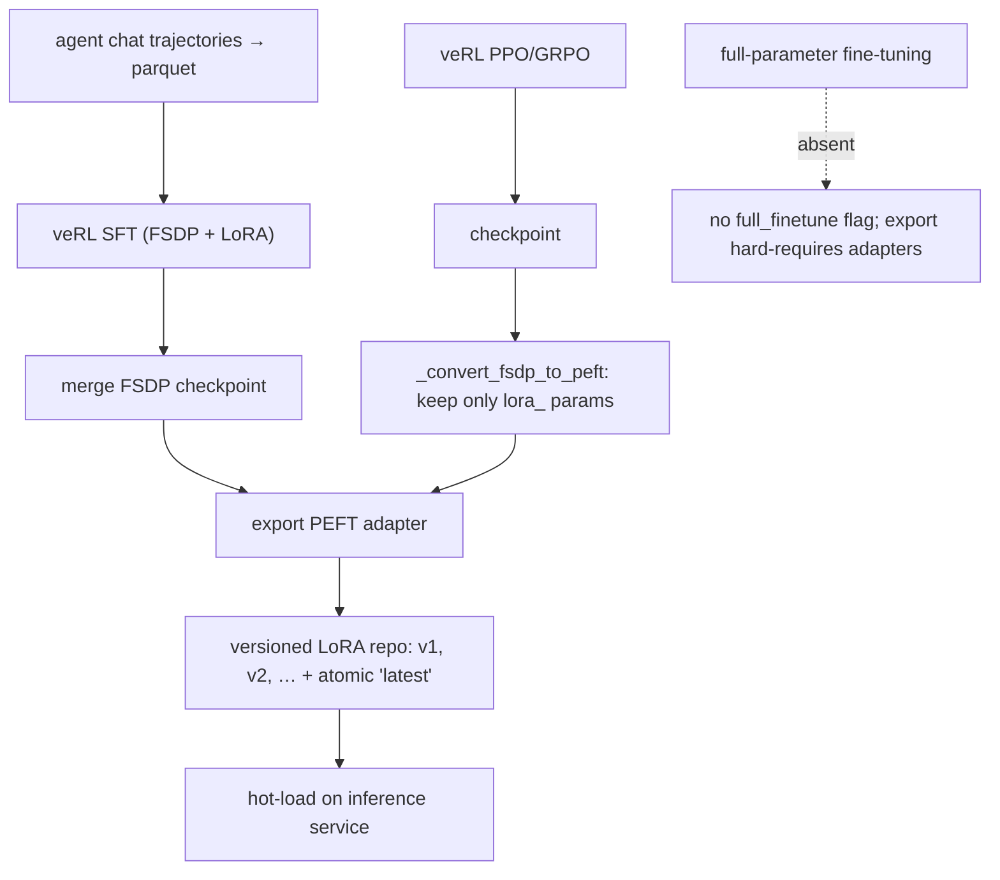
```mermaid
flowchart TD
    DATA["agent chat trajectories → parquet"] --> SFT["veRL SFT (FSDP + LoRA)"]
    RL["veRL PPO/GRPO"] --> CKPT["checkpoint"]
    SFT --> MERGE["merge FSDP checkpoint"]
    CKPT --> CONV["_convert_fsdp_to_peft: keep only lora_ params"]
    MERGE --> EXP["export PEFT adapter"]
    CONV --> EXP
    EXP --> REPO["versioned LoRA repo: v1, v2, … + atomic 'latest'"]
    REPO --> HOT["hot-load on inference service"]
    FULL["full-parameter fine-tuning"] -.->|"absent"| X["no full_finetune flag; export hard-requires adapters"]
```

**Anchors:** &bull; `agent-core/openjiuwen/agent_evolving/agent_rl/online/backends/sft/trainer.py:44` — `SFTTrainingExecutor`; `:328` lora_rank/alpha/target_modules; `:455` `_export_sft_lora_adapter`; `:577` `_is_publishable_lora_dir` &bull; `agent-core/openjiuwen/agent_evolving/agent_rl/optimizer/task_runner.py:438` — `export_lora`; `:543` PEFT `adapter_config.json` &bull; `agent-core/openjiuwen/agent_evolving/agent_rl/storage/lora_repo.py:56` — versioned publish + atomic `latest` &bull; `agent-core/openjiuwen/agent_evolving/agent_rl/config/online_config.py:42` — PPO overlay `lora_rank: 16`, `target_modules: all-linear` &bull; `agent-core/openjiuwen/agent_evolving/agent_rl/rl_trainer/ppo_step.py:146` — `update_actor` (PPO)

**Gap.** No full-parameter fine-tuning support and no direct `peft` import; the primary self-evolution loop is textual prompt optimization.

## 14. When is fine-tuning worth the cost compared to prompt engineering or RAG

**General:** Fine-tune when the behavior is hard to specify in words (style, tone, domain jargon, strict output schema), when you need to compress a long few-shot prompt into the weights for latency/cost, when you have many labeled examples, or when the task is high-volume enough that a smaller tuned model is cheaper. Prefer prompting when the task is general, examples are few, the requirement changes often, or you need to iterate quickly; prefer RAG when the gap is knowledge. Prompt changes ship in seconds, fine-tunes in hours/days.

**Jiuwen:** The repo contains conceptual guidance plus two separate mechanisms, not a decision function. A design doc states the rationale directly: fine-tuning on bad cases is expensive and its fix cycle is tied to model release versions, so openJiuwen instead does automatic prompt/instruction-and-example optimization. The practical default is `Trainer` + `InstructionOptimizer`/`JointOptimizer`, and `dev_tools` positions prompt tuning as offline/dev-time iteration with solidified configs in production. Weight-level SFT/LoRA exists as a heavier escalation path, but no selection criteria are encoded.

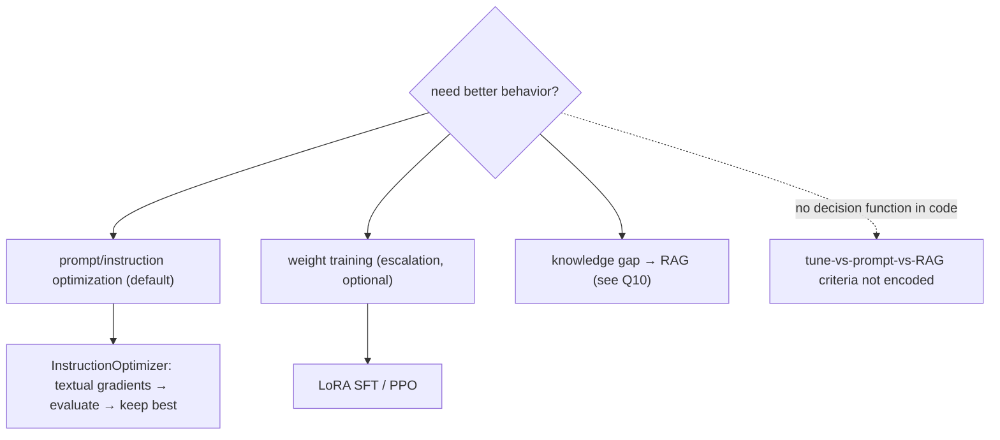
```mermaid
flowchart TD
    Q{"need better behavior?"} --> P["prompt/instruction optimization (default)"]
    P --> IO["InstructionOptimizer: textual gradients → evaluate → keep best"]
    Q --> W["weight training (escalation, optional)"]
    W --> LORA["LoRA SFT / PPO"]
    Q --> R["knowledge gap → RAG (see Q10)"]
    Q -.->|"no decision function in code"| X["tune-vs-prompt-vs-RAG criteria not encoded"]
```

**Anchors:** &bull; `agent-core/openjiuwen/agent_evolving/optimizer/llm_call/instruction_optimizer.py:30` — prompt rewrite via textual gradients &bull; `agent-core/openjiuwen/agent_evolving/trainer/trainer.py:241` — evaluate candidate prompt-config updates, keep best &bull; `agent-core/openjiuwen/agent_evolving/agent_rl/online/backends/sft/trainer.py:44` — weight-training path &bull; `agent-core/openjiuwen/dev_tools/tune/trainer/trainer.py:38` — `early_stop_score` gate &bull; `agent-core/openjiuwen/agent_teams/models/pool.py:133` — model routing (availability/cost, not accuracy)

**Gap.** No explicit "fine-tuning is worth it when…" guidance, no dataset-size/domain-shift/cost thresholds, no RAG-vs-fine-tune tradeoff.

## 15. What is instruction tuning, and how is it different from base model pretraining

**General:** Pretraining is self-supervised on raw text (predict the next/masked token) and produces a base model that completes text but does not follow instructions. Instruction tuning is supervised fine-tuning on (instruction, response) pairs that teaches the base model to follow commands, formats, and safety behavior. It is a small, high-quality stage relative to pretraining.

**Jiuwen:** Instruction tuning is implemented as SFT over agent chat trajectories: messages are normalized, tool calls are rendered into Qwen XML, and each assistant turn is tokenized with a `loss_mask` that is 0 for prompt/user/tool tokens and non-zero only on assistant output tokens. `supervise="last"` trains only the final assistant turn; `loss_norm` controls per-turn weighting. The output is a pre-tokenized parquet consumed by a custom multi-turn dataset in veRL. This is behavior tuning on demonstrations, not continued pretraining.

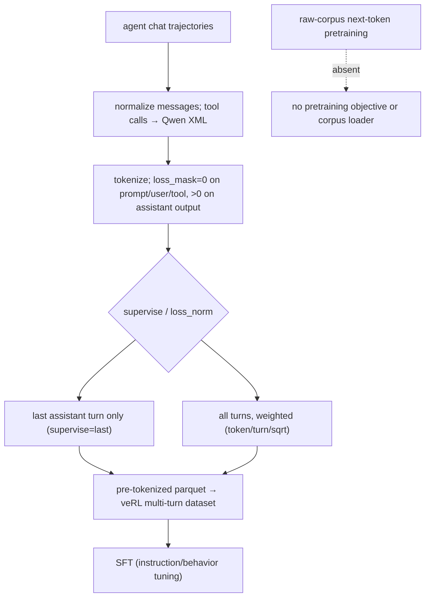
```mermaid
flowchart TD
    TRAJ["agent chat trajectories"] --> NORM["normalize messages; tool calls → Qwen XML"]
    NORM --> TOK["tokenize; loss_mask=0 on prompt/user/tool, >0 on assistant output"]
    TOK --> OPT{"supervise / loss_norm"}
    OPT --> LAST["last assistant turn only (supervise=last)"]
    OPT --> ALL["all turns, weighted (token/turn/sqrt)"]
    LAST --> PQ["pre-tokenized parquet → veRL multi-turn dataset"]
    ALL --> PQ
    PQ --> SFT["SFT (instruction/behavior tuning)"]
    PRE["raw-corpus next-token pretraining"] -.->|"absent"| X["no pretraining objective or corpus loader"]
```

**Anchors:** &bull; `agent-core/openjiuwen/agent_evolving/agent_rl/online/backends/sft/sft_data_formatter.py:201` — loss mask on assistant only; `:270` `write_sft_parquet`; `:101` `convert_message_openai`; `:50` Qwen `<tool_call>` XML; `:77` `<think>` → `reasoning_content` &bull; `agent-core/openjiuwen/agent_evolving/agent_rl/online/backends/sft/trainer.py:136` — `train_batch`; `:395` `QwenMultiTurnSFTDataset`; `:270` parquet write

**Gap.** Pretraining is absent — no next-token objective or raw-corpus dataloader.

## 16. What's the risk of fine-tuning on a small, narrow dataset

**General:** Small/narrow data risks overfitting (memorizing the sample rather than generalizing), catastrophic forgetting of general ability, brittleness to slightly different inputs, and amplified bias/format lock-in from the narrow distribution. Mitigations: held-out validation with early stopping, regularization (weight decay, LoRA's low rank), data augmentation/diversity, and evaluating on a broader set than you trained on. The smaller the data, the more you should prefer PEFT and prompt engineering over full fine-tuning.

**Jiuwen:** The offline RL trainer has a real train/val pipeline (`train_data_path`/`val_data_path`, `val_before_train`, periodic `test_freq` validation with metric persistence), and the `dev_tools.tune.Trainer` has an `early_stop_score` gate. But the SFT path has **no held-out validation** at all: `_build_sft_config` sets `val_files: None` and `test_freq: -1`, and `total_epochs` defaults to 1. The only SFT data-quality gate is external (`resolved=true`). `weight_decay`/`clip_grad`/warmup are exposed only as raw veRL knobs, not framed as overfitting controls.

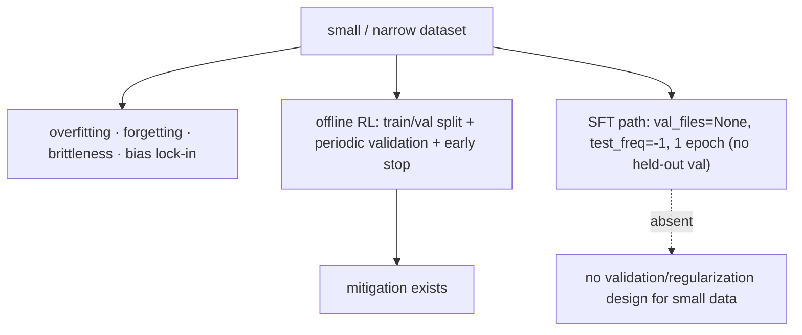
```mermaid
flowchart TD
    SMALL["small / narrow dataset"] --> RISK["overfitting · forgetting · brittleness · bias lock-in"]
    SMALL --> RL["offline RL: train/val split + periodic validation + early stop"]
    SMALL --> SFT["SFT path: val_files=None, test_freq=-1, 1 epoch (no held-out val)"]
    RL --> MIT["mitigation exists"]
    SFT -.->|"absent"| X["no validation/regularization design for small data"]
```

**Anchors:** &bull; `agent-core/openjiuwen/agent_evolving/agent_rl/config/offline_config.py:32` — `train_data_path`/`val_data_path`; `:53/69` `test_freq=20`, `val_before_train=True` &bull; `agent-core/openjiuwen/agent_evolving/agent_rl/offline/main_trainer.py:160` — `validate()` full pass + metric persistence; `:232` validate before train &bull; `agent-core/openjiuwen/agent_evolving/agent_rl/offline/coordinator/processors.py:55` — rollout validate gating &bull; `agent-core/openjiuwen/dev_tools/tune/trainer/trainer.py:38` — `early_stop_score`; `:99` val gate &bull; `agent-core/openjiuwen/agent_evolving/agent_rl/online/backends/sft/trainer.py:377` — `val_files: None`; `:420` `test_freq: -1`; `:359` `weight_decay`/`clip_grad` knobs &bull; `agent-core/examples/agent_evolving/react_agent_evolving.py:156` — `split(ratio=0.6)` train/val; `:202` `early_stop_score=0.95`

**Gap.** No overfitting/validation/regularization guidance for small data; the SFT path lacks held-out validation and early stopping and runs 1 epoch by default.

---

# Agents and tool use

## 17. How does function calling actually work under the hood

**General:** Tool definitions (name, description, JSON-Schema parameters) are sent with the request. The model returns structured `tool_calls` instead of prose; the host validates arguments against the schema, invokes the function, and appends the result as a tool message for the next turn. The model never executes code — it only requests.

**Jiuwen:** Cards become JSON Schema via the callable schema extractor, the ability manager builds the model-facing tool list, and the model client converts it to OpenAI/Anthropic tool format. The model's `tool_calls` are parsed (non-streaming, streaming, Anthropic), validated, and dispatched by the ability manager, with schema validation inside `LocalFunction.invoke`.

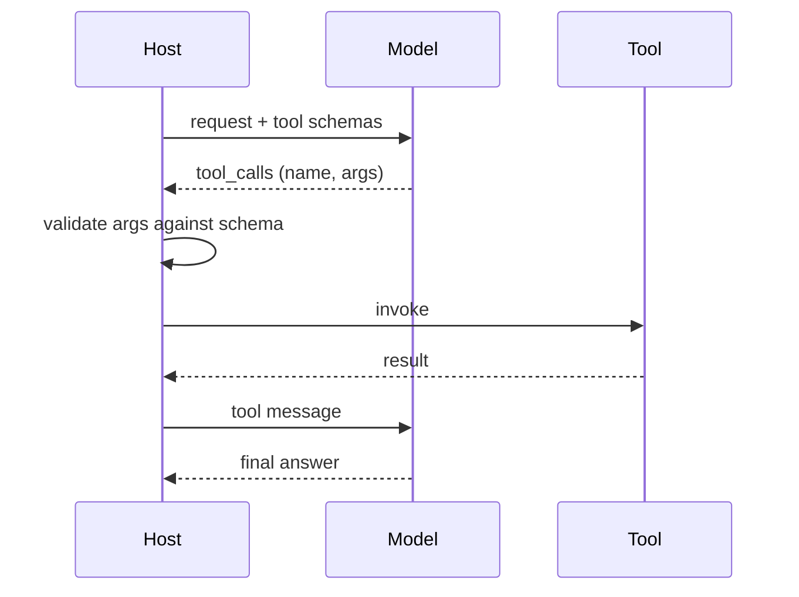
```mermaid
sequenceDiagram
    participant Host
    participant Model
    participant Tool
    Host->>Model: request + tool schemas
    Model-->>Host: tool_calls (name, args)
    Host->>Host: validate args against schema
    Host->>Tool: invoke
    Tool-->>Host: result
    Host->>Model: tool message
    Model-->>Host: final answer
```

**Anchors:** &bull; `agent-core/openjiuwen/core/foundation/tool/utils/callable_schema_extractor.py:20` — card → JSON Schema &bull; `agent-core/openjiuwen/core/single_agent/ability_manager.py:938` — model-facing tool list; `:1032` dispatch &bull; `agent-core/openjiuwen/core/foundation/llm/model_clients/base_model_client.py:483` — OpenAI tool format; `agent-core/openjiuwen/core/foundation/llm/model_clients/anthropic_model_client.py:494` — Anthropic `input_schema` &bull; `agent-core/openjiuwen/core/foundation/llm/model_clients/openai_model_client.py:2388` — parse non-streaming tool calls; `:313` streaming deltas; `agent-core/openjiuwen/core/foundation/llm/model_clients/anthropic_model_client.py:1229` — parse `tool_use` &bull; `agent-core/openjiuwen/core/foundation/tool/function/function.py:65` — argument schema validation

## 18. What's the difference between a chatbot and an agent

**General:** A chatbot maps one input to one model reply. An agent runs a loop: it calls the model, may call tools, feeds results back, and repeats until a stopping condition is met. The defining trait is the tool/reason loop and a termination rule, not the size of the model.

**Jiuwen:** There is no separate `Chatbot` class; the distinction is structural. A single model turn is the workflow LLM component, which calls `llm.invoke` once and has no tool branch. An agent is the loop in `ReActAgent.invoke`: it calls the model, and if the returned message has no tool calls it returns the answer; otherwise it executes the tools and iterates. `DeepAgent` wraps this with an outer task loop.

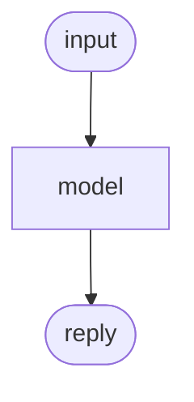
```mermaid
flowchart TD
    I1(["input"]) --> M1["model"] --> O1(["reply"])
```
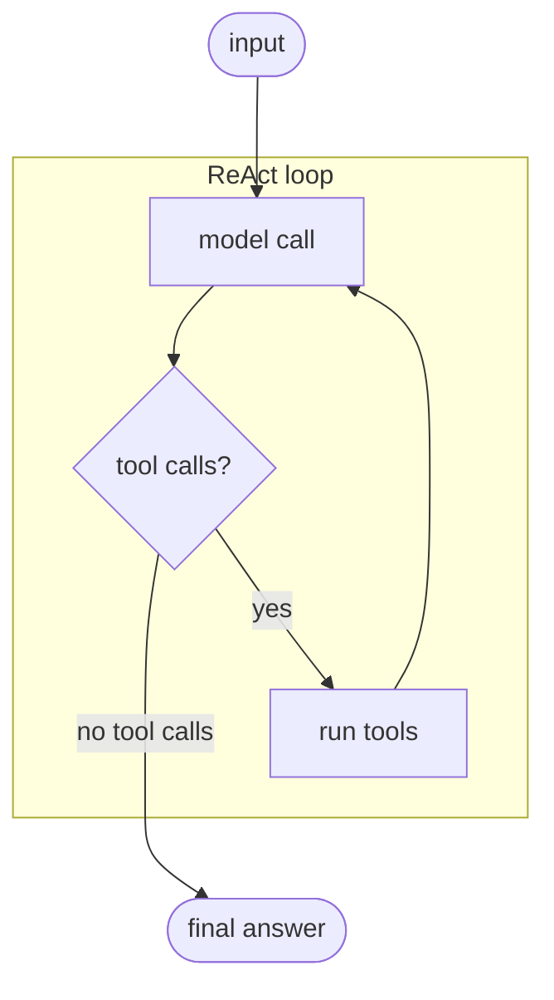
```mermaid
flowchart TD
    I(["input"]) --> M
    subgraph LOOP["ReAct loop"]
    direction TB
        M["model call"] --> D{"tool calls?"}
        D -->|yes| T["run tools"] --> M
    end
    D -->|"no tool calls"| A(["final answer"])
    T ~~~ A
```

**Anchors:** &bull; `agent-core/openjiuwen/core/workflow/components/llm/llm_comp.py:524` — single model call, no tool branch &bull; `agent-core/openjiuwen/core/single_agent/agents/react_agent.py:2740` — the ReAct loop &bull; `agent-core/openjiuwen/core/single_agent/agents/react_agent.py:2793` — no tool calls → final answer &bull; `agent-core/openjiuwen/core/single_agent/agents/react_agent.py:2813` — execute tools and iterate &bull; `agent-core/openjiuwen/harness/deep_agent.py:2694` — outer task loop

## 19. How do you prevent an agent from getting stuck in an infinite tool-calling loop

**General:** Cap iterations, detect repetition (same tool and arguments repeatedly), nudge or abort when no progress is made, and also cap rounds, tokens, and wall time. Detection should compare canonicalized arguments, not raw strings.

**Jiuwen:** Inner cap `max_iterations` (ReAct default 5, harness default 15). Repetition detection: `ModelAnomalyDetectionRail` finds consecutive identical `(tool_name, canonical_args)` rounds and either folds them into a warning or aborts; `ToolCallDeduplicationRail` counts repeated read-only calls and warns. Outer guards: `NoProgressAnswerEvaluator`, `MaxRoundsEvaluator`, and the hard 50-round ceiling. Agent teams add repeat-tool and ping-pong detectors.

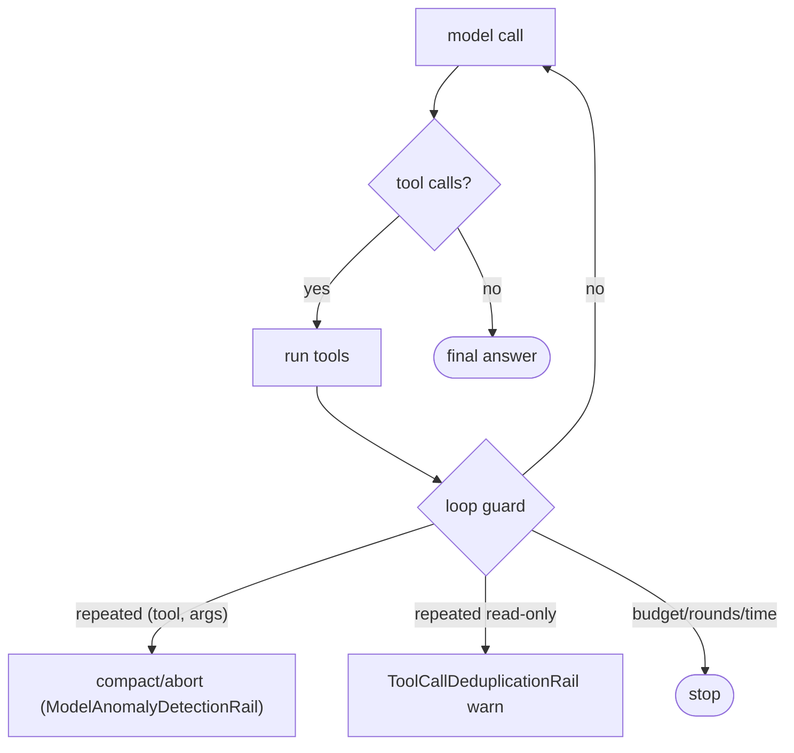
```mermaid
flowchart TD
    M["model call"] --> D{"tool calls?"}
    D -->|yes| T["run tools"]
    T --> G{"loop guard"}
    G -->|"repeated (tool, args)"| W["compact/abort (ModelAnomalyDetectionRail)"]
    G -->|"repeated read-only"| DEDUP["ToolCallDeduplicationRail warn"]
    G -->|no| M
    G -->|"budget/rounds/time"| X(["stop"])
    D -->|no| A(["final answer"])
```

**Anchors:** &bull; `agent-core/openjiuwen/core/single_agent/agents/react_agent.py:288` — `max_iterations` default 5; `agent-core/openjiuwen/harness/schema/config.py:252` — harness default 15 &bull; `agent-core/openjiuwen/harness/rails/model_anomaly_detection_rail.py:74/90` — tool-loop threshold + bailout &bull; `jiuwenswarm/jiuwenswarm/agents/harness/common/rails/tool_dedup_rail.py:157` — cross-turn repeat counter &bull; `agent-core/openjiuwen/harness/schema/stop_condition.py:181` — `NoProgressAnswerEvaluator` &bull; `agent-core/openjiuwen/harness/deep_agent.py:2692` — hard 50-round ceiling &bull; `agent-core/openjiuwen/agent_teams/reliability/detectors/repeat_tool.py:15` — repeat-tool; `agent-core/openjiuwen/agent_teams/reliability/detectors/pingpong.py:12` — ping-pong

## 20. When is a multi-agent system overkill compared to a single well-designed agent

**General:** Multi-agent is justified when you need genuinely separated context/ownership: parallel independent workstreams, distinct tool/permission scopes, or specialization that would otherwise fight for one context window. It is overkill when a single agent with good tools, memory, and a clear prompt can do the job — multi-agent adds coordination cost, latency, and new failure modes (ping-pong, conflicting results) without adding "intelligence".

**Jiuwen:** Supported but not the default: `agent_teams` provides a leader/teammate model with a DB task board and mailbox, and subagents provide intra-agent delegation with isolated sessions/workspaces to avoid context pollution. The product's swarm is an assembly layer composing team specs from config. A single well-designed agent is the baseline.

```mermaid
flowchart TD
    N{"need separate context / ownership?"} -->|no| S(["single well-designed agent"])
    N -->|yes| Q{"parallel work or distinct scopes?"}
    Q -->|no| S
    Q -->|yes| M(["multi-agent justified"])
```

**Anchors:** &bull; `agent-core/openjiuwen/harness/subagent_runtime/control.py:169` — reject live subagent re-spawn &bull; `agent-core/openjiuwen/harness/tools/subagent/task_tool.py:194` — isolated subagent session; `:154` `TaskTool` &bull; `jiuwenswarm/jiuwenswarm/agents/swarm/assembly.py:260` — product swarm assembly &bull; `agent-core/openjiuwen/agent_teams/agent/team_agent.py:76` — one `TeamAgent` for leader/teammate

---

# Evaluation

## 21. How do you evaluate a GenAI application beyond "it looks correct"

**General:** Combine automatic metrics (exact match, F1, functional/tests for code), an LLM-as-judge with a rubric for open-ended quality, and human review on a sample. Build a held-out set with representative and adversarial cases, score consistently, and track regressions.

**Jiuwen:** Three quality systems exist. `agent_evolving/evaluator/` provides `DefaultEvaluator`/`MetricEvaluator` with `LLMAsJudgeMetric` and `ExactMatchMetric`. RSI's judge scores weighted `required_behaviors` + `rubric` + `forbidden_behaviors` with per-item evidence and penalties. `symphony/evaluation/` registers a suite of evaluators (`structure_conformance`, `accuracy`, `completeness`, `latency`, …), and `evaluator_pipeline` runs a Docker benchmark emitting `pass_rate`/convergence. PerStream adds a GPT-3.5 judge.

```mermaid
flowchart TD
    OUT["output"] --> M1["ExactMatchMetric"]
    OUT --> M2["LLMAsJudgeMetric (0/1)"]
    OUT --> M3["RSI judge: weighted required/rubric/forbidden + evidence"]
    OUT --> M4["symphony evaluators (accuracy/completeness/latency/...)"]
    OUT --> M5["evaluator_pipeline: pass_rate + convergence"]
    M1 --> AGG(["eval result"])
    M2 --> AGG
    M3 --> AGG
    M4 --> AGG
    M5 --> AGG
```

**Anchors:** &bull; `agent-core/openjiuwen/agent_evolving/evaluator/evaluator.py:82` — `DefaultEvaluator`; `:197` `MetricEvaluator` &bull; `agent-core/openjiuwen/agent_evolving/evaluator/metrics/llm_as_judge.py:47` — judge prompt + result; `agent-core/openjiuwen/agent_evolving/evaluator/metrics/exact_match.py:12` — `ExactMatchMetric` &bull; `agent-core/openjiuwen/rsi/harness_rsi/evaluator/judger/scoring.py:193` — weighted score + penalties; `agent-core/openjiuwen/rsi/harness_rsi/evaluator/judger/llm_as_judge.py:159` `score_judge_output` &bull; `agent-core/openjiuwen/symphony/evaluation/evaluators.py:671` — `BUILTIN_EVALUATORS`; `:438` `AccuracyEvaluator` &bull; `agent-core/openjiuwen/agent_evolving/evaluator/evaluator_pipeline/pipeline.py:167` — `bench.evaluate`; `:664` `_compute_evolution_metrics` &bull; `agent-core/examples/PerStream/src/eval/score_passive_judge.py:52` — GPT-3.5 correctness judge

**Gap.** Evaluators are library/CLI components, not a deployed quality dashboard; no cross-system aggregation or statistical significance.

## 22. What's the difference between faithfulness and relevance

**General:** Relevance asks whether retrieved passages are on-topic for the query (context precision/recall). Faithfulness/groundedness asks whether the answer's claims are actually supported by the retrieved context (does it hallucinate beyond the evidence). A system can retrieve relevant context and still be unfaithful, or be faithful to irrelevant context. Measuring faithfulness requires giving the judge the context and checking claim support/citations, not just answer-vs-reference correctness.

**Jiuwen:** There is no retrieval-groundedness, faithfulness, attribution, or context-relevance metric. The closest concepts: symphony's `AccuracyEvaluator` judges factual correctness with a rubric about hallucination but does not receive the retrieved context, so it cannot detect unsupported-but-plausible claims; the reviewer rubric lists a `Correctness` dimension ("no hallucination") at weight 0.3; and the RSI judge accepts arbitrary `rubric`/`required_behaviors`, so a user could encode a groundedness rule, but none is defined.

```mermaid
flowchart TD
    CTX["retrieved context"] --> REL["relevance: context precision/recall"]
    ANS["answer"] --> FAITH["faithfulness: are claims supported by context?"]
    CTX --> FAITH
    REL --> JUDGE["RAG eval"]
    FAITH --> JUDGE
    CTX -.->|"not passed to judge"| X["no faithfulness/attribution metric implemented"]
```

**Anchors:** &bull; `agent-core/openjiuwen/symphony/evaluation/evaluators.py:438` — `AccuracyEvaluator` (correctness, no context input); `:560` `Completeness`; `:621` `CapabilitySelection` &bull; `agent-core/openjiuwen/agent_evolving/evaluator/metrics/llm_as_judge.py:58` — parses only `result: true/false`, no context/attribution input &bull; `agent-core/openjiuwen/rsi/harness_rsi/evaluator/judger/scoring.py:68` — generic rubric contract (no built-in faithfulness dimension) &bull; `agent-core/openjiuwen/harness/tools/web/free_search.py:299` — "simple relevance checks" (lexical, not RAG relevance)

**Gap.** Fully absent. No metric receives retrieved passages alongside the answer; no citation extraction or attribution check.

## 23. How would you build a regression test suite for a prompt-based system

**General:** Combine fast deterministic unit tests on the pipeline components with a quality eval suite on a fixed dataset scored by the same metrics each time; store a baseline and fail the build when the score drops beyond a threshold. Add golden/snapshot tests for prompts and outputs, and gate merges on the suite.

**Jiuwen:** Tests split into `tests/unit_tests/` (fast, deterministic, CI) and `tests/system_tests/` (E2E, usually skipped). `pytest` defines markers `level0` ("smoke / happy-path; PR gate must stay green") and `level1`. Quality evaluation exists separately: `evaluator_pipeline` emits `pass_rate`/improvement/convergence, and `Trainer` compares a candidate's validation score against `best_score` and commits only improvements. But the CI gate that blocks merges (`ci_gate.yaml`) declares only `lint` and `type-check` — no pytest gate and no eval threshold.

```mermaid
flowchart TD
    PR["PR"] --> L["lint"] --> TC["type-check"] --> G{"gate (ci_gate.yaml)"}
    G -->|"configured"| LINT["lint + type-check only"]
    G -.->|"not configured"| PY["pytest level0 (advertised PR gate, not invoked)"]
    EVAL["evaluator_pipeline / Trainer"] -.->|"offline CLI, no baseline threshold"| Q["quality regression gate ABSENT"]
```

**Anchors:** &bull; `agent-core/pyproject.toml:230` — pytest config + `level0`/`level1` markers &bull; `agent-core/openjiuwen/auto_harness/resources/ci_gate.yaml:21` — gates are only `lint` and `type-check` &bull; `agent-core/openjiuwen/auto_harness/infra/ci_gate_runner.py:1098` — gate dispatch; `agent-core/openjiuwen/auto_harness/stages/verify.py:451` `ci_gate.run("all")`; `:509` revert on exhaustion &bull; `agent-core/openjiuwen/agent_evolving/trainer/trainer.py:217` — `improved = val_score > progress.best_score` &bull; `agent-core/openjiuwen/agent_evolving/evaluator/evaluator_pipeline/pipeline.py:664` — `_compute_evolution_metrics`

**Gap.** No model/agent-quality regression gate in CI, no golden/snapshot tests for prompts/retrieval/outputs, and credential-requiring system tests are skipped.

## 24. What's the role of an LLM-as-judge, and what are its limitations

**General:** An LLM-as-judge scales subjective evaluation: it scores open-ended output against a rubric when no exact metric exists. Its limitations: biases (position/order, verbosity, self-preference), noise/non-determinism, gameability and prompt injection, and it needs human calibration. Mitigations: position-swapping, multiple votes, agreement reporting, a golden calibration set, and distinguishing "judge failed" from "answer wrong".

**Jiuwen:** Four judge implementations exist. `agent_evolving`'s `LLMAsJudgeMetric` is a single call, parses to `true/false`, and converts exceptions to `0.0` (conflating "judge failed" with "answer wrong"). RSI's judge does one format retry on frozen evidence and guards against injecting "prior output" as trusted data, but is still single-judgment. Symphony's `LLMJudgeEvaluator` is `temperature=0.0` with one repair retry. Only the online RL `JudgeScorer` uses `num_votes` parallel votes averaged together. None handles position bias or reports agreement.

```mermaid
flowchart TD
    J["LLM judge"] --> B["biases: position/order · verbosity · self-preference"]
    J --> V["variance: non-deterministic"]
    J --> I["injection: judge prompt can be gamed"]
    J --> C["calibration: needs human golden set"]
    J --> F["failure vs wrong: must not collapse to 0"]
    J -.->|"only num_votes (RL)"| MULTI["multiple votes / agreement"]
    J -.->|"absent"| SWAP["position swap · agreement metric · bias probe"]
```

**Anchors:** &bull; `agent-core/openjiuwen/agent_evolving/evaluator/metrics/llm_as_judge.py:53` — single invoke, exception → `0.0`; `agent-core/openjiuwen/agent_evolving/evaluator/evaluator.py:123` — same failure pattern &bull; `agent-core/openjiuwen/rsi/harness_rsi/evaluator/judger/llm_as_judge.py:121` — two-attempt loop; `:152` untrusted prior-output guard &bull; `agent-core/openjiuwen/symphony/evaluation/base.py:262` — single judge call + one repair retry; `:401` `temperature=0.0` &bull; `agent-core/openjiuwen/agent_evolving/agent_rl/online/judge/evaluator.py:66` — `num_votes` averaged; `:92` raw votes retained &bull; `agent-core/openjiuwen/rsi/harness_rsi/evaluator/judger/scoring.py:127` — strict single-verdict parsing

**Gap.** No position/order-bias control, no inter-rater agreement, no variance threshold, no human calibration; most paths convert judge/infra failure to `0.0`.

---

# Production and scale

## 25. How do you control cost in a system where usage scales unpredictably

**General:** Bound the loop (max iterations/rounds/time), cap tokens per request and per session, make cheap models do cheap work, cache, offload/summarize context, and surface per-run cost so it can be budgeted and alerted. Retries and huge tool outputs are common hidden cost sources.

**Jiuwen:** The product tracks provider-reported session cost and enforces a per-session cap: totals accumulate under a lock, `set_session_cost_limit` sets a ceiling only when provider cost metadata is available, and `raise_if_session_cost_limit_exceeded` raises when over. Core limits repetition via ReAct `max_iterations` (default 5, harness 15), team `BudgetLedger` token ceilings, and `ModelAnomalyDetectionRail`'s tool-loop compaction/bailout. `ToolCallDeduplicationRail` counts repeated read-only calls and warns.

```mermaid
flowchart TD
    M["model call"] --> D{"tool calls?"}
    D -->|yes| T["run tools"]
    T --> L{"loop guard: repeated (tool,args)"}
    L -->|"threshold"| CMP["compact / abort"]
    T --> M
    SESS["session cost cap (usage_cost.py)"] -.->|"pre-flight + mid-stream"| M
    BUD["team BudgetLedger token ceiling"] -.-> T
    ITER["max_iterations 5 / 15"] -.-> M
```

**Anchors:** &bull; `jiuwenswarm/jiuwenswarm/server/runtime/usage_cost.py:171` — `raise_if_session_cost_limit_exceeded`; `:196` `set_session_cost_limit` (requires provider cost) &bull; `agent-core/openjiuwen/core/single_agent/agents/react_agent.py:288` — `max_iterations`; `agent-core/openjiuwen/harness/schema/config.py:252` — harness default 15 &bull; `agent-core/openjiuwen/agent_teams/workflow/engine/budget.py:27` — `BudgetLedger` &bull; `agent-core/openjiuwen/harness/rails/model_anomaly_detection_rail.py:74/90` — tool-loop threshold + bailout &bull; `jiuwenswarm/jiuwenswarm/agents/harness/common/rails/tool_dedup_rail.py:157` — cross-turn repeat counter; `agent-core/openjiuwen/harness/goal/evaluation.py:298` — `max_attempts`

**Gap.** Cost enforcement is inert unless the provider reports cost metadata, and totals/limits are per-process (not shared across replicas). No cost-aware model downgrade.

## 26. How would you reduce latency in a multi-step GenAI pipeline

**General:** Stream tokens so time-to-first-token matters more than total; run independent steps in parallel; cache prompts/prefixes and embeddings; route easy steps to faster/smaller models; and avoid blocking the event loop. Measure TTFT and per-stage latency to find the bottleneck.

**Jiuwen:** End-to-end streaming is supported (ReAct `stream` → session stream iterator → WebSocket chunk frames), and TTFT is measured per model call (`ttft_ms`). Shared persistent HTTP clients avoid per-call TLS setup, parallel tool execution shortens multi-tool turns, and local inference uses prompt/prefix KV-cache reuse. `IntelliRouter` provides a reliable router across deployments, and the product caches built model objects by name.

```mermaid
flowchart LR
    REQ["multi-step pipeline"] --> ST["streaming (SSE/WS chunks) + TTFT measured"]
    REQ --> PAR["parallel tool execution"]
    REQ --> CACHE["KV/prefix cache (local inference) · model object cache"]
    REQ --> ROUTE["IntelliRouter → deployment selection"]
    REQ --> TO["asyncio.to_thread for blocking work"]
    REQ -.->|"absent"| X["speculative decoding · latency-based routing · cross-request batching"]
```

**Anchors:** &bull; `agent-core/openjiuwen/core/single_agent/agents/react_agent.py:2938` — `stream` entry; `:1758` `ttft_ms` &bull; `agent-core/openjiuwen/core/foundation/llm/model.py:197` — stream first-chunk/idle timeouts &bull; `agent-core/openjiuwen/core/kv_cache/kv_cache_runtime.py:32` — session KV-cache runtime &bull; `agent-core/openjiuwen/symphony/retrieval/llm/vllm/client.py:176` — `prepare_prefix_cache` &bull; `agent-core/openjiuwen/core/foundation/llm/model_clients/intelli_router_model_client.py:32` — `ReliableRouter` &bull; `jiuwenswarm/jiuwenswarm/server/runtime/agent_adapter/interface_deep.py:6353` — model object cache by name

**Gap.** No speculative decoding, no latency/SLA-based routing, no cross-request batching; prefix caching exists only for local inference.

## 27. What happens to your architecture at 10x current traffic

**General:** You hit dependencies and queues before arithmetic: provider rate limits and 429s, serialized tool/DB access, memory pressure from context, and connection pools. Costs scale roughly linearly with tokens but can super-linearly if retries or coordination rise. Fixes are caching, concurrency limits, queues/shards, backpressure, and cheaper routing — plus autoscaling at the process boundary.

**Jiuwen:** The system has per-process bounded resources rather than elastic scaling. LLM HTTP concurrency is capped by a shared httpx pool (`max_connections=100`, keepalive 20); embeddings by a semaphore (default 50) with batch size 8; team sub-agent fan-out by a semaphore (default 10); the warm pool and message queues have their own bounds. Internal channels use bounded `asyncio.Queue(maxsize=...)`; workflow HTTP supports token-bucket rate limiting; retries/backoff exist at model and tool layers. There is no autoscaling.

```mermaid
flowchart TD
    X["10x traffic"] --> RL["provider rate limits / 429"]
    X --> POOL["bounded conn pool (100/30 per host)"]
    X --> SEM["semaphores: embeddings 50 · sub-agents 10"]
    X --> Q["bounded asyncio.Queue (backpressure)"]
    RL --> FIX["retry + backoff · rate limit"]
    POOL --> FIX
    SEM --> FIX
    Q --> FIX
    FIX -.->|"absent"| AUTO["no autoscaling / distributed limiter / bulkheads"]
```

**Anchors:** &bull; `agent-core/openjiuwen/core/common/clients/connector_pool.py:21` — `limit: 100`, `limit_per_host: 30`; `agent-core/openjiuwen/core/foundation/llm/model_clients/openai_model_client.py:1118` — pool limits &bull; `agent-core/openjiuwen/core/retrieval/embedding/api_embedding.py:55` — concurrency semaphore &bull; `agent-core/openjiuwen/core/multi_agent/teams/hierarchical_msgbus/p2p_ability_manager.py:34` — max parallel sub-agents &bull; `agent-core/openjiuwen/core/workflow/components/tool/http/http_request_component.py:110` — `HttpRateLimitConfig` &bull; `agent-core/openjiuwen/core/runner/message_queue_inmemory.py:34` — bounded queue; `agent-core/openjiuwen/harness/subagent_runtime/activity_events.py:53` — bounded activity queue &bull; `agent-core/openjiuwen/harness/rails/model_anomaly_detection_rail.py:35` — backoff schedule; `jiuwenswarm/jiuwenswarm/server/runtime/agent_warm_pool.py:154` — warm-pool semaphore split

**Gap.** No HPA/autoscaling, no global/distributed rate limiter or admission control, no cross-tenant bulkheads. Connection caps and cost totals are per-process.

## 28. How do you version prompts the same way you'd version code

**General:** Treat prompts as versioned artifacts: store them in source control (or a prompt store), give each version an immutable ID/content hash, track diffs and metadata, allow activate/rollback without redeploying, and tie a version to the model/parameters it was tested with. Ideally prompts are assembled from composable, individually versioned pieces.

**Jiuwen:** Prompts are assembled from named `PromptSection`s ordered by priority (`SystemPromptBuilder.add_section`/`build`), extended by `harness.prompts.builder` with a `PromptMode` filter, and JiuwenSwarm supplies a static priority registry. Sections carry only name/priority/category — no version, hash, or ID. Diagnostics exist (`PromptReport`) but are not versioning. Prompt optimization overwrites the operator's `system_prompt`/`user_prompt` in place; the only persistence is `EvolveCheckpoint.version` storing `operators_state` for resume. Real versioning/rollback exists only at the RSI harness-package level (content-addressed `installation_id`, `list_versions`, `rollback` with hash re-validation) and config migration.

```mermaid
flowchart TD
    PR["PR"] --> L["lint"] --> TC["type-check"] --> G{"gate (ci_gate.yaml)"}
    G -->|"configured"| LINT["lint + type-check only"]
    G -.->|"not configured"| PY["pytest level0 (advertised, not invoked)"]
    EVAL["evaluator_pipeline / Trainer"] -.->|"offline CLI, no baseline threshold"| Q["quality regression gate ABSENT"]
```

```mermaid
flowchart TD
    OPT["prompt optimizer"] --> MUT["overwrites system_prompt/user_prompt in place"]
    OPT --> CKPT["EvolveCheckpoint.version (operators_state, for resume)"]
    SEC["PromptSection: name/priority/category — no version/hash"] --> ASM["SystemPromptBuilder.build()"]
    RSI["RSI harness package: installation_id=sha, list_versions, rollback"] -.->|"package-level only"| X["no prompt registry/diff/rollback"]
```

**Anchors:** &bull; `agent-core/openjiuwen/core/single_agent/prompts/builder.py:24` — `PromptSection` (no version); `:97` `add_section`; `:219` `build` &bull; `agent-core/openjiuwen/harness/prompts/builder.py:31` — `PromptMode` filtering; `agent-core/openjiuwen/harness/prompts/sections/__init__.py:6` — `SectionName` constants &bull; `agent-core/openjiuwen/harness/prompts/report.py:38` — `PromptReport` diagnostics (no hash/version) &bull; `agent-core/openjiuwen/harness/manifest/models.py:43` — `HarnessElementDescriptor` (no version field) &bull; `jiuwenswarm/jiuwenswarm/agents/harness/common/prompt/priority_registry.py:19` — static priority registry &bull; `agent-core/openjiuwen/core/operator/llm_call/base.py:107` — `get_state`/`load_state` snapshot prompt content &bull; `agent-core/openjiuwen/agent_evolving/checkpointing/manager.py:43` — `EvolveCheckpoint.version` for resume &bull; `jiuwenswarm/jiuwenswarm/agents/harness/common/rsi/harness_activation.py:617` — `rollback`; `:587` `list_versions`; `jiuwenswarm/jiuwenswarm/server/rsi/rsi_handlers.py:218` — RPC list/rollback &bull; `jiuwenswarm/jiuwenswarm/common/utils.py:882` — `config_version` migration

**Gap.** No prompt-as-code versioning: no prompt registry, per-section version/hash, diff, or activate/rollback for prompts. Optimization mutates in place; RSI versioning applies only to whole harness packages.

---

# Safety and ethics

## 29. How do you prevent a model from generating harmful or biased content

**General:** Layer defenses: a safety instruction in the system prompt, input and output content classifiers/moderation, policy filters on generated output, and refusal behavior validated by red-teaming. Because a prompt is advice not a control, real safety needs an enforced output filter. Bias specifically needs measurement (bias probes, disaggregated evals) and mitigation, not just a "be safe" instruction.

**Jiuwen:** Two layers. Prompt-level (advisory): `SafetyPromptRail` is production-registered and, on each model call, appends a static bilingual safety section to the system prompt then always returns allow — it never inspects or rewrites content. Enforced-but-unwired: `core/security/guardrail/` provides `BaseGuardrail` + backends; `PromptInjectionGuardrail` can raise `AbortError`/`GuardrailError` on risky input/output, and an optional local `AutoModelForSequenceClassification` / QwenGuard classifier exists — but none has a production caller. There is no bias, toxicity, or content-policy detector anywhere.

```mermaid
flowchart TD
    M["model"] --> ADV["SafetyPromptRail: append safety section (advisory, always allow)"]
    M --> ENF["guardrail framework: PromptInjectionGuardrail + ML classifier (unwired)"]
    M --> MOD["toxicity / harm / content policy filter"]
    MOD -.->|"absent"| X["no content moderation, no bias detection"]
```

**Anchors:** &bull; `agent-core/openjiuwen/harness/rails/security/prompt_security_rail.py:16` — `SafetyPromptRail`; `:38` injects section; `:41` always returns allow &bull; `agent-core/openjiuwen/harness/prompts/sections/safety.py:14` (CN) / `:26` (EN) — static safety text; `:44` `build_safety_section`; `:54` priority &bull; `jiuwenswarm/jiuwenswarm/server/runtime/agent_adapter/interface_deep.py:93` — production import of `SecurityRail`; `:8577` `_build_security_rail()`; `jiuwenswarm/jiuwenswarm/agents/harness/team/team_runtime_inheritance.py:248` — team members create `SecurityRail()` &bull; `agent-core/openjiuwen/core/security/guardrail/builtin.py:60` — `PromptInjectionGuardrail`; `agent-core/openjiuwen/core/security/guardrail/guardrail.py:361` — raises `AbortError`/`GuardrailError` &bull; `agent-core/openjiuwen/core/security/guardrail/backends.py:445` — `LocalModelBackend` (`AutoModelForSequenceClassification`); `agent-core/openjiuwen/core/security/guardrail/context.py:207` — `QwenGuardParser` &bull; `agent-core/openjiuwen/harness/rails/security/base_security_rail.py:58` — `SecurityReject`/`SecurityInterrupt`/`SecurityAlert`

**Gap.** The ML guardrail and content classifier are implemented but have no production callers; only `SafetyPromptRail` (advisory) is mounted. No bias/toxicity/content-policy detection exists.

## 30. How do you handle a user trying to jailbreak your system's guardrails

**General:** Assume the model can be talked around, so enforce outside it: detect and block known jailbreak/injection patterns at input, keep privileged actions behind a permission check that the model cannot bypass, sandbox tools, and log/rate-limit repeated attempts. No single regex is sufficient (paraphrase, encoding, multi-turn role-play evade it), so detection is a signal, not the control.

**Jiuwen:** No dedicated jailbreak subsystem; four independent mechanisms. A `RuleBasedPromptInjectionBackend` matches `ignore.*previous.*instructions`, `disregard.*prior.*commands`, `system.*prompt`, `you.*are.*now`, `act.*as`, `forget.*everything` — but the guardrail is unregistered in production. The auto-harness `SecurityRail` heuristic (production-registered only in the auto-harness factory) scans messages for suspicious patterns and force-finishes the run. Shell command substitution is hard-blocked, and the permission engine floors risky/unknown shell structures and interpreter sinks to ASK, with builtin rules denying reverse shells, `rm -rf`, shutdown, and sensitive paths.

```mermaid
flowchart TD
    JB["jailbreak attempt"] --> P["regex injection patterns (unregistered in prod)"]
    JB --> H["auto-harness SecurityRail heuristic → force_finish (auto-harness only)"]
    JB --> SH["shell: block backtick / `$()`"]
    JB --> PE["permission engine: ASK floor + builtin DENY rules"]
    H -.->|"coarse substring, trivially bypassable"| X["no multi-turn / encoding / role-play detection"]
```

**Anchors:** &bull; `agent-core/openjiuwen/core/security/guardrail/backends.py:181` — default injection patterns; `:127` `RuleBasedPromptInjectionBackend` &bull; `agent-core/openjiuwen/auto_harness/rails/security_rail.py:28` — `_SUSPICIOUS_PATTERNS`; `:116` scan + `request_force_finish`; `agent-core/openjiuwen/auto_harness/agents/factory.py:178` — production registration path &bull; `agent-core/openjiuwen/harness/tools/shell/bash/_security.py:29` — `_INJECTION_PATTERNS`; `:40` `check_injection` blocks; `agent-core/openjiuwen/harness/tools/shell/bash/_tool.py:378` call site; `:71` destructive-command warnings &bull; `agent-core/openjiuwen/harness/security/permission_engine/toolguard/tool_policy.py:409` — shell AST ASK floor; `:502` ASK fallback; `:694` interpreter-sink ASK &bull; `agent-core/openjiuwen/harness/resources/builtin_rules.yaml:59` reverse-shell DENY; `:99` shutdown; `:148` sensitive paths &bull; `agent-core/openjiuwen/harness/security/permission_engine/core.py:246` — strictest merge; `agent-core/openjiuwen/harness/rails/security/tool_security_rail.py:57` `PermissionInterruptRail`

**Gap.** The pattern guardrail is unregistered in production; the only enforced input abort is the auto-harness heuristic, which normal agents do not mount and which is a coarse case-insensitive substring match (bypassable by paraphrase/encoding/multimodal).

## 31. How do you prevent sensitive user data from leaking into a model's output or logs

**General:** Detect and redact secrets before they reach the model or the logs: scrub known patterns (API keys, tokens, PII) from tool results and prompts, redact log fields (don't just drop whole fields), gate egress of secret-like payloads, and keep a path to audit without storing the secret. Detection alone is not redaction.

**Jiuwen:** Actual model-context redaction exists only as a demo rail: `SensitivedatasanitizeRail` regex-redacts keys/tokens/bearer strings in history and responses, replacing with `[REDACTED]`. In production, redaction is layer-specific: structured log events redact whole sensitive fields via an allowlist, the auto-permission audit writer redacts secret-like text before appending JSONL, and the auto-permission rule engine detects secret-like egress payloads to force ASK/DENY rather than redact. There is no built-in sensitive-data guardrail.

```mermaid
flowchart LR
    SEC["secret in tool result / prompt"] --> DEMO["SensitiveDataSanitize demo rail: [REDACTED] (example only)"]
    SEC --> LOG["log events: drop/redact whole named fields"]
    SEC --> AUD["audit writer: narrow secret redaction"]
    SEC --> EGRESS["permission engine: detect secret egress → ASK/DENY"]
    SEC -.->|"absent"| CTX["guaranteed context redaction on the normal path"]
```

**Anchors:** &bull; `agent-core/examples/security_rail_demo/SensitiveDataSanitize/rail.py:27` — sensitive regexes; `:60` `run_security_check`; `:96` `_sanitize_output` rewrites history/response &bull; `agent-core/openjiuwen/core/common/logging/events.py:920` — `sanitize_event_for_logging`; `:932` sensitive field list; `:951` `<REDACTED>`; `agent-core/openjiuwen/core/common/logging/base_impl.py:114` `_sanitize_message` &bull; `jiuwenswarm/jiuwenswarm/agents/harness/common/rails/permissions/persistent_audit.py:50` — secret-like pattern; `:262` `_sanitize_audit_text`; `:289` combined detection &bull; `jiuwenswarm/jiuwenswarm/agents/harness/common/rails/permissions/auto_decision.py:32` — egress secret patterns; `:82` redacted risk labels &bull; `agent-core/openjiuwen/core/security/guardrail/builtin.py` — only `PromptInjectionGuardrail`

**Gap.** `SensitiveDataSanitize` is example-only; production redaction is partial and layer-specific. Nothing guarantees secrets are stripped from model context on the normal path.

---

## Summary: strong vs weak in Jiuwen

| Area | Strength | Notes |
|---|---|---|
| Tokenization / cost accounting | Strong | model-aware counters, budgets, usage metadata |
| Transformer internals | Weak | absent; delegated to providers/HF |
| Sampling params | Mixed | passthrough + local math; top-k sampling absent |
| Zero/few/CoT prompting | Mixed | runtime zero-shot; few-shot only in tuning tooling |
| System vs user prompt | Strong | section builder + rails, provider-correct mapping |
| Structured/JSON output | Strong | schema-as-tool + validation + retry; no native `response_format` |
| Prompt-injection defense | Mixed | enforced shell/permission layer; detector unregistered, safety text only |
| RAG pipeline | Mixed | real ingest/retrieve components; no packaged RAG agent, no context trimming |
| RAG vs fine-tuning | Weak | rationale for prompt-tuning over fine-tuning; no explicit RAG-vs-tune criteria |
| Grounding when context is insufficient | Weak | no answerability gate; `score_threshold` defaults None; no "I don't know" path |
| Vector similarity limits | Mixed | backend-rescaled scores, no calibration/MMR/rerank in KB |
| Fine-tuning (LoRA/PEFT) | Strong | real SFT + PPO via veRL, versioned adapters |
| When tuning is worth it | Weak | no decision function or cost thresholds |
| Instruction tuning | Strong | loss-masked SFT on trajectories |
| Small-dataset risk | Weak | offline RL has val; SFT path has no held-out validation |
| Function calling | Strong | schema-driven, validated, multi-provider |
| Chatbot vs agent | Strong | structural ReAct loop vs single LLM component |
| Loop prevention | Strong | iteration caps, anomaly/dedup rails, stop-condition chain |
| Multi-agent overkill judgment | Strong | teams/subagents isolated; not default |
| Output evaluation | Strong | exact-match, LLM-judge, RSI rubric, benchmark pipelines |
| Faithfulness vs relevance | Weak | absent; judges do not receive retrieved context |
| Prompt regression suite | Weak | unit tests + eval CLI; CI gate is lint/type-check only |
| LLM-as-judge rigor | Weak | single vote, no position-swap/agreement/calibration; failures → 0.0 |
| Cost control | Mixed | session cap when provider reports cost; task-loop budget opt-in |
| Latency | Strong | streaming, TTFT, parallel tools, KV/prefix cache |
| Scale (10x) | Mixed | per-process bounds + backpressure; no autoscaling |
| Prompt versioning | Weak | no prompt registry/hash/diff/rollback; only harness-package-level RSI |
| Harmful/biased content | Weak | advisory safety rail only; guardrail/classifier unwired; no bias detection |
| Jailbreak defense | Mixed | enforced shell/permission; heuristic auto-harness-only and coarse |
| Sensitive-data redaction | Weak | demo rail only; production redaction partial/layer-specific |
