# LLM interview questions (applied) — general answers + how Jiuwen does it

Based on the recurring list *LLM Interview Questions I Keep Seeing Everywhere* (Core LLM Concepts; RAG; Agents and Tool Use; Evaluation; Production and Cost; Security), aimed at AI-engineering / LLM-application roles. This is the applied companion to the *LLM fundamentals* set — that one covers model internals, this one covers building with the model.

Most questions repeat across the other docs, so their **General** and **Jiuwen** answers are reused verbatim (with the same anchors). The only genuinely new ground is the rollback plan for a bad prompt/model update (Q21). See [README](README.md) for the shared conventions (answer shape, anchor format, repo layers).

> **The pattern worth noticing:** the questions barely change month to month. What changes is how deep the follow-up goes. A junior candidate explains what RAG is; a senior candidate explains why they'd choose 5 retrieved documents over 20 for a specific latency budget.

---

# Core LLM concepts

## 1. What is the difference between tokens and embeddings?

**General:** A token is a unit of text (a sub-word piece) — the input/output alphabet of the model. An embedding is a vector representation of text that encodes meaning, used for similarity search. Tokens are discrete and count against cost/context; embeddings are continuous and live in a vector space. You embed chunks/tokens, but they are different abstractions.

**Jiuwen:** Tokens are counted by `TokenCounter` (tiktoken-based, drives limits/cost); embeddings are produced by the `Embedding` ABC and compared in a vector store. The two are independent: the tokenizer sets chunk sizes, the embedder sets vector dimension.

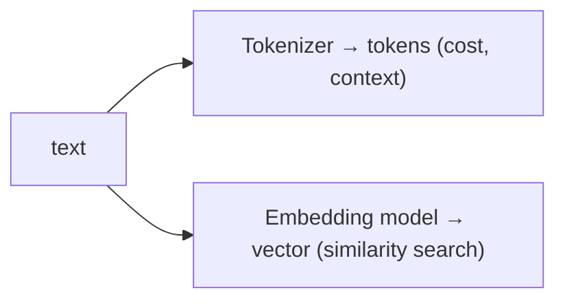

**Anchors:** &bull; `agent-core/openjiuwen/core/context_engine/token/tiktoken_counter.py:212` — `TokenCounter`; `:287` fallback &bull; `agent-core/openjiuwen/core/foundation/store/base_embedding.py:24` — `Embedding` ABC; `:29` `embed_query` &bull; `agent-core/openjiuwen/core/retrieval/indexing/indexer/embed_chunks.py:46` — `embed_documents`

## 2. Explain temperature and top-p sampling — how do they change model output?

**General:** Both reshape the next-token distribution. Temperature divides logits (`softmax(z/T)`): low → deterministic, high → diverse. Top-p keeps the smallest token set whose cumulative probability exceeds `p` (adaptive candidate count). Temperature changes the shape; top-p truncates the tail. Lower both for factual/extraction tasks.

**Jiuwen:** Both are passthrough params; the local HF/vLLM path implements `logits/T` and nucleus truncation. Top-p is implemented locally (`top_p` default `1.0`); top-k sampling is absent. OpenAI-compatible calls to `openai.com` keep only one of temperature/top-p.

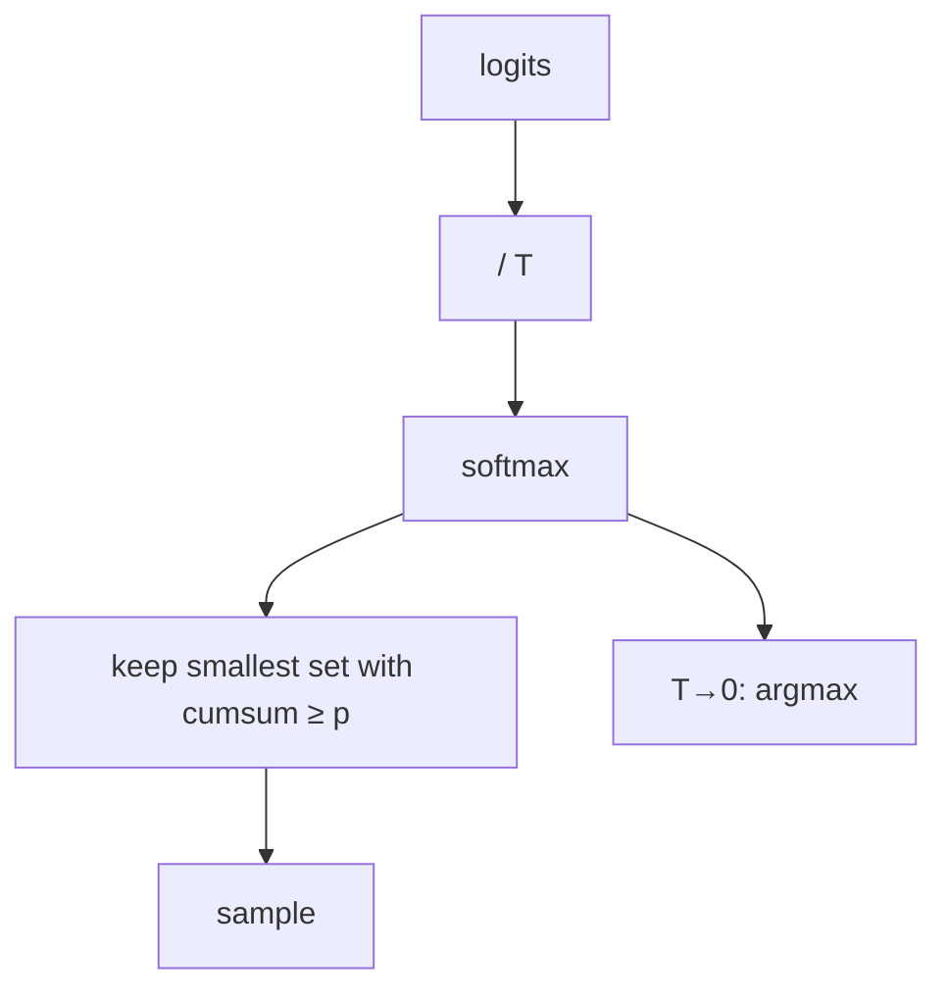

**Anchors:** &bull; `agent-core/openjiuwen/core/foundation/llm/schema/config.py:210/213` — `temperature`/`top_p` optional &bull; `agent-core/openjiuwen/symphony/retrieval/llm/transformers_prefix_cached_generation/generation.py:516` — `/T`; `:517` nucleus; `:514` argmax &bull; `agent-core/openjiuwen/symphony/retrieval/llm/base/types.py:61` — `top_p` (no top-k field) &bull; `agent-core/openjiuwen/core/foundation/llm/model_clients/openai_model_client.py:944` — drops `top_p` when temperature set

## 3. What happens when you exceed a model's context window?

**General:** The provider either rejects the request or you must shrink the prompt. Robust systems pre-empt it: count tokens and drop/truncate oldest history, offload large tool outputs, and/or summarize old turns, always preserving recent turns. Overflow is a budget-management problem.

**Jiuwen:** The context engine budgets the window (`effective_context_budget` = strictest bound), offloads large tool results to disk, compacts at thresholds (`RoundLevelCompressor` 0.9×, `FullCompactProcessor` 180k), and falls back to a FIFO drop beyond `max_context_message_num`. If the provider still rejects, `recover_from_model_exception` force-compacts and retries.

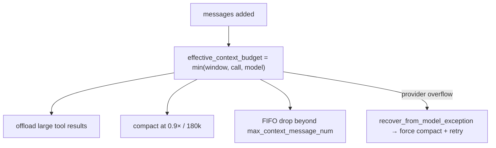

**Anchors:** &bull; `agent-core/openjiuwen/core/context_engine/context/context_utils.py:20/404` — window resolution &bull; `agent-core/openjiuwen/core/context_engine/processor/budget_guard.py:37` — `effective_context_budget` &bull; `agent-core/openjiuwen/core/context_engine/processor/offloader/tool_result_budget_processor.py:34` — offload threshold &bull; `agent-core/openjiuwen/core/context_engine/processor/compressor/full_compact_processor.py:184` — 180k &bull; `agent-core/openjiuwen/core/context_engine/context_engine.py:372` — `recover_from_model_exception`

## 4. Why do larger context windows sometimes hurt performance instead of helping?

**General:** Attention spreads over more tokens, diluting signal for any one of them, and models use the beginning/end of context better than the middle ("lost in the middle"). Long irrelevant context also adds distractors and can override instructions. Fitting the window is necessary but not sufficient; relevance and ordering matter.

**Jiuwen:** There is no explicit lost-in-the-middle mitigation; the system keeps the window small and biases toward recency — compressors protect the newest tail, offloaders keep the newest K results, and truncation keeps head/middle/tail. Optional BM25 recall can re-surface archived chunks by query.

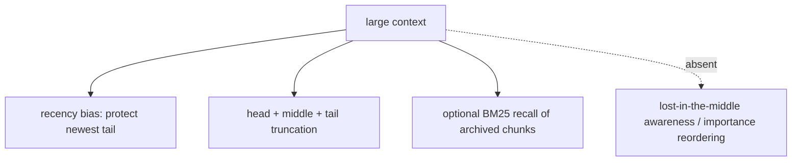

**Anchors:** &bull; `agent-core/openjiuwen/core/context_engine/processor/compressor/round_level_compressor.py:119` — `keep_recent_messages` &bull; `agent-core/openjiuwen/core/context_engine/processor/offloader/message_summary_offloader.py:697` — head/middle/tail &bull; `agent-core/openjiuwen/core/context_engine/processor/budget_guard.py:114` — `_build_head_tail()` &bull; `agent-core/openjiuwen/core/context_engine/processor/forked/compressor/recall/retriever.py:27` — BM25 recall

## 5. What's the difference between zero-shot, few-shot, and chain-of-thought prompting?

**General:** Zero-shot (instruction only) works for tasks seen in instruction tuning. Few-shot (worked examples) helps when format/label conventions are hard to specify. Chain-of-thought (step-by-step) helps multi-step reasoning, largely subsumed by native reasoning models. All cost tokens.

**Jiuwen:** The runtime agent is zero-shot (instruction-only `PromptSection`s + ReAct loop). Few-shot lives only in tuning tooling; CoT appears in auxiliary prompts and implicitly in compaction; reasoning-model output is preserved via `reasoning_content`.

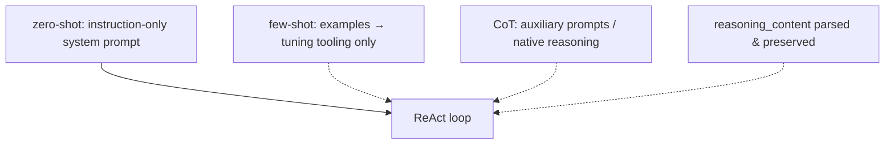

**Anchors:** &bull; `agent-core/openjiuwen/harness/prompts/sections/identity.py:11` — zero-shot identity &bull; `agent-core/openjiuwen/dev_tools/tune/optimizer/example_optimizer.py:109` — few-shot injection (tuning) &bull; `agent-core/openjiuwen/core/workflow/components/llm/questioner_comp.py:68` — explicit CoT &bull; `agent-core/openjiuwen/core/foundation/llm/model_clients/openai_model_client.py:347` — `reasoning_content`

---

# RAG

## 6. Walk me through a RAG pipeline end to end

**General:** Ingest: parse → chunk → embed → index. Query: embed the query → retrieve top-k (dense and/or sparse) → rerank → assemble context into the prompt → generate → optionally cite. Each stage is separable and can fail independently.

**Jiuwen:** `parse_files` → `chunk_documents` → `build_index` for ingest; `retrieve` → `vector_store.search` for query; `KnowledgeRetrievalComponent` concatenates results into `context`, and `LLMComponent` formats it into the prompt.

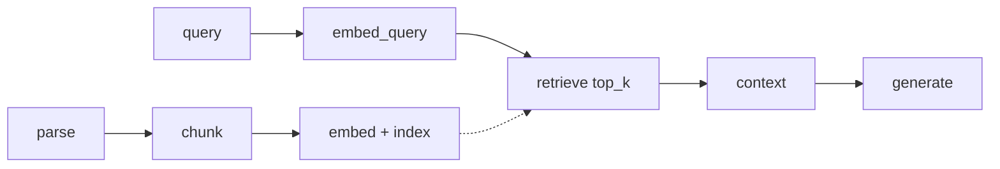

**Anchors:** &bull; `agent-core/openjiuwen/core/retrieval/simple_knowledge_base.py:96/110/182` &bull; `agent-core/openjiuwen/core/retrieval/retriever/vector_retriever.py:78` &bull; `agent-core/openjiuwen/core/workflow/components/resource/knowledge_retrieval_comp.py:109/243` &bull; `agent-core/openjiuwen/core/workflow/components/llm/llm_comp.py:654`

## 7. How do you choose chunk size when splitting documents for retrieval?

**General:** Trade context against precision: too small loses context and splits answers; too large dilutes the embedding and wastes tokens. Default a few hundred tokens with modest overlap, tune on a retrieval eval, and measure in tokens.

**Jiuwen:** `Chunker` defaults `chunk_size=512`/`chunk_overlap=50` with validation; token chunkers clamp to `model_max_length`; Milvus caps text at 65535 chars.

**Anchors:** &bull; `agent-core/openjiuwen/core/retrieval/indexing/processor/chunker/base.py:36/59` &bull; `agent-core/openjiuwen/core/retrieval/indexing/processor/chunker/text_splitter.py:43/207` &bull; `agent-core/openjiuwen/core/retrieval/common/config.py:34` &bull; `agent-core/openjiuwen/core/retrieval/indexing/indexer/milvus_indexer.py:378`

## 8. What's the difference between RAG and fine-tuning, and when would you use each?

**General:** RAG supplies knowledge at query time (cheap to update, citable, scales past the window) but cannot change behavior. Fine-tuning changes weights (behavior/format/tone, compresses prompts) but is expensive, slow, and cannot cite. Use RAG for knowledge, fine-tuning for behavior.

**Jiuwen:** Separate capabilities: `core/retrieval` (knowledge) vs `agent_evolving/agent_rl` (optional LoRA/SFT); the default alternative to fine-tuning is prompt optimization. No explicit decision doc.

**Anchors:** &bull; `agent-core/openjiuwen/core/retrieval/retriever/vector_retriever.py:78` &bull; `agent-core/openjiuwen/agent_evolving/agent_rl/online/backends/sft/trainer.py:44` &bull; `agent-core/openjiuwen/agent_evolving/optimizer/llm_call/instruction_optimizer.py:30`

## 9. How do you handle hallucinations when the retrieved context doesn't actually answer the question?

**General:** Detect insufficiency, then answer only from supported evidence: gate on retrieval score/answerability, allow "I don't know", and verify claims against the context. Without the gate, the model answers fluently from irrelevant context.

**Jiuwen:** `score_threshold` defaults to `None`; `AgenticRetriever` sufficiency only triggers another query, not abstention; a real abstain path exists only in the Symphony engine. Verification is a separate non-blocking layer.

**Anchors:** &bull; `agent-core/openjiuwen/core/retrieval/common/config.py:47` &bull; `agent-core/openjiuwen/core/retrieval/retriever/agentic_retriever.py:326` &bull; `agent-core/openjiuwen/symphony/retrieval/search/runtime/engine.py:94` &bull; `agent-core/openjiuwen/harness/subagents/verification_agent.py:51`

## 10. What is reranking, and why isn't vector similarity search alone enough?

**General:** Cosine similarity measures vector closeness, not answer relevance, and is not calibrated across queries/documents. A reranker scores each candidate jointly with the query (cross-encoder), improving precision@k. It cannot recover documents retrieval never returned.

**Jiuwen:** `Reranker` classes exist (cross-encoder + LLM-judge + DashScope) but are wired only into the graph store; the KB path returns rescaled similarity scores with no rerank.

**Anchors:** &bull; `agent-core/openjiuwen/core/foundation/store/base_reranker.py:37` &bull; `agent-core/openjiuwen/core/retrieval/reranker/standard_reranker.py:23` &bull; `agent-core/openjiuwen/core/foundation/store/graph/milvus/milvus_support.py:458` &bull; `agent-core/openjiuwen/core/retrieval/simple_knowledge_base.py:182` &bull; `agent-core/openjiuwen/core/retrieval/common/config.py:81`

---

# Agents and tool use

## 11. How does function calling actually work under the hood?

**General:** Tool definitions (name, description, JSON-Schema params) go in the request; the model returns structured `tool_calls`; the host validates arguments, invokes, and appends the result as a tool message. The model never runs code.

**Jiuwen:** Cards → JSON Schema via the schema extractor; the ability manager builds the tool list; clients convert to provider format; tool calls are parsed per provider, validated in `LocalFunction.invoke`, and dispatched.

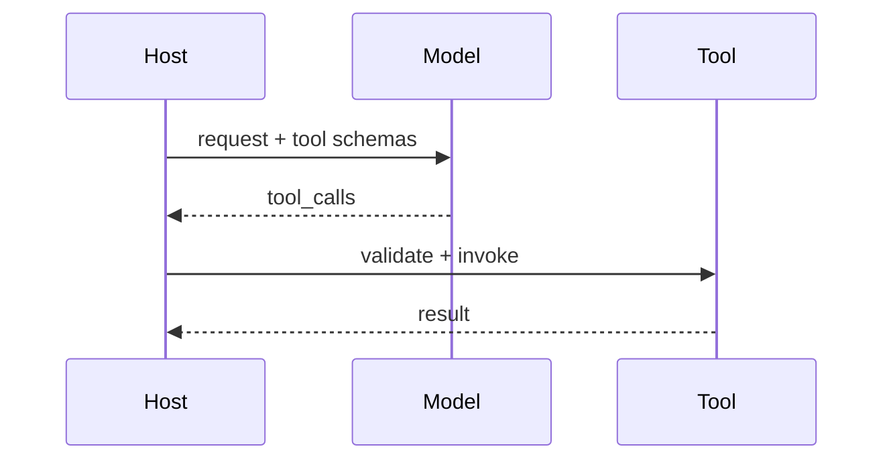

**Anchors:** &bull; `agent-core/openjiuwen/core/foundation/tool/utils/callable_schema_extractor.py:20` &bull; `agent-core/openjiuwen/core/single_agent/ability_manager.py:938/1032` &bull; `agent-core/openjiuwen/core/foundation/llm/model_clients/base_model_client.py:483` &bull; `agent-core/openjiuwen/core/foundation/tool/function/function.py:65`

## 12. How do you prevent an agent from getting stuck in an infinite tool-calling loop?

**General:** Cap iterations, detect repetition on canonicalized `(tool, args)`, nudge or abort on no progress, and cap rounds/tokens/time.

**Jiuwen:** `max_iterations` (ReAct 5, harness 15), `ModelAnomalyDetectionRail` (identical rounds → compact/abort), `ToolCallDeduplicationRail`, `NoProgressAnswerEvaluator`, and the hard 50-round ceiling.

**Anchors:** &bull; `agent-core/openjiuwen/core/single_agent/agents/react_agent.py:288`; `agent-core/openjiuwen/harness/schema/config.py:252` &bull; `agent-core/openjiuwen/harness/rails/model_anomaly_detection_rail.py:74/90` &bull; `jiuwenswarm/jiuwenswarm/agents/harness/common/rails/tool_dedup_rail.py:157` &bull; `agent-core/openjiuwen/harness/deep_agent.py:2692`

## 13. How do you handle a tool call that returns malformed or unexpected output?

**General:** Treat failures as data: catch, classify retryability, return a structured error the model can react to, and repair obviously broken payloads. Never crash the loop on one bad result.

**Jiuwen:** Bracket-balancing repair for bad JSON args, raw JSON surfaced if unrepairable, `ToolCallResilienceRail` retry classification with a `[Retry Summary]`, and non-idempotent tools never retried.

**Anchors:** &bull; `agent-core/openjiuwen/core/single_agent/ability_manager.py:482/537/1378` &bull; `agent-core/openjiuwen/harness/rails/tool_call_resilience_rail.py:169/198/222` &bull; `agent-core/openjiuwen/core/foundation/llm/output_parsers/json_output_parser.py:56`

## 14. What's the difference between a single-agent and multi-agent system, and when is multi-agent overkill?

**General:** Multi-agent is justified for separated context/ownership (parallel workstreams, distinct permission scopes, specialization). It is overkill when one agent with good tools and memory can do the job; coordination adds latency, cost, and failure modes.

**Jiuwen:** Teams/subagents are supported but not default; subagents get isolated sessions to avoid context pollution. A single well-designed agent is the baseline.

**Anchors:** &bull; `agent-core/openjiuwen/harness/tools/subagent/task_tool.py:194` &bull; `agent-core/openjiuwen/harness/subagent_runtime/control.py:169` &bull; `agent-core/openjiuwen/agent_teams/agent/team_agent.py:76` &bull; `jiuwenswarm/jiuwenswarm/agents/swarm/assembly.py:260`

---

# Evaluation

## 15. How do you evaluate an LLM application beyond "it looks correct"?

**General:** Combine automatic metrics (exact match, tests for code), an LLM-as-judge with a rubric, and human review on a sample; use a held-out set and track regressions; evaluate retrieval and generation separately.

**Jiuwen:** `agent_evolving` (`DefaultEvaluator`, `LLMAsJudgeMetric`, `ExactMatchMetric`), RSI weighted-rubric judge, and `symphony/evaluation` + `evaluator_pipeline` (pass-rate/convergence).

**Anchors:** &bull; `agent-core/openjiuwen/agent_evolving/evaluator/evaluator.py:82/197` &bull; `agent-core/openjiuwen/agent_evolving/evaluator/metrics/llm_as_judge.py:47` &bull; `agent-core/openjiuwen/rsi/harness_rsi/evaluator/judger/scoring.py:193` &bull; `agent-core/openjiuwen/symphony/evaluation/evaluators.py:671` &bull; `agent-core/openjiuwen/agent_evolving/evaluator/evaluator_pipeline/pipeline.py:167`

## 16. What's the difference between faithfulness and relevance in RAG evaluation?

**General:** Relevance = retrieved passages are on-topic (context precision/recall). Faithfulness = the answer's claims are supported by the retrieved context. They fail independently; measuring both localizes the fault.

**Jiuwen:** Neither metric exists; no judge receives the retrieved context. Closest: `AccuracyEvaluator` correctness, reviewer `Correctness`, and the RSI generic rubric.

**Anchors:** &bull; `agent-core/openjiuwen/symphony/evaluation/evaluators.py:438` &bull; `agent-core/openjiuwen/agent_evolving/evaluator/metrics/llm_as_judge.py:58` &bull; `agent-core/openjiuwen/rsi/harness_rsi/evaluator/judger/scoring.py:68` &bull; `agent-core/openjiuwen/agent_teams/verification/reviewer.py:43`

## 17. How would you build a regression test suite for a prompt-based system?

**General:** Keep a fixed, versioned eval suite and run it on every change to prompts/chunking/models; store a baseline and fail the build on a metric drop; add golden/snapshot tests.

**Jiuwen:** CI gate runs only `lint`/`type-check`; `level0`/`level1` markers are declared but not invoked; offline `Trainer` best-score and `evaluator_pipeline` pass-rate are benchmark loops, not a fixed suite.

**Anchors:** &bull; `agent-core/openjiuwen/auto_harness/resources/ci_gate.yaml:21` &bull; `agent-core/pyproject.toml:236` &bull; `agent-core/openjiuwen/agent_evolving/trainer/trainer.py:217` &bull; `agent-core/openjiuwen/agent_evolving/evaluator/evaluator_pipeline/pipeline.py:314`

---

# Production and cost

## 18. How do you control cost in a system where an agent can call tools repeatedly?

**General:** Bound the loop (iterations/rounds/time), cap tokens per request/session, cache, use cheap models for cheap work, and surface per-run cost. Retries and large tool outputs are hidden costs.

**Jiuwen:** Provider-reported session cost with an enforced cap, ReAct `max_iterations`, team `BudgetLedger`, and anomaly/dedup rails. No cost-aware model downgrade.

**Anchors:** &bull; `jiuwenswarm/jiuwenswarm/server/runtime/usage_cost.py:171/196` &bull; `agent-core/openjiuwen/core/single_agent/agents/react_agent.py:288` &bull; `agent-core/openjiuwen/agent_teams/workflow/engine/budget.py:27` &bull; `agent-core/openjiuwen/harness/rails/model_anomaly_detection_rail.py:74/90`

## 19. How do you reduce latency in a multi-step LLM pipeline?

**General:** Stream tokens (perceived latency is TTFT), parallelize independent steps, cache prompts/embeddings, route easy steps to faster models, and avoid blocking the event loop. Measure TTFT and per-stage latency.

**Jiuwen:** Streaming with `ttft_ms`, parallel tool execution with resource lanes, KV/prefix cache affinity, model failover; no latency-based routing or result cache.

**Anchors:** &bull; `agent-core/openjiuwen/core/single_agent/agents/react_agent.py:2938/1758` &bull; `agent-core/openjiuwen/core/single_agent/ability_manager.py:431` &bull; `agent-core/openjiuwen/core/kv_cache/kv_cache_runtime.py:32` &bull; `agent-core/openjiuwen/core/foundation/llm/model_clients/intelli_router_model_client.py:32`

## 20. How do you version prompts the same way you'd version code?

**General:** Treat prompts as versioned artifacts: store them in source control or a prompt store, give each version an immutable ID/hash, track diffs, and allow activate/rollback. Ties a version to the model/params it was tested with.

**Jiuwen:** Prompts are assembled from named `PromptSection`s (name/priority/category only, no version/hash), optimization overwrites them in place, and checkpoints store operator state for resume. Real versioning/rollback exists only at the RSI **harness-package** level, not per prompt.

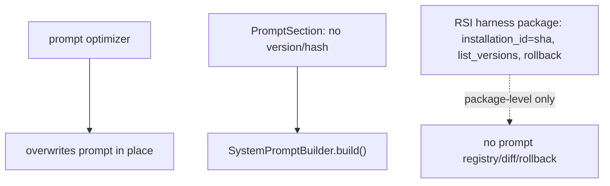

**Anchors:** &bull; `agent-core/openjiuwen/core/single_agent/prompts/builder.py:24/97/219` &bull; `agent-core/openjiuwen/harness/prompts/report.py:38` &bull; `agent-core/openjiuwen/harness/manifest/models.py:43` &bull; `agent-core/openjiuwen/agent_evolving/checkpointing/manager.py:43` &bull; `jiuwenswarm/jiuwenswarm/agents/harness/common/rsi/harness_activation.py:587/617` &bull; `jiuwenswarm/jiuwenswarm/server/rsi/rsi_handlers.py:218`

## 21. What's your rollback plan if a prompt or model update degrades output quality?

**General:** Make every change reversible and observable: version the prompt/model, ship behind a flag or canary, define a one-command rollback, and gate broad rollout on a fixed eval. Monitor quality (not just errors) so you detect the degradation, and keep the previous version warm.

**Jiuwen:** Rollback exists for whole RSI **harness packages**: `rollback(installation_id)` refuses while tasks are active, validates the target hash, hot-reloads the prior version, and compensates if the pointer write fails — exposed over the WebSocket protocol. Behavior is gated by `enable_*` flags and a human `accept`/`reject` activation step. But there is **no prompt-level rollback** and no eval-threshold release gate, so a bad prompt change is only reversible if it was packaged as a harness version.

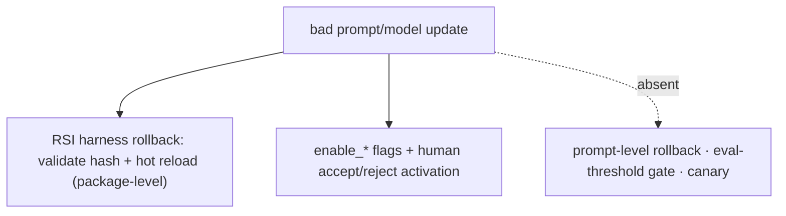

**Anchors:** &bull; `jiuwenswarm/jiuwenswarm/agents/harness/common/rsi/harness_activation.py:617` — `rollback`; `:682` `_assert_rollback_allowed`; `:694` validate target hash &bull; `jiuwenswarm/jiuwenswarm/server/rsi/rsi_handlers.py:218/224` — versions list + rollback RPC &bull; `agent-core/openjiuwen/harness/schema/deep_agent_spec.py:448` — `enable_*` flags &bull; `agent-core/openjiuwen/auto_harness/stages/activate.py:99` — explicit `accept`/`reject` &bull; `agent-core/openjiuwen/auto_harness/resources/ci_gate.yaml:21` — no eval gate

---

# Security

## 22. What is prompt injection, and how would you defend against it?

**General:** Prompt injection is untrusted input (user text, retrieved content, tool output) carrying instructions that hijack the model. Defend by treating content as data not instructions, delimiting/labeling untrusted content, enforcing controls outside the model (tool policy, sandbox, egress), and re-checking permissions before privileged actions. Prompt warnings are not a control.

**Jiuwen:** Enforcement is in the shell/permission layer (substitution blocking, tree-sitter AST ASK floor, builtin deny rules); `SafetyPromptRail` is advisory; the injection-detector guardrail is unregistered in production; the auto-harness heuristic aborts on suspicious patterns but only in that mode.

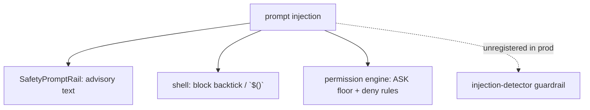

**Anchors:** &bull; `agent-core/openjiuwen/harness/rails/security/prompt_security_rail.py:16/38` &bull; `agent-core/openjiuwen/harness/tools/shell/bash/_security.py:40` &bull; `agent-core/openjiuwen/harness/security/permission_engine/toolguard/tool_policy.py:409`; `agent-core/openjiuwen/harness/security/permission_engine/core.py:272` &bull; `agent-core/openjiuwen/core/security/guardrail/builtin.py:60`

## 23. How do you handle untrusted content coming from a tool result or retrieved document?

**General:** Treat it as untrusted data, never instructions: delimit and label it, strip control/escape sequences, and never let it silently trigger privileged actions without re-checking permissions. This is the same threat as prompt injection, arriving through the retrieval/tool path.

**Jiuwen:** Weakest area. Tool results are plain `ToolMessage` with no untrusted-data framing; `sanitize.py` helpers have no production callers; the only defenses are prompt-level (an auto-harness heuristic and an untrusted-data instruction in one summarization pipeline). There is no mandatory untrusted-tool-result seam.

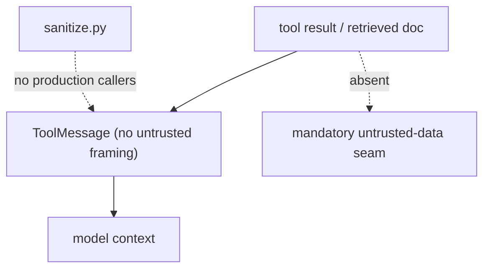

**Anchors:** &bull; `agent-core/openjiuwen/core/single_agent/ability_manager.py:1612` — `ToolMessage` with no wrapper &bull; `agent-core/openjiuwen/harness/prompts/sanitize.py:20` — no production callers &bull; `agent-core/openjiuwen/rsi/harness_rsi/auto_harness/rails/security_rail.py:119` — input heuristic &bull; `agent-core/openjiuwen/harness/personal_context/context_pipeline.py:9237` — prompt-level untrusted-data instruction

---

## Summary: strong vs weak in Jiuwen

| Area | Strength | Notes |
|---|---|---|
| Tokens vs embeddings | Strong | token counters + pluggable embedders |
| Temperature / top-p | Mixed | passthrough + local math; top-k sampling absent |
| Context overflow | Strong | budget + offload + multi-stage compaction + recovery |
| Long-context degradation | Mixed | recency bias + head/middle/tail; no lost-in-the-middle logic |
| Prompting (zero/few/CoT) | Mixed | runtime zero-shot; few-shot only in tuning tooling |
| RAG pipeline | Mixed | real components; no packaged RAG agent |
| Chunk size | Strong | validation + tokenizer clamps |
| RAG vs fine-tuning | Weak | capabilities present; no decision doc |
| Grounding when context is insufficient | Weak | no answerability gate/abstention in KB path |
| Reranking | Weak | cross-encoder exists but not wired into KB |
| Function calling | Strong | schema-driven, validated, multi-provider |
| Loop prevention | Strong | iteration caps + anomaly/dedup rails |
| Malformed tool output | Strong | JSON repair + structured error + retry |
| Single vs multi-agent | Strong | teams/subagents isolated; not default |
| Output evaluation | Strong | exact-match + LLM-judge + RSI rubric + benchmark |
| Faithfulness vs relevance | Weak | absent; judges lack context |
| Regression suite | Weak | CI gate is lint/type-check only |
| Cost control | Mixed | enforced session cap; no cost-aware routing |
| Latency | Strong | streaming + TTFT + parallel tools + KV cache |
| Prompt versioning | Weak | no prompt registry/rollback; package-level RSI only |
| Rollback plan | Mixed | RSI package rollback; no prompt-level rollback or eval gate |
| Prompt injection | Mixed | enforced shell/permission layer; detector unregistered |
| Untrusted tool/retrieved content | Weak | no untrusted-data seam; sanitizer unused |
