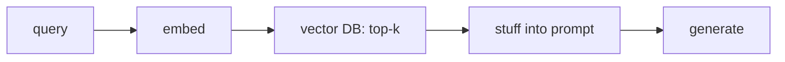
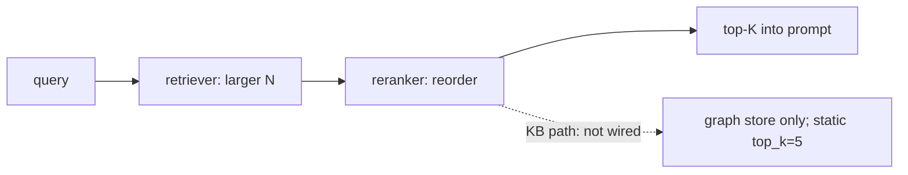
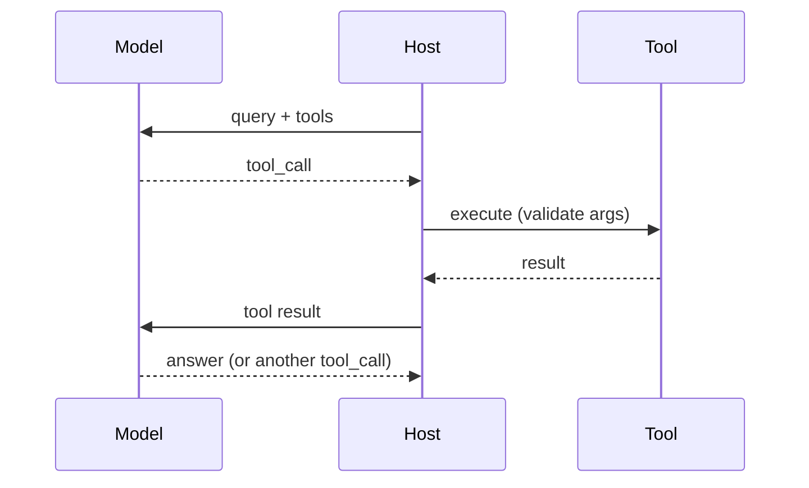
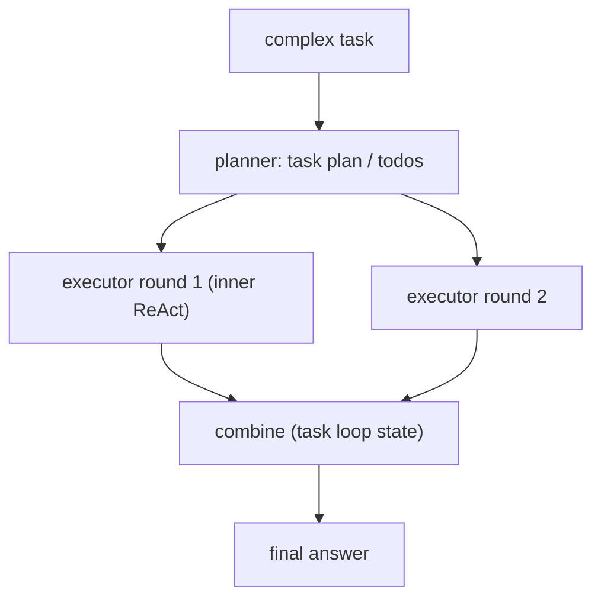
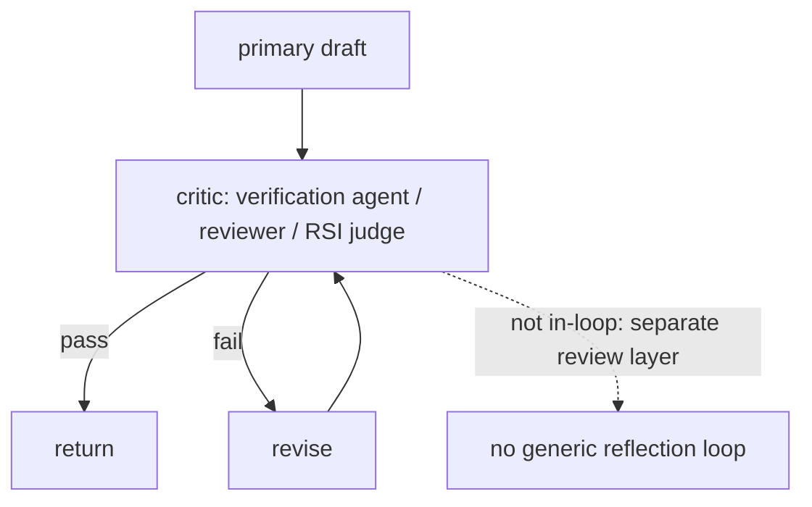
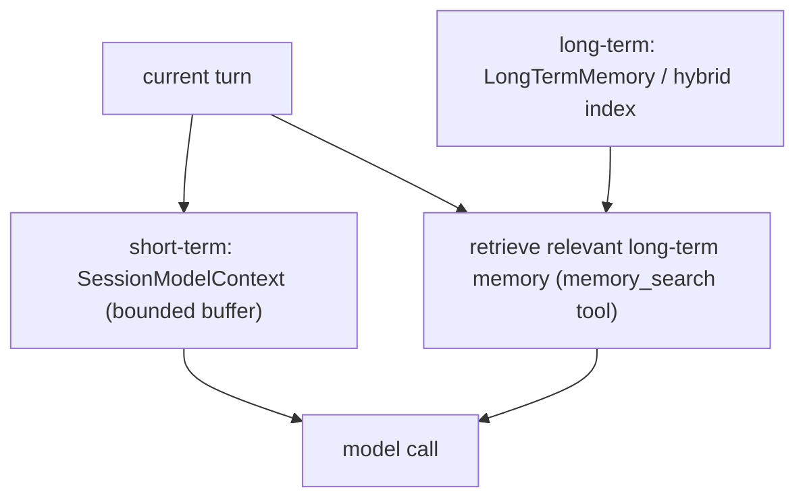
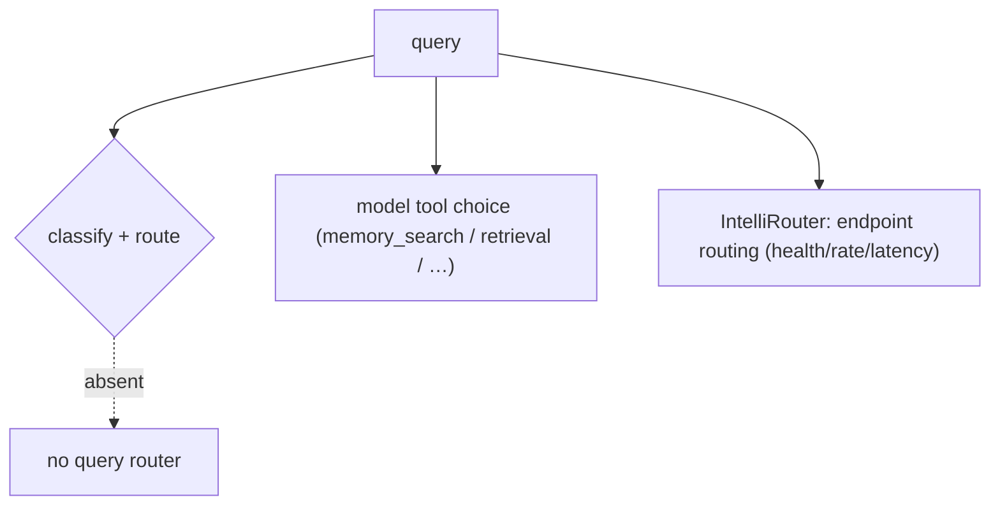

# LLM architecture patterns — how each is built + how Jiuwen maps

Based on the recurring list *Architecture Patterns I've Seen Repeatedly in LLM Projects*. Each of the seven patterns is described, then mapped to what this codebase actually provides (mechanism + anchors), including the gaps a real implementation would have to fill.

See [README](README.md) for the shared conventions (anchor format, repo layers).

---

## 1. Simple RAG pipeline

**Pattern:** the most common starting point. Query is embedded → a vector database returns top-k similar documents → documents are stuffed into a prompt → the LLM generates the answer.

**Used for:** FAQ bots, internal document search, basic knowledge assistants.

**Jiuwen:** Implemented end to end as composable pieces rather than a packaged app: ingest via `parse_files` → `chunk_documents` → `build_index`; query via `retrieve` → `vector_store.search`; the workflow `KnowledgeRetrievalComponent` concatenates results into a `context` string and `LLMComponent` formats it into the prompt. Gap: no single "simple RAG" agent, and retrieved context is inserted with no token budgeting.

**Anchors:** &bull; `agent-core/openjiuwen/core/retrieval/simple_knowledge_base.py:96/110/182` — ingest + retrieve &bull; `agent-core/openjiuwen/core/retrieval/retriever/vector_retriever.py:78` — embed query → search &bull; `agent-core/openjiuwen/core/workflow/components/resource/knowledge_retrieval_comp.py:109/243` — context assembly &bull; `agent-core/openjiuwen/core/workflow/components/llm/llm_comp.py:654` — prompt template

## 2. Modular RAG with reranking

**Pattern:** the upgrade once simple RAG returns irrelevant context. A retriever pulls a larger candidate set, a reranker reorders by actual relevance to the query, and only the top results enter the prompt.

**Used for:** legal, medical, or research tools where retrieval accuracy affects trust.

**Jiuwen:** The reranker modules exist (`StandardReranker` cross-encoder, `ChatReranker` LLM-judge, `DashscopeReranker`) but are **not wired into the KB path** — only the graph store calls `rerank`, and `top_k` is static. So "retrieve N, rerank to K" is not available out of the box; the retrievers also drop metadata `filters`.

**Anchors:** &bull; `agent-core/openjiuwen/core/foundation/store/base_reranker.py:37/41` — `Reranker` ABC &bull; `agent-core/openjiuwen/core/retrieval/reranker/standard_reranker.py:23` — `StandardReranker` (`/rerank`) &bull; `agent-core/openjiuwen/core/foundation/store/graph/milvus/milvus_support.py:458` — reranker applied only in graph store &bull; `agent-core/openjiuwen/core/retrieval/simple_knowledge_base.py:182` — KB path calls no reranker &bull; `agent-core/openjiuwen/core/retrieval/common/config.py:46` — `top_k: int = 5`

## 3. Agentic tool-calling pattern

**Pattern:** the model decides when to call external functions. It receives the query and a tool list, emits a structured tool call instead of an answer, the tool executes and the result is fed back, and the model either calls another tool or returns a final answer.

**Used for:** data lookups, sending emails, querying a database, checking live information.

**Jiuwen:** This is the ReAct loop plus the ability manager. Cards become JSON Schema via the callable schema extractor, the ability manager builds the model-facing tool list and dispatches parsed `tool_calls`, and `LocalFunction.invoke` validates arguments.

**Anchors:** &bull; `agent-core/openjiuwen/core/single_agent/agents/react_agent.py:2740/2793/2813` — loop / answer / execute &bull; `agent-core/openjiuwen/core/single_agent/ability_manager.py:938/1078/1032` — tool list + dispatch &bull; `agent-core/openjiuwen/core/foundation/tool/utils/callable_schema_extractor.py:20` — card → JSON Schema &bull; `agent-core/openjiuwen/core/foundation/tool/function/function.py:65` — argument validation

## 4. Planner–executor pattern

**Pattern:** a planner breaks a complex request into subtasks; one or more executors carry each out; results are combined into a final response. Common in multi-step agent systems.

**Used for:** research assistants, report generation, multi-source data analysis.

**Jiuwen:** Two paths. `DeepAgent`'s outer task loop runs a full inner ReAct invoke per round while a persistent `TaskPlan`/todos carry state; `TaskPlanningRail` registers the todo tools and injects planning guidance (`Plan` mode adds a `task_tool` to delegate). `agent_teams` adds supervisor/leader decomposition, and a dedicated plan subagent exists.

**Anchors:** &bull; `agent-core/openjiuwen/harness/deep_agent.py:2694` — outer task loop &bull; `agent-core/openjiuwen/harness/rails/task_planning_rail.py:31/108` — planning layer + todo tools &bull; `agent-core/openjiuwen/harness/tools/todo.py:184` — `TodoCreateTool` &bull; `agent-core/openjiuwen/harness/tools/subagent/task_tool.py:194/657` — subagent delegation &bull; `agent-core/openjiuwen/core/multi_agent/teams/hierarchical_tools/hierarchical_team.py:101/108` — supervisor (agents-as-tools); `agent-core/openjiuwen/harness/subagents/plan_agent.py:88` — plan subagent

## 5. Critic or reflection loop

**Pattern:** a self-check before returning. The primary agent drafts; a critic reviews it against the request or rules; if it fails, the primary revises. Adds a verification step for high-stakes output.

**Used for:** financial summaries, compliance checks, high-stakes outputs where a wrong answer is costly.

**Jiuwen:** There is no generic draft→critique→revise loop in the single-agent ReAct path, but the pieces exist: a **verification agent** restricted to read-only tools that must show verbatim evidence and emit PASS/FAIL/PARTIAL; an `agent_teams` reviewer that scores `Correctness`/completeness with rework thresholds; and the RSI weighted-rubric judge. These run as separate review layers, not as an in-loop reflection that blocks generation.

**Anchors:** &bull; `agent-core/openjiuwen/harness/rails/subagent/verification_rail.py:92` — `VerificationRail` allowlist; `agent-core/openjiuwen/harness/subagents/verification_agent.py:51` — PASS/FAIL/PARTIAL &bull; `agent-core/openjiuwen/agent_teams/verification/reviewer.py:26/43/279` — review dimensions + rework thresholds &bull; `agent-core/openjiuwen/rsi/harness_rsi/evaluator/judger/scoring.py:193` — weighted rubric judge

## 6. Memory-augmented agent

**Pattern:** context across sessions, not just one conversation. Short-term memory is the active context window; long-term memory is a vector store/DB of past interactions; retrieval decides what long-term memory is relevant to the current turn.

**Used for:** personal assistants, customer support.

**Jiuwen:** Short-term is `SessionModelContext` with a bounded `ContextMessageBuffer`; long-term is `LongTermMemory` with a typed taxonomy, and the product adds a SQLite/FTS5 hybrid index over markdown memory files. Retrieval-into-turn is a tool the model calls (`memory_search`), and `MemoryRail` suppresses it when daily memory is auto-loaded.

**Anchors:** &bull; `agent-core/openjiuwen/core/context_engine/context/context.py:64` — `SessionModelContext`; `agent-core/openjiuwen/core/context_engine/context/message_buffer.py:11` — `ContextMessageBuffer` &bull; `agent-core/openjiuwen/core/memory/long_term_memory.py:69` — `LongTermMemory` &bull; `jiuwenswarm/jiuwenswarm/agents/harness/common/memory/manager.py:183/805` — product hybrid index &bull; `jiuwenswarm/jiuwenswarm/agents/harness/common/tools/memory_tools.py:167` — `memory_search`; `agent-core/openjiuwen/harness/prompts/sections/memory.py:14` — when to call

## 7. Router pattern

**Pattern:** one entry point decides which subsystem handles the request. The query is classified and routed to a specialized agent/tool (SQL agent, search agent, summarization agent), so one generic prompt does not handle everything poorly.

**Used for:** mixed workloads where one prompt can't cover all request types.

**Jiuwen:** There is **no query-classification router**. Routing that exists is model tool choice (the model picks `memory_search` / retrieval / other tools), and `IntelliRouter` is model-**endpoint** routing (health/rate/latency), not query routing. `AgenticRetriever` derives its mode from `index_type`, not from the query.

**Anchors:** &bull; `jiuwenswarm/jiuwenswarm/agents/harness/common/tools/memory_tools.py:167` — tool the model chooses &bull; `agent-core/openjiuwen/agent_teams/models/allocator.py:559` — `build_model_allocator` (endpoint strategies) &bull; `agent-core/openjiuwen/core/foundation/llm/model_clients/intelli_router_model_client.py:32` — `ReliableRouter` &bull; `agent-core/openjiuwen/core/retrieval/retriever/agentic_retriever.py:155` — mode from `index_type`, not the query

---

## Summary: pattern → Jiuwen status

| Pattern | Jiuwen status | Notes |
|---|---|---|
| 1. Simple RAG | Present (composable) | ingest/retrieve/prompt pieces; no packaged app, no context budgeting |
| 2. Modular RAG + rerank | Partial | reranker exists but not wired into KB; static `top_k`; filters dropped |
| 3. Agentic tool-calling | Strong | ReAct loop + ability manager + schema validation |
| 4. Planner–executor | Strong | DeepAgent task loop + TaskPlanningRail/todos + subagents + teams |
| 5. Critic / reflection | Partial | verification agent + reviewer + RSI judge, but no in-loop reflection |
| 6. Memory-augmented agent | Strong | SessionModelContext + LongTermMemory + product hybrid index + memory tool |
| 7. Router | Weak | no query router; only model tool choice + endpoint routing |
