# LLM interview questions — general answers + how Jiuwen does it

Based on the recurring list *LLM Interview Questions* seen across HackerRank threads, Glassdoor, Blind, and LinkedIn prep posts (Architecture Fundamentals; Tokens and Sampling; Context and Memory; Prompting; Fine-Tuning; Model Behavior; Evaluation and Comparison). Each section heading is the original question.

The central caveat for this set: Jiuwen is an **agent framework that calls hosted LLMs**, so most model-internals questions (attention, positional encoding, encoder/decoder taxonomies, training cutoffs, perplexity) are not implemented here and the general answer carries the weight. The parts answerable from code are the generation/sampling path (a local HuggingFace/vLLM implementation under `agent-core/openjiuwen/symphony/retrieval/llm/`), a real weight-training subsystem under `agent-core/openjiuwen/agent_evolving/agent_rl/` (SFT + PPO/GRPO via veRL, LoRA/PEFT), the context engine and token counters, the prompt builders, the structured-output tooling, and the evaluation metrics. See [README](README.md) for the shared conventions (answer shape, anchor format, repo layers).

> **The pattern worth noticing:** the wording changes across platforms, but it's the same handful of concerns repeating — how the model generates text, how you control that generation, and how you know when it's wrong. Fluency in those three areas covers most versions of this question you'll ever get asked.

---

# Architecture fundamentals

## 1. Explain how self-attention works in a transformer

**General:** Each token is projected into three vectors — query, key, value. The query of a token is dot-producted with the keys of all tokens (scaled by `1/√d_k`), softmaxed into attention weights, and used to take a weighted sum of the values. Doing this with multiple heads in parallel and stacking layers lets each token aggregate information from every other token, with the weights computed from content rather than position. The result is a context-dependent representation per token.

**Jiuwen:** Not implemented — attention is delegated entirely to provider APIs or to HuggingFace models loaded by name. There is no Q/K/V projection, scaled dot-product, or multi-head code anywhere; the only `torch.softmax` in the framework is used for token sampling, not attention. The framework's boundary is the model-client/config layer, which serializes request params and sends them to a provider; the local `transformers` client calls `AutoModelForCausalLM` and consumes logits.

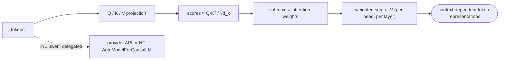
```mermaid
flowchart LR
    TOK["tokens"] --> PROJ["Q / K / V projection"]
    PROJ --> SCORE["scores = Q·Kᵀ / √d_k"]
    SCORE --> SM["softmax → attention weights"]
    SM --> OUT["weighted sum of V (per head, per layer)"]
    OUT --> CTX(["context-dependent token representations"])
    TOK -.->|"in Jiuwen: delegated"| API["provider API or HF AutoModelForCausalLM"]
```

**Anchors:** &bull; `agent-core/openjiuwen/core/foundation/llm/schema/config.py:13` — `ProviderType` enum: the model-client provider boundary, no architecture logic &bull; `agent-core/openjiuwen/core/foundation/llm/model_clients/openai_model_client.py:865` — builds hosted request params, delegates computation &bull; `agent-core/openjiuwen/symphony/retrieval/llm/transformers_logit_selection/client.py:227` — `torch.no_grad()` forward; logit extraction only, no attention code &bull; `agent-core/openjiuwen/symphony/retrieval/llm/transformers_prefix_cached_generation/client.py:175` — `AutoModelForCausalLM.from_pretrained(...)`; attention delegated &bull; `agent-core/openjiuwen/symphony/retrieval/llm/transformers_prefix_cached_generation/generation.py:527` — `torch.softmax(...)` is sampling, not attention

**Gap.** Absent. The closest abstractions are `ModelClientConfig`/`ModelRequestConfig` (provider boundary) and the HF `AutoModelForCausalLM` load.

## 2. What's the difference between an encoder-only, decoder-only, and encoder-decoder model, and where does GPT fit

**General:** Encoder-only models (BERT) read bidirectional context and produce representations — good for classification, embedding, extraction. Decoder-only models (GPT) are autoregressive: they predict the next token attending only leftward, which makes them generators. Encoder-decoder models (T5, original Transformer) encode an input and generate an output, suited to translation/summarization. GPT is decoder-only.

**Jiuwen:** There is no architecture-type configuration, no `is_encoder_decoder`/`is_decoder` flag, and no encoder/decoder classification. Behavior is selected by **provider type** and **model-name string** (family patterns are used only to choose reasoning/thinking wire protocols). The two HuggingFace classes named in the repo imply the intent: causal generation uses `AutoModelForCausalLM` (decoder-only), and guardrail classification uses `AutoModelForSequenceClassification` (typically an encoder-style classifier). GPT is handled purely as a provider/model name.

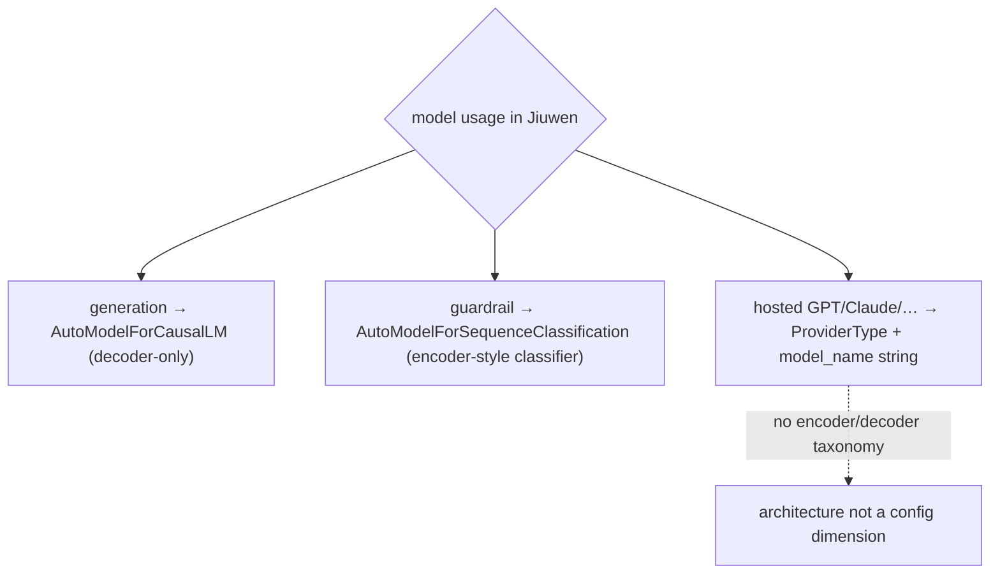
```mermaid
flowchart TD
    M{"model usage in Jiuwen"} --> GEN["generation → AutoModelForCausalLM (decoder-only)"]
    M --> CLS["guardrail → AutoModelForSequenceClassification (encoder-style classifier)"]
    M --> API["hosted GPT/Claude/… → ProviderType + model_name string"]
    API -.->|"no encoder/decoder taxonomy"| X["architecture not a config dimension"]
```

**Anchors:** &bull; `agent-core/openjiuwen/core/foundation/llm/schema/config.py:13` — `ProviderType`; architecture is not a config dimension &bull; `agent-core/openjiuwen/core/foundation/llm/reasoning_profiles.py:100` — model-family patterns classify reasoning protocol only &bull; `agent-core/openjiuwen/core/security/guardrail/backends.py:445` — `AutoModelForSequenceClassification` &bull; `agent-core/openjiuwen/core/security/guardrail/builtin.py:174` — `model_type` limited to `None | "bert" | "qwen"` &bull; `agent-core/openjiuwen/symphony/retrieval/llm/transformers_prefix_cached_generation/client.py:175` — `AutoModelForCausalLM` (decoder-only) &bull; `agent-core/openjiuwen/symphony/retrieval/search/service/serving.py:35` — vLLM `architectures` string

## 3. What is positional encoding, and why do transformers need it if attention has no inherent sense of order

**General:** Self-attention is permutation-invariant — it treats the input as a set, so "dog bites man" and "man bites dog" would be identical. Positional encoding injects order information by adding (or rotating, with RoPE) a position-dependent signal to the token representations, so the attention scores can depend on relative or absolute position. Without it the model cannot know sequence order.

**Jiuwen:** No positional-encoding implementation exists — no sinusoidal, learned, or RoPE code. The only positional-adjacent items are passthrough configuration: `attn_implementation` forwarded to HuggingFace and `rope_scaling_type`/`rope_scaling_factor` forwarded as vLLM engine args. In the RL data pipeline, `position_ids` are computed for padded training batches, which is batching metadata rather than an encoding scheme.

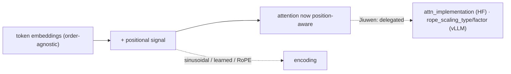
```mermaid
flowchart LR
    T["token embeddings (order-agnostic)"] --> ADD["+ positional signal"]
    ADD --> ATT["attention now position-aware"]
    ADD -.->|"sinusoidal / learned / RoPE"| PE["encoding"]
    ATT -.->|"Jiuwen: delegated"| CFG["attn_implementation (HF) · rope_scaling_type/factor (vLLM)"]
```

**Anchors:** &bull; `agent-core/openjiuwen/symphony/retrieval/llm/config.py:88` — `attn_implementation: str = ""` (HF passthrough) &bull; `agent-core/openjiuwen/symphony/retrieval/llm/transformers_prefix_cached_generation/client.py:171` — `model_kwargs["attn_implementation"]` &bull; `agent-core/openjiuwen/symphony/retrieval/search/service/serving.py:42` — `rope_scaling_type` / `rope_scaling_factor` vLLM defaults &bull; `agent-core/openjiuwen/symphony/retrieval/llm/vllm/client.py:584` — rope scaling passed through &bull; `agent-core/openjiuwen/agent_evolving/agent_rl/offline/coordinator/batch_builder.py:175` — `position_ids` from `cumsum(attention_mask)` (padding metadata)

**Gap.** Absent. Closest = passthrough config (`attn_implementation`, `rope_scaling_*`).

## 4. What's the difference between pretraining and fine-tuning

**General:** Pretraining learns general language structure from a huge unlabeled corpus with a self-supervised objective (next-token or masked-token); it is expensive and done once per base model. Fine-tuning adapts a pretrained model to a task/domain/behavior on a much smaller labeled or demonstration dataset, updating some or all weights. Instruction tuning is a specific kind of fine-tuning on instruction→response pairs.

**Jiuwen:** Two distinct things live here. The default "evolution" path does **not** train weights: `agent_evolving.Trainer` runs evaluate → LLM-generated update → validate → checkpoint and writes back **operators/parameters** (system/user prompts, configs) via `Operator.set_parameter` using "textual gradients" — prompt optimization, not gradient descent. `rsi/` and `auto_harness` evolve harness code/prompt sections. Separately, the optional `agent_evolving/agent_rl/` subsystem genuinely trains weights with veRL (PPO actor/critic updates, SFT) and exports **LoRA/PEFT adapters**. There is no from-scratch pretraining.

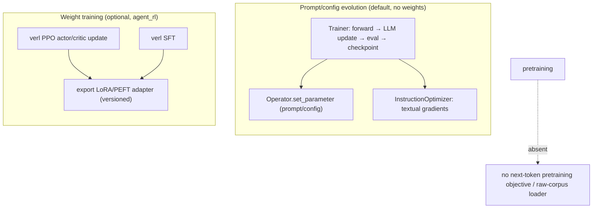
```mermaid
flowchart TD
    subgraph P1["Prompt/config evolution (default, no weights)"]
    direction TB
    T["Trainer: forward → LLM update → eval → checkpoint"] --> OP["Operator.set_parameter (prompt/config)"]
    T --> IO["InstructionOptimizer: textual gradients"]
    end
    subgraph P2["Weight training (optional, agent_rl)"]
    direction TB
    PPO["verl PPO actor/critic update"] --> LORA["export LoRA/PEFT adapter (versioned)"]
    SFT["verl SFT"] --> LORA
    end
    BASE["pretraining"] -.->|"absent"| X["no next-token pretraining objective / raw-corpus loader"]
```

**Anchors:** &bull; `agent-core/openjiuwen/agent_evolving/trainer/trainer.py:145` — `train()` loop; `:356` `op.set_parameter(target, value)` &bull; `agent-core/openjiuwen/agent_evolving/optimizer/llm_call/instruction_optimizer.py:30` — prompt rewrite via textual gradients &bull; `agent-core/openjiuwen/rsi/__init__.py:2` — recursive self-improvement over harness/prompt/code &bull; `agent-core/openjiuwen/agent_evolving/agent_rl/rl_trainer/ppo_step.py:146` — `update_actor` / `:145` `update_critic` (real PPO) &bull; `agent-core/openjiuwen/agent_evolving/agent_rl/online/backends/sft/trainer.py:211` — async SFT producing a LoRA &bull; `agent-core/openjiuwen/agent_evolving/agent_rl/optimizer/task_runner.py:438` — `export_lora(...)`; `:489` `_convert_fsdp_to_peft(...)` &bull; `agent-core/openjiuwen/agent_evolving/agent_rl/storage/lora_repo.py:51` — versioned adapter store

**Gap.** Pretraining and full fine-tuning are absent. Weight training is confined to the optional RL subsystem (`agent_rl`, requires veRL/Ray/GPU, lazily imported).

---

# Tokens and sampling

## 5. What's the difference between a token and a word, and why does tokenization affect cost and context limits

**General:** A token is the model's atomic unit — typically a sub-word produced by a BPE/unigram vocabulary, so one word may be one or several tokens, and rare/long words and code fragment heavily. Cost and context limits are measured in tokens, not words, so a language or domain that fragments more costs more per word and fills the window faster. Tokenization also explains why models miscount letters and struggle with character-level tasks.

**Jiuwen:** The framework counts **tokens**, never words, via a pluggable `TokenCounter`. `TiktokenCounter` maps known model names to tiktoken encodings, falls back to `cl100k_base` for unknown models (marked `tiktoken_fallback`), and finally to a `len(text)//3` heuristic if tiktoken is unavailable. A separate `TiktokenModelCounter` loads a model-native BPE vocabulary, and `TokenizerManager` downloads HuggingFace/tiktoken artifacts per model/family. Token counts drive per-model context limits (`MODEL_DEFAULT_CONTEXT_WINDOW_TOKENS`, default 200,000), compression/offload thresholds, and cost via provider-reported `usage_metadata` (`input_tokens`/`output_tokens`/cache/reasoning tokens). Retrieval chunking is also token-based.

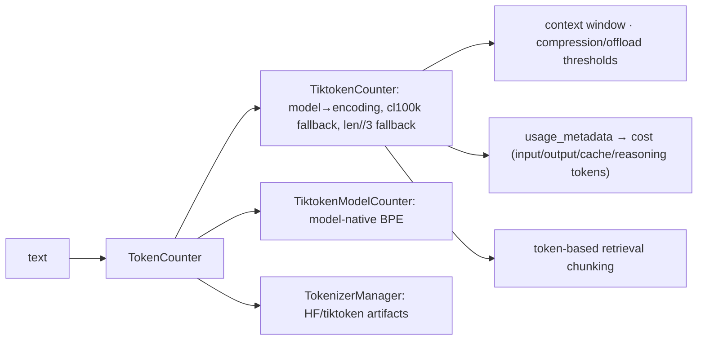
```mermaid
flowchart LR
    TEXT["text"] --> TC["TokenCounter"]
    TC --> TK["TiktokenCounter: model→encoding, cl100k fallback, len//3 fallback"]
    TC --> TM["TiktokenModelCounter: model-native BPE"]
    TC --> TOK["TokenizerManager: HF/tiktoken artifacts"]
    TK --> BUD["context window · compression/offload thresholds"]
    TK --> COST["usage_metadata → cost (input/output/cache/reasoning tokens)"]
    TK --> CHUNK["token-based retrieval chunking"]
```

**Anchors:** &bull; `agent-core/openjiuwen/core/context_engine/token/tiktoken_counter.py:212` — `TiktokenCounter`; `:225` model→encoding map; `:287` `count()` with `len(text)//3` fallback &bull; `agent-core/openjiuwen/core/context_engine/token/tiktoken_model_counter.py:86` — model-native tiktoken BPE &bull; `agent-core/openjiuwen/core/context_engine/token/tokenizer_spec.py:34` — `TokenizerSpec`; `:50` fallback policy chain &bull; `agent-core/openjiuwen/core/context_engine/token/tokenizer_manager.py:60` — resolves/downloads tokenizer artifacts; `:124` &bull; `agent-core/openjiuwen/core/context_engine/context/context_utils.py:20` — `DEFAULT_CONTEXT_MAX_TOKENS = 200000` &bull; `agent-core/openjiuwen/core/context_engine/processor/offloader/tool_result_budget_processor.py:34` — per-round token budget &bull; `agent-core/openjiuwen/core/foundation/llm/schema/message.py:28` — `total_tokens` usage metadata

## 6. What does temperature actually control, mathematically, in the output distribution

**General:** The model produces logits `z_i` for the next token. Temperature `T` rescales them: `softmax(z_i / T)`. As `T → 0` the distribution collapses toward the argmax (greedy/deterministic); as `T` rises the distribution flattens, increasing diversity and the chance of lower-probability tokens. `T = 1` leaves the model's raw distribution unchanged. It does not change which tokens are possible, only their relative probabilities.

**Jiuwen:** Temperature is a **passthrough request parameter** — hosted APIs apply the math — with a local implementation on the HF/vLLM path. At the core client layer `temperature`/`top_p` default to `None` and are added only when set; request-level args override `ModelRequestConfig`. OpenAI-compatible calls targeting `openai.com` keep only one of temperature/top_p (temperature wins, top_p dropped); Anthropic routes sampling through `extra_body` and drops `top_p` when temperature is explicitly set. The local sampler divides logits by temperature and softmaxes, with `T <= 0` falling back to argmax. The local `GenerationConfig` default is `temperature=0.0`.

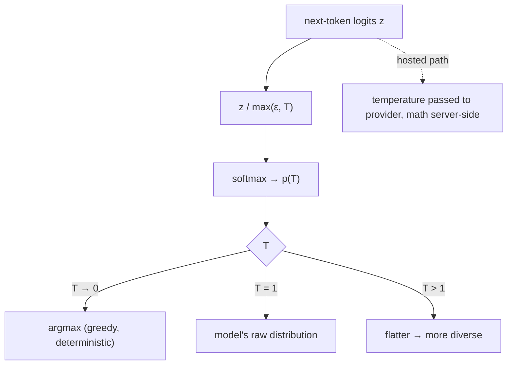
```mermaid
flowchart TD
    LOGITS["next-token logits z"] --> DIV["z / max(ε, T)"]
    DIV --> SM["softmax → p(T)"]
    SM --> S{"T"}
    S -->|"T → 0"| G["argmax (greedy, deterministic)"]
    S -->|"T = 1"| RAW["model's raw distribution"]
    S -->|"T > 1"| FLAT["flatter → more diverse"]
    LOGITS -.->|"hosted path"| API["temperature passed to provider, math server-side"]
```

**Anchors:** &bull; `agent-core/openjiuwen/core/foundation/llm/schema/config.py:210` — `temperature: Optional[float] = None` &bull; `agent-core/openjiuwen/core/foundation/llm/model_clients/base_model_client.py:556` — `final_temperature = ...`; added only when not `None` &bull; `agent-core/openjiuwen/core/foundation/llm/model_clients/openai_model_client.py:944` — drops `top_p` when temperature present (openai.com) &bull; `agent-core/openjiuwen/core/foundation/llm/model_clients/anthropic_model_client.py:929` — temperature via `extra_body`; drops `top_p` if both set &bull; `agent-core/openjiuwen/symphony/retrieval/llm/transformers_prefix_cached_generation/generation.py:516` — `scores = next_token_logits / max(1e-6, temperature)` &bull; `agent-core/openjiuwen/symphony/retrieval/llm/base/types.py:60` — `GenerationConfig.temperature: float = 0.0`

## 7. What's the difference between top-k sampling and top-p (nucleus) sampling

**General:** Both truncate the next-token distribution before sampling. Top-k keeps the `k` most probable tokens and renormalizes — a fixed candidate count regardless of how peaked the distribution is. Top-p keeps the smallest set of tokens whose cumulative probability reaches `p` — an adaptive count: few tokens when the model is confident, many when it is flat. Top-p usually adapts better; they are often combined.

**Jiuwen:** Top-p (nucleus) is implemented locally; top-k sampling is not. `GenerationConfig` exposes `top_p` (default `1.0`) but has no top-k sampling field. The local sampler sorts scores, masks tokens beyond the cumulative `top_p`, re-softmaxes, and multinomial-samples; `top_p == 1.0` samples the full distribution. Hosted providers receive `top_p` in the normal body; Anthropic additionally forwards `top_k` via `extra_body` if present. Note three unrelated `top_k` meanings in the codebase that are **not** LLM sampling: retrieval result count, trie-constraint allowed outputs, and logit-selection candidate scoring.

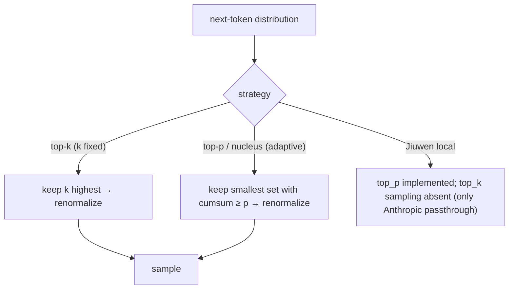
```mermaid
flowchart TD
    P["next-token distribution"] --> K{"strategy"}
    K -->|"top-k (k fixed)"| TK["keep k highest → renormalize"]
    K -->|"top-p / nucleus (adaptive)"| TP["keep smallest set with cumsum ≥ p → renormalize"]
    K -->|"Jiuwen local"| LOC["top_p implemented; top_k sampling absent (only Anthropic passthrough)"]
    TK --> SAMPLE["sample"]
    TP --> SAMPLE
```

**Anchors:** &bull; `agent-core/openjiuwen/symphony/retrieval/llm/base/types.py:61` — `GenerationConfig.top_p: float = 1.0`; no top_k sampling field &bull; `agent-core/openjiuwen/symphony/retrieval/llm/transformers_prefix_cached_generation/generation.py:517` — nucleus `top_p` truncation; `:534` full-distribution softmax when `top_p` ∉ (0,1) &bull; `agent-core/openjiuwen/core/foundation/llm/model_clients/base_model_client.py:561` — `top_p` resolved/passed &bull; `agent-core/openjiuwen/core/foundation/llm/model_clients/anthropic_model_client.py:936` — `top_p` via `extra_body`; `:940` `top_k` forwarded if present &bull; `agent-core/openjiuwen/core/foundation/llm/schema/config.py:213` — `top_p: Optional[float] = None` (no `top_k`) &bull; `agent-core/openjiuwen/symphony/retrieval/llm/base/types.py:40` — `TrieConstraint.top_k` (allowed outputs, not sampling)

## 8. Why does greedy decoding sometimes produce worse output than sampling-based decoding

**General:** Greedy picks the single highest-probability token each step. That is locally optimal but not globally: it can lock into repetitive, degenerate, or bland sequences, and it cannot recover from one early bad choice. Sampling explores alternatives, which often yields more natural and diverse text; a moderate temperature with top-p is a common default. For tasks with a single correct answer (extraction, classification), greedy/`T=0` is usually preferred.

**Jiuwen:** Greedy is implemented but not argued. The local sampler returns `argmax` when `temperature <= 0.0`, and the generate path sets `do_sample=False` in that branch; since `GenerationConfig` defaults to `temperature=0.0`, the local default is greedy. Many framework call sites deliberately pass `temperature=0.0` for deterministic extraction/classification, while sampling is enabled (`do_sample=True`, temperature/top_p/seed) when temperature > 0. There is **no** comment, doc, or code discussion explaining why greedy can be worse than sampling — the choice is treated purely as a determinism knob.

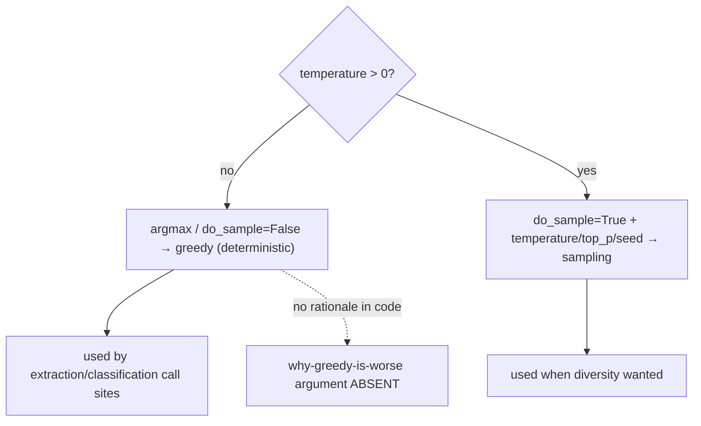
```mermaid
flowchart TD
    D{"temperature > 0?"}
    D -->|no| G["argmax / do_sample=False → greedy (deterministic)"]
    D -->|yes| S["do_sample=True + temperature/top_p/seed → sampling"]
    G --> USE1["used by extraction/classification call sites"]
    S --> USE2["used when diversity wanted"]
    G -.->|"no rationale in code"| X["why-greedy-is-worse argument ABSENT"]
```

**Anchors:** &bull; `agent-core/openjiuwen/symphony/retrieval/llm/transformers_prefix_cached_generation/generation.py:514` — `if temperature <= 0.0: return int(torch.argmax(...))` &bull; `agent-core/openjiuwen/symphony/retrieval/llm/transformers_prefix_cached_generation/generation.py:335` — `do_sample=True` when `temperature > 0`; `:344` `do_sample=False` &bull; `agent-core/openjiuwen/symphony/retrieval/llm/base/types.py:60` — default `temperature = 0.0` ⇒ local default greedy &bull; `agent-core/openjiuwen/agent_evolving/agent_rl/rl_trainer/verl_executor.py:185` — `do_sample = False` in an exploit path &bull; `agent-core/openjiuwen/core/retrieval/indexing/processor/extractor/triple_extractor.py:31` — deterministic `temperature=0.0` call site

---

# Context and memory

## 9. What happens when a conversation exceeds the model's context window

**General:** Either the provider rejects the request, or the framework must shrink the prompt before sending. Robust systems pre-empt it: count tokens, then drop/truncate oldest history, offload large tool outputs, and/or summarize old turns into a compact memory block, always preserving recent turns. The goal is to keep the prompt within budget without losing the information needed for the next step.

**Jiuwen:** On every `add_messages`/`get_context_window`, the context engine counts tokens with a model-aware tokenizer and runs passive processors: offloaders persist oversized tool results to `{workspace}/context/{session_id}_context/offload/` and replace them with `<persisted-output>` previews, while compressors trigger at ratio/token thresholds (`RoundLevelCompressor` at 0.9×budget, `FullCompactProcessor` at 180k) and rewrite history into summary/memory blocks. If the model still rejects the request, `ContextEngine.recover_from_model_exception` matches overflow phrases, force-runs compaction, and retries only if context actually changed. A hard `max_context_message_num` provides a last-resort FIFO drop. `effective_context_budget` is the strictest positive bound across configured window, per-call budget, and resolved model window.

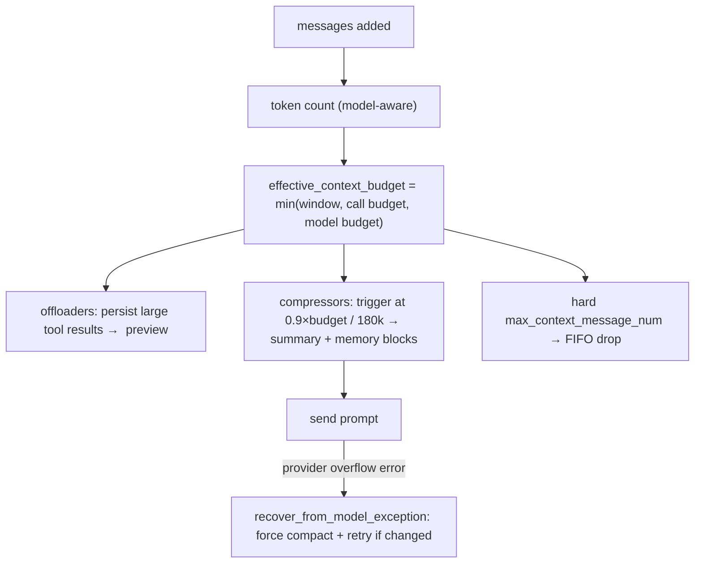
```mermaid
flowchart TD
    MSG["messages added"] --> COUNT["token count (model-aware)"]
    COUNT --> BUD["effective_context_budget = min(window, call budget, model budget)"]
    BUD --> OFF["offloaders: persist large tool results → <persisted-output> preview"]
    BUD --> COMP["compressors: trigger at 0.9×budget / 180k → summary + memory blocks"]
    BUD --> FIFO["hard max_context_message_num → FIFO drop"]
    COMP --> SEND["send prompt"]
    SEND -->|"provider overflow error"| REC["recover_from_model_exception: force compact + retry if changed"]
```

**Anchors:** &bull; `agent-core/openjiuwen/core/context_engine/context/context_utils.py:20` — `DEFAULT_CONTEXT_MAX_TOKENS = 200000`; `:404` `resolve_context_max()`; `:29` per-model window table &bull; `agent-core/openjiuwen/core/context_engine/processor/budget_guard.py:37` — `effective_context_budget()` = min of budgets &bull; `agent-core/openjiuwen/core/context_engine/context/message_buffer.py:71` — `_if_need_resize()` drops oldest beyond 2× &bull; `agent-core/openjiuwen/core/context_engine/processor/compressor/round_level_compressor.py:104` — `trigger_context_ratio=0.9`; `:1159` `_trigger_token_threshold()` &bull; `agent-core/openjiuwen/core/context_engine/processor/compressor/full_compact_processor.py:184` — `trigger_total_tokens=180000`; `:194` `messages_to_keep=10` &bull; `agent-core/openjiuwen/core/context_engine/context_engine.py:372` — `recover_from_model_exception()` &bull; `agent-core/openjiuwen/core/context_engine/processor/offloader/tool_result_budget_processor.py:34` — per-round `tokens_threshold=50000`; `agent-core/openjiuwen/core/context_engine/processor/offloader/message_offloader.py:45` `tokens_threshold=20000`

**Gap.** No pre-call hard rejection/backpressure before the provider call — overflow is discovered by proactive thresholds or the provider error path. Windowing (`default_window_message_num`/`round_num`) is opt-in and separate from compaction.

## 10. Why does model performance sometimes degrade with very long context, even when the context fits

**General:** Attention spreads over more tokens, diluting the signal for any one of them, and models are empirically better at using information at the beginning and end of the context than in the middle ("lost in the middle"). Irrelevant long context also introduces distractors and can override instructions. Fitting the window is necessary but not sufficient; relevance and ordering matter too.

**Jiuwen:** There is no explicit "lost-in-the-middle" mitigation; the system instead mechanically keeps the window small and biases toward recency. Compressors protect a newest-message tail (`keep_recent_messages`, `messages_to_keep`, `keep_last_round`), offloaders keep only the newest K results, and truncation helpers explicitly preserve head + middle + tail rather than only a prefix. When enabled, `CompressionRecallConfig` archives replaced messages in overlapping token chunks and a two-stage BM25 retriever can re-surface relevant archived chunks by query — the closest thing to relevance-based long-context handling.

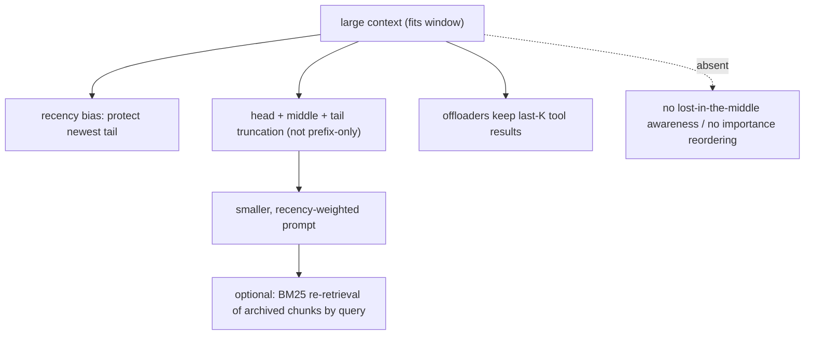
```mermaid
flowchart TD
    BIG["large context (fits window)"] --> BIAS["recency bias: protect newest tail"]
    BIG --> TRUNC["head + middle + tail truncation (not prefix-only)"]
    BIG --> KEEP["offloaders keep last-K tool results"]
    TRUNC --> SMALL["smaller, recency-weighted prompt"]
    SMALL --> BM25["optional: BM25 re-retrieval of archived chunks by query"]
    BIG -.->|"absent"| X["no lost-in-the-middle awareness / no importance reordering"]
```

**Anchors:** &bull; `agent-core/openjiuwen/core/context_engine/processor/compressor/round_level_compressor.py:119` — `keep_recent_messages`; `:1088` `_build_head_tail_truncated_text()`; `:112` `target_total_tokens=160000` &bull; `agent-core/openjiuwen/core/context_engine/processor/compressor/full_compact_processor.py:194` — `messages_to_keep=10` &bull; `agent-core/openjiuwen/core/context_engine/processor/offloader/message_offloader.py:63` — `keep_last_round=True` &bull; `agent-core/openjiuwen/core/context_engine/processor/offloader/message_summary_offloader.py:697` — `_smart_truncate_content()` head/middle/tail &bull; `agent-core/openjiuwen/core/context_engine/processor/budget_guard.py:114` — `_build_head_tail()` &bull; `agent-core/openjiuwen/core/context_engine/processor/forked/compressor/recall/archive.py:48` — archive in 3000-token chunks / 300 overlap; `agent-core/openjiuwen/core/context_engine/processor/forked/compressor/recall/retriever.py:27` BM25 `recall_compressed_context()`

## 11. What's the difference between a model's context window and its training data cutoff

**General:** The context window is how many tokens the model can attend to at once (a capacity limit). The training data cutoff is the date after which the model has no knowledge (a temporal limit). A model can have a large window but an old cutoff — it can read a long document you paste but still not know events after its training date. Confusing the two leads to expecting up-to-date answers from a frozen model.

**Jiuwen:** Model metadata here is operational only: model name, provider, context-window token counts, output `max_tokens`, auth/endpoint. The context engine resolves a window size per model but never stores, prompts, or exposes a training-data cutoff or knowledge date. Nothing distinguishes "the model does not know X" from "the window does not fit X".

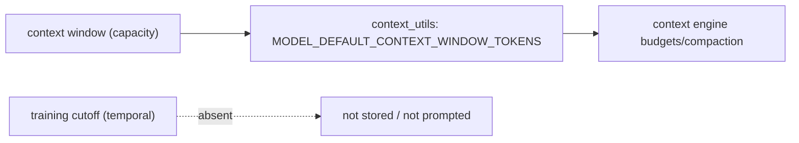
```mermaid
flowchart LR
    CW["context window (capacity)"] --> META["context_utils: MODEL_DEFAULT_CONTEXT_WINDOW_TOKENS"]
    CUT["training cutoff (temporal)"] -.->|"absent"| X["not stored / not prompted"]
    META --> ENG["context engine budgets/compaction"]
```

**Anchors:** &bull; `agent-core/openjiuwen/core/context_engine/context/context_utils.py:29` — builtin window table; `:275` `fetch_openrouter_model_context_window_tokens()` (window only) &bull; `agent-core/openjiuwen/core/context_engine/schema/config.py:137` — `model_name`; `:139` `model_context_window_tokens` &bull; `agent-core/openjiuwen/core/foundation/llm/schema/config.py:209` — `model_name`; `:214` `max_tokens` (output cap) &bull; `agent-core/openjiuwen/core/foundation/llm/schema/generation_response.py:20` — `created` timestamp (response, not cutoff)

**Gap.** Absent. No knowledge/training cutoff, knowledge date, or model-card release metadata anywhere; the closest is the model→window table and `ModelClientConfig`/`ModelRequestConfig`.

## 12. How would you summarize conversation history without losing important details

**General:** Keep the most recent turns verbatim, summarize older turns into a structured note (goal, decisions, files/state, open tasks, next step) rather than free prose, and re-inject the durable state (plan, task status, key artifacts) separately so it is not lost inside a summary. Boundary markers separate summary from live turns, and the summary should be updated incrementally so each pass only processes new messages.

**Jiuwen:** Compaction replaces the active segment with a structured summary plus a boundary `SystemMessage`, then re-injects high-value state as separate `UserMessage` blocks: plan/task status, recent skill-read rounds, read-file snapshots, and the team collaboration policy (returned as messages so they escape `state_snapshot_max_chars` truncation). `FullCompactProcessor` uses a 9-section summary prompt and boundary markers (`[FULL_COMPACT_BOUNDARY]`, `[FULL_COMPACT_STATE]`, `[SESSION_MEMORY_BOUNDARY]`). The session-memory path runs a background updater triggered at 0.7×context window, summarizes only completed API rounds, writes to a pending file and atomically renames on commit, and records `notes_upto_message_id` so only un-summarized messages are processed next time.

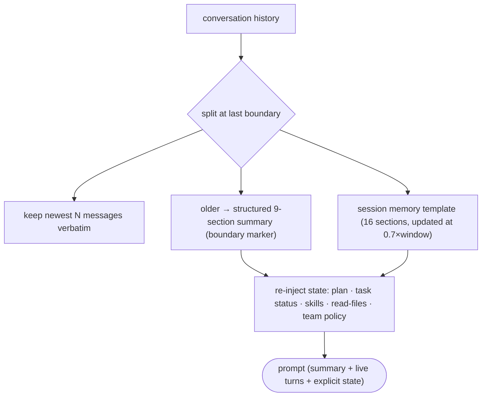
```mermaid
flowchart TD
    HIST["conversation history"] --> SPLIT{"split at last boundary"}
    SPLIT --> KEEP["keep newest N messages verbatim"]
    SPLIT --> SUM["older → structured 9-section summary (boundary marker)"]
    SPLIT --> SMEM["session memory template (16 sections, updated at 0.7×window)"]
    SUM --> REINJ["re-inject state: plan · task status · skills · read-files · team policy"]
    SMEM --> REINJ
    REINJ --> PROMPT(["prompt (summary + live turns + explicit state)"])
```

**Anchors:** &bull; `agent-core/openjiuwen/core/context_engine/processor/compressor/full_compact_processor.py:69` — `BASE_COMPACT_PROMPT`; `:167` boundary markers; `:342` `_build_replacement_messages()`; `:774` `build_reinjected_state_messages()` &bull; `agent-core/openjiuwen/core/context_engine/processor/compressor/util.py:242` — `build_skill_reinjected_content()`; `:294` `build_task_status_reinjected_content()`; `:105` `build_team_policy_reinjected_messages()` &bull; `agent-core/openjiuwen/core/context_engine/context/session_memory_manager.py:37` — 16-section template; `:738` `should_update()`; `:824` `_update_background()`; `:529` `invalidate_session_memory_anchor()` &bull; `agent-core/openjiuwen/core/context_engine/processor/forked/compressor/reinjection/builders.py:29` — forked reinjection builders

**Gap.** The non-session-memory fallback re-injects only plan/skills/task status; `build_plan_reinjected_content` in the non-forked `util.py` is a stub returning `""`. No automatic verification that the summary retained all critical facts beyond the prompt's structured sections.

---

# Prompting

## 13. Zero-shot vs. few-shot vs. chain-of-thought, when does each actually improve output

**General:** Zero-shot (instruction only) works for tasks the model saw in instruction tuning. Few-shot (worked examples) helps when the task has a specific format, label set, or edge-case convention the instruction can't fully specify. Chain-of-thought (ask for intermediate reasoning) helps multi-step reasoning/arithmetic, especially for smaller models, and is largely subsumed by native reasoning models. All three cost prompt tokens; examples and CoT are not free wins on simple tasks.

**Jiuwen:** The runtime agent is fundamentally zero-shot: the system prompt is assembled from instruction-only `PromptSection`s (identity, safety, skills, tools, task guidance) and the model is steered through the ReAct tool-calling loop, not worked examples. Few-shot machinery exists only in the evolution/tuning tooling (`agent_evolving`, `dev_tools/tune`), which formats cases into example blocks and injects them as prompt gradients. Chain-of-thought appears in auxiliary prompts (workflow `questioner_comp` has an explicit "Let's think step by step") and implicitly in the compaction prompt's `<analysis>`-then-`
` structure. Reasoning-model output is preserved: clients parse `reasoning_content`, and DeepSeek profiles inject an empty `reasoning_content` into assistant history.

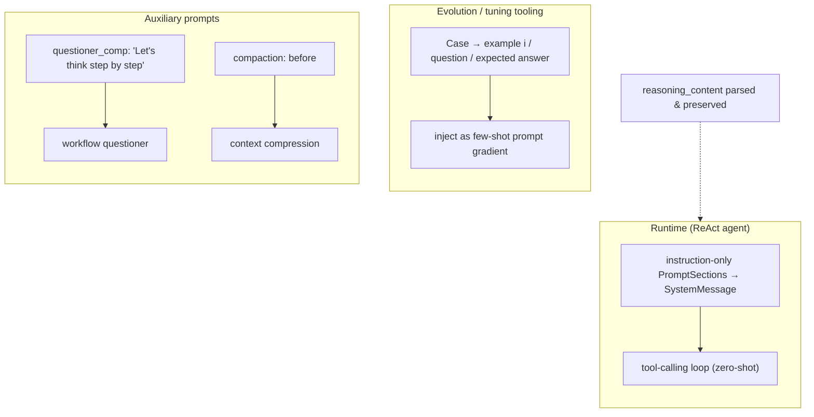
```mermaid
flowchart TD
    subgraph RT["Runtime (ReAct agent)"]
    direction TB
    SYS["instruction-only PromptSections → SystemMessage"] --> LOOP["tool-calling loop (zero-shot)"]
    end
    subgraph TUNE["Evolution / tuning tooling"]
    direction TB
    CASES["Case → example i / question / expected answer"] --> GRAD["inject as few-shot prompt gradient"]
    end
    subgraph AUX["Auxiliary prompts"]
    direction TB
    COT["questioner_comp: 'Let's think step by step'"] --> A1["workflow questioner"]
    AN["compaction: <analysis> before <summary>"] --> A2["context compression"]
    end
    REASON["reasoning_content parsed & preserved"] -.-> RT
```

**Anchors:** &bull; `agent-core/openjiuwen/core/single_agent/agents/react_agent.py:842` — renders `role=="system"` template messages; `:1504` `SystemMessage(content=prompt_builder.build())` &bull; `agent-core/openjiuwen/core/single_agent/prompts/builder.py:219` — `build()` joins priority-ordered sections &bull; `agent-core/openjiuwen/harness/prompts/sections/identity.py:11` — default identity prompt (zero-shot) &bull; `agent-core/openjiuwen/agent_evolving/utils.py:238` — `convert_cases_to_examples()` &bull; `agent-core/openjiuwen/dev_tools/tune/optimizer/example_optimizer.py:109` — `init_examples()` few-shot injection &bull; `agent-core/openjiuwen/core/foundation/llm/model_clients/openai_model_client.py:347` — parses `reasoning_content`; `agent-core/openjiuwen/core/foundation/llm/utils/endpoint_profiles.py:33` — DeepSeek empty `reasoning_content` &bull; `agent-core/openjiuwen/core/workflow/components/llm/questioner_comp.py:68` — explicit CoT instruction

**Gap.** No task-level few-shot examples are injected by `harness/` or `core/single_agent`; tool descriptions have occasional usage lines but no worked input/output demos. No global CoT instruction in the DeepAgent system prompt — reasoning is delegated to the model's native channel.

## 14. What's the difference between a system prompt and a user prompt

**General:** The system prompt sets persistent role, rules, persona, and constraints for the whole conversation; the user prompt is the per-turn request. Providers give the system message higher priority and apply it consistently, while user turns are the changing input. Some APIs (Anthropic) pass system content as a separate top-level field rather than a role in the message list.

**Jiuwen:** The system prompt is a single assembled string from priority-ordered, host-injectable sections; rails mutate the `SystemPromptBuilder` (add/remove sections) before the model call, and `ReActAgent` renders it once as a `SystemMessage` passed as `system_messages`. User turns are admitted separately as `UserMessage` history; the context engine windows `system_messages` and `context_messages` independently. Provider mapping differs: OpenAI chat keeps `role:"system"` in the list, Anthropic lifts system content to the top-level `system` parameter (with an opt-in mid-conversation system path), and the Responses API folds system/developer into `instructions`.

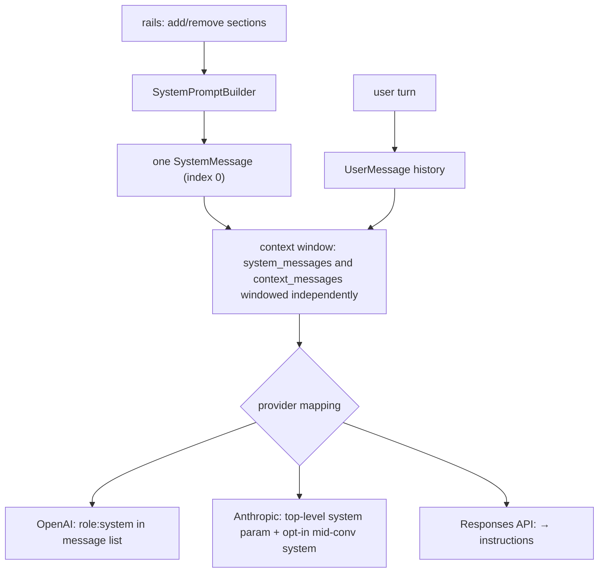
```mermaid
flowchart TD
    RAILS["rails: add/remove sections"] --> SPB["SystemPromptBuilder"]
    SPB --> SM["one SystemMessage (index 0)"]
    USER["user turn"] --> UM["UserMessage history"]
    SM --> CTX["context window: system_messages and context_messages windowed independently"]
    UM --> CTX
    CTX --> MAP{"provider mapping"}
    MAP --> OAI["OpenAI: role:system in message list"]
    MAP --> ANT["Anthropic: top-level system param + opt-in mid-conv system"]
    MAP --> RESP["Responses API: → instructions"]
```

**Anchors:** &bull; `agent-core/openjiuwen/core/single_agent/agents/react_agent.py:1504` — builds one `SystemMessage`; `:883` `_admit_user_message()` writes a `UserMessage` &bull; `agent-core/openjiuwen/core/context_engine/context/context.py:574` — `get_context_window(system_messages, ...)`; `:718` `_get_window_messages()` windows independently &bull; `agent-core/openjiuwen/harness/rails/task_planning_rail.py:154` — rail adds/removes a system-prompt section &bull; `agent-core/openjiuwen/harness/rails/security/prompt_security_rail.py:17` — security section injection &bull; `agent-core/openjiuwen/harness/prompts/prompt_attachment_manager.py:591` — user→system re-role per provider &bull; `agent-core/openjiuwen/core/foundation/llm/model_clients/anthropic_model_client.py:379` — lifts system into top-level blocks; `:858` `params["system"]` &bull; `agent-core/openjiuwen/core/foundation/llm/utils/responses_utils.py:142` — system/developer → `instructions`

## 15. How do you get consistent, parseable output like JSON from an LLM

**General:** Layer the guarantees: prefer a provider JSON/schema mode or tool/function calling with a JSON Schema so the model is constrained at generation time; validate against the schema; on failure, return the validation error to the model for a retry; only then parse. Fenced or free-text JSON should be a last resort with tolerant extraction and repair.

**Jiuwen:** The core harness has **no native `response_format`/JSON mode**; structured output is enforced by giving the model a single-use `structured_output` tool whose `ToolCard.input_params` is the caller's JSON Schema, so the provider's tool-use layer constrains arguments. On success the arguments are captured on the tool instance and a finish rail ends the round; on failure the error tool-result is returned for self-correction, and the workflow engine retries then validates the captured object with pydantic `model_validate` or `jsonschema.validate`. For text-based JSON (compression summaries), `JsonOutputParser` strips code fences and `json.loads` the payload, returning `None` on decode failure rather than raising.

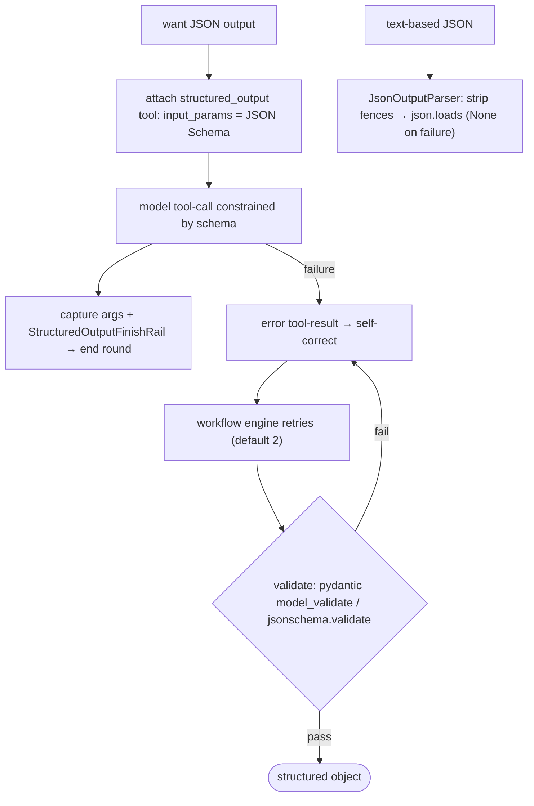
```mermaid
flowchart TD
    REQ["want JSON output"] --> TOOL["attach structured_output tool: input_params = JSON Schema"]
    TOOL --> MODEL["model tool-call constrained by schema"]
    MODEL --> CAP["capture args + StructuredOutputFinishRail → end round"]
    MODEL -->|failure| ERR["error tool-result → self-correct"]
    ERR --> RETRY["workflow engine retries (default 2)"]
    RETRY --> VAL{"validate: pydantic model_validate / jsonschema.validate"}
    VAL -->|pass| OK(["structured object"])
    VAL -->|fail| ERR
    TXT["text-based JSON"] --> JP["JsonOutputParser: strip fences → json.loads (None on failure)"]
```

**Anchors:** &bull; `agent-core/openjiuwen/agent_teams/tools/structured_output_tool.py:46` — `StructuredOutputTool`; `:82` `input_params = schema_json`; `:97` `StructuredOutputFinishRail.after_tool_call` &bull; `agent-core/openjiuwen/agent_teams/workflow/backends/team_worker_backend.py:230` — attaches one `StructuredOutputTool` per schema; `:484` finish rail; `:498` reminder &bull; `agent-core/openjiuwen/agent_teams/workflow/engine/schema.py:55` — `resolve_schema()`; `:74` `coerce()` (pydantic/jsonschema) &bull; `agent-core/openjiuwen/agent_teams/workflow/engine/primitives.py:693` — retries; `:763` `coerce(res.structured, ...)`; `agent-core/openjiuwen/agent_teams/workflow/engine/runtime.py:62` `retries: int = 2` &bull; `agent-core/openjiuwen/core/foundation/llm/output_parsers/json_output_parser.py:15` — fence/bare extraction + `json.loads`; `:92` `stream_parse()` &bull; `agent-core/openjiuwen/core/context_engine/processor/compressor/round_level_compressor.py:713` — `JsonOutputParser()`; `:1266` validates `{"blocks":[...]}`

**Gap.** No `response_format`/`json_schema`/grammar-constrained decoding in `core/foundation/llm`. No automatic JSON repair — invalid output is dropped/retried, not fixed. `StructuredOutputTool` lives in `agent_teams`, not a general core primitive.

---

# Fine-tuning

## 16. What's the difference between full fine-tuning and parameter-efficient fine-tuning like LoRA

**General:** Full fine-tuning updates every weight in the model — highest capacity to adapt but needs the full model in memory per training run, large checkpoints, and is easy to overfit/drift. LoRA freezes the base weights and trains small low-rank adapter matrices injected into the attention/MLP projections, so you store and serve only the adapters, need far less memory, and can keep many task adapters over one base model. Quality is often close to full FT for style/format/domain adaptation; full FT is preferred when the task needs deep capability change.

**Jiuwen:** The repo trains weights, but only via **LoRA/PEFT adapters** — there is no full-parameter fine-tuning mode. Two backends exist: an online SFT backend and an online/offline RL/PPO backend (veRL). The SFT trainer writes a parquet dataset, invokes veRL's SFT trainer (FSDP + LoRA), then merges the FSDP checkpoint and exports a PEFT adapter directory (`adapter_config.json` + `adapter_model.safetensors`). The RL path saves a checkpoint and `_convert_fsdp_to_peft` filters only `lora_` params and writes a PEFT `adapter_config.json` (`peft_type: LORA`, `r`, `target_modules: all-linear`). Published adapters are versioned (`v1`, `v2`, …) with an atomic `latest` symlink, then hot-loaded on the inference service.

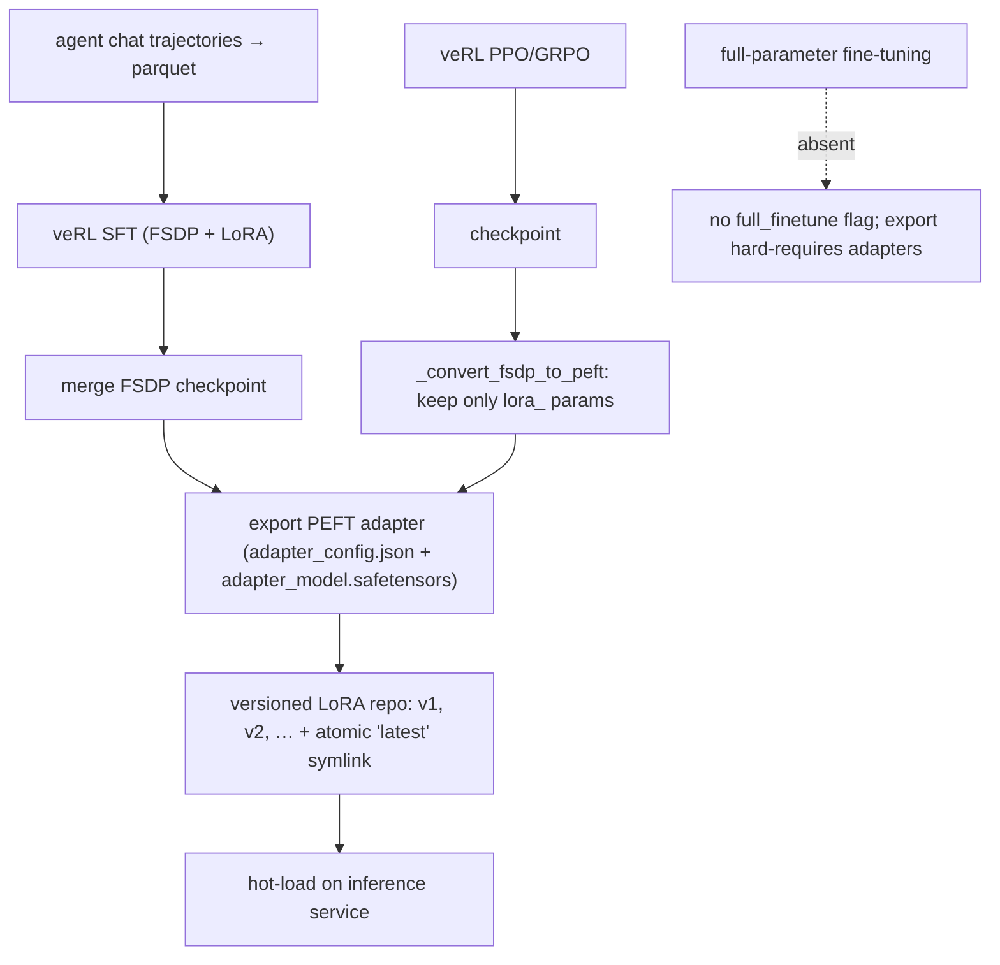
```mermaid
flowchart TD
    DATA["agent chat trajectories → parquet"] --> SFT["veRL SFT (FSDP + LoRA)"]
    RL["veRL PPO/GRPO"] --> CKPT["checkpoint"]
    SFT --> MERGE["merge FSDP checkpoint"]
    CKPT --> CONV["_convert_fsdp_to_peft: keep only lora_ params"]
    MERGE --> EXP["export PEFT adapter (adapter_config.json + adapter_model.safetensors)"]
    CONV --> EXP
    EXP --> REPO["versioned LoRA repo: v1, v2, … + atomic 'latest' symlink"]
    REPO --> HOT["hot-load on inference service"]
    FULL["full-parameter fine-tuning"] -.->|"absent"| X["no full_finetune flag; export hard-requires adapters"]
```

**Anchors:** &bull; `agent-core/openjiuwen/agent_evolving/agent_rl/online/backends/sft/trainer.py:44` — `SFTTrainingExecutor` (owns SFT + LoRA publish); `:328-345` lora_rank/alpha/target_modules; `:455-482` `_export_sft_lora_adapter`; `:577-586` `_is_publishable_lora_dir` &bull; `agent-core/openjiuwen/agent_evolving/agent_rl/optimizer/task_runner.py:438-470` — `export_lora`; `:543-579` PEFT `adapter_config.json`; `:550-552` warn+fallback if no LoRA params &bull; `agent-core/openjiuwen/agent_evolving/agent_rl/storage/lora_repo.py:56-131` — versioned publish + atomic `latest` &bull; `agent-core/openjiuwen/agent_evolving/agent_rl/config/online_config.py:42-45` — PPO overlay `lora_rank: 16`, `lora_alpha: 32`, `target_modules: all-linear` &bull; `agent-core/openjiuwen/agent_evolving/agent_rl/rl_trainer/ppo_step.py:146` — `update_actor` (PPO)

**Gap.** No full-parameter fine-tuning support and no direct `peft` import (the PEFT artifact format is hand-written). The primary self-evolution loop is textual prompt optimization, not weight training.

## 17. What is instruction tuning, and how is it different from base model pretraining

**General:** Pretraining is self-supervised on raw text (predict the next/masked token) and produces a base model that completes text but does not follow instructions. Instruction tuning is supervised fine-tuning on (instruction, response) pairs that teaches the base model to follow commands, formats, and safety behavior. It is a small, high-quality stage relative to pretraining.

**Jiuwen:** Instruction tuning is implemented as **SFT over agent chat trajectories**: messages are normalized, tool calls are rendered into Qwen XML, and each assistant turn is tokenized with a `loss_mask` that is 0 for prompt/user/tool tokens and non-zero only on assistant output tokens. `supervise="last"` trains only the final assistant turn; `loss_norm` (`token`/`turn`/`sqrt`) controls per-turn weighting. The output is a pre-tokenized parquet consumed by a custom multi-turn dataset in veRL. This is behavior tuning on demonstrations, not continued pretraining.

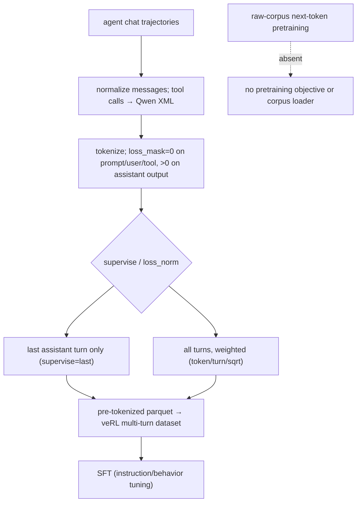
```mermaid
flowchart TD
    TRAJ["agent chat trajectories"] --> NORM["normalize messages; tool calls → Qwen XML"]
    NORM --> TOK["tokenize; loss_mask=0 on prompt/user/tool, >0 on assistant output"]
    TOK --> OPT{"supervise / loss_norm"}
    OPT --> LAST["last assistant turn only (supervise=last)"]
    OPT --> ALL["all turns, weighted (token/turn/sqrt)"]
    LAST --> PQ["pre-tokenized parquet → veRL multi-turn dataset"]
    ALL --> PQ
    PQ --> SFT["SFT (instruction/behavior tuning)"]
    PRE["raw-corpus next-token pretraining"] -.->|"absent"| X["no pretraining objective or corpus loader"]
```

**Anchors:** &bull; `agent-core/openjiuwen/agent_evolving/agent_rl/online/backends/sft/sft_data_formatter.py:201-249` — `build_sft_tokenized_sample`, loss mask on assistant only; `:270-345` `write_sft_parquet`; `:101-133` `convert_message_openai`; `:50-60` Qwen `<tool_call>` XML; `:77-84` `<think>` → `reasoning_content` &bull; `agent-core/openjiuwen/agent_evolving/agent_rl/online/backends/sft/trainer.py:136-176` — `train_batch`; `:395-398` `QwenMultiTurnSFTDataset`; `:270-276` parquet write

**Gap.** Pretraining is absent — no next-token objective, no raw-corpus dataloader; `from_pretrained` hits only load existing base/tokenizer weights.

## 18. When would you fine-tune instead of using a longer, more detailed prompt

**General:** Fine-tune when the behavior is hard to specify in words (style, tone, domain jargon, strict output schema), when you need to compress a long few-shot prompt into the weights for latency/cost, when you have many labeled examples of the desired behavior, or when the task is high-volume and a smaller tuned model is cheaper. Prefer prompting when the task is general, examples are few, the requirement changes often, or you need to iterate quickly — prompt changes ship in seconds, fine-tunes in hours/days.

**Jiuwen:** The repo contains conceptual guidance plus two separate mechanisms, not a decision function. A design doc states the rationale directly: fine-tuning on bad cases is expensive and its fix cycle is tied to model release versions, so openJiuwen instead does automatic prompt/instruction-and-example optimization. The practical default is `Trainer` + `InstructionOptimizer`/`JointOptimizer` (rewrite prompts via textual gradients, evaluate candidates, keep the best). For choosing *which model/endpoint* serves a task, IntelliRouter routes among deployments by adaptive health/token/RPM/latency scoring — availability/cost routing, not "tune vs prompt" reasoning. Weight-level SFT/LoRA exists as a heavier escalation path, but no selection criteria are encoded in code.

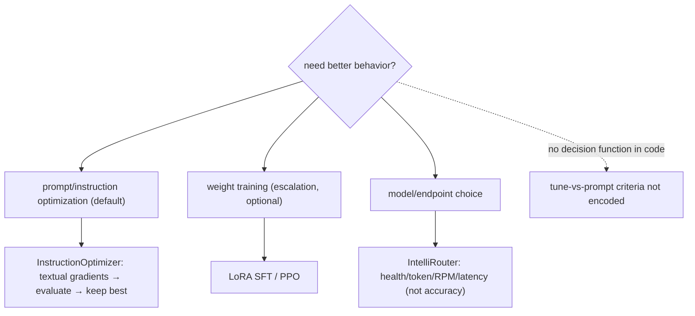
```mermaid
flowchart TD
    Q{"need better behavior?"} --> P["prompt/instruction optimization (default)"]
    P --> IO["InstructionOptimizer: textual gradients → evaluate → keep best"]
    Q --> W["weight training (escalation, optional)"]
    W --> LORA["LoRA SFT / PPO"]
    Q --> R["model/endpoint choice"]
    R --> IR["IntelliRouter: health/token/RPM/latency (not accuracy)"]
    Q -.->|"no decision function in code"| X["tune-vs-prompt criteria not encoded"]
```

**Anchors:** &bull; `agent-core/openjiuwen/agent_evolving/optimizer/llm_call/instruction_optimizer.py:30-38` — prompt rewriting via textual gradients &bull; `agent-core/openjiuwen/agent_evolving/trainer/trainer.py:241-272` — evaluates candidate prompt-config updates, keeps best &bull; `agent-core/openjiuwen/agent_evolving/agent_rl/online/backends/sft/trainer.py:44-45` — alternate weight-training (SFT/LoRA) path &bull; `agent-core/openjiuwen/agent_teams/models/pool.py:133-235` — `ModelRouterConfig`; `agent-core/openjiuwen/agent_teams/models/allocator.py:176/240/357/452/559` — allocator strategies / `build_model_allocator` &bull; `agent-core/examples/intelli_router/intelliRouter_demo.py:142-160` — adaptive routing weights (`w_health`, `w_token`, `w_rpm`, `w_latency`)

**Gap.** No explicit "fine-tune vs longer prompt" decision guidance beyond one conceptual paragraph; no cost/benefit calculator or context-length-vs-tuning trigger.

---

# Model behavior

## 19. What is hallucination, and why does it happen even in a well-trained model

**General:** Hallucination is fluent output that is not grounded in fact or in the provided context. It arises because the objective is next-token likelihood, not truth: the model optimizes plausibility, has no built-in fact database, generalizes patterns that sometimes fabricate specifics, and cannot reliably know the boundary of its own knowledge. Mitigations are grounding (retrieval/citations), verification, constrained formats, and abstention — not a property of the weights you can simply "fix".

**Jiuwen:** The repo does not model or detect low-level hallucination; it implements downstream mitigations: (1) retrieval-augmentation infrastructure to supply evidence; (2) a dedicated **verification agent** restricted to read-only/command tools that must show verbatim command output with a PASS/FAIL/PARTIAL verdict; (3) an LLM quality reviewer scoring CORRECTNESS/COMPLETENESS; (4) model-anomaly rails that catch degenerate repetition/loops (not false claims); and (5) security guardrails/sanitization for injection and secret leakage. There is no claim-to-source attribution checker.

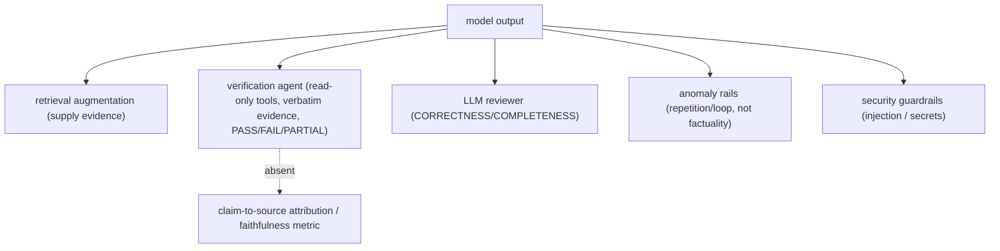
```mermaid
flowchart TD
    GEN["model output"] --> G1["retrieval augmentation (supply evidence)"]
    GEN --> G2["verification agent (read-only tools, verbatim evidence, PASS/FAIL/PARTIAL)"]
    GEN --> G3["LLM reviewer (CORRECTNESS/COMPLETENESS)"]
    GEN --> G4["anomaly rails (repetition/loop, not factuality)"]
    GEN --> G5["security guardrails (injection / secrets)"]
    G2 -.->|"absent"| X["claim-to-source attribution / faithfulness metric"]
```

**Anchors:** &bull; `agent-core/openjiuwen/harness/rails/model_anomaly_detection_rail.py:110-117` — repeated stream output / timeouts / tool-call loops (degeneracy, not factual errors) &bull; `agent-core/openjiuwen/harness/rails/subagent/verification_rail.py:92-108` — `VerificationRail` tool allowlist; `:165-196` blocks disallowed tools, requires evidence &bull; `agent-core/openjiuwen/agent_teams/verification/reviewer.py:26-58` — LLM reviewer dimension "CORRECTNESS" &bull; `agent-core/openjiuwen/core/security/guardrail/backends.py:39-80` — guardrail detection backends; `agent-core/openjiuwen/core/security/guardrail/context.py:115-202` confidence thresholds → risk levels &bull; `agent-core/openjiuwen/harness/tools/web/paid_search.py:221-222` — extracts citation URLs (no claim linkage) &bull; `agent-core/openjiuwen/agent_evolving/tools/skill.py:284` — "cite only available evidence"

**Gap.** No hallucination/attribution detector, no grounded-claim verification, no faithfulness metric. Retrieval is optional plumbing.

## 20. Why do LLMs struggle with tasks like counting or basic arithmetic

**General:** The model operates on tokens, not characters or digits-as-numbers; counting letters requires character-level reasoning that BPE hides, and multi-digit arithmetic requires carrying/positional algorithms that are error-prone to learn implicitly. Models also have no scratchpad guarantee unless asked to show work. The reliable fix is tool use — call a calculator or run code — rather than expecting the forward pass to do exact math.

**Jiuwen:** The repo frames arithmetic/counting as a tool-augmentation problem. A canonical example trains a DeepAgent to call a `calculator` tool that evaluates arithmetic via `simpleeval` and solves/simplifies algebra/equations via `sympy`; the system prompt explicitly instructs tool use step by step. More generally, an `execute_code` sandbox operation (JiuwenBox/YuanRong/AIO providers plus a local provider) lets agents run code for math/logic. The RSI evidence analyzer encodes the principle "textual arithmetic is never accepted as execution" — verification must come from actual code execution.

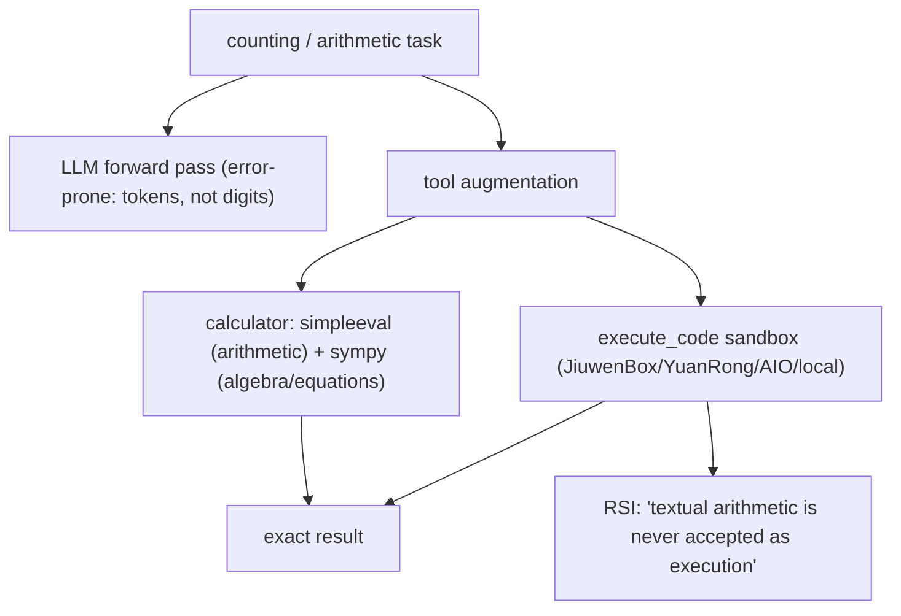
```mermaid
flowchart TD
    MATH["counting / arithmetic task"] --> LLM["LLM forward pass (error-prone: tokens, not digits)"]
    MATH --> TOOL["tool augmentation"]
    TOOL --> CALC["calculator: simpleeval (arithmetic) + sympy (algebra/equations)"]
    TOOL --> CODE["execute_code sandbox (JiuwenBox/YuanRong/AIO/local)"]
    CALC --> RESULT["exact result"]
    CODE --> RESULT
    CODE --> VER["RSI: 'textual arithmetic is never accepted as execution'"]
```

**Anchors:** &bull; `agent-core/examples/rl_calculator/tools.py:11-14` — `@tool(name="calculator")`; `:15-85` `simple_eval` + `sympy` &bull; `agent-core/examples/rl_calculator/prompts.py:7-16` — "Use the calculator tool … step by step" &bull; `agent-core/openjiuwen/core/sys_operation/code.py:16-49` — `execute_code` sys-operation &bull; `agent-core/openjiuwen/extensions/sys_operation/sandbox/providers/jiuwenbox.py:2927` — sandbox `execute_code` &bull; `agent-core/openjiuwen/rsi/harness_rsi/evaluation_result_analyzer/evidence_investigation.py:200` — "textual arithmetic is never accepted as execution"

**Gap.** No first-class arithmetic/counting tool in the core registry; math capability is delegated to user tools or the sandbox. No discussion of tokenization/subitizing causes — purely engineering mitigation.

## 21. What's the difference between the model being "wrong" and the model being "uncertain," and can you tell the difference from the output alone

**General:** Wrong means the answer is factually incorrect; uncertain means the model's distribution is not confident, which may still yield a correct or incorrect answer. They are independent: a model can be confidently wrong, or rightly unsure. From the surface text alone you generally cannot tell — fluent text carries no calibrated confidence. Token log-probabilities, entropy, or self-consistency/vote checking can approximate uncertainty, but they are imperfect and need calibration; abstention only helps if it correlates with being wrong.

**Jiuwen:** The repo collects token **logprobs** but does not expose an uncertainty/abstention signal on ordinary agent answers. `ReactAgent` can request `logprobs`/`top_logprobs`, captured into canonical RL trajectory spans and validated (must be ≤ 0) for RL training. `ChatReranker` uses them for one specific binary decision: it exponentiates the top-logprobs of "yes"/"no" and normalizes to a relevance probability. The retrieval subsystem has an explicit abstain token ("0"), but that is retrieval-selection abstention, not output uncertainty. There is no confidence threshold at which an agent says "I don't know," and no calibration.

```mermaid
flowchart TD
    OUT["model answer"] --> W{"wrong?"}
    OUT --> U{"uncertain?"}
    W -.-> IND["independent axes"]
    U -.-> IND
    OUT -.->|"not readable from text"| X["surface fluency carries no calibrated confidence"]
    LP["token logprobs"] --> RL["RL trajectory data (validated ≤ 0)"]
    LP --> CR["ChatReranker: exp(top_logprobs yes/no) → relevance probability"]
    LP -.->|"absent"| CONF["no answer-level confidence / abstention / calibration"]
```

**Anchors:** &bull; `agent-core/openjiuwen/core/retrieval/reranker/chat_reranker.py:83-107` — `exp(logprob)` yes/no → normalized confidence; `:134-141` `logprobs=True`, `top_logprobs=5`, yes/no logit bias &bull; `agent-core/openjiuwen/core/single_agent/agents/react_agent.py:294-303` — `llm_logprobs`/`llm_top_logprobs`; `:1622-1624` passes to model call &bull; `agent-core/openjiuwen/agent_evolving/agent_rl/online/capture_pipeline.py:404-427` — parses per-token logprobs, rejects `> 0` &bull; `agent-core/openjiuwen/agent_evolving/trajectory/schema.py:36-47` — `RL_LOGPROBS`; `agent-core/openjiuwen/agent_evolving/trajectory/spans.py:849-873` — `read_rl_fields` &bull; `agent-core/openjiuwen/symphony/retrieval/search/runtime/selector.py:305-315` — `is_abstain` from output token "0" (retrieval only)

**Gap.** No answer-level confidence scoring, no uncertainty-based abstention, no calibration. Logprobs exist only as RL reward/trajectory data and for the reranker's binary judgment, so you cannot tell wrong from uncertain from the output alone here.

---

# Evaluation and comparison

## 22. How do you evaluate an LLM's output beyond "it looks correct"

**General:** Combine automatic metrics (exact match, F1, ROUGE/BLEU where applicable, functional/tests for code), an LLM-as-judge with a rubric for open-ended quality, and human review for a sample. Build a held-out eval set with representative and adversarial cases, score consistently, and track regressions across changes. The judge itself must be validated against human agreement; a single metric rarely captures "quality".

**Jiuwen:** Several independent eval layers exist. `agent_evolving/evaluator/` provides `BaseEvaluator`/`DefaultEvaluator` plus `Metric`s: `ExactMatchMetric` (normalized string match) and `LLMAsJudgeMetric` (model judge returns 0/1 with a template). The RSI subsystem has a rigorous LLM-as-judge contract requiring a structured JSON verdict with per-behavior scores, evidence, weights, and forbidden-behavior penalties. The online RL judge scores single turns as reward with `num_votes` voting. PerStream uses GPT-3.5 as a judge and aggregates accuracy/score/latency/VRAM, and `rsi best_of_n` scores workspaces by test pass counts, diff size, and lint errors. `EvolutionPipeline` runs an agent against a benchmark for N iterations and reports pass rate/convergence.

```mermaid
flowchart TD
    OUT["model/agent output"] --> M1["ExactMatchMetric (normalized string)"]
    OUT --> M2["LLMAsJudgeMetric (rubric → 0/1)"]
    OUT --> M3["RSI judge: per-behavior scores + evidence + weights + forbidden penalties"]
    OUT --> M4["RL judge: reward in 0,1 · num_votes voting"]
    OUT --> M5["best_of_n: tests / lint / diff size"]
    OUT --> M6["PerStream: aggregate accuracy/score/latency/VRAM"]
    M1 --> AGG(["eval result"])
    M2 --> AGG
    M3 --> AGG
    M4 --> AGG
    M5 --> AGG
    M6 --> AGG
```

**Anchors:** &bull; `agent-core/openjiuwen/agent_evolving/evaluator/metrics/llm_as_judge.py:17-66` — `LLMAsJudgeMetric`; `agent-core/openjiuwen/agent_evolving/evaluator/metrics/exact_match.py:12-45` — `ExactMatchMetric`; `agent-core/openjiuwen/agent_evolving/evaluator/metrics/__init__.py:7-11` registry &bull; `agent-core/openjiuwen/agent_evolving/evaluator/evaluator.py:1-9` — `DefaultEvaluator` / `MetricEvaluator` &bull; `agent-core/openjiuwen/rsi/harness_rsi/evaluator/judger/scoring.py:57-88` — rubric/required/forbidden contract; `:167-214` weighted scoring + evidence &bull; `agent-core/openjiuwen/agent_evolving/agent_rl/online/judge/judge_scorer.py:28-104` — judge reward, `num_votes` &bull; `agent-core/examples/PerStream/src/eval/score_passive_judge.py:28-124` GPT-3.5 judge; `:247-366` aggregate metrics &bull; `agent-core/openjiuwen/rsi/auto_harness/pipelines/best_of_n/attempt_scorer.py:17-119` — tests/lint/diff scoring &bull; `agent-core/openjiuwen/symphony/evaluation/evaluators.py:1-16` — static/trace evaluators incl. `LLMJudgeEvaluator`

**Gap.** No unified/standard benchmark harness, no statistical-significance testing, and no inter-rater agreement validation for the LLM judge; eval is spread across three subsystems with different contracts.

## 23. What is perplexity, and what does a lower score actually tell you

**General:** Perplexity is the exponentiated average negative log-likelihood the model assigns to a token sequence: `exp(-(1/N)·Σ log p(token_i))`. Lower means the model finds the text more predictable — useful for comparing language models on the same data or detecting distribution shift/overfitting. It does not measure factuality, reasoning, instruction-following, or usefulness, and it is only comparable across models that share a tokenizer and data.

**Jiuwen:** Perplexity is absent as a concept or metric — no `perplexity`/`ppl`/loss-based language-modeling metric is computed anywhere. The nearest primitives are token log-probabilities and a softmax over candidate logits: candidate logits are normalized to probabilities for retrieval selection, per-completion `cumulative_logprob` is captured (used for generation summaries/RL) but not converted to perplexity, and `ChatReranker` exponentiates token logprobs for a yes/no rerank score. The only literal "perplexity" strings are the Perplexity web-search vendor, not the metric.

```mermaid
flowchart TD
    PPL["Perplexity = exp(-1/N · Σ log p(token_i))"] --> LOWER["lower → text more predictable (same tokenizer + data)"]
    PPL -.->|"not implemented"| X["absent in codebase"]
    LP["token logprobs / cumulative_logprob"] --> USE1["RL trajectories (capture pipeline)"]
    LP --> USE2["ChatReranker: exp(logprob) yes/no score"]
    LP --> USE3["retrieval candidate scoring: softmax over logits"]
    USE1 -.->|"no length-normalized averaging"| PPL
```

**Anchors:** &bull; `agent-core/openjiuwen/symphony/retrieval/llm/base/scoring.py:98-115` — softmax over candidate logits → probability (retrieval) &bull; `agent-core/openjiuwen/symphony/retrieval/llm/vllm/client.py:847` — `cumulative_logprob` per completion (not perplexity) &bull; `agent-core/openjiuwen/core/retrieval/reranker/chat_reranker.py:94-107` — `exp(logprob)` yes/no &bull; `agent-core/openjiuwen/agent_evolving/agent_rl/online/capture_pipeline.py:408-418` — stores token logprobs for RL &bull; `agent-core/openjiuwen/harness/tools/web/paid_search.py:44` — "Perplexity" is the search vendor, not the metric

**Gap.** No token-loss averaging, no length normalization, no corpus-level perplexity.

## 24. How would you compare two models for a specific task, not just a general leaderboard score

**General:** Run both models on the same held-out task set with the same prompts/decoding, score with task-appropriate metrics (exact match, tests, rubric judge), and compare accuracy plus latency and cost; check statistical significance and inspect failure cases. A leaderboard is a prior, not a decision — task fit, cost, latency, and controllability often matter more than a few points of general score.

**Jiuwen:** Model selection here is infrastructure routing, not benchmark comparison. `agent_teams/models/pool.py` defines `ModelRouterConfig` (one endpoint, many model names) and `IntelliRouterConfig` (many deployments behind a reliable client router), with allocator strategies chosen by `build_model_allocator`. IntelliRouter routes by adaptive multi-factor scoring (health, tokens, RPM, latency) and fails over — it does **not** choose by task accuracy. For comparing configs/attempts there is real per-task evaluation: `Trainer` evaluates each candidate on a validation set and keeps the highest score; `rsi best_of_n` ranks attempts by tests/diff/lint; the online judge uses `num_votes` voting. Comparing two models for a task therefore means running your own eval, not a leaderboard feature.

```mermaid
flowchart TD
    CMP{"compare two models"} --> ROUTE["IntelliRouter (availability/cost/latency — NOT accuracy)"]
    CMP --> EVAL["run both on same held-out task set"]
    EVAL --> TR["Trainer: per-candidate validation score → keep best"]
    EVAL --> BON["best_of_n: tests / diff / lint"]
    EVAL --> JUDGE["judge: num_votes voting"]
    TR --> DEC(["task-specific decision"])
    BON --> DEC
    JUDGE --> DEC
    ROUTE -.->|"absent"| X["no leaderboard / A-B model-accuracy harness"]
```

**Anchors:** &bull; `agent-core/openjiuwen/agent_teams/models/pool.py:133-235` — `ModelRouterConfig`; `:314-392` — `IntelliRouterConfig` / deployments &bull; `agent-core/openjiuwen/agent_teams/models/allocator.py:176/240/357/452/559` — allocator strategies + `build_model_allocator` &bull; `agent-core/examples/intelli_router/intelliRouter_demo.py:142-160` — adaptive routing weights; `:249-264` route within a pinned model pool &bull; `agent-core/openjiuwen/agent_evolving/trainer/trainer.py:241-272` — per-candidate validation scoring, commits best &bull; `agent-core/openjiuwen/rsi/auto_harness/pipelines/best_of_n/attempt_scorer.py:17-119` — rank by tests/lint/diff &bull; `agent-core/openjiuwen/agent_evolving/agent_rl/online/judge/judge_scorer.py:38/58` — `num_votes` judge voting

**Gap.** No leaderboard, no A/B model-comparison harness, no per-task model-accuracy registry. Routing optimizes availability/cost/latency, not task quality.

---

## Summary: strong vs weak in Jiuwen

| Area | Strength | Notes |
|---|---|---|
| Transformer internals (attention, positional encoding) | Weak | absent; delegated to provider APIs / HF, no in-repo implementation |
| Encoder/decoder taxonomy | Weak | no architecture config; provider + model-name string only |
| Tokenization & token budgets | Strong | model-aware `TokenCounter`, tokenizer manager, budgets, usage/cost |
| Sampling params (temperature, top-p) | Mixed | passthrough + local math; top-k sampling absent locally |
| Greedy vs sampling | Mixed | behavior implemented (`T=0`→argmax); no quality rationale/docs |
| Context-window overflow handling | Strong | offload + multi-stage compaction + provider-overflow recovery + FIFO |
| Long-context degradation | Mixed | recency bias + head/middle/tail + optional BM25 recall; no lost-in-the-middle logic |
| Context window vs training cutoff | Weak | cutoff/knowledge-date metadata absent |
| History summarization | Strong | structured 9/16-section summaries, boundary markers, state reinjection, incremental notes |
| Prompting (zero/few/CoT) | Mixed | runtime zero-shot; few-shot only in tuning tooling; CoT in auxiliary prompts |
| System vs user prompt | Strong | section builder + rails, independent windowing, correct provider mapping |
| Structured/JSON output | Strong | schema-as-tool + validation + retry; no native `response_format`/repair |
| Fine-tuning (LoRA/PEFT) | Strong | real SFT + PPO via veRL, versioned LoRA adapters |
| Full fine-tuning / pretraining | Weak | absent |
| Prompt-vs-fine-tune decision | Weak | conceptual rationale + separate mechanisms; no encoded criteria |
| Hallucination mitigation | Mixed | verification agent, reviewer, guardrails, retrieval; no attribution detector |
| Arithmetic/counting | Strong (as tools) | calculator + code sandbox; capability delegated to tools |
| Uncertainty / abstention | Weak | logprobs for RL/rerank only; no answer-level confidence or calibration |
| Output evaluation | Strong | exact-match + LLM-judge + rubrics + benchmark pipelines |
| Perplexity | Weak | absent; logprobs/softmax only |
| Model comparison | Mixed | IntelliRouter routes on availability/cost; per-task comparison is DIY |
