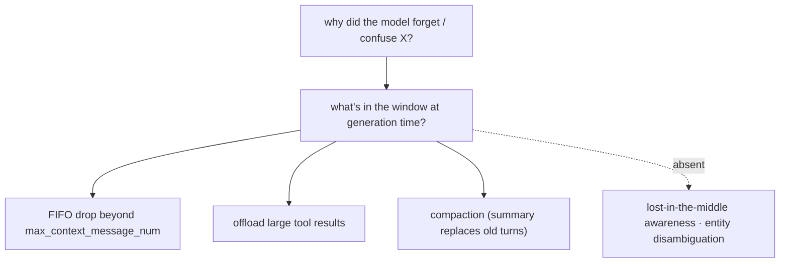
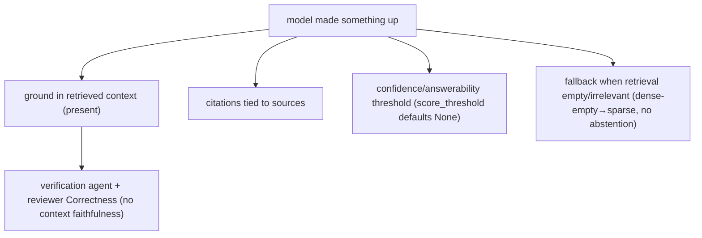
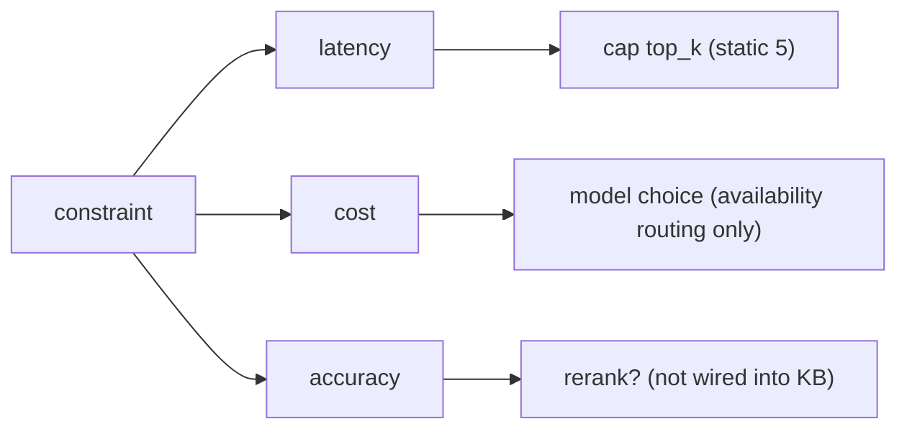
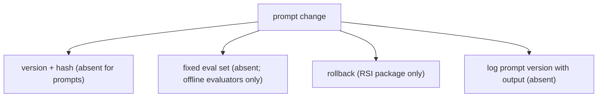
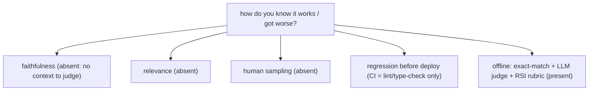
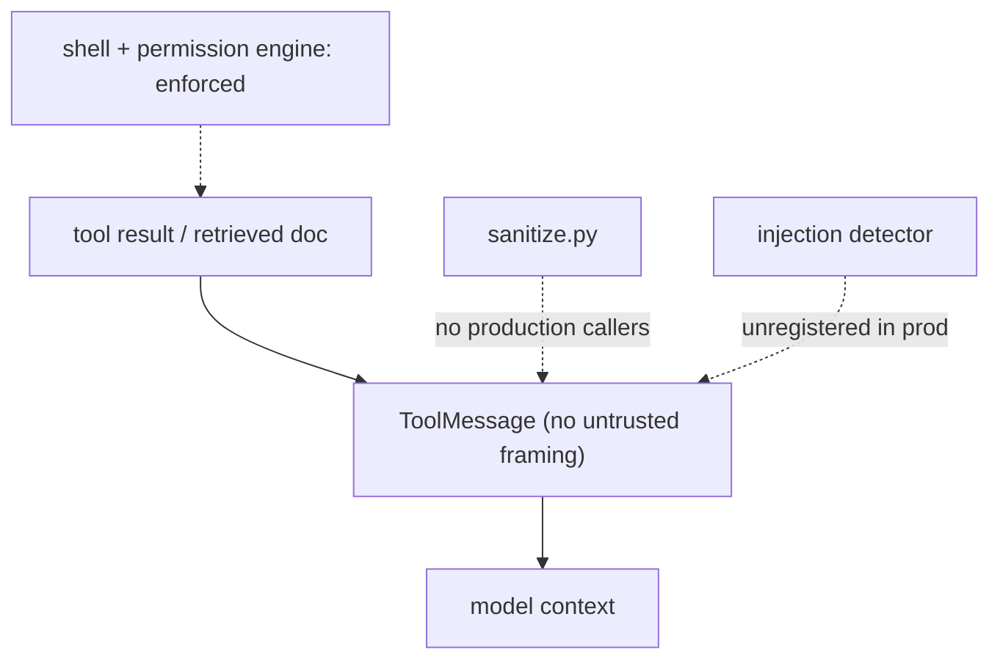

# LLM interview patterns — what's really being tested + how Jiuwen maps

Based on the recurring observations *Patterns I've Noticed in LLM Interview Questions*. Like the AI-engineer patterns doc, this is not a question list; each entry is an interview dynamic — the real concern behind the wording, what a strong answer includes, and the concrete mechanism in this codebase (or the gap).

> **The pattern worth noticing:** there are maybe 6 to 7 real concerns being tested — context handling, hallucination, tradeoffs, cost control, prompt reliability, evaluation, and security. Everything else is the same concern wearing a different scenario as a costume.

See [README](README.md) for the shared conventions (anchor format, repo layers).

---

## 1. "How does the model know X" is really testing context window understanding

**What's being tested:** why the model forgot something earlier, why it mixed up two similar entities, why longer context degrades output — all trace back to what is actually inside the context window at generation time and how attention weights it. The interviewer is checking whether you reason about context *contents*, not model capability.

**What a strong answer includes:** name what is in the window (system prompt, retained turns, retrieved chunks, tool results) and what got dropped/compacted/offloaded; explain positional/attention dilution (lost in the middle); and for entity mix-ups, point at missing entity disambiguation or too-similar surface forms.

**Jiuwen:** The context engine decides what is in the window and how it is trimmed: a strictest-bound budget, offload of large tool results, multi-stage compaction, and a FIFO drop beyond `max_context_message_num`, all biased toward the newest turns. There is no lost-in-the-middle awareness and no entity disambiguation/aliasing.

**Anchors:** &bull; `agent-core/openjiuwen/core/context_engine/context/context_utils.py:20/404` — window resolution &bull; `agent-core/openjiuwen/core/context_engine/processor/budget_guard.py:37` — `effective_context_budget` (strictest) &bull; `agent-core/openjiuwen/core/context_engine/context/message_buffer.py:71` — FIFO drop &bull; `agent-core/openjiuwen/core/context_engine/processor/offloader/tool_result_budget_processor.py:34` — offload threshold &bull; `agent-core/openjiuwen/core/context_engine/processor/compressor/full_compact_processor.py:184` — compaction

## 2. "The model made something up" is testing hallucination handling, not model quality

**What's being tested:** how you ground and verify output — grounding in retrieved context, citations tied to sources, confidence thresholds before generating, and defined fallback when retrieval is empty or irrelevant. The interviewer wants a system answer, not "the model isn't good enough".

**What a strong answer includes:** pass the retrieved context to the generator, require citations, gate on an answerability/score threshold before generating, and define the empty/irrelevant fallback (abstain or ask). Measure faithfulness against the context, not just correctness against a reference.

**Jiuwen:** Grounding is a separate, non-blocking layer: a verification agent (read-only evidence, PASS/FAIL/PARTIAL) and a reviewer `Correctness` dimension. But `score_threshold` defaults to `None`, there is no answerability gate or abstention in the KB path, and no judge receives the retrieved context (no faithfulness score).

**Anchors:** &bull; `agent-core/openjiuwen/harness/rails/subagent/verification_rail.py:92` — `VerificationRail` allowlist &bull; `agent-core/openjiuwen/agent_teams/verification/reviewer.py:43` — `Correctness` dimension &bull; `agent-core/openjiuwen/core/retrieval/common/config.py:47` — `score_threshold` default `None` &bull; `agent-core/openjiuwen/core/retrieval/retriever/vector_retriever.py:83` — dense-empty → sparse fallback &bull; `agent-core/openjiuwen/agent_evolving/evaluator/metrics/llm_as_judge.py:58` — no context input

## 3. Any A-vs-B comparison is testing tradeoff reasoning, not the "right" answer

**What's being tested:** RAG vs. fine-tuning, more vs. fewer retrieved documents, bigger vs. smaller model. The pattern is connecting the decision to a constraint — cost, latency, or accuracy — for that specific use case, not a universal rule. "It depends" without a named constraint is a dodge.

**What a strong answer includes:** state the constraint, the decision it forces, and a number. More docs → recall up, tokens/latency up; bigger model → accuracy up, cost/latency up; rerank a larger candidate set down to a small k to keep recall without paying context cost.

**Jiuwen:** The knobs are static and named: `top_k` defaults to 5, reranking is not in the KB path (so retrieve-many-then-rerank is unavailable), and model allocation is availability-based rather than cost/accuracy-based. Session cost is tracked and capped when the provider reports it.

**Anchors:** &bull; `agent-core/openjiuwen/core/retrieval/common/config.py:46` — `top_k: int = 5` &bull; `agent-core/openjiuwen/core/retrieval/simple_knowledge_base.py:182` — no reranker in KB retrieve &bull; `agent-core/openjiuwen/agent_teams/models/allocator.py:559` — availability strategies &bull; `jiuwenswarm/jiuwenswarm/server/runtime/usage_cost.py:171` — enforced session cost cap

## 4. "The agent is stuck in a loop" is testing production experience

**What's being tested:** max iteration limits per task, token budget caps per step, detecting and killing a failing loop before it burns cost, and retry logic on failed tool calls without infinite recursion. This separates people who have run one from people who have read about one.

**What a strong answer includes:** a hard iteration cap, a per-session/step token or cost budget, repetition detection on canonicalized `(tool, args)`, and bounded retries that never retry non-idempotent tools.

**Jiuwen:** Caps are concrete: ReAct `max_iterations` (5; harness 15), `AgenticRetriever.max_iter` (2, clamped), `ModelAnomalyDetectionRail` (identical tool rounds → compact/abort), `ToolCallDeduplicationRail`, and secure-by-default `idempotent=False` (non-idempotent tools never retried). A session cost cap is enforced when the provider reports cost; a per-step token budget in the task loop is wired but off by default.

**Anchors:** &bull; `agent-core/openjiuwen/core/single_agent/agents/react_agent.py:288` — `max_iterations=5`; `agent-core/openjiuwen/harness/schema/config.py:252` — harness 15 &bull; `agent-core/openjiuwen/core/retrieval/retriever/agentic_retriever.py:133` — `max_iter=2` clamped &bull; `agent-core/openjiuwen/harness/rails/model_anomaly_detection_rail.py:74/90` — loop compact/abort &bull; `agent-core/openjiuwen/core/foundation/tool/base.py:109` — `idempotent` default `False` &bull; `agent-core/openjiuwen/harness/rails/tool_call_resilience_rail.py:128/145` — non-idempotent guard + retry budget &bull; `jiuwenswarm/jiuwenswarm/server/runtime/usage_cost.py:171` — session cost cap

## 5. Any prompt behavior question is secretly a versioning and testing question

**What's being tested:** treating prompts like code (not one-off strings), testing prompt changes against a fixed eval set, a rollback plan when a change degrades output, and tracking which prompt version produced which output in logs.

**What a strong answer includes:** version prompts in source control or a prompt store with an immutable ID/hash, run a fixed eval on every change, gate the deploy, log the prompt version with the output, and be able to roll back in one step.

**Jiuwen:** Prompts are assembled from named `PromptSection`s that carry only name/priority/category (no version/hash); optimization overwrites them in place; `PromptReport` is diagnostics, not versioning. Rollback exists only at the RSI **harness-package** level, and the CI gate has no eval threshold. Logs carry spans but not a prompt-version identifier.

**Anchors:** &bull; `agent-core/openjiuwen/core/single_agent/prompts/builder.py:24` — `PromptSection` (no version); `:219` `build` &bull; `agent-core/openjiuwen/harness/prompts/report.py:38` — `PromptReport` diagnostics &bull; `agent-core/openjiuwen/agent_evolving/checkpointing/manager.py:43` — checkpoint version (operator state) &bull; `jiuwenswarm/jiuwenswarm/agents/harness/common/rsi/harness_activation.py:617` — package-level rollback &bull; `agent-core/openjiuwen/auto_harness/resources/ci_gate.yaml:21` — no eval gate

## 6. "How do you know it's working" is testing evaluation depth

**What's being tested:** faithfulness scoring (does output match retrieved context), relevance scoring (does it answer the query), human eval on a rotating sample, and regression testing before every deploy — not just at launch.

**What a strong answer includes:** a frozen labeled set, stage-level metrics (retrieval recall/NDCG; generation faithfulness/relevance), a CI regression gate with a baseline threshold, periodic human sampling, and production monitoring with drift alerts.

**Jiuwen:** Offline answer-level evaluation exists (`ExactMatchMetric`, `LLMAsJudgeMetric`, RSI rubric, `evaluator_pipeline`), but there is no faithfulness/relevance metric (judges lack the retrieved context), no retrieval metric layer, no CI quality gate (lint/type-check only), no human-sampling pipeline, and no production quality monitoring. The "how would you know it got worse" follow-up exposes real gaps.

**Anchors:** &bull; `agent-core/openjiuwen/agent_evolving/evaluator/metrics/llm_as_judge.py:58` — no context input; `agent-core/openjiuwen/agent_evolving/evaluator/metrics/exact_match.py:12` — exact match &bull; `agent-core/openjiuwen/rsi/harness_rsi/evaluator/judger/scoring.py:193` — weighted rubric &bull; `agent-core/openjiuwen/agent_evolving/evaluator/evaluator_pipeline/pipeline.py:167` — benchmark eval &bull; `agent-core/openjiuwen/auto_harness/resources/ci_gate.yaml:21` — lint/type-check only; `agent-core/pyproject.toml:236` — markers not invoked &bull; `jiuwenswarm/jiuwenswarm/observability/store.py:102` — `has_error` (operations, not quality)

## 7. Any question about untrusted input is testing prompt injection awareness

**What's being tested:** a tool result or retrieved document carrying hidden instructions; treating tool output and retrieved content as data, never as commands; and input sanitization before content reaches the prompt. It rarely sounds like a security question at first, which is the point.

**What a strong answer includes:** delimit and label untrusted content as data, sanitize/strip it, enforce privileged actions outside the model (tool policy, sandbox, egress), and remember that a system-prompt warning is advice, not a control.

**Jiuwen:** Weakest area. Tool results are plain `ToolMessage` with no untrusted-data framing, `sanitize.py` has no production callers, the injection detector is unregistered, and `SafetyPromptRail` is advisory. The real controls are in the shell/permission layer (substitution blocking, AST ASK floor, builtin deny rules).

**Anchors:** &bull; `agent-core/openjiuwen/core/single_agent/ability_manager.py:1612` — `ToolMessage` with no wrapper &bull; `agent-core/openjiuwen/harness/prompts/sanitize.py:20` — no production callers &bull; `agent-core/openjiuwen/core/security/guardrail/builtin.py:60` — `PromptInjectionGuardrail` (unregistered) &bull; `agent-core/openjiuwen/harness/rails/security/prompt_security_rail.py:16` — advisory safety rail &bull; `agent-core/openjiuwen/harness/security/permission_engine/toolguard/tool_policy.py:409` — shell AST ASK floor

---

## Summary: the real concerns behind the costume

| Real concern | Trigger wording | Strong-answer signal | Jiuwen |
|---|---|---|---|
| Context handling | "how does the model know X" | name what's in the window + attention dilution | budget/offload/compact; no lost-in-the-middle |
| Hallucination | "the model made something up" | ground + cite + threshold + empty fallback | verification/reviewer; no answerability gate or faithfulness |
| Tradeoffs | any A-vs-B | constraint → decision → number | static `top_k=5`; availability-only routing |
| Cost control | "agent stuck in a loop" | iteration cap + token budget + no-recursion retry | caps + rails + session cost cap; per-step budget off |
| Prompt reliability | any prompt-behavior question | version + fixed eval + rollback + log version | no prompt versioning/eval gate; package rollback only |
| Evaluation | "how do you know it works" | faithfulness + relevance + regression gate + human sampling | offline answer eval only; no context/faithfulness/CI gate |
| Security | "untrusted input" | treat as data + sanitize + enforce outside model | no untrusted seam; advisory rail; enforced shell/permission |
