# RAG evaluation interview questions — general answers + how Jiuwen does it

Based on the recurring list *The Most Repeated RAG Evaluation Questions in AI Engineer Interviews* (Core Evaluation Concepts; Retrieval Evaluation; Generation Evaluation; Practical Evaluation Setup; Business-Facing Evaluation). Each section heading is the original question.

This is the evaluation companion to the RAG docs, and it is the weakest area of the codebase: **there is no retrieval-quality metric layer at all** (no Recall@k/Precision@k/MRR/NDCG, no faithfulness or hallucination rate, no statistical significance). Where a metric is absent, the general answer carries the weight and the Jiuwen answer says so explicitly and names the closest mechanism. What does exist is a set of evaluators/judges (`agent_evolving`, RSI, Symphony), an online capture-and-score pipeline used for RL, and a diagnostic trajectory store. See [README](README.md) for the shared conventions (answer shape, anchor format, repo layers).

> **The pattern worth noticing:** almost every question is really asking one thing: can you prove your system works, on an ongoing basis, without just eyeballing the output. That skill — building and trusting an eval pipeline — is what separates candidates who've built a RAG demo from candidates who've shipped one.

---

# Core evaluation concepts

## 1. How do you evaluate a RAG system beyond "the answer looks correct"

**General:** Combine automatic metrics (exact match, F1, functional/tests for code), an LLM-as-judge with a rubric for open-ended quality, and human review on a sample. Build a held-out set with representative and adversarial cases, score consistently, and track regressions. Crucially, evaluate retrieval and generation separately so you can localize a failure.

**Jiuwen:** Three quality systems exist. `agent_evolving/evaluator/` provides `DefaultEvaluator`/`MetricEvaluator` with `LLMAsJudgeMetric` and `ExactMatchMetric`. RSI's judge scores weighted `required_behaviors` + `rubric` + `forbidden_behaviors` with per-item evidence and penalties. `symphony/evaluation/` registers a suite of evaluators (`accuracy`, `completeness`, `latency`, …), and `evaluator_pipeline` runs a Docker benchmark emitting `pass_rate`/convergence.

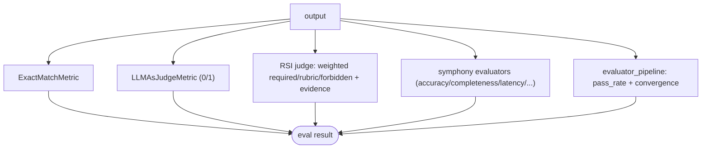
```mermaid
flowchart TD
    OUT["output"] --> M1["ExactMatchMetric"]
    OUT --> M2["LLMAsJudgeMetric (0/1)"]
    OUT --> M3["RSI judge: weighted required/rubric/forbidden + evidence"]
    OUT --> M4["symphony evaluators (accuracy/completeness/latency/...)"]
    OUT --> M5["evaluator_pipeline: pass_rate + convergence"]
    M1 --> AGG(["eval result"])
    M2 --> AGG
    M3 --> AGG
    M4 --> AGG
    M5 --> AGG
```

**Anchors:** &bull; `agent-core/openjiuwen/agent_evolving/evaluator/evaluator.py:82` — `DefaultEvaluator`; `:197` `MetricEvaluator` &bull; `agent-core/openjiuwen/agent_evolving/evaluator/metrics/llm_as_judge.py:47` — judge prompt + result; `agent-core/openjiuwen/agent_evolving/evaluator/metrics/exact_match.py:12` — `ExactMatchMetric` &bull; `agent-core/openjiuwen/rsi/harness_rsi/evaluator/judger/scoring.py:193` — weighted score + penalties; `agent-core/openjiuwen/rsi/harness_rsi/evaluator/judger/llm_as_judge.py:159` `score_judge_output` &bull; `agent-core/openjiuwen/symphony/evaluation/evaluators.py:671` — `BUILTIN_EVALUATORS`; `:438` `AccuracyEvaluator` &bull; `agent-core/openjiuwen/agent_evolving/evaluator/evaluator_pipeline/pipeline.py:167` — `bench.evaluate`; `:668` `_compute_evolution_metrics`

**Gap.** Evaluators are library/CLI components, not a deployed quality dashboard; no cross-system aggregation or statistical significance.

## 2. Faithfulness vs. relevance: why measure both separately

**General:** Relevance asks whether retrieved passages are on-topic for the query (context precision/recall). Faithfulness/groundedness asks whether the answer's claims are actually supported by the retrieved context. A system can retrieve relevant context and still hallucinate, or be perfectly faithful to irrelevant context. Measuring them separately localizes the failure: bad relevance means fix retrieval; good relevance with bad faithfulness means fix grounding.

**Jiuwen:** There is no retrieval-groundedness, faithfulness, attribution, or context-relevance metric. The closest concepts: symphony's `AccuracyEvaluator` judges factual correctness with a rubric about hallucination but does not receive the retrieved context, so it cannot detect unsupported-but-plausible claims; the reviewer rubric lists a `Correctness` dimension ("no hallucination"); and the RSI judge accepts arbitrary `rubric`/`required_behaviors`, so a user could encode a groundedness rule, but none is defined.

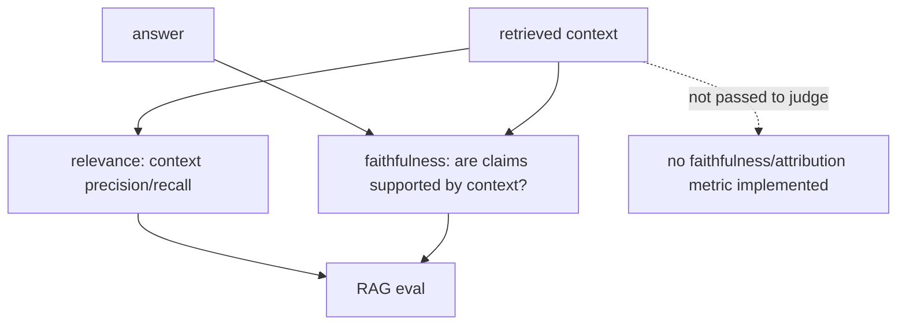
```mermaid
flowchart TD
    CTX["retrieved context"] --> REL["relevance: context precision/recall"]
    ANS["answer"] --> FAITH["faithfulness: are claims supported by context?"]
    CTX --> FAITH
    REL --> JUDGE["RAG eval"]
    FAITH --> JUDGE
    CTX -.->|"not passed to judge"| X["no faithfulness/attribution metric implemented"]
```

**Anchors:** &bull; `agent-core/openjiuwen/symphony/evaluation/evaluators.py:438` — `AccuracyEvaluator` (correctness, no context input); `:560` `Completeness`; `:621` `CapabilitySelection` &bull; `agent-core/openjiuwen/agent_evolving/evaluator/metrics/llm_as_judge.py:58` — parses only `result: true/false`, no context/attribution &bull; `agent-core/openjiuwen/rsi/harness_rsi/evaluator/judger/scoring.py:68` — generic rubric contract (no built-in faithfulness dimension) &bull; `agent-core/openjiuwen/harness/tools/web/free_search.py:299` — "simple relevance checks" (lexical)

## 3. Why evaluate retrieval and generation as two separate stages instead of one end-to-end score

**General:** An end-to-end score tells you "the answer was wrong" but not why. If retrieval missed the document, no generator can fix it; if the document was retrieved but the answer is wrong, the generator (or grounding) is at fault. Stage-level metrics — Recall@k / precision@k / NDCG for retrieval, faithfulness / correctness for generation — let you attribute the failure and fix the right component. End-to-end stays as the final acceptance check.

**Jiuwen:** The stages are structurally separate but also separately un-instrumented. Retrieval (`core/retrieval`) has no quality metric of any kind (no Recall@k/Precision@k/MRR/NDCG). Generation has answer-level judges that do not receive the retrieved context. So the codebase can produce end-to-end grader scores (`evaluator_pipeline` `pass_rate`, RSI weighted score) but cannot say whether a failure was retrieval or generation.

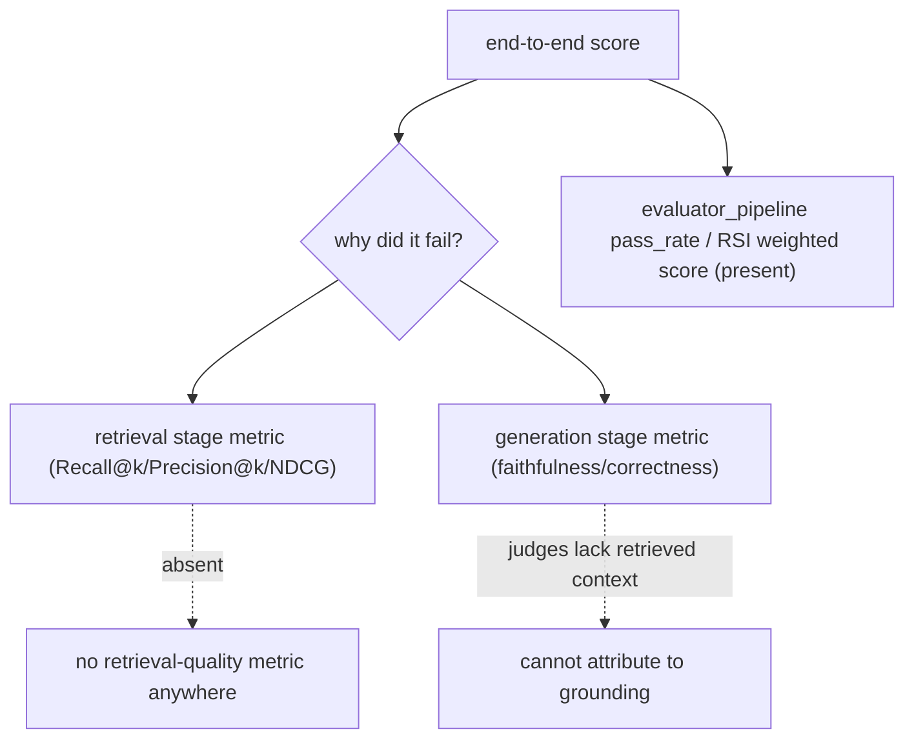
```mermaid
flowchart TD
    E2E["end-to-end score"] --> Q{"why did it fail?"}
    Q --> R["retrieval stage metric (Recall@k/Precision@k/NDCG)"]
    Q --> G["generation stage metric (faithfulness/correctness)"]
    R -.->|"absent"| X["no retrieval-quality metric anywhere"]
    G -.->|"judges lack retrieved context"| Y["cannot attribute to grounding"]
    E2E --> AGG["evaluator_pipeline pass_rate / RSI weighted score (present)"]
```

**Anchors:** &bull; `agent-core/openjiuwen/agent_evolving/evaluator/metrics/base.py:42` — `Metric.compute(prediction, label)`, no ranked-list/k signature &bull; `agent-core/openjiuwen/agent_evolving/evaluator/metrics/__init__.py:11` — exports only `Metric`, `ExactMatchMetric`, `LLMAsJudgeMetric` &bull; `agent-core/openjiuwen/agent_evolving/evaluator/metrics/llm_as_judge.py:47` — judge gets question/expected/answer, not retrieved context &bull; `agent-core/openjiuwen/agent_evolving/evaluator/evaluator_pipeline/pipeline.py:314` — end-to-end `pass_rate` &bull; `agent-core/openjiuwen/rsi/harness_rsi/evaluator/judger/scoring.py:193` — end-to-end weighted score

## 4. How do you evaluate when there's no ground truth answer, only a query and a corpus

**General:** Bootstraps without gold labels: (a) generate synthetic queries from known documents and treat the source document as the gold retrieval target (cheap, works well for retrieval metrics); (b) use an LLM to answer and treat cited passages as relevant (RAGAS-style); (c) judge faithfulness against the retrieved context rather than a reference answer; (d) sample and label by hand a small set to calibrate. The key is that retrieval can be graded with synthetic (query, source-doc) pairs even when answers are unlabeled.

**Jiuwen:** Synthetic dataset generation is largely not runnable. The advertised `rsi/dataset_generator` (`DatasetGenerator`, "model-driven synthetic evaluation dataset generation") exists only as compiled bytecode; its `case_generator`/`task_analyzer`/`coverage_validator` sources are stubs raising `NotImplementedError`, and the harness explicitly "never generates a dataset". The one runnable label-free builder is the PerStream example, which generates QA/memory pairs from source datasets using GPT-4o-mini. There is no query-generation loop tied to the core evaluator.

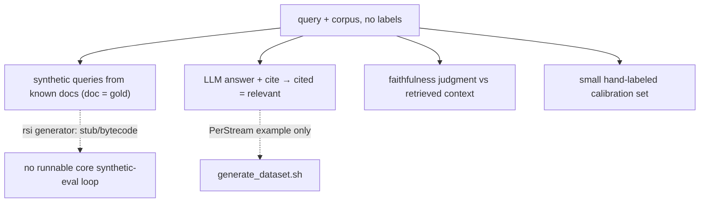
```mermaid
flowchart TD
    CORPUS["query + corpus, no labels"] --> S1["synthetic queries from known docs (doc = gold)"]
    CORPUS --> S2["LLM answer + cite → cited = relevant"]
    CORPUS --> S3["faithfulness judgment vs retrieved context"]
    CORPUS --> S4["small hand-labeled calibration set"]
    S1 -.->|"rsi generator: stub/bytecode"| X["no runnable core synthetic-eval loop"]
    S2 -.->|"PerStream example only"| Y["generate_dataset.sh"]
```

**Anchors:** &bull; `agent-core/openjiuwen/rsi/harness_rsi/single_harness/iterative.py:134` — "never generates a dataset" &bull; `agent-core/examples/PerStream/scripts/generate_dataset.sh:31` — LLM-driven QA/memory generation (example only) &bull; `agent-core/openjiuwen/agent_evolving/evaluator/metrics/llm_as_judge.py:47` — LLM judge usable on unlabeled answers but no context &bull; `agent-core/openjiuwen/rsi/dataset_generator/__pycache__/case_generator.cpython-311.pyc` — `NotImplementedError` stubs (no `.py` source)

---

# Retrieval evaluation

## 5. Recall@k = relevant docs in top k / total relevant docs — what a low score tells you about your embedding model or chunking

**General:** Recall@k is the fraction of relevant documents that appear in the top-k. A low score means retrieval itself is failing — relevant content never reaches the candidate set, so no reranker or prompt can recover it. Diagnose by checking chunking (answer split or lost), embedding fit (domain/language), whether the query and index use the same model, and whether exact-match terms need a sparse leg. Because recall is about coverage, low recall is the most damaging RAG failure.

**Jiuwen:** Recall@k is **absent**. Every "recall" in the repo is a classification or answer-overlap recall, not ranking@k: PerStream's "TA (Recall)" = TP/(TP+FN) over proactive-memory moments, scikit-learn `recall_score` in a gate test, and MANGO token-overlap F1. The generic metric interface is `Metric.compute(prediction, label)` — a pairwise string score with no ranked candidate list or `k`.

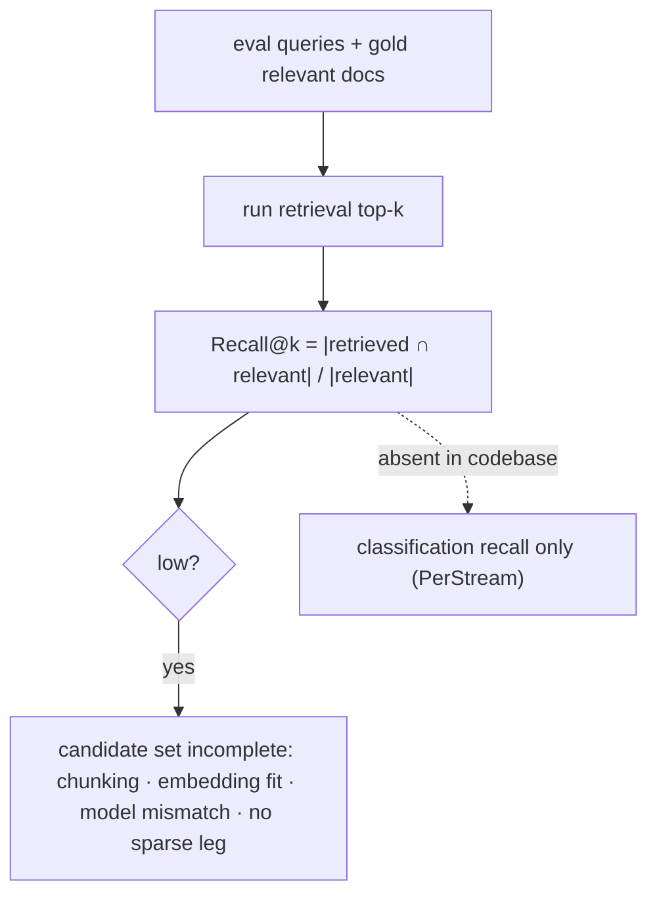
```mermaid
flowchart TD
    Q["eval queries + gold relevant docs"] --> R["run retrieval top-k"]
    R --> M["Recall@k = |retrieved ∩ relevant| / |relevant|"]
    M --> LOW{"low?"}
    LOW -->|yes| DIAG["candidate set incomplete: chunking · embedding fit · model mismatch · no sparse leg"]
    M -.->|"absent in codebase"| X["classification recall only (PerStream)"]
```

**Anchors:** &bull; `agent-core/examples/PerStream/src/eval/score_proactive_judge.py:355` — `get_ta_recall()` = `tp / total_gt_not_nil` (classification, not @k) &bull; `agent-core/examples/PerStream/src/eval/eval_proactive_reduction.py:185` — TA recall from confusion counts &bull; `agent-core/examples/PerStream/src/eval/test_remember_gate.py:22` — sklearn `recall_score` (binary classifier) &bull; `agent-core/openjiuwen/agent_evolving/evaluator/metrics/base.py:42` — `compute(prediction, label)` (no ranked list) &bull; `agent-core/examples/MANGO/training_tg.py:267` — token-overlap "recall" (answer-level)

## 6. Precision@k = relevant docs in top k / k — how it differs from Recall@k, and why both can be low even when the pipeline "looks" fine

**General:** Precision@k is the fraction of the top-k that are relevant; recall@k is the fraction of all relevant docs that were retrieved. They trade off: raising k raises recall but usually lowers precision. Both can be low if the embedding/chunking is wrong (nothing relevant ranked) or if the corpus lacks the answer. "Looks fine" is exactly why you need numbers — a plausible top-3 can still be mostly irrelevant.

**Jiuwen:** Precision@k is **absent**. The only precision present is classification/answer precision: PerStream's "TV (Precision)" = TP/(TP+FP) (how many predicted proactive moments were correct) and sklearn `precision_score` in a gate test. The retrieval stack returns an ordered candidate list and a cross-encoder can re-sort it, but never compares the ordering to graded relevance.

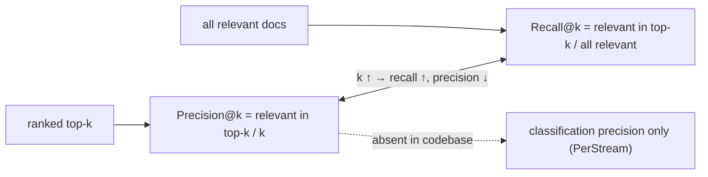
```mermaid
flowchart LR
    R["ranked top-k"] --> P["Precision@k = relevant in top-k / k"]
    G["all relevant docs"] --> RC["Recall@k = relevant in top-k / all relevant"]
    P <-->|"k ↑ → recall ↑, precision ↓"| RC
    P -.->|"absent in codebase"| X["classification precision only (PerStream)"]
```

**Anchors:** &bull; `agent-core/examples/PerStream/src/eval/score_proactive_judge.py:362` — `get_tv_precision()` = `tp / total_pred_not_nil` &bull; `agent-core/examples/PerStream/src/eval/eval_proactive_reduction.py:188` — `tv_precision` &bull; `agent-core/examples/PerStream/src/eval/test_remember_gate.py:22` — sklearn `precision_score` &bull; `agent-core/openjiuwen/core/foundation/store/graph/milvus/milvus_support.py:87` — `rerank(...)` re-sorts, no precision measurement &bull; `agent-core/openjiuwen/agent_evolving/evaluator/metrics/base.py:60` — `compute_batch` zips predictions/labels, no relevance-per-rank

## 7. MRR: average of 1/rank of the first relevant result — when this matters more than Recall@k

**General:** MRR is the mean of `1/rank` of the first relevant result. It matters when the user/system mostly needs the single best hit and the position of the first correct answer is what counts (FAQ lookup, "open the right doc", navigation). Recall@k matters when a set of results is consumed together (context stuffing). MRR ignores everything after the first relevant hit, so it is blind to recall.

**Jiuwen:** MRR is **absent**. Reciprocal rank exists only as Reciprocal Rank Fusion (RRF), a rank-combination algorithm `score += 1/(k+rank)` used to merge retrieval channels — not an evaluation metric. No code path identifies a relevant result or averages `1/rank` over queries.

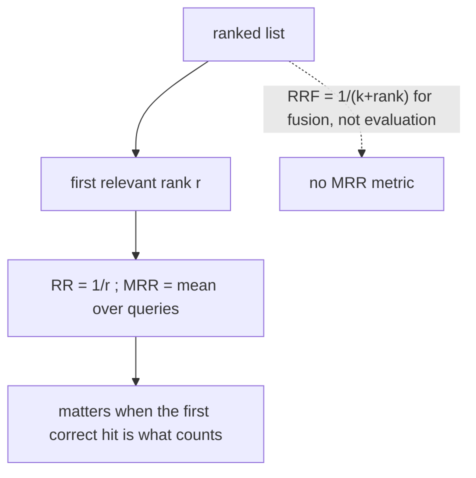
```mermaid
flowchart TD
    R["ranked list"] --> F["first relevant rank r"]
    F --> M["RR = 1/r ; MRR = mean over queries"]
    M --> USE["matters when the first correct hit is what counts"]
    R -.->|"RRF = 1/(k+rank) for fusion, not evaluation"| X["no MRR metric"]
```

**Anchors:** &bull; `agent-core/openjiuwen/core/retrieval/utils/fusion.py:15/20` — RRF fusion (`1/(k+rank)`), not MRR &bull; `agent-core/openjiuwen/agent_evolving/ttse/retrieval.py:76` — `score += 1 / (k + rank)` &bull; `agent-core/openjiuwen/core/foundation/store/graph/result_ranking.py:85` — `RRFRankConfig` &bull; `agent-core/openjiuwen/core/retrieval/vector_store/milvus_store.py:348` — `RRFRanker(k=60)` &bull; `agent-core/openjiuwen/agent_evolving/ttse/config.py:82` — `consult_rrf_k`

## 8. NDCG: weights relevant results by position against an ideal ranking — why position matters beyond "was it retrieved"

**General:** NDCG discounts each relevant result by `log2(rank+1)` and normalizes by the ideal (best-possible) ordering, so it rewards putting the most relevant documents at the top and supports graded relevance (not just binary). It matters when ranking quality — not just presence — drives the user experience, and is the standard metric for reranker comparisons. Recall@k treats all positions within k equally; NDCG does not.

**Jiuwen:** NDCG is **absent** — no discounted cumulative gain, no gain/discount term, and no graded relevance anywhere. Ranking code produces cross-encoder scores and RRF fusion scores used to sort, but never evaluates an ordering against relevance grades.

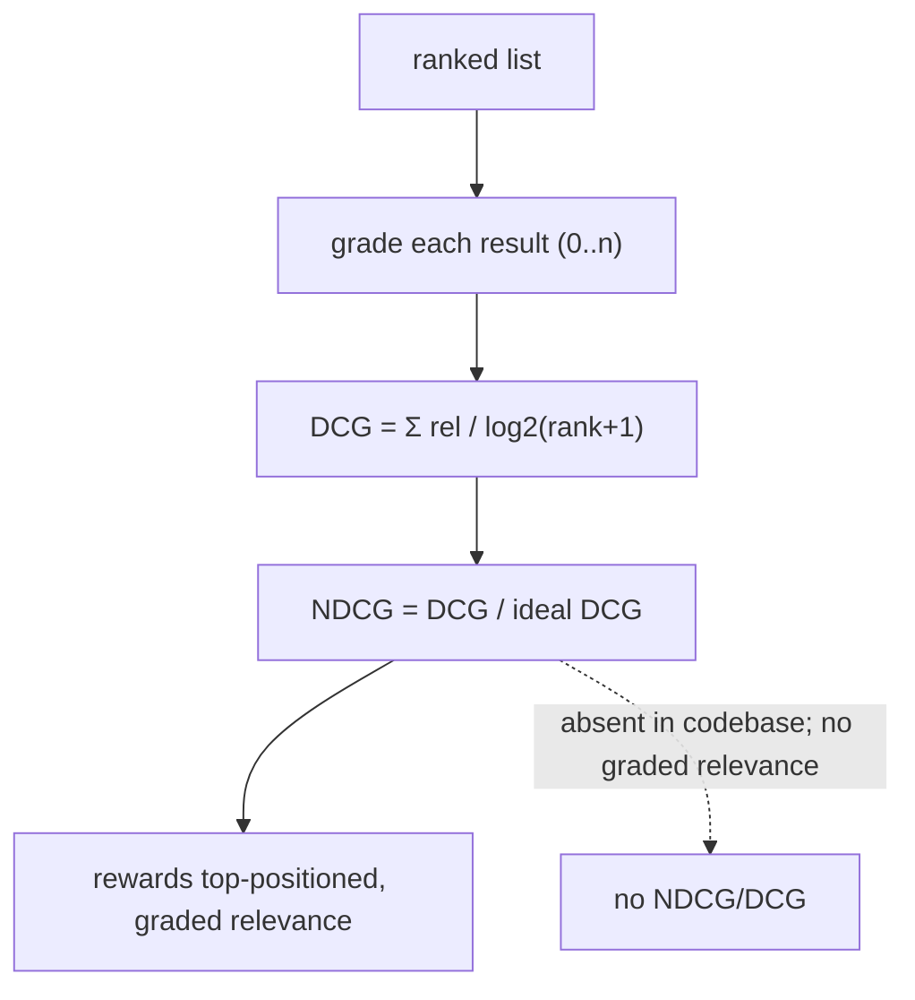
```mermaid
flowchart TD
    R["ranked list"] --> G["grade each result (0..n)"]
    G --> D["DCG = Σ rel / log2(rank+1)"]
    D --> N["NDCG = DCG / ideal DCG"]
    N --> USE["rewards top-positioned, graded relevance"]
    N -.->|"absent in codebase; no graded relevance"| X["no NDCG/DCG"]
```

**Anchors:** &bull; `agent-core/openjiuwen/core/foundation/store/graph/milvus/milvus_support.py:87` — cross-encoder re-rank produces scores, no DCG &bull; `agent-core/openjiuwen/core/foundation/store/graph/result_ranking.py:85` — RRF/WeightedRank configs; no gain/discount &bull; `agent-core/openjiuwen/core/retrieval/utils/fusion.py:20` — RRF only &bull; `agent-core/openjiuwen/agent_evolving/evaluator/metrics/__init__.py:11` — only three metrics exported

## 9. How do you know if your reranker is actually improving results, or just reordering noise, without an A/B test

**General:** You cannot tell from the order alone. Offline, hold out a labeled set of (query, relevant docs) and compare ranking metrics (NDCG@k, MRR, precision@k) with and without the reranker on the same candidate set. If NDCG does not improve, the reranker is reordering noise. Watch for it merely promoting longer/more generic chunks. A/B is better but needs traffic; offline label-based comparison is the first check.

**Jiuwen:** There is a real reranker stack (`StandardReranker`, `ChatReranker`, DashScope) and a cross-encoder re-rank hook in the graph store, but the only before/after evidence is a **manual demo comparison**: `showcase_milvus_graph_store.py` searches twice (`reranker=RERANKER` then `reranker=None`) and `_log_score_comparison` prints per-rank scores, a diff, and min/max ranges. No ground-truth labels, no held-out query set, no metric delta, no significance test.

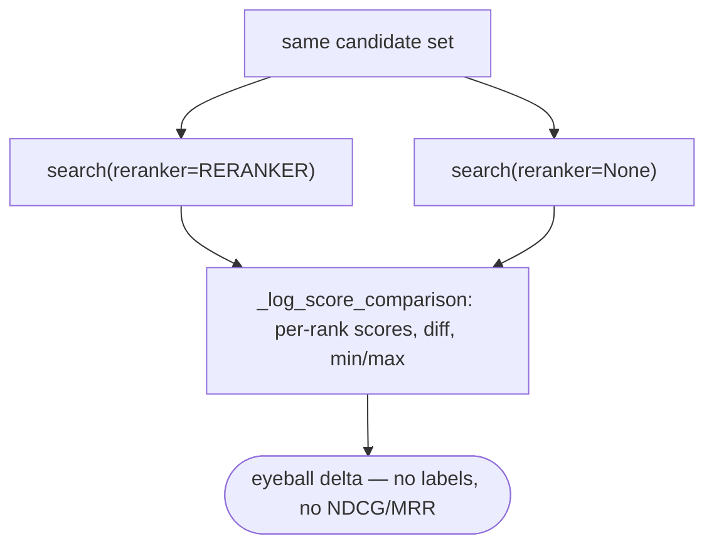
```mermaid
flowchart TD
    CAND["same candidate set"] --> A["search(reranker=RERANKER)"]
    CAND --> B["search(reranker=None)"]
    A --> CMP["_log_score_comparison: per-rank scores, diff, min/max"]
    B --> CMP
    CMP --> R(["eyeball delta — no labels, no NDCG/MRR"])
```

**Anchors:** &bull; `agent-core/examples/store/showcase_milvus_graph_store.py:51` — `_log_score_comparison`; `:217` reranker on; `:240` reranker off &bull; `agent-core/openjiuwen/core/retrieval/reranker/standard_reranker.py:58` — `rerank()` returns `relevance_score` per doc &bull; `agent-core/openjiuwen/core/foundation/store/graph/milvus/milvus_support.py:87` — `_combined_rerank`/`rerank` sorts in place &bull; `agent-core/examples/retrieval/showcase_reranker.py:23` — standalone reranker demo (no baseline)

---

# Generation evaluation

## 10. Measuring hallucination rate: claim extraction from the output, then verification against retrieved context

**General:** Extract atomic claims from the answer, then verify each against the retrieved context (LLM-judge or NLI). Hallucination rate = unsupported claims / total claims (or fraction of answers with any unsupported claim). This is stricter than "is the answer correct": it catches answers that are plausible but not grounded, and it requires passing the retrieved context to the checker.

**Jiuwen:** Claim extraction and verification are **absent**. There is no atomic-claim decomposition, NLI/entailment model, or groundedness/attribution scorer. The closest is the RSI judge, which is instructed to cite concrete evidence and not invent observations, but grades supplied rubric behaviors rather than extracted claims; Symphony's `AccuracyEvaluator` asks an LLM to find factual errors but produces a single score with no claim-level decomposition.

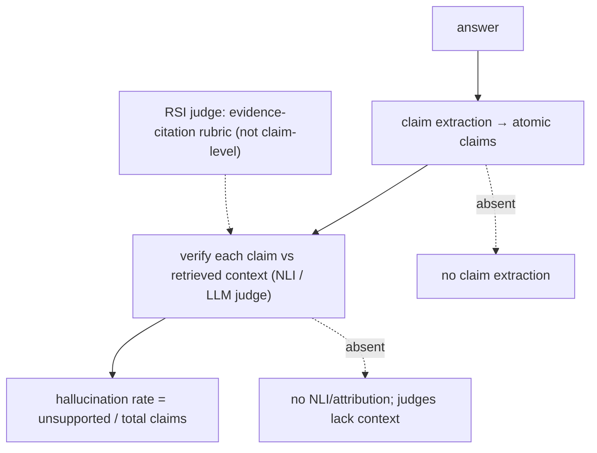
```mermaid
flowchart TD
    ANS["answer"] --> CE["claim extraction → atomic claims"]
    CE --> V["verify each claim vs retrieved context (NLI / LLM judge)"]
    V --> HR["hallucination rate = unsupported / total claims"]
    CE -.->|"absent"| X["no claim extraction"]
    V -.->|"absent"| Y["no NLI/attribution; judges lack context"]
    RSI["RSI judge: evidence-citation rubric (not claim-level)"] -.-> V
```

**Anchors:** &bull; `agent-core/openjiuwen/rsi/harness_rsi/evaluator/judger/judge_prompt.md:61` — "Cite concrete evidence for every verdict… Do not invent observations" &bull; `agent-core/openjiuwen/rsi/harness_rsi/evaluator/judger/judge_evidence.py:90` — `prepare_judge_workspace` (evidence snapshot, no claim checker) &bull; `agent-core/openjiuwen/symphony/evaluation/evaluators.py:438` — `AccuracyEvaluator`; `:447` factual-error rubric &bull; `agent-core/openjiuwen/agent_evolving/evaluator/templates.py:7` — judge compares response vs expected answer (no context)

## 11. Computing faithfulness: decomposing an answer into atomic claims, scoring each against the source with an NLI model or LLM-as-judge

**General:** Faithfulness = supported claims / total claims. Decompose the answer into atomic, verifiable claims; for each, ask an NLI model or LLM judge whether the retrieved source entails it; average. It needs the source context and is claim-level, not answer-level. Low faithfulness with high relevance points at the generator skipping or distorting retrieved evidence.

**Jiuwen:** **Absent.** No judge receives a retrieved source context for faithfulness. `agent_evolving`'s judge template has fields `[Question]`, `[Expected Answer]`, `[Model Response]` with no context/evidence slot; RSI's judge receives task/reference/rubric/evidence artifacts but no retrieval context and does no claim decomposition. Symphony's judge payload can incidentally include the message trace, but it is not a faithfulness pipeline.

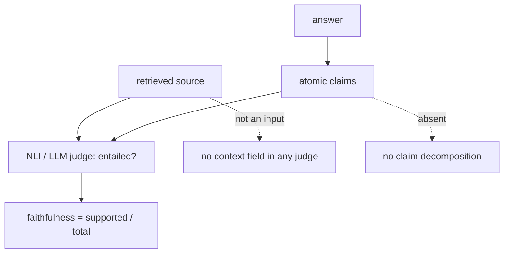
```mermaid
flowchart TD
    ANS["answer"] --> ATOMS["atomic claims"]
    CTX["retrieved source"] --> NLI["NLI / LLM judge: entailed?"]
    ATOMS --> NLI
    NLI --> F["faithfulness = supported / total"]
    CTX -.->|"not an input"| X["no context field in any judge"]
    ATOMS -.->|"absent"| Y["no claim decomposition"]
```

**Anchors:** &bull; `agent-core/openjiuwen/agent_evolving/evaluator/templates.py:32` — template fields `[Question]`/`[Expected Answer]`/`[Model Response]`; no context &bull; `agent-core/openjiuwen/agent_evolving/evaluator/metrics/llm_as_judge.py:47` — prompt formatted with three fields only &bull; `agent-core/openjiuwen/agent_evolving/evaluator/evaluator.py:116` — same three fields &bull; `agent-core/openjiuwen/symphony/evaluation/base.py:336` — redacted fingerprint+case (incidental context) &bull; `agent-core/openjiuwen/symphony/evaluation/evaluators.py:546` — payload filters trace

## 12. Why exact-match scoring fails when a correct answer can be phrased multiple valid ways

**General:** Exact match requires the output string to equal the reference, so "Paris" vs "The capital is Paris" both fail even when correct. It is brittle to wording, formatting, articles, and ordering. Use it only for tasks with a canonical form (classification labels, IDs, single tokens); otherwise use semantic/normalized metrics (LLM judge, embedding similarity, or task-specific parsers).

**Jiuwen:** Two exact-match implementations exist. `ExactMatchMetric` normalizes lowercase/strip/whitespace but still requires full-string equality; RSI's `ExactMatchJudger` is strict `==` with no normalization. The LLM judges cover paraphrase — the `LLMAsJudgeMetric` prompt judges semantic consistency, and PerStream's GPT judge explicitly accepts synonyms/paraphrases — but they are non-deterministic and uncalibrated, and there is no deterministic paraphrase-robust metric (e.g. normalized/embedding similarity).

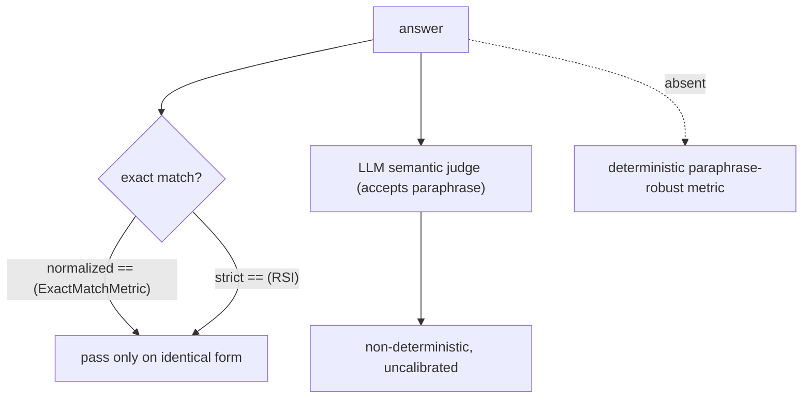
```mermaid
flowchart TD
    ANS["answer"] --> EM{"exact match?"}
    EM -->|"normalized == (ExactMatchMetric)"| OK["pass only on identical form"]
    EM -->|"strict == (RSI)"| OK
    ANS --> LLM["LLM semantic judge (accepts paraphrase)"]
    LLM --> N["non-deterministic, uncalibrated"]
    ANS -.->|"absent"| X["deterministic paraphrase-robust metric"]
```

**Anchors:** &bull; `agent-core/openjiuwen/agent_evolving/evaluator/metrics/exact_match.py:36` — normalized equality; `:40` `_normalize` (lower/strip/collapse) &bull; `agent-core/openjiuwen/rsi/harness_rsi/evaluator/judger/exact_match.py:50` — strict `== expected`; `:30` rejects rubric/files &bull; `agent-core/openjiuwen/agent_evolving/evaluator/metrics/llm_as_judge.py:4` — semantic consistency judge &bull; `agent-core/openjiuwen/symphony/evaluation/evaluators.py:520` — exact-match shortcut then LLM fallback &bull; `agent-core/examples/PerStream/src/eval/score_passive_judge.py:57` — "Consider synonyms or paraphrases as valid matches"

## 13. LLM-as-judge: known failure modes like position bias and self-preference bias

**General:** LLM judges are biased (position/order, verbosity, self-preference), noisy, non-deterministic, and gameable. Mitigations: position-swapping for pairwise judgments, multiple votes, agreement reporting, a human-calibrated golden set, and distinguishing "judge failed" from "answer wrong". A single unvalidated judge score is a weak signal.

**Jiuwen:** All judges are **pointwise** (score one response against a rubric/reference); none does pairwise A/B, so there is no position-swap correction. Symphony's `LLMJudgeEvaluator` issues one call at `temperature=0.0` and validates a binary score. The online-RL `evaluate_judge_scores` runs `num_votes` calls and averages them (variance reduction, not agreement). RSI weights rubric behaviors and forbids self-reported success, but has no bias controls. No inter-rater agreement/kappa, no self-preference detection, no calibration.

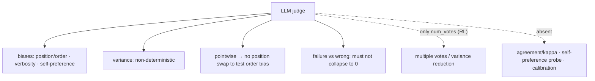
```mermaid
flowchart TD
    J["LLM judge"] --> B["biases: position/order · verbosity · self-preference"]
    J --> V["variance: non-deterministic"]
    J --> P["pointwise → no position swap to test order bias"]
    J --> F["failure vs wrong: must not collapse to 0"]
    J -.->|"only num_votes (RL)"| MULTI["multiple votes / variance reduction"]
    J -.->|"absent"| X["agreement/kappa · self-preference probe · calibration"]
```

**Anchors:** &bull; `agent-core/openjiuwen/symphony/evaluation/base.py:249` — `LLMJudgeEvaluator` single pointwise call; `:401` `temperature=0.0`; `:529` binary score contract &bull; `agent-core/openjiuwen/agent_evolving/agent_rl/online/judge/evaluator.py:66` — `num_votes` gather; `:77` simple average &bull; `agent-core/openjiuwen/rsi/harness_rsi/evaluator/judger/scoring.py:167` — weighted rubric, no bias mitigation &bull; `agent-core/openjiuwen/rsi/harness_rsi/evaluator/judger/llm_as_judge.py:120` — one retry, "never best-of scoring" &bull; `agent-core/openjiuwen/agent_evolving/evaluator/metrics/llm_as_judge.py:53` — single call, exception → `0.0`

---

# Practical evaluation setup

## 14. How would you build an eval dataset from scratch if you don't have one yet

**General:** Mine queries from real logs or user questions, then label relevance by (a) synthetic queries generated from known documents (the document is the gold target), (b) LLM answering and treating cited chunks as relevant, or (c) a small hand-labeled calibration set. Start small (50–200 queries), cover query types including exact-match and multi-hop, and iterate. For retrieval you can bootstrap (query, source-doc) pairs with no answer labels at all.

**Jiuwen:** The advertised `rsi/dataset_generator` is not runnable source: `DatasetGenerator` exists only as compiled bytecode, and `case_generator`/`task_analyzer`/`coverage_validator` are stubs raising `NotImplementedError`; the harness "never generates a dataset". The one runnable label-free builder is the PerStream example (`generate_dataset.sh` → GPT-4o-mini QA/memory generation). There is no query-generation loop integrated with the core evaluator.

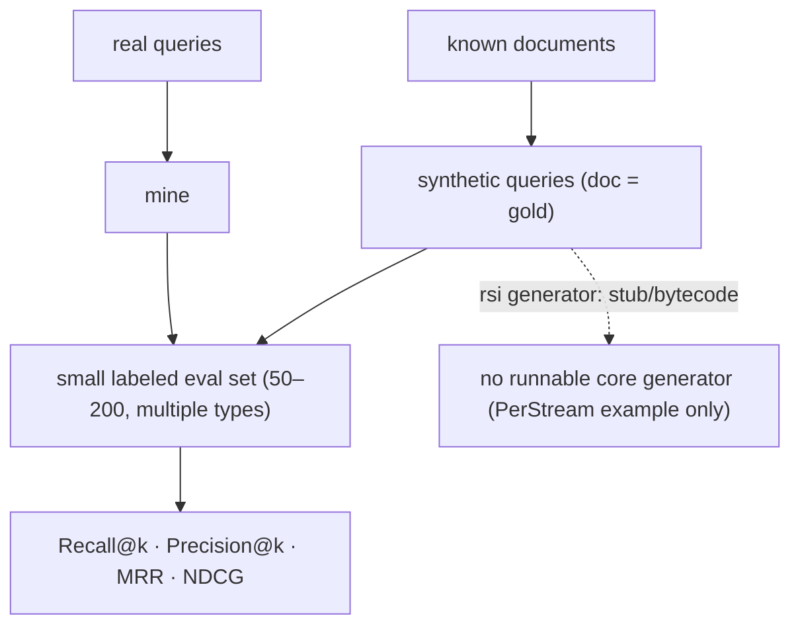
```mermaid
flowchart TD
    LOGS["real queries"] --> MINE["mine"]
    DOCS["known documents"] --> SYN["synthetic queries (doc = gold)"]
    MINE --> SET["small labeled eval set (50–200, multiple types)"]
    SYN --> SET
    SET --> MET["Recall@k · Precision@k · MRR · NDCG"]
    SYN -.->|"rsi generator: stub/bytecode"| X["no runnable core generator (PerStream example only)"]
```

**Anchors:** &bull; `agent-core/openjiuwen/rsi/harness_rsi/single_harness/iterative.py:134` — "never generates a dataset" &bull; `agent-core/examples/PerStream/scripts/generate_dataset.sh:31` — LLM-driven QA/memory generation (example) &bull; `agent-core/openjiuwen/rsi/dataset_generator/__pycache__/case_generator.cpython-311.pyc` — `NotImplementedError` stubs (no source) &bull; `agent-core/openjiuwen/agent_evolving/evaluator/metrics/base.py:42` — metric interface lacks ranked-list eval

## 15. How many examples before eval results are statistically meaningful, not just noise

**General:** It depends on the effect size and metric variance. As a rule of thumb, ~100–200 examples give a usable signal for a common metric, but if you are comparing two systems you need enough to detect the delta above noise — report confidence intervals (bootstrap) and use paired significance tests on the same examples. For rare events (e.g. hallucination) you need far more, and minority-slice analysis needs hundreds per slice. Never quote a bare average without an error bound.

**Jiuwen:** There is no statistical reasoning. The closest construct is Symphony's `_confidence(sample_count)`, which buckets counts into qualitative labels (0→NONE, 1→LOW, <10→NORMAL, ≥10→HIGH) — a hard-coded heuristic, not a confidence interval. Aggregation reports `sample_count` and pass/fail counts but computes no standard error, bootstrap, or significance test.

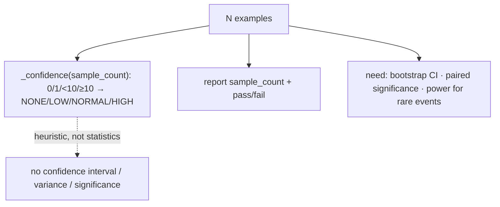
```mermaid
flowchart TD
    N["N examples"] --> C["_confidence(sample_count): 0/1/<10/≥10 → NONE/LOW/NORMAL/HIGH"]
    N --> AGG["report sample_count + pass/fail"]
    N --> NEED["need: bootstrap CI · paired significance · power for rare events"]
    C -.->|"heuristic, not statistics"| X["no confidence interval / variance / significance"]
```

**Anchors:** &bull; `agent-core/openjiuwen/symphony/evaluation/suite.py:560` — `_confidence(sample_count)` heuristic; `:362` `sample_count` attached &bull; `agent-core/openjiuwen/rsi/harness_rsi/evaluator/metrics_collector.py:34` — `total_cases`/`passed_cases`/`average_score` (no variance/CI) &bull; `agent-core/openjiuwen/symphony/orchestration/config.py:50` — `min_successes_verified` (threshold, not statistics) &bull; `agent-core/openjiuwen/symphony/retrieval/build/tree/schema.py:232` — `structure_sample_size` (sampling config)

## 16. Evaluating continuously in production, not just once before launch

**General:** Sample live traffic, score it on a schedule or on feedback, and alert on quality drops — separate from error/latency monitoring. Look for drift in query distribution and retrieval hit rates, track online metrics (thumbs, task success, escalation), and periodically re-run the offline suite on fresh data. The goal is to detect degradation before users report it.

**Jiuwen:** There is a live capture-and-score path, but it serves **online RL training, not quality monitoring**: `CapturePipeline` stages each production completion and a judge later attaches an LLM score or user reward, persisting to a trajectory sample store. The product writes all spans into a per-session SQLite trajectory store (diagnostic, 7-day retention) for replay. There is no drift detection, no eval traffic-sampling policy, no dashboard, and no quality alert.

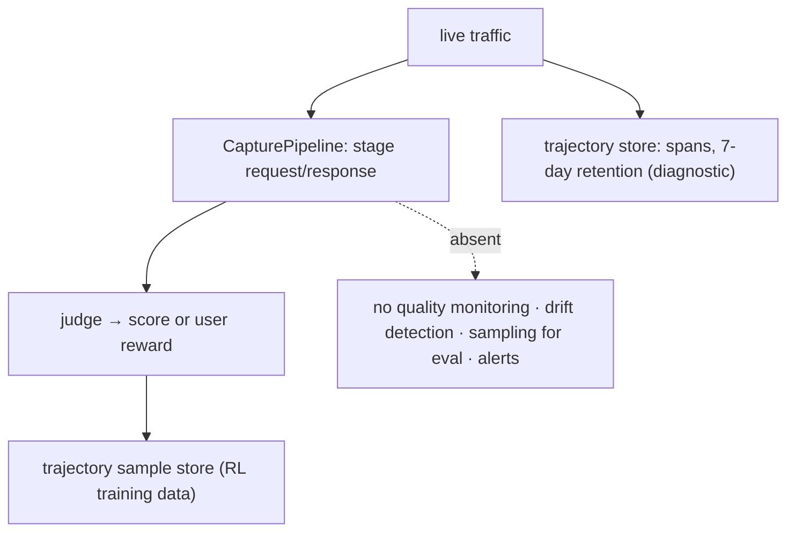
```mermaid
flowchart TD
    LIVE["live traffic"] --> CAP["CapturePipeline: stage request/response"]
    CAP --> JUD["judge → score or user reward"]
    JUD --> STORE["trajectory sample store (RL training data)"]
    LIVE --> TRJ["trajectory store: spans, 7-day retention (diagnostic)"]
    CAP -.->|"absent"| X["no quality monitoring · drift detection · sampling for eval · alerts"]
```

**Anchors:** &bull; `agent-core/openjiuwen/agent_evolving/agent_rl/online/capture_pipeline.py:59` — `CapturePipeline`; `:73` before; `:110` after; `:170` `submit_reward` &bull; `agent-core/openjiuwen/agent_evolving/agent_rl/online/gateway/trajectory/judge_dispatcher.py:30` — flush + judge on follow-up/session end &bull; `agent-core/openjiuwen/agent_evolving/agent_rl/online/judge/judge_scorer.py:28` — live LLM judge score &bull; `jiuwenswarm/jiuwenswarm/observability/store.py:304` — `TrajectoryStore`; `:307` 7-day retention (diagnostic) &bull; `jiuwenswarm/jiuwenswarm/observability/sink.py:578` — `TrajectorySessionSinkRouter`; `jiuwenswarm/jiuwenswarm/observability/runtime.py:69` — runtime &bull; `agent-core/openjiuwen/harness/observability/rail.py:355` — span emission

## 17. Catching a regression after a chunking or prompt change, before users notice, using a fixed regression suite

**General:** Keep a fixed, versioned eval suite (queries + expected retrieval targets/metrics) and run it on every change to chunking, embeddings, prompts, or models. Store a baseline and fail the build when a metric drops beyond a threshold; add golden/snapshot tests for prompts and outputs. This is what turns an eval script into a regression gate.

**Jiuwen:** The CI gate is real but runs **only static checks**: `ci_gate.yaml` defines exactly `lint` and `type-check`, executed by `CIGateRunner`; there is no pytest or quality gate and no CI workflow file in the repo. The pytest `level0`/`level1` markers label tests but nothing invokes them. Offline quality machinery exists inside `agent_evolving` (`Trainer` best-score gating, `evaluator_pipeline` pass-rate), but it is a benchmark optimization loop, not a fixed suite guarding prompt/chunking changes.

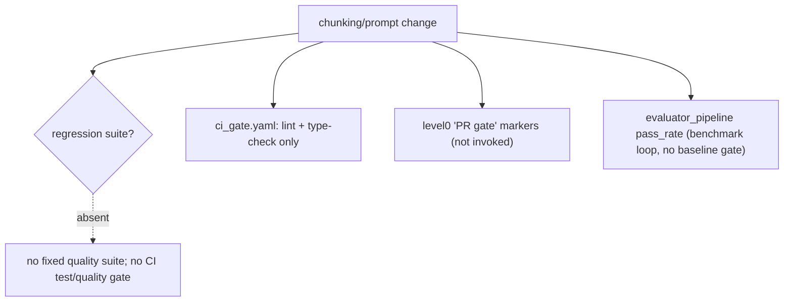
```mermaid
flowchart TD
    PR["chunking/prompt change"] --> G{"regression suite?"}
    G -.->|"absent"| X["no fixed quality suite; no CI test/quality gate"]
    PR --> CI["ci_gate.yaml: lint + type-check only"]
    PR --> L0["level0 'PR gate' markers (not invoked)"]
    PR --> EV["evaluator_pipeline pass_rate (benchmark loop, no baseline gate)"]
```

**Anchors:** &bull; `agent-core/openjiuwen/auto_harness/resources/ci_gate.yaml:21` — gates are only `lint` and `type-check` &bull; `agent-core/openjiuwen/auto_harness/infra/ci_gate_runner.py:147` — `CIGateRunner`; `:1153` `run()` &bull; `agent-core/pyproject.toml:236` — `level0`/`level1` markers ("PR gate must stay green") &bull; `agent-core/openjiuwen/agent_evolving/trainer/trainer.py:217` — `improved = val_score > progress.best_score` &bull; `agent-core/openjiuwen/agent_evolving/evaluator/evaluator_pipeline/pipeline.py:314` — stops when `eval_result.passed`; `agent-core/openjiuwen/agent_evolving/evaluator/evaluator_pipeline/models.py:101` `EvalResult(passed, pass_rate)`

---

# Business-facing evaluation

## 18. Tying an eval metric back to a business outcome a stakeholder actually cares about

**General:** Translate model quality into the business proxy it moves: task success rate, deflection/containment, time-to-resolution, conversion, retention, or cost-per-resolution. Build a labeled bridge — correlate your offline metric with the business KPI on a sample — and report both. A metric no stakeholder can act on will not survive budget season; pick one that maps to money or time saved.

**Jiuwen:** Metrics here are engineering/task-completion, not business KPIs. `GoalEvaluator` scores whether an agent objective is `complete`/`blocked`; `SuccessDetector` maps a task to `success/partial/fail`; `evaluator_pipeline`/team verification aggregate `pass_rate`/`avg_score`. The only stakeholder-adjacent signal is **cost**: per-session tracking with an optional limit (`CostLimitExceededError`). There is no conversion, retention, engagement, or user-satisfaction mapping.

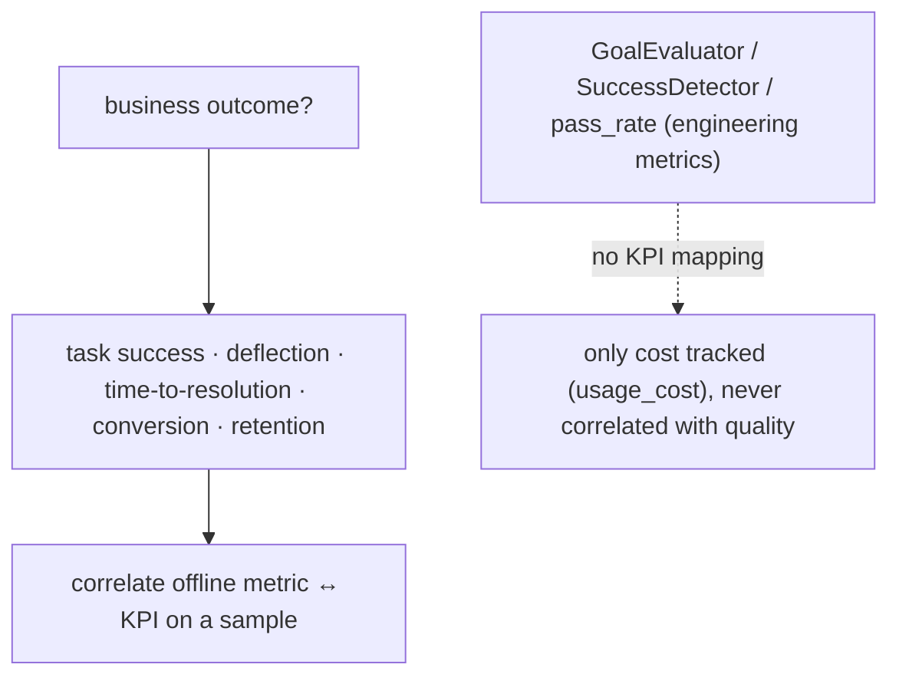
```mermaid
flowchart TD
    Q["business outcome?"] --> KPI["task success · deflection · time-to-resolution · conversion · retention"]
    KPI --> BRIDGE["correlate offline metric ↔ KPI on a sample"]
    EVAL["GoalEvaluator / SuccessDetector / pass_rate (engineering metrics)"] -.->|"no KPI mapping"| X["only cost tracked (usage_cost), never correlated with quality"]
```

**Anchors:** &bull; `agent-core/openjiuwen/harness/goal/evaluation.py:74` — `GoalEvaluator` (goal completion) &bull; `agent-core/openjiuwen/agent_evolving/ttse/success.py:267` — `SignalBasedSuccessDetector` (`success/partial/fail`); `:92` `classify_explicit_score` &bull; `agent-core/openjiuwen/agent_evolving/evaluator/evaluator_pipeline/base.py:232` — `aggregate()` &bull; `agent-core/openjiuwen/agent_teams/verification/memory.py:160` — aggregates `pass_rate`/`avg_score` &bull; `jiuwenswarm/jiuwenswarm/server/runtime/usage_cost.py:32` — cost settings; `:65` `CostLimitExceededError`

## 19. High eval scores but users still complaining — what does that gap tell you about your eval set

**General:** The gap means the eval set does not represent real usage: too-easy or synthetic queries, no adversarial or long-tail cases, missing slices (language, domain, intent), a metric that rewards style over usefulness, or unmeasured dimensions (latency, verbosity, tone, refusals). The fix is to mine real complaints/failed sessions for queries, add them to the set, and re-baseline — the eval set is a moving target aligned to production.

**Jiuwen:** Feedback capture is partial, so the gap is not detectable in-product. Explicit like/dislike exists only for **proactive recommendations** (`feedback_collector.record_feedback`); for normal chat, feedback is inferred (an LLM classifying whether a user message is corrective, and the online-RL judge consuming the next user turn as feedback). Session tracking records runtime outcome (`succeeded/failed/waiting_user`), which is execution success, not answer quality. There is no general thumbs-up/down or satisfaction signal to reconcile against eval scores.

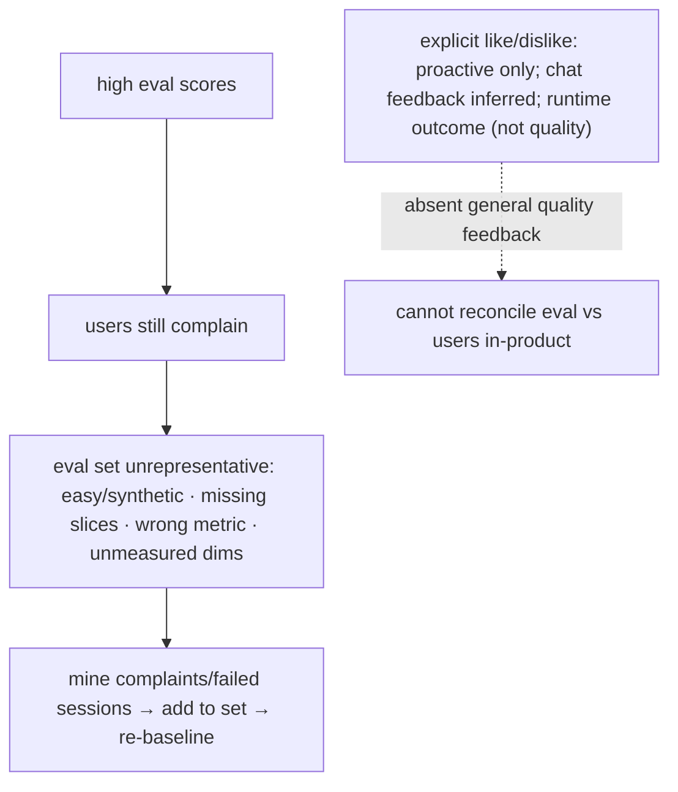
```mermaid
flowchart TD
    HIGH["high eval scores"] --> GAP["users still complain"]
    GAP --> WHY["eval set unrepresentative: easy/synthetic · missing slices · wrong metric · unmeasured dims"]
    WHY --> MINE["mine complaints/failed sessions → add to set → re-baseline"]
    FB["explicit like/dislike: proactive only; chat feedback inferred; runtime outcome (not quality)"] -.->|"absent general quality feedback"| X["cannot reconcile eval vs users in-product"]
```

**Anchors:** &bull; `jiuwenswarm/jiuwenswarm/agents/harness/common/recommendation/feedback_collector.py:47` — `record_feedback` (explicit, proactive only); `jiuwenswarm/jiuwenswarm/common/schema/message.py:141` — `PROACTIVE_FEEDBACK` &bull; `agent-core/openjiuwen/agent_evolving/signal/from_conv.py:327` — `detect_user_intent` infers corrective feedback &bull; `agent-core/openjiuwen/agent_evolving/agent_rl/online/judge/evaluator.py:39` — judge takes `followup_user_feedback`; `agent-core/openjiuwen/agent_evolving/agent_rl/online/gateway/trajectory/judge_dispatcher.py:30` &bull; `jiuwenswarm/jiuwenswarm/server/agent_ws_server.py:544` — `_TurnOutcomeTracker` (runtime outcome) &bull; `agent-core/openjiuwen/agent_evolving/signal/review_feedback.py:117` — `ReviewFeedbackAttributor`

---

## Summary: strong vs weak in Jiuwen

| Area | Strength | Notes |
|---|---|---|
| End-to-end output evaluation | Strong | exact-match + LLM-judge + RSI rubric + Symphony evaluators + benchmark pipeline |
| Faithfulness vs relevance | Weak | absent; judges do not receive retrieved context |
| Stage-separated eval (retrieval vs generation) | Weak | retrieval has no quality metric; judges cannot attribute grounding |
| Label-free eval bootstrapping | Weak | `rsi` generator is stub/bytecode; only the PerStream example is runnable |
| Recall@k | Weak | absent; only classification recall (PerStream) |
| Precision@k | Weak | absent; only classification precision |
| MRR | Weak | absent; RRF fusion is not the metric |
| NDCG | Weak | absent; no graded relevance |
| Reranker before/after evidence | Weak | demo score-delta only; no labels/metrics |
| Hallucination rate (claim extraction) | Weak | absent; no claim decomposition/NLI |
| Claim-level faithfulness | Weak | absent; no context passed to any judge |
| Exact-match vs paraphrase | Mixed | exact match present (brittle); LLM judge handles paraphrase but uncalibrated |
| LLM-judge rigor | Weak | pointwise only; no position-swap/agreement/calibration; failures → 0.0 |
| Eval dataset from scratch | Weak | no runnable core generator; PerStream example only |
| Statistical significance | Weak | `_confidence` count-bucket heuristic; no CI/bootstrap/significance |
| Continuous production eval | Mixed | live capture + judge exists, but for RL training; no quality monitoring/drift/alerts |
| Regression suite / CI gate | Weak | CI gate is lint/type-check only; `level0` markers not invoked |
| Business KPI tie | Weak | goal/task-success + cost only; no conversion/retention mapping |
| Eval-vs-user gap detection | Weak | proactive feedback only; chat feedback inferred; runtime outcome ≠ quality |
