# RAG interview questions (Part 1) — general answers + how Jiuwen does it

Based on the recurring list *The Most Repeated RAG Questions in AI Engineer Interviews* (Architecture and Pipeline; Chunking and Embedding; Retrieval Quality; Failure Modes; Scale and Production; Evaluation). This is the companion to the advanced *RAG interview questions (Part 2)* set.

Most questions here repeat across the other RAG docs, so their **General** and **Jiuwen** answers are reused verbatim (with the same anchors). The new ground in this set is Modular RAG (Q3), how many documents to retrieve (Q4), and detecting retrieval-quality degradation over time (Q16). See [README](README.md) for the shared conventions (answer shape, anchor format, repo layers).

> **The pattern worth noticing:** almost every question traces back to one of three things: retrieval quality, chunking strategy, or evaluation. If you can speak fluently about all three with a concrete example, you can handle nearly any RAG question phrased a different way.

---

# Architecture and pipeline

## 1. Walk me through a RAG pipeline end to end, from user query to final answer

**General:** Ingest: parse → chunk → embed → index. Query: embed the query → retrieve top-k (dense and/or sparse) → rerank → assemble the retrieved context into the prompt → generate → optionally cite. Each stage is separable; failures and quality drops can occur at any of them.

**Jiuwen:** Ingestion: `KnowledgeBase.parse_files` (parser), then `SimpleKnowledgeBase.add_documents` calls `chunker.chunk_documents`, builds an `IndexConfig`, and `Indexer.build_index` computes embeddings via `compute_chunk_embeddings` and writes them to the vector store. Query: `SimpleKnowledgeBase.retrieve` lazily instantiates `VectorRetriever`/`SparseRetriever`/`HybridRetriever` by `index_type`, embeds the query, and calls `vector_store.search`. The production end-to-end wiring is the workflow `KnowledgeRetrievalComponent`, which returns `results`/`context`; a downstream `LLMComponent` formats them into the prompt.

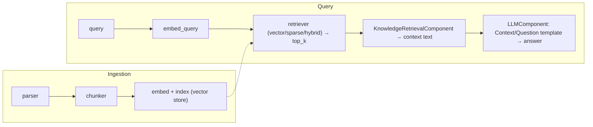

<sub>**Anchors:**<br>&bull; `agent-core/openjiuwen/core/retrieval/simple_knowledge_base.py:96` — `chunk_documents`; `:110` `build_index(...)`; `:182` delegate to retriever<br>&bull; `agent-core/openjiuwen/core/retrieval/indexing/indexer/embed_chunks.py:46/73` — `embed_documents` / `embed_multimodal`<br>&bull; `agent-core/openjiuwen/core/retrieval/retriever/vector_retriever.py:78` — `embed_query` → `vector_store.search`<br>&bull; `agent-core/openjiuwen/core/workflow/components/resource/knowledge_retrieval_comp.py:109` — `retrieve_multi_kb_with_source(...)`; `:243` joins texts into `context`<br>&bull; `agent-core/openjiuwen/core/workflow/components/llm/llm_comp.py:654` — template format feeding `{{context}}`/`{{query}}`</sub>

## 2. What's the difference between RAG and fine-tuning, and when would you choose each

**General:** RAG supplies knowledge at query time by retrieving passages into the prompt — cheap to update, auditable, citable, and it scales to corpora larger than any window, but it costs tokens per call and cannot change behavior/style. Fine-tuning changes weights to teach behavior, format, tone, or a reasoning pattern, and can compress a long prompt into the model, but it is expensive, slow to iterate, cannot cite, and is a poor fit for volatile facts. Use RAG for knowledge, fine-tuning for behavior; often both.

**Jiuwen:** The repo separates the two capabilities: `core/retrieval` (knowledge at query time) and `agent_evolving/agent_rl` (optional LoRA/SFT weight tuning). The design rationale argues against fine-tuning on bad cases because cost is high and the fix cycle is tied to the model's fine-tuning version; the default alternative is prompt/instruction optimization. There is no explicit RAG-vs-fine-tune decision doc.

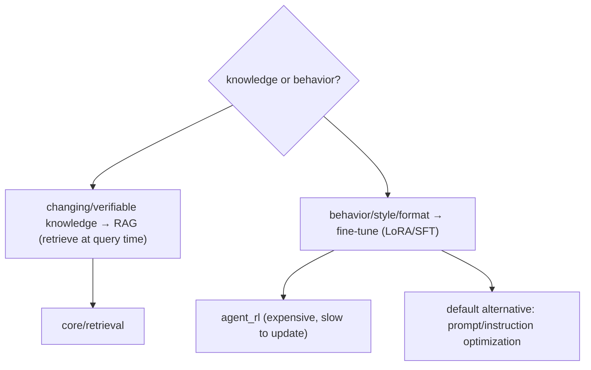

<sub>**Anchors:**<br>&bull; `agent-core/openjiuwen/core/retrieval/retriever/vector_retriever.py:78` — retrieval path<br>&bull; `agent-core/openjiuwen/agent_evolving/agent_rl/online/backends/sft/trainer.py:44` — weight-tuning path (LoRA/SFT)<br>&bull; `agent-core/openjiuwen/agent_evolving/optimizer/llm_call/instruction_optimizer.py:30` — default prompt-optimization alternative<br>&bull; `agent-core/openjiuwen/agent_evolving/trainer/trainer.py:241` — candidate prompt updates, keep best</sub>

## 3. What is Modular RAG, and how is it different from a simple RAG pipeline

**General:** A simple RAG pipeline is a fixed linear chain (retrieve → stuff → generate). Modular RAG decomposes it into interchangeable modules — indexing, retrieval, fusion, reranking, query rewriting, generation, orchestration — with routing and scheduling, so you can swap or add modules (rewrite, rerank, iterative/multi-hop retrieval) and branch conditionally per query. It is "RAG as a configurable graph of components" rather than one hardcoded path. The cost is more moving parts and the need for a router/orchestrator.

**Jiuwen:** The building blocks are modular and pluggable: parsers self-register by extension, chunkers are selected from a registry, retrievers are chosen by `index_type`, the vector store comes from a factory, rerankers and query rewriters are swappable classes, and `RetrievalConfig.agentic` toggles the LLM-driven iterative retriever. But the modules are composed **manually** via config/KB construction — there is no per-query router/scheduler that assembles a module graph, and `AgenticRetriever` derives its mode from `index_type` rather than planning.

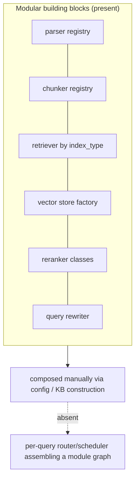

<sub>**Anchors:**<br>&bull; `agent-core/openjiuwen/core/retrieval/indexing/processor/parser/auto_file_parser.py:21` — parser registry by extension<br>&bull; `agent-core/openjiuwen/core/retrieval/indexing/processor/chunker/__init__.py:117` — chunker registry<br>&bull; `agent-core/openjiuwen/core/retrieval/simple_knowledge_base.py:141` — retriever selection by `index_type`; `:172` agentic wrap toggle<br>&bull; `agent-core/openjiuwen/core/retrieval/vector_store/store.py:16` — vector store factory; `agent-core/openjiuwen/core/retrieval/common/config.py:67` — `StoreType`<br>&bull; `agent-core/openjiuwen/core/retrieval/reranker/standard_reranker.py:23` — swappable reranker<br>&bull; `agent-core/openjiuwen/core/retrieval/query_rewriter/query_rewriter.py:412` — query rewriter module<br>&bull; `agent-core/openjiuwen/core/retrieval/common/config.py:51` — `agentic` toggle</sub>

## 4. How do you decide between retrieving 5 documents versus 20

**General:** It is a recall-vs-precision/token/latency tradeoff. Retrieve more when the question is multi-part, aggregative, or high-stakes and recall matters; fewer when answers are localized and you want precision and low token cost. The robust pattern is retrieve a larger candidate set (e.g. 20–50), rerank to a small k (3–5), and pass only the reranked top-k to the generator — so you keep recall without paying context cost. Tune k on an eval set; do not hardcode a gut number.

**Jiuwen:** `top_k` is a static config (default 5) with no adaptive or cost-aware policy, and `score_threshold` defaults to `None`. There is no rerank-to-K lever in the KB path (rerankers are wired only in the graph store), and the assembled context is not token-budgeted. So "retrieve 20, rerank to 5" is not available out of the box; you would set `top_k` directly and accept the untrimmed context.

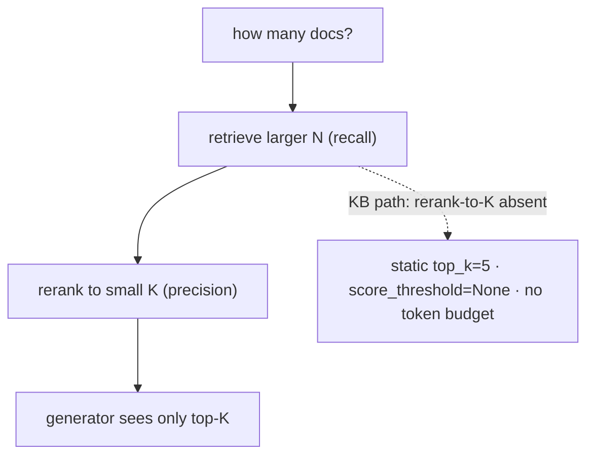

<sub>**Anchors:**<br>&bull; `agent-core/openjiuwen/core/retrieval/common/config.py:46` — `top_k: int = 5`; `:47` `score_threshold` default `None`<br>&bull; `agent-core/openjiuwen/core/retrieval/retriever/hybrid_retriever.py:64` — threshold honored only in `mode="vector"`<br>&bull; `agent-core/openjiuwen/core/retrieval/simple_knowledge_base.py:182` — KB path calls no reranker<br>&bull; `agent-core/openjiuwen/core/workflow/components/resource/knowledge_retrieval_comp.py:241` — context concatenated unbounded</sub>

---

# Chunking and embedding

## 5. How do you choose chunk size when splitting documents for retrieval

**General:** Size trades context against precision: too small and chunks lack context (and the answer may split across chunks); too large and a chunk covers many topics, diluting the embedding and wasting prompt budget. Practical defaults are a few hundred tokens with modest overlap, tuned on a retrieval eval. Size is measured in tokens the model sees.

**Jiuwen:** `Chunker.__init__` validates `chunk_size > 0`, `0 <= chunk_overlap`, and `chunk_overlap < chunk_size`, raising typed errors otherwise. `CharSplitter` clamps overlap and size; token chunkers clamp `chunk_size` to the tokenizer's `model_max_length` (65536 fallback). Milvus declares the text field `VARCHAR max_length=65535`, so oversized chunks fail at insert. Defaults: `chunk_size=512`, `chunk_overlap=50`.

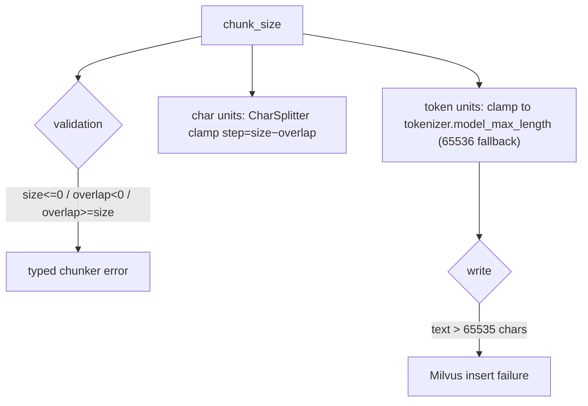

<sub>**Anchors:**<br>&bull; `agent-core/openjiuwen/core/retrieval/indexing/processor/chunker/base.py:59` — validation; `agent-core/openjiuwen/core/retrieval/indexing/processor/chunker/text_splitter.py:43` overlap clamp; `:44` size clamp; `:207` `_resolve_chunk_size`<br>&bull; `agent-core/openjiuwen/core/retrieval/indexing/processor/chunker/chunking.py:82` — tokenizer-limit auto-adjust<br>&bull; `agent-core/openjiuwen/core/retrieval/indexing/indexer/milvus_indexer.py:378` — text `max_length=65535`<br>&bull; `agent-core/openjiuwen/core/retrieval/common/config.py:34` — `chunk_size=512`, `chunk_overlap=50`</sub>

## 6. What happens if your chunks are too small or too large

**General:** Too small: each chunk lacks the context to answer, the answer gets split across chunks, and recall of the *answer-bearing* chunk drops while index size/overhead grows. Too large: the embedding averages multiple topics so relevance dilutes, retrieval precision drops, and each hit wastes prompt tokens; it can also exceed the embedding model's max sequence length and get truncated. Both extremes lower end-to-end quality, for opposite reasons.

**Jiuwen:** The code guards the mechanics but not the quality: construction rejects `chunk_size <= 0` / `chunk_overlap >= chunk_size`, token chunkers clamp size to the tokenizer max (so oversized chunks are silently truncated to the model limit), and Milvus fails the write above 65535 chars. There is no retrieval-quality feedback loop to tell you a size choice was bad.

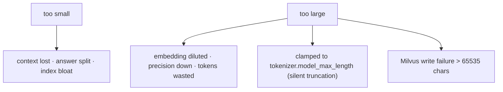

<sub>**Anchors:**<br>&bull; `agent-core/openjiuwen/core/retrieval/indexing/processor/chunker/base.py:59/64/69` — validation raises<br>&bull; `agent-core/openjiuwen/core/retrieval/indexing/processor/chunker/text_splitter.py:198` — `_resolve_chunk_size` clamps to `model_max_length`<br>&bull; `agent-core/openjiuwen/core/retrieval/indexing/processor/chunker/chunking.py:82` — tokenizer-limit auto-adjust<br>&bull; `agent-core/openjiuwen/core/retrieval/indexing/indexer/milvus_indexer.py:378` — text `max_length=65535`</sub>

## 7. How do you choose an embedding model, and what makes one better than another for a given domain

**General:** Better is domain- and measurement-specific, not "bigger". Consider domain fit (legal vs code vs multilingual), asymmetry (query/passage prefixes), dimensionality you can afford, max sequence length, latency/cost, and whether it is instruction-tuned. A smaller in-domain model often beats a large general one. Decide by measuring recall on your own labeled queries, and match the model to the retrieval mode (dense vs hybrid).

**Jiuwen:** An `Embedding` ABC defines `embed_query`, `embed_documents`, and a `dimension` property; `EmbeddingConfig` carries only `model_name`/`base_url`/`api_key`. Providers are `APIEmbedding`, `OpenAIEmbedding`, `VLLMEmbedding` (adds multimodal `instruction`), and `DashscopeEmbedding`. Dimension is discovered lazily or set for Matryoshka models. Model choice is entirely caller-driven — no registry, benchmark, or size heuristic.

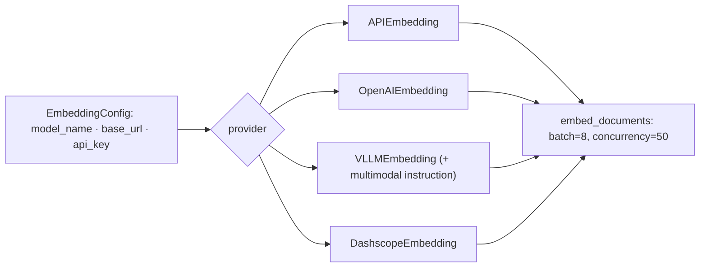

<sub>**Anchors:**<br>&bull; `agent-core/openjiuwen/core/foundation/store/base_embedding.py:16` — `EmbeddingConfig`; `:24` `Embedding` ABC; `:29` `embed_query`<br>&bull; `agent-core/openjiuwen/core/retrieval/embedding/openai_embedding.py:67` — Matryoshka `dimension`; `agent-core/openjiuwen/core/retrieval/embedding/dashscope_embedding.py:105` — Dashscope `dimension`<br>&bull; `agent-core/openjiuwen/core/retrieval/embedding/api_embedding.py:45` — `max_batch_size=8`; `:46` `max_concurrent=50`<br>&bull; `agent-core/openjiuwen/core/retrieval/embedding/vllm_embedding.py:17` — `VLLMEmbedding`</sub>

## 8. What's the tradeoff between overlapping chunks and non-overlapping chunks

**General:** A small overlap preserves context that straddles a boundary, improving recall for answers that span a cut; too much overlap duplicates content, inflates the index, and can return near-identical hits that crowd out diversity. Non-overlapping is cheaper and cleaner but risks losing boundary context. Overlap is a cheap mitigation; sentence-aware splitting is the better fix.

**Jiuwen:** Overlap is a first-class `chunk_overlap` integer (default 50) enforced on both paths. `CharSplitter` uses a strided sliding window; `SentenceSplitter` re-injects trailing whole sentences up to the overlap token budget, so token chunks overlap on sentence boundaries. Overlap content is duplicated text across chunks, and chunk IDs are fresh UUIDs each run, so downstream indexing cannot distinguish overlap content.

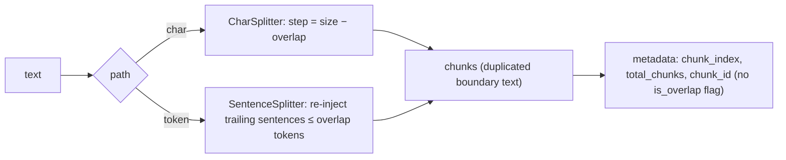

<sub>**Anchors:**<br>&bull; `agent-core/openjiuwen/core/retrieval/indexing/processor/chunker/base.py:39` — `chunk_overlap: int = 50`; `:106` overlap not in metadata<br>&bull; `agent-core/openjiuwen/core/retrieval/indexing/processor/chunker/text_splitter.py:41` — overlap clamp; `:54` `step = chunk_size - chunk_overlap`<br>&bull; `agent-core/openjiuwen/core/retrieval/indexing/processor/splitter/splitter.py:215` — `_flush` re-injects trailing sentences; `:186` long-segment window step</sub>

---

# Retrieval quality

## 9. Why isn't vector similarity search alone enough

**General:** Cosine similarity measures vector closeness, not answer relevance. It is symmetric, ignores term importance, is not calibrated across queries/documents, and a generic chunk can sit near the query while the exact answer ranks lower. Top-k by cosine is a recall-oriented candidate step; ranking quality comes from better models, hybrid exact-match signals, metadata filters, and reranking.

**Jiuwen:** The KB ranks purely by the vector store's returned score: `VectorRetriever` searches and only applies a post-hoc `score_threshold`, preserving store order. Stores normalize heterogeneous raw distances into `[0,1]` per backend (Milvus cosine `(s+1)/2`, Chroma `(2-d)/2`), so scores are rescaled distances, not calibrated probabilities, and are not comparable across stores/collections. There is no MMR, diversity, or cross-encoder step in the KB path.

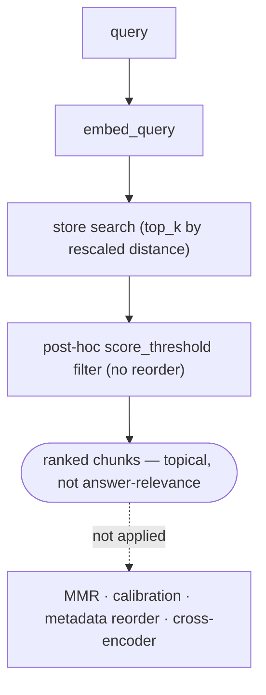

<sub>**Anchors:**<br>&bull; `agent-core/openjiuwen/core/retrieval/retriever/vector_retriever.py:79` — raw store search; `:94` threshold filter only<br>&bull; `agent-core/openjiuwen/core/retrieval/simple_knowledge_base.py:182` — results returned as-is<br>&bull; `agent-core/openjiuwen/core/retrieval/common/config.py:81` — `distance_metric` default `cosine`<br>&bull; `agent-core/openjiuwen/core/foundation/store/vector/utils.py:35/49/63` — similarity normalizers<br>&bull; `agent-core/openjiuwen/core/retrieval/vector_store/milvus_store.py:457` — metric-dependent conversion</sub>

## 10. What is reranking, and where does it fit in the pipeline

**General:** First-stage retrieval optimizes recall with cheap approximate similarity over the whole corpus. A reranker then scores each candidate *jointly with the query* using an expensive cross-encoder, reordering the top-k for precision before generation. It fits between retrieval and prompt assembly; it improves precision@k but cannot recover documents retrieval never returned.

**Jiuwen:** A `Reranker` ABC exists (`StandardReranker`, `ChatReranker` (experimental), `DashscopeReranker`), but it is integrated only in the graph store: `milvus_support.py` accepts an optional `reranker` and calls it in `_rank_results`, and it is a no-op unless the caller passes one. Neither `SimpleKnowledgeBase.retrieve` nor `GraphKnowledgeBase.retrieve` constructs or forwards a reranker, so RAG retrieval is first-stage-only.

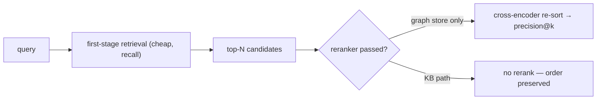

<sub>**Anchors:**<br>&bull; `agent-core/openjiuwen/core/foundation/store/base_reranker.py:37` — `Reranker` ABC; `:41` abstract `rerank`<br>&bull; `agent-core/openjiuwen/core/retrieval/reranker/standard_reranker.py:23` — `StandardReranker` (`/rerank`); `agent-core/openjiuwen/core/retrieval/reranker/chat_reranker.py:22` — `ChatReranker` (experimental)<br>&bull; `agent-core/openjiuwen/core/foundation/store/graph/milvus/milvus_support.py:458` — reranker applied only when truthy<br>&bull; `agent-core/openjiuwen/core/retrieval/simple_knowledge_base.py:182` — no reranker in KB `retrieve`</sub>

## 11. How do you measure whether your retrieval step is actually working

**General:** Use retrieval metrics against a labeled set of (query, relevant docs): Recall@k (did the relevant docs appear in top-k?), Precision@k (of the top-k, how many are relevant?), MRR (rank of the first relevant hit), and NDCG (position-weighted with graded relevance). Track zero-result rate and score distributions in production, and check that a reranker actually improves NDCG rather than just reordering.

**Jiuwen:** None of these metrics exist. There is no `recall_at_k`/`precision_at_k`/MRR/NDCG, no ranked-list metric interface (`Metric.compute(prediction, label)` is pairwise), and no gold-relevance set. The only recall/precision present is *classification* metrics in the PerStream example and sklearn gate tests. The reranker's only before/after evidence is a demo score-delta script with no labels.

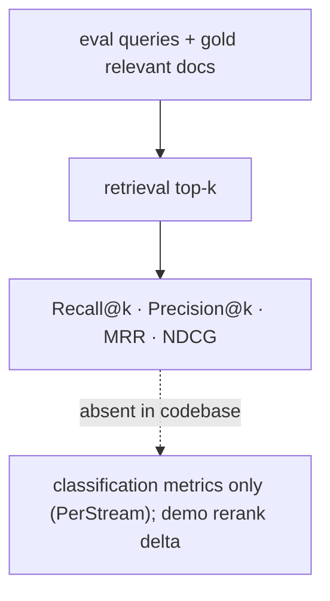

<sub>**Anchors:**<br>&bull; `agent-core/openjiuwen/agent_evolving/evaluator/metrics/base.py:42` — `compute(prediction, label)`, no ranked list<br>&bull; `agent-core/openjiuwen/agent_evolving/evaluator/metrics/__init__.py:11` — only three metrics exported<br>&bull; `agent-core/examples/PerStream/src/eval/score_proactive_judge.py:355/362` — classification recall/precision<br>&bull; `agent-core/examples/store/showcase_milvus_graph_store.py:51` — reranker score-delta (no labels)</sub>

## 12. What's the difference between Recall@k and Precision@k, and when do you care about each

**General:** Recall@k is the fraction of all relevant documents that appear in the top-k; Precision@k is the fraction of the top-k that are relevant. They trade off: raising k raises recall but usually lowers precision. Care about recall when the generator consumes a set together and missing evidence is costly (context stuffing); care about precision when the top results are used directly (UI, answer extraction) or to save tokens.

**Jiuwen:** Neither is implemented. The only precision/recall in the repo are *classification* metrics (PerStream's TA-recall/TV-precision over proactive-memory moments, sklearn `recall_score`/`precision_score` in a gate test), not ranking@k. Ranking utilities (`rrf_fusion`, `WeightedRankConfig`) only order candidates; they never compare against relevance.

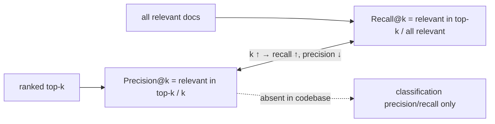

<sub>**Anchors:**<br>&bull; `agent-core/examples/PerStream/src/eval/score_proactive_judge.py:355/362` — TA recall / TV precision<br>&bull; `agent-core/examples/PerStream/src/eval/test_remember_gate.py:22` — sklearn `recall_score`/`precision_score`<br>&bull; `agent-core/openjiuwen/core/retrieval/utils/fusion.py:15/39` — RRF (ranking, not metric)<br>&bull; `agent-core/openjiuwen/agent_evolving/evaluator/metrics/base.py:60` — `compute_batch` (no relevance-per-rank)</sub>

---

# Failure modes

## 13. Your retrieval looks correct but the answer is still wrong, where do you look first

**General:** Check whether the retrieved chunk actually *contains* the answer. If it does not, retrieval failed (bad chunking, wrong index, query mismatch) even if the top hits look on-topic. If it does, the problem is generation or grounding (model ignored/distorted the evidence), or the context was truncated. This requires reading the retrieved spans against the answer, and is why faithfulness eval needs the context.

**Jiuwen:** There is no tooling for "does the chunk contain the answer": `score_threshold` defaults to `None` (weak chunks pass), relevance checks are lexical, and the judges (`AccuracyEvaluator`, `LLMAsJudgeMetric`) do not receive the retrieved context, so they cannot distinguish "context lacks the answer" from "model ignored it".

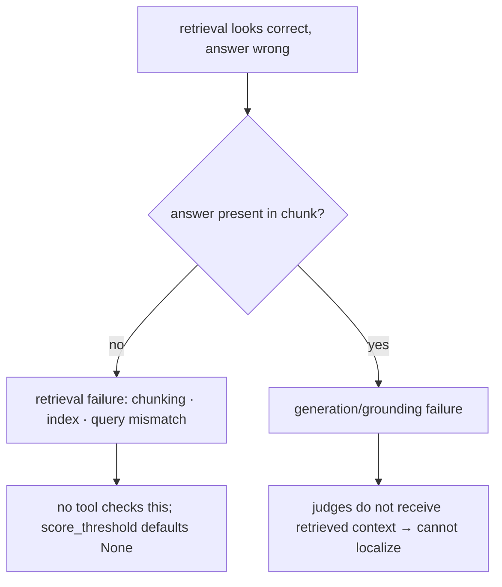

<sub>**Anchors:**<br>&bull; `agent-core/openjiuwen/core/retrieval/common/config.py:47` — `score_threshold` default `None`<br>&bull; `agent-core/openjiuwen/harness/tools/web/free_search.py:299` — lexical relevance only<br>&bull; `agent-core/openjiuwen/symphony/evaluation/evaluators.py:438` — `AccuracyEvaluator` (no context input)<br>&bull; `agent-core/openjiuwen/agent_evolving/evaluator/metrics/llm_as_judge.py:58` — parses `result: true/false`, no context<br>&bull; `agent-core/openjiuwen/agent_teams/verification/reviewer.py:43` — `Correctness` dimension on the output</sub>

## 14. How do you handle hallucinations when the retrieved context doesn't actually answer the question

**General:** First detect that the context is insufficient, then answer only from what is supported: gate on retrieval score/answerability, allow an explicit "I don't know" abstention, and verify claims against the context (citations/groundedness). Without an answerability gate, a model will still produce a fluent answer from irrelevant context. The failure is under-specified retrieval, not just a bad generator.

**Jiuwen:** There is a retrieval score filter (`score_threshold`) but its default is `None`, so out-of-scope chunks are normally returned. `AgenticRetriever` asks an LLM whether facts are `sufficient`, but `sufficient=False` only generates a follow-up query, never abstention. A true abstention path exists only in `symphony/retrieval` internal selection (`is_abstain` → empty candidates). Verification is a separate, non-blocking review layer.

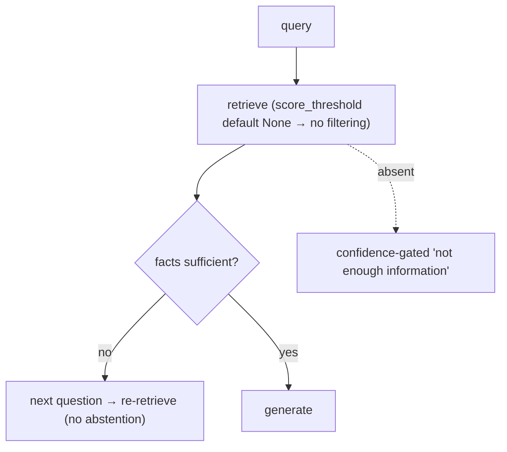

<sub>**Anchors:**<br>&bull; `agent-core/openjiuwen/core/retrieval/common/config.py:47` — `score_threshold` default `None`; `agent-core/openjiuwen/core/retrieval/retriever/vector_retriever.py:94` — applied only when supplied<br>&bull; `agent-core/openjiuwen/core/retrieval/retriever/agentic_retriever.py:326` — sufficiency (rewrite, not abstain)<br>&bull; `agent-core/openjiuwen/symphony/retrieval/search/runtime/engine.py:94` — `is_abstain` → empty; `agent-core/openjiuwen/symphony/retrieval/search/runtime/selector.py:305`<br>&bull; `agent-core/openjiuwen/harness/subagents/verification_agent.py:51` — PASS/FAIL/PARTIAL verdict</sub>

## 15. What happens when no relevant documents exist for a query, how should the system respond

**General:** Return a confidence-gated "not enough information" (or ask a clarifying question) rather than answering from noise, and log zero-result queries as coverage gaps. Optionally fall back to a broader retrieval (sparse/graph hop) or parametric knowledge with a caveat. The system should never present an unsupported answer as if it were grounded.

**Jiuwen:** The KB path implements dense-empty → sparse fallback, but no abstention: when both are empty it returns `[]` and the workflow component concatenates an empty context with no signal. Explicit abstention exists only in the separate Symphony engine, not in `core/retrieval` KB retrieval.

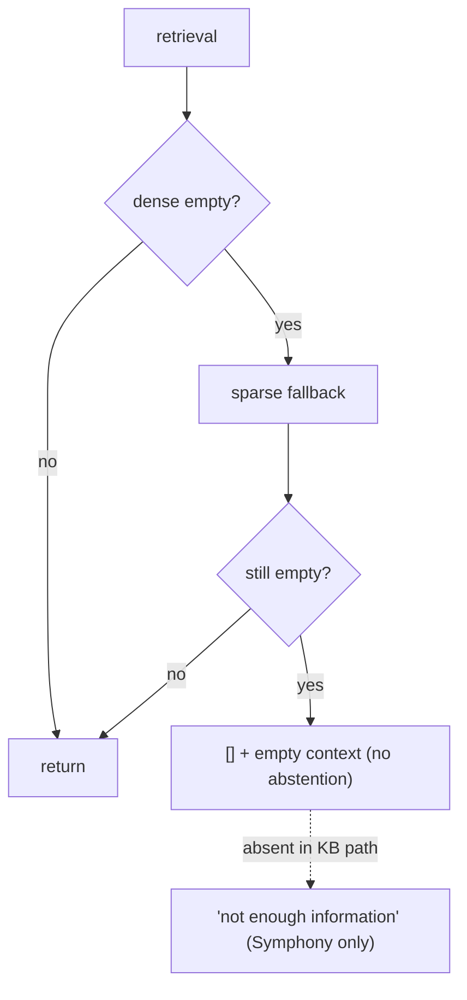

<sub>**Anchors:**<br>&bull; `agent-core/openjiuwen/core/retrieval/retriever/vector_retriever.py:83` — dense-empty → sparse; `agent-core/openjiuwen/core/retrieval/retriever/hybrid_retriever.py:97` — same<br>&bull; `agent-core/openjiuwen/core/workflow/components/resource/knowledge_retrieval_comp.py:241` — empty → empty context<br>&bull; `agent-core/openjiuwen/core/retrieval/common/config.py:47` — `score_threshold` default `None`<br>&bull; `agent-core/openjiuwen/symphony/retrieval/search/runtime/selector.py:250/305` — `is_abstain`</sub>

## 16. How do you detect when your retrieval quality has degraded over time

**General:** Monitor retrieval-specific signals over time — zero-result rate, top-score distributions, click/select rate, and a periodic re-run of a frozen labeled set (Recall@k/NDCG) — and alert on shifts. Slice by query type/tenant/language, since degradation is often localized (a new format, a corpus change, an embedding-model update). Pair it with generation-side faithfulness/relevance tracking so you can tell a retrieval regression from a generation one.

**Jiuwen:** There is no retrieval-quality monitoring and no drift detection. Production observability is span-based: OTel spans with an error flag, a per-session trajectory store, and cost/usage facts — error/latency/trajectory, not quality. Offline evaluation exists (`rsi/evaluator`, `evaluator_pipeline`) but is not an online quality monitor, and there is no frozen retrieval metric to trend.

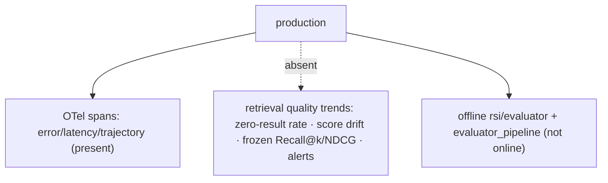

<sub>**Anchors:**<br>&bull; `agent-core/openjiuwen/harness/observability/run_span.py:289` — error status recorded; `agent-core/openjiuwen/harness/observability/setup.py:54` — OTel lifecycle<br>&bull; `jiuwenswarm/jiuwenswarm/observability/store.py:102` — `has_error`; `:137` `trajectory_current_records`<br>&bull; `agent-core/openjiuwen/agent_evolving/evaluator/evaluator_pipeline/pipeline.py:167` — offline `bench.evaluate`; `:668` `_compute_evolution_metrics`<br>&bull; `agent-core/openjiuwen/agent_evolving/trainer/trainer.py:217` — validation-score gate (offline)</sub>

---

# Scale and production

## 17. How would you scale a RAG system from 1,000 to 1 million documents

**General:** Move from an in-process index to a dedicated vector DB with tuned ANN indexes (HNSW/IVF/quantization), sharding/partitioning, replication, and batch ingestion. Add hybrid retrieval and a reranker to keep precision as the corpus grows, and introduce caching and cost controls. Memory, index build time, and per-query latency/recall tuning become first-class.

**Jiuwen:** Scale-out is delegated to the backend: Chroma = local HNSW (small/medium), Milvus = server ANN with AUTO/HNSW/IVF/SCANN and quantization (large), PGVector = pgvector HNSW/IVFFlat. Writes are batched (128) and flushed, and adding documents appends to the existing index (no full rebuild). There is no sharding, partitioning, replication, or autoscaling.

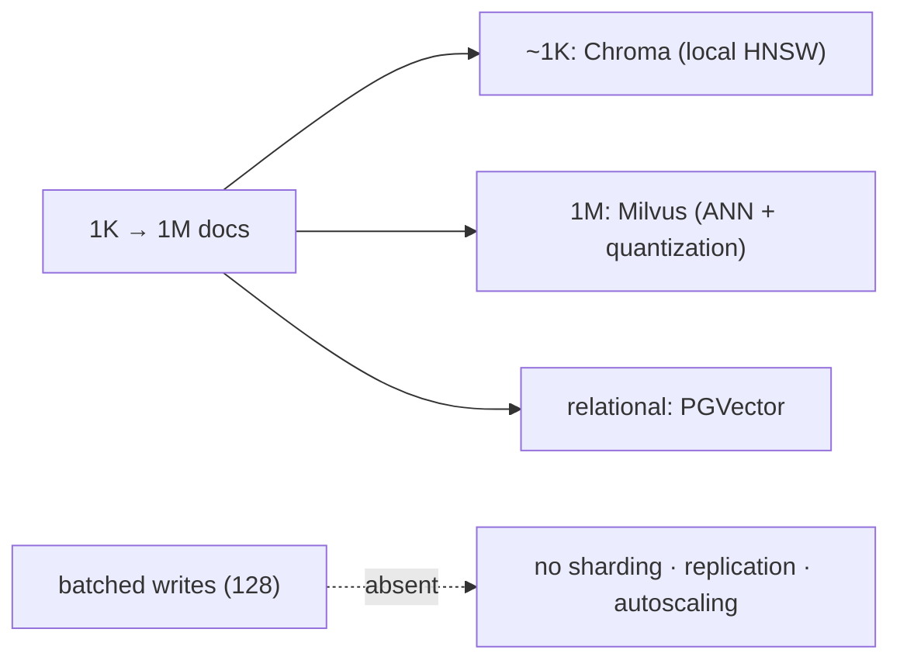

<sub>**Anchors:**<br>&bull; `agent-core/openjiuwen/core/retrieval/vector_store/store.py:16` — `create_vector_store`; `agent-core/openjiuwen/core/retrieval/common/config.py:67` — `StoreType`<br>&bull; `agent-core/openjiuwen/core/retrieval/indexing/indexer/milvus_indexer.py:433` — AUTO/HNSW/IVF/SCANN; `:346` scalar indexes<br>&bull; `agent-core/openjiuwen/core/retrieval/vector_store/pg_store.py:203` — HNSW; `agent-core/openjiuwen/core/retrieval/vector_store/chroma_store.py:120` — local HNSW<br>&bull; `agent-core/openjiuwen/core/retrieval/vector_store/base.py:57` — `add(..., batch_size=128)`; `agent-core/openjiuwen/core/retrieval/simple_knowledge_base.py:74` — append via `build_index`</sub>

## 18. How do you keep your vector database updated as source documents change

**General:** Detect change (mtime/hash/commit), delete the document's chunks by stable ID, then re-chunk/re-embed/insert — incrementally and idempotently. Make it event-driven and replayable, handle deletes, and reserve full re-embeds for model/index changes. Ideally make the replace transactional or reconcile after a crash.

**Jiuwen:** Delete-by-`doc_id` + rebuild per document (Chroma/Milvus), with a Milvus flush between delete and rebuild for eventual consistency. New documents append incrementally with a duplicate-`doc_id` guard. There is no partial-chunk diffing or embedding reuse, and a crash between delete and rebuild is not transactional — the document can be lost.

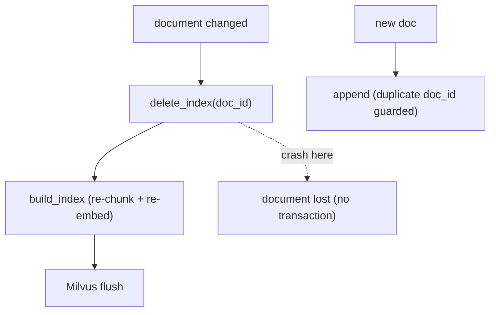

<sub>**Anchors:**<br>&bull; `agent-core/openjiuwen/core/retrieval/simple_knowledge_base.py:219` — `update_documents`; `:192` `delete_documents`; `:74` `add_documents`<br>&bull; `agent-core/openjiuwen/core/retrieval/indexing/indexer/chroma_indexer.py:198/217` — update = delete + build; `:142` duplicate guard<br>&bull; `agent-core/openjiuwen/core/retrieval/indexing/indexer/milvus_indexer.py:209/231` — delete + flush + rebuild</sub>

## 19. How do you reduce latency in a RAG pipeline without sacrificing accuracy

**General:** Stream tokens (users perceive TTFT, not total), run independent steps in parallel, cache embeddings/prefixes and results, keep top-k small but add a reranker to preserve precision, route easy steps to a faster model, and skip reranking when it does not pay. Measure TTFT and per-stage latency so you optimize the real bottleneck.

**Jiuwen:** Provides streaming with per-call `ttft_ms`, parallel tool execution with resource lanes, KV/prefix cache affinity, and model failover. But reranking (a way to cut k while keeping precision) is not in the default KB path, and there is no result cache or latency-based routing.

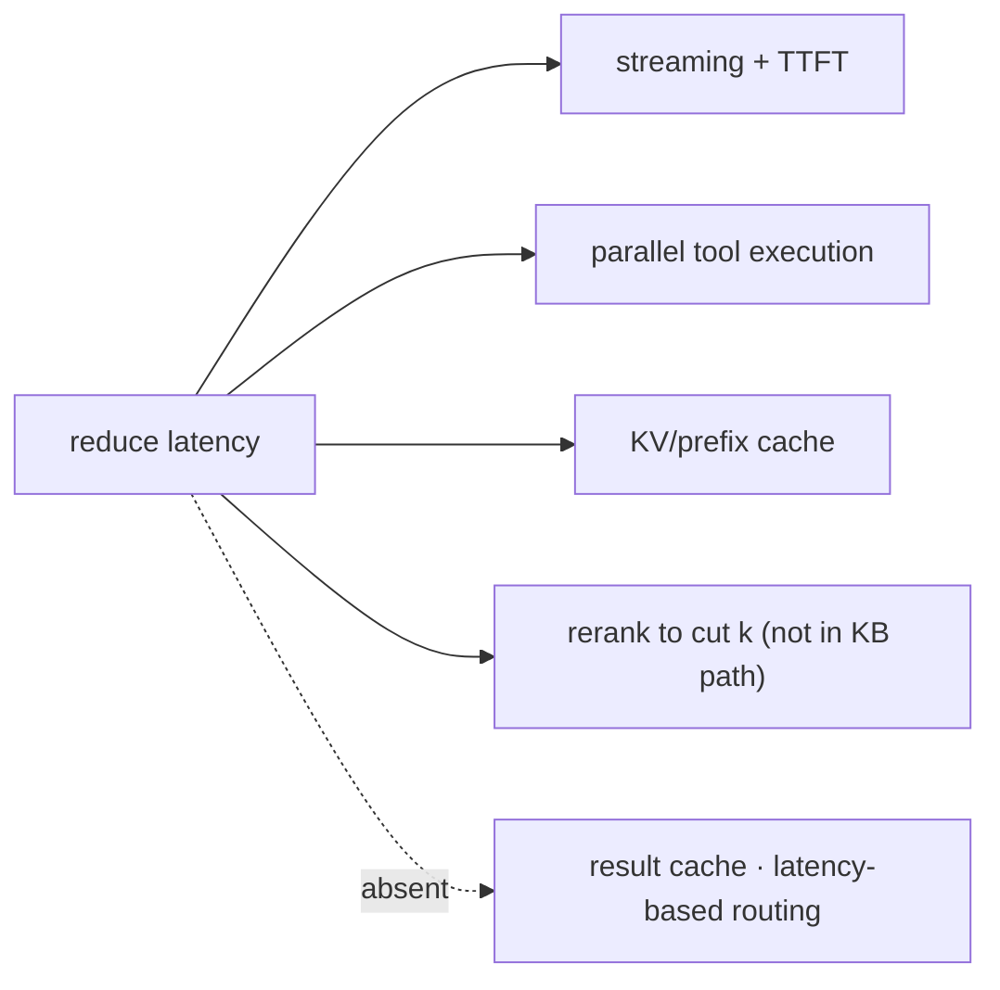

<sub>**Anchors:**<br>&bull; `agent-core/openjiuwen/core/single_agent/agents/react_agent.py:2938` — `stream`; `:1758` `ttft_ms`; `:336` `parallel_tool_calls`<br>&bull; `agent-core/openjiuwen/core/single_agent/ability_manager.py:431/467` — parallel batches + `parallel_safe` lanes<br>&bull; `jiuwenswarm/jiuwenswarm/server/runtime/session/kv_cache/kv_cache_model_provider.py:80` — KV/prefix affinity<br>&bull; `agent-core/openjiuwen/core/single_agent/rail/model_backup.py:9` — model failover<br>&bull; `agent-core/openjiuwen/core/retrieval/simple_knowledge_base.py:182` — KB path calls no reranker</sub>

## 20. What's your caching strategy for a RAG system with repeated or similar queries

**General:** Layer caches: exact-match response cache keyed on (query + model + params), provider prompt/prefix caching, embedding cache, and a semantic cache that embeds the query and returns a prior answer for similar queries above a similarity threshold. The semantic cache needs a threshold and invalidation strategy; exact caches need stable keys.

**Jiuwen:** Caching is exact-match, not semantic: session KV-cache reuse by affinity/lineage, a SQLite `embedding_cache` keyed by text hash in the product memory index, an exact `(tool_name, args-hash)` per-turn tool result cache, and local vLLM/transformers prefix caches. There is **no semantic/response cache**.

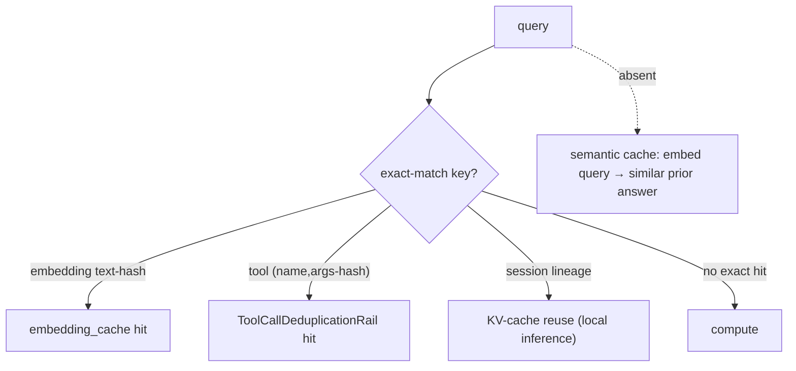

<sub>**Anchors:**<br>&bull; `agent-core/openjiuwen/core/kv_cache/kv_cache_runtime.py:32` — `KVCacheRuntime`<br>&bull; `jiuwenswarm/jiuwenswarm/agents/harness/common/memory/manager.py:31` — `EMBEDDING_CACHE_TABLE`; `:773` text-hash lookup<br>&bull; `jiuwenswarm/jiuwenswarm/agents/harness/common/rails/tool_dedup_rail.py:47` — exact per-turn tool result cache<br>&bull; `agent-core/openjiuwen/symphony/retrieval/llm/vllm/client.py:176` — prefix cache</sub>

---

# Evaluation

## 21. How do you evaluate a RAG system beyond "the answer looks correct"

**General:** Combine automatic metrics (exact match, F1, tests for code), an LLM-as-judge with a rubric for open-ended quality, and human review on a sample. Build a held-out set with representative and adversarial cases, score consistently, and track regressions. Evaluate retrieval and generation separately so you can localize failures.

**Jiuwen:** Three quality systems: `agent_evolving/evaluator/` (`DefaultEvaluator`/`MetricEvaluator` with `LLMAsJudgeMetric` and `ExactMatchMetric`), the RSI weighted-rubric judge, and `symphony/evaluation/` evaluators plus `evaluator_pipeline` (Docker benchmark, `pass_rate`/convergence).

```mermaid
flowchart TD
    OUT["output"] --> M1["ExactMatchMetric"]
    OUT --> M2["LLMAsJudgeMetric (0/1)"]
    OUT --> M3["RSI judge: weighted required/rubric/forbidden + evidence"]
    OUT --> M4["symphony evaluators + evaluator_pipeline"]
    M1 --> AGG(["eval result"])
    M2 --> AGG
    M3 --> AGG
    M4 --> AGG
```

<sub>**Anchors:**<br>&bull; `agent-core/openjiuwen/agent_evolving/evaluator/evaluator.py:82` — `DefaultEvaluator`; `:197` `MetricEvaluator`<br>&bull; `agent-core/openjiuwen/agent_evolving/evaluator/metrics/llm_as_judge.py:47`; `agent-core/openjiuwen/agent_evolving/evaluator/metrics/exact_match.py:12`<br>&bull; `agent-core/openjiuwen/rsi/harness_rsi/evaluator/judger/scoring.py:193` — weighted score + penalties<br>&bull; `agent-core/openjiuwen/symphony/evaluation/evaluators.py:671` — `BUILTIN_EVALUATORS`<br>&bull; `agent-core/openjiuwen/agent_evolving/evaluator/evaluator_pipeline/pipeline.py:167/668`</sub>

## 22. What's the difference between faithfulness and relevance in RAG evaluation

**General:** Relevance asks whether retrieved passages are on-topic for the query (context precision/recall). Faithfulness/groundedness asks whether the answer's claims are actually supported by the retrieved context. A system can retrieve relevant context and still hallucinate, or be faithful to irrelevant context. Measuring both separately localizes the failure.

**Jiuwen:** There is no faithfulness, attribution, or context-relevance metric. `AccuracyEvaluator` checks factual correctness but does not receive the retrieved context; the reviewer `Correctness` dimension is output-only; and the RSI judge accepts arbitrary rubrics so a user *could* encode groundedness, but none is defined.

```mermaid
flowchart TD
    CTX["retrieved context"] --> REL["relevance: context precision/recall"]
    ANS["answer"] --> FAITH["faithfulness: claims supported by context?"]
    CTX --> FAITH
    REL --> JUDGE["RAG eval"]
    FAITH --> JUDGE
    CTX -.->|"not passed to judge"| X["no faithfulness/attribution metric"]
```

<sub>**Anchors:**<br>&bull; `agent-core/openjiuwen/symphony/evaluation/evaluators.py:438` — `AccuracyEvaluator` (no context input)<br>&bull; `agent-core/openjiuwen/agent_evolving/evaluator/metrics/llm_as_judge.py:58` — parses `result: true/false`, no context<br>&bull; `agent-core/openjiuwen/rsi/harness_rsi/evaluator/judger/scoring.py:68` — generic rubric (no faithfulness dimension)<br>&bull; `agent-core/openjiuwen/harness/tools/web/free_search.py:299` — lexical relevance only</sub>

## 23. How would you build a regression test suite to catch quality drops before they ship

**General:** Keep a fixed, versioned eval suite (queries + expected retrieval targets/metrics) and run it on every change to chunking, embeddings, prompts, or models. Store a baseline and fail the build when a metric drops beyond a threshold; add golden/snapshot tests for prompts and outputs. This turns an eval script into a gate.

**Jiuwen:** The CI gate runs only `lint` and `type-check` (`ci_gate.yaml`), with no pytest or quality gate and no CI workflow file; the pytest `level0`/`level1` markers label tests but nothing invokes them. Offline quality machinery (`Trainer` best-score, `evaluator_pipeline` pass-rate) is a benchmark loop, not a fixed suite guarding changes.

```mermaid
flowchart TD
    PR["chunking/prompt change"] --> G{"regression suite?"}
    G -.->|"absent"| X["no fixed quality suite; no CI test/quality gate"]
    PR --> CI["ci_gate.yaml: lint + type-check only"]
    PR --> L0["level0 'PR gate' markers (not invoked)"]
    PR --> EV["evaluator_pipeline pass_rate (benchmark loop, no baseline gate)"]
```

<sub>**Anchors:**<br>&bull; `agent-core/openjiuwen/auto_harness/resources/ci_gate.yaml:21` — gates are only `lint`/`type-check`<br>&bull; `agent-core/openjiuwen/auto_harness/infra/ci_gate_runner.py:147` — `CIGateRunner`<br>&bull; `agent-core/pyproject.toml:236` — `level0`/`level1` markers ("PR gate must stay green")<br>&bull; `agent-core/openjiuwen/agent_evolving/trainer/trainer.py:217` — best-score gate<br>&bull; `agent-core/openjiuwen/agent_evolving/evaluator/evaluator_pipeline/pipeline.py:314` — stops when passed</sub>

---

## Summary: strong vs weak in Jiuwen

| Area | Strength | Notes |
|---|---|---|
| Pipeline assembly | Mixed | real ingest/retrieve components; no packaged RAG agent |
| RAG vs fine-tuning | Weak | capabilities present; no explicit decision doc |
| Modular RAG | Strong | pluggable parsers/chunkers/retrievers/stores/rerankers; composed manually, no router |
| How many docs (top-k) | Weak | static `top_k=5`; no rerank-to-K, no token budget |
| Chunk size | Strong | validation, char/token/hybrid chunkers, tokenizer clamps |
| Embedding model choice | Mixed | pluggable providers; no registry/benchmark |
| Overlap tradeoff | Strong | first-class overlap on both char and sentence paths |
| Vector similarity limits | Mixed | backend-rescaled scores; no calibration/MMR/rerank in KB |
| Reranking placement | Weak | cross-encoder exists but not wired into the KB path |
| Retrieval measurement | Weak | no Recall@k/Precision@k/MRR/NDCG |
| Failure localization | Weak | judges lack retrieved context; no chunk-contains-answer tooling |
| Context-doesn't-answer | Weak | `score_threshold` None; no abstention in KB path |
| No-relevant-docs handling | Weak | dense-empty→sparse fallback; no abstention |
| Degradation detection | Weak | error/latency spans only; no retrieval-quality trends |
| Scale (1K→1M) | Mixed | backend ANN tuning + batched writes; no sharding/replication |
| Vector DB updates | Mixed | delete-by-id + append; not transactional |
| Latency reduction | Strong | streaming + TTFT, parallel tools, KV/prefix cache, failover |
| Caching | Mixed | exact embedding/tool/KV caches; no semantic/response cache |
| Output evaluation | Strong | exact-match + LLM-judge + RSI rubric + benchmark pipeline |
| Faithfulness vs relevance | Weak | absent; judges lack retrieved context |
| Regression suite | Weak | CI gate is lint/type-check only; eval is offline |
