# RAG interview questions (Part 2) — general answers + how Jiuwen does it

Based on the recurring list *The Most Repeated RAG Questions in AI Engineer Interviews (Part 2)* (Multi-Hop and Complex Retrieval; Hybrid Search; Agentic RAG; Query Understanding; Production-Grade Retrieval). Part 1 covered the fundamentals; this set covers the advanced and production-level questions.

Hybrid-search questions reuse the earlier RAG docs' answers and anchors verbatim; the new ground is multi-hop mechanics, agentic-vs-fixed pipelines, retrieval-necessity decisions, query ambiguity/clarification, structured (SQL) retrieval, cross-format balancing, and document recency/conflicts. See [README](README.md) for the shared conventions (answer shape, anchor format, repo layers).

> **The pattern worth noticing:** Part 1 questions test whether you understand RAG. Part 2 questions test whether you can push past its known limitations — single-hop reasoning, keyword blind spots, and rigid pipelines — which is exactly where senior-level interviews go once the basics are confirmed.

---

# Multi-hop and complex retrieval

## 1. What is multi-hop retrieval, and when does single-pass retrieval fail to answer a question

**General:** Multi-hop retrieval runs more than one retrieval step, using what the first hop found to form the next query, because the answer needs a bridging entity that is not in the original query (e.g. "who employed the founder of X" needs X → founder → employer). Single-pass fails when the supporting evidence is only reachable through that intermediate entity, so the top-k for the original query never contains it. Graph/triple stores make hops explicit; query-decomposition approaches generate sub-queries.

**Jiuwen:** Two mechanisms. `AgenticRetriever` keeps a `queries` list and loops up to `max_iter`, extracting triples each round into a `TripleMemory` and asking the LLM for a `next_question` when triples are insufficient. `GraphRetriever` delegates to `TripleBeamSearch`, which expands a beam of triples for `max_length` hops, re-querying from the two endpoint entities of the last triple and keeping only candidates that share an entity. Single-pass `VectorRetriever.retrieve` embeds once and returns `top_k` with no state.

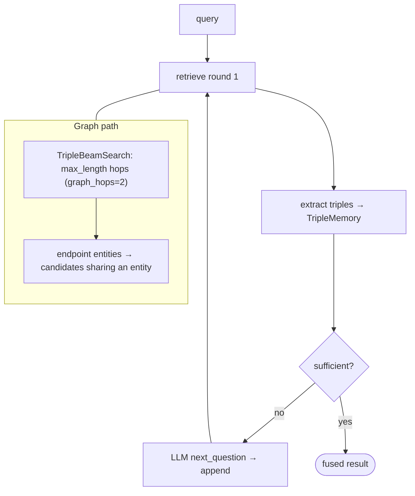
```mermaid
flowchart TD
    Q0["query"] --> R0["retrieve round 1"]
    R0 --> T0["extract triples → TripleMemory"]
    T0 --> S{"sufficient?"}
    S -->|no| NQ["LLM next_question → append"] --> R0
    S -->|yes| OUT(["fused result"])
    subgraph GRAPH["Graph path"]
    direction TB
    B["TripleBeamSearch: max_length hops (graph_hops=2)"] --> ENT["endpoint entities → candidates sharing an entity"]
    end
    R0 --- GRAPH
```

**Anchors:** &bull; `agent-core/openjiuwen/core/retrieval/retriever/agentic_retriever.py:213` — `for turn in range(1, max_iter+1)`; `:237` `_read` triples + `batch_extend_memory`; `:244` `_rewrite` → append &bull; `agent-core/openjiuwen/core/retrieval/retriever/graph_retriever.py:100` — beam expansion `range(max_length-1)`; `:190` endpoint entities `{triple[0], triple[-1]}`; `:402` `graph_hops = kwargs.get("graph_hops", 2)` &bull; `agent-core/openjiuwen/core/retrieval/common/triple_beam.py:12` — `TripleBeam`; `agent-core/openjiuwen/core/retrieval/common/triple_memory.py:31` — `extend_memory` dedup &bull; `agent-core/openjiuwen/core/memory/config/graph.py:86` — `bfs_k`/`bfs_depth` &bull; `agent-core/openjiuwen/core/retrieval/retriever/vector_retriever.py:122` — fixed single-pass retrieve

## 2. How would you design a system where answering one question requires retrieving and reasoning over multiple documents in sequence

**General:** Keep the runs stateful: seed a query list, retrieve, extract intermediate facts, decide whether they are sufficient, and if not generate the next query conditioned on what you have — then fuse the per-round candidate sets (rank fusion) rather than concatenating. Track per-round provenance so you can attribute and dedupe. Cap the rounds.

**Jiuwen:** The agentic loop keeps `queries` and `history_results` (one list per round) and accumulates triples across rounds in one `TripleMemory`, so later rounds see prior evidence. Final merging is RRF: graph mode fuses triple-linked passages with all round results (`rrf_fusion(ret + history_results)`), generic mode fuses the round histories. `graph_expansion` (default on in the graph path) pulls triple-linked chunks and fuses them. Cross-KB, `retrieve_multi_kb` gathers all KBs concurrently and dedups by exact text keeping the max score.

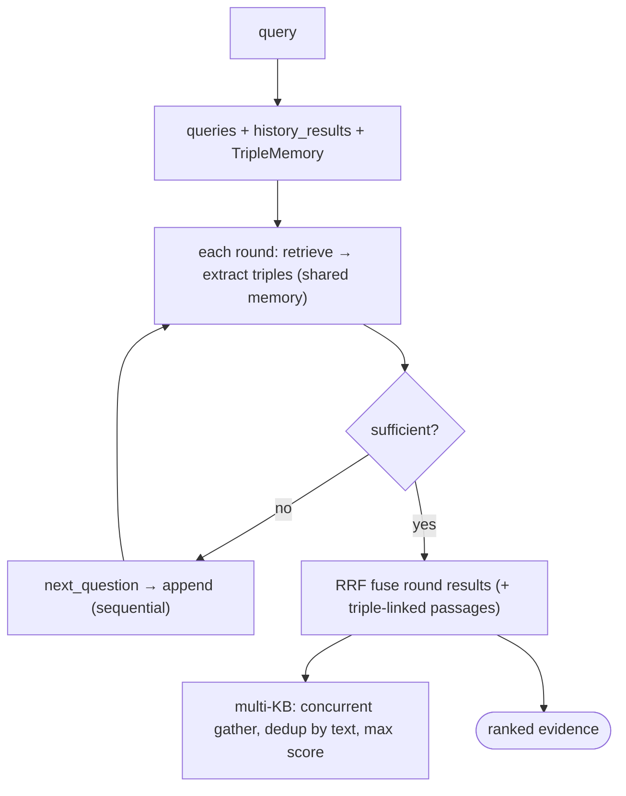
```mermaid
flowchart TD
    Q["query"] --> LOOP["queries + history_results + TripleMemory"]
    LOOP --> RD["each round: retrieve → extract triples (shared memory)"]
    RD --> SM{"sufficient?"}
    SM -->|no| NQ["next_question → append (sequential)"] --> RD
    SM -->|yes| F["RRF fuse round results (+ triple-linked passages)"]
    F --> KB["multi-KB: concurrent gather, dedup by text, max score"]
    F --> OUT(["ranked evidence"])
```

**Anchors:** &bull; `agent-core/openjiuwen/core/retrieval/retriever/agentic_retriever.py:209` — `queries`/`history_results`/`TripleMemory` init; `:237` cross-round triple accumulation; `:207` `graph_expansion` default true &bull; `agent-core/openjiuwen/core/retrieval/retriever/agentic_retriever.py:250` — `rrf_fusion(ret + history_results)[:top_k]` (graph mode); `:295` `rrf_fusion(history_results)[:top_k]` (generic) &bull; `agent-core/openjiuwen/core/retrieval/retriever/graph_retriever.py:522` — `rrf_fusion([new_chunks, chunks], k=60)` &bull; `agent-core/openjiuwen/core/retrieval/utils/fusion.py:39` — RRF `1/(k+rank)` keyed by `result.text` &bull; `agent-core/openjiuwen/core/retrieval/simple_knowledge_base.py:304` — concurrent multi-KB gather + dedupe/max-score

**Gap.** "Sequential" is not document-planned — no per-round reranker or doc-level dependency tracking; RRF keys on exact text so near-duplicates count as separate votes.

## 3. How do you decide how many retrieval hops are enough, and how do you prevent the system from looping indefinitely

**General:** Use a sufficiency check — decide whether the accumulated evidence answers the question — and stop when it does; cap the hops with a hard limit as a backstop. Add repetition/loop detection and a cost ceiling so a confused retriever cannot burn tokens. Prefer a dynamic stop (sufficiency) with a static cap (max hops).

**Jiuwen:** Three caps. `AgenticRetriever.max_iter` defaults to 2 and is hard-clamped (invalid values fall back to 2); each loop breaks at `turn >= max_iter`. `TripleBeamSearch.max_length` defaults to 2 and rejects `<1`. Sufficiency: `_rewrite` sends `_REWRITE_PROMPT`, which returns `{"sufficient": bool, "next_question": str|null}`; only `sufficient=false` with a non-empty question continues. Beyond retrieval, `ModelAnomalyDetectionRail` detects consecutive identical tool-call rounds and compacts or aborts, `ToolCallDeduplicationRail` short-circuits duplicate calls, and the ReAct loop is bounded by `max_iterations`.

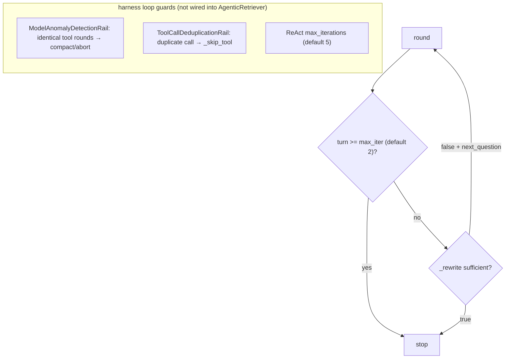
```mermaid
flowchart TD
    R["round"] --> C1{"turn >= max_iter (default 2)?"}
    C1 -->|yes| STOP["stop"]
    C1 -->|no| S{"_rewrite sufficient?"}
    S -->|true| STOP
    S -->|"false + next_question"| R
    subgraph GUARDS["harness loop guards (not wired into AgenticRetriever)"]
    direction TB
    A["ModelAnomalyDetectionRail: identical tool rounds → compact/abort"]
    D["ToolCallDeduplicationRail: duplicate call → _skip_tool"]
    I["ReAct max_iterations (default 5)"]
    end
```

**Anchors:** &bull; `agent-core/openjiuwen/core/retrieval/retriever/agentic_retriever.py:133` — `max_iter=2`; `:148` invalid-value fallback; `:241/287` turn-cap break; `:364` parses `sufficient`/`next_question` &bull; `agent-core/openjiuwen/core/retrieval/retriever/graph_retriever.py:37` — `max_length < 1` raises; `:402` `graph_hops` default 2 &bull; `agent-core/openjiuwen/harness/rails/model_anomaly_detection_rail.py:418` — loop bailout `AbortError`; `:466` `_find_tool_loop_compact_range` &bull; `jiuwenswarm/jiuwenswarm/agents/harness/common/rails/tool_dedup_rail.py:128` — `_skip_tool` duplicate suppression &bull; `agent-core/openjiuwen/core/single_agent/agents/react_agent.py:2740` — `for iteration in range(..., max_iterations)`

**Gap.** `max_iter`/`graph_hops` are static, not chosen by query difficulty; the harness loop guards are **not wired into `AgenticRetriever`**, which has no loop detector beyond the turn cap. If `_rewrite` JSON fails to parse it returns `None` — indistinguishable from "sufficient" (silent early stop).

## 4. How would you handle a question that requires combining information from two documents that never explicitly reference each other

**General:** Bridge through a shared key: entity linking (both mention the same entity/ID), a knowledge graph with typed relations, or an LLM decomposition that surfaces the connecting entity as a new query. Without a shared surface form, you need entity resolution/aliasing and relation-aware traversal, not just text overlap.

**Jiuwen:** The only bridge is shared entities in a triple index: each extracted triple is stored with `{"triple": "[s,p,o]", "chunk_id": ...}`, and `TripleBeamSearch._search_candidates` re-queries from the beam's last-triple endpoints and discards candidates whose subject/object is not in that entity set. `AgenticRetriever` also runs `_link_triples` (nearest KB triple per extracted triple) and `_link_passages`, then RRF-merges. Bridging is emergent from entity-text overlap plus the LLM's `next_question` — there is no dedicated bridge component or entity disambiguation/aliasing.

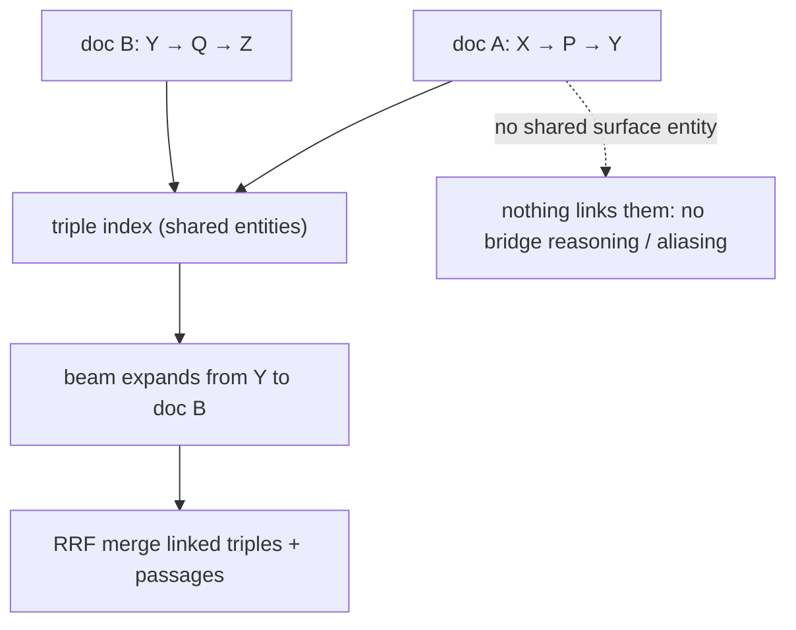
```mermaid
flowchart TD
    D1["doc A: X → P → Y"] --> G["triple index (shared entities)"]
    D2["doc B: Y → Q → Z"] --> G
    G --> B["beam expands from Y to doc B"]
    B --> F["RRF merge linked triples + passages"]
    D1 -.->|"no shared surface entity"| X["nothing links them: no bridge reasoning / aliasing"]
```

**Anchors:** &bull; `agent-core/openjiuwen/core/retrieval/retriever/graph_retriever.py:190` — triple endpoints seed next hop; `:217` candidate rejected unless entity shared &bull; `agent-core/openjiuwen/core/retrieval/retriever/agentic_retriever.py:226` — proximal triples → `_link_triples` → `graph_expansion`; `:249` `_link_passages` then RRF; `:88` bridge example in `_REWRITE_PROMPT`; `:465` `deduplicate(..., key=lambda node: node.id)` &bull; `agent-core/openjiuwen/core/retrieval/graph_knowledge_base.py:146` — triple text + `chunk_id` metadata &bull; `agent-core/openjiuwen/core/retrieval/simple_knowledge_base.py:305` — cross-KB merge is exact-text + max score (cannot bridge)

---

# Hybrid search

## 5. What is hybrid search, and why isn't dense vector retrieval alone always enough

**General:** Hybrid search runs dense (embedding) and sparse (BM25/keyword) retrieval and fuses the results. Dense alone misses rare exact terms — error codes, IDs, names, jargon the model never learned — where the embedding has little signal; sparse alone misses paraphrase. Together they cover both.

**Jiuwen:** Dense is `VectorRetriever`; sparse is `SparseRetriever`, which on Milvus is real BM25 (`metric_type="BM25"` against a `SPARSE_FLOAT_VECTOR` field with `SPARSE_INVERTED_INDEX`). Chroma falls back to a TF-IDF text query; PG uses full-text search. `HybridRetriever` takes an `alpha` but every backend actually uses RRF: Milvus `RRFRanker(k=60)`, Chroma/PG `rrf_fusion(..., k=60)`. There is no MMR, calibration, or cross-encoder in the KB path.

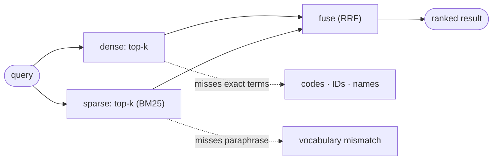
```mermaid
flowchart LR
    Q(["query"]) --> D["dense: top-k"]
    Q --> S["sparse: top-k (BM25)"]
    D --> F["fuse (RRF)"]
    S --> F
    F --> R(["ranked result"])
    D -.->|"misses exact terms"| X1["codes · IDs · names"]
    S -.->|"misses paraphrase"| X2["vocabulary mismatch"]
```

**Anchors:** &bull; `agent-core/openjiuwen/core/retrieval/retriever/sparse_retriever.py:19` — `SparseRetriever` (BM25); `:62` delegates to `sparse_search` &bull; `agent-core/openjiuwen/core/retrieval/vector_store/milvus_store.py:277` — `metric_type: "BM25"`; `:348` `RRFRanker(k=60)` &bull; `agent-core/openjiuwen/core/retrieval/indexing/indexer/milvus_indexer.py:390` — Milvus `Function(BM25)`; `:399` `SPARSE_INVERTED_INDEX` &bull; `agent-core/openjiuwen/core/retrieval/vector_store/chroma_store.py:300` — TF-IDF (no BM25); `agent-core/openjiuwen/core/retrieval/vector_store/pg_store.py:375` — FTS &bull; `agent-core/openjiuwen/core/retrieval/simple_knowledge_base.py:141` — retriever selection by `index_type`

## 6. How do you combine sparse retrieval (BM25/keyword-based) with dense retrieval (embeddings) into one ranked result set

**General:** Two families: score-based fusion (normalize scores and combine with a weight) and rank-based fusion (Reciprocal Rank Fusion, `Σ 1/(k+rank)`), which needs no score calibration. RRF is the robust default; weighted score fusion lets you bias toward one signal but requires comparable scores. Dedupe the merged list.

**Jiuwen:** Every KB backend uses RRF, not alpha weighting: Milvus native `RRFRanker(k=60)`, Chroma/PG `rrf_fusion(..., k=60)` scoring each deduped text by `Σ 1/(k+rank)`, keyed by `text`. The only true weighted fusion is `WeightedRankConfig` in the graph store. So the `alpha` parameter on `HybridRetriever` is effectively dead.

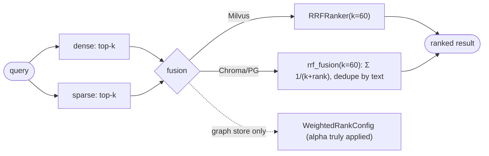
```mermaid
flowchart LR
    Q(["query"]) --> D["dense: top-k"]
    Q --> S["sparse: top-k"]
    D --> F{"fusion"}
    S --> F
    F -->|Milvus| M["RRFRanker(k=60)"]
    F -->|Chroma/PG| C["rrf_fusion(k=60): Σ 1/(k+rank), dedupe by text"]
    F -.->|"graph store only"| W["WeightedRankConfig (alpha truly applied)"]
    M --> R(["ranked result"])
    C --> R
```

**Anchors:** &bull; `agent-core/openjiuwen/core/retrieval/retriever/hybrid_retriever.py:26` — `alpha` (ignored by stores) &bull; `agent-core/openjiuwen/core/retrieval/utils/fusion.py:15` — `rrf_fusion`; `:39` `1.0/(k+rank)` &bull; `agent-core/openjiuwen/core/retrieval/vector_store/milvus_store.py:348` — native `RRFRanker(k=60)`; `:381` fallback `rrf_fusion` &bull; `agent-core/openjiuwen/core/retrieval/vector_store/chroma_store.py:390` — Chroma RRF; `agent-core/openjiuwen/core/retrieval/vector_store/pg_store.py:418` — PG RRF &bull; `agent-core/openjiuwen/core/foundation/store/graph/result_ranking.py:61` — `WeightedRankConfig` (only real weights)

## 7. When does keyword search outperform semantic search, and what kinds of queries expose that gap

**General:** Keyword search wins on exact identifiers, codes, rare names, and domain jargon that the embedding never learned, and when the terms are highly distinctive. Dense wins on paraphrase and intent. The strongest approach runs both and fuses, or routes by query type.

**Jiuwen:** Routing is static and config-driven, not query-content-driven: `SimpleKnowledgeBase.retrieve` picks the retriever and mode from `config.index_type`. The only dynamic keyword behavior is a dense-empty→sparse fallback. `QueryRewriter` produces an `intention` field but never uses it to switch modes.

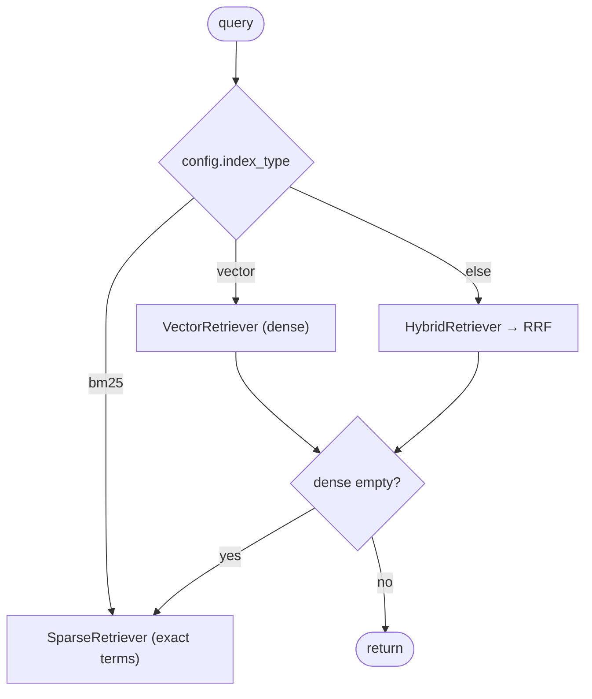
```mermaid
flowchart TD
    Q(["query"]) --> C{"config.index_type"}
    C -->|vector| V["VectorRetriever (dense)"]
    C -->|bm25| S["SparseRetriever (exact terms)"]
    C -->|"else"| H["HybridRetriever → RRF"]
    V --> D{"dense empty?"}
    D -->|yes| S
    D -->|no| R(["return"])
    H --> D
```

**Anchors:** &bull; `agent-core/openjiuwen/core/retrieval/simple_knowledge_base.py:141` — retriever selection by `index_type` &bull; `agent-core/openjiuwen/core/retrieval/retriever/vector_retriever.py:83` — dense-empty → BM25 fallback &bull; `agent-core/openjiuwen/core/retrieval/retriever/hybrid_retriever.py:97` — same fallback &bull; `agent-core/openjiuwen/core/retrieval/query_rewriter/query_rewriter.py:277` — rewrite schema includes `intention` (unused for mode) &bull; `agent-core/openjiuwen/core/retrieval/retriever/graph_retriever.py:262` — `_allowed_modes`

## 8. How would you weight or fuse scores from two different retrieval methods, and how do you tune that weighting

**General:** Prefer RRF when scores are not comparable (different scales/calibrations) because it only needs ranks and is hard to misconfigure. If you use score fusion, normalize each list (min-max or z-score) and tune the weight on a labeled eval set with a ranking metric. Tune by validating on held-out queries, not by eyeballing.

**Jiuwen:** In practice the KB path uses RRF with a fixed `k=60`; `alpha` is accepted by `HybridRetriever` but ignored by all three stores. True weighted fusion exists only as `WeightedRankConfig` in the graph store (weights normalized, zero channels dropped). There is no weight-tuning loop or eval-based calibration.

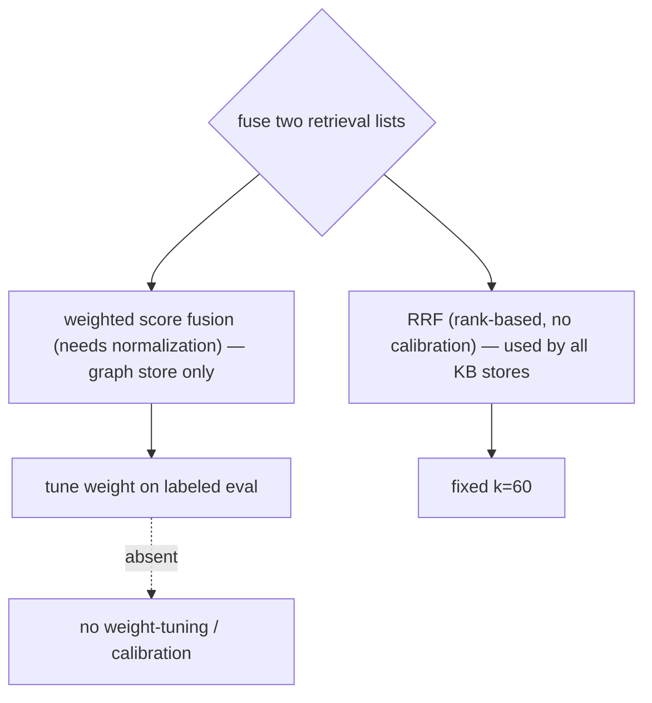
```mermaid
flowchart TD
    F{"fuse two retrieval lists"} --> RRF["RRF (rank-based, no calibration) — used by all KB stores"]
    F --> W["weighted score fusion (needs normalization) — graph store only"]
    W --> TUNE["tune weight on labeled eval"] -.->|"absent"| X["no weight-tuning / calibration"]
    RRF --> K["fixed k=60"]
```

**Anchors:** &bull; `agent-core/openjiuwen/core/retrieval/retriever/hybrid_retriever.py:26` — `alpha` ignored &bull; `agent-core/openjiuwen/core/retrieval/utils/fusion.py:15/39` — `rrf_fusion` + formula &bull; `agent-core/openjiuwen/core/foundation/store/graph/result_ranking.py:61/85` — `WeightedRankConfig` / `RRFRankConfig` &bull; `agent-core/openjiuwen/core/retrieval/vector_store/milvus_store.py:348` — native RRF k=60

---

# Agentic RAG

## 9. What is agentic RAG, and how is it different from a standard fixed RAG pipeline

**General:** A fixed RAG pipeline always retrieves once and feeds the top-k to the generator. Agentic RAG adds a decision loop: the model chooses whether and when to retrieve, may rewrite or decompose the query, retrieves again based on what it found, and stops when it has enough. It trades latency/cost and non-determinism for better answers on complex questions.

**Jiuwen:** `RetrievalConfig.agentic` (default `False`) is the switch. When true, `SimpleKnowledgeBase.retrieve` wraps its base retriever in `AgenticRetriever(retriever=..., llm_client=...)`; otherwise the base `VectorRetriever`/`SparseRetriever`/`HybridRetriever` is called directly. `GraphKnowledgeBase` does the same wrapping a `GraphRetriever`. Agentic = base retrieval + LLM triple extraction + sufficiency/rewrite + multi-round RRF + optional graph expansion; it requires an `llm_client`. In the product harness the model also chooses retrieval via the `memory_search` tool.

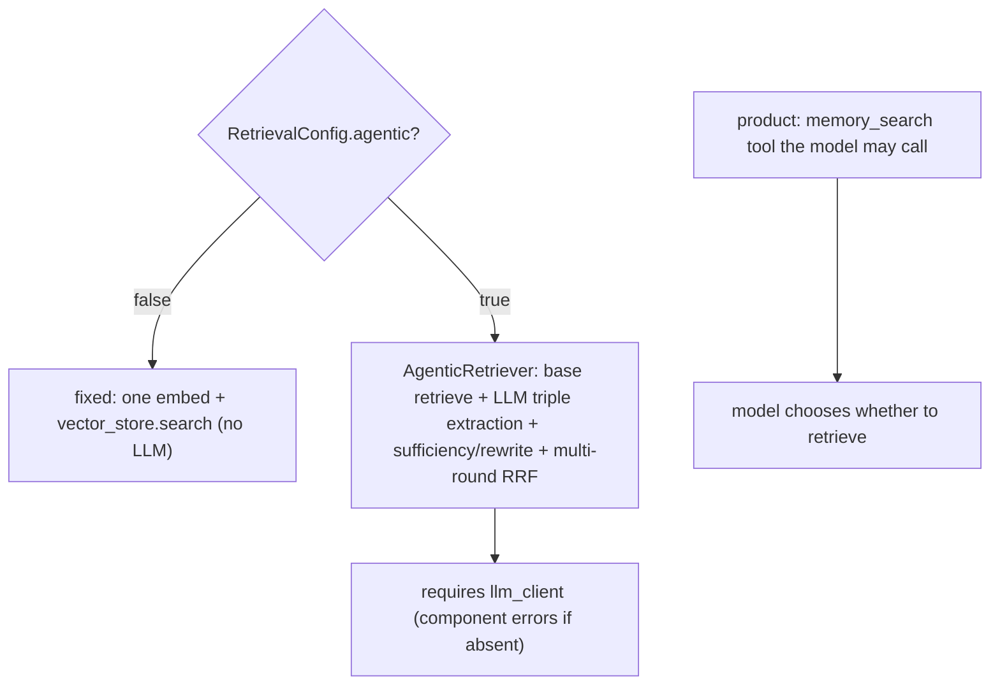
```mermaid
flowchart TD
    C{"RetrievalConfig.agentic?"}
    C -->|false| FIX["fixed: one embed + vector_store.search (no LLM)"]
    C -->|true| AG["AgenticRetriever: base retrieve + LLM triple extraction + sufficiency/rewrite + multi-round RRF"]
    AG --> NEED["requires llm_client (component errors if absent)"]
    P["product: memory_search tool the model may call"] --> CHOICE["model chooses whether to retrieve"]
```

**Anchors:** &bull; `agent-core/openjiuwen/core/retrieval/common/config.py:51` — `agentic: bool = False` &bull; `agent-core/openjiuwen/core/retrieval/simple_knowledge_base.py:172/182` — agentic wrap vs direct base retriever &bull; `agent-core/openjiuwen/core/retrieval/graph_knowledge_base.py:218` — agentic wrap of `GraphRetriever` &bull; `agent-core/openjiuwen/core/retrieval/retriever/agentic_retriever.py:113` — `AgenticRetriever` construction; `agent-core/openjiuwen/core/retrieval/retriever/vector_retriever.py:122` — fixed single-pass (contrast) &bull; `agent-core/openjiuwen/core/workflow/components/resource/knowledge_retrieval_comp.py:216` — LLM only when agentic &bull; `jiuwenswarm/jiuwenswarm/agents/harness/common/tools/memory_tools.py:167` — `memory_search` tool &bull; `agent-core/openjiuwen/harness/deep_agent.py:225` — `memory_search` in builtin tools

**Gap.** The agentic flag is per-KB and static (cannot promote mid-run), and there is no planner choosing retriever/mode per query.

## 10. How would you design a system where the model decides whether retrieval is even necessary before answering

**General:** Give the model a retrieval tool and a policy for when to call it, backed by a cheap classifier or heuristics for the cases tools cannot cover; suppress retrieval when the needed context is already loaded. The model decides by choosing to call (or not call) the tool; measuring that choice lets you tune cost.

**Jiuwen:** There is no retrieval-necessity classifier. The decision is delegated to tool choice: `memory_search`'s description makes calling it mandatory for memory-type questions, and the harness memory prompt tells the model when to call it. `MemoryRail` proactively **suppresses** retrieval when daily memory is auto-loaded ("no need to call memory_search"). The KB path always retrieves (no pre-check), and the only abstain machinery (`is_abstain`) is in Symphony skill retrieval, not RAG.

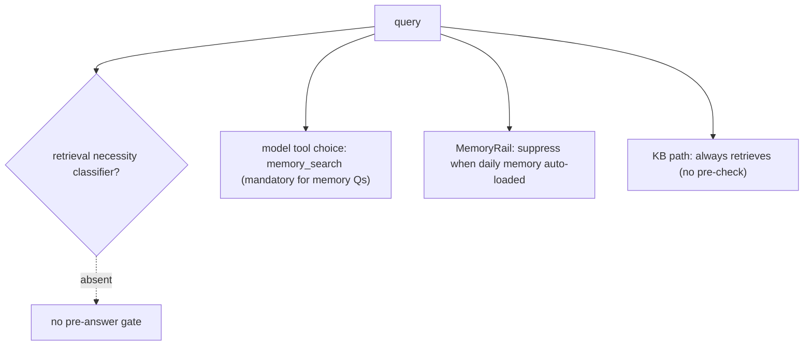
```mermaid
flowchart TD
    Q["query"] --> DEC{"retrieval necessity classifier?"}
    DEC -.->|"absent"| X["no pre-answer gate"]
    Q --> TOOL["model tool choice: memory_search (mandatory for memory Qs)"]
    Q --> RAIL["MemoryRail: suppress when daily memory auto-loaded"]
    Q --> KB["KB path: always retrieves (no pre-check)"]
```

**Anchors:** &bull; `jiuwenswarm/jiuwenswarm/agents/harness/common/tools/memory_tools.py:168` — mandatory-call tool description &bull; `agent-core/openjiuwen/harness/prompts/sections/memory.py:14` — "call memory_search before answering"; `:35` daily memory auto-loaded &bull; `agent-core/openjiuwen/harness/rails/memory/memory_rail.py:143/150` — suppress "no need to call memory_search" &bull; `agent-core/openjiuwen/core/retrieval/simple_knowledge_base.py:182` — retrieve always invoked &bull; `agent-core/openjiuwen/symphony/retrieval/search/runtime/selector.py:250/305` — closest abstain (skill-tree only)

**Gap.** No pre-answer necessity classification, confidence gate, or "answer from parametric knowledge" path in the RAG subsystem.

## 11. How does an agent decide when to retrieve again versus when it has enough context to answer

**General:** Ask the model a sufficiency question — given the query and the evidence so far, is it enough to answer, and if not what is the next query? Stop when sufficient or when the hop/round cap is hit. Judging sufficiency on the evidence (not just a scratchpad) matters.

**Jiuwen:** This is `AgenticRetriever._rewrite`: `_REWRITE_PROMPT` receives the query, the accumulated `TripleMemory.triples_str`, and the rewrite history, and returns `{"sufficient": bool, "next_question": str|null}`. If sufficient or no next question, `_rewrite` returns `None`, which breaks the loop; otherwise the next question is appended. The hard stop is `turn >= max_iter` before `_rewrite` is called.

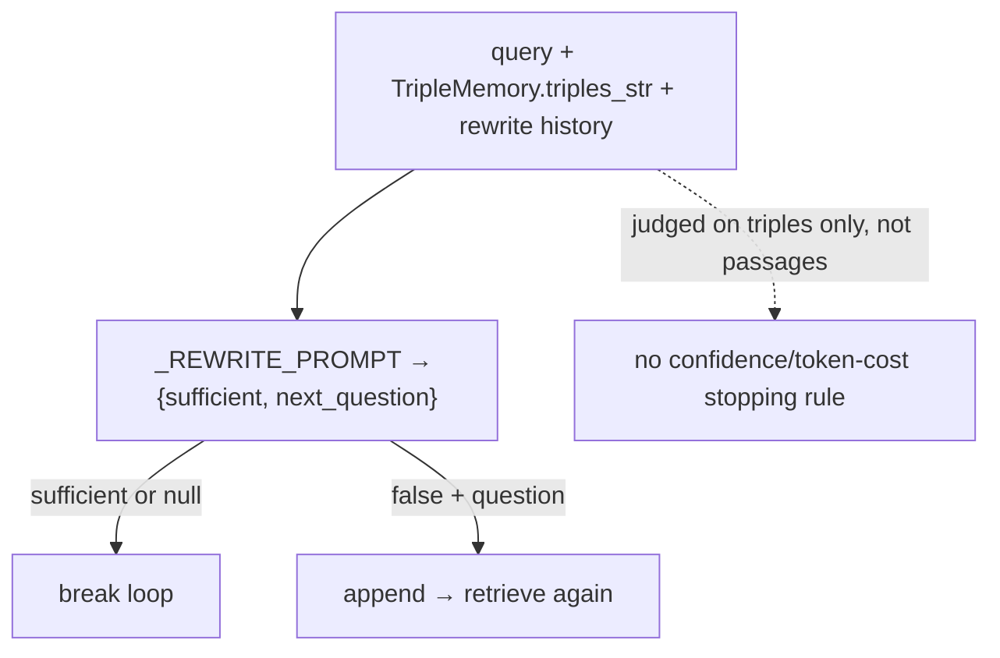
```mermaid
flowchart TD
    Q["query + TripleMemory.triples_str + rewrite history"] --> RW["_REWRITE_PROMPT → {sufficient, next_question}"]
    RW -->|"sufficient or null"| STOP["break loop"]
    RW -->|"false + question"| NEXT["append → retrieve again"]
    Q -.->|"judged on triples only, not passages"| X["no confidence/token-cost stopping rule"]
```

**Anchors:** &bull; `agent-core/openjiuwen/core/retrieval/retriever/agentic_retriever.py:51` — `_REWRITE_PROMPT` JSON contract; `:326` `_rewrite`; `:341` history formatting; `:364` `sufficient`/`next_question`; `:244/290` append-and-continue &bull; `agent-core/openjiuwen/core/retrieval/common/triple_memory.py:16` — `triples_str` fed to the prompt &bull; `agent-core/openjiuwen/core/retrieval/retriever/agentic_retriever.py:67` — prompt to differentiate/simplify later questions

**Gap.** Sufficiency is judged on triples only, not the actual passages; no confidence score; a JSON parse failure returns `None` (silent early stop).

## 12. How would you prevent an agentic RAG system from retrieving in an unnecessary loop and burning cost

**General:** Cap the rounds, detect repeated queries/results, require a sufficiency signal to continue, and put a token/cost budget on the retrieval loop itself. Cache retrieval results and dedupe identical queries. Alert on loops.

**Jiuwen:** Caps exist (`AgenticRetriever.max_iter` default 2 clamped, `graph_hops`/`max_length` default 2), and the sufficiency break avoids a needless round. Harness rails catch loops at the tool layer: `ModelAnomalyDetectionRail` compacts consecutive identical tool rounds and aborts after a threshold, and `ToolCallDeduplicationRail` caches/exact-suppresses repeated read calls. The ReAct loop is capped at `max_iterations`. But there is no retrieval-specific token/cost budget, and the harness rails are not applied to the retrieval agent's own LLM calls.

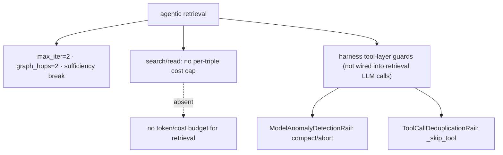
```mermaid
flowchart TD
    L["agentic retrieval"] --> C["max_iter=2 · graph_hops=2 · sufficiency break"]
    L --> SC["search/read: no per-triple cost cap"]
    SC -.->|"absent"| X["no token/cost budget for retrieval"]
    L --> TOOL["harness tool-layer guards (not wired into retrieval LLM calls)"]
    TOOL --> A["ModelAnomalyDetectionRail: compact/abort"]
    TOOL --> D["ToolCallDeduplicationRail: _skip_tool"]
```

**Anchors:** &bull; `agent-core/openjiuwen/core/retrieval/retriever/agentic_retriever.py:133/241/287` — `max_iter` and turn-cap breaks &bull; `agent-core/openjiuwen/harness/rails/model_anomaly_detection_rail.py:74` — `ToolLoopCompactConfig` (default off); `:386` compact-or-bailout &bull; `jiuwenswarm/jiuwenswarm/agents/harness/common/rails/tool_dedup_rail.py:25/109/157` — cacheable whitelist + per-turn cache + repeat warning &bull; `agent-core/openjiuwen/core/single_agent/agents/react_agent.py:288` — `max_iterations=5` &bull; `jiuwenswarm/jiuwenswarm/agents/harness/common/rails/context_headroom_rail.py:97` — 60%/80% token-window directives

**Gap.** No retrieval token/cost budget; `_link_triples`/`_link_passages` issue one request per triple (`asyncio.gather` with no concurrency limit), and the tool-loop guards do not cover these calls.

---

# Query understanding

## 13. How would you handle a vague or ambiguous user query before it even reaches retrieval

**General:** Detect ambiguity and either ask a clarifying question or rewrite to the most likely intent. The cheap path is a rewrite that resolves coreference/ellipsis; the interactive path is a clarification turn when the ambiguity would change the retrieval target. Most production systems rewrite by default and clarify only when confidence is low.

**Jiuwen:** Ambiguity is not resolved by asking the user pre-retrieval. `QueryRewriter.rewrite` returns `intention`, `standalone_query`, `references`, and a `missing` list; when a gap cannot be filled from history it marks it with `(…)` under `missing` but still proceeds with a best-effort query. Asking the user is a separate, opt-in mechanism: `AskUserRail`/`AskUserTool` interrupt the tool loop and return the answer as a tool result. None of these is wired automatically into the RAG flow as an ambiguity gate.

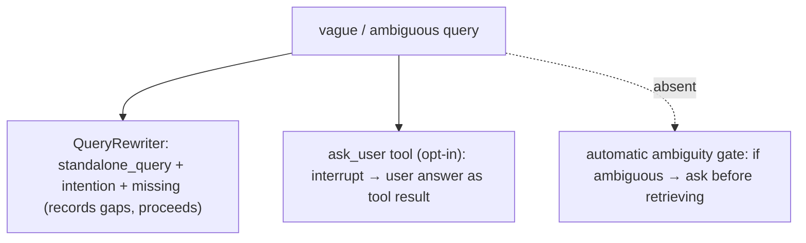
```mermaid
flowchart TD
    Q["vague / ambiguous query"] --> RW["QueryRewriter: standalone_query + intention + missing (records gaps, proceeds)"]
    Q --> AU["ask_user tool (opt-in): interrupt → user answer as tool result"]
    Q -.->|"absent"| X["automatic ambiguity gate: if ambiguous → ask before retrieving"]
```

**Anchors:** &bull; `agent-core/openjiuwen/core/retrieval/query_rewriter/query_rewriter.py:412` — `rewrite()`; `:277` output schema (`intention`/`references`/`missing`/`typo`) &bull; `agent-core/openjiuwen/core/retrieval/query_rewriter/prompts/intention_completion_en.md:41` — missing-info completion (marks gaps, does not ask) &bull; `agent-core/openjiuwen/harness/tools/ask_user.py:11` — `AskUserTool`; `agent-core/openjiuwen/harness/rails/interrupt/ask_user_rail.py:63` — `resolve_interrupt` &bull; `agent-core/openjiuwen/core/controller/schema/intent.py:59` — `UNKNOWN_TASK` clarification prompt; `agent-core/openjiuwen/core/controller/modules/intent_recognizer.py:436`

## 14. What is query rewriting or query expansion, and when does it meaningfully improve retrieval quality

**General:** Query rewriting makes a query self-contained (resolves coreference/ellipsis, fixes typos, removes reliance on prior turns) — it improves multi-turn and malformed queries. Query expansion adds terms/synonyms or generates a hypothetical answer (HyDE) to bridge vocabulary mismatch. Rewriting helps conversational and noisy queries; expansion helps when the corpus uses different wording than the user.

**Jiuwen:** `QueryRewriter` performs context-aware rewriting, not expansion: it produces a self-contained `standalone_query`, corrects typos, detects gibberish, summarizes intent, and lists gaps. When history exceeds `compress_range` it first LLM-compresses history into a `{theme, summary}` system message, then rewrites from the recent turns — history compression, not query expansion. There is no synonym expansion and no HyDE.

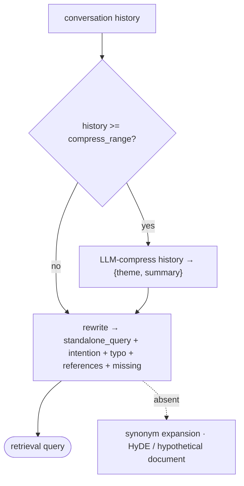
```mermaid
flowchart TD
    H["conversation history"] --> C{"history >= compress_range?"}
    C -->|yes| COMP["LLM-compress history → {theme, summary}"]
    C -->|no| RW
    COMP --> RW["rewrite → standalone_query + intention + typo + references + missing"]
    RW --> R(["retrieval query"])
    RW -.->|"absent"| X["synonym expansion · HyDE / hypothetical document"]
```

**Anchors:** &bull; `agent-core/openjiuwen/core/retrieval/query_rewriter/query_rewriter.py:412` — `rewrite()`; `:349` `compress()`; `:449` history ≥ `compress_range`; `:227` `compress_range` default 20 &bull; `agent-core/openjiuwen/core/retrieval/query_rewriter/prompts/intention_completion_en.md:32` — coreference resolution; `:47` typo correction &bull; `agent-core/openjiuwen/core/retrieval/retriever/agentic_retriever.py:326` — follow-up question generation

## 15. How would you decompose a complex, multi-part question into smaller retrievable sub-questions

**General:** Split "compare A and B on X and Y" into independently answerable sub-questions, retrieve for each (often in parallel), then synthesize. A dedicated LLM decomposition call or an agentic loop generates the sub-questions; a planner can produce a DAG when there are dependencies.

**Jiuwen:** Decomposition is prompt-level and **sequential** inside `AgenticRetriever`. `_REWRITE_PROMPT` instructs the LLM to "break it down into smaller questions if needed", and when triples are insufficient it generates exactly one `next_question`, appended to `queries` and used as the next retrieval query; rounds are fused with RRF. It is not a parallel sub-query planner: sub-questions are produced one at a time, conditioned on the prior round, capped at `max_iter` (default 2). `batch_retrieve` runs independent caller-supplied queries concurrently, not a decomposition.

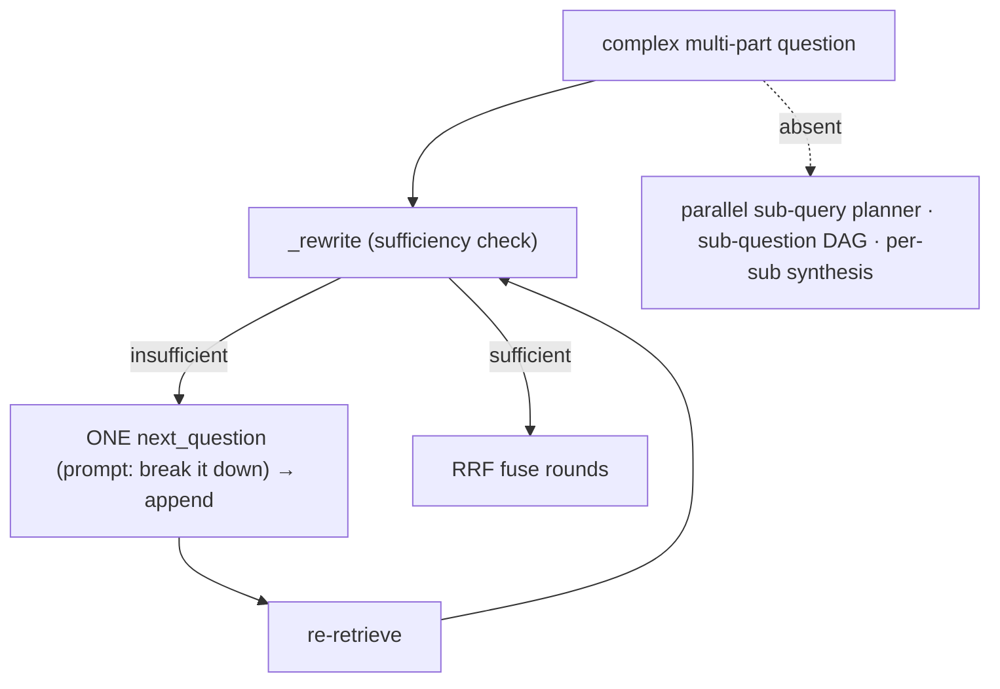
```mermaid
flowchart TD
    CQ["complex multi-part question"] --> RW["_rewrite (sufficiency check)"]
    RW -->|"insufficient"| NQ["ONE next_question (prompt: break it down) → append"] --> RET["re-retrieve"] --> RW
    RW -->|"sufficient"| F["RRF fuse rounds"]
    CQ -.->|"absent"| X["parallel sub-query planner · sub-question DAG · per-sub synthesis"]
```

**Anchors:** &bull; `agent-core/openjiuwen/core/retrieval/retriever/agentic_retriever.py:70` — "Break it down into smaller questions if needed."; `:326` `_rewrite` one next question; `:213/272` loops; `:290` append; `:295` `rrf_fusion(history_results)`; `:133` `max_iter=2`; `:530` `batch_retrieve` &bull; `agent-core/openjiuwen/core/controller/legacy/reasoner/planner.py:12` — general task Planner (not retrieval)

---

# Production-grade retrieval

## 16. How would you design retrieval to work across structured data (SQL tables) and unstructured data (documents) in the same system

**General:** Keep the two paths explicit: route structured questions to a text-to-SQL/table-query tool (schema-aware, validable) and unstructured questions to document retrieval, then merge/ground the results. Do not flatten tables into text and hope; and do not let a free-form shell tool be the only SQL path, because it is unverified. An orchestrator or router picks the source(s), and the answer cites which.

**Jiuwen:** The system is document-RAG only. The retrieval package indexes documents (PDF/Office/images/…) into vector/graph stores; `KnowledgeRetrievalComponent` fans a query to one or more KBs. `core/sys_operation` exposes only `fs()`, `shell()`, and `code()` — no database operation — and there is no text-to-SQL, schema introspection, table retrieval, or DB query tool. SQLite appears only as internal persistence/coordination (locks, session/observability stores), and even spreadsheets are flattened into text row/column documents.

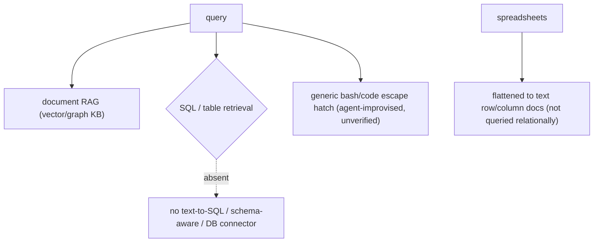
```mermaid
flowchart TD
    Q["query"] --> DOC["document RAG (vector/graph KB)"]
    Q --> SQL{"SQL / table retrieval"}
    SQL -.->|"absent"| X["no text-to-SQL / schema-aware / DB connector"]
    Q --> SHELL["generic bash/code escape hatch (agent-improvised, unverified)"]
    XLS["spreadsheets"] --> FLAT["flattened to text row/column docs (not queried relationally)"]
```

**Anchors:** &bull; `agent-core/openjiuwen/core/sys_operation/sys_operation.py:204` — `SysOperation` exposes only `fs`/`code`/`shell`; `:139` card proxies limited to fs/shell/code &bull; `agent-core/openjiuwen/harness/tools/__init__.py:42` — only Bash/PowerShell shell escape hatch; no DB tool &bull; `agent-core/openjiuwen/harness/tools/code.py:43` — `CodeTool.invoke` (generic code, not SQL-aware) &bull; `agent-core/openjiuwen/core/retrieval/indexing/processor/parser/excel_parser.py:131` — spreadsheets flattened to text documents &bull; `agent-core/openjiuwen/core/sys_operation/local/_rw_lock_manager.py:23` — SQLite used only as a lock DB

## 17. How do you handle retrieval across multiple document types and formats without one format dominating the results

**General:** Normalize at ingestion (uniform record + metadata) and balance at ranking: per-source quotas, source weighting, or interleaving so a verbose format cannot crowd out others. Normalizing ingestion alone does not prevent domination — a flat max-score sort still favors whichever format scores higher.

**Jiuwen:** Format coverage is a plugin registry: parsers self-register by extension, and `AutoFileParser.parse` dispatches on extension and stamps uniform metadata (`doc_id`, `title`, `file_path`, `file_ext`). Multi-source retrieval (`retrieve_multi_kb`/`retrieve_multi_kb_with_source`) fans out concurrently, dedups by text keeping max score, and sorts globally by score. Cross-store scores are partially comparable via `raw_score_scaled` in `[0,1]`. But ranking is a flat max-score sort — there is **no per-source/per-format quota, source weighting, or interleaving**, so a strongly scoring format can dominate.

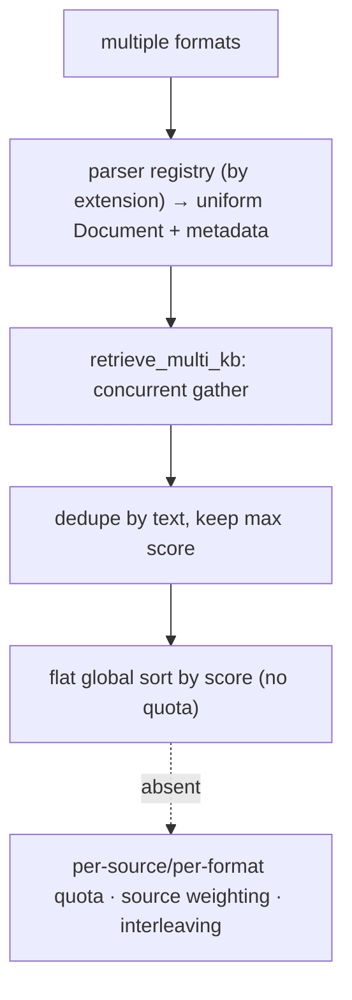
```mermaid
flowchart TD
    F["multiple formats"] --> REG["parser registry (by extension) → uniform Document + metadata"]
    REG --> KB["retrieve_multi_kb: concurrent gather"]
    KB --> M["dedupe by text, keep max score"]
    M --> S["flat global sort by score (no quota)"]
    S -.->|"absent"| X["per-source/per-format quota · source weighting · interleaving"]
```

**Anchors:** &bull; `agent-core/openjiuwen/core/retrieval/indexing/processor/parser/auto_file_parser.py:21` — `_PARSER_REGISTRY`; `:109` extension dispatch; `:123` uniform metadata &bull; `agent-core/openjiuwen/core/retrieval/simple_knowledge_base.py:285` — `retrieve_multi_kb`; `:313` flat score sort; `:318` `retrieve_multi_kb_with_source` &bull; `agent-core/openjiuwen/core/retrieval/vector_store/chroma_store.py:486` — `raw_score_scaled` normalization &bull; `agent-core/openjiuwen/core/retrieval/indexing/processor/parser/pdf_parser.py:16`, `agent-core/openjiuwen/core/retrieval/indexing/processor/parser/txt_md_parser.py:14`, `agent-core/openjiuwen/core/retrieval/indexing/processor/parser/json_parser.py:15`, `agent-core/openjiuwen/core/retrieval/indexing/processor/parser/image_parser.py:15` — per-format registration

## 18. How do you handle retrieval when documents contain conflicting or outdated information on the same topic

**General:** Prefer precedence rules before generation: recency (timestamp), source authority, or an explicit priority field; dedupe/reconcile; and either surface the conflict to the model with the metadata or abstain. Outdated facts are usually handled by recency-weighted ranking or by versioning/tombstoning superseded documents. Unchecked, the model picks the first or most fluent version.

**Jiuwen:** The retrieval layer has no notion of document time at all: `RetrievalResult`/`TextChunk` carry only `text`/`score`/metadata, parsers populate no timestamp, and ranking is score/rank only (RRF by rank, max-score merge) — no recency boost or "outdated" filter. Conflict handling exists only at the **memory** layer: `MemUpdateChecker` classifies a new memory as redundant/conflicting/none and deletes superseded old memories (newest wins). A freshness notion exists in the experience subsystem (`calc_freshness`, time decay) but scores experience records, not retrieved documents.

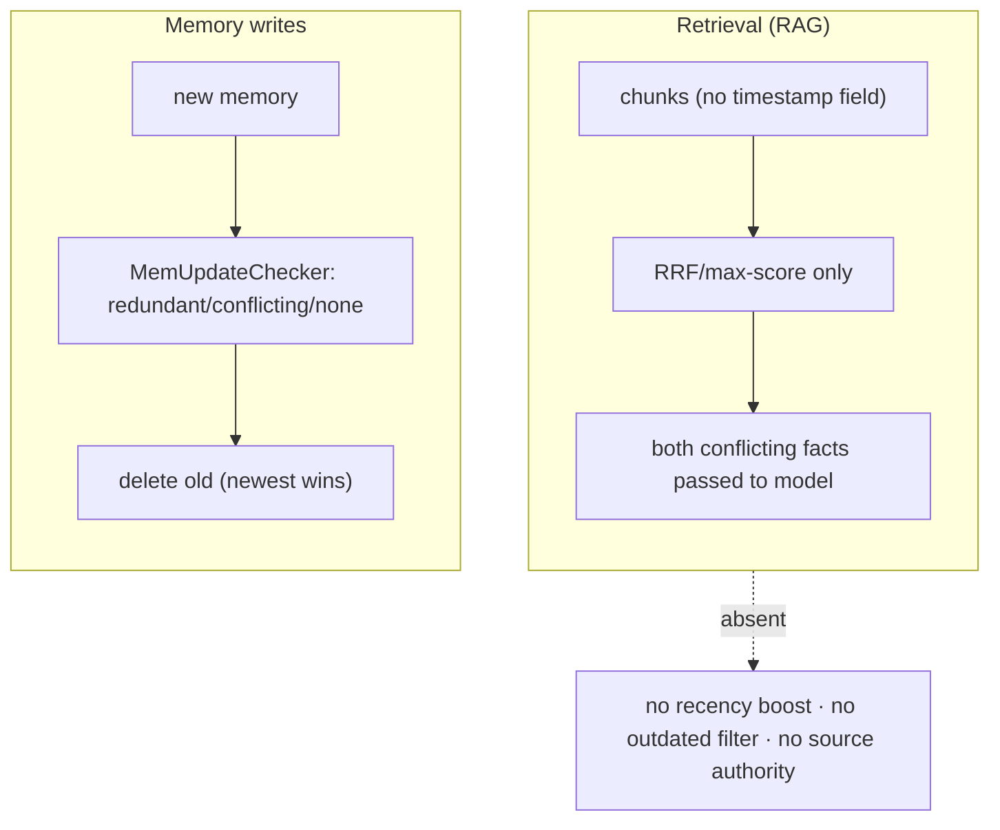
```mermaid
flowchart TD
    subgraph RET["Retrieval (RAG)"]
    direction TB
    R["chunks (no timestamp field)"] --> M["RRF/max-score only"]
    M --> GEN["both conflicting facts passed to model"]
    end
    subgraph MEM["Memory writes"]
    direction TB
    N["new memory"] --> CHK["MemUpdateChecker: redundant/conflicting/none"] --> DEL["delete old (newest wins)"]
    end
    RET -.->|"absent"| X["no recency boost · no outdated filter · no source authority"]
```

**Anchors:** &bull; `agent-core/openjiuwen/core/retrieval/common/retrieval_result.py:23` — `RetrievalResult` (no timestamp/recency) &bull; `agent-core/openjiuwen/core/retrieval/common/document.py:30` — `TextChunk` (text/doc_id/metadata only) &bull; `agent-core/openjiuwen/core/retrieval/utils/fusion.py:39` — RRF by text/rank; `agent-core/openjiuwen/core/retrieval/simple_knowledge_base.py:313` — max-score merge, no recency tiebreak &bull; `agent-core/openjiuwen/core/memory/manage/update/mem_update_checker.py:22` — `CheckResult`; `:252` conflicting → add new/delete old; `agent-core/openjiuwen/core/memory/manage/index/fragment_memory_manager.py:163` &bull; `agent-core/openjiuwen/agent_evolving/experience/scorer.py:219` — `calc_freshness` (experiences only) &bull; `agent-core/openjiuwen/core/memory/long_term_memory.py:1004` — search sorts by score, ignores timestamp

---

## Summary: strong vs weak in Jiuwen

| Area | Strength | Notes |
|---|---|---|
| Multi-hop retrieval | Strong | agentic multi-round + triple beam/graph expansion |
| Sequential multi-doc retrieval | Mixed | shared triple memory + RRF; not document-planned; exact-text merge |
| Hop budget / loop prevention | Mixed | static caps (max_iter 2, graph_hops 2) + harness rails not wired into retriever |
| Bridging unrelated docs | Weak | entity-overlap only; no bridge component or entity aliasing |
| Hybrid search | Strong | native BM25 on Milvus, RRF everywhere; `alpha` dead |
| Dense-vs-keyword routing | Weak | config-driven, not query-content-driven |
| Fusion weighting/tuning | Weak | fixed RRF k=60; weighted fusion graph-only; no calibration |
| Agentic vs fixed pipeline | Strong | `agentic` flag wraps base retriever with LLM loop |
| Retrieval-necessity decision | Weak | no classifier; model tool choice + rail suppression only |
| Sufficiency / stop | Mixed | `_rewrite` sufficiency, judged on triples; parse failure silently stops |
| Loop/cost control | Mixed | caps + tool rails; no retrieval token/cost budget |
| Ambiguity / clarification | Weak | rewriter records `missing`; `ask_user` opt-in, not a RAG gate |
| Query rewriting / expansion | Mixed | coreference/typo/compression; no synonym expansion or HyDE |
| Query decomposition | Weak | prompt-level, sequential, one next question; no parallel planner |
| Structured (SQL) retrieval | Weak | absent; only a generic shell/code escape hatch |
| Multi-format balancing | Weak | uniform ingest; flat max-score sort, no quotas/weighting |
| Recency / conflicting docs | Weak | no document timestamps/recency; conflict handling is memory-write-only |
