# RAG practical interview questions — general answers + how Jiuwen does it

Based on the recurring list *RAG Interview Questions I Keep Seeing Everywhere* (Conceptual Basics; Chunking and Embeddings; Retrieval and Ranking; Common Failure Scenarios; Comparison Questions; Real-World System Questions; Cost and Practicality). Each section heading is the original question.

This set overlaps the earlier RAG-retrieval doc heavily, so identical questions reuse the same **General** and **Jiuwen** answers and anchors verbatim. The questions unique to this set are: RAG vs. pasting into long context, when to skip RAG, probing whether a chunk contains the answer, run-to-run non-determinism, chunk-boundary truncation, multilingual corpora, conflicting sources, and the cost/token-reduction questions. See [README](README.md) for the shared conventions (answer shape, anchor format, repo layers).

> **The pattern worth noticing:** wording changes across platforms, but it's the same concerns repeating: chunking, retrieval quality, failure handling, cost. Speak fluently about all four with a concrete number and you can handle nearly any version of this question.

---

# Conceptual basics

## 1. Why RAG exists instead of just fine-tuning on new knowledge

**General:** Fine-tuning bakes knowledge into the weights: it is expensive, slow to update, cannot cite, and changing one fact means retraining. RAG keeps knowledge in an external, editable store and retrieves it at query time: updates are cheap (re-index a document), answers can cite sources, and access can be permissioned. Fine-tuning is for behavior/style/format; RAG is for knowledge. For volatile or long-tail facts, RAG is the only practical option.

**Jiuwen:** The repo does not encode a decision rule, but it separates the two capabilities: `core/retrieval` supplies knowledge at query time while `agent_evolving/agent_rl` optionally tunes weights. The design rationale in the self-optimizing-agent docs argues against fine-tuning on bad cases because cost is high and the fix cycle is tied to the model's fine-tuning version; the default alternative is prompt/instruction optimization. Fine-tuning exists only as LoRA/PEFT under `agent_rl`.

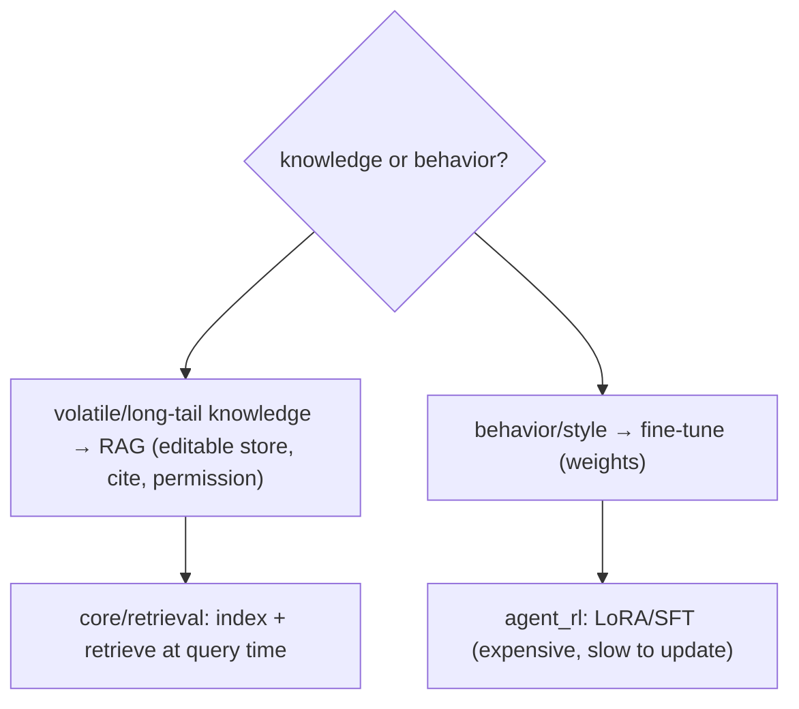
```mermaid
flowchart TD
    Q{"knowledge or behavior?"} --> K["volatile/long-tail knowledge → RAG (editable store, cite, permission)"]
    Q --> B["behavior/style → fine-tune (weights)"]
    K --> R["core/retrieval: index + retrieve at query time"]
    B --> L["agent_rl: LoRA/SFT (expensive, slow to update)"]
```

**Anchors:** &bull; `agent-core/openjiuwen/core/retrieval/retriever/vector_retriever.py:78` — retrieval path (knowledge at query time) &bull; `agent-core/openjiuwen/agent_evolving/agent_rl/online/backends/sft/trainer.py:44` — weight-tuning path (LoRA/SFT) &bull; `agent-core/openjiuwen/agent_evolving/optimizer/llm_call/instruction_optimizer.py:30` — default prompt-optimization alternative &bull; `agent-core/openjiuwen/agent_evolving/trainer/trainer.py:241` — candidate prompt updates, keep best

## 2. The pipeline: query embedding, vector search, context assembly, prompt construction, generation

**General:** Ingest: parse → chunk → embed → index. Query: embed the query → retrieve top-k (dense and/or sparse) → rerank → assemble the retrieved context into the prompt → generate → optionally cite. Each stage is separable; failures and quality drops can occur at any of them.

**Jiuwen:** Ingestion: `KnowledgeBase.parse_files` (parser), then `SimpleKnowledgeBase.add_documents` calls `chunker.chunk_documents`, builds an `IndexConfig`, and `Indexer.build_index` computes embeddings via `compute_chunk_embeddings` and writes them to the vector store. Query: `SimpleKnowledgeBase.retrieve` lazily instantiates `VectorRetriever`/`SparseRetriever`/`HybridRetriever` by `index_type`, embeds the query, and calls `vector_store.search`. The production end-to-end wiring is the workflow `KnowledgeRetrievalComponent`, which returns `results`/`context`; a downstream `LLMComponent` formats them into the prompt.

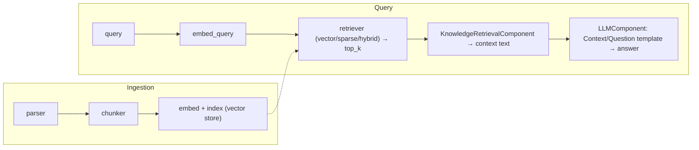
```mermaid
flowchart LR
    subgraph ING["Ingestion"]
    P["parser"] --> C["chunker"] --> E["embed + index (vector store)"]
    end
    subgraph QRY["Query"]
    Q["query"] --> QE["embed_query"]
    QE --> RET["retriever (vector/sparse/hybrid) → top_k"]
    RET --> CTX["KnowledgeRetrievalComponent → context text"]
    CTX --> LLM["LLMComponent: Context/Question template → answer"]
    end
    E -.-> RET
```

**Anchors:** &bull; `agent-core/openjiuwen/core/retrieval/simple_knowledge_base.py:96` — `chunk_documents`; `:110` `build_index(...)`; `:182` delegate to retriever &bull; `agent-core/openjiuwen/core/retrieval/indexing/indexer/embed_chunks.py:46/73` — `embed_documents` / `embed_multimodal` &bull; `agent-core/openjiuwen/core/retrieval/retriever/vector_retriever.py:78` — `embed_query` → `vector_store.search` &bull; `agent-core/openjiuwen/core/workflow/components/resource/knowledge_retrieval_comp.py:109` — `retrieve_multi_kb_with_source(...)`; `:243` joins texts into `context` &bull; `agent-core/openjiuwen/core/workflow/components/llm/llm_comp.py:654` — template format feeding `{{context}}`/`{{query}}`

**Gap.** No packaged end-to-end RAG agent or retrieval tool in `harness`/`agent_teams`.

## 3. RAG vs. pasting retrieved text into a long-context prompt

**General:** With a large context window you can skip retrieval and paste whole documents. That is simpler and avoids chunking errors, but it is expensive (you pay for every token every call), slow (TTFT grows with context), noisy (irrelevant text dilutes attention), and limited to what fits. RAG pays a one-time indexing cost and per-query retrieval, keeps the prompt small, and scales to corpora far larger than any window. The trade is a retrieval system and its failure modes for token efficiency and scale.

**Jiuwen:** The KB is not budgeted against the model window. `KnowledgeRetrievalExecutable._format_output` simply concatenates result texts with `"\n\n"` into a `context` string — the only bound is `top_k`; there is no token count, truncation, or window check before insertion. The context engine has real budgeting primitives (`context_window_tokens`, `effective_context_budget`, `ContextWindowUsage.occupancy_rate`, `FullCompactProcessor` at 180k), but those apply to the *conversation*, and retrieved text enters as ordinary messages measured only after the fact. There is no comparison or decision guidance for "retrieve top-k" vs. "paste whole document".

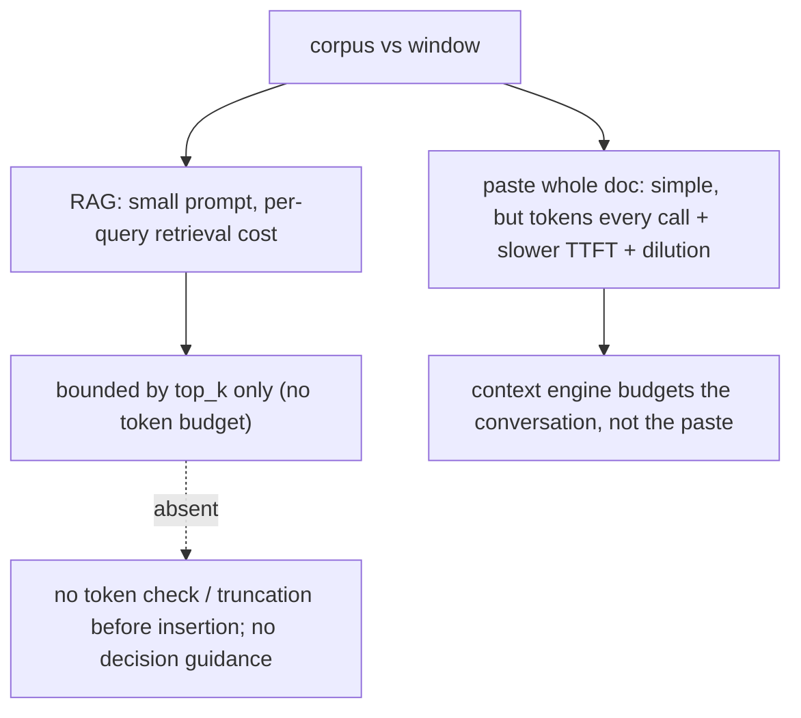
```mermaid
flowchart TD
    Q["corpus vs window"] --> RAG["RAG: small prompt, per-query retrieval cost"]
    Q --> PASTE["paste whole doc: simple, but tokens every call + slower TTFT + dilution"]
    RAG --> RB["bounded by top_k only (no token budget)"]
    PASTE --> CTX["context engine budgets the conversation, not the paste"]
    RB -.->|"absent"| X["no token check / truncation before insertion; no decision guidance"]
```

**Anchors:** &bull; `agent-core/openjiuwen/core/workflow/components/resource/knowledge_retrieval_comp.py:241` — `_format_output` joins `r.text` with `"\n\n"`, unbounded; `:109` bounded only by `top_k` &bull; `agent-core/openjiuwen/core/context_engine/schema/config.py:136` — `context_window_tokens`; `:131` `max_context_message_num`; `:139` `model_context_window_tokens` &bull; `agent-core/openjiuwen/core/context_engine/processor/budget_guard.py:37` — `effective_context_budget` (strictest positive) &bull; `agent-core/openjiuwen/core/context_engine/usage/models.py:45` — `ContextWindowUsage.limit_tokens` / `occupancy_rate` &bull; `agent-core/openjiuwen/core/context_engine/processor/compressor/full_compact_processor.py:184` — 180k compaction threshold

**Gap.** No token budgeting on retrieved context; the only safety net is post-hoc conversation compaction (itself an extra LLM call).

## 4. When to skip RAG and rely on parametric knowledge instead

**General:** Skip retrieval when the question is general knowledge the model already holds (definitions, common facts, reasoning, code), when latency/cost matter and the corpus is unlikely to add signal, or when the query is conversational and context is already in the window. Retrieve when the answer depends on private, recent, or verifiable facts. The decision is often made by the model choosing whether to call a retrieval tool; a cheap classifier is the alternative.

**Jiuwen:** There is no skip-retrieval classifier. `RetrievalConfig.agentic` is opt-in (default `False`); when enabled, `AgenticRetriever` still executes at least one retrieval unconditionally and uses an LLM "sufficiency" judgment only to decide whether to issue *another* rewritten query — it stops extra rounds, never the first. Otherwise the retrieval-vs-parametric decision is delegated to the model's tool choice: `memory_search` is a normal tool card the agent may elect to call, and skill retrieval is invoked through tool calls. Nothing inspects the query to decide "the model already knows this".

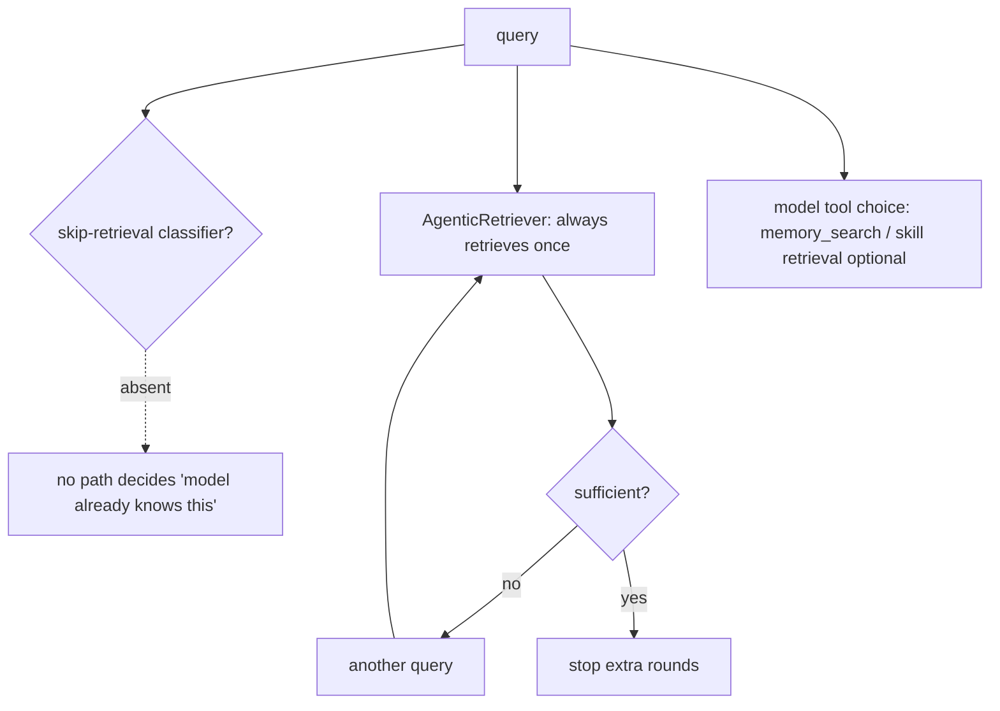
```mermaid
flowchart TD
    Q["query"] --> C{"skip-retrieval classifier?"}
    C -.->|"absent"| X["no path decides 'model already knows this'"]
    Q --> A["AgenticRetriever: always retrieves once"]
    A --> S{"sufficient?"}
    S -->|no| NQ["another query"] --> A
    S -->|yes| ANS["stop extra rounds"]
    Q --> T["model tool choice: memory_search / skill retrieval optional"]
```

**Anchors:** &bull; `agent-core/openjiuwen/core/retrieval/retriever/agentic_retriever.py:173` — `retrieve` always performs one round; `:326` `_rewrite` returns `None` when sufficient; `:241` loop breaks after `max_iter` &bull; `agent-core/openjiuwen/core/retrieval/common/config.py:51` — `RetrievalConfig.agentic: bool = False` (opt-in, not a router) &bull; `agent-core/openjiuwen/harness/tools/memory.py:25` — `memory_search` tool (model decides whether to call)

**Gap.** No retrieval-necessity classifier or confidence threshold; every skip decision is implicit in the model's tool call.

---

# Chunking and embeddings

## 5. Chunk size tradeoffs: too small loses context, too large dilutes relevance

**General:** Too small and each chunk lacks context (and the answer may split across chunks); too large and a chunk covers many topics, diluting its embedding and wasting prompt budget. Defaults are a few hundred tokens with modest overlap, tuned on a retrieval eval. Size is measured in tokens the model sees.

**Jiuwen:** `Chunker.__init__` validates `chunk_size > 0`, `0 <= chunk_overlap`, and `chunk_overlap < chunk_size`, raising typed errors otherwise. `CharSplitter` (character units) clamps overlap and size so `step` cannot be zero/negative; `IndexSentenceSplitter`/`TextChunker` (token units) clamp `chunk_size` to the tokenizer's `model_max_length` (with a 65536 fallback). At storage, Milvus declares the text field `VARCHAR max_length=65535`, so an oversized chunk fails at insert. Defaults: `chunk_size=512`, `chunk_overlap=50`.

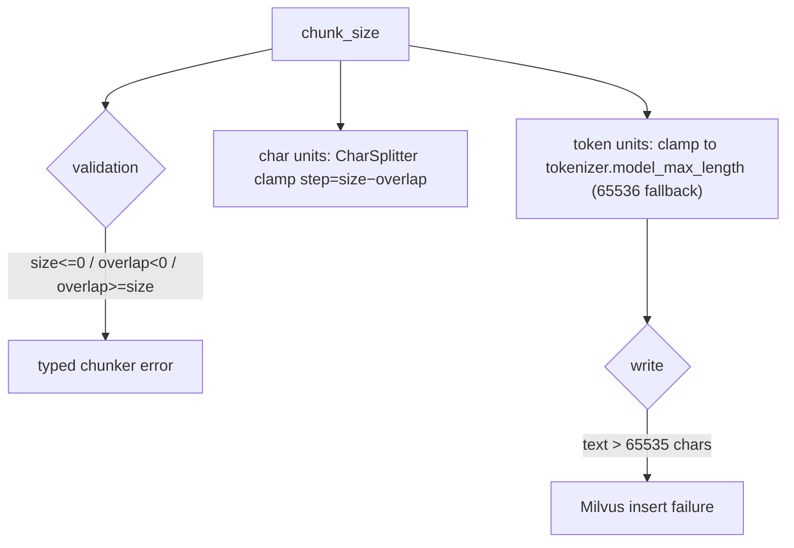
```mermaid
flowchart TD
    S["chunk_size"] --> V{"validation"}
    V -->|"size<=0 / overlap<0 / overlap>=size"| ERR["typed chunker error"]
    S --> CHAR["char units: CharSplitter clamp step=size−overlap"]
    S --> TOK["token units: clamp to tokenizer.model_max_length (65536 fallback)"]
    TOK --> INSERT{"write"}
    INSERT -->|"text > 65535 chars"| MF["Milvus insert failure"]
```

**Anchors:** &bull; `agent-core/openjiuwen/core/retrieval/indexing/processor/chunker/base.py:59` — validation; `agent-core/openjiuwen/core/retrieval/indexing/processor/chunker/text_splitter.py:43` — overlap clamp; `:44` size clamp; `:207` `_resolve_chunk_size` (65536 fallback at `:23`) &bull; `agent-core/openjiuwen/core/retrieval/indexing/processor/chunker/chunking.py:82` — tokenizer-limit auto-adjust &bull; `agent-core/openjiuwen/core/retrieval/indexing/indexer/milvus_indexer.py:378` — text `max_length=65535` &bull; `agent-core/openjiuwen/core/retrieval/common/config.py:34` — `chunk_size=512`, `chunk_overlap=50`

## 6. Fixed-size vs. semantic chunking, the actual precision tradeoff

**General:** Fixed-size chunking is deterministic and cheap but cuts mid-sentence or mid-table, producing fragments that embed poorly. Semantic/structure-aware chunking splits on natural boundaries (sentences, paragraphs, headings, records) so each chunk is coherent, at the cost of variable size and extra processing.

**Jiuwen:** True fixed-size is `CharChunker` (raw character windows via `CharSplitter`). Token-based `TokenizerChunker` is actually sentence-boundary-aware: `SentenceSplitter` uses `pysbd` to segment and packs whole sentences up to a token budget, sub-splitting overly long sentences. `HybridChunker` is a structural guard — it keeps `source_type in ("row","column")` units whole and delegates the rest. There is no embedding-similarity breakpoint chunker and no recursive delimiter hierarchy.

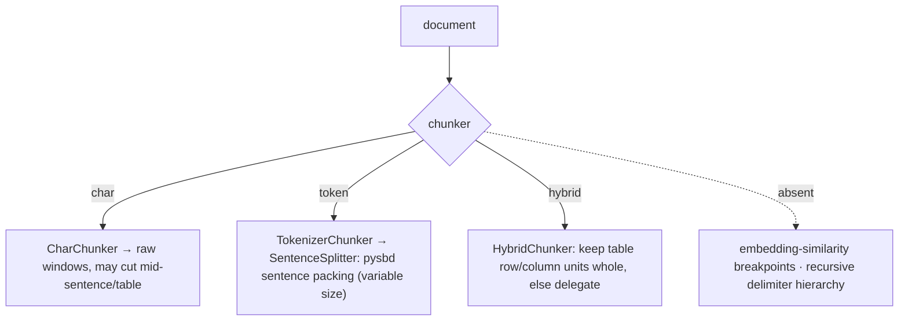
```mermaid
flowchart TD
    D["document"] --> K{"chunker"}
    K -->|char| CC["CharChunker → raw windows, may cut mid-sentence/table"]
    K -->|token| TC["TokenizerChunker → SentenceSplitter: pysbd sentence packing (variable size)"]
    K -->|hybrid| HC["HybridChunker: keep table row/column units whole, else delegate"]
    K -.->|"absent"| SEM["embedding-similarity breakpoints · recursive delimiter hierarchy"]
```

**Anchors:** &bull; `agent-core/openjiuwen/core/retrieval/indexing/processor/chunker/char_chunker.py:12` — `CharChunker`; `:47` builds `CharSplitter` &bull; `agent-core/openjiuwen/core/retrieval/indexing/processor/chunker/text_splitter.py:34` — `CharSplitter.split`; `:70` `IndexSentenceSplitter` &bull; `agent-core/openjiuwen/core/retrieval/indexing/processor/splitter/splitter.py:92` — `SentenceSplitter.__call__` (pysbd) &bull; `agent-core/openjiuwen/core/retrieval/indexing/processor/chunker/hybrid_chunker.py:19` — no-split predicate; `:66` delegation &bull; `agent-core/openjiuwen/core/retrieval/indexing/processor/chunker/__init__.py:117` — only `"char"`/`"hybrid"` registered

## 7. Why a bigger embedding model doesn't always mean better retrieval

**General:** Bigger is not automatically better: retrieval quality depends on domain fit, language, whether the model is asymmetric (query vs passage prefixes), the affordable dimension, and latency/cost. A smaller in-domain model often beats a large general one, and Matryoshka dimension reduction trades a little recall for large storage savings. Measure on your own data.

**Jiuwen:** An `Embedding` ABC defines `embed_query`, `embed_documents`, and a `dimension` property; `EmbeddingConfig` carries only `model_name`/`base_url`/`api_key`. Providers are `APIEmbedding`, `OpenAIEmbedding`, `VLLMEmbedding` (adds multimodal `instruction`), and `DashscopeEmbedding`. Dimension is discovered lazily or set explicitly for Matryoshka models. Model choice is caller-driven — no registry, benchmark, or size heuristic.

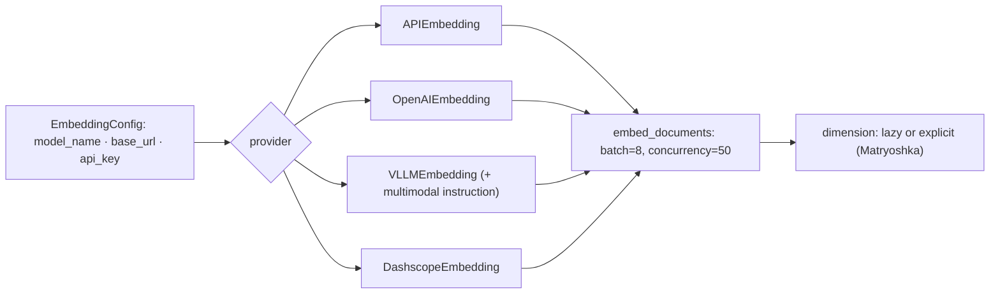
```mermaid
flowchart LR
    CFG["EmbeddingConfig: model_name · base_url · api_key"] --> P{"provider"}
    P --> API["APIEmbedding"]
    P --> OAI["OpenAIEmbedding"]
    P --> VLLM["VLLMEmbedding (+ multimodal instruction)"]
    P --> DS["DashscopeEmbedding"]
    API --> B["embed_documents: batch=8, concurrency=50"]
    OAI --> B
    VLLM --> B
    DS --> B
    B --> DIM["dimension: lazy or explicit (Matryoshka)"]
```

**Anchors:** &bull; `agent-core/openjiuwen/core/foundation/store/base_embedding.py:16` — `EmbeddingConfig`; `:24` `Embedding` ABC; `:29` `embed_query` &bull; `agent-core/openjiuwen/core/retrieval/embedding/openai_embedding.py:67` — Matryoshka `dimension`; `agent-core/openjiuwen/core/retrieval/embedding/dashscope_embedding.py:105` — Dashscope `dimension` &bull; `agent-core/openjiuwen/core/retrieval/embedding/api_embedding.py:45` — `max_batch_size=8`; `:46` `max_concurrent=50` &bull; `agent-core/openjiuwen/core/retrieval/embedding/vllm_embedding.py:17` — `VLLMEmbedding`

## 8. Why swapping embedding models forces re-embedding the whole corpus

**General:** Stored vectors are the output of one specific model. A different model — even at the same dimension — projects into a different space, so old and new vectors are not comparable. You must re-embed every chunk and often rebuild the index, since the vector width may change too. Good systems persist a model fingerprint with the index so a mismatch is detected.

**Jiuwen:** At index time `compute_chunk_embeddings` calls `embed_model.embed_documents` and mutates `chunk.embedding` in place. Milvus derives the collection vector `dim` from `embed_model.dimension` at schema creation and stores only the width — the model identity is **not persisted**. `update_index` deletes a doc's rows and rebuilds. Dimension is a hard constraint (Milvus/Chroma fixed-width, pgvector ≤2000). A model swap means a manual full re-index.

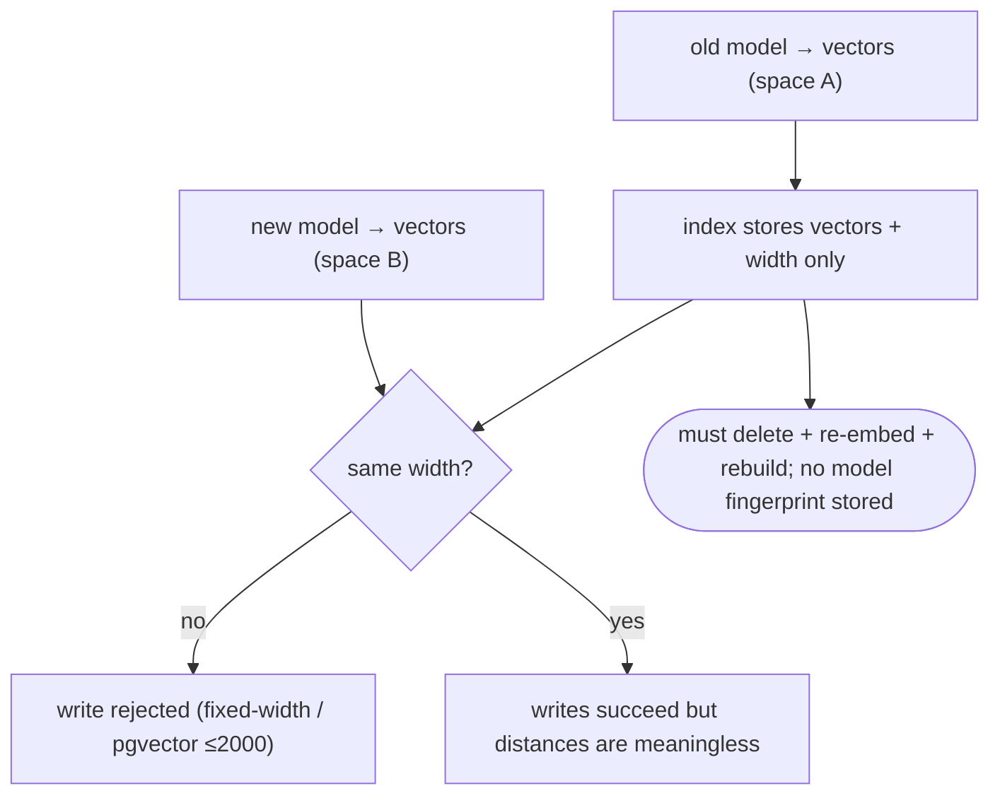
```mermaid
flowchart TD
    OLD["old model → vectors (space A)"] --> IDX["index stores vectors + width only"]
    NEW["new model → vectors (space B)"] --> M{"same width?"}
    IDX --> M
    M -->|no| FAIL["write rejected (fixed-width / pgvector ≤2000)"]
    M -->|yes| BAD["writes succeed but distances are meaningless"]
    IDX --> RE(["must delete + re-embed + rebuild; no model fingerprint stored"])
```

**Anchors:** &bull; `agent-core/openjiuwen/core/retrieval/indexing/indexer/embed_chunks.py:21` — `compute_chunk_embeddings`; `:46` `embed_documents` sets vectors &bull; `agent-core/openjiuwen/core/retrieval/indexing/indexer/milvus_indexer.py:409` — `dimension = embed_model.dimension`; `:427` schema stores `dim` but no model name; `:209` `update_index` = delete + rebuild &bull; `agent-core/openjiuwen/core/retrieval/vector_store/pg_store.py:129` — fixed pgvector table &bull; `agent-core/openjiuwen/core/foundation/store/vector/utils.py:264` — `UpdateEmbeddingDimensionOperation`

---

# Retrieval and ranking

## 9. Why cosine similarity alone doesn't guarantee the right doc ranks first

**General:** Cosine measures vector closeness, not answer relevance. It is symmetric, ignores term importance, is not calibrated across queries/documents, and a generic chunk can sit near the query while the exact answer ranks lower. Top-k by cosine is a recall-oriented candidate step; ranking quality comes from models, hybrid exact-match signals, metadata filters, and reranking.

**Jiuwen:** The KB ranks purely by the vector store's returned score: `VectorRetriever` searches and only applies a post-hoc `score_threshold`, preserving store order. Stores normalize heterogeneous raw distances into `[0,1]` per backend (Milvus cosine `(s+1)/2`, Chroma `(2-d)/2`), so scores are rescaled distances, not calibrated probabilities, and are not comparable across stores/collections. There is no MMR, diversity, or cross-encoder step in the KB path.

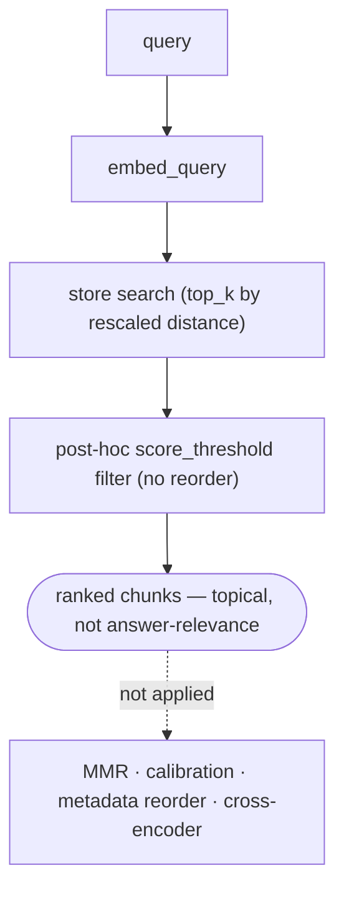
```mermaid
flowchart TD
    Q["query"] --> QE["embed_query"]
    QE --> SR["store search (top_k by rescaled distance)"]
    SR --> TH["post-hoc score_threshold filter (no reorder)"]
    TH --> R(["ranked chunks — topical, not answer-relevance"])
    R -.->|"not applied"| X["MMR · calibration · metadata reorder · cross-encoder"]
```

**Anchors:** &bull; `agent-core/openjiuwen/core/retrieval/retriever/vector_retriever.py:79` — raw store search; `:94` threshold filter only &bull; `agent-core/openjiuwen/core/retrieval/simple_knowledge_base.py:182` — results returned as-is &bull; `agent-core/openjiuwen/core/retrieval/common/config.py:81` — `distance_metric` default `cosine` &bull; `agent-core/openjiuwen/core/foundation/store/vector/utils.py:35/49/63` — similarity normalizers &bull; `agent-core/openjiuwen/core/retrieval/vector_store/milvus_store.py:457` — metric-dependent conversion; `agent-core/openjiuwen/core/retrieval/vector_store/pg_store.py:512` — different per-metric math

## 10. Reranking: cross-encoder scoring pairs directly vs. bi-encoder scoring independently

**General:** A bi-encoder embeds query and document independently (fast, precomputable, indexable) but cannot model their interaction. A cross-encoder feeds query+document together and scores the pair, capturing fine-grained relevance at the cost of one forward pass per candidate — hence two-stage retrieval. Reranking improves precision@k but cannot recover documents retrieval never returned.

**Jiuwen:** Retrieval is bi-encoder (independent embeddings, vector similarity). Reranking is cross-encoder / LLM-as-reranker: `StandardReranker` POSTs `instruct+query` and all documents to `/rerank` and reads `relevance_score`; `ChatReranker` (experimental) returns `P(yes)/(P(yes)+P(no))` from logprobs; `DashscopeReranker` extends `StandardReranker`. But reranking is integrated only in the graph store and the KB path never invokes it.

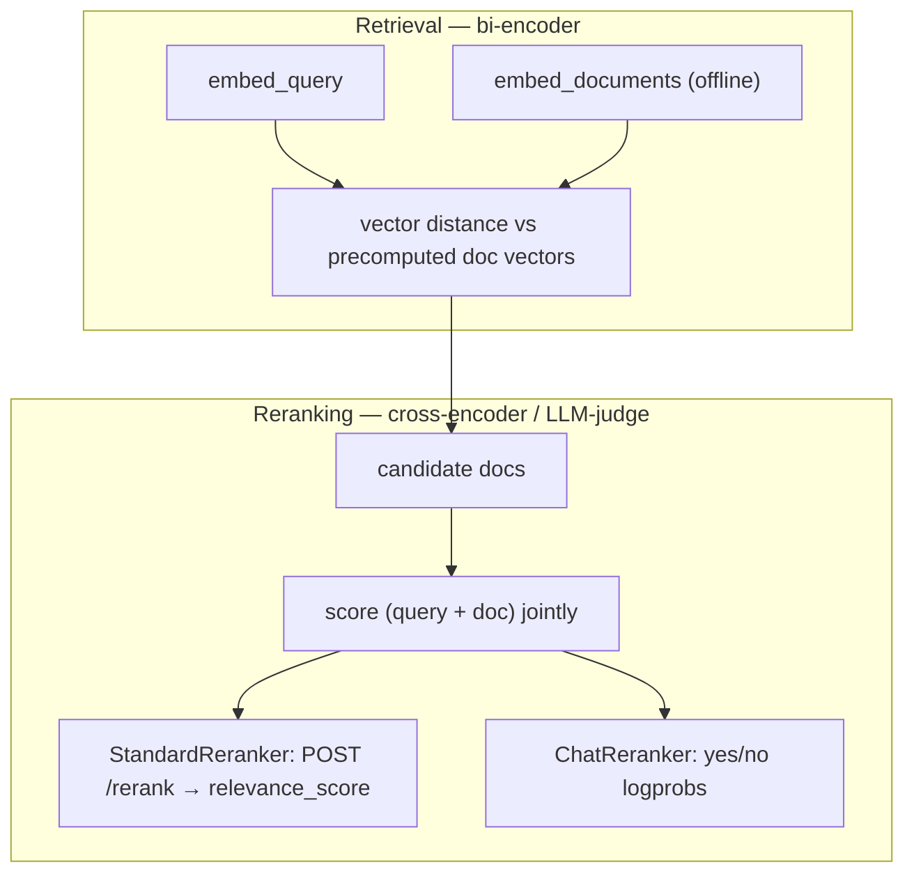
```mermaid
flowchart TD
    subgraph BI["Retrieval — bi-encoder"]
    QE["embed_query"] --> DIST["vector distance vs precomputed doc vectors"]
    DE["embed_documents (offline)"] --> DIST
    end
    subgraph CE["Reranking — cross-encoder / LLM-judge"]
    CAND["candidate docs"] --> SC["score (query + doc) jointly"]
    SC --> SR["StandardReranker: POST /rerank → relevance_score"]
    SC --> CR["ChatReranker: yes/no logprobs"]
    end
    DIST --> CAND
```

**Anchors:** &bull; `agent-core/openjiuwen/core/retrieval/retriever/vector_retriever.py:78` — independent query bi-encoder &bull; `agent-core/openjiuwen/core/retrieval/reranker/standard_reranker.py:28` — `/rerank` endpoint; `:29` instruct+query template; `:81` parses `relevance_score` &bull; `agent-core/openjiuwen/core/retrieval/reranker/chat_reranker.py:83` — logprob yes/no scoring &bull; `agent-core/openjiuwen/core/retrieval/reranker/dashscope_reranker.py:16` — DashScope reranker &bull; `agent-core/openjiuwen/core/foundation/store/graph/milvus/milvus_support.py:458` — reranker applied only when truthy &bull; `agent-core/openjiuwen/core/retrieval/simple_knowledge_base.py:182` — KB retrieve has no rerank call

## 11. Handling vocabulary mismatch between query and document wording

**General:** The document says "myocardial infarction", the user says "heart attack". Mitigations: better embeddings (semantic match), query expansion/synonyms, HyDE, and hybrid search so exact terms still match. Pure dense handles paraphrase but not rare terms; pure sparse handles rare terms but not paraphrase.

**Jiuwen:** The `QueryRewriter` targets coreference/ellipsis/semantic gaps: it produces a `standalone_query` and records `typo` corrections, `missing` items, and `references`. Retrieval-side semantic matching comes from the vector/hybrid retrievers and graph-memory name embeddings. There is no HyDE, no synonym/query-expansion dictionary, and no pseudo-document generation.

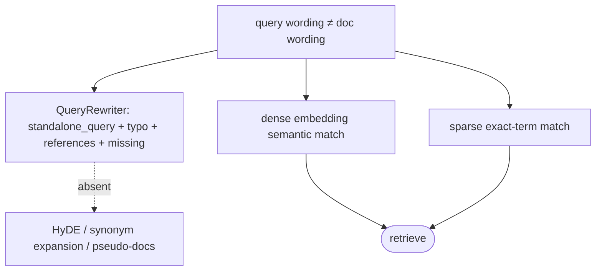
```mermaid
flowchart TD
    Q["query wording ≠ doc wording"] --> RW["QueryRewriter: standalone_query + typo + references + missing"]
    Q --> EMB["dense embedding semantic match"]
    Q --> SP["sparse exact-term match"]
    RW -.->|"absent"| HYDE["HyDE / synonym expansion / pseudo-docs"]
    EMB --> R(["retrieve"])
    SP --> R
```

**Anchors:** &bull; `agent-core/openjiuwen/core/retrieval/query_rewriter/query_rewriter.py:412` — `rewrite(query)` → `standalone_query`; `:277` output schema &bull; `agent-core/openjiuwen/core/retrieval/query_rewriter/prompts/intention_completion_en.md:32` — coreference resolution; `:41` missing-info; `:47` typo correction &bull; `agent-core/openjiuwen/core/retrieval/retriever/graph_retriever.py:349` — vector retriever (dense semantic match) &bull; `agent-core/openjiuwen/core/memory/graph/graph_memory/base.py:735` — `_fetch_relevant_entities` semantic entity match

## 12. Dense vs. sparse retrieval, and fusing both with reciprocal rank fusion

**General:** Dense retrieval embeds queries/documents and searches a vector index; it matches meaning but can miss rare exact terms. Sparse retrieval (BM25/TF-IDF) matches literal terms with term-frequency weighting; strong on exact tokens but fails on paraphrase. Fuse both — RRF (`Σ 1/(k+rank)`) is the robust default because it needs no score calibration.

**Jiuwen:** Dense is `VectorRetriever`; sparse is `SparseRetriever`, which on Milvus is real BM25 (`metric_type="BM25"` against a `SPARSE_FLOAT_VECTOR` field with `SPARSE_INVERTED_INDEX`). Chroma falls back to a TF-IDF text query; PG uses full-text search. `HybridRetriever` takes an `alpha` but every backend actually uses RRF: Milvus `RRFRanker(k=60)`, Chroma/PG `rrf_fusion(..., k=60)` scoring deduped text by `Σ 1/(k+rank)`. The only true weighted fusion is in the graph store (`WeightedRankConfig`).

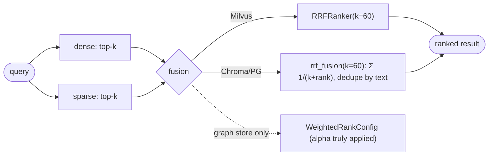
```mermaid
flowchart LR
    Q(["query"]) --> D["dense: top-k"]
    Q --> S["sparse: top-k"]
    D --> F{"fusion"}
    S --> F
    F -->|Milvus| M["RRFRanker(k=60)"]
    F -->|Chroma/PG| C["rrf_fusion(k=60): Σ 1/(k+rank), dedupe by text"]
    F -.->|"graph store only"| W["WeightedRankConfig (alpha truly applied)"]
    M --> R(["ranked result"])
    C --> R
```

**Anchors:** &bull; `agent-core/openjiuwen/core/retrieval/retriever/sparse_retriever.py:19` — `SparseRetriever` (BM25); `:62` delegates to `sparse_search` &bull; `agent-core/openjiuwen/core/retrieval/vector_store/milvus_store.py:277` — `metric_type: "BM25"`; `:348` native `RRFRanker(k=60)` &bull; `agent-core/openjiuwen/core/retrieval/indexing/indexer/milvus_indexer.py:390` — Milvus `Function(BM25)`; `:399` `SPARSE_INVERTED_INDEX` &bull; `agent-core/openjiuwen/core/retrieval/retriever/hybrid_retriever.py:26` — `alpha` (ignored by stores) &bull; `agent-core/openjiuwen/core/retrieval/utils/fusion.py:15/39` — `rrf_fusion` + `1/(k+rank)` &bull; `agent-core/openjiuwen/core/retrieval/vector_store/chroma_store.py:300` — no BM25 (TF-IDF); `agent-core/openjiuwen/core/retrieval/vector_store/pg_store.py:375` — FTS

---

# Common failure scenarios

## 13. Retrieval looks correct, answer is wrong: check if the chunk actually contains the answer

**General:** "Looked relevant" is not "contains the answer". The first diagnostic is to read the retrieved chunks and confirm the answer span is actually present — if it is not, retrieval failed (bad chunking, wrong index, query mismatch); if it is present but the answer is wrong, the problem is generation or grounding. This is why faithfulness evaluation needs the retrieved context, not just answer-vs-reference.

**Jiuwen:** There is no tooling for "does the retrieved chunk contain the answer". The closest signals: `score_threshold` defaults to `None` (so weak chunks pass), relevance checks are lexical (`free_search`), and the judges (`AccuracyEvaluator`, `LLMAsJudgeMetric`) do not receive the retrieved context, so they cannot distinguish "context lacks the answer" from "model ignored it". The `VerificationReviewer`'s `Correctness` dimension checks the output, not the grounding.

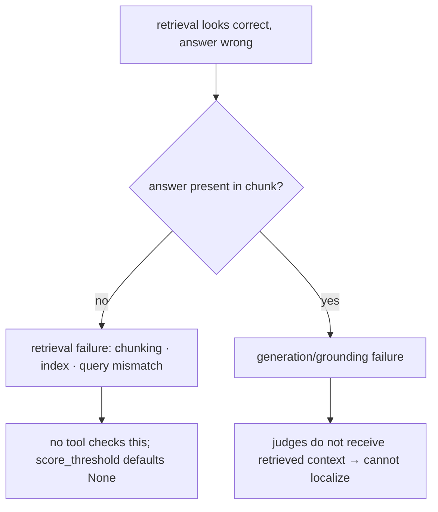
```mermaid
flowchart TD
    A["retrieval looks correct, answer wrong"] --> Q{"answer present in chunk?"}
    Q -->|no| R["retrieval failure: chunking · index · query mismatch"]
    Q -->|yes| G["generation/grounding failure"]
    R --> X["no tool checks this; score_threshold defaults None"]
    G --> Y["judges do not receive retrieved context → cannot localize"]
```

**Anchors:** &bull; `agent-core/openjiuwen/core/retrieval/common/config.py:47` — `score_threshold` defaults `None` &bull; `agent-core/openjiuwen/harness/tools/web/free_search.py:299` — lexical relevance only &bull; `agent-core/openjiuwen/symphony/evaluation/evaluators.py:438` — `AccuracyEvaluator` (no context input) &bull; `agent-core/openjiuwen/agent_evolving/evaluator/metrics/llm_as_judge.py:58` — parses `result: true/false`, no context/attribution &bull; `agent-core/openjiuwen/agent_teams/verification/reviewer.py:43` — `Correctness` dimension on the output

## 14. No relevant documents exist: expected behavior is a confidence-gated "not enough information"

**General:** When retrieval returns nothing relevant, the system should abstain rather than answer from noise: gate on a retrieval-score threshold or an explicit answerability check, and return "not enough information" (or ask a clarifying question). Without this, the model will still produce a fluent answer from irrelevant context.

**Jiuwen:** There is a retrieval score filter but its default is `None`, so out-of-scope chunks are normally returned. `AgenticRetriever` asks an LLM whether facts are `sufficient`, but `sufficient=False` only generates a follow-up query — never a user-facing abstention. A true abstention path exists only in `symphony/retrieval` internal selection (`is_abstain` → empty candidates). Grounding is a separate, non-blocking review layer.

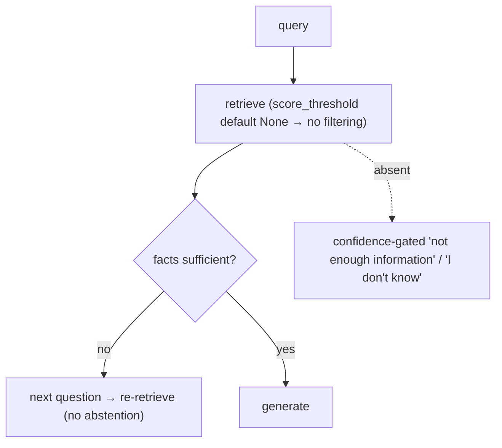
```mermaid
flowchart TD
    Q["query"] --> R["retrieve (score_threshold default None → no filtering)"]
    R --> S{"facts sufficient?"}
    S -->|no| NQ["next question → re-retrieve (no abstention)"]
    S -->|yes| GEN["generate"]
    R -.->|"absent"| X["confidence-gated 'not enough information' / 'I don't know'"]
```

**Anchors:** &bull; `agent-core/openjiuwen/core/retrieval/common/config.py:47` — `score_threshold` defaults `None`; `agent-core/openjiuwen/core/retrieval/retriever/vector_retriever.py:94` — applied only when supplied &bull; `agent-core/openjiuwen/core/retrieval/retriever/agentic_retriever.py:326` — `_rewrite` sufficiency (rewrite, not abstain) &bull; `agent-core/openjiuwen/symphony/retrieval/search/runtime/engine.py:94` — `is_abstain` → empty candidates; `agent-core/openjiuwen/symphony/retrieval/search/runtime/selector.py:305` — `is_abstain` &bull; `agent-core/openjiuwen/harness/subagents/verification_agent.py:51` — PASS/FAIL/PARTIAL verdict

## 15. Same question, different answers on different days: non-deterministic reranking or embedding drift

**General:** Run-to-run variation comes from sampling (temperature/seed), non-deterministic remote rerankers, and embedding drift (the provider updates the embedding model behind the same name, or you change models). Remedies: pin temperature/seed, store a model/version fingerprint with the index, and re-index when the fingerprint changes. Identical inputs should otherwise be reproducible.

**Jiuwen:** Determinism is partial. `ChatReranker` hard-codes `temperature=0` and `AgenticRetriever` calls its rewrite LLM at `temperature=0.0`, but `StandardReranker`/`DashscopeReranker` send no temperature or seed (the remote `/rerank` model decides), and `QueryRewriter` uses the configured temperature, which defaults to `None` (provider default). There is no seed plumbing and no embedding fingerprint in core retrieval — `OpenAIEmbedding`/`DashscopeEmbedding` store only a cached dimension. The memory/lite subsystem does store an `EmbeddingProvider.config_fingerprint` and re-indexes when it changes.

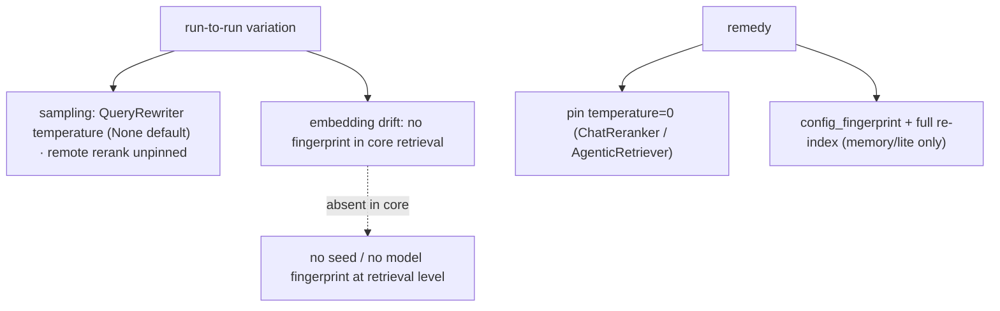
```mermaid
flowchart TD
    VAR["run-to-run variation"] --> S["sampling: QueryRewriter temperature (None default) · remote rerank unpinned"]
    VAR --> E["embedding drift: no fingerprint in core retrieval"]
    FIX["remedy"] --> P["pin temperature=0 (ChatReranker / AgenticRetriever)"]
    FIX --> FP["config_fingerprint + full re-index (memory/lite only)"]
    E -.->|"absent in core"| X["no seed / no model fingerprint at retrieval level"]
```

**Anchors:** &bull; `agent-core/openjiuwen/core/retrieval/reranker/chat_reranker.py:137` — hard-codes `"temperature": 0` &bull; `agent-core/openjiuwen/core/retrieval/reranker/standard_reranker.py:101` — rerank params (no temperature/seed) &bull; `agent-core/openjiuwen/core/retrieval/retriever/agentic_retriever.py:311` — rewrite LLM `temperature=0.0` &bull; `agent-core/openjiuwen/core/retrieval/query_rewriter/query_rewriter.py:265` — temperature from config; `agent-core/openjiuwen/core/foundation/llm/schema/config.py:210` — default `None` &bull; `agent-core/openjiuwen/core/memory/lite/embeddings.py:78` — `config_fingerprint`; `agent-core/openjiuwen/core/memory/lite/manager.py:888` — `_should_full_reindex` &bull; `agent-core/openjiuwen/symphony/retrieval/llm/base/types.py:58` — `seed=1223` (skill-retrieval subsystem only)

## 16. Context relevant but answer vague: chunk boundaries likely cut the answer mid context

**General:** If the answer spans a chunk boundary, the chunk that ranks may contain only half of it, so the model sees an incomplete fact. Remedies: overlap chunks, split on sentence/structure boundaries rather than fixed characters, and at serve time expand a hit with its neighbors. Sentence-aware chunking with overlap is the common fix; fixed-character splitting is the usual culprit.

**Jiuwen:** Protection is inconsistent by chunker. `SentenceSplitter` builds chunks from whole `pysbd` sentences, carries trailing sentences into the next chunk for overlap, and sub-splits over-long sentences losslessly; `HybridChunker` keeps table rows/columns whole. But `CharChunker`/`CharSplitter` (and the memory default `chunk_unit="char"`) hard-cut at fixed offsets, `WhitespaceNormalizer` collapses newlines and destroys paragraph structure before splitting, and downstream `budget_guard`/`round_level_compressor` truncate head/tail (dropping the middle) rather than extracting the answer span.

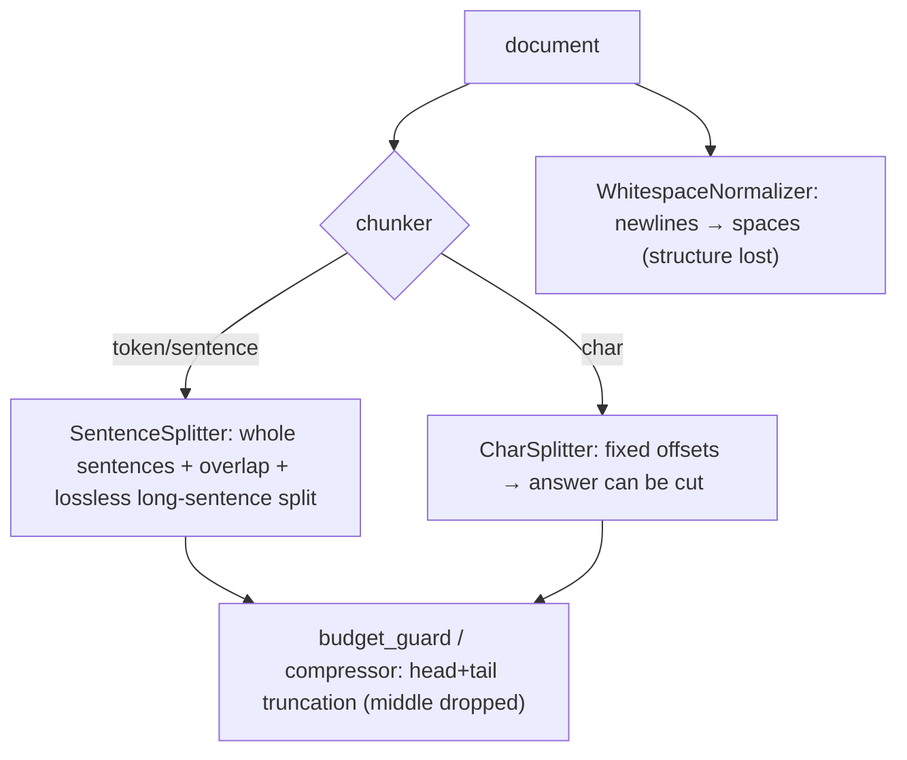
```mermaid
flowchart TD
    D["document"] --> CH{"chunker"}
    CH -->|"token/sentence"| S["SentenceSplitter: whole sentences + overlap + lossless long-sentence split"]
    CH -->|char| C["CharSplitter: fixed offsets → answer can be cut"]
    D --> PRE["WhitespaceNormalizer: newlines → spaces (structure lost)"]
    S --> POST["budget_guard / compressor: head+tail truncation (middle dropped)"]
    C --> POST
```

**Anchors:** &bull; `agent-core/openjiuwen/core/retrieval/indexing/processor/splitter/splitter.py:119` — long-sentence sub-split; `:142` `_sentences_with_spans`; `:210` `_flush` overlap &bull; `agent-core/openjiuwen/core/retrieval/indexing/processor/chunker/hybrid_chunker.py:19` — keep row/column units whole &bull; `agent-core/openjiuwen/core/retrieval/indexing/processor/chunker/text_splitter.py:56` — `CharSplitter` fixed offsets &bull; `agent-core/openjiuwen/core/retrieval/indexing/processor/chunker/text_preprocessor.py:53` — `WhitespaceNormalizer` &bull; `agent-core/openjiuwen/core/context_engine/processor/budget_guard.py:118` — head/tail truncation; `agent-core/openjiuwen/core/context_engine/processor/compressor/round_level_compressor.py:1088` — `_build_head_tail_truncated_text`

---

# Comparison questions

## 17. RAG vs. fine tuning vs. long context: changing knowledge vs. consistent style vs. small static corpus

**General:** RAG for changing/knowable knowledge (editable index, citations, scales past the window). Fine-tuning for consistent behavior/style/format (bake the pattern into weights, compress a long prompt, use a smaller model). Long context for a small, static corpus that fits the window and where the simplicity of "paste it all" beats building retrieval. They compose: fine-tune behavior, retrieve knowledge, and use long context when the corpus is small enough.

**Jiuwen:** These map to three separate subsystems: retrieval (`core/retrieval`), weight tuning (`agent_evolving/agent_rl`, LoRA/SFT), and context windowing (`core/context_engine`). The KB inserts retrieved text with no token budgeting, while the context engine budgets the conversation (`effective_context_budget`, `FullCompactProcessor` at 180k). There is no decision guidance comparing the three.

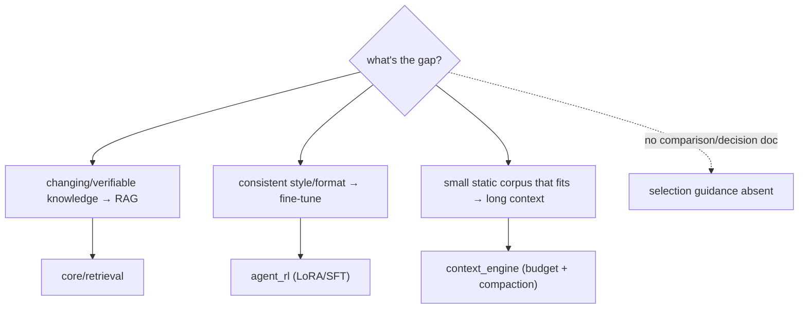
```mermaid
flowchart TD
    Q{"what's the gap?"} --> K["changing/verifiable knowledge → RAG"]
    Q --> S["consistent style/format → fine-tune"]
    Q --> C["small static corpus that fits → long context"]
    K --> R["core/retrieval"]
    S --> W["agent_rl (LoRA/SFT)"]
    C --> CE["context_engine (budget + compaction)"]
    Q -.->|"no comparison/decision doc"| X["selection guidance absent"]
```

**Anchors:** &bull; `agent-core/openjiuwen/core/retrieval/retriever/vector_retriever.py:78` — retrieval &bull; `agent-core/openjiuwen/agent_evolving/agent_rl/online/backends/sft/trainer.py:44` — weight tuning &bull; `agent-core/openjiuwen/core/context_engine/processor/budget_guard.py:37` — `effective_context_budget`; `agent-core/openjiuwen/core/context_engine/processor/compressor/full_compact_processor.py:184` — 180k compaction &bull; `agent-core/openjiuwen/core/workflow/components/resource/knowledge_retrieval_comp.py:241` — retrieved context concatenated unbounded

## 18. Vector DB vs. full-text search: full-text still wins on exact-match queries

**General:** Full-text (BM25) wins on exact terms — error codes, IDs, names, rare tokens — where dense embeddings carry little signal. Vector search wins on paraphrase and intent. Neither dominates; run both and fuse (RRF), or route by query type.

**Jiuwen:** Both are first-class: dense = `VectorRetriever`, sparse = `SparseRetriever` (real BM25 on Milvus; TF-IDF on Chroma; FTS on PG). Routing is config-driven (`index_type`), not query-content-driven — there is no intent→mode classifier, and the only dynamic behavior is a dense-empty→sparse fallback. Hybrid fuses with RRF.

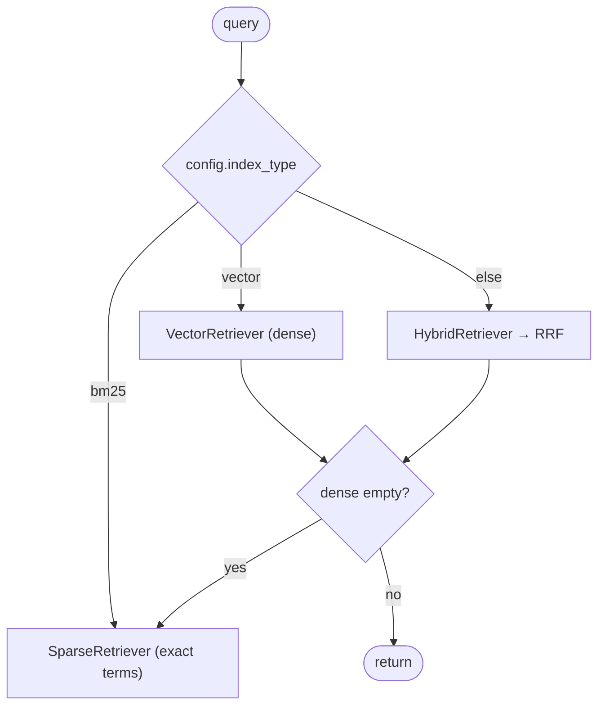
```mermaid
flowchart TD
    Q(["query"]) --> C{"config.index_type"}
    C -->|vector| V["VectorRetriever (dense)"]
    C -->|bm25| S["SparseRetriever (exact terms)"]
    C -->|"else"| H["HybridRetriever → RRF"]
    V --> D{"dense empty?"}
    D -->|yes| S
    D -->|no| R(["return"])
    H --> D
```

**Anchors:** &bull; `agent-core/openjiuwen/core/retrieval/retriever/sparse_retriever.py:19` — BM25 sparse; `agent-core/openjiuwen/core/retrieval/vector_store/milvus_store.py:277` — `metric_type: "BM25"` &bull; `agent-core/openjiuwen/core/retrieval/vector_store/chroma_store.py:300` — TF-IDF (no BM25); `agent-core/openjiuwen/core/retrieval/vector_store/pg_store.py:375` — FTS &bull; `agent-core/openjiuwen/core/retrieval/simple_knowledge_base.py:141` — retriever selection by `index_type` &bull; `agent-core/openjiuwen/core/retrieval/retriever/vector_retriever.py:83` — dense-empty → sparse fallback &bull; `agent-core/openjiuwen/core/retrieval/utils/fusion.py:15` — RRF

## 19. Single-agent vs. multi-agent RAG: complexity only justified when decomposition is genuinely needed

**General:** Multi-agent RAG is justified when the question genuinely needs decomposition (multi-hop, multi-source synthesis, distinct tool/permission scopes) or parallel sub-queries; it is overkill for single-hop lookups, where one retriever plus a synthesizer is simpler and cheaper. Added coordination costs latency, tokens, and new failure modes.

**Jiuwen:** The default is single-agent. `AgenticRetriever` provides iterative (multi-round) retrieval within one agent, and `agent_teams` provides leader/teammate or supervisor decomposition when genuinely needed. Subagents get isolated sessions to avoid context pollution. Nothing forces multi-agent RAG.

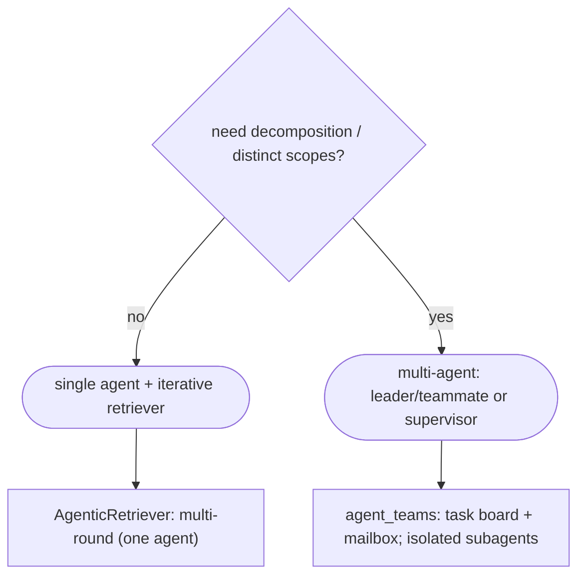
```mermaid
flowchart TD
    N{"need decomposition / distinct scopes?"} -->|no| S(["single agent + iterative retriever"])
    N -->|yes| M(["multi-agent: leader/teammate or supervisor"])
    S --> A["AgenticRetriever: multi-round (one agent)"]
    M --> B["agent_teams: task board + mailbox; isolated subagents"]
```

**Anchors:** &bull; `agent-core/openjiuwen/core/retrieval/retriever/agentic_retriever.py:213` — iterative retrieval loop (single agent) &bull; `agent-core/openjiuwen/agent_teams/agent/team_agent.py:76` — team leader/teammate &bull; `agent-core/openjiuwen/harness/tools/subagent/task_tool.py:194` — isolated subagent session &bull; `jiuwenswarm/jiuwenswarm/agents/swarm/assembly.py:260` — product swarm assembly

---

# Real-world system questions

## 20. Codebase changing daily: incremental re-indexing on commit, not full re-embedding

**General:** Re-index only what changed: give every document a stable ID, delete-by-ID the old chunks, then re-chunk/re-embed/insert just that document. Keep it idempotent and trigger on commit/CI. Full re-embeds are reserved for model or index changes. The hard parts are atomicity and eventual consistency.

**Jiuwen:** The contract is delete-by-`doc_id` + rebuild. Chroma/Milvus indexers scan a doc's chunk IDs, delete them, then re-chunk/re-embed/write (Milvus flushes to defeat eventual consistency). Adding documents appends into the pre-existing ANN index — no full re-index. `doc_id` is a first-class, scalar-inverted field. PG is the only store with native upsert-by-primary-key, but no PG indexer wraps it. A crash between delete and rebuild is not transactional.

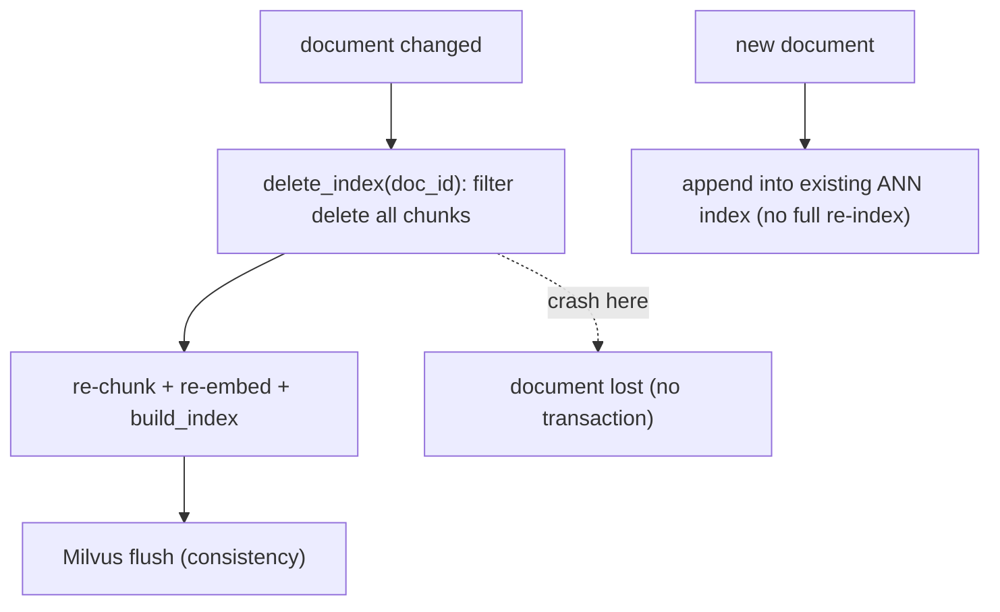
```mermaid
flowchart TD
    UP["document changed"] --> DEL["delete_index(doc_id): filter delete all chunks"]
    DEL --> RE["re-chunk + re-embed + build_index"]
    RE --> FL["Milvus flush (consistency)"]
    ADD["new document"] --> APP["append into existing ANN index (no full re-index)"]
    DEL -.->|"crash here"| LOSS["document lost (no transaction)"]
```

**Anchors:** &bull; `agent-core/openjiuwen/core/retrieval/simple_knowledge_base.py:192` — `delete_documents`; `:219` `update_documents`; `:74` `add_documents` appends &bull; `agent-core/openjiuwen/core/retrieval/indexing/indexer/chroma_indexer.py:198` — `update_index` = delete + build; `:217` delete by `doc_id` &bull; `agent-core/openjiuwen/core/retrieval/indexing/indexer/milvus_indexer.py:209` — delete + flush + rebuild; `:231` filter delete; `:346` `INVERTED` scalar index &bull; `agent-core/openjiuwen/core/retrieval/vector_store/pg_store.py:300` — `INSERT ... ON CONFLICT DO UPDATE` (no PG indexer)

## 21. Multilingual documents: multilingual embedding models, translate at query or index time

**General:** Use a multilingual/alignment embedding model so queries and documents land in one space; if no good multilingual model exists for a language, translate either at index time (normalize the corpus) or query time (translate the query), and store language metadata so you can route and evaluate per language. Cross-lingual rerankers help at the top.

**Jiuwen:** Effectively bilingual zh/en at the processing layer, with no translation. `SentenceSplitter` resolves `lan` via a Chinese-character-ratio heuristic (→ zh or en) for `pysbd`; explicit codes are a passthrough but undocumented. The query rewriter's `prompt_lang` only picks a `_zh.md`/`_en.md` template and never translates. Embedding clients expose no language parameter — multilingual support exists only if the operator picks a multilingual embedding model. No language metadata is persisted and there is no language routing.

```mermaid
flowchart TD
    DOC["document"] --> DET["_detect_chinese → zh or en (only two)"]
    DET --> SEG["pysbd Segmenter(language)"]
    Q["query"] --> RW["QueryRewriter prompt_lang: _zh/_en template only (no translation)"]
    SEG --> EMB["embedding model decides multilingual support (no language param)"]
    RW --> EMB
    DOC -.->|"absent"| X["no translation · no language metadata · no language routing"]
```

**Anchors:** &bull; `agent-core/openjiuwen/core/retrieval/indexing/processor/splitter/splitter.py:17` — `lan: str = "auto"`; `:46` `_detect_chinese(threshold=0.1)`; `:105` builds `Segmenter(language=...)` &bull; `agent-core/openjiuwen/core/retrieval/indexing/processor/chunker/text_splitter.py:81` — `IndexSentenceSplitter(language="auto")` &bull; `agent-core/openjiuwen/core/retrieval/indexing/processor/chunker/tokenizer_chunker.py:25` — `language="auto"` &bull; `agent-core/openjiuwen/core/retrieval/query_rewriter/query_rewriter.py:228` — `prompt_lang: str = "zh"`; `:309` template selection &bull; `agent-core/openjiuwen/core/retrieval/embedding/openai_embedding.py:140` — no language field; `agent-core/openjiuwen/core/retrieval/embedding/dashscope_embedding.py:37` — multimodal, not multilingual

## 22. Conflicting facts across sources: prioritization rules and conflict detection before generation

**General:** When sources disagree (e.g. two versions of a policy), decide precedence before generation: recency, source authority, or an explicit priority field; dedupe/reconcile, and surface the conflict to the model (or a human) rather than merging silently. Unchecked, the model picks the first or most fluent version.

**Jiuwen:** Conflict detection exists for **memory writes**, not RAG. `MemUpdateChecker` classifies a new memory as `REDUNDANT`/`CONFLICTING`/`NONE` and on `CONFLICTING` deletes the old memories (newest wins). On the retrieval side, "conflict handling" is only **dedup by exact text** and **max-score fusion** (`rrf_fusion` keys by `result.text`; `retrieve_multi_kb` keeps `max(score)`). If two chunks assert different values, both are returned with no contradiction check, no source authority, and no recency ordering.

```mermaid
flowchart TD
    subgraph RET["Retrieval (RAG)"]
    direction TB
    R["multiple chunks"] --> DEDUP["dedupe by exact text + max score"]
    DEDUP --> GEN["both conflicting facts passed to model"]
    end
    subgraph MEM["Memory writes"]
    direction TB
    M["new memory"] --> CHK["MemUpdateChecker: REDUNDANT / CONFLICTING / NONE"]
    CHK -->|CONFLICTING| DEL["delete old (newest wins)"]
    end
    RET -.->|"absent"| X["no contradiction detection / source authority / recency across docs"]
```

**Anchors:** &bull; `agent-core/openjiuwen/core/memory/manage/update/mem_update_checker.py:22` — `CheckResult`; `:252` `CONFLICTING` → add new, delete old &bull; `agent-core/openjiuwen/core/memory/manage/index/fragment_memory_manager.py:162` — `MemUpdateChecker` wired into memory writes &bull; `agent-core/openjiuwen/core/retrieval/utils/fusion.py:37` — RRF dedups by exact `result.text` &bull; `agent-core/openjiuwen/core/retrieval/simple_knowledge_base.py:305/357` — multi-KB dedup by text + `max(score)`; no contradiction check

---

# Cost and practicality

## 23. Where cost concentrates: embedding is cheap and one-time, generation scales with traffic

**General:** Embedding is a one-time (or change-only) indexing cost and is cheap per token; the recurring, traffic-scaling cost is generation — especially input tokens when you stuff long context. So optimization effort should go to the generation loop (fewer iterations, smaller context, cheaper model) more than to embeddings. Measure input vs output tokens separately.

**Jiuwen:** Embedding is batched and effectively one-time: `APIEmbedding` chunks texts (`max_batch_size=8`, `max_concurrent=50`) and `compute_chunk_embeddings` runs at index/update time. Generation is what is metered: `usage_cost.add_session_usage` accumulates provider-reported `input_tokens`/`output_tokens`/`total_tokens` (and optional costs) per session, fed by every `chat.usage_metadata` event. Core tracks KV/prompt-cache hit rates (tokens, not dollars). The only per-token dollar rates are hardcoded estimates in the auto-harness budget rail.

```mermaid
flowchart LR
    EMB["embedding (one-time)"] --> B["batched, concurrent, at index time (not metered as cost)"]
    GEN["generation (per traffic)"] --> U["usage_cost.add_session_usage: input/output/total tokens + optional cost"]
    GEN --> C["core: KV/prompt-cache hit-rate tokens (not $)"]
    GEN --> E["auto-harness budget rail: hardcoded 3e-6 in / 15e-6 out per token"]
```

**Anchors:** &bull; `agent-core/openjiuwen/core/retrieval/embedding/api_embedding.py:45` — `max_batch_size: int = 8`, `max_concurrent: int = 50`; `:167` batch + gather &bull; `agent-core/openjiuwen/core/retrieval/indexing/indexer/embed_chunks.py:21` — `compute_chunk_embeddings` at index/update time &bull; `agent-core/openjiuwen/core/context_engine/usage/provider_usage.py:14` — normalizes input/cache tokens; `agent-core/openjiuwen/core/context_engine/usage/session_aggregator.py:45` — cache hit-rate aggregation &bull; `jiuwenswarm/jiuwenswarm/server/runtime/usage_cost.py:101` — `add_session_usage`; `jiuwenswarm/jiuwenswarm/server/runtime/agent_adapter/interface_deep.py:17212` — usage events &bull; `agent-core/openjiuwen/auto_harness/rails/budget_rail.py:24` — input `3e-6` / output `15e-6` USD per token; `:85` cost computed

**Gap.** Embedding cost is never tracked, there is no embedding result cache, and session totals are in-process (lost on restart).

## 24. Cutting tokens without losing quality: tighter reranking, summarizing long chunks

**General:** Reduce prompt tokens by retrieving fewer but better chunks (rerank a larger candidate set down to a small k), summarizing long chunks/passages before insertion, and trimming conversation history. Reranking preserves quality while cutting k; summarization trades fidelity for tokens. Both beat blindly lowering k.

**Jiuwen:** The retrieval path exposes only `top_k` (default 5) and `score_threshold`, and threshold filtering is honored only in `mode="vector"`. Crucially, the KB path never invokes a reranker (the `Reranker` classes are wired only into graph-memory search), so "retrieve N, rerank to K" is absent. Token reduction instead happens in the context engine on the *conversation*: tool results over 50k tokens are offloaded, stale tool results beyond `keep_last_k=3` are windowed, micro-compaction clears old tool results, and full compaction LLM-summarizes at 180k. Chunk text is embedded verbatim — no chunk-level summarization.

```mermaid
flowchart TD
    K["cut tokens"] --> R["rerank N → K"]
    R -.->|"absent in KB (reranker only in graph memory)"| X["no recall-candidate rerank lever"]
    K --> S["summarize long chunks"]
    S -.->|"absent in ingest; chunks embedded verbatim"| Y["no chunk summarization"]
    K --> CE["context engine (conversation, not retrieval)"]
    CE --> O1["tool_result_budget: offload >50k"]
    CE --> O2["tool_result_window: keep_last_k=3"]
    CE --> O3["micro/full compact (180k) — extra LLM call"]
```

**Anchors:** &bull; `agent-core/openjiuwen/core/retrieval/common/config.py:46` — `top_k: int = 5`; `:47` `score_threshold` &bull; `agent-core/openjiuwen/core/retrieval/retriever/hybrid_retriever.py:64` — threshold rejected unless `mode="vector"`; `:41` retrieve path has no reranker &bull; `agent-core/openjiuwen/core/memory/graph/graph_memory/base.py:645` — reranker only in graph-memory search &bull; `agent-core/openjiuwen/core/context_engine/processor/offloader/tool_result_budget_processor.py:34` — `tokens_threshold=50000`; `agent-core/openjiuwen/core/context_engine/processor/offloader/tool_result_window_processor.py:44` — `keep_last_k=3` &bull; `agent-core/openjiuwen/core/context_engine/processor/compressor/micro_compact_processor.py:24` — threshold 5; `agent-core/openjiuwen/core/context_engine/processor/compressor/full_compact_processor.py:184` — 180k &bull; `agent-core/openjiuwen/core/retrieval/query_rewriter/query_rewriter.py:227/349` — `compress_range=20` + history compression

## 25. First cut at 50% cost reduction: route simple queries to a smaller model, reduce top-k

**General:** The cheapest high-impact cuts: route easy queries to a smaller/cheaper model (classify query difficulty first), lower `top_k`, cache, shorten the prompt (fewer examples, tighter context), and reduce the agent's iteration cap. Start with model routing and top-k because they cut the dominant (generation/input-token) cost directly.

**Jiuwen:** Model selection is about availability and endpoint distribution, not cost or query difficulty. `build_model_allocator` dispatches four availability strategies (`round_robin`, `by_model_name`, `router`, `intelli_router`); allocation happens at member construction from a `model_name` hint and is immutable per member. `IntelliRouter` is rate-aware only through `tpm`/`rpm`. The only retrieval-size knob is the static `top_k` (default 5). There is no query-classification-to-model routing and no cost-aware top-k policy.

```mermaid
flowchart TD
    COST["cut 50%"] --> MR["route simple queries → smaller model"]
    MR -.->|"absent"| X["no query-difficulty / cost-aware routing"]
    COST --> TK["reduce top_k"]
    TK --> S["static top_k=5, no cost-aware/adaptive policy"]
    COST --> CACHE["cache"]
    CACHE --> N["exact embedding/tool caches only (no semantic cache)"]
```

**Anchors:** &bull; `agent-core/openjiuwen/agent_teams/models/allocator.py:559` — `build_model_allocator` (4 availability strategies); `:240` `ByModelNameAllocator`; `:520` `resolve_member_model` (no query awareness) &bull; `agent-core/openjiuwen/agent_teams/models/pool.py:38` — `ModelPoolEntry`; `:278` `tpm`/`rpm` rate-aware only &bull; `agent-core/openjiuwen/core/retrieval/common/config.py:46` — `top_k: int = 5` (only retrieval-size config) &bull; `jiuwenswarm/jiuwenswarm/agents/harness/common/memory/manager.py:773` — exact embedding cache (no semantic cache)

**Gap.** No query-classification-to-model routing, no cost-aware routing, and no adaptive top-k.

---

## Summary: strong vs weak in Jiuwen

| Area | Strength | Notes |
|---|---|---|
| RAG pipeline | Mixed | real ingest/retrieve components; no packaged RAG agent |
| RAG vs long context | Weak | retrieved context concatenated unbounded; no token budget/decision guidance |
| Skip RAG (parametric) | Weak | no retrieval-necessity classifier; always retrieves once; model tool choice only |
| Chunk size | Strong | validation, char/token/hybrid chunkers, tokenizer clamps |
| Semantic chunking | Mixed | sentence packing strong; no embedding-breakpoint or header-aware chunker |
| Embedding model choice | Mixed | pluggable providers; no registry/benchmark; caller decides |
| Embedding model swap | Weak | model identity not persisted; manual full re-embed |
| Cosine ranking | Mixed | backend-rescaled scores; no calibration/MMR |
| Reranking (cross vs bi) | Weak | cross-encoder exists but not wired into the KB path |
| Vocabulary mismatch | Mixed | rewriter handles coreference/typo; no HyDE/synonym expansion |
| Dense vs sparse + RRF | Strong | native BM25 on Milvus, RRF everywhere; `alpha` dead |
| Chunk-contains-answer diagnostic | Weak | no tooling; judges do not receive retrieved context |
| No-relevant-docs abstention | Weak | `score_threshold` None; sufficiency only rewrites; no "I don't know" path |
| Run-to-run determinism | Weak | some temperature=0; no seed/embedding fingerprint in core retrieval |
| Chunk-boundary handling | Mixed | sentence chunking + overlap strong; char chunking cuts; head/tail truncation drops middle |
| RAG vs FT vs long context | Weak | three separate subsystems; no comparative guidance |
| Vector vs full-text | Strong | both first-class; routing config-driven, not query-aware |
| Single vs multi-agent RAG | Strong | single-agent default with iterative retrieval; teams opt-in |
| Incremental re-indexing | Mixed | delete-by-id + append; not atomic; no PG indexer |
| Multilingual | Weak | zh/en heuristic, no translation, no language metadata/routing |
| Conflicting sources | Weak | dedup/max-score only; conflict detection is memory-write-only |
| Cost concentration | Mixed | generation metered; embedding never tracked/cached |
| Token reduction | Mixed | strong conversation compaction; no rerank-to-K, no chunk summarization |
| 50% cost cut (routing/top-k) | Weak | availability routing only; no query-difficulty or cost-aware policies |
