# RAG retrieval interview questions — general answers + how Jiuwen does it

Based on the list *The Most Repeated RAG Questions About Retrieval in AI Engineer Interviews* (Embedding and Similarity; Chunking; Sparse vs. Dense Retrieval; Reranking; Retrieval Evaluation; Multi-Document and Complex Queries; Scale and Freshness). Each section heading is the original question.

Note: several of these questions are about *retrieval quality measurement*, and this codebase has no retrieval-quality metric layer. Where that is the case the general answer carries the weight and the Jiuwen answer says so explicitly instead of implying a mechanism. The codebase does contain a full retrieval stack in `agent-core/openjiuwen/core/retrieval/` (embeddings, chunkers, parsers, retrievers, rerankers, vector stores, fusion), plus a product-layer hybrid memory index and a BM25 recall path, so most *mechanism* questions have real anchors. See [README](README.md) for the shared conventions (answer shape, anchor format, repo layers).

> **The pattern worth noticing:** almost every retrieval question traces back to one thing — is the right document actually reachable at query time, and can you prove it with a metric instead of a guess.

---

# Embedding and similarity

## 1. Why cosine similarity alone doesn't guarantee the most relevant document ranks first

**General:** Cosine similarity measures vector closeness in an embedding space, not answer relevance. It is symmetric, ignores term importance, compresses everything to one direction, and is not calibrated across queries or documents — a short generic chunk and the exact answer can both sit near the query. Top-k by cosine is therefore a *recall-oriented candidate* step; ranking quality comes from better models, hybrid exact-match signals, metadata filters, and reranking.

**Jiuwen:** The stores default to cosine (`distance_metric` default `"cosine"`) and return a backend-specific distance converted to a `[0,1]` similarity — Milvus cosine goes through `convert_cosine_similarity` (`(s+1)/2`), Chroma's cosine *distance* through `(2-d)/2`. Vectors are never L2-normalized or instruction-prefixed in `embedding/utils.py` (only base64 decoding). `top_k` is a raw backend `limit` after ordering; there is no MMR, dedup, query calibration, or re-scoring. Multi-KB merge dedups by text and keeps the `max` score, so distinct docs that share text can be merged.

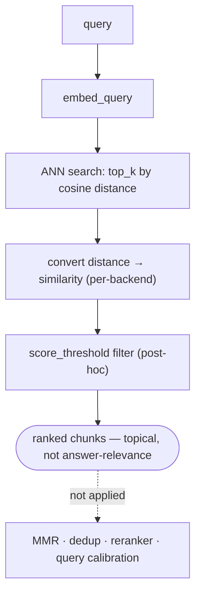
```mermaid
flowchart TD
    Q["query"] --> QE["embed_query"]
    QE --> ANN["ANN search: top_k by cosine distance"]
    ANN --> C["convert distance → similarity (per-backend)"]
    C --> T["score_threshold filter (post-hoc)"]
    T --> R(["ranked chunks — topical, not answer-relevance"])
    R -.->|"not applied"| X["MMR · dedup · reranker · query calibration"]
```

**Anchors:** &bull; `agent-core/openjiuwen/core/retrieval/common/config.py:81` — `distance_metric` default `cosine` &bull; `agent-core/openjiuwen/core/retrieval/vector_store/milvus_store.py:461` — Milvus COSINE branch → `convert_cosine_similarity`; `:233` `limit=top_k` raw ANN &bull; `agent-core/openjiuwen/core/retrieval/vector_store/chroma_store.py:487` — Chroma cosine-distance → similarity &bull; `agent-core/openjiuwen/core/foundation/store/vector/utils.py:35` — `convert_cosine_similarity` maps [-1,1]→[0,1] &bull; `agent-core/openjiuwen/core/retrieval/embedding/utils.py:15` — only base64 parsing; no normalization/instruction &bull; `agent-core/openjiuwen/core/retrieval/retriever/vector_retriever.py:94` — `score_threshold` filtered post-hoc &bull; `agent-core/openjiuwen/core/retrieval/simple_knowledge_base.py:305` — multi-KB text-keyed `max` merge

## 2. Picking an embedding model, and whether bigger always means better retrieval

**General:** Bigger is not automatically better: retrieval quality depends on domain fit, the language, whether the model is asymmetric (query vs passage prefixes), the dimension you can afford, and latency/cost. A smaller in-domain model often beats a large general one, and dimensionality reduction (Matryoshka) can trade a little recall for large storage savings. The right way to pick is to measure recall on your own data, not to read a leaderboard.

**Jiuwen:** An `Embedding` ABC defines `embed_query`, `embed_documents`, and a `dimension` property; `EmbeddingConfig` carries only `model_name`/`base_url`/`api_key`. Providers are `APIEmbedding` (generic HTTP), `OpenAIEmbedding` (OpenAI-compatible), `VLLMEmbedding` (extends OpenAI, adds multimodal `instruction`), and `DashscopeEmbedding`. Dimension is discovered lazily from the first response or set explicitly for Matryoshka models. Batching is provider-level (`max_batch_size=8`, `max_concurrent=50`). Model choice is entirely caller-driven — there is no model registry, benchmark, or size heuristic.

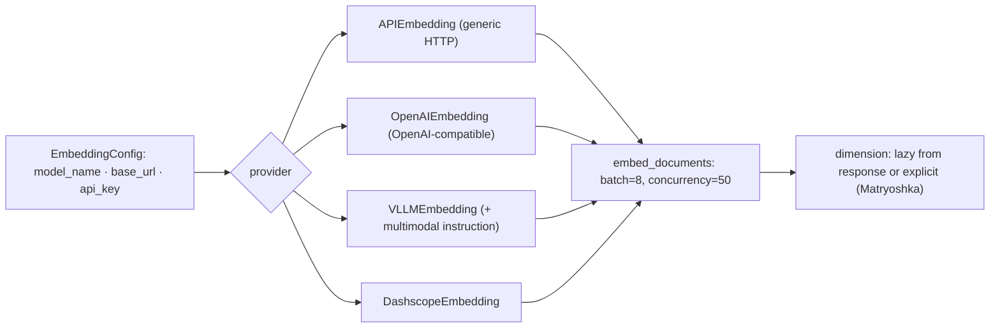
```mermaid
flowchart LR
    CFG["EmbeddingConfig: model_name · base_url · api_key"] --> P{"provider"}
    P --> API["APIEmbedding (generic HTTP)"]
    P --> OAI["OpenAIEmbedding (OpenAI-compatible)"]
    P --> VLLM["VLLMEmbedding (+ multimodal instruction)"]
    P --> DS["DashscopeEmbedding"]
    API --> B["embed_documents: batch=8, concurrency=50"]
    OAI --> B
    VLLM --> B
    DS --> B
    B --> DIM["dimension: lazy from response or explicit (Matryoshka)"]
```

**Anchors:** &bull; `agent-core/openjiuwen/core/foundation/store/base_embedding.py:16` — `EmbeddingConfig`; `:24` `Embedding` ABC; `:29` `embed_query` &bull; `agent-core/openjiuwen/core/retrieval/embedding/openai_embedding.py:67` — Matryoshka `dimension` &bull; `agent-core/openjiuwen/core/retrieval/embedding/dashscope_embedding.py:105` — Dashscope `dimension` &bull; `agent-core/openjiuwen/core/retrieval/embedding/api_embedding.py:45` — `max_batch_size=8`; `:46` `max_concurrent=50`; `:175` batch splitting/concurrency &bull; `agent-core/openjiuwen/core/retrieval/embedding/vllm_embedding.py:17` — `VLLMEmbedding`

**Gap.** No `create_embedding` factory or model-selection helper in `core/retrieval` (only `create_vector_store` exists), and no evaluation/benchmark to justify model size.

## 3. Why swapping embedding models forces a full re-embedding of the corpus

**General:** Stored vectors are the output of one specific model. A different model — even at the same dimension — projects into a different space, so old and new vectors are not comparable; distance computations become meaningless. You must re-embed every chunk (and often rebuild the index, since the vector width may change too). Good systems persist a model fingerprint/version with the index so a mismatch is detected rather than silently corrupted.

**Jiuwen:** At index time `compute_chunk_embeddings` calls `embed_model.embed_documents` and mutates `chunk.embedding` in place; indexers trigger it only for `vector`/`hybrid` index types. Milvus derives the collection vector `dim` from `embed_model.dimension` at schema creation and stores only the width — the model identity/name is **not persisted**. `update_index` deletes a doc's rows and rebuilds (re-embeds). Dimension is a hard constraint: Milvus/Chroma collections and pgvector tables are fixed-width (pgvector rejects >2000). So a model swap means a manual full re-index; there is only a low-level dimension-update migration operation with an optional re-embed callback.

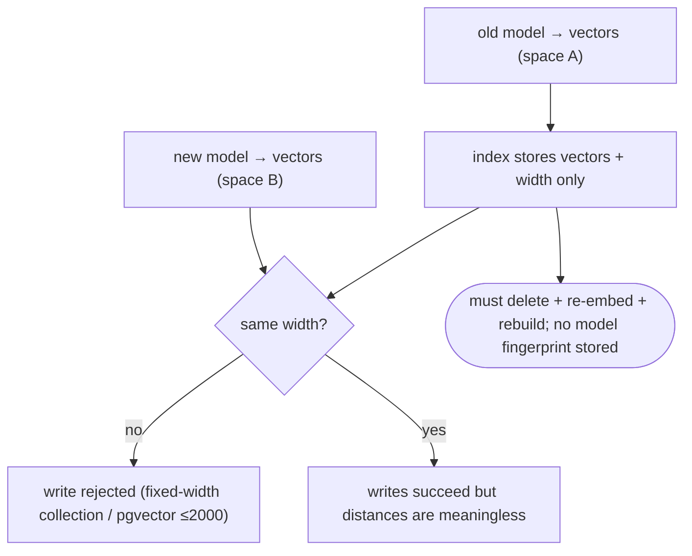
```mermaid
flowchart TD
    OLD["old model → vectors (space A)"] --> IDX["index stores vectors + width only"]
    NEW["new model → vectors (space B)"] --> M{"same width?"}
    IDX --> M
    M -->|no| FAIL["write rejected (fixed-width collection / pgvector ≤2000)"]
    M -->|yes| BAD["writes succeed but distances are meaningless"]
    IDX --> RE(["must delete + re-embed + rebuild; no model fingerprint stored"])
```

**Anchors:** &bull; `agent-core/openjiuwen/core/retrieval/indexing/indexer/embed_chunks.py:21` — `compute_chunk_embeddings`; `:46` `embed_documents` sets vectors &bull; `agent-core/openjiuwen/core/retrieval/indexing/indexer/milvus_indexer.py:156` — embedding only for vector/hybrid; `:409` `dimension = embed_model.dimension`; `:427` schema stores `dim` but no model name; `:209` `update_index` = delete + rebuild &bull; `agent-core/openjiuwen/core/retrieval/graph_knowledge_base.py:294` — `update_documents` delete + re-add &bull; `agent-core/openjiuwen/core/retrieval/vector_store/pg_store.py:129` — fixed pgvector table definition &bull; `agent-core/openjiuwen/core/foundation/store/vector/utils.py:264` — `UpdateEmbeddingDimensionOperation`

## 4. Should queries and documents use the same embedding model

**General:** Yes — queries and documents must be embedded by the same model, and for asymmetric models you must also apply the correct role prefix (e.g. `query:` vs `passage:`) to each side. Mixing models produces incomparable vectors; dropping the role prefix on an instruction-tuned model measurably degrades retrieval.

**Jiuwen:** In the KB pipeline they do: one `embed_model` instance is held on the KB, passed to `build_index` for documents and to the constructed `VectorRetriever`/`HybridRetriever` for queries. Query embedding uses `embed_query`; document embedding uses `embed_documents`. For OpenAI-compatible/Dashscope, `embed_query` delegates to the document path (Dashscope literally calls `embed_documents([text])`), so there is no query-vs-passage prefix distinction. Only `VLLMEmbedding.embed_multimodal` supports an `instruction`. Nothing validates that the retriever's model matches the indexer's (only dimension is indirectly constrained by the collection schema).

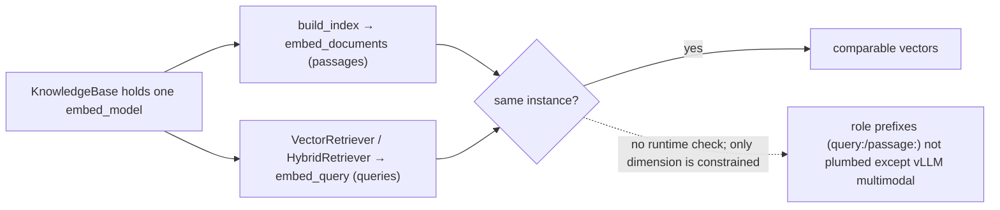
```mermaid
flowchart LR
    KB["KnowledgeBase holds one embed_model"] --> IDX["build_index → embed_documents (passages)"]
    KB --> RET["VectorRetriever / HybridRetriever → embed_query (queries)"]
    IDX --> SAME{"same instance?"}
    RET --> SAME
    SAME -->|yes| OK["comparable vectors"]
    SAME -.->|"no runtime check; only dimension is constrained"| GAP["role prefixes (query:/passage:) not plumbed except vLLM multimodal"]
```

**Anchors:** &bull; `agent-core/openjiuwen/core/retrieval/retriever/vector_retriever.py:78` — query `embed_query` &bull; `agent-core/openjiuwen/core/retrieval/indexing/indexer/embed_chunks.py:46` — docs `embed_documents` &bull; `agent-core/openjiuwen/core/retrieval/simple_knowledge_base.py:110` — index build uses `self.embed_model`; `:144` `VectorRetriever(embed_model=...)`; `:157` `HybridRetriever(embed_model=...)` &bull; `agent-core/openjiuwen/core/retrieval/knowledge_base.py:34` — single `embed_model` field &bull; `agent-core/openjiuwen/core/retrieval/embedding/dashscope_embedding.py:124` — `embed_query` delegates to `embed_documents` &bull; `agent-core/openjiuwen/core/retrieval/embedding/vllm_embedding.py:25` — instruction only for multimodal

---

# Chunking

## 5. Deciding chunk size, and what breaks at each extreme

**General:** Chunk size trades context against precision. Too small and each chunk lacks the context to answer (and the answer may be split across chunks); too large and a chunk covers many topics, diluting the embedding and wasting the prompt budget. Practical defaults are a few hundred tokens with modest overlap, then tune against a retrieval eval. Size is usually measured in tokens (what the model sees), not characters.

**Jiuwen:** `Chunker.__init__` defaults `chunk_size=512`, `chunk_overlap=50`, `length_function=len`. Size is measured in characters (`CharChunker` → `CharSplitter`, `len()`) or tokens (`TokenizerChunker` → `IndexSentenceSplitter` → `SentenceSplitter`, tokenizer length). Hard validation rejects `chunk_size<=0`, `chunk_overlap<0`, and `chunk_overlap>=chunk_size`. Token-based chunk size is silently clamped to the embedding tokenizer's `model_max_length` (`_resolve_chunk_size`), and DB caps fail at write time (Milvus text field `max_length=65535`, pgvector dims ≤2000).

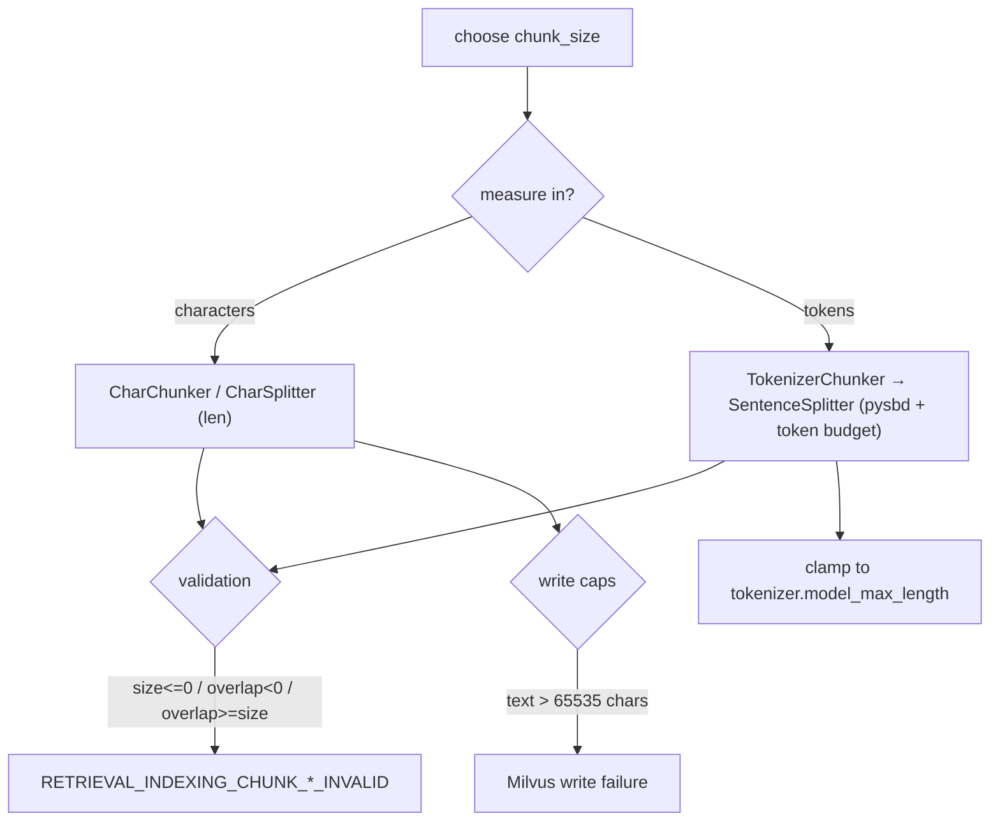
```mermaid
flowchart TD
    S["choose chunk_size"] --> C{"measure in?"}
    C -->|characters| CH["CharChunker / CharSplitter (len)"]
    C -->|tokens| TK["TokenizerChunker → SentenceSplitter (pysbd + token budget)"]
    CH --> V{"validation"}
    TK --> V
    V -->|"size<=0 / overlap<0 / overlap>=size"| ERR["RETRIEVAL_INDEXING_CHUNK_*_INVALID"]
    TK --> CAP["clamp to tokenizer.model_max_length"]
    CH --> WRITE{"write caps"}
    WRITE -->|"text > 65535 chars"| MF["Milvus write failure"]
```

**Anchors:** &bull; `agent-core/openjiuwen/core/retrieval/indexing/processor/chunker/base.py:36` — defaults `chunk_size=512`, `chunk_overlap=50`; `:59/64/69` validation raises &bull; `agent-core/openjiuwen/core/retrieval/common/config.py:34` — `KnowledgeBaseConfig.chunk_size/chunk_overlap` &bull; `agent-core/openjiuwen/core/retrieval/indexing/processor/chunker/text_splitter.py:15` — `DEFAULT_CHUNK_SIZE=200`; `:198` `_resolve_chunk_size` clamps to `tokenizer.model_max_length` &bull; `agent-core/openjiuwen/core/retrieval/indexing/processor/chunker/chunking.py:82` — `get_chunker` auto-lowers size to tokenizer max &bull; `agent-core/openjiuwen/core/retrieval/indexing/indexer/milvus_indexer.py:375` — text field `max_length=65535` &bull; `agent-core/openjiuwen/core/retrieval/vector_store/pg_store.py:176` — pgvector rejects dim > 2000

**Gap.** `KnowledgeBaseConfig.chunk_size/chunk_overlap` are never read by `SimpleKnowledgeBase.add_documents` (it uses the injected chunker), so those config fields are advisory. No document/file-length limit exists.

## 6. Fixed-size vs. semantic chunking, the actual retrieval tradeoff

**General:** Fixed-size chunking is deterministic and cheap but cuts mid-sentence or mid-table, producing fragments that embed poorly. Semantic / structure-aware chunking splits on natural boundaries (sentences, paragraphs, headings, records) so each chunk is coherent, at the cost of variable size and extra processing. Sentence-window and recursive-delimiter strategies sit between the two.

**Jiuwen:** True fixed-size is `CharChunker` (raw character windows via `CharSplitter`). Token-based `TokenizerChunker` is actually sentence-boundary-aware: `SentenceSplitter` uses `pysbd` to segment and packs whole sentences up to a token budget, sub-splitting overly long sentences. `HybridChunker` is a structural guard, not a semantic splitter — it keeps `source_type in ("row","column")` units whole and delegates the rest. There is no embedding-similarity breakpoint chunker and no recursive delimiter hierarchy; `splitter_config` is normalized but never forwarded to `SentenceSplitter` (an inert stub).

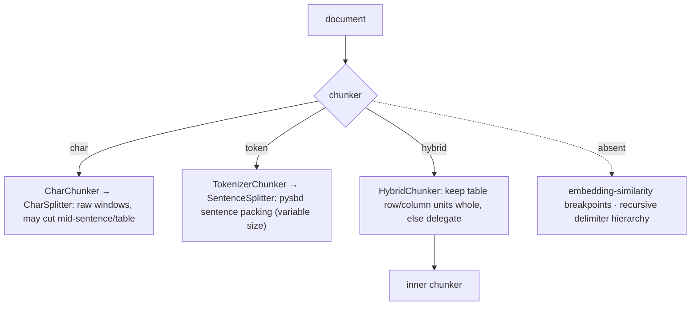
```mermaid
flowchart TD
    D["document"] --> K{"chunker"}
    K -->|char| CC["CharChunker → CharSplitter: raw windows, may cut mid-sentence/table"]
    K -->|token| TC["TokenizerChunker → SentenceSplitter: pysbd sentence packing (variable size)"]
    K -->|hybrid| HC["HybridChunker: keep table row/column units whole, else delegate"]
    HC --> IC["inner chunker"]
    K -.->|"absent"| SEM["embedding-similarity breakpoints · recursive delimiter hierarchy"]
```

**Anchors:** &bull; `agent-core/openjiuwen/core/retrieval/indexing/processor/chunker/char_chunker.py:12` — `CharChunker` "fixed size based on character length"; `:47` builds `CharSplitter` &bull; `agent-core/openjiuwen/core/retrieval/indexing/processor/chunker/text_splitter.py:34` — `CharSplitter.split` slices `text[start:end]` &bull; `agent-core/openjiuwen/core/retrieval/indexing/processor/chunker/tokenizer_chunker.py:17` — `TokenizerChunker` builds `IndexSentenceSplitter` &bull; `agent-core/openjiuwen/core/retrieval/indexing/processor/splitter/splitter.py:92` — `SentenceSplitter.__call__` (pysbd); `:142` `_sentences_with_spans`; `:173` long-sentence sub-split &bull; `agent-core/openjiuwen/core/retrieval/indexing/processor/chunker/hybrid_chunker.py:19` — `HybridChunker` no-split predicate; `:66` delegation &bull; `agent-core/openjiuwen/core/retrieval/indexing/processor/chunker/__init__.py:117` — only `"char"`/`"hybrid"` registered &bull; `agent-core/openjiuwen/core/retrieval/indexing/processor/chunker/text_splitter.py:98` — `splitter_config` normalized but not forwarded

## 7. Overlapping vs. non-overlapping chunks

**General:** A small overlap preserves context that straddles a boundary, improving recall for answers that span a cut; too much overlap duplicates content, inflates the index, and can return near-identical hits that crowd out diverse results. Non-overlapping is cheaper and deduplicated but risks losing boundary context.

**Jiuwen:** Overlap is a first-class `chunk_overlap` integer (default 50) enforced on both paths. `CharSplitter` does a strided sliding window (`step = chunk_size - chunk_overlap`). `SentenceSplitter` re-injects a suffix of whole sentences from the previous buffer up to the overlap token budget, so token chunks overlap on sentence boundaries. Overlap content is duplicated text across chunks, and chunk IDs are fresh UUIDs each run, so downstream indexing cannot distinguish overlap content.

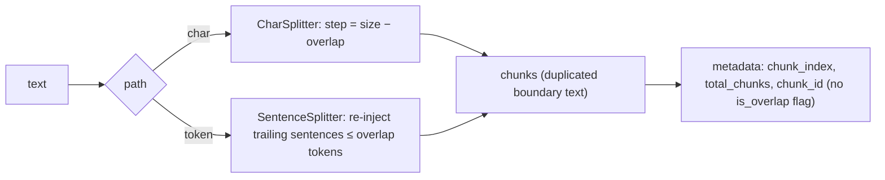
```mermaid
flowchart LR
    T["text"] --> C{"path"}
    C -->|char| CS["CharSplitter: step = size − overlap"]
    C -->|token| SS["SentenceSplitter: re-inject trailing sentences ≤ overlap tokens"]
    CS --> OUT["chunks (duplicated boundary text)"]
    SS --> OUT
    OUT --> META["metadata: chunk_index, total_chunks, chunk_id (no is_overlap flag)"]
```

**Anchors:** &bull; `agent-core/openjiuwen/core/retrieval/indexing/processor/chunker/base.py:39` — `chunk_overlap: int = 50`; `:69` `overlap >= chunk_size` raises; `:106` overlap not carried into metadata &bull; `agent-core/openjiuwen/core/retrieval/indexing/processor/chunker/text_splitter.py:41` — overlap clamped to `[0, size-1]`; `:54` `step = chunk_size - chunk_overlap`; `:56` slicing loop; `:110` token path default `chunk_size // 5` &bull; `agent-core/openjiuwen/core/retrieval/indexing/processor/splitter/splitter.py:215` — `_flush` re-injects trailing sentences ≤ overlap; `:186` long-segment window step

## 8. Chunking structured content like tables, code, or nested headings without losing structure

**General:** Structure should be captured at parse time and carried as metadata, not thrown away before chunking. Tables should stay intact or be serialized (row/column/record), code should be split on function/class boundaries with fences preserved, and nested headings should be used as split boundaries with the heading path attached to each chunk. A generic text chunker over flattened content loses all of this.

**Jiuwen:** Structure is preserved at parse time, not chunk time. Excel emits one `Document` per data row and per column tagged `source_type` (`row`/`column`), and `HybridChunker` keeps those as atomic chunks. Word emits heading-marked Markdown (`#`, `##`, …) and Markdown tables. PDF/HTML flatten to newline-joined text; JSON is pretty-printed. Metadata (`source_type`, `sheet_name`, `row_index`, `column_name`, `image_path`, `title`) is propagated from `Document` to `TextChunk` by the chunker base. There is no Markdown-header-aware chunker, so `##` sections can still be split mid-section, and HTML heading tags are discarded before chunking.

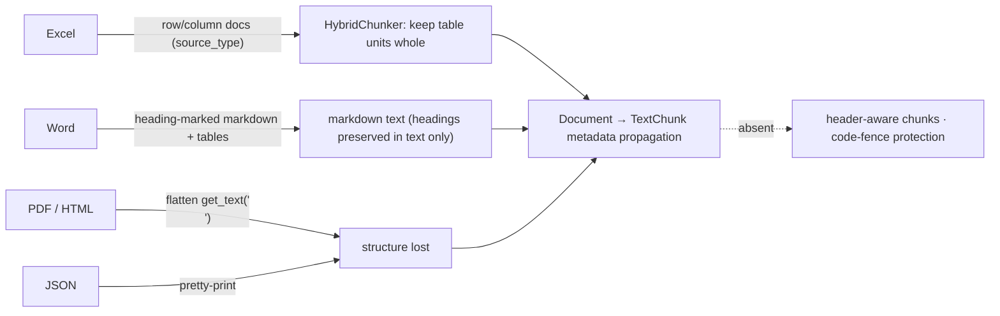
```mermaid
flowchart LR
    EX["Excel"] -->|"row/column docs (source_type)"| HC["HybridChunker: keep table units whole"]
    WD["Word"] -->|"heading-marked markdown + tables"| MD["markdown text (headings preserved in text only)"]
    PDF["PDF / HTML"] -->|"flatten get_text('\n')"| FLAT["structure lost"]
    JSON["JSON"] -->|"pretty-print"| FLAT
    HC --> META["Document → TextChunk metadata propagation"]
    MD --> META
    FLAT --> META
    META -.->|"absent"| HDR["header-aware chunks · code-fence protection"]
```

**Anchors:** &bull; `agent-core/openjiuwen/core/retrieval/indexing/processor/parser/excel_parser.py:32` — `_rows_to_documents`; `:69` `source_type: "row"`; `:96` `source_type: "column"` &bull; `agent-core/openjiuwen/core/retrieval/indexing/processor/parser/word_parser.py:23` — `_table_to_markdown`; `:37` `_paragraph_to_markdown` (Heading N → N+1 hashes) &bull; `agent-core/openjiuwen/core/retrieval/indexing/processor/chunker/hybrid_chunker.py:19` — keeps `row`/`column` units as one chunk &bull; `agent-core/openjiuwen/core/retrieval/indexing/processor/parser/html_file_parser.py:78` — `_get_text_from_soup` flattens &bull; `agent-core/openjiuwen/core/retrieval/indexing/processor/parser/txt_md_parser.py:40` — Markdown read verbatim &bull; `agent-core/openjiuwen/core/retrieval/indexing/processor/chunker/base.py:106` — metadata copied onto every `TextChunk`

---

# Sparse vs. dense retrieval

## 9. Dense retrieval vs. sparse retrieval like BM25

**General:** Dense retrieval embeds queries and documents and searches a vector index; it matches meaning and handles paraphrase/synonyms but needs a model and can miss rare exact terms. Sparse retrieval (BM25/TF-IDF) matches literal terms with term-frequency weighting; it is strong on exact tokens, fast, and interpretable, but fails on vocabulary mismatch. Modern systems run both and fuse.

**Jiuwen:** Dense is `VectorRetriever` (`embed_query` + `vector_store.search`). Sparse is `SparseRetriever`, which on Milvus is real BM25: `sparse_search` passes raw text with `metric_type="BM25"` against a `SPARSE_FLOAT_VECTOR` field populated by a Milvus `Function(function_type=BM25)` and `SPARSE_INVERTED_INDEX`. Chroma does **not** support BM25 — it falls back to a TF-IDF text query (explicit comment). PG uses PostgreSQL full-text search (`websearch_to_tsquery` + `ts_rank`), not BM25. So sparse quality is backend-dependent despite the shared interface.

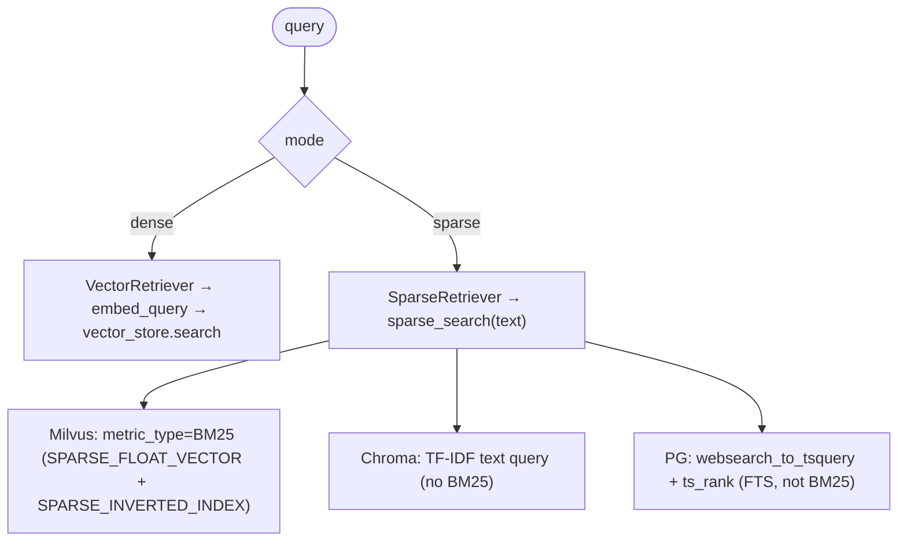
```mermaid
flowchart TD
    Q(["query"]) --> M{"mode"}
    M -->|dense| V["VectorRetriever → embed_query → vector_store.search"]
    M -->|sparse| S["SparseRetriever → sparse_search(text)"]
    S --> MS["Milvus: metric_type=BM25 (SPARSE_FLOAT_VECTOR + SPARSE_INVERTED_INDEX)"]
    S --> CH["Chroma: TF-IDF text query (no BM25)"]
    S --> PG["PG: websearch_to_tsquery + ts_rank (FTS, not BM25)"]
```

**Anchors:** &bull; `agent-core/openjiuwen/core/retrieval/retriever/sparse_retriever.py:19` — `SparseRetriever` (BM25 docstring); `:62` delegates to `sparse_search` &bull; `agent-core/openjiuwen/core/retrieval/vector_store/milvus_store.py:277` — `metric_type: "BM25"` &bull; `agent-core/openjiuwen/core/retrieval/indexing/indexer/milvus_indexer.py:390` — Milvus `Function(BM25)`; `:399` `SPARSE_INVERTED_INDEX` &bull; `agent-core/openjiuwen/core/retrieval/vector_store/chroma_store.py:300` — comment: no BM25, text query instead &bull; `agent-core/openjiuwen/core/retrieval/vector_store/pg_store.py:375` — `websearch_to_tsquery`; `:386` `ts_rank`

## 10. When keyword search outperforms semantic search

**General:** Keyword search wins when the query contains exact identifiers, codes, rare names, or domain jargon that the embedding model never learned to map, and when the corpus is small or the terms are highly distinctive. Dense search wins on paraphrase and intent. The strongest approach is a router that picks by query type (or always runs hybrid and fuses).

**Jiuwen:** Routing is static and config-driven, not query-content-driven: `SimpleKnowledgeBase.retrieve` picks the retriever and mode from `config.index_type` (`vector` → `VectorRetriever`, `bm25` → `SparseRetriever`, else hybrid). `AgenticRetriever` derives its default mode from the underlying retriever's `index_type`, and `GraphRetriever` validates against `_allowed_modes`. The only dynamic keyword behavior is a degenerate fallback: if dense returns zero results, `VectorRetriever`/`HybridRetriever` re-run `sparse_search`. `QueryRewriter` produces an `intention` field but never uses it to switch modes.

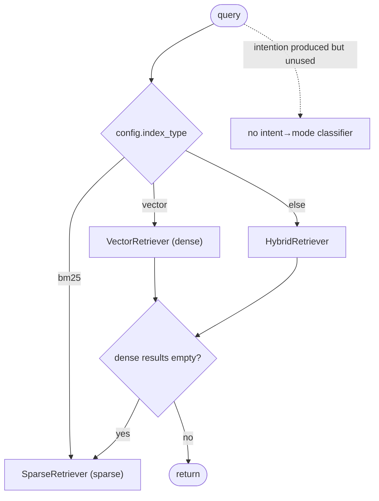
```mermaid
flowchart TD
    Q(["query"]) --> C{"config.index_type"}
    C -->|vector| V["VectorRetriever (dense)"]
    C -->|bm25| S["SparseRetriever (sparse)"]
    C -->|"else"| H["HybridRetriever"]
    V --> D{"dense results empty?"}
    D -->|yes| S
    D -->|no| R(["return"])
    H --> D
    Q -.->|"intention produced but unused"| X["no intent→mode classifier"]
```

**Anchors:** &bull; `agent-core/openjiuwen/core/retrieval/simple_knowledge_base.py:141` — retriever selection by `index_type`; `:166` mode selection &bull; `agent-core/openjiuwen/core/retrieval/retriever/vector_retriever.py:83` — dense-empty → BM25 fallback &bull; `agent-core/openjiuwen/core/retrieval/retriever/hybrid_retriever.py:97` — same fallback &bull; `agent-core/openjiuwen/core/retrieval/retriever/agentic_retriever.py:155` — `default_mode` from `index_type` &bull; `agent-core/openjiuwen/core/retrieval/retriever/graph_retriever.py:262` — `_allowed_modes` &bull; `agent-core/openjiuwen/core/retrieval/query_rewriter/query_rewriter.py:277` — rewrite schema includes `intention`

## 11. Combining dense and sparse retrieval into one ranked result, and weighting the fusion

**General:** Two families: score-based fusion (normalize each list's scores and combine with a weight, e.g. `alpha*dense + (1-alpha)*sparse`) and rank-based fusion (Reciprocal Rank Fusion, `Σ 1/(k+rank)`), which needs no score calibration. RRF is the robust default; weighted fusion lets you bias toward one signal but requires comparable scores.

**Jiuwen:** `HybridRetriever` takes an `alpha` and passes it to `vector_store.hybrid_search`, but every backend actually uses **RRF, not alpha-weighted scores**: Milvus uses pymilvus `RRFRanker(k=60)`; Chroma and PG run both searches then `rrf_fusion(..., k=60)`. `rrf_fusion` scores each deduped text by `Σ 1/(k+rank)`, keyed by `text`. The only true weighted fusion is in the graph store (`WeightedRankConfig`, weights normalized, zero channels dropped). So `alpha` is effectively dead in all three `core/retrieval` stores.

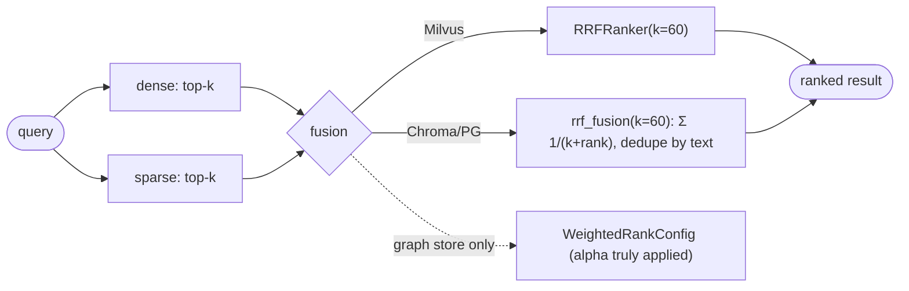
```mermaid
flowchart LR
    Q(["query"]) --> D["dense: top-k"]
    Q --> S["sparse: top-k"]
    D --> F{"fusion"}
    S --> F
    F -->|Milvus| M["RRFRanker(k=60)"]
    F -->|Chroma/PG| C["rrf_fusion(k=60): Σ 1/(k+rank), dedupe by text"]
    F -.->|"graph store only"| W["WeightedRankConfig (alpha truly applied)"]
    M --> R(["ranked result"])
    C --> R
```

**Anchors:** &bull; `agent-core/openjiuwen/core/retrieval/retriever/hybrid_retriever.py:26` — `alpha` parameter (ignored by stores) &bull; `agent-core/openjiuwen/core/retrieval/utils/fusion.py:15` — `rrf_fusion`; `:39` `1.0/(k+rank)` formula &bull; `agent-core/openjiuwen/core/retrieval/vector_store/milvus_store.py:348` — native `RRFRanker(k=60)`; `:381` fallback `rrf_fusion` &bull; `agent-core/openjiuwen/core/retrieval/vector_store/chroma_store.py:390` — Chroma RRF `k=60` &bull; `agent-core/openjiuwen/core/retrieval/vector_store/pg_store.py:418` — PG `rrf_fusion` &bull; `agent-core/openjiuwen/core/foundation/store/graph/result_ranking.py:61` — `WeightedRankConfig` (the only real weights)

## 12. Why a purely semantic system can fail on queries with exact codes, IDs, or names

**General:** Embedding models are trained on natural-language co-occurrence; short opaque tokens (error codes, SKUs, UUIDs, version strings, rare proper nouns) carry little semantic signal and get mapped to near-random neighbors. A semantically "close" but wrong chunk can outrank the exact hit, and because dense results are rarely empty, no lexical fallback fires. The fix is metadata/exact filtering, a sparse leg, or an explicit exact-match boost.

**Jiuwen:** The stores *can* filter: Milvus builds `key == value` expressions (string-sanitized) and supports `QueryExpr`; PG does JSONB containment; Chroma builds a `where` dict; Milvus even creates `INVERTED` scalar indexes on `document_id`/`chunk_id`. But the retriever layer hardcodes `filters=None` and drops the `filters` kwarg the KB passes, so metadata filtering is unreachable through `KnowledgeBase.retrieve`. There is no exact-term boost, no `IN`/`LIKE` substring matching, and the lexical fallback fires only when dense output is *empty*, not when it is semantically wrong.

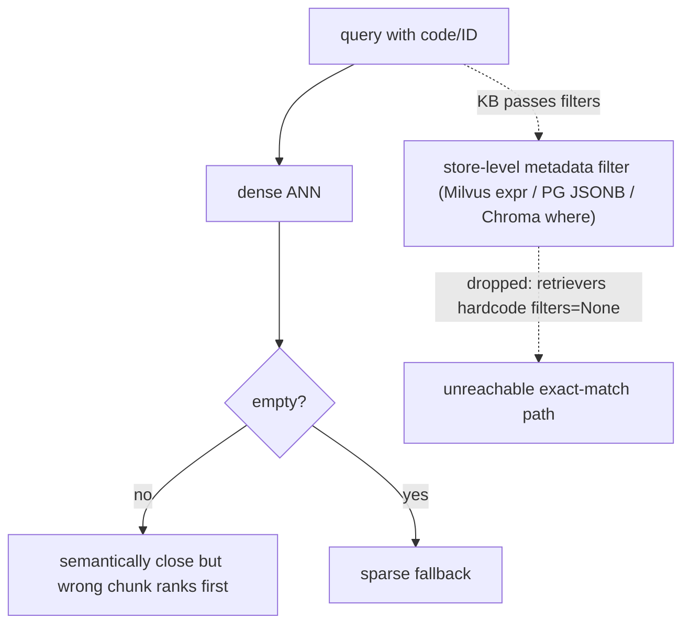
```mermaid
flowchart TD
    Q["query with code/ID"] --> D["dense ANN"]
    D --> E{"empty?"}
    E -->|no| BAD["semantically close but wrong chunk ranks first"]
    E -->|yes| SP["sparse fallback"]
    Q -.->|"KB passes filters"| F["store-level metadata filter (Milvus expr / PG JSONB / Chroma where)"]
    F -.->|"dropped: retrievers hardcode filters=None"| X["unreachable exact-match path"]
```

**Anchors:** &bull; `agent-core/openjiuwen/core/retrieval/retriever/vector_retriever.py:88` — hardcoded `filters=None`; `:84` sparse fallback only when dense empty &bull; `agent-core/openjiuwen/core/retrieval/retriever/hybrid_retriever.py:81` — hardcoded `filters=None` &bull; `agent-core/openjiuwen/core/retrieval/simple_knowledge_base.py:186` — KB passes `filters`, retriever swallows it &bull; `agent-core/openjiuwen/core/retrieval/vector_store/milvus_store.py:215` — `key == value` filter expr; `:219` `QueryExpr.sanitize_str` &bull; `agent-core/openjiuwen/core/retrieval/vector_store/pg_store.py:474` — `build_filters` JSONB containment &bull; `agent-core/openjiuwen/core/retrieval/vector_store/chroma_store.py:265` — `where` dict filter &bull; `agent-core/openjiuwen/core/retrieval/indexing/indexer/milvus_indexer.py:346` — `INVERTED` scalar index on doc id

---

# Reranking

## 13. What reranking adds that initial retrieval doesn't already do

**General:** First-stage retrieval must be fast over millions of items, so it uses cheap approximate similarity and returns a candidate set; it optimizes recall, not precision. A reranker then scores each *candidate against the query jointly* with a much more expensive model, reordering within the top-k. It cannot recover a document that retrieval never returned — reranking improves precision@k, not recall.

**Jiuwen:** A `Reranker` ABC exists (`rerank`/`rerank_sync` returning `{doc: score}`), but it is consumed **only** in the graph store: `MilvusGraphStore.search(..., reranker=...)` collects candidates, then `_rank_results` calls `self.rerank`, overwriting each candidate's `distance` with the reranker score and re-sorting. The `SimpleKnowledgeBase`/`GraphKnowledgeBase` chunk pipeline and all four retrievers have **no rerank stage**, and `RetrievalConfig` has no reranker field. So for classic RAG chunks, reranking adds nothing in-code; you call a reranker manually or use the graph store.

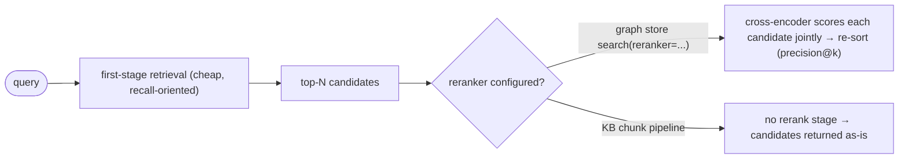
```mermaid
flowchart LR
    Q(["query"]) --> FR["first-stage retrieval (cheap, recall-oriented)"]
    FR --> CAND["top-N candidates"]
    CAND --> RR{"reranker configured?"}
    RR -->|"graph store search(reranker=...)"| XE["cross-encoder scores each candidate jointly → re-sort (precision@k)"]
    RR -->|"KB chunk pipeline"| NONE["no rerank stage → candidates returned as-is"]
```

**Anchors:** &bull; `agent-core/openjiuwen/core/foundation/store/base_reranker.py:37` — `Reranker` ABC &bull; `agent-core/openjiuwen/core/foundation/store/graph/milvus/milvus_support.py:458` — reranker applied to candidates; `:460` `self.rerank(...)`; `:467` `_combined_rerank`; `:100` overwrites `distance`; `:160` `search(..., reranker=None)` &bull; `agent-core/openjiuwen/core/retrieval/simple_knowledge_base.py:182` — KB retrieve has no rerank call &bull; `agent-core/openjiuwen/core/retrieval/graph_knowledge_base.py:227` — GraphKB retrieve has no rerank call

## 14. Bi-encoder for retrieval vs. cross-encoder for reranking

**General:** A bi-encoder embeds query and document independently (fast, precomputable, indexable) but cannot model their interaction. A cross-encoder feeds query+document together through the model and scores the pair, capturing fine-grained relevance at the cost of one forward pass per candidate — hence two-stage retrieval.

**Jiuwen:** Retrieval is bi-encoder (query and docs embedded independently, compared by vector similarity). Reranking is cross-encoder / LLM-as-reranker: `StandardReranker` POSTs `instruct+query` and all documents to a `/rerank` endpoint and reads `relevance_score`; `ChatReranker` (experimental) asks a chat LLM a yes/no judge question and returns `P(yes)/(P(yes)+P(no))` from `top_logprobs`; `DashscopeReranker` extends `StandardReranker` for DashScope's `text-rerank` endpoint. Scoring is query-conditioned at rerank time, unlike the bi-encoder's independent embeddings.

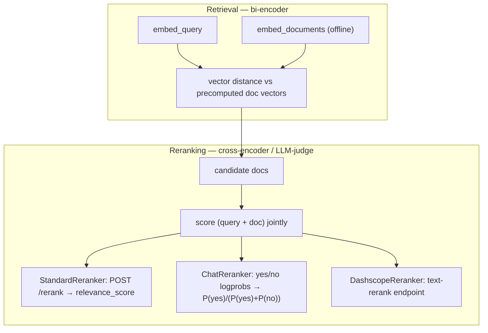
```mermaid
flowchart TD
    subgraph BI["Retrieval — bi-encoder"]
    QE["embed_query"] --> DIST["vector distance vs precomputed doc vectors"]
    DE["embed_documents (offline)"] --> DIST
    end
    subgraph CE["Reranking — cross-encoder / LLM-judge"]
    CAND["candidate docs"] --> SC["score (query + doc) jointly"]
    SC --> SR["StandardReranker: POST /rerank → relevance_score"]
    SC --> CR["ChatReranker: yes/no logprobs → P(yes)/(P(yes)+P(no))"]
    SC --> DR["DashscopeReranker: text-rerank endpoint"]
    end
    DIST --> CAND
```

**Anchors:** &bull; `agent-core/openjiuwen/core/retrieval/retriever/vector_retriever.py:78` — independent query bi-encoder &bull; `agent-core/openjiuwen/core/retrieval/reranker/standard_reranker.py:28` — `/rerank` endpoint; `:29` instruct+query template; `:81` parses `relevance_score` &bull; `agent-core/openjiuwen/core/retrieval/reranker/chat_reranker.py:83` — logprob yes/no scoring; `:125` chat prompt assembly &bull; `agent-core/openjiuwen/core/retrieval/reranker/dashscope_reranker.py:16` — DashScope reranker

**Gap.** `ChatReranker` is one document per request. The `language` kwarg from the graph store is silently dropped by `StandardReranker._assemble_params`.

## 15. Knowing if a reranker is actually improving results, or just reordering noise

**General:** You cannot tell from the order alone — you need labels and a rank-aware metric (nDCG@k, MRR, recall@k) plus an A/B over the same candidate set with and without reranking. If precision@k/nDCG does not improve on a held-out set, the reranker is reordering noise. Watch for the reranker merely promoting longer/more generic chunks.

**Jiuwen:** There is no built-in metric/eval harness (no nDCG/MRR/recall anywhere in `core/retrieval`). The only evidence mechanism is a manual comparison in `examples/store/showcase_milvus_graph_store.py`: it searches with `reranker=RERANKER` and again with `reranker=None`, then `_log_score_comparison` prints per-rank scores, a diff, and min/max ranges. The graph store supports a `min_score` threshold to drop low-scoring candidates. Nothing logs candidate counts before/after and no ground-truth labels are used, so "reordering" vs "improving" cannot be distinguished in-code.

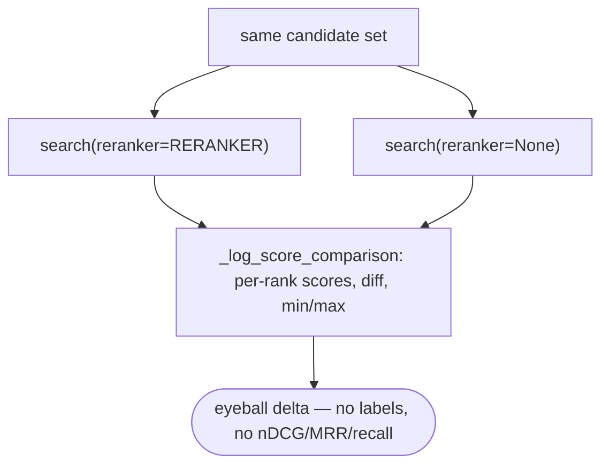
```mermaid
flowchart TD
    CAND["same candidate set"] --> A["search(reranker=RERANKER)"]
    CAND --> B["search(reranker=None)"]
    A --> CMP["_log_score_comparison: per-rank scores, diff, min/max"]
    B --> CMP
    CMP --> R(["eyeball delta — no labels, no nDCG/MRR/recall"])
```

**Anchors:** &bull; `agent-core/examples/store/showcase_milvus_graph_store.py:51` — `_log_score_comparison`; `:63` per-rank with/without reranker scores &bull; `agent-core/openjiuwen/core/foundation/store/graph/milvus/milvus_support.py:453` — `min_score` candidate filtering; `:444` `_rank_results` (no metrics logged) &bull; `agent-core/openjiuwen/core/foundation/store/base_reranker.py:29` — `Document{id_, text, metadata}`

## 16. How much latency reranking adds, and deciding if it's worth it

**General:** Reranking latency scales with the number of candidates and whether the model scores them in one batch or one-by-one. A cross-encoder over ~50–100 candidates typically adds tens to low-hundreds of milliseconds; an LLM-judge reranker is one call per document and can add seconds. Worth it when precision@k matters more than latency, when the candidate count is bounded, and when you can cache.

**Jiuwen:** `RerankerConfig.timeout` defaults to 10 s, and `StandardReranker` sends **all** candidates in one request with `top_n=len(documents)` (no batching/concurrency), `max_retries=3` with backoff. `ChatReranker` enforces a list of size 1, so it costs one LLM call per candidate (O(N) latency) and is flagged experimental. Reranking is optional (`reranker=None` default), and the product `jiuwenswarm` pins `rerank_enabled: False` in the external memory builder. The only guard is the per-request timeout plus `min_score`; no candidate cap, rerank batch size, or cost accounting.

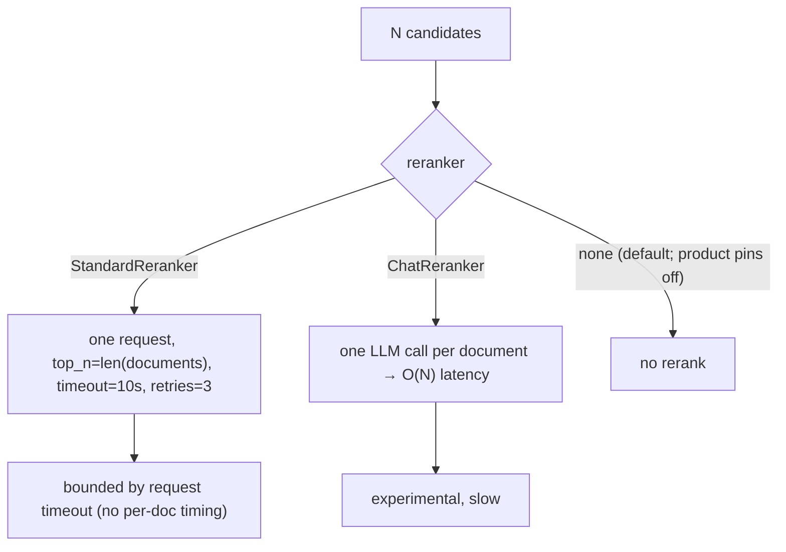
```mermaid
flowchart TD
    CAND["N candidates"] --> S{"reranker"}
    S -->|StandardReranker| ONE["one request, top_n=len(documents), timeout=10s, retries=3"]
    S -->|ChatReranker| PER["one LLM call per document → O(N) latency"]
    S -->|"none (default; product pins off)"| SKIP["no rerank"]
    ONE --> OK["bounded by request timeout (no per-doc timing)"]
    PER --> EXP["experimental, slow"]
```

**Anchors:** &bull; `agent-core/openjiuwen/core/foundation/store/base_reranker.py:22` — `timeout` default 10 s &bull; `agent-core/openjiuwen/core/retrieval/reranker/standard_reranker.py:120` — `top_n=len(documents)` single request; `:35` `max_retries=3` &bull; `agent-core/openjiuwen/core/retrieval/reranker/chat_reranker.py:113` — list-size-1 constraint (per-doc LLM call) &bull; `agent-core/openjiuwen/core/retrieval/utils/api_requests.py:55` — retry/backoff loop &bull; `agent-core/openjiuwen/core/foundation/store/graph/milvus/milvus_support.py:160` — `reranker=None` optional &bull; `jiuwenswarm/jiuwenswarm/agents/harness/common/memory/external_memory_builder.py:340` — product pins `rerank_enabled: False`

---

# Retrieval evaluation

## 17. Recall@k, and what a low score tells you about your retrieval setup

**General:** Recall@k is the fraction of queries whose relevant document appears in the top-k. A low score means retrieval (not generation) is the failure: relevant content is missing from the candidate set, so no reranker or prompt can recover it. Diagnose by checking chunking (answer split/lost), embedding fit, whether the query and index use the same model, and whether exact-match terms need a sparse leg.

**Jiuwen:** There is no `Recall@k` implementation. The only recall-looking code is a **classification** evaluator for the proactive-memory gate in `examples/PerStream/src/eval/` ("TA (Recall)" = TP/(TP+FN) over proactive-memory moments), which is not ranking retrieval against gold documents. `recall_compressed_context` is named "recall" but is a BM25 lookup returning chunks, not a metric. Nothing computes retrieved-vs-relevant overlap at rank k.

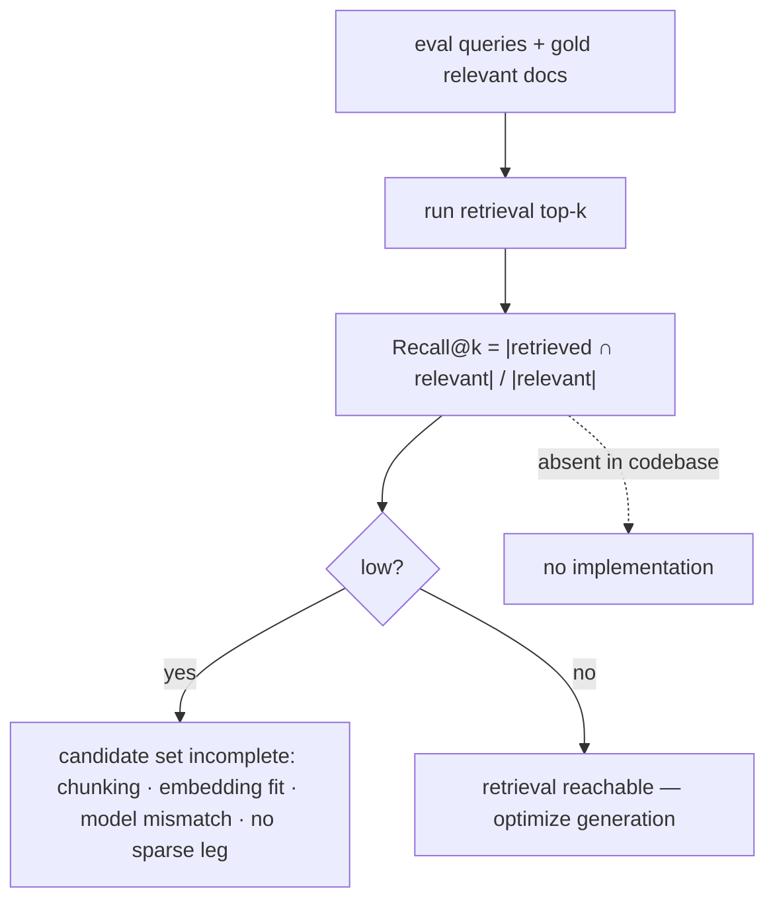
```mermaid
flowchart TD
    Q["eval queries + gold relevant docs"] --> R["run retrieval top-k"]
    R --> M["Recall@k = |retrieved ∩ relevant| / |relevant|"]
    M --> LOW{"low?"}
    LOW -->|yes| DIAG["candidate set incomplete: chunking · embedding fit · model mismatch · no sparse leg"]
    LOW -->|no| OK["retrieval reachable — optimize generation"]
    M -.->|"absent in codebase"| X["no implementation"]
```

**Anchors:** &bull; `agent-core/examples/PerStream/src/eval/score_proactive_judge.py:355` — `get_ta_recall` = TP/(TP+FN) (classification, not retrieval@k) &bull; `agent-core/examples/PerStream/src/eval/test_remember_gate.py:180` — sklearn `recall_score` (gate classifier) &bull; `agent-core/examples/PerStream/src/eval/eval_proactive_reduction.py:92` — LLM-judged memory metrics &bull; `agent-core/openjiuwen/core/context_engine/processor/forked/compressor/recall/retriever.py:27` — `recall_compressed_context` (name only)

**Gap.** Recall@k is absent. The closest thing is the PerStream proactive-memory classification recall, a different task.

## 18. Precision@k, and how it differs from Recall@k

**General:** Recall@k asks "did we get all the relevant items?"; precision@k asks "of the k we returned, how many were relevant?". They trade off: increasing k raises recall and usually lowers precision. Use recall when missing the answer is costly (RAG context), precision when the top results are consumed directly (answer extraction or UI).

**Jiuwen:** Also absent. The same PerStream `ScoreMeter` defines "TV (Precision)" = TP/(TP+FP) for the proactive-memory extraction task, and `test_remember_gate.py` calls sklearn `precision_score` — classification, not ranking. Ranking utilities that do exist (`rrf_fusion`, `WeightedRankConfig`/`RRFRankConfig`, product `_merge_hybrid_results`) only order candidates and never compute precision.

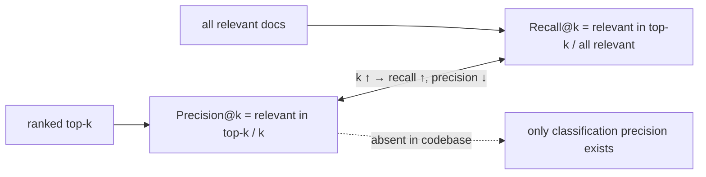
```mermaid
flowchart LR
    R["ranked top-k"] --> P["Precision@k = relevant in top-k / k"]
    G["all relevant docs"] --> RC["Recall@k = relevant in top-k / all relevant"]
    P <-->|"k ↑ → recall ↑, precision ↓"| RC
    P -.->|"absent in codebase"| X["only classification precision exists"]
```

**Anchors:** &bull; `agent-core/examples/PerStream/src/eval/score_proactive_judge.py:362` — `get_tv_precision` = TP/(TP+FP) &bull; `agent-core/examples/PerStream/src/eval/test_remember_gate.py:179` — sklearn `precision_score` &bull; `agent-core/openjiuwen/core/retrieval/utils/fusion.py:15` — `rrf_fusion` (ranking, not metric) &bull; `agent-core/openjiuwen/core/memory/manage/search/search_manager.py:87` — sort-by-score + truncate (ranking, not metric)

## 19. MRR, and when it matters more than Recall@k

**General:** MRR is the mean of `1/rank` of the first relevant result. It matters when the user/system mostly needs the single best hit and the position of the first correct answer is what counts (FAQ lookup, "open the right doc", navigation). Recall@k matters when a set of results is consumed together (context stuffing). MRR ignores everything after the first relevant hit, so it is blind to recall.

**Jiuwen:** MRR is not implemented anywhere; there is no reciprocal-rank or first-relevant-rank helper. The retrieval stack uses Reciprocal **Rank Fusion** (`rrf_fusion`, `1/(k+rank)`) and weighted RRF in the graph store — rank-fusion algorithms, not an evaluation metric. The product's `bm25_rank_to_score` converts an FTS5 rank to a similarity score, also not MRR.

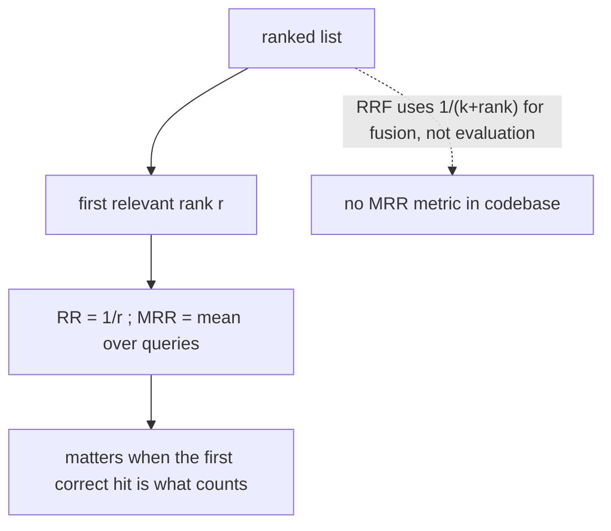
```mermaid
flowchart TD
    R["ranked list"] --> F["first relevant rank r"]
    F --> M["RR = 1/r ; MRR = mean over queries"]
    M --> USE["matters when the first correct hit is what counts"]
    R -.->|"RRF uses 1/(k+rank) for fusion, not evaluation"| X["no MRR metric in codebase"]
```

**Anchors:** &bull; `agent-core/openjiuwen/core/retrieval/utils/fusion.py:15` — `rrf_fusion` (rank fusion, not MRR) &bull; `agent-core/openjiuwen/core/foundation/store/graph/result_ranking.py:85` — `RRFRankConfig` (k=40 fusion config); `:61` `WeightedRankConfig` &bull; `jiuwenswarm/jiuwenswarm/agents/harness/common/memory/internal.py:165` — `bm25_rank_to_score` (rank→score) &bull; `agent-core/openjiuwen/core/foundation/store/index/simple_memory_index.py:348` — sorts by score only

## 20. Building a retrieval eval set without labeled relevant documents yet

**General:** Common bootstraps: mine queries from real logs or user questions, then label relevance by (a) LLM judging candidate chunks, (b) using a strong model to answer and treating cited chunks as relevant (RAGAS-style), or (c) creating synthetic queries from known documents (the document is the gold answer). Start small (50–200 queries), cover query types including exact-match and multi-hop, and iterate; a tiny labeled set beats none.

**Jiuwen:** There is no synthetic-query generation, no retrieval eval harness, and no LLM judge for retrieval relevance. The only "generate data + judge" code is the PerStream proactive-memory eval (`eval_proactive_dataset.py` runs inference; `score_proactive_judge.py:annotate` uses an LLM to judge memory moments). `tests/unit_tests/core/retrieval/` contains unit fixtures with mocked retrievers/embeddings asserting shapes, not gold relevance labels. So there is no established path to bootstrap a retrieval eval set here.

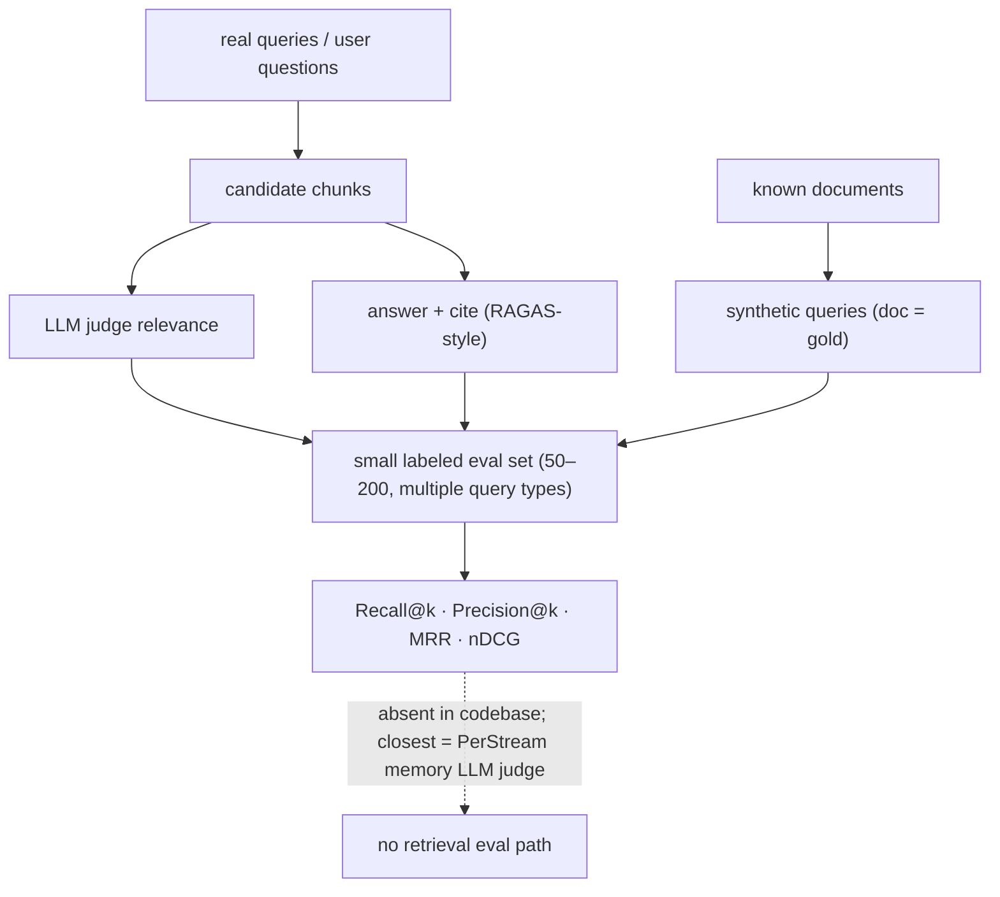
```mermaid
flowchart TD
    LOGS["real queries / user questions"] --> CAN["candidate chunks"]
    DOCS["known documents"] --> SYN["synthetic queries (doc = gold)"]
    CAN --> J["LLM judge relevance"]
    CAN --> ANS["answer + cite (RAGAS-style)"]
    J --> SET["small labeled eval set (50–200, multiple query types)"]
    SYN --> SET
    ANS --> SET
    SET --> MET["Recall@k · Precision@k · MRR · nDCG"]
    MET -.->|"absent in codebase; closest = PerStream memory LLM judge"| X["no retrieval eval path"]
```

**Anchors:** &bull; `agent-core/examples/PerStream/src/eval/score_proactive_judge.py:35` — `annotate(...)` LLM judge (memory, not retrieval) &bull; `agent-core/examples/PerStream/src/eval/eval_proactive_dataset.py:121` — `run_inference`, dataset build for memory task &bull; `agent-core/tests/unit_tests/core/retrieval/query_rewriter/test_query_rewriter.py` — mock-based unit fixtures &bull; `agent-core/tests/unit_tests/core/retrieval/retriever/test_agentic_retriever.py` — mock-based agentic test &bull; `agent-core/openjiuwen/core/retrieval/query_rewriter/query_rewriter.py:412` — `rewrite` (query generation from user input, not eval-set synthesis)

---

# Multi-document and complex queries

## 21. Handling a question requiring information from multiple documents

**General:** Retrieve a candidate set per sub-query or per entity, then merge and deduplicate, and let the generator synthesize across them (or do an aggregation/summarization step). The hard parts are merging ranked lists from different queries, keeping per-document provenance for citation, and ensuring no single document dominates. Recall must be high because every needed document must be present.

**Jiuwen:** This is the strongest area. `AgenticRetriever` runs up to `max_iter` rounds against a base retriever, accumulating `TripleMemory`, then fuses all per-round result lists with RRF (`rrf_fusion(ret + history_results)` in graph mode, `rrf_fusion(history_results)` in generic mode). `GraphRetriever.graph_expansion` fetches triple-linked chunks and fuses new+original chunks via RRF. Multi-KB retrieval merges/dedupes by text keeping the max score. Core memory search aggregates across typed managers, and graph memory searches entity/relation/episode collections concurrently.

```mermaid
flowchart TD
    Q(["multi-document question"]) --> R1["round 1 retrieval"]
    R1 --> T["extract triples → TripleMemory"]
    T --> R2["round 2+ (agentic loop)"]
    R2 --> F["rrf_fusion over per-round lists"]
    R1 --> F
    F --> MK["multi-KB: dedupe by text, keep max score"]
    MK --> R(["merged candidate set (provenance preserved)"])
```

**Anchors:** &bull; `agent-core/openjiuwen/core/retrieval/retriever/agentic_retriever.py:250` — `rrf_fusion(ret + history_results)[:top_k]` (graph mode); `:295` `rrf_fusion(history_results)[:top_k]` (generic) &bull; `agent-core/openjiuwen/core/retrieval/retriever/graph_retriever.py:520` — `rrf_fusion([new_chunks, chunks], k=60)` &bull; `agent-core/openjiuwen/core/retrieval/simple_knowledge_base.py:285` — `retrieve_multi_kb` dedupe-by-text + max-score merge; `:318` `retrieve_multi_kb_with_source` &bull; `agent-core/openjiuwen/core/memory/manage/search/search_manager.py:86` — aggregate + sort + truncate &bull; `agent-core/openjiuwen/core/memory/graph/graph_memory/base.py:422` — concurrent entity/relation/episode search &bull; `agent-core/openjiuwen/core/retrieval/graph_knowledge_base.py:353` — `retrieve_multi_graph_kb`

**Gap.** No explicit cross-document synthesis or evidence-linking step; merging is score/rank fusion, not reasoning over combined docs.

## 22. Multi-hop retrieval, and when single-pass retrieval fails

**General:** Single-pass fails when the answer requires a bridging entity that is not in the top-k of the original query (e.g. "who directed the film that won award X in year Y" needs the film first). Multi-hop iterates: retrieve, extract intermediate facts, formulate the next query, retrieve again, until sufficient. Graph/triple stores make hops explicit; query-decomposition approaches generate sub-queries.

**Jiuwen:** `AgenticRetriever` maintains a `queries` list, extracts triples from each round, and asks the LLM for a `next_question` only when accumulated triples are insufficient, then appends and re-retrieves. `GraphRetriever`/`TripleBeamSearch` performs beam search over triples for `max_length` hops (default `graph_hops=2`), expanding via entity-sharing candidates. Core memory graph search supports BFS expansion via `bfs_depth`/`bfs_k`.

```mermaid
flowchart TD
    Q0["query"] --> R0["retrieve round 1"]
    R0 --> T0{"triples sufficient?"}
    T0 -->|no| NQ["LLM next_question → append to queries"]
    NQ --> R0
    T0 -->|yes| OUT(["fused result"])
    subgraph GRAPH["Graph path"]
    direction TB
    B["TripleBeamSearch: max_length hops (graph_hops=2)"] --> BFS["entity-sharing expansion / BFSPoint bfs_depth"]
    end
    R0 --- GRAPH
```

**Anchors:** &bull; `agent-core/openjiuwen/core/retrieval/retriever/agentic_retriever.py:213` — `for turn in range(1, max_iter + 1)`; `:244` `_rewrite` appends next question; `:70` prompt "Break it down into smaller questions if needed." &bull; `agent-core/openjiuwen/core/retrieval/retriever/graph_retriever.py:100` — beam expansion loop; `:402` `graph_hops = kwargs.get("graph_hops", 2)` &bull; `agent-core/openjiuwen/core/retrieval/common/triple_beam.py:12` — `TripleBeam` &bull; `agent-core/openjiuwen/core/memory/config/graph.py:86` — `bfs_depth` / `bfs_k` &bull; `agent-core/openjiuwen/core/foundation/store/graph/milvus/milvus_support.py:215` — BFS graph expansion

**Gap.** Generic (non-graph) agentic mode only iterates query rewriting; there is no explicit hop-count decomposition or per-hop evidence tracking outside the graph/triple path. No multi-hop benchmark.

## 23. Vocabulary mismatch, where the answer exists but uses different wording

**General:** The document says "myocardial infarction", the user says "heart attack". Mitigations: better embeddings (semantic match), query expansion/synonyms, HyDE (generate a hypothetical answer and retrieve with it), and hybrid search so exact terms still match. Pure dense handles paraphrase but not rare terms; pure sparse handles rare terms but not paraphrase.

**Jiuwen:** The `QueryRewriter` is the designated mitigation, but it targets **coreference/ellipsis/semantic gaps**, not synonyms: it produces a `standalone_query` and records `typo` corrections, `missing` items, and `references`. Retrieval-side semantic matching comes from the vector/hybrid retrievers and graph-memory name embeddings. There is **no** HyDE, no synonym/query-expansion dictionary, and no pseudo-document generation.

```mermaid
flowchart TD
    Q["query wording ≠ doc wording"] --> RW["QueryRewriter: standalone_query + typo + references + missing"]
    Q --> EMB["dense embedding semantic match"]
    Q --> SP["sparse exact-term match"]
    RW -.->|"absent"| HYDE["HyDE / synonym expansion / pseudo-docs"]
    EMB --> R(["retrieve"])
    SP --> R
```

**Anchors:** &bull; `agent-core/openjiuwen/core/retrieval/query_rewriter/query_rewriter.py:412` — `rewrite(query)` → `standalone_query`; `:277` output schema &bull; `agent-core/openjiuwen/core/retrieval/query_rewriter/prompts/intention_completion_en.md:32` — coreference resolution; `:41` missing-information completion; `:47` typo correction &bull; `agent-core/openjiuwen/core/retrieval/retriever/graph_retriever.py:349` — vector retriever (dense semantic match) &bull; `agent-core/openjiuwen/core/memory/graph/graph_memory/base.py:735` — `_fetch_relevant_entities` semantic entity match

## 24. Decomposing a complex, multi-part question into smaller retrievable sub-questions

**General:** Split "compare A and B on X and Y" into retrievable sub-questions ("A's X", "B's X", "A's Y", "B's Y"), retrieve for each (often in parallel), then combine. Decomposition can be a dedicated LLM call or part of an agentic loop; the key is that each sub-question is independently answerable from the corpus.

**Jiuwen:** Decomposition exists only as a prompt-level heuristic inside `AgenticRetriever._rewrite`: when triples are insufficient, the LLM returns a single `next_question` and the prompt invites "Break it down into smaller questions if needed." There is no first-class sub-question object, no planner step list, and no parallel sub-query generation — the retriever appends one next question and re-runs. (`core/controller/legacy/reasoner/planner.py` decomposes general tasks, not retrieval queries.)

```mermaid
flowchart TD
    CQ["complex multi-part question"] --> RW["AgenticRetriever._rewrite (sufficiency check)"]
    RW -->|"insufficient"| NQ["one next_question (prompt: break it down)"]
    NQ --> RET["re-retrieve"]
    RET --> RW
    RW -->|"sufficient"| ANS(["combine"])
    CQ -.->|"absent"| PAR["first-class sub-question objects · parallel sub-query generation · plan list"]
```

**Anchors:** &bull; `agent-core/openjiuwen/core/retrieval/retriever/agentic_retriever.py:70` — "Break it down into smaller questions if needed."; `:326` `_rewrite` sufficiency + next-question; `:364` parses `sufficient`/`next_question`; `:290` appends rewritten question &bull; `agent-core/openjiuwen/core/controller/legacy/reasoner/planner.py:12` — general task Planner (not retrieval)

---

# Scale and freshness

## 25. How retrieval architecture changes from 10,000 to 10 million documents

**General:** At small scale, a local in-process index (FAISS/Chroma) is fine. At large scale you need a dedicated vector DB with tuned ANN indexes (HNSW/IVF/quantization), sharding/partitioning, replication, and batch ingestion; you also start caring about memory, index build time, and recall/latency tuning per query. The interface stays the same but the operational envelope changes.

**Jiuwen:** Scale-out is delegated to the backend: Chroma = local persistent HNSW (small/medium), Milvus = server ANN with selectable AUTO/HNSW/IVF/SCANN and quantization variants (large), PGVector = pgvector HNSW/IVFFlat (relational). Writes are batched (128) and flushed. Milvus BM25 for hybrid is native (`SPARSE_INVERTED_INDEX`) plus a jieba analyzer. The architecture is a single collection per KB (`kb_{kb_id}_chunks`) with one ANN index created once at collection creation. There is no sharding, partitioning, replica, or multi-collection fan-out anywhere.

```mermaid
flowchart LR
    S["scale"] --> SM["~10K: Chroma (local HNSW)"]
    S --> LG["millions: Milvus (AUTO/HNSW/IVF/SCANN + quantization)"]
    S --> REL["relational: PGVector (HNSW/IVFFlat)"]
    SM --> W["batched writes (128)"]
    LG --> W
    REL --> W
    W -.->|"absent"| SHARD["no sharding · partition · replica · fan-out"]
```

**Anchors:** &bull; `agent-core/openjiuwen/core/retrieval/vector_store/store.py:16` — `create_vector_store` (Milvus/Chroma/PGVector); `agent-core/openjiuwen/core/retrieval/common/config.py:67` — store type enum &bull; `agent-core/openjiuwen/core/retrieval/indexing/indexer/milvus_indexer.py:433` — index type AUTOINDEX/HNSW/IVF/FLAT/SCANN; `:346` inverted scalar indexes &bull; `agent-core/openjiuwen/core/foundation/store/vector_fields/milvus_fields.py:282` — `MilvusHNSW` (M=30, efConstruction=360); `:100` IVFFlat defaults; `:164` SCANN &bull; `agent-core/openjiuwen/core/retrieval/vector_store/pg_store.py:203` — HNSW index; `agent-core/openjiuwen/core/foundation/store/vector_fields/pg_fields.py:37` — pgvector defaults &bull; `agent-core/openjiuwen/core/foundation/store/vector_fields/chroma_fields.py:47` — Chroma HNSW defaults &bull; `agent-core/openjiuwen/core/retrieval/vector_store/base.py:57` — `add(..., batch_size=128)`

## 26. Handling a document updated or deleted after it's already indexed

**General:** You need a stable document id and a delete-by-id path; updates are delete-then-insert (or upsert). Chunk ids must be derived from the document id so all chunks of a document can be found and removed atomically. The hard parts are atomicity (a crash between delete and reinsert loses the doc) and eventual consistency in the vector store.

**Jiuwen:** The contract is delete-by-`doc_id` + rebuild. Chroma/Milvus indexers do **not** upsert: they scan a doc's chunk IDs, delete them, then re-chunk/re-embed/write (Milvus flushes between to defeat eventual consistency). `doc_id` is a first-class field (`document_id`, scalar-inverted in Milvus) enabling filter deletes. PG is the only store with native upsert-by-primary-key (`INSERT ... ON CONFLICT (id) DO UPDATE`), but no PG indexer wraps it. There is no atomic/transactional replace — a crash between delete and rebuild loses the document, and chunk IDs are regenerated UUIDs each run so "same document" relies solely on `doc_id`.

```mermaid
flowchart TD
    UP["update_documents(doc_id)"] --> DEL["delete_index(doc_id): filter delete all chunks"]
    DEL --> RE["re-chunk + re-embed + build_index"]
    RE --> FL["Milvus flush (consistency)"]
    DEL -.->|"crash here"| LOSS["document lost (no transaction)"]
    PG["PG store: INSERT ... ON CONFLICT DO UPDATE (upsert)"] -.->|"no PG indexer wraps it"| X["unused upsert path"]
```

**Anchors:** &bull; `agent-core/openjiuwen/core/retrieval/knowledge_base.py:158` — abstract `delete_documents` / `update_documents` &bull; `agent-core/openjiuwen/core/retrieval/simple_knowledge_base.py:192` — `delete_documents`; `:219` `update_documents` &bull; `agent-core/openjiuwen/core/retrieval/indexing/indexer/chroma_indexer.py:198` — `update_index` = delete + build; `:217` delete by `doc_id`; `:142` duplicate guard &bull; `agent-core/openjiuwen/core/retrieval/indexing/indexer/milvus_indexer.py:209` — delete + flush + rebuild; `:231` filter delete `document_id == doc_id` &bull; `agent-core/openjiuwen/core/retrieval/vector_store/pg_store.py:300` — `INSERT ... ON CONFLICT DO UPDATE` &bull; `agent-core/openjiuwen/core/retrieval/graph_knowledge_base.py:253` — delete chunk + triple index; `:294` update = delete + re-add

## 27. Keeping retrieval fast as the vector database grows, without a full re-index

**General:** Append-only incremental indexing into a pre-built ANN index avoids full rebuilds; deletes/filters stay fast with scalar/inverted indexes; search-time parameters (efSearch, nprobe) tune the recall/latency dial without reindexing. At some point you need compaction/merge of segments and periodic index rebuilds — that is an operational concern, not a query-time one.

**Jiuwen:** Growth is handled by append-only batched writes into a pre-existing ANN index; existing vectors are untouched, so adding documents triggers no full re-index. Fast deletes/filters use the Milvus inverted scalar index on `document_id`/`chunk_id`. `get_search_params` derives `ef = top_k * efSearchFactor` per query (a search-time recall knob). `lazy_load` defers heavy module imports (Milvus/Chroma/parsers), not data. There is **no query result cache**, no reindex/compaction trigger, and no `ALTER INDEX` path — once the collection is created, ANN algorithm/params cannot change.

```mermaid
flowchart TD
    ADD["add_documents"] --> APP["append into existing ANN index (batched, no rebuild)"]
    ADD --> SC["scalar inverted index on document_id/chunk_id → fast delete/filter"]
    Q["query"] --> SP["get_search_params: ef = top_k × efSearchFactor (tune without reindex)"]
    APP -.->|"absent"| CACHE["no query cache · no compaction trigger · no ALTER INDEX"]
```

**Anchors:** &bull; `agent-core/openjiuwen/core/retrieval/vector_store/milvus_store.py:519` — `_ensure_loaded` lazy load; `:144` index_type change guard; `:117` `get_search_params` ef dial; `:199` flush after write &bull; `agent-core/openjiuwen/core/retrieval/indexing/indexer/milvus_indexer.py:321` — `_ensure_collection` no-op if exists; `:346` inverted scalar indexes &bull; `agent-core/openjiuwen/core/retrieval/vector_store/pg_store.py:157` — reflects existing table; `:203` index created once &bull; `agent-core/openjiuwen/core/retrieval/lazy_load.py:143` — `lazy_load` (module imports) &bull; `agent-core/openjiuwen/core/retrieval/simple_knowledge_base.py:74` — `add_documents` appends via `build_index`

## 28. Handling multiple document types and formats in the same system

**General:** Normalize everything to one record shape (text + metadata + id) at ingestion, with a parser per format behind a registry keyed by MIME/extension, and preserve format-specific structure as metadata. Chunking and indexing then operate on the uniform record. The risks are silent format gaps (a parser that drops structure) and mixed semantics (tables vs prose) needing different chunk policies.

**Jiuwen:** Format dispatch is an extension-keyed plugin registry loaded lazily by `AutoFileParser._ensure_parsers_loaded`; each parser returns `Document` objects with a common text+metadata shape. Registered extensions cover `.txt/.md/.markdown`, `.pdf`, `.docx`, `.xlsx/.csv/.tsv`, `.htm/.html`, `.json`, and `.png/.jpg/.jpeg/.webp/.gif/.jfif`; `AutoParser` adds URL routing (WeChat vs generic web). `source_type` (`row`/`column`/`web_page`/`wechat_article`) and `image_path` distinguish semantics. Downstream chunking/indexing is format-agnostic. Word/PDF/JSON/TXT parsers set no `source_type` (only `file_ext`), and there is no per-format chunking policy beyond `HybridChunker`'s row/column predicate.

```mermaid
flowchart LR
    F(["file or URL"]) --> AP["AutoParser: URL → link parser, else AutoFileParser"]
    AP --> REG["extension registry → parser (pdf/word/excel/html/json/txt-md/image)"]
    REG --> DOC["Document{id, text, metadata: source_type, file_ext, sheet_name, row_index, image_path, …}"]
    DOC --> CH["format-agnostic chunking (HybridChunker keeps row/column whole)"]
    CH --> IDX["uniform indexing"]
```

**Anchors:** &bull; `agent-core/openjiuwen/core/retrieval/indexing/processor/parser/auto_parser.py:23` — `AutoParser` URL vs file routing; `:48` `parse` &bull; `agent-core/openjiuwen/core/retrieval/indexing/processor/parser/auto_file_parser.py:24` — `@register_parser(file_extensions)` registry; `:98` extension dispatch; `:121` enriches `doc_id`/`title`/`file_path`/`file_ext` &bull; `agent-core/openjiuwen/core/retrieval/indexing/processor/parser/txt_md_parser.py:14` — `.txt/.md/.markdown`; `agent-core/openjiuwen/core/retrieval/indexing/processor/parser/pdf_parser.py:16` `.pdf`; `agent-core/openjiuwen/core/retrieval/indexing/processor/parser/word_parser.py:63` `.docx`; `agent-core/openjiuwen/core/retrieval/indexing/processor/parser/excel_parser.py:131` `.xlsx/.csv/.tsv`; `agent-core/openjiuwen/core/retrieval/indexing/processor/parser/html_file_parser.py:89` `.htm/.html`; `agent-core/openjiuwen/core/retrieval/indexing/processor/parser/json_parser.py:15` `.json`; `agent-core/openjiuwen/core/retrieval/indexing/processor/parser/image_parser.py:15` images &bull; `agent-core/openjiuwen/core/foundation/store/base_reranker.py:29` — uniform `Document{id_, text, metadata}` &bull; `agent-core/openjiuwen/core/retrieval/indexing/processor/chunker/base.py:91` — `chunk_documents` uniform conversion

---

## Summary: strong vs weak in Jiuwen

| Area | Strength | Notes |
|---|---|---|
| Embedding providers | Strong | OpenAI/DashScope/vLLM/API behind one `Embedding` ABC, batching, Matryoshka dims |
| Embedding model identity | Weak | not persisted with the index; model swap = manual full re-embed |
| Query/doc symmetry | Mixed | one shared model, but query-vs-passage prefixes not plumbed (except vLLM multimodal) |
| Similarity scoring | Mixed | cosine default, backend-specific normalization, no MMR/calibration |
| Chunking | Strong | char/token/hybrid, sentence packing, overlap, validation, tokenizer clamps |
| Semantic / header-aware chunking | Weak | no embedding-breakpoint or Markdown-header chunker; HTML structure flattened |
| Structured content | Mixed | Excel row/column + Word markdown tables kept; PDF/HTML/JSON flattened |
| Sparse retrieval | Strong (Milvus) | native BM25; Chroma TF-IDF and PG FTS are weaker substitutes |
| Hybrid fusion | Strong | RRF everywhere; `alpha` weighting is dead in KB stores |
| Exact-match / metadata filters | Weak | store-level filters exist but retrievers hardcode `filters=None` |
| Reranking | Mixed | cross-encoder + LLM-judge + DashScope exist; **not wired** into chunk KB pipeline |
| Reranking cost controls | Weak | one unbatched request, no candidate cap; product ships it off |
| Retrieval evaluation metrics | Weak | no Recall@k / Precision@k / MRR / nDCG anywhere |
| Eval-set bootstrapping | Weak | no synthetic queries, gold labels, or retrieval LLM judge |
| Multi-document / multi-hop | Strong | agentic loop, triple beam search, graph BFS, RRF fusion |
| Query rewriting | Mixed | coreference/typo/references only; no synonym expansion or HyDE |
| Query decomposition | Weak | prompt-level single next-question; no sub-question objects or parallel sub-queries |
| Scale-out | Strong | Chroma/Milvus/PG backends, tunable ANN params, batched writes |
| Freshness (update/delete) | Mixed | delete-by-id + rebuild; not atomic; no PG indexer for the native upsert |
| Multi-format ingestion | Strong | extension registry, uniform `Document`, per-format metadata |
