# RAG system design interview questions — general answers + how Jiuwen does it

Based on the recurring list *RAG System Design Questions I Keep Seeing in AI Interviews* (Whiteboard-Style Design Prompts; Scale and Infrastructure; Latency and Cost Tradeoffs; Data Freshness and Consistency; Reliability and Failure Handling; Security and Access Control). These are "design this for me" prompts rather than conceptual questions.

For the whiteboard prompts the **General** answer is the design reasoning (what to decide and why), and the **Jiuwen** answer maps each decision to what this codebase actually provides — including the gaps a real design would have to fill. Where a mechanism was already covered in the RAG docs, the answer is reused. See [README](README.md) for the shared conventions (answer shape, anchor format, repo layers).

> **The pattern worth noticing:** conceptual RAG questions test if you understand the pipeline. System design RAG questions test if you can make it survive real users, real scale, and real failures — that's a different skill, and it's the one that actually gets tested in senior-level rounds.

---

# Whiteboard-style design prompts

## 1. Design a RAG system for a customer support chatbot handling 100,000 queries a day

**General:** Start from the request rate and SLA, then choose components: ingestion (parse → chunk → embed → index), retrieval (hybrid dense+sparse), a reranker, a generation layer, caching, and observability. 100k/day is ~1.2 QPS average (bursts higher), so a single server-class vector DB is fine; the real work is cache hit rate, top-k tuning, guardrails, and a feedback loop. Size context and cost per query, then multiply.

**Jiuwen:** Provides the ingestion pipeline (`parse_files` → `chunk_documents` → `build_index`), hybrid retrieval with RRF, optional rerankers (graph store only), and the context/generation path via `KnowledgeRetrievalComponent` + `LLMComponent`. Product adds session cost tracking and a per-session cost cap. Gaps a design must cover: no packaged end-to-end RAG agent, no token budgeting on retrieved context, no quality monitoring (only error/latency tracing), and no semantic response cache.

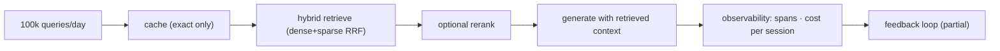

**Anchors:** &bull; `agent-core/openjiuwen/core/retrieval/simple_knowledge_base.py:96/110/182` — ingest/retrieve pipeline &bull; `agent-core/openjiuwen/core/retrieval/utils/fusion.py:15` — RRF hybrid merge &bull; `agent-core/openjiuwen/core/workflow/components/resource/knowledge_retrieval_comp.py:109/243` — context assembly &bull; `jiuwenswarm/jiuwenswarm/server/runtime/usage_cost.py:171` — session cost cap &bull; `jiuwenswarm/jiuwenswarm/agents/harness/common/rails/tool_dedup_rail.py:47` — exact tool result cache

## 2. Design a document search system for a legal firm with millions of confidential documents

**General:** The dominant requirement is access control, then scale. Every chunk must carry an ACL (owner, matter, tenant) and every query must be filtered by the caller's permissions *inside* the vector search (pre-filter), not after. Combine that with hybrid retrieval, a reranker, encryption at rest, audit logging, and per-matter isolation. Confidentiality also means no cross-matter leakage in the prompt context.

**Jiuwen:** Supports metadata filtering at the **store** layer (Milvus expr, Chroma `where`, PG JSONB) and per-KB collections (`kb_{kb_id}_chunks`), plus a permission engine and audit logging. But the retriever layer **drops** `RetrievalConfig.filters` — concrete retrievers hardcode `filters=None` — so permission-aware retrieval is not reachable through the KB path, and there is no document/chunk ACL field. Permission-aware retrieval would require re-plumbing filters through the retriever.

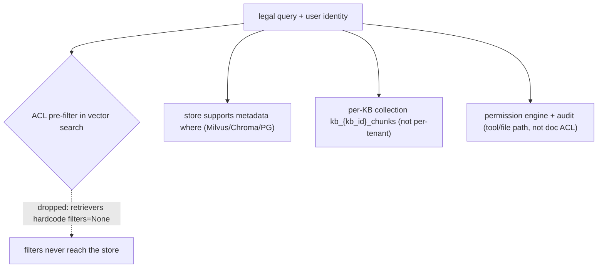

**Anchors:** &bull; `agent-core/openjiuwen/core/retrieval/common/config.py:53` — `RetrievalConfig.filters`; `agent-core/openjiuwen/core/retrieval/retriever/base.py:19` — abstract `retrieve` has no `filters`; `agent-core/openjiuwen/core/retrieval/simple_knowledge_base.py:186` — KB passes `filters`; `agent-core/openjiuwen/core/retrieval/retriever/vector_retriever.py:88` / `agent-core/openjiuwen/core/retrieval/retriever/hybrid_retriever.py:81` — hardcoded `filters=None` &bull; `agent-core/openjiuwen/core/retrieval/vector_store/milvus_store.py:215` — Milvus filter expr; `agent-core/openjiuwen/core/retrieval/vector_store/chroma_store.py:265` — `where`; `agent-core/openjiuwen/core/retrieval/vector_store/pg_store.py:332` — JSONB &bull; `agent-core/openjiuwen/core/retrieval/simple_knowledge_base.py:102` — `kb_{kb_id}_chunks` &bull; `agent-core/openjiuwen/harness/security/permission_engine/core.py:272` — `check_permission` (tool/file/net, not retrieval) &bull; `agent-core/openjiuwen/core/common/security/user_config.py:61` — sensitive-path config (filesystem, not doc ACL)

## 3. Design a RAG pipeline for a codebase assistant that needs to stay current as code changes daily

**General:** Make re-indexing incremental and event-driven: a stable ID per file/chunk, delete-by-ID on change, append new chunks, and a trigger on commit/CI. Avoid full re-embeds except on model/index changes. Keep chunk boundaries structure-aware (functions/classes) and include file paths/branches as metadata so the assistant can cite and filter.

**Jiuwen:** The contract is delete-by-`doc_id` + rebuild: indexers scan a doc's chunk IDs, delete them, then re-chunk/re-embed/write (Milvus flushes between to defeat eventual consistency); new documents append into the pre-existing ANN index (no full re-index). `doc_id` is a first-class, scalar-inverted field. Chunking supports char/token/hybrid but has no code-aware/function-boundary chunker.

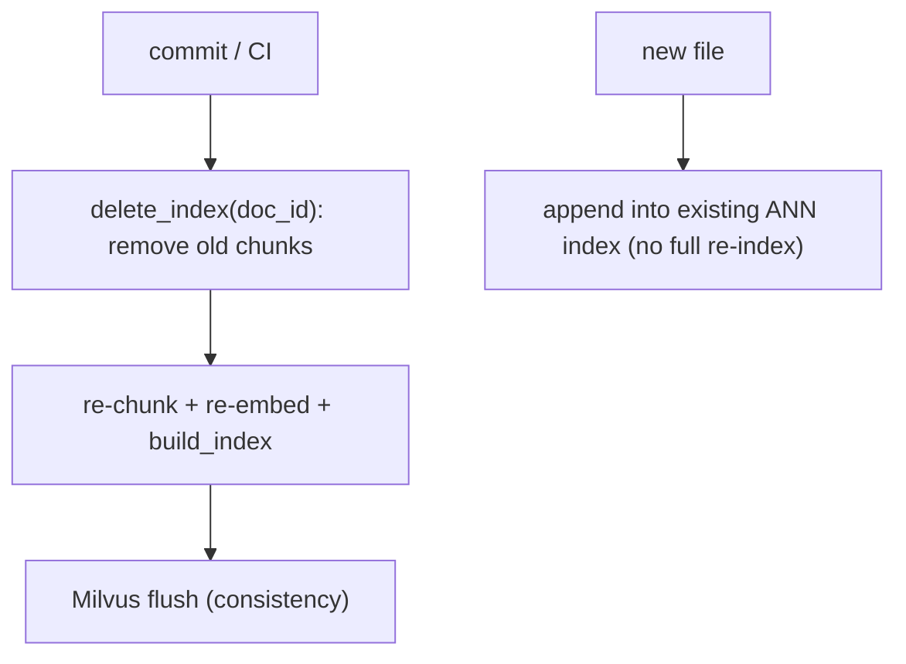

**Anchors:** &bull; `agent-core/openjiuwen/core/retrieval/simple_knowledge_base.py:219` — `update_documents`; `:74` `add_documents` appends &bull; `agent-core/openjiuwen/core/retrieval/indexing/indexer/chroma_indexer.py:198` — `update_index` = delete + build; `:217` delete by `doc_id` &bull; `agent-core/openjiuwen/core/retrieval/indexing/indexer/milvus_indexer.py:209` — delete + flush + rebuild; `:346` `INVERTED` scalar index &bull; `agent-core/openjiuwen/core/retrieval/indexing/processor/chunker/hybrid_chunker.py:19` — structural no-split guard

## 4. Design a multi-tenant RAG system where each customer's data must stay isolated from others

**General:** Isolation choices, strongest first: a separate index/collection (or DB) per tenant; a tenant partition key with mandatory pre-filtering; or row-level security in a relational store. The key is that the tenant filter is applied inside the vector search and cannot be forgotten by a caller. Also isolate embeddings, caches, and logs per tenant, and audit cross-tenant access.

**Jiuwen:** The only separation primitive is the collection name derived from `kb_id` (`kb_{kb_id}_chunks`/`_triples`) plus a configurable `database_name` — this isolates **knowledge bases, not tenants**; if tenants share a `kb_id`, their chunks land in the same collection with no tenant column. The product tracks `user_id` in auth sessions but never propagates it into retrieval. There is no tenant/namespace field on documents, and the retriever drops filters, so per-tenant pre-filtering is not available.

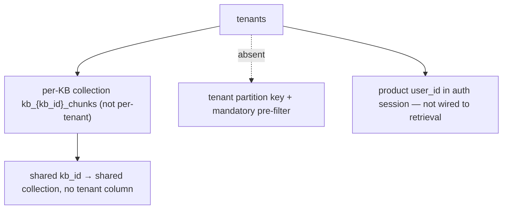

**Anchors:** &bull; `agent-core/openjiuwen/core/retrieval/simple_knowledge_base.py:102` — `kb_{kb_id}_chunks`; `agent-core/openjiuwen/core/retrieval/graph_knowledge_base.py:196` — `kb_{kb_id}_triples` &bull; `agent-core/openjiuwen/core/retrieval/common/config.py:75` — `VectorStoreConfig(database_name, collection_name, …)` &bull; `jiuwenswarm/jiuwenswarm/common/auth/session_store.py:198` — `user_id` in auth session (not retrieval) &bull; `jiuwenswarm/jiuwenswarm/gateway/app_gateway.py:660` — WS `user_id` for routing/sandbox (not KB scoping)

---

# Scale and infrastructure

## 5. How would this architecture change going from 10,000 to 10 million documents

**General:** At small scale a local in-process index is fine. At millions you need a dedicated vector DB with tuned ANN indexes (HNSW/IVF/quantization), sharding/partitioning, replication, batch ingestion, and recall/latency tuning per query. Memory, index build time, and cost become first-class; the interface stays the same but the operational envelope changes.

**Jiuwen:** Scale-out is delegated to the backend: Chroma = local persistent HNSW (small/medium), Milvus = server ANN with AUTO/HNSW/IVF/SCANN and quantization (large), PGVector = pgvector HNSW/IVFFlat (relational). Writes are batched (128) and flushed. It is one collection per KB with one ANN index created once. There is no sharding, partitioning, replica, or multi-collection fan-out.

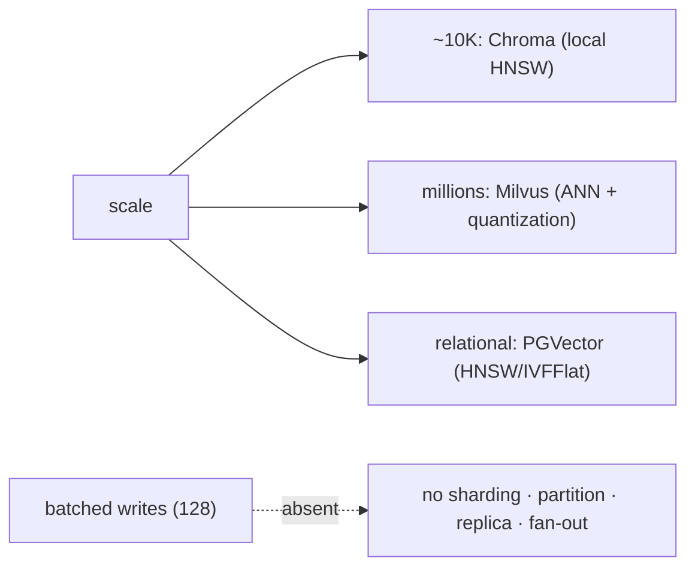

**Anchors:** &bull; `agent-core/openjiuwen/core/retrieval/vector_store/store.py:16` — `create_vector_store`; `agent-core/openjiuwen/core/retrieval/common/config.py:67` — `StoreType` &bull; `agent-core/openjiuwen/core/retrieval/indexing/indexer/milvus_indexer.py:433` — AUTOINDEX/HNSW/IVF/FLAT/SCANN; `:346` scalar indexes &bull; `agent-core/openjiuwen/core/retrieval/vector_store/pg_store.py:203` — HNSW; `agent-core/openjiuwen/core/retrieval/vector_store/chroma_store.py:120` — local HNSW &bull; `agent-core/openjiuwen/core/foundation/store/vector_fields/milvus_fields.py:282` — HNSW defaults; `:100` IVF; `:164` SCANN &bull; `agent-core/openjiuwen/core/retrieval/vector_store/base.py:57` — `add(..., batch_size=128)`

## 6. What database would you choose for the vector store, and why that one over the alternatives

**General:** Choose by scale and features, not familiarity: local/embedded (FAISS/Chroma) for prototypes; a managed vector DB (Pinecone/Milvus/Zilliz) for scale and hybrid search; or pgvector when you already run Postgres and want one datastore, transactions, and metadata joins. Evaluate hybrid support, filtering, operational cost, and lock-in.

**Jiuwen:** Three backends behind one factory: Chroma (local persisted, **vector-only** — sparse/hybrid rejected), Milvus (server, native BM25 + hybrid with RRF), PostgreSQL+pgvector (server, `tsvector` sparse + vector). The KB selects the index type (`hybrid` default). So hybrid/RRF requires Milvus or PG; Chroma is the small/local choice.

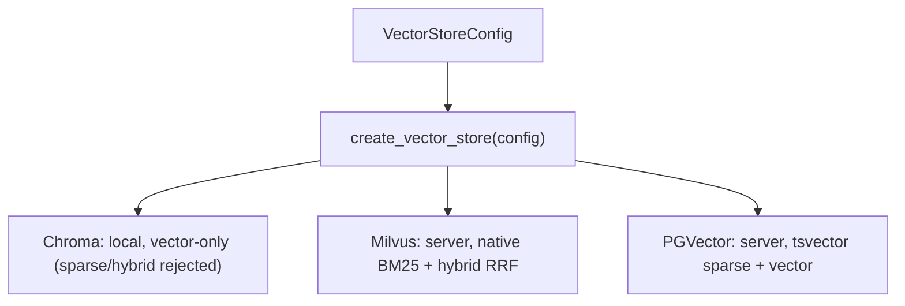

**Anchors:** &bull; `agent-core/openjiuwen/core/retrieval/vector_store/store.py:16` — factory dispatch; `agent-core/openjiuwen/core/retrieval/common/config.py:67` — `StoreType = Milvus | Chroma | PGVector` &bull; `agent-core/openjiuwen/core/retrieval/vector_store/chroma_store.py:120` — `PersistentClient` (local); `agent-core/openjiuwen/core/retrieval/vector_store/milvus_store.py:108` — `MilvusClient(uri=...)` (server); `agent-core/openjiuwen/core/retrieval/vector_store/pg_store.py:108` — `create_async_engine(...)` &bull; `agent-core/openjiuwen/core/retrieval/knowledge_base.py:59` — Chroma rejects sparse/hybrid in local mode &bull; `agent-core/openjiuwen/core/retrieval/common/config.py:32/60` — index types `hybrid`/`bm25`/`vector`

## 7. How do you shard or partition a vector database as it grows

**General:** Options: partition by a key (tenant/category) so queries hit one partition; shard by hash/range across nodes; or replicate + route by collection. Most vector DBs expose partition keys or collections; plan for metadata routing and rebalancing. Sharding trades query fan-out for per-shard size.

**Jiuwen:** **No sharding or hash/range partitioning.** The only partition-like unit is the per-KB collection (`kb_{kb_id}_chunks`/`_triples`) plus the `database_name` field. There are no Milvus partition keys, shard config, or tenant-hash routing.

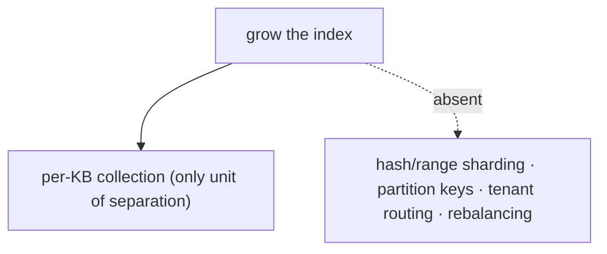

**Anchors:** &bull; `agent-core/openjiuwen/core/retrieval/simple_knowledge_base.py:102` — `kb_{kb_id}_chunks` &bull; `agent-core/openjiuwen/core/retrieval/common/config.py:79` — `database_name` &bull; `agent-core/openjiuwen/core/retrieval/vector_store/milvus_store.py:512` — `delete_table`/drop granularity only

## 8. How would you design the re-indexing pipeline when source documents update frequently

**General:** Event-driven, incremental, idempotent: detect change (mtime/hash/commit), delete the document's chunks by stable ID, re-chunk/re-embed, and insert. Batch and backpressure to the vector DB, make it replayable, and handle deletes (tombstones). Full re-embeds are reserved for model/index changes.

**Jiuwen:** Delete-by-`doc_id` + rebuild per document, identically for Chroma and Milvus (Milvus flushes between delete and rebuild for eventual consistency). New documents append incrementally with a duplicate-`doc_id` guard. There is no partial-chunk diffing or embedding reuse, and a crash between delete and rebuild is not transactional.

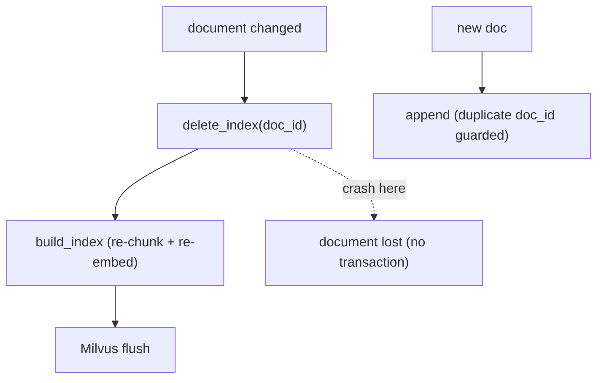

**Anchors:** &bull; `agent-core/openjiuwen/core/retrieval/indexing/indexer/chroma_indexer.py:198` — `update_index` = delete + build; `:142` duplicate guard &bull; `agent-core/openjiuwen/core/retrieval/indexing/indexer/milvus_indexer.py:209` — delete + flush + rebuild &bull; `agent-core/openjiuwen/core/retrieval/simple_knowledge_base.py:219` — `update_documents` chunks then `update_index` per `doc_id`

---

# Latency and cost tradeoffs

## 9. Your system needs sub-500ms responses, walk me through where you'd spend that budget across retrieval, reranking, and generation

**General:** Budget roughly: embedding + vector search tens of ms, rerank tens–low-hundreds of ms, generation the rest (and generation dominates when you stream, because TTFT is what the user perceives). To hit 500ms: stream tokens, cache embeddings/results, keep top-k small, rerank only when it pays, route to a fast model, and parallelize independent steps. Measure TTFT, not total.

**Jiuwen:** Provides streaming (ReAct → session → WebSocket frames) with per-call `ttft_ms`, parallel tool execution with resource lanes, KV/prefix cache affinity, a model backup/failover rail, and IntelliRouter for deployment selection. Reranking is **optional and absent from the default KB path** (graph store only), so the rerank budget is not spent unless wired. There is no latency/SLA-based routing or result cache.

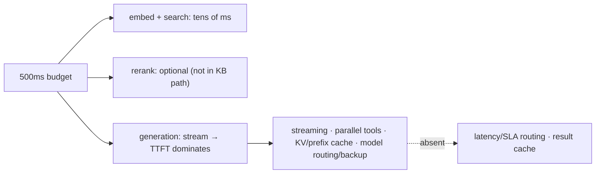

**Anchors:** &bull; `agent-core/openjiuwen/core/single_agent/agents/react_agent.py:336` — `parallel_tool_calls`; `:1758` `ttft_ms`; `:2938` `stream` &bull; `agent-core/openjiuwen/core/single_agent/ability_manager.py:431/467` — parallel batches + `parallel_safe` lanes &bull; `agent-core/openjiuwen/core/single_agent/rail/model_backup.py:9` — `ModelBackupRail.on_model_exception` failover &bull; `jiuwenswarm/jiuwenswarm/server/runtime/session/kv_cache/kv_cache_model_provider.py:80` — KV/prefix affinity &bull; `agent-core/openjiuwen/core/retrieval/simple_knowledge_base.py:182` — KB path calls no reranker

## 10. How would you reduce cost for a high-volume RAG system without degrading answer quality

**General:** Cut the dominant (input-token/generation) cost: rerank a larger candidate set down to a smaller k, cache (exact and semantic), route easy queries to smaller models, shorten prompts (fewer examples, tighter context), summarize long chunks, and cap the agent's iterations. Prefer quality-preserving levers (rerank+tighten, cache, route) over blind k reduction.

**Jiuwen:** The product tracks provider-reported session cost and enforces a per-session cap; core caps repetition via `max_iterations`, team `BudgetLedger`, and anomaly/dedup rails; conversation compaction reduces context tokens. But embedding cost is never tracked, there is no semantic/response cache, no rerank-to-K lever in the KB, and no query-difficulty/cost-aware model routing.

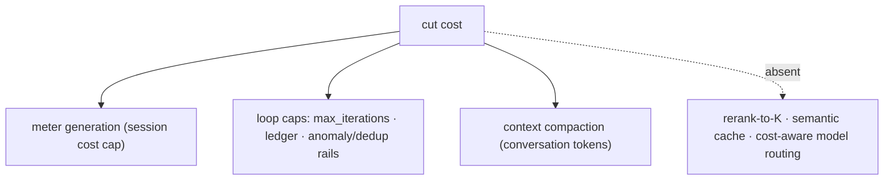

**Anchors:** &bull; `jiuwenswarm/jiuwenswarm/server/runtime/usage_cost.py:171/196` — session cost cap &bull; `agent-core/openjiuwen/core/single_agent/agents/react_agent.py:288` — `max_iterations`; `agent-core/openjiuwen/harness/schema/config.py:252` — harness default &bull; `agent-core/openjiuwen/agent_teams/workflow/engine/budget.py:27` — `BudgetLedger` &bull; `agent-core/openjiuwen/core/context_engine/processor/compressor/full_compact_processor.py:184` — 180k compaction &bull; `agent-core/openjiuwen/agent_teams/models/allocator.py:559` — availability routing (not cost/quality)

## 11. Would you rerank every query, or only some, and how do you decide

**General:** Rerank only when it improves the top-k enough to justify its latency: for high-stakes or ambiguous queries where first-stage precision is low, and when the candidate count is bounded. Skip it for exact-match lookups, high-volume cheap queries, or when latency dominates. Measure NDCG/precision with and without rerank on a labeled set to decide, and cache.

**Jiuwen:** Reranking is **optional and not part of the default KB path** — the `Reranker` classes exist (`StandardReranker`, `ChatReranker`, `DashscopeReranker`) but only the graph store / graph memory call `rerank`, gated by `config_e.rerank`. So the codebase effectively never reranks default RAG queries; there is no per-query rerank policy and no metric-driven decision (only the demo score-delta script).

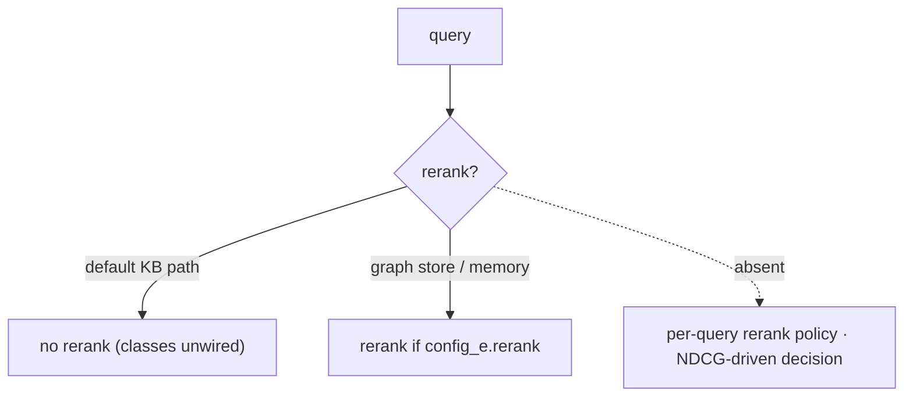

**Anchors:** &bull; `agent-core/openjiuwen/core/retrieval/simple_knowledge_base.py:182` — KB retrieve has no reranker &bull; `agent-core/openjiuwen/core/foundation/store/graph/milvus/milvus_support.py:87` — `rerank` in graph store &bull; `agent-core/openjiuwen/core/memory/graph/graph_memory/base.py:645` — `config_e.rerank` gate &bull; `agent-core/openjiuwen/core/retrieval/reranker/standard_reranker.py:23` — `StandardReranker` (`/rerank`) &bull; `agent-core/examples/store/showcase_milvus_graph_store.py:51` — before/after rerank demo (no labels)

## 12. How do you decide between a hosted vector database and a self-managed one at scale

**General:** Hosted (Pinecone/Zilliz Cloud): less ops, elastic scaling, predictable latency, but cost scales with data/queries and there is vendor lock-in. Self-managed (Milvus/Qdrant/pgvector): control, cost at steady state, data residency, but you own scaling, backups, upgrades, and on-call. Decide by team ops capacity, data sensitivity, query volume, and elasticity needs — not by the library API.

**Jiuwen:** `create_vector_store` dispatches Chroma (local/embedded), Milvus (server, fits hosted or self-managed), and PostgreSQL+pgvector (self-managed relational). The choice is pure config; there is no autoscaling, managed-service integration, or ops tooling in-repo. Chroma local cannot do hybrid, so production hybrid means Milvus or PG.

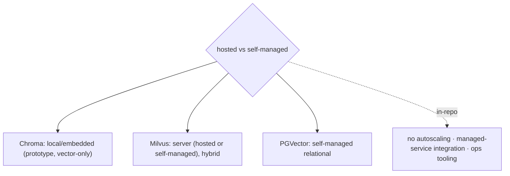

**Anchors:** &bull; `agent-core/openjiuwen/core/retrieval/vector_store/store.py:16` — factory &bull; `agent-core/openjiuwen/core/retrieval/vector_store/chroma_store.py:120` — local; `agent-core/openjiuwen/core/retrieval/vector_store/milvus_store.py:108` — server; `agent-core/openjiuwen/core/retrieval/vector_store/pg_store.py:108` — relational &bull; `agent-core/openjiuwen/core/retrieval/knowledge_base.py:59` — Chroma rejects hybrid &bull; `agent-core/openjiuwen/core/retrieval/common/config.py:67` — `StoreType`

---

# Data freshness and consistency

## 13. How do you handle a document being updated or deleted after it's already been embedded and indexed

**General:** Stable document ID + delete-by-ID, then re-insert (updates are delete+insert). Derive chunk IDs from the document ID so all chunks are found and removed together; make it idempotent and ideally transactional. Handle eventual consistency in the vector store with a flush or read-your-writes check.

**Jiuwen:** Delete-by-`doc_id` + rebuild. Chroma/Milvus indexers scan a doc's chunk IDs, delete them, then re-chunk/re-embed/write (Milvus flushes between). PG is the only store with native upsert-by-primary-key (`INSERT ... ON CONFLICT DO UPDATE`), but no PG indexer wraps it. There is no transactional replace — a crash between delete and rebuild loses the document.

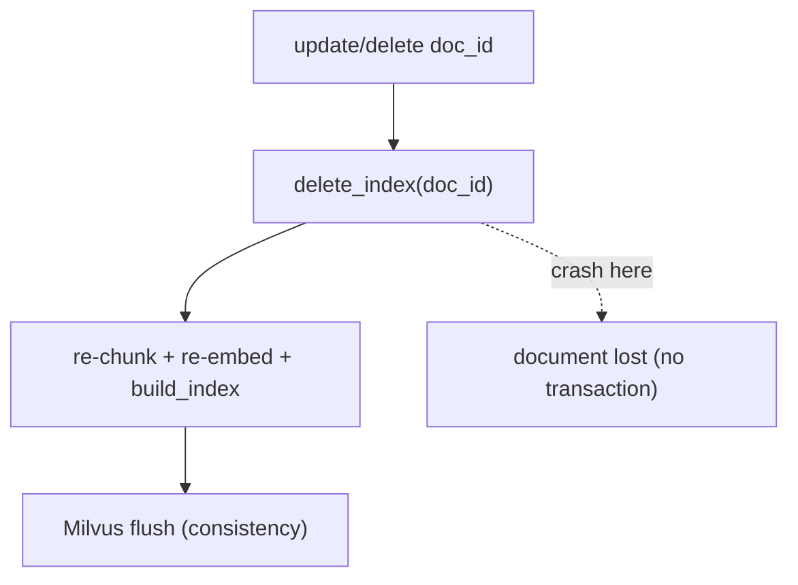

**Anchors:** &bull; `agent-core/openjiuwen/core/retrieval/simple_knowledge_base.py:192/219` — `delete_documents`/`update_documents` &bull; `agent-core/openjiuwen/core/retrieval/indexing/indexer/chroma_indexer.py:198/217` — update = delete + build; `agent-core/openjiuwen/core/retrieval/indexing/indexer/milvus_indexer.py:209/231` — delete + flush + rebuild &bull; `agent-core/openjiuwen/core/retrieval/vector_store/pg_store.py:300` — `INSERT ... ON CONFLICT DO UPDATE` (no PG indexer)

## 14. How would you design the system so users never get an answer based on stale, outdated information

**General:** Attach timestamps/versions to documents, prefer recency in ranking (or hard-filter to a freshness window), tombstone superseded versions, and surface recency to the generator. Propagate deletes promptly from the source (event-driven) so the index matches source-of-truth, and reconcile periodically.

**Jiuwen:** The retrieval layer has **no notion of document time**: `RetrievalResult`/`TextChunk` carry only text/score/metadata, parsers populate no timestamp, and ranking is score/rank only (RRF, max-score) — no recency boost or outdated filter. Conflict handling is memory-write-only (`MemUpdateChecker`, newest wins); a freshness/time-decay notion exists only for experience records.

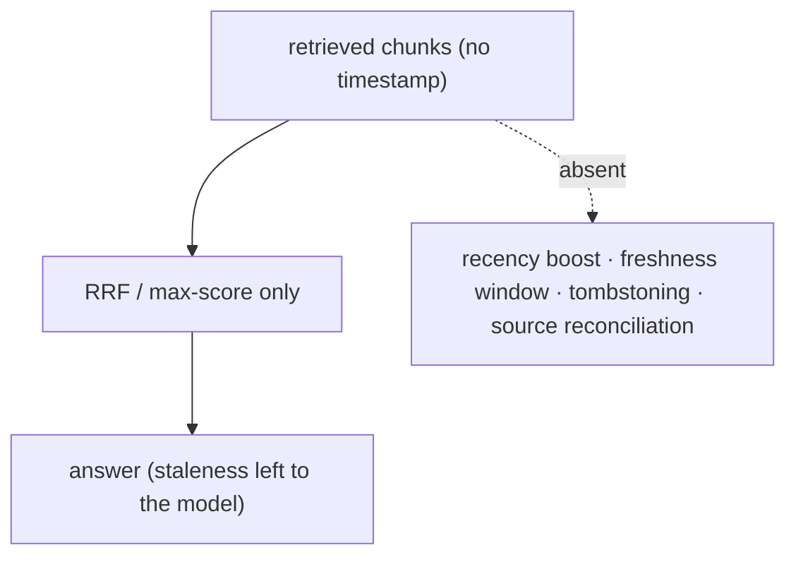

**Anchors:** &bull; `agent-core/openjiuwen/core/retrieval/common/retrieval_result.py:23` — no timestamp field; `agent-core/openjiuwen/core/retrieval/common/document.py:30` — `TextChunk` &bull; `agent-core/openjiuwen/core/retrieval/utils/fusion.py:39` — RRF by text/rank; `agent-core/openjiuwen/core/retrieval/simple_knowledge_base.py:313` — max-score merge &bull; `agent-core/openjiuwen/core/memory/manage/update/mem_update_checker.py:22/252` — memory-only conflict (newest wins) &bull; `agent-core/openjiuwen/agent_evolving/experience/scorer.py:219` — `calc_freshness` (experiences only)

## 15. What's your strategy for handling documents in multiple formats, PDFs, spreadsheets, scanned images, in the same pipeline

**General:** Normalize at ingestion with a parser per format behind a registry, preserving structure as metadata (sheet/row, heading path, page, image path). For scanned images, run OCR (or a VLM) to get text before chunking; for images, caption and/or use a multimodal embedding. Keep a uniform record so chunking/indexing is format-agnostic.

**Jiuwen:** A parser registry dispatches by extension and stamps uniform metadata. Images are handled by **VLM captioning** plus optional **multimodal embedding** (`embed_multimodal` unless `use_caption_for_images=True`); PDFs extract text via pdfplumber and caption embedded images. But **true OCR is not integrated** into indexing: a scanned PDF with no text layer yields no text, and OCR exists only as an agent tool (`ImageOCRTool`) or an external `local-doc-ocr` (RapidOCR) skill.

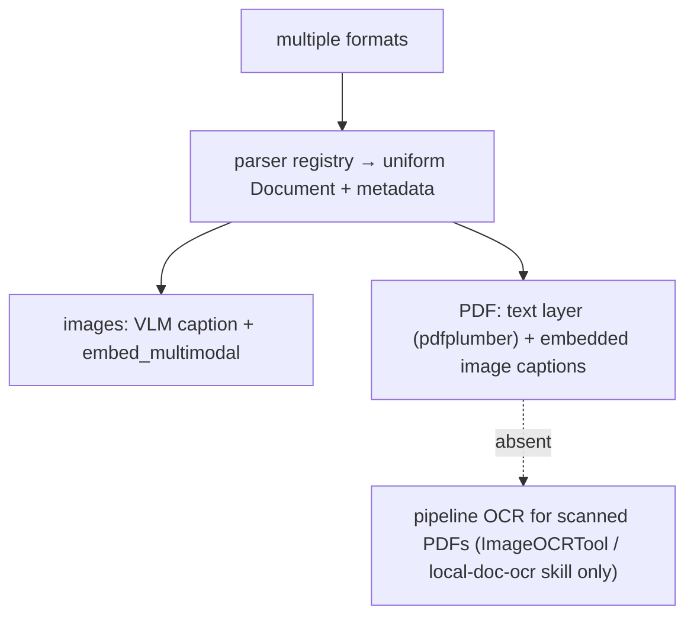

**Anchors:** &bull; `agent-core/openjiuwen/core/retrieval/indexing/processor/parser/auto_file_parser.py:21/109/123` — registry, dispatch, uniform metadata &bull; `agent-core/openjiuwen/core/retrieval/indexing/processor/parser/pdf_parser.py:78` — pdfplumber text + image captions; `agent-core/openjiuwen/core/retrieval/indexing/processor/parser/image_parser.py:27` — image caption + `image_path` &bull; `agent-core/openjiuwen/core/retrieval/indexing/processor/parser/captioner.py:30/81` — VLM captioner &bull; `agent-core/openjiuwen/core/retrieval/indexing/indexer/embed_chunks.py:40` — `embed_multimodal`; `agent-core/openjiuwen/core/retrieval/embedding/dashscope_embedding.py:199` — `embed_multimodal` &bull; `agent-core/openjiuwen/harness/tools/multimodal/vision.py:182` — `ImageOCRTool`

---

# Reliability and failure handling

## 16. What happens to the user experience if the vector database is down, what's your fallback

**General:** Decide the degradation: fail fast with a clear message, serve cached results, fall back to a secondary index (sparse/BM25 or a replica), or disable retrieval and answer from parametric knowledge with a caveat. Add a circuit breaker, health checks, and timeouts so one dependency cannot hang the request. Replicate the index so a single node is not a SPOF.

**Jiuwen:** There is **no availability fallback** for a down vector DB. Dense `search()` does not catch exceptions — a store failure propagates through the retriever and fails the workflow node. Sparse searches silently return `[]` on error, Milvus hybrid has a same-DB split-search fallback, and `retrieve_multi_kb` swallows per-KB errors (empty list), which contains blast radius across KBs. There is no circuit breaker, health probe, or result cache.

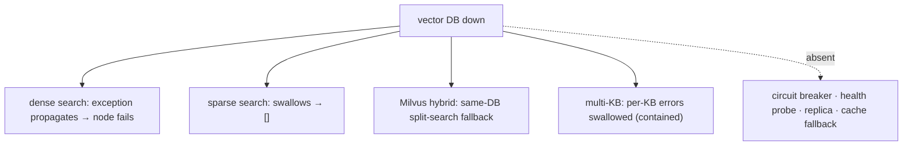

**Anchors:** &bull; `agent-core/openjiuwen/core/retrieval/vector_store/milvus_store.py:357` — `hybrid_search` → `_hybrid_search_fallback`; `:284` `sparse_search` returns `[]`; `:519` `_ensure_loaded` timeouts &bull; `agent-core/openjiuwen/core/retrieval/vector_store/chroma_store.py:326` — sparse/text returns `[]` on error &bull; `agent-core/openjiuwen/core/retrieval/simple_knowledge_base.py:300` — `retrieve_multi_kb` swallows per-KB errors &bull; `agent-core/openjiuwen/core/workflow/components/resource/knowledge_retrieval_comp.py:114` — re-raises `build_error`

## 17. How do you design for the case where retrieval returns zero relevant documents

**General:** Detect it (score threshold or answerability) and abstain: return "I don't have enough information" or ask a clarifying question, rather than answering from noise. Optionally fall back to a broader retrieval (sparse), a knowledge-graph hop, or parametric knowledge with a caveat. Log zero-result queries — they signal coverage gaps.

**Jiuwen:** The KB path implements **dense-empty → sparse** fallback, but has **no abstention**: when both are empty it returns `[]` and the workflow component concatenates an empty context with no "no answer" signal. Explicit abstention (`is_abstain`, `abstain_no_backfill`) exists only in the separate Symphony progressive-retrieval engine, not in `core/retrieval` KB retrieval. `score_threshold` defaults to `None`.

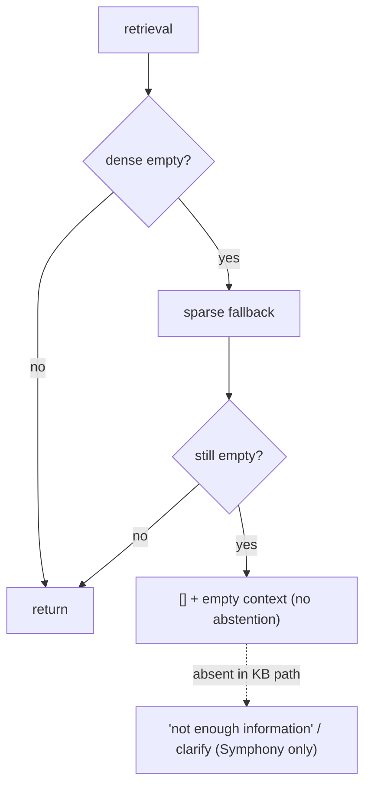

**Anchors:** &bull; `agent-core/openjiuwen/core/retrieval/retriever/vector_retriever.py:83` — dense-empty → sparse; `agent-core/openjiuwen/core/retrieval/retriever/hybrid_retriever.py:97` — same &bull; `agent-core/openjiuwen/core/workflow/components/resource/knowledge_retrieval_comp.py:241` — empty results → empty context &bull; `agent-core/openjiuwen/core/retrieval/common/config.py:47` — `score_threshold` defaults `None` &bull; `agent-core/openjiuwen/symphony/retrieval/search/runtime/selector.py:250/305` — `is_abstain`; `agent-core/openjiuwen/symphony/retrieval/search/runtime/engine.py:94`; `agent-core/openjiuwen/symphony/retrieval/search/runtime/progressive.py:1060` — `abstain_no_backfill`

## 18. How would you monitor this system in production to catch a quality drop before users complain

**General:** Monitor both operations (latency, error rate, saturation, cost) and **quality** (retrieval hit rate, faithfulness, answer relevance, refusal rate), sampled from live traffic and scored offline or by a judge; alert on metric regressions and slice by query type/tenant. Keep a golden set and replay it; capture user feedback. Distinguish error monitoring from quality monitoring — they catch different failures.

**Jiuwen:** Production observability is span/trajectory-based: OTel spans with error status (`has_error`), per-session lossless trajectory store, usage/cost facts, and streaming frames. That is error/latency/trajectory monitoring. There are **no quality metrics, drift detection, or quality alerts**, and no OTel metric instruments; offline evaluation exists in RSI/`agent_evolving` but is not an online quality monitor.

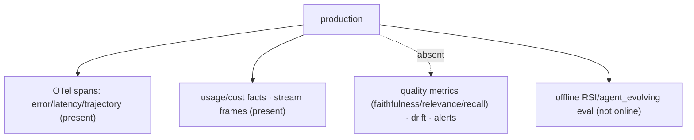

**Anchors:** &bull; `agent-core/openjiuwen/harness/observability/run_span.py:289` — error status recorded; `agent-core/openjiuwen/harness/observability/setup.py:54` — OTel lifecycle &bull; `jiuwenswarm/jiuwenswarm/observability/store.py:102` — `has_error`; `:137` `trajectory_current_records` &bull; `jiuwenswarm/jiuwenswarm/observability/models.py:375` — `CommittedTraceUpdate`/usage watermarks &bull; `agent-core/openjiuwen/extensions/observability/span_record_processor.py:106` — span record handling

---

# Security and access control

## 19. How do you make sure a user only retrieves documents they're actually authorized to see

**General:** Enforce authorization inside retrieval: every chunk carries ACL metadata (owner/group/tenant), and the query includes a mandatory filter derived from the caller's identity, applied by the vector store (pre-filter), never post-hoc. Prefer the strongest isolation you can afford (per-tenant index/collection), use row-level security where available, and audit.

**Jiuwen:** The store layer supports metadata filters (Milvus expr, Chroma `where`, PG JSONB) and there is a permission engine and audit logging. But `RetrievalConfig.filters` is **dropped at the retriever boundary** (concrete retrievers hardcode `filters=None`; the abstract `Retriever.retrieve` has no `filters` param), and documents/chunks have **no ACL field**. So permission-aware retrieval is not reachable through the KB path; the permission engine guards tool/file/net execution, not retrieval.

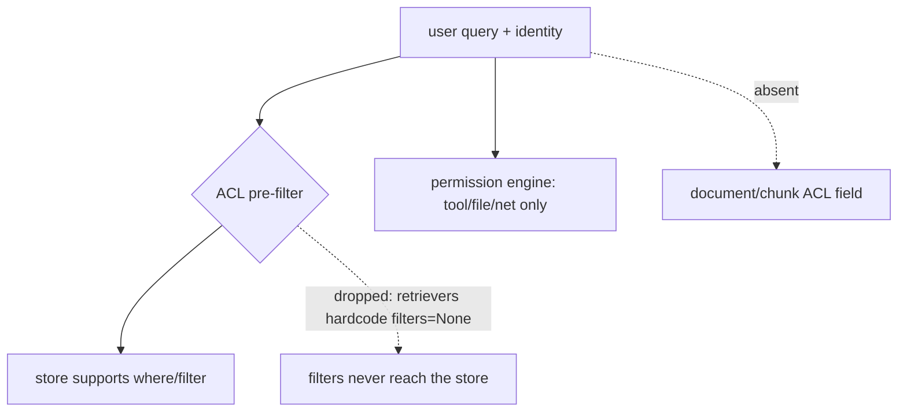

**Anchors:** &bull; `agent-core/openjiuwen/core/retrieval/common/config.py:53` — `RetrievalConfig.filters`; `agent-core/openjiuwen/core/retrieval/retriever/base.py:19` — no `filters` param; `agent-core/openjiuwen/core/retrieval/simple_knowledge_base.py:186` — KB passes it; `agent-core/openjiuwen/core/retrieval/retriever/vector_retriever.py:88`/`agent-core/openjiuwen/core/retrieval/retriever/hybrid_retriever.py:81` — `filters=None` &bull; `agent-core/openjiuwen/core/retrieval/vector_store/milvus_store.py:215`, `agent-core/openjiuwen/core/retrieval/vector_store/chroma_store.py:265`, `agent-core/openjiuwen/core/retrieval/vector_store/pg_store.py:332` — store-level filters &bull; `agent-core/openjiuwen/harness/security/permission_engine/core.py:272` — `check_permission` (tool/file/net) &bull; `agent-core/openjiuwen/core/retrieval/common/document.py:30` — no ACL field on `TextChunk`

## 20. How would you prevent one tenant's data from leaking into another tenant's retrieved context in a shared system

**General:** Apply the tenant filter at every layer: a mandatory tenant key in the vector search, tenant-scoped caches, tenant-partitioned indexes/collections, and prompts that cannot blend tenants' retrieved chunks. Never rely on the model to filter; enforce at the datastore. Audit and red-team cross-tenant queries.

**Jiuwen:** There is **no tenant isolation in retrieval**. The only separation is the per-KB collection (`kb_{kb_id}_chunks`/`_triples`) plus `database_name`; if two tenants share a `kb_id` they share a collection with no tenant column, and since filters are dropped there is no per-tenant pre-filter. The product has `user_id` in auth sessions but does not propagate it into retrieval, and no tenant namespace exists on documents.

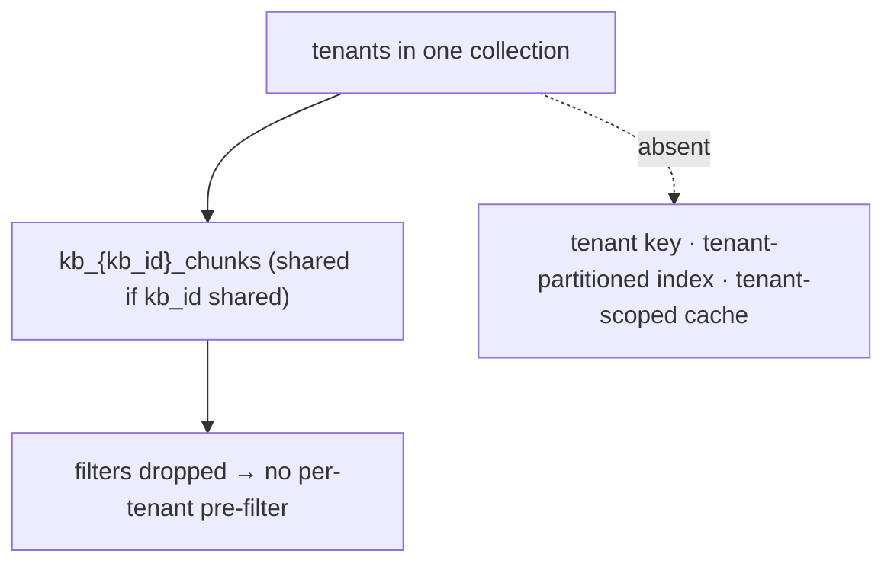

**Anchors:** &bull; `agent-core/openjiuwen/core/retrieval/simple_knowledge_base.py:102` — `kb_{kb_id}_chunks`; `agent-core/openjiuwen/core/retrieval/graph_knowledge_base.py:196` — `_triples` &bull; `agent-core/openjiuwen/core/retrieval/common/config.py:75/79` — `VectorStoreConfig`/`database_name` &bull; `agent-core/openjiuwen/core/retrieval/retriever/vector_retriever.py:88` — `filters=None` (no tenant pre-filter) &bull; `jiuwenswarm/jiuwenswarm/common/auth/session_store.py:198` — `user_id` not wired to retrieval &bull; `jiuwenswarm/jiuwenswarm/gateway/app_gateway.py:660` — `user_id` for routing/sandbox only

---

## Summary: strong vs weak in Jiuwen

| Area | Strength | Notes |
|---|---|---|
| End-to-end RAG assembly | Mixed | real ingest/retrieve components; no packaged RAG agent |
| Permission-aware / ACL retrieval | Weak | `filters` dropped at retriever; no document ACL |
| Multi-tenant isolation | Weak | per-KB collection only; no tenant key/namespace |
| Vector DB choice | Strong | Chroma (local) / Milvus (server) / PGVector behind one factory |
| Sharding / partitioning | Weak | per-KB collection only; no shard/partition keys |
| Re-indexing on change | Mixed | delete-by-id + append; not transactional; no diffing |
| Scale (10x–1000x) | Mixed | backend ANN tuning; no sharding/autoscaling |
| Latency levers | Strong | streaming + TTFT, parallel tools, KV/prefix cache, model failover |
| Cost control | Mixed | session cost cap + loop caps; no rerank-to-K, semantic cache, or cost routing |
| Rerank policy | Weak | rerankers unwired from default KB path; no per-query policy |
| Hosted vs self-managed DB | Mixed | config-level choice; no managed-service/ops tooling |
| Update/delete correctness | Mixed | delete+rebuild; not atomic |
| Freshness / anti-stale | Weak | no document timestamps; recency absent |
| Multi-format pipeline | Strong | parser registry + image captioning + multimodal embedding |
| OCR / scanned docs | Weak | no pipeline OCR; VLM caption + external OCR skill only |
| Vector DB down fallback | Weak | no circuit breaker/replica/cache; sparse swallows errors |
| Zero-result handling | Weak | dense-empty→sparse; no abstention in KB path |
| Production quality monitoring | Weak | error/latency/trajectory only; no quality metrics/alerts |
| Zero-result / "no answer" | Weak | no abstention signal in KB path |
