# AI Engineer interview — four rounds, reported verbatim

Real interview questions from a four-round AI Engineer hiring process (reported 2025). Rounds in order: coding + ML fundamentals, deep learning + transformers, LLMs + RAG, agents + system design. The set spans implementation coding (gradient descent, cosine similarity, KNN), model internals (backprop, normalization, attention), RAG pipelines, and production system design.

> **The pattern worth noticing:** the interview deliberately separated "can you use a framework" from "do you understand what the framework is hiding." Rounds 1–2 are entirely framework-free. Rounds 3–4 assume you know the answer to Rounds 1–2 and add operational judgment on top. That structure — mechanics first, judgment second — is the clearest signal of a well-calibrated AI engineering screen.

---

# Round 1: Coding + ML Fundamentals

## 1. Implement gradient descent from scratch given a loss function

**General:** Gradient descent iteratively moves parameters in the direction that decreases the loss. The loop is: (1) compute the loss from current parameters, (2) compute the gradient of the loss with respect to each parameter (analytically or numerically), (3) subtract `learning_rate × gradient` from each parameter, repeat. Stochastic gradient descent (SGD) does this on one sample or a mini-batch rather than the full dataset; the gradient is noisier but the update is much cheaper and often generalises better.

```python
def gradient_descent(loss_fn, grad_fn, params, lr=0.01, steps=100):
    for _ in range(steps):
        grads = grad_fn(params)
        params = [p - lr * g for p, g in zip(params, grads)]
    return params
```

The minimal viable implementation requires only the gradient of the loss (which can be computed by finite differences `(f(x+ε) - f(x)) / ε` if you cannot derive it analytically).

**Jiuwen:** Not implemented in the inference framework. The RL training subsystem under `agent-core/openjiuwen/agent_evolving/agent_rl/` runs SFT and PPO/GRPO via veRL, which manages its own optimisation loop using PyTorch `Optimizer.step()` internally. There is no hand-written gradient-descent loop in the codebase; the framework calls into veRL/PyTorch for all weight updates.

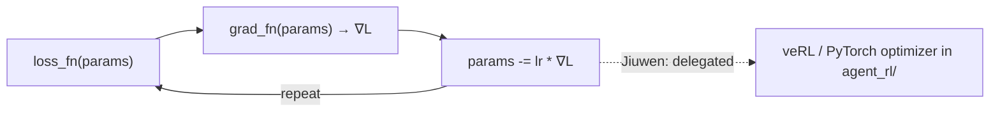

<sub>**Anchors:**<br>&bull; `agent-core/openjiuwen/agent_evolving/agent_rl/` — SFT + PPO/GRPO training subsystem; optimiser loop managed by veRL<br>&bull; `agent-core/openjiuwen/core/foundation/llm/model_clients/` — inference path; no gradient code</sub>

**Gap.** Absent from the inference layer. Present as a delegated call to veRL in the training subsystem.

---

## 2. Compute cosine similarity between two vectors without using a library

**General:** Cosine similarity = `dot(A, B) / (|A| × |B|)`. The dot product measures shared direction; dividing by the product of magnitudes normalises to `[-1, 1]`, making it length-independent. In retrieval contexts, if you pre-normalise all vectors to unit length, cosine similarity reduces to a dot product, which is cheaper to compute at scale.

```python
import math

def cosine_similarity(a: list[float], b: list[float]) -> float:
    dot   = sum(x * y for x, y in zip(a, b))
    mag_a = math.sqrt(sum(x ** 2 for x in a))
    mag_b = math.sqrt(sum(x ** 2 for x in b))
    if mag_a == 0 or mag_b == 0:
        return 0.0
    return dot / (mag_a * mag_b)
```

Edge cases: zero vectors, dimension mismatch, floating-point underflow on very small magnitudes.

**Jiuwen:** Not hand-coded. Vector similarity queries go through the vector store (Milvus, Chroma, or similar), which computes cosine/IP/L2 internally. The `IndexConfig` accepts a `metric_type` parameter; there is no custom dot-product or magnitude code in the framework.

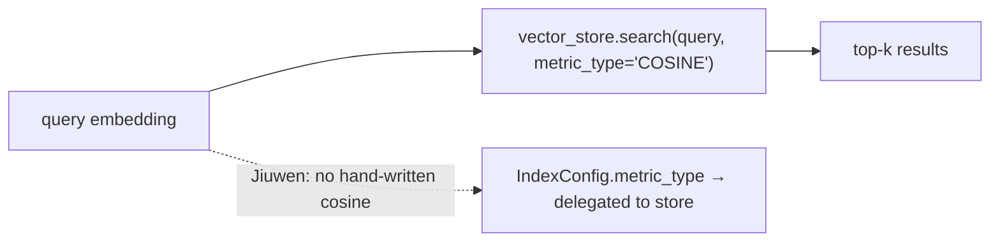

<sub>**Anchors:**<br>&bull; `agent-core/openjiuwen/extensions/knowledge_base/schema/index_config.py` — `IndexConfig` with `metric_type`<br>&bull; `agent-core/openjiuwen/extensions/knowledge_base/vector_store/` — search delegated to backing store</sub>

**Gap.** No hand-written similarity code. Metric is a configuration parameter forwarded to the vector store.

---

## 3. Given a confusion matrix, calculate precision, recall, F1 manually

**General:** For a binary classifier with a confusion matrix `[[TN, FP], [FN, TP]]`:

- Precision = TP / (TP + FP) — of what you predicted positive, how many were actually positive
- Recall (sensitivity) = TP / (TP + FN) — of all actual positives, how many did you catch
- F1 = 2 × (Precision × Recall) / (Precision + Recall) — harmonic mean, penalises imbalance between precision and recall

```python
def prf1(tp, fp, fn):
    precision = tp / (tp + fp) if (tp + fp) else 0.0
    recall    = tp / (tp + fn) if (tp + fn) else 0.0
    f1 = (2 * precision * recall / (precision + recall)
          if (precision + recall) else 0.0)
    return precision, recall, f1
```

For multi-class: compute per-class TP/FP/FN from rows/columns of the matrix, then macro-average or weight by support.

**Jiuwen:** The evaluation module (`agent-core/openjiuwen/agent_evolving/eval/`) computes precision, recall, and F1 for retrieval evaluation (document-level). The framework does not hand-implement the confusion-matrix arithmetic; it uses standard library helpers. For generation evaluation, `FaithfulnessEvaluator` and `AnswerRelevanceEvaluator` produce scores, not classification metrics.

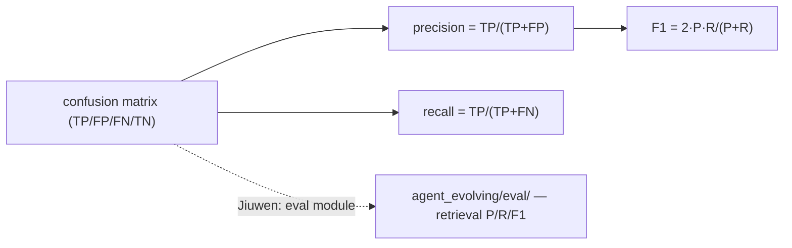

<sub>**Anchors:**<br>&bull; `agent-core/openjiuwen/agent_evolving/eval/` — evaluation framework; retrieval-level precision/recall/F1<br>&bull; `agent-core/openjiuwen/extensions/knowledge_base/retrieval/` — retrieval pipeline feeding eval</sub>

**Gap.** Retrieval-level P/R/F1 present. No hand-written confusion-matrix class; computation is library-delegated.

---

## 4. Implement k-nearest neighbors from scratch (no sklearn)

**General:** KNN at inference time: store all training points, then for a new query: (1) compute distance from the query to every training point, (2) sort by distance, (3) take the k smallest, (4) return the majority class (classification) or mean (regression).

```python
from collections import Counter

def knn_predict(train_X, train_y, query, k=3):
    distances = [
        (sum((a - b) ** 2 for a, b in zip(query, x)) ** 0.5, y)
        for x, y in zip(train_X, train_y)
    ]
    distances.sort(key=lambda d: d[0])
    neighbors = [y for _, y in distances[:k]]
    return Counter(neighbors).most_common(1)[0][0]
```

Key tradeoffs: KNN is lazy (no training, all cost at inference), O(n·d) per query without indexing, sensitive to feature scale and irrelevant dimensions. ANN indexes (HNSW, IVF) replicate the nearest-neighbour idea at scale.

**Jiuwen:** Not implemented as a classifier. The retrieval layer is effectively an approximate KNN over embedding space — `VectorRetriever` performs top-k search via the vector store's ANN index. The KNN concept is directly instantiated by the embedding retrieval pipeline.

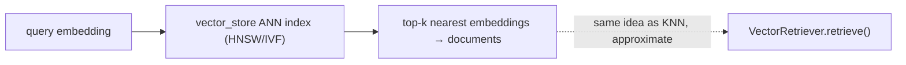

<sub>**Anchors:**<br>&bull; `agent-core/openjiuwen/extensions/knowledge_base/retrieval/vector_retriever.py` — `VectorRetriever`; top-k ANN search<br>&bull; `agent-core/openjiuwen/extensions/knowledge_base/vector_store/` — backing ANN index</sub>

**Gap.** No KNN classifier. The retrieval layer is the conceptual equivalent (approximate top-k over embedding space).

---

# Round 2: Deep Learning + Transformers

## 5. Explain forward pass and backpropagation in a neural network

**General:** The forward pass flows inputs through layers, applying learned weights and non-linearities, to produce a prediction and a scalar loss. Backpropagation then applies the chain rule backwards through every layer: the gradient of the loss with respect to each weight is `∂L/∂w = ∂L/∂output × ∂output/∂w`. PyTorch's autograd engine records the computation graph during the forward pass and traverses it in reverse during `.backward()`, accumulating `w.grad`. The weight update then uses those gradients.

**Jiuwen:** Not implemented in the inference framework. For the training subsystem, `agent-core/openjiuwen/agent_evolving/agent_rl/` calls veRL's SFT and PPO/GRPO loops, which use PyTorch's standard autograd. There is no hand-written backward pass anywhere.

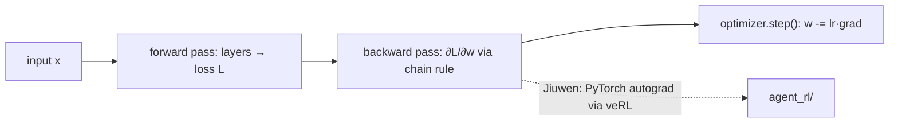

<sub>**Anchors:**<br>&bull; `agent-core/openjiuwen/agent_evolving/agent_rl/` — training; autograd delegated to veRL/PyTorch</sub>

**Gap.** Absent from inference layer. Present as a delegated PyTorch call in training.

---

## 6. What is vanishing/exploding gradient, and how do you fix it?

**General:** In deep networks, gradients are products of many Jacobians chained together. If those Jacobians have eigenvalues consistently below 1, gradients shrink exponentially toward early layers (vanishing) — making early weights stop learning. If eigenvalues are consistently above 1, gradients grow exponentially (exploding) — causing numerical instability or NaN weights.

Fixes:
- **Vanishing:** ReLU activations (no saturation in the positive range), residual connections (skip connections add an identity gradient path), batch/layer norm, careful weight initialisation (He/Xavier)
- **Exploding:** Gradient clipping (`torch.nn.utils.clip_grad_norm_`), careful learning rate, the same normalisation layers

Transformers largely avoid these problems through residual connections and layer norm at every block.

**Jiuwen:** Not implemented in the inference framework. In `agent_rl/`, gradient clipping is a veRL/PyTorch training hyperparameter. The inference framework calls hosted models that handle all of this internally.

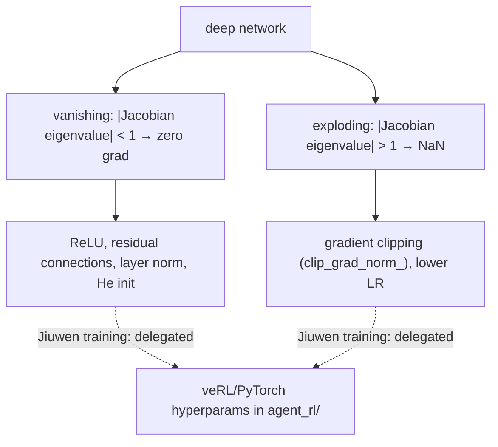

<sub>**Anchors:**<br>&bull; `agent-core/openjiuwen/agent_evolving/agent_rl/` — training hyperparams including clip settings, delegated to veRL</sub>

**Gap.** Absent from inference layer. A config concern in training.

---

## 7. Batch norm vs layer norm: where is each used?

**General:** Batch normalisation normalises across the batch dimension (mean and variance computed over all examples in a batch, per feature). It requires a reasonable batch size to produce stable statistics and is effective in CNNs and feedforward networks where batch statistics are consistent. It struggles with small batches, variable-length sequences, and inference with batch size 1.

Layer normalisation normalises across the feature dimension (mean and variance computed over all features for a single example). It is independent of batch size and sequence length, making it the standard in Transformer architectures and RNNs. Every Transformer block uses layer norm, applied before or after the attention and FFN sub-layers.

Rule of thumb: CNNs → batch norm. Transformers, RNNs, LLMs → layer norm. Small batch or variable-length? Always layer norm.

**Jiuwen:** Not implemented. The framework calls hosted models that apply these internally. No `BatchNorm` or `LayerNorm` code exists in the inference layer. The HuggingFace `AutoModelForCausalLM` load implicitly uses whatever norm the model architecture specifies.

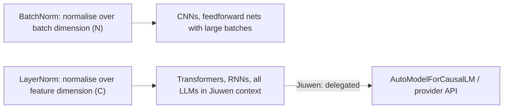

<sub>**Anchors:**<br>&bull; `agent-core/openjiuwen/symphony/retrieval/llm/transformers_prefix_cached_generation/client.py:175` — `AutoModelForCausalLM.from_pretrained`; norm choice delegated to model architecture</sub>

**Gap.** Absent. Delegated entirely to model internals.

---

## 8. Walk through the attention mechanism in a Transformer, step by step

*Already covered as entry 01-1 in the compiled knowledge base. See `knowledge/01-llm-foundations.md`.*

**General:** Each token is projected into Q, K, V vectors. Scores = `Q·Kᵀ / √d_k`. Softmax over scores gives attention weights. Output = weighted sum of V. Repeat per head, concat, project. See full answer in entry 01-1.

---

## 9. Why multi-head attention instead of a single head?

**General:** A single attention head learns one type of relationship — for example, syntactic dependency. Multiple heads run in parallel on lower-dimensional projections, each free to specialise on different relationship types simultaneously: one head might track subject-verb agreement, another coreference, another positional proximity. Concatenating and projecting the outputs lets the model integrate all those signals. The compute cost is the same as one full-dimensional head (because d_model splits into h × d_k heads), but the representational expressivity is higher.

Evidence: pruning individual heads shows they specialise; ablating heads in transformers degrades performance on different tasks depending on which head was removed.

**Jiuwen:** Not implemented — multi-head attention is entirely delegated to provider APIs or HuggingFace model weights. There is no number-of-heads configuration in the framework.

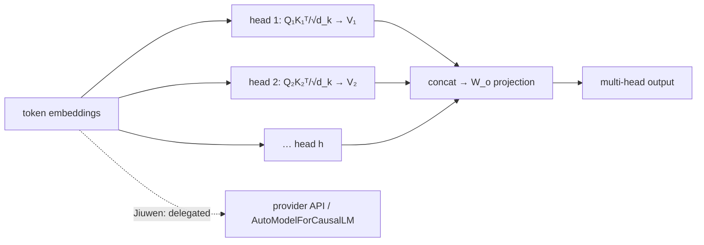

<sub>**Anchors:**<br>&bull; `agent-core/openjiuwen/core/foundation/llm/schema/config.py:13` — `ProviderType`; no head-count configuration</sub>

**Gap.** Absent. No number-of-heads configuration; attention architecture fully delegated.

---

## 10. Encoder-decoder vs decoder-only: give an example of each

*Already covered as entry 01-2 in the compiled knowledge base. See `knowledge/01-llm-foundations.md`.*

**General:** Encoder-decoder: T5, BART, original Transformer (translation, summarisation). Decoder-only: GPT series, LLaMA, Claude, Gemini (generation). See full answer in entry 01-2.

---

## 11. Fine-tuning vs prompt engineering: when would you choose one?

*Already covered across entries 17-1 through 17-3 and entries in section 02. See `knowledge/02-prompting-and-output-control.md` and `knowledge/17-fine-tuning-and-customization.md`.*

**General:** Prompt engineering first — faster, cheaper, no labelled data, fully reversible. Fine-tune when: the task requires a consistent style or behaviour that prompts cannot reliably produce, you have sufficient labelled examples (hundreds to thousands), and the cost of inference inference-time context is prohibitive. Fine-tuning changes the weights; prompting changes the input. See full analysis in entry 17-1.

---

## 12. Overfitting: explain it and how you'd prevent it

**General:** Overfitting occurs when a model learns the training data too well — including noise and idiosyncrasies — and fails to generalise to unseen examples. Training loss decreases but validation loss increases (the classic divergence signal).

Prevention:
- **More data / data augmentation** — the most reliable fix
- **Regularisation** — L2 (weight decay) penalises large weights; L1 encourages sparsity; dropout randomly zeroes activations during training, preventing co-adaptation
- **Early stopping** — stop training when validation loss stops improving
- **Reduce model capacity** — smaller architecture, fewer parameters
- **Cross-validation** — use held-out data properly; k-fold ensures evaluation is not from the lucky split

In LLM fine-tuning specifically: use LoRA/PEFT to reduce the number of trainable parameters; keep fine-tuning steps conservative; monitor validation perplexity.

**Jiuwen:** Not a concern in the inference framework. In `agent_rl/`, training hyperparameters (weight decay, dropout, early stopping via epoch limits) are configuration parameters forwarded to veRL. The evaluation harness in `agent_evolving/eval/` can track validation metrics to detect divergence.

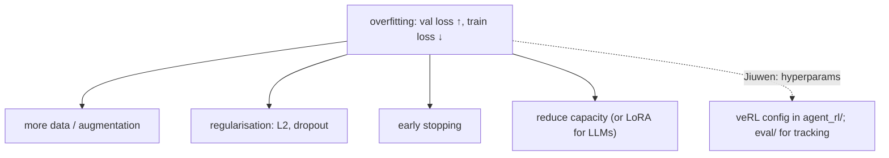

<sub>**Anchors:**<br>&bull; `agent-core/openjiuwen/agent_evolving/agent_rl/` — training hyperparams including weight decay, dropout, epoch limits<br>&bull; `agent-core/openjiuwen/agent_evolving/eval/` — validation metric tracking</sub>

**Gap.** Not a concern in the inference framework. Config-level in the training subsystem.

---

# Round 3: LLMs + RAG

## 13. How does a RAG pipeline work, end to end?

*Already covered as entry 10-1 in the compiled knowledge base. See `knowledge/10-rag-pipelines-and-patterns.md`.*

---

## 14. How would you choose a chunking strategy for mixed content types?

**General:** Mixed content (prose, tables, code, headings, bullet lists) breaks badly with fixed-size chunking because sentence and structural boundaries do not align with character counts. Strategies by content type:

- **Prose:** sentence-boundary or paragraph-boundary chunking; 200–500 tokens with 10–20% overlap
- **Tables:** keep each row or a group of rows together; never split a header from its data; consider serialising rows to key-value text for embedding
- **Code:** function or class boundaries; never split in the middle of a function body; include the function signature in every chunk that references it
- **Headings/structure:** include the heading hierarchy in each chunk (section title prepended) so the chunk is self-contained

In practice: a format-aware splitter that detects content type by element tag (if HTML/markdown parsed) or heuristic (line starts with `def`, `class`, `|`) and applies different splitting rules per type. Fallback to sentence splitter for unknown formats.

**Jiuwen:** `SimpleKnowledgeBase.add_documents` calls `chunker.chunk_documents`. The `Chunker` interface accepts pluggable strategies; the framework ships a default text chunker. There is no built-in mixed-content-aware router in the open-source layer, but the pluggable interface allows custom chunkers per document type to be wired in.

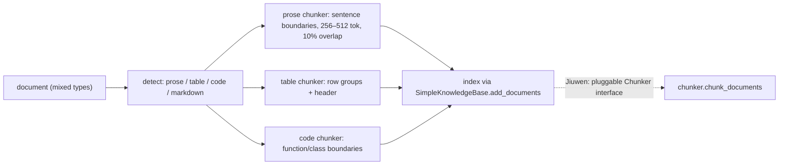

<sub>**Anchors:**<br>&bull; `agent-core/openjiuwen/extensions/knowledge_base/knowledge_base.py` — `SimpleKnowledgeBase.add_documents`<br>&bull; `agent-core/openjiuwen/extensions/knowledge_base/chunk/` — `Chunker` interface and implementations</sub>

**Gap.** No built-in mixed-content-type router. Pluggable chunker interface allows custom strategies per format.

---

## 15. Dense retriever vs sparse (BM25): when would you use hybrid?

*Already covered as entry 11-3 in the compiled knowledge base. See `knowledge/11-retrieval-and-ranking.md`.*

---

## 16. How do you evaluate a RAG system beyond "does the answer look right"?

*Already covered across entries 15-1 through 15-5. See `knowledge/15-evaluation.md`.*

---

## 17. What causes hallucination, and how do you reduce it?

*Already covered across entries 01-x (model causes) and 13-x (RAG failure modes). See `knowledge/01-llm-foundations.md` and `knowledge/13-rag-failure-modes-and-evaluation.md`.*

---

## 18. How would you handle a knowledge base that updates frequently without re-embedding everything?

*Already covered as entry 14-x. See `knowledge/14-rag-system-design.md`.*

---

## 19. Tradeoff between context window size and retrieval precision

**General:** A large context window appears to reduce the need for retrieval — just stuff everything in. The tradeoff is:

- **Attention dilution:** models lose precision on information buried in the middle of long contexts ("lost in the middle" phenomenon). Retrieval brings only the relevant chunks to the front.
- **Cost:** token cost is approximately linear in context length; at scale, retrieving 5 chunks at 500 tokens each is far cheaper than 128k-token contexts per query.
- **Precision vs recall:** large context = higher recall (less likely to miss relevant content) but lower precision per token (more noise). Retrieval with a reranker = higher precision, lower recall. Hybrid: retrieve 50 candidates, rerank to 5, pass to LLM.
- **Freshness:** retrieval can update the knowledge source without retraining; a large context just moves the problem (you still need to choose what to include).

The right answer is almost never "use the biggest context window possible" — precision, cost, and latency argue for targeted retrieval even as windows grow.

**Jiuwen:** Both dimensions are present. The context engine enforces a token budget (`DEFAULT_CONTEXT_MAX_TOKENS = 200000`) and compresses/offloads when exceeded. The retrieval layer returns top-k chunks to stay within that budget. `KnowledgeRetrievalComponent` assembles context text from ranked results before passing to the LLM component.

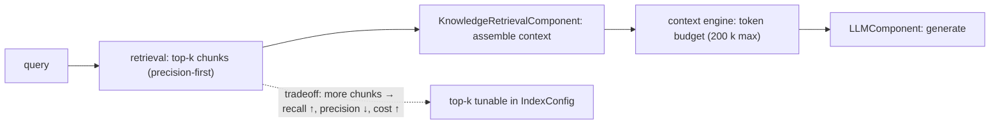

<sub>**Anchors:**<br>&bull; `agent-core/openjiuwen/core/context_engine/context/context_utils.py:20` — `DEFAULT_CONTEXT_MAX_TOKENS = 200000`<br>&bull; `agent-core/openjiuwen/extensions/knowledge_base/schema/index_config.py` — `top_k` configuration<br>&bull; `agent-core/openjiuwen/extensions/knowledge_base/components/knowledge_retrieval_component.py` — assembles context from ranked results</sub>

---

# Round 4: Agents + System Design

## 20. Design a system that routes requests across multiple LLM providers based on cost and latency

**General:** A router sits between the application and multiple provider clients. It maintains a live model registry with per-model cost-per-token and observed p50/p95 latency (updated via exponential moving average). Routing policy: classify the request by complexity (e.g., token estimate, task type), then apply a cost-latency objective — cheapest model whose latency SLO is met for that complexity tier. Fallback: if primary provider returns a rate-limit error, route to next-cheapest. Circuit-breaker per provider to avoid hammering a degraded endpoint. Shadow traffic a small % to new models to keep latency estimates fresh.

Key considerations: cached responses bypass routing entirely. Streaming changes latency measurement (TTFT vs total). Prompt format may differ per provider (tokenizer, system-prompt position).

**Jiuwen:** `ProviderType` and `ModelClientConfig` are the routing abstractions. Each adapter wraps a specific provider client. The framework supports multiple provider clients and selects via config; there is no built-in dynamic cost-latency router, but the pluggable model-client layer is the correct place to implement one.

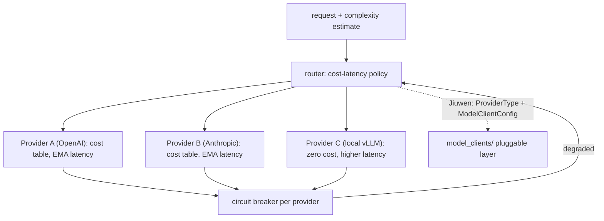

<sub>**Anchors:**<br>&bull; `agent-core/openjiuwen/core/foundation/llm/schema/config.py:13` — `ProviderType` enum; routing entry point<br>&bull; `agent-core/openjiuwen/core/foundation/llm/model_clients/` — per-provider client implementations<br>&bull; `agent-core/openjiuwen/core/foundation/llm/model_clients/openai_model_client.py` — example provider client</sub>

**Gap.** No built-in dynamic cost-latency router. `ProviderType` + `ModelClientConfig` is the static routing layer; a dynamic router would be implemented above it.

---

## 21. How would you implement fallback if a model call fails or times out?

**General:** At minimum: wrap every model call with a try/except, catch `RateLimitError`, `TimeoutError`, and provider-specific HTTP 5xx, and retry with exponential backoff (e.g., 1s, 2s, 4s, cap at 30s) up to N attempts. Beyond retry: fallback to a secondary model (smaller, different provider), then optionally a cached or degraded response. For timeouts specifically: set an explicit `asyncio.wait_for(timeout=X)` rather than relying on the provider's own timeout which may be silent.

Circuit breaker pattern: after K consecutive failures to a provider, stop routing to it for a cooldown window, reducing pressure on a degraded endpoint.

**Jiuwen:** The framework has retry logic at the model-client level. `openai_model_client.py` and other provider clients wrap API calls with retry decorators. The `ContextEngine.recover_from_model_exception` handles the specific case of context-overflow errors. There is no built-in cross-provider fallback; the retry is single-provider.

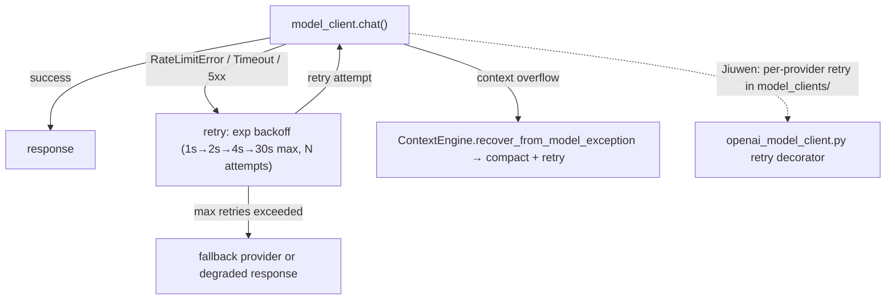

<sub>**Anchors:**<br>&bull; `agent-core/openjiuwen/core/foundation/llm/model_clients/openai_model_client.py` — retry logic on API errors<br>&bull; `agent-core/openjiuwen/core/context_engine/context_engine.py` — `recover_from_model_exception`: overflow → compact → retry</sub>

**Gap.** Single-provider retry present. Cross-provider fallback not built in; would be implemented in the router layer above `ModelClientConfig`.

---

## 22. Explain the ReAct pattern — how reasoning interleaves with tool calls

*Already covered as entry 05-7 in the compiled knowledge base. See `knowledge/05-agent-fundamentals-and-the-loop.md`.*

---

## 23. How would you manage context/state across a multi-turn agent conversation?

*Already covered across entries 07-1 through 07-5. See `knowledge/07-planning-memory-and-state.md`.*

---

## 24. How do you monitor an LLM system in production — what metrics matter?

*Already covered as entry 16-x. See `knowledge/16-production-cost-and-scale.md`.*

---

## 25. How would you prevent a public-facing agent from being abused (prompt injection, cost blowout)?

*Already covered across entries 18-1 through 18-5. See `knowledge/18-security-and-safety.md`.*

---

## Coverage map — new vs already in KB

| Question | Status |
|---|---|
| Gradient descent from scratch | **New — not in KB** |
| Cosine similarity from scratch | **New — not in KB** |
| Precision / recall / F1 from confusion matrix | **New — not in KB** |
| K-nearest neighbors from scratch | **New — not in KB** |
| Forward pass and backpropagation | **New — not in KB** |
| Vanishing / exploding gradient | **New — not in KB** |
| Batch norm vs layer norm | **New — not in KB** |
| Attention mechanism step by step | Covered: entry 01-1 |
| Why multi-head attention | **New — not in KB** |
| Encoder-decoder vs decoder-only | Covered: entry 01-2 |
| Fine-tuning vs prompt engineering | Covered: entries 17-1, 02-x |
| Overfitting: explain and prevent | **New — not in KB** |
| RAG pipeline end to end | Covered: entry 10-1 |
| Chunking strategy for mixed content | **New angle — partially covered** |
| Dense vs sparse / hybrid retrieval | Covered: entry 11-3 |
| Evaluate RAG beyond "looks right" | Covered: entries 15-1 through 15-5 |
| Hallucination causes and reduction | Covered: entries 01-x, 13-x |
| KB updates without full re-embedding | Covered: entry 14-x |
| Context window vs retrieval precision | **New angle — not in KB** |
| Multi-provider routing by cost/latency | **New — not in KB** |
| Fallback on model call failure / timeout | **New — not in KB** |
| ReAct pattern | Covered: entry 05-7 |
| Context/state in multi-turn agent | Covered: entries 07-1 through 07-5 |
| Production monitoring metrics | Covered: entry 16-x |
| Prevent prompt injection / cost blowout | Covered: entries 18-x |
